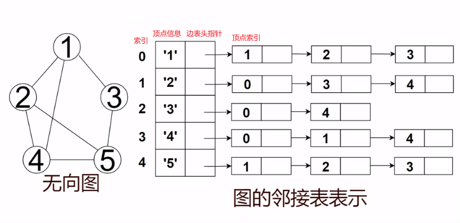
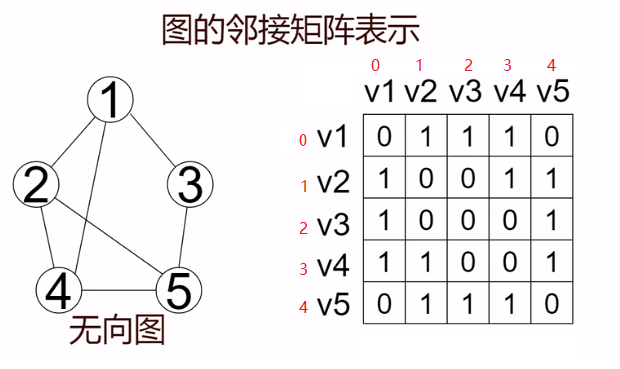

# 目录

[TOC]


# Algorithm

## 数据结构

### 数组

### 链表

### 栈

### 队列

### 树

#### 二叉树

##### 满二叉树

##### 完全二叉树

##### 二叉树的重要性质

##### 二叉树的遍历

前序

中序

后序

层序

已知前序中序求后序

已知后序中序求前序

##### 树的高度


#### 二叉搜索树

左子树都比根节点小，右子树都比根节点大。

#### 平衡搜索二叉树

(解决二插搜索树退化成链表的问题)

    1. 左子树都比根节点小，右子树都比根节点大。
    2. 左右子树高度差不超过1

#### AVL-tree:

  平衡因子：导致不平衡的最小子树的根节点

  ```
      5       5               5       5
     /         \             /         \
    3           8           3           8
   /             \           \         /
  1              10           4       7
1.左旋：以某个节点的右子树为根节点的右子树插入节点导致不平衡     
2.右旋: 以某个节点的左子树为根节点的左子树插入节点导致不平衡
3.左右旋: 以某个节点的左子树为根节点的右子树插入节点导致不平衡
4.右左旋: 以某个节点的右子树为根节点的左子树插入节点导致不平衡
  ```

#### rbtree

rb-tree特性:

1.   每个节点或者是红色，或者是黑色。
2.   根节点是黑色。
3.   叶子结点是黑色。
4.   如果一个节点是红色，那么他的左右孩子为黑色。
5.   从一个节点到该节点的子孙节点的所有路径上包含==相同数目的黑色节点。==


#### 二叉堆


### 哈希表  <a id="hashtable"></a>   [](#目录)

[无序容器](#unorderedContainers)

不同的key通过hash函数得到一个hashcode(哈希值/散列值), 通过哈希值放到哈希表中存储。

将关键字key通过hash函数转化成数组的下标。

时间复杂度为O(1)，最差为O(n)。使用空间换时间。

#### 哈希函数的设计

##### 直接定址法

取关键字key的某个线性函数为散列地址：Hash(key) = A * key + B.

优点：简单、均匀。缺点：需要事先知道关键字的分布情况。使用场景：适合查找比较小且连续的情况

##### 除留余数法

Hash(key)  = key % p(p为质数且p<=bucket_count).

##### 平方取中法

假设关键字为1234，对它平方就是1522756，抽取中间的3位227作为哈希地址； 再比如关键字为4321，对它平方就是18671041，抽取中间的3位671(或710)作为哈希地址。
		使用场景：不知道关键字的分布，而位数又不是特别大的情况。

##### 折叠法

折叠法是将关键字从左到右分割成位数相等的几部分(最后一部分位数可以短些)，然后将这几部分叠加求和，并根据哈希表表长，取后几位作为散列地址。

##### 随机函数法

选择一个随机函数，把关键字传入随机函数，计算得到的值作为哈希地址。即Hash(key) = random(key), random为随机函数。

使用场景: 关键字长度不等时采用。

##### 数学分析法

什么鬼玩意

#### 哈希冲突

不同的关键字通过hash函数计算得到相同的哈希值, 称为哈希冲突。

##### 开放定址法(闭散列)

**对于开放定址法，加载因子特别重要，应该控制在0.7~0.8以下。**超过0.8探查效率直线上升，所以一些使用开放定址法的hash库, 如java的系统库设置加载因子为0.75，超过则扩容hash表。

因此开放定址法的空间利用率比较低。(空间换时间，要啥自行车)

###### 线性探查

==从发生冲突的位置开始依次向后探测，直到找到空位置。==`Hash(key)=(hash(key)+i) % bucket_count.(i=0,1,2....)`

但是随着元素的增多，可能会出现元素连续的现象，那么线性探查就会一直探测到元素尾才能插入，这种现象叫做“数据堆积“。

优点：实现简单。缺点：”数据堆积“，探查次数增多。

###### 平方探查(二次探查)

我们在探测时可以不一个挨一个的探测，可以**跳跃着探测**，就避免了一次“数据堆积”。

`Hash(key)=(hash(key) + i^2) % bucket_count.` 或者 `Hash(key)=(hash(key) - i^2) % bucket_count.`(i=0,1,2,3......)

甚至可以扩展的更复杂一些：

`Hash(key)=(hash(key) + i + i^2) % bucket_count`。

虽然平方探测解决了线性探测的问题，但是也有一个小问题，当不同的key得到的散列值是相同的时候，它们的探测路径都是一样。所以对于许多落在同一位置的key来说，越后插入的元素，探测次数越多。这种现象称为==“二次堆积”==。

之所以出现探测路径相同的现象是因为计算过程中始终依赖“i”这个变量，它并不会因为key的不同而变化。所以我们可以再用一个hash函数乘以“i”：`Hash(key)=(hash(key) + hash_1(key)*i) % bucket_count` 来找到合适的位置。==(双散列)==

###### 随机探测

`Hash(key)=(hash(key) + random) % bucket_count.`

##### 链地址法

数组+链表 -> 数组+红黑树。

==链表采用头插法，原因是新加入的元素很有可能被再次访问到，所以放到最前面就不用遍历链表了。==

最差情况：一个桶内插入多个节点。

最好情况：每个桶只放一个节点，当再插入节点时，hash表扩容(即加载因子为1)。

##### rehash法

装载因子 = 元素个数 / bucket_count。 当装载因子超过阈值时，hash表扩容，容量选下一个==素数==(除了1和它本身不能被其他整数整除)。

##### 公共溢出区

把hash冲突的元素放到溢出表。

## 算法

### sort

时间复杂度：


#### bubble sort


#### select sort


#### insert sort

#### shell sort

#### quick sort


#### merge sort


#### heap sort


### search

#### linear search

#### binary search

##### 递归方式


##### 迭代方式


### Graph Theory

#### 图的存储

##### 顺序存储结构

邻接矩阵：就是一个==二维数组==，表示顶点之间==相邻关系==的矩阵。矩阵的行和列都表示顶点。矩阵中的元素表示边。

**对于无向图邻接矩阵是对称的，对于有向图是非对称的**。

对于无向图：邻接矩阵的第i行(或第j列)的==非零元素的个数==，是第i个结点的度。

对于有向图：邻接矩阵的**第i行**的==非零元素的个数==，是第i个结点的==出度==的个数；**第i列**的==非零元素的个数==是第i个结点的入度的个数。


##### 链式存储结构

邻接表：分为==顶点表==和==边表==。

1. 顶点表是个==数组==，表中结点的结构包含==顶点的信息==和该顶点==边表的头指针==。
2. 边表是单链表，存储着顶点的邻接点，相当于邻接矩阵的一行，链表结点的结构包括==顶点的索引==和==指向下个结点的指针==。

对于无向图：顶点的==度==等于边表的结点个数。

对于有向图：顶点的==出度==等于边表的结点个数。要想求顶点的入度，需要遍历整个邻接表，统计==该顶点出现的个数==。显然这种操作费时费力，所以可以建立逆邻接表，逆邻接表和邻接表的结构相同，不过边表存储的是==指向==顶点的结点。

**可以根据邻接矩阵的连通关系来创建邻接表。**



#### 图的遍历




##### DFS

一条路走到底，直到走不通时返回，再找一条路一直往下走，重复这个步骤，直到无路可走。

==原理==：从一结点v开始先访问开始结点，然后找到一个和v**==相邻且未被访问==**的结点w，访问w；然后找到一个和w**==相邻且未被访问==**的结点x,访问x; 以此类推**直到某一结点的所有邻接点都被访问**，然后==回退==，如果回退中的结点还有没被访问的邻接点，则任取一个重复以上步骤，直到所有结点都被访问过。

**递归版**算法步骤：有点像树的先序遍历迭代版

1. 访问当前结点，==标记==为已访问(visit数组记录访问情况)
2. 找到一个和当前结点==相邻==且==没被访问==的结点，把它设为当前结点，然后递归调用本函数。
3. 如果找不到步骤二这样的结点，则进行==回退==，若回退的结点中还有没访问的邻接点，则==重复1、2步骤==。

**迭代版**算法步骤：有点像树的先序遍历递归版

1. 访问开始结点，并==标记==为已访问(有个visit数组记录入栈情况)，压栈。
2. 进入while循环，循环条件是[==栈是否为空==]，出栈。
3. 找到一个和**当前结点**==相邻==且==没被访问==的邻接点。
4. 访问邻接点并标记为已访问，入栈，把它==设为当前结点==，然后执行步骤3。
5. 如果找不到步骤三这样的结点，则进行==回退(也就是出栈)==，若回退的结点中还有没访问的邻接点，把它设置为当前结点，重复步骤3、4。
6. 直到栈为空，退出循环，结束遍历。

##### BFS

==原理==：从某一结点v开始，先访问v，然后找到v的**==所有邻接点==**并进行访问；==分别==从这些邻接点出发访问它们==所有==未被访问的邻接点；依此类推，直到图中所有的结点都被访问过。

算法步骤：

1. 先访问开始结点，并标记为已访问，开始结点入队。
2. 进入while循环，循环条件是[==队列是否为空==]。
3. 结点出队。
4. 找到==出队结点==的所有邻接点，依次访问并标记，最后入队。
5. 重复步骤3、4，直到所有==队列为空==跳出循环，结束遍历。


#### Dijkstra


#### Astar


### HMM


### DBSCAN


## references:

[数据结构与算法(CC++实现)视频教程](../wangguilin/-3.5- 数据结构与算法(CC++实现)视频教程)

[数据结构与算法-王桂林-2nd .pdf](../wangguilin/-3.5- 数据结构与算法(CC++实现)视频教程/数据结构与算法-王桂林-2nd .pdf)

