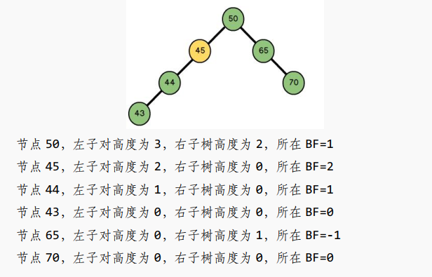

# 目录

- [目录](#目录)
- [Algorithm](#algorithm)
  - [数据结构](#数据结构)
    - [数组](#数组)
    - [链表](#链表)
    - [栈](#栈)
    - [队列](#队列)
    - [树](#树)
      - [树的术语](#树的术语)
        - [结点的度](#结点的度)
        - [树的度](#树的度)
        - [叶子结点](#叶子结点)
        - [结点的层次](#结点的层次)
        - [树的深度](#树的深度)
      - [二叉树](#二叉树)
        - [二叉树的存储](#二叉树的存储)
          - [顺序存储](#顺序存储)
          - [链式存储](#链式存储)
        - [满二叉树](#满二叉树)
        - [完全二叉树](#完全二叉树)
        - [二叉树的重要性质](#二叉树的重要性质)
          - [二叉树的第i(i\>=1)层最多有2^i-1^ 个结点](#二叉树的第ii1层最多有2i-1-个结点)
          - [深度为i(i\>=1)的二叉树最多有2^i-1^ 个结点](#深度为ii1的二叉树最多有2i-1-个结点)
          - [对于一颗非空的二叉树，如果叶子结点个数为n0，度为2的结点个数为n2，那么n0=n2+1](#对于一颗非空的二叉树如果叶子结点个数为n0度为2的结点个数为n2那么n0n21)
          - [性质四](#性质四)
        - [二叉树的遍历](#二叉树的遍历)
        - [树的高度](#树的高度)
      - [二叉搜索树](#二叉搜索树)
      - [平衡搜索二叉树](#平衡搜索二叉树)
        - [AVL-tree](#avl-tree)
        - [rbtree](#rbtree)
          - [rb-tree特性](#rb-tree特性)
    - [二叉堆](#二叉堆)
      - [构建堆](#构建堆)
      - [结点的上浮和下沉](#结点的上浮和下沉)
      - [堆排序](#堆排序)
        - [为什么堆顶要和最后一个元素交换？和其他元素交换不行吗？](#为什么堆顶要和最后一个元素交换和其他元素交换不行吗)
        - [堆排序算法步骤](#堆排序算法步骤)
    - [哈希表     ](#哈希表-----)
      - [哈希函数的设计](#哈希函数的设计)
        - [直接定址法](#直接定址法)
        - [除留余数法](#除留余数法)
        - [平方取中法](#平方取中法)
        - [折叠法](#折叠法)
        - [随机函数法](#随机函数法)
        - [数学分析法](#数学分析法)
      - [哈希冲突](#哈希冲突)
        - [开放定址法(闭散列)](#开放定址法闭散列)
          - [线性探查](#线性探查)
          - [平方探查(二次探查)](#平方探查二次探查)
          - [随机探测](#随机探测)
        - [链地址法](#链地址法)
        - [rehash法](#rehash法)
        - [公共溢出区](#公共溢出区)
  - [算法](#算法)
    - [sort](#sort)
      - [bubble sort](#bubble-sort)
      - [select sort](#select-sort)
      - [insert sort](#insert-sort)
      - [shell sort](#shell-sort)
      - [quick sort](#quick-sort)
      - [merge sort](#merge-sort)
      - [heap sort](#heap-sort)
    - [search](#search)
      - [linear search](#linear-search)
      - [binary search](#binary-search)
        - [递归方式](#递归方式)
        - [迭代方式](#迭代方式)
    - [Graph Theory](#graph-theory)
      - [图的存储](#图的存储)
        - [顺序存储结构](#顺序存储结构)
        - [链式存储结构](#链式存储结构)
      - [图的遍历](#图的遍历)
        - [DFS](#dfs)
        - [BFS](#bfs)
        - [应用：迷宫问题找路径](#应用迷宫问题找路径)
      - [Dijkstra](#dijkstra)
      - [Astar](#astar)
    - [HMM](#hmm)
    - [DBSCAN](#dbscan)
  - [references:](#references)


# Algorithm

## 数据结构

### 数组

### 链表

### 栈

### 队列

### 树

#### 树的术语


##### 结点的度

结点的子树个数。

##### 树的度

树的所有结点中最大的度。对于二叉树来说最大度为2。

##### 叶子结点

度为0的结点。

##### 结点的层次

规定根节点在1层，其他结点的层次是其父节点的层次加1。

##### 树的深度

树的所有结点中的最大层次是树的深度。

#### 二叉树

##### 二叉树的存储

###### 顺序存储


###### 链式存储

```c++
struct Tree {
	int data;
	struct Tree* left;
	struct Tree* right;
};
```


##### 满二叉树

==除叶子结点外所有结点都有左右子树，而且所有叶子结点在同一层上。==

##### 完全二叉树

除最后一层，每一层上的结点数均达到最大值；最后一层会==依次向后==增加节点而不是跳跃增加。最后一层只==连续缺少==右边的若干结点。

##### 二叉树的重要性质

###### 二叉树的第i(i>=1)层最多有2^i-1^ 个结点


###### 深度为i(i>=1)的二叉树最多有2^i-1^ 个结点


###### 对于一颗非空的二叉树，如果叶子结点个数为n0，度为2的结点个数为n2，那么n0=n2+1


###### 性质四


1. 规定一颗包含n个节点的二叉树从0开始编号，当i=0时，该节点是根节点，无双亲节点。
2. 当i>0时，i节点的父节点是==(i-1)/2==。
3. 当2i+1<n时，i节点的左孩子是==2i+1==。
4. 当2i+2<n时，i节点的右孩子是==2i+2==。


##### 二叉树的遍历


前序：根左右

非递归:

1. 先判断根节点是否为空，如果为空则返回。
2. 进入外层while循环，循环条件是[ **结点不为空 || 栈不为空** ] 
3. 进入内层while循环，循环条件是[结点不为空]，**把左孩子依次压入栈**(root=root->left)，压入之前访问结点。
4. 如果第三步的左节点都压完了，则跳出内层while循环，栈顶元素出栈，访问栈顶元素的右孩子，继续进入内层循环。
5. 直至外层栈为空，结束遍历。

```c++
void preOrderIteratorWithStack(TreeNode *root) {
    if (root == NULL)
        return;
    std::stack<TreeNode *> st;
    while (root || !st.empty())// 对root要进行判断，防止在弹出根节点时栈为空而root不为空
    {
        while (root)    // 左孩子一直入栈
        {
            printf("data:%d ", root->_data);    // 在入栈之前访问元素，正好是先访问根节点
            st.push(root);
            root = root->_left;
        }

        TreeNode *top = st.top();
        root = top->_right;
        st.pop();
    }
    putchar(10);
}
```

中序：左根右

非递归：和先序非递归遍历步骤一样，只不过是在出栈的时候访问元素。

```c++
void inOrderIteratorWithStack(TreeNode *root) {
    if (root == NULL)
        return;
    std::stack<TreeNode *> st;
    while (root || !st.empty()) {
        while (root) {    // 左孩子一直入栈
            st.push(root);
            root = root->_left;
        }

        if (!st.empty()) { // 需要判空，如果是单边树访问数据会崩
            TreeNode *top = st.top();
            printf("data:%d ", top->_data); // 左孩子出栈的时候访问
            root = top->_right;
            st.pop();
        }
    }
    putchar(10);
}
```

后序：左右根

非递归：

1. 先把根节点入栈
2. 进入while循环，循环条件是[栈不为空]，取栈顶元素(==不出栈==)，设置为当前结点。
3. 如果当前结点是==叶子结点==或者当前的结点的左右结点都已经被输出过(==需要一个指针保存前一个结点==)，则访问当前结点并==出栈==，把当前结点设置为上一个结点。
4. 若不满足步骤3，则依次把右结点和左节点压栈(==先右后左==)，然后进入步骤二。
5. 直到栈为空，遍历结束。

```c++
void postOrderIteratorWithStack(TreeNode *root) {
    if (root == NULL)
        return;
    std::stack<TreeNode *> st;
    st.push(root);
    TreeNode *pre = NULL;
    while (!st.empty()) {
        TreeNode *cur = st.top();
       // 如果当前结点是叶子结点或者当前的结点的左右孩子都已经被访问过了，则访问当前结点并出栈，并把当前结点设置为前一个结点
        if ((cur->_left == NULL && cur->_right == NULL) || 
            ((pre != NULL) && (pre == cur->_left || pre == cur->_right))
            ) {
            printf("data:%d ", cur->_data);
            st.pop();
            pre = cur;	// 当前结点设置前一个结点
        }
        else {	// 先压有后压左
            if (cur->_right) {
                st.push(cur->_right);
            }
            if (cur->_left) {
                st.push(cur->_left);
            }
        }
    }
    putchar(10);
}
```

层序：利用队列

已知前序中序求后序

已知后序中序求前序

已知先序和后序不能唯一确定一颗二叉树

##### 树的高度

```c
int tree_depth(tree* root) {
	int maxH, leftH, rightH;
	if(root) {
		leftH = tree_depth(root->left);
		rightH = tree_depth(root->right);
		maxH = leftH > rightH ? leftH : rightH;
		return maxH+1;
	}
	else {
		return 0;
	}
}
```


#### 二叉搜索树

1. 左子树所有结点的值都比根节点小
2. 右子树所有结点的值都比根节点大。

中序遍历得到一个递增的序列。

根据二叉搜索树的性质：树的最小值结点是最左端结点，最大值结点是最右端结点。

BST节点的删除有三种情况：

1. 没有子节点: 直接删除
2. 有一个子节点: 被删除节点的父节点指向被删除节点的左孩子或右孩子。(也就是被删节点的父节点指向子孙节点)
3. 有两个子节点: 
   1. 先找到被删节点的右子树的最小节点。(二叉搜索是有序的，子树的最小结点就是最左端的结点。)
   2. 把最小节点的值赋值给被删节点。
   3. 再去删除右子树的最小值节点。(这样就把3变成1、2这两种情况)

#### 平衡搜索二叉树

解决二插搜索树退化成链表的问题。

1. 左子树都比根节点小，右子树都比根节点大。
2. **左右子树高度差不超过1**。

**平衡因子**：某个节点的==左子树高度减去右子树高度的值==称为该节点的==平衡因子==(BF: balance factor)。



对于平衡二叉树，BF的范围在[-1,1]，如果平衡因子不在此区间，则需要进行调整。

**最小不平衡子树**：


左边二叉树的节点 45 的 BF = 1， 插入节点 43 后， 节点 45 的 BF = 2。 节点 45 是距离插入点 43 ==最近==的 BF 不在[-1,1]范围内的节点， 因此==以节点 45 为根的子树==为最小不平衡子树。  

插入和删除都有可能导致树失去平衡，所以失衡调整就是找到==最小不平衡子树==，消灭不平衡因子。

##### AVL-tree

  平衡因子：导致不平衡的最小子树的根节点

  ```c
      5       5               5       5
     /         \             /         \
    3           8           3           8
   /             \           \         /
  1              10           4       7
1.左旋：以某个节点的右子树为根节点的右子树插入节点导致不平衡     
2.右旋: 以某个节点的左子树为根节点的左子树插入节点导致不平衡
3.左右旋: 以某个节点的左子树为根节点的右子树插入节点导致不平衡
4.右左旋: 以某个节点的右子树为根节点的左子树插入节点导致不平衡
  ```

AVL树 **用插入的成本(左旋右旋)来弥补查询效率低**，但是当**插入操作比查询操作多**的情况效率会很低，这就需要RBtree来解决。

##### rbtree

红黑树的旋转操作比AVL树要少，保证查询效率的同时也保证了插入效率。

最长子树不超过最短子树的2倍即可。

###### rb-tree特性

1.   每个节点或者是红色，或者是黑色。
2.   根节点是黑色。
3.   叶子结点是黑色。
4.   如果一个节点是红色，那么他的左右孩子为黑色。
5.   从一个节点到该节点的子孙节点的所有路径上包含==相同数目的黑色节点。==


### 二叉堆

二叉堆是一颗**完全二叉树**。使用==数组==存储。某个节点的左孩子是==2i+1==，某个节点的右孩子是==2i+2==，某个节点的父节点是==(i-1)/2==。(i是数组下标)

大顶堆：每个节点都大于等于其左孩子和右孩子。

小顶堆：每个节点都小于等于其左孩子和右孩子。

#### 构建堆<a id="buildheap"></a>

1. 从==最后一个非叶子结点==开始调整([下沉](#上浮和下沉))，调整倒数第二个非叶子结点，调整倒数第三个非叶子结点 ... ==直到根节点==。
2. 一颗含有n个结点的完全二叉树，如果从0开始编号，那么编号**大于**==`(n-1)/2`==的结点均没有孩子结点(即叶子结点)，(n-1)/2号结点为最后一个非叶子结点。
3. 建堆的过程其实也是结点下沉的过程。


#### 结点的上浮和下沉<a id="上浮和下沉"></a>

**以小顶堆为例：**

插入节点（上浮）：新插入的结点和其父节点比较，如果新节点比父节点*<u>**小**</u>*则二者进行交换。这个操作也称为==上浮==。上浮之后继续和它的父节点进行比较，直到父节点的值*<u>**小于等于**</u>*新插入节点的值才停止上浮。

删除节点（下沉）：将堆中最后一个元素和堆顶元素交换(也就是第一个元素)，堆顶元素和其左右孩子相比较，让左右结点中***<u>较小</u>***的值和堆顶元素交换，这个操作称为==下沉==。下沉之后继续和它的左右孩子比较，直到==下沉节点==的值***<u>小于等于</u>***其左右孩子才停止下沉。

**以大顶堆为例：**

插入节点（上浮）：新插入的结点和其父节点比较，如果新节点比父节点*<u>**大**</u>*则二者进行交换。这个操作也称为==上浮==。上浮之后继续和它的父节点进行比较，直到父节点的值*<u>**大于等于**</u>*新插入节点的值才停止上浮。

删除节点（下沉）：将堆中最后一个元素和堆顶元素交换(也就是第一个元素)，堆顶元素和其左右孩子相比较，让左右结点中**<u>*较大*</u>**的值和堆顶元素交换，这个操作称为==下沉==。下沉之后继续和它的左右孩子比较，直到==下沉节点==的值**<u>*大于等于*</u>**其左右孩子才停止下沉。

#### 堆排序<a id="heapsort"></a>

时间复杂度：O(log(n))。稳定性：不稳定。

##### 为什么堆顶要和最后一个元素交换？和其他元素交换不行吗？

答：删除节点后还要保持完全二叉树的性质。

##### 堆排序算法步骤

1. [构建堆](#buildheap)
2. 交换堆顶元素和最后一个元素。
3. 交换完以后，数组==长度减一==，而且堆顶元素元素有可能满足大/小根堆的条件，因此从根节点[调整堆](#上浮和下沉)(==结点下沉==)。
4. 重复2、3步骤，直到数组长度为1(就剩1个元素不用交换)。


### 哈希表  <a id="hashtable"></a>   [](#目录)

[无序容器](#unorderedContainers)

不同的key通过hash函数得到一个hashcode(哈希值/散列值), 通过哈希值放到哈希表中存储。

将关键字key通过hash函数转化成数组的下标。

时间复杂度为O(1)，最差为O(n)。使用空间换时间。

#### 哈希函数的设计

##### 直接定址法

取关键字key的某个线性函数为散列地址：Hash(key) = A * key + B.

优点：简单、均匀。缺点：需要事先知道关键字的分布情况。使用场景：适合查找比较小且连续的情况

##### 除留余数法

Hash(key)  = key % p(p为质数且p<=bucket_count).

##### 平方取中法

假设关键字为1234，对它平方就是1522756，抽取中间的3位227作为哈希地址； 再比如关键字为4321，对它平方就是18671041，抽取中间的3位671(或710)作为哈希地址。
		使用场景：不知道关键字的分布，而位数又不是特别大的情况。

##### 折叠法

折叠法是将关键字从左到右分割成位数相等的几部分(最后一部分位数可以短些)，然后将这几部分叠加求和，并根据哈希表表长，取后几位作为散列地址。

##### 随机函数法

选择一个随机函数，把关键字传入随机函数，计算得到的值作为哈希地址。即Hash(key) = random(key), random为随机函数。

使用场景: 关键字长度不等时采用。

##### 数学分析法

什么鬼玩意

#### 哈希冲突

不同的关键字通过hash函数计算得到相同的哈希值, 称为哈希冲突。

##### 开放定址法(闭散列)

**对于开放定址法，加载因子特别重要，应该控制在0.7~0.8以下。**超过0.8探查效率直线上升，所以一些使用开放定址法的hash库, 如java的系统库设置加载因子为0.75，超过则扩容hash表。

因此开放定址法的空间利用率比较低。(空间换时间，要啥自行车)

###### 线性探查

==从发生冲突的位置开始依次向后探测，直到找到空位置。==`Hash(key)=(hash(key)+i) % bucket_count.(i=0,1,2....)`

但是随着元素的增多，可能会出现元素连续的现象，那么线性探查就会一直探测到元素尾才能插入，这种现象叫做“数据堆积“。

优点：实现简单。缺点：”数据堆积“，探查次数增多。

###### 平方探查(二次探查)

我们在探测时可以不一个挨一个的探测，可以**跳跃着探测**，就避免了一次“数据堆积”。

`Hash(key)=(hash(key) + i^2) % bucket_count.` 或者 `Hash(key)=(hash(key) - i^2) % bucket_count.`(i=0,1,2,3......)

甚至可以扩展的更复杂一些：

`Hash(key)=(hash(key) + i + i^2) % bucket_count`。

虽然平方探测解决了线性探测的问题，但是也有一个小问题，当不同的key得到的散列值是相同的时候，它们的探测路径都是一样。所以对于许多落在同一位置的key来说，越后插入的元素，探测次数越多。这种现象称为==“二次堆积”==。

之所以出现探测路径相同的现象是因为计算过程中始终依赖“i”这个变量，它并不会因为key的不同而变化。所以我们可以再用一个hash函数乘以“i”：`Hash(key)=(hash(key) + hash_1(key)*i) % bucket_count` 来找到合适的位置。==(双散列)==

###### 随机探测

`Hash(key)=(hash(key) + random) % bucket_count.`

##### 链地址法

数组+链表 -> 数组+红黑树。

==链表采用头插法，原因是新加入的元素很有可能被再次访问到，所以放到最前面就不用遍历链表了。==

最差情况：一个桶内插入多个节点。

最好情况：每个桶只放一个节点，当再插入节点时，hash表扩容(即加载因子为1)。

##### rehash法

装载因子 = 元素个数 / bucket_count。 当装载因子超过阈值时，hash表扩容，容量选下一个==素数==(除了1和它本身不能被其他整数整除)。

##### 公共溢出区

把hash冲突的元素放到溢出表。


### B树

#### B树的引入

从磁盘查找数据效率低，一般是什么原因？

1.   读写**数据越大**速度越慢。
2.   读写**次数越多**速度越慢。


#### 为什么不能用二叉树作为数据库索引？

如果使用二叉树，插入的数据越多，则树的深度越深，严重影响读取/查找的效率。既然二叉搜索树有效率问题，那么就用多叉搜索树，所以**B树就是一颗有序的多路查询树**。


### B+树


## 算法

### sort

时间复杂度：


#### bubble sort

#### select sort

#### insert sort

#### shell sort

#### quick sort

#### merge sort

#### heap sort

### search

#### linear search

#### binary search

##### 递归方式


##### 迭代方式


### Graph Theory

#### 图的存储

##### 顺序存储结构

邻接矩阵：就是一个==二维数组==，表示顶点之间==相邻关系==的矩阵。矩阵的行和列都表示顶点。矩阵中的元素表示边。

**对于无向图邻接矩阵是对称的，对于有向图是非对称的**。

对于无向图：邻接矩阵的第i行(或第j列)的==非零元素的个数==，是第i个结点的度。

对于有向图：邻接矩阵的**第i行**的==非零元素的个数==，是第i个结点的==出度==的个数；**第i列**的==非零元素的个数==是第i个结点的入度的个数。


##### 链式存储结构

邻接表：分为==顶点表==和==边表==。

1. 顶点表是个==数组==，表中结点的结构包含==顶点的信息==和该顶点==边表的头指针==。
2. 边表是单链表，存储着顶点的邻接点，相当于邻接矩阵的一行，链表结点的结构包括==顶点的索引==和==指向下个结点的指针==。

对于无向图：顶点的==度==等于边表的结点个数。

对于有向图：顶点的==出度==等于边表的结点个数。要想求顶点的入度，需要遍历整个邻接表，统计==该顶点出现的个数==。显然这种操作费时费力，所以可以建立逆邻接表，逆邻接表和邻接表的结构相同，不过边表存储的是==指向==顶点的结点。

```c
struct EdgeNode
{
    int verNodeIndex;   // 顶点的索引
    EdgeNode* next;     // 指向下个结点的指针
};

struct VertexNode
{
    int data;       // 顶点的数据
    EdgeNode* head; // 链表的头指针，边表单链表
};

struct Graph    // 图的邻接表表示
{
    std::vector<VertexNode> g;  // 顶点表
    int nodeNum;
};
```

**可以根据邻接矩阵的连通关系来创建邻接表。**

```c++
// 通过邻接矩阵创建邻接表
void createGraph(Graph &graph, vector<vector<int>> &m, int n) {
    std::vector<VertexNode> &g = graph.g;
    graph.nodeNum = n;
    g.resize(n);
    for (int i = 0; i < n; i++) {
        g[i].data = i;
        g[i].head = NULL;
        // 邻接矩阵的一行代表所有邻接点，也就是边表，由于采用头插法，所以先从最后一个元素开始插入
        for (int j = n - 1; j >= 0; j--) {
            if (m[i][j] != 0) {
                EdgeNode *edgeNode = new EdgeNode; // 创建边表的结点。
                edgeNode->verNodeIndex = j;
                edgeNode->next = g[i].head; // 头插法
                g[i].head = edgeNode;
            }
        }
    }
}

// 清空边表的结点(删除单链表)
void clearGraph(Graph &graph) {
    for (int i = 0; i < graph.nodeNum; i++) {
        EdgeNode *p = graph.g[i].head;
        while (p != NULL) {
            EdgeNode *t = p->next;
            delete p;
            p = t;
        }
    }
}
```


#### 图的遍历


##### DFS

一条路走到底，直到走不通时返回，再找一条路一直往下走，重复这个步骤，直到无路可走。

==原理==：从一结点v开始先访问开始结点，然后找到一个和v**==相邻且未被访问==**的结点w，访问w；然后找到一个和w**==相邻且未被访问==**的结点x,访问x; 以此类推**直到某一结点的所有邻接点都被访问**，然后==回退==，如果回退中的结点还有没被访问的邻接点，则任取一个重复以上步骤，直到所有结点都被访问过。

**递归版**算法步骤：有点像树的先序遍历迭代版

1. 访问当前结点，==标记==为已访问(visit数组记录访问情况)
2. 找到一个和当前结点==相邻==且==没被访问==的结点，把它设为当前结点，然后递归调用本函数。
3. 如果找不到步骤二这样的结点，则进行==回退==，若回退的结点中还有没访问的邻接点，则==重复1、2步骤==。

**迭代版**算法步骤：有点像树的先序遍历递归版

1. 访问开始结点，并==标记==为已访问(有个visit数组记录入栈情况)，压栈。
2. 进入while循环，循环条件是[==栈是否为空==]，出栈。
3. 找到一个和**当前结点**==相邻==且==没被访问==的邻接点。
4. 访问邻接点并标记为已访问，入栈，把它==设为当前结点==，然后执行步骤3。
5. 如果找不到步骤三这样的结点，则进行==回退(也就是出栈)==，若回退的结点中还有没访问的邻接点，把它设置为当前结点，重复步骤3、4。
6. 直到栈为空，退出循环，结束遍历。

```c
void DFS_recursive(Graph *g, int start, int *visited)// visited为标记数组
{
    visit(g, start, visited);   // 1.访问当前结点，并标记当前结点为已访问
    for (int i = 0; i < N; i++) // 2.找到一个与当前结点相邻且未被访问的结点
    {
        if (g->matrix[start][i] == 1 && visited[i] == 0)	//matrix为邻接矩阵
        {
            DFS_recursive(g, i, visited); // 把邻接点作为当前结点并进行递归操作。
        }
    }
}
```


##### BFS

==原理==：从某一结点v开始，先访问v，然后找到v的**==所有邻接点==**并进行访问；==分别==从这些邻接点出发访问它们==所有==未被访问的邻接点；依此类推，直到图中所有的结点都被访问过。

算法步骤：

1. 先访问开始结点，并标记为已访问，开始结点入队。
2. 进入while循环，循环条件是[==队列是否为空==]。
3. 结点出队。
4. 找到==出队结点==的所有邻接点，依次访问并标记，最后入队。
5. 重复步骤3、4，直到所有==队列为空==跳出循环，结束遍历。


##### 应用：迷宫问题找路径

DFS和BFS都可以解决迷宫问题。

遍历的时候是根据坐标上下左右的遍历(遍历完需要标记)，然后只需要在遍历的时候==在邻接点的位置记录当前点的位置==(需要另外一个记录位置的二维数组)，找到终点就跳出，然后从终点倒着遍历到起点，就是迷宫的路径。

**如果一个迷宫有多条路径**，找到终点时不要跳出，**而是先把当前的路径打印出来**，再接着遍历找终点(dfs会回退，bfs会扩散)，直到==栈或者队列为空==，最终就知道有几条路径了。

#### Dijkstra


#### Astar


### HMM


### DBSCAN


## references:

[数据结构与算法(CC++实现)视频教程](../wangguilin/-3.5- 数据结构与算法(CC++实现)视频教程)

[数据结构与算法-王桂林-2nd .pdf](../wangguilin/-3.5- 数据结构与算法(CC++实现)视频教程/数据结构与算法-王桂林-2nd .pdf)

