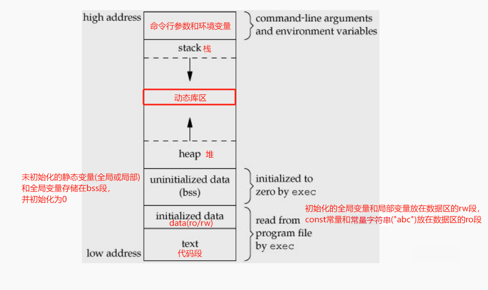
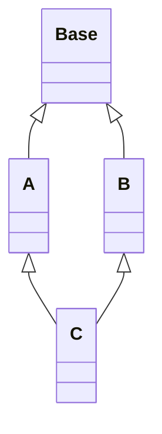

# 目录

- [目录](#目录)
- [C++](#c)
	- [关键字](#关键字)
		- [new/delete 和 malloc/free 区别：](#newdelete-和-mallocfree-区别)
		- [new](#new)
		- [定位new](#定位new)
		- [static](#static)
			- [多个线程在等待局部静态实例初始化时被detach会发生什么？](#多个线程在等待局部静态实例初始化时被detach会发生什么)
			- [一个子线程在初始化局部静态实例时被主线程detach了会发生什么](#一个子线程在初始化局部静态实例时被主线程detach了会发生什么)
		- [const](#const)
		- [宏定义#define与const的区别](#宏定义define与const的区别)
		- [inline](#inline)
		- [volatile](#volatile)
		- [explicit](#explicit)
		- [extern](#extern)
		- [reference \&](#reference-)
			- [引用与指针的区别：](#引用与指针的区别)
		- [typeid](#typeid)
		- [sizeof](#sizeof)
		- [三目运算符](#三目运算符)
		- [位域](#位域)
	- [强制类型转换](#强制类型转换)
	- [内存](#内存)
		- [内存四区](#内存四区)
		- [内存对齐](#内存对齐)
		- [内存泄漏](#内存泄漏)
		- [内存碎片](#内存碎片)
			- [内存池](#内存池)
			- [结构体末尾加空数组](#结构体末尾加空数组)
				- [为什么使用空数组而不使用指针？](#为什么使用空数组而不使用指针)
	- [友元friend](#友元friend)
	- [面向对象](#面向对象)
		- [类](#类)
			- [初始化参数列表](#初始化参数列表)
			- [6大构造/赋值](#6大构造赋值)
			- [移动构造/赋值](#移动构造赋值)
			- [转换构造/转换赋值](#转换构造转换赋值)
			- [this指针](#this指针)
			- [指向类成员变量/成员函数的指针](#指向类成员变量成员函数的指针)
			- [指向类静态成员变量/函数的指针](#指向类静态成员变量函数的指针)
			- [空类](#空类)
				- [为什么是1？](#为什么是1)
			- [如何构造一个类，使其只能在栈上或堆上分配内存](#如何构造一个类使其只能在栈上或堆上分配内存)
		- [封装](#封装)
		- [继承](#继承)
			- [成员访问权限](#成员访问权限)
			- [赋值兼容：](#赋值兼容)
			- [同名隐藏：](#同名隐藏)
			- [静态绑定](#静态绑定)
			- [多重继承](#多重继承)
			- [多继承](#多继承)
				- [菱形继承(三角问题)](#菱形继承三角问题)
				- [虚继承(钻石问题)](#虚继承钻石问题)
		- [多态](#多态)
			- [动态多态的好处：](#动态多态的好处)
			- [动态绑定的原理？](#动态绑定的原理)
			- [实现动态多态的三要素：](#实现动态多态的三要素)
			- [虚函数表是针对类的还是针对对象的？](#虚函数表是针对类的还是针对对象的)
			- [为什么子类对象赋值给父类对象不能构成多态？](#为什么子类对象赋值给父类对象不能构成多态)
			- [使用虚函数需要注意的地方](#使用虚函数需要注意的地方)
				- [构造函数不能是虚函数?](#构造函数不能是虚函数)
				- [为什么类的静态成员函数不能为虚函数？](#为什么类的静态成员函数不能为虚函数)
				- [当基类中的构造或者析构函数中调用虚函数会发生什么呢？](#当基类中的构造或者析构函数中调用虚函数会发生什么呢)
			- [虚析构](#虚析构)
				- [为什么析构函数要定义成虚函数？](#为什么析构函数要定义成虚函数)
			- [使用虚函数的缺点](#使用虚函数的缺点)
	- [模板](#模板)
		- [模板类型推导](#模板类型推导)
			- [模板参数(ParamType)是指针或者引用](#模板参数paramtype是指针或者引用)
			- [ParamType是万能引用](#paramtype是万能引用)
			- [ParamType既不是指针也不是引用(传值)](#paramtype既不是指针也不是引用传值)
		- [泛化](#泛化)
		- [特化](#特化)
			- [全特化](#全特化)
				- [类模板全特化](#类模板全特化)
				- [函数模板全特化](#函数模板全特化)
			- [偏特化](#偏特化)
				- [类模板偏特化](#类模板偏特化)
				- [函数模板偏特化](#函数模板偏特化)
		- [嵌套从属类型需要加typename](#嵌套从属类型需要加typename)
		- [可变参数模板](#可变参数模板)
		- [非类型模板参数](#非类型模板参数)
	- [异常](#异常)
		- [构造函数和析构函数可以抛出异常吗？](#构造函数和析构函数可以抛出异常吗)


# C++

函数重载：函数同名不同参，不同参包括参数的类型，个数，顺序， ==const==，**返回值不能作为重载条件**。

虚函数覆写：同名同参同返回。

## 关键字

### new/delete 和 malloc/free 区别：

1. new/delete是关键字，malloc/free是函数。
2. new/delete会调用构造和析构函数。
3. 内存分配失败，new会抛异常bad_alloc。

### new

 在C++中使用`new`操作符进行动态内存分配时，通常包括以下几个步骤： 

1.   **分配内存**：`new`操作符首先会在堆上分配一块内存，大小为所需类型的字节数。
2.   **调用构造函数**：如果是创建一个对象，则会调用该对象的构造函数来初始化对象的成员变量。
3.   **返回指针**：`new`操作符返回指向分配的内存的指针，可以将其赋值给一个指针变量。

### 定位new

```c++
type* p = new (place_address) type
type* p = new (place_address) type (initializers)
type* p = new (place_address) type [size]
type* p = new (place_address) type [size] { braced initializer list }
```

`place_address` ：是个指针。

`initializers`：提供一个（可能为空的）以逗号分隔的初始值列表。

```c++
char buf[1024]; 	// 也可以使用new[]/malloc在堆上分配buf，不过要记得delete[]/free。
int* p = new (buffer)int[10];//在buffer位置创建10个int元素的数组。
double* p1 = new (buffer)double[10];//覆盖了p的数组
int* p2 = new(buffer + 10*sizeof(double)) int[10];// 在p1后面又创建了10个int元素的数组。
```

### static

1. 修饰**全局变量**：作用域和生命周期都是全局的，不能跨文件使用。**静态全局变量在main函数之前初始化**(调用构造函数)，在程序运行结束时调用析构函数。
2. 修饰**局部变量**：作用域在函数内，生命周期是全局的，存储在全局数据区。**静态局部变量在调用函数之后初始化**(调用构造函数)，在程序运行结束时调用析构函数。
3. 修饰**普通函数**：不能跨文件使用，只能在当前文件使用，限制了函数的作用域。
4. 修饰**类成员变量**：类内定义，类外初始化，全部对象共享一个static成员变量。静态成员变量是命名空间属于类的全局变量，存储在data区的rw段。**C++中的静态成员变量的生命周期是整个程序，它们在程序启动时被初始化，在程序结束时被销毁。静态成员变量是属于类的，而不是属于类的对象，因此即使类的所有对象都被销毁了，静态成员变量仍然存在。**
5. 修饰**类成员函数**：静态成员函数只能访问static成员变量(没有**this指针**)， 不能访问非static成员变量(没有this指针)。

**在C++11标准中，局部静态实例的初始化已经是线程安全的**。C++11标准规定，在多线程环境中，如果有多个线程同时访问同一个局部静态变量，编译器必须保证该变量只被初始化一次，并且所有线程都能够正确地看到初始化后的值。

#### 多个线程在等待局部静态实例初始化时被detach会发生什么？

如果多个线程等待局部静态实例初始化时被detach，那么这些线程将继续运行，但是这些线程不再与主线程同步，也就是说，这些线程会成为**守护线程**（Daemon Thread），独立于主线程运行。

在这种情况下，如果局部静态实例的初始化完成，那么这些守护线程仍然可以访问该实例。<u>但是，如果这些线程在局部静态实例初始化之前就开始运行，并且需要访问该实例，那么它们可能会因为找不到该实例而出现错误</u>（**c++11之前会出现错误，c++11标准中如果没初始化完则会阻塞等待**）。

 因此，在多线程程序中，通常不建议使用detach将等待局部静态实例的线程分离出来。相反，建议使用join等待线程完成任务，或者使用条件变量（Condition Variable）等同步机制等待局部静态实例初始化完成。这样可以保证线程之间的同步，避免出现意外的错误。

#### 一个子线程在初始化局部静态实例时被主线程detach了会发生什么

如果一个子线程在初始化局部静态实例时被主线程detach了，可能会出现一些问题。

首先，**当主线程退出时，所有未join或detach的子线程都将被强制终止。** 这意味着，如果主线程在子线程完成局部静态实例初始化之前就退出了，那么该子线程可能会被强制终止，导致局部静态实例未能完成初始化。

其次，如果主线程detach了子线程，那么主线程将无法再控制该子线程的运行。这意味着，子线程可能会在局部静态实例初始化完成之前就被主线程强制终止，导致该实例未能完成初始化。

因此，通常不建议使用detach将等待局部静态实例的子线程分离出来。相反，建议使用join等待线程完成任务，或者使用条件变量等同步机制等待局部静态实例初始化完成。这样可以保证线程之间的同步，避免出现意外的错误。


### const

1. 修饰**变量**：该变量不可改变。

2. 修饰**指针**：`const int *p` : p所指向的值不可变；  `int* const p`:  p这个地址不可变。

3. 修饰**引用**：常量引用，常用作函数形参，避免了拷贝且不能对其修改。

4. const修饰**成员函数**：只能用const对象访问，不可在成员函数内改变成员变量。嵌套调用的函数也只能是const的。

5. const修饰**类对象**：const对象只能调用const成员函数，不能调用非const成员函数。非const对象两者都能调用，**如果有const构成函数重载，则优先调用非const成员函数**。

6. const可以作为函数重载的条件。

### 宏定义#define与const的区别

| 宏定义 #define             | const 常量   |
| -------------------------- | ------------ |
| 宏定义，==相当于字符替换== | 常量声明     |
| 预处理器处理               | 编译器处理   |
| 存储在代码段               | 存储在数据段 |
| 可通过 `#undef` 取消       | 不可取消     |

### inline

优点：相当于把函数体**直接写在调用内联函数的地方**。省去了进入/退出函数体的操作（压栈、出栈）。

缺点：代码膨胀，而且加了inline只是对编译的建议，是否该函数是内联的由编译器决定。

### volatile

使用volatile声明的变量，**每次访问都必须从内存取值**(没有用volatile声明的变量由于编译器的优化，可能直接从寄存器取值)

const可以是volatile的(如只读的状态寄存器)

指针可以是volatile的。

[volatile.md](../ElegantTest/test_cpp/keyword/volatile/volatile.md)

### explicit

禁止“单参构造函数”(拷贝构造、转化构造) 的隐式转换。

### extern

1. extern修饰的是变量的声明，说明此变量将在==文件以外==或者==文件后面部分==定义。变量的声明不分配内存，定义的时候才分配。

2. extern “C”{}

c++编译器默认是对函数进行**命名倾轧(name mangling)**的(就是编译完后函数名字都变了)，要想有的函数不进行倾轧使用extern “C” {}。

```c++
#ifdef __cplusplus
extern "C" {
#endif

void *func(void *, int, size_t);

#ifdef __cplusplus
}
#endif
```

### reference &

引用只是对象的一个别名。引用一经声明不可变更。初始化时为谁的引用就是谁的引用，**不可中间在更改引用的对象**。

```c++
int a = 10;
int& ra = a;
int b = 200;
ra = b;
cout << a << b << ra << endl;   // 200 200 200
```


#### 引用与指针的区别：

1. 引用定义时必须初始化，指针在定义时可以为NULL；

2. 引用初始化完成后不能改变其指向，指针可以改变。

3. sizeof的值不同

    ```c++
    // 64位机器
    int a =1;
    int &b = a; 	    // 4 引用所指向对象的类型的大小 int
    const long &c = a;	// 8 引用所指向对象的类型的大小 long
    int *p = &a;	    // 8 指针本身的大小
    
    cout << sizeof(b) << endl; 
    cout << sizeof(p) << endl;
    cout << sizeof(c) << endl;
    ```

    

引用也不是完全不能改变指向的，**类内的引用可以改变指向**，类内的引用被c++编译器编译为指针。[reference.cpp](https://github.com/Hsurpass/ElegantTest/blob/main/test_cpp/reference/reference.cpp)

https://www.zhihu.com/question/520365632/answer/2377774855?utm_id=0

### typeid

返回包含操作数数据类型信息的 type_info 对象的一个引用，信息中包括数据类型的名称，要使用 typeid，程序中需要包含头文件<typeinfo>。==type_info 的拷贝和赋值均是私有的，故不可拷贝和赋值。==

==如果想通过基类的指针获得派生类的数据类型==， **基类必须带有虚函数**。

### sizeof

计算所占空间的大小(字节)

```c
sizeof("hello") == char str[] = {'h', 'e', 'l', 'l', 'o', '\0'}	// 6
```

### 三目运算符

在c++中对三目运算符的的提升：如果返回的是变量名可以作为左值使用。c语言中返回的是变量值，不能被赋值。

c++：

```c++
int a = 10;
int b = 20;
    
a < b ? a : b = 100;
std::cout << "ret=" << a << std::endl;  // 10

(a < b ? a : b) = 100;
cout << "ret=" << a << endl;    // 100  C++返回的是变量本身，可以作为左值使用。
```

c：

```c
int a = 10;
int b = 20;
    
// a < b ? a : b = 100;    // error C语言返回的是变量值, 不能作为左值
printf("ret=%d\n", a);  

// (a < b ? a : b) = 100;
// printf("ret=%d\n", a);  // error C语言返回的是变量值, 不能作为左值
```

### 位域

位域定义与结构定义相仿，其形式为：

```c
struct 位域结构名 
{
 位域列表
};
```

其中位域列表的形式为：

```c
type [member_name] : width ;
```

type：只能为int/unsigned int，short/unsigned sort，char/unsigned char

member_name：位域的名称。**可以为空，称为无名位域，只能用来作填充或者调整位置，不能被使用**。

width：位宽。

**对member_name赋值时变量的长度不能超过位宽，超出则会发生溢出**。例如：

```c
struct A{
	int a:3;
}
A a1;
a1.a = 8; // 8的二进制位是0x1000，超出3位，发生溢出, 所以是0。 位宽是3只能表示0~7
cout << a1.a << endl;	// 0
```

**不能对位域进行取地址(&)操作**，地址是字节的编号，不是位的编号。

[C语言位域（位段）详解](http://c.biancheng.net/view/2037.html)


## 强制类型转换

reinterpret_cast：强制转换。

const_cast：去除 const、volatile 等特性。

static_cast：基础数据的转换，不执行运行时类型检查。

dynamic_cast：下转。如果父类的指针确实指向子类则返回子类的指针，否则返回NULL；如果父类的引用确实指向子类则返回子类的引用，否则抛出`std::bad_cast`异常。==使用dynamic_cast必须要有虚函数==。


## 内存

### 内存模型

堆区、栈区、数据区(rw/ro)、bss段、代码段



常量字符串和字符串常量是两个概念，它们在 C/C++ 中有一些区别：

1.  常量字符串（Constant String）：常量字符串是指由双引号括起来的**字符串字面值**，例如："Hello, World"。**常量字符串是不可修改的**，试图修改常量字符串的值会导致编译错误。==常量字符串通常存储在程序的只读数据段（Read-Only Data Segment）中，以确保其值在程序执行期间不会被修改。==
2.  字符串常量（String Constant）：字符串常量是指**用字符数组表示的字符串**，例如：char str[] = "Hello, World";。字符串常量可以通过修改数组中的元素来改变其值。==字符串常量通常存储在程序的数据段（Data Segment）中，因为它们可以被修改。==

然而，这并不是所有系统都会这样处理。在一些系统中，字符串常量仍然可能会被存储在只读数据段（Read-Only Data Segment，简称RO段）中，以确保其值不会被修改。因此，存储字符串常量的具体位置可能取决于编译器、操作系统和系统的设置。

### 内存对齐

设定结构体、联合以及类成员变量以 n 字节方式对齐。#pragma pack(n)。

内存对齐规则：

1. pack(n)中 **n的值** 和结构体中变量的**最大值**比较，两者**取小**为**外对齐大小Y**。
2. 结构体中每个变量和Y比较，两者**取小**作为**内对齐大小X**。
3. 假设内存地址从0开始，找地址能被X整除**(地址/X=整数**)的地方，开始存放数据。
4. 最后外对齐，用 **地址/Y=最小整数倍** 的地方。如果前面内存有没用到的进行补空操作。

references: wangguilin/零基础入门C语言-13.8.2内存对齐。

```c++
#pragma pack(push)  // 保存对齐状态
#pragma pack(4)     // 设定为 4 字节对齐

struct test
{
    char m1;
    double m4;
    int m3;
};
// sizeof(test) == 16
// 不设置4字节对齐 sizeof(test) == 24
#pragma pack(pop)   // 恢复对齐状态
```

 

### 内存泄漏

1. malloc/free，new/delete，new[]/delete[]没有配对使用。

2. 没使用虚析构。

3. 循环引用。

4. 僵尸进程。使用wait或waitpid回收子进程。

5. 抛异常，栈解旋。

#### 检测内存泄漏

https://www.zhihu.com/question/29859828/answer/46024313


### 内存碎片

#### 内存池

提前申请一块大的内存，然后使用定位new去初始化。

#### 结构体末尾加空数组

结构体/类 末尾+空数组 常被用做动态缓冲区。注意：==空数组一定要放在末尾==。[struct_plus_empty_arr.cpp](https://github.com/Hsurpass/ElegantTest/blob/main/test_cpp/struct/struct_plus_empty_arr.cpp)

```c++
struct A {
	int a;
	char b[];
};
A* pa = (A*)malloc(sizeof(A) + len);
free pa;
```

##### 为什么使用空数组而不使用指针？

如果使用指针不使用数组，则需要分别分配结构体的内存和指针的内存，释放也是要两次释放；如果使用数组可以一次性把内存全部分配出来，释放的时候一次性释放。**减少了内存碎片**。

**而且空数组不占空间，指针占4字节**。

```c++
//使用非类型模板参数，空数组不一定要放到末尾。
template<int N>
class A{
public:
    char buf[N];
    int a;
};
A<6> a;  or  A<6>* pa = new A<6>(); delete pa;
```


## 友元friend

1. 能访问私有成员，破坏了封装性。
2. 友元关系不能被继承

3. 友元关系不可传递：B是A的友元，C是B的友元，C不是A的友元。

4. 且是单向的：B是A的友元，A不是B的友元。

友元函数、友元类：

-   声明为谁的友元，==就可以通过谁的对象，==访问谁的私有成员。

-   友元的声明位置可以是类中的任意位置，不受public/private/protected的影响。

-   **全局函数做友元**，只需在类中做声明即可；**成员函数做友元**在做声明的同时还需加上类作用域,如：A::。

子类使用父类的友元函数：

​	由于友元函数不能继承，但是子类又想使用父类的友元函数，==可以通过强制类型转换，将子类的指针或引用强转为父类的指针或引用（**赋值兼容**），==然后再去调用父类中的友元函数。


## 面向对象

### 类

#### 初始化参数列表

1. 类内成员变量的初始化顺序与初始化列表的顺序无关，与其自身定义的顺序有关。

2. 效率更高，少了一次调用默认构造和赋值。

3. ==引用类型成员==要用初始化列表，因为引用必须在定义时初始化。 

4. ==const成员==必须要用初始化列表，因为const也是在定义时初始化，且const变量不可更改。	

#### 6大构造/赋值

默认构造、拷贝构造、拷贝赋值、移动构造、移动赋值、析构。

#### 移动构造/赋值

```c++
A(A&& another){
	this->p = another.p;
	another.p = NULL;	// 一定要置空，避免重析构
}
A& operator=(A&& another){
	if (this != &another) {// 避免自己给自己赋值，造成内存泄漏
		delete this->p;	
		this->p = another.p;	 
		another.p = NULL;		//一定要置空，避免重析构
	}
	return *this;
}
```

#### 转换构造/转换赋值

[class_convert_constructor.cpp](https://github.com/Hsurpass/ElegantTest/blob/main/test_cpp/class/class_convert_constructor.cpp)

```c++
A(const B& b){ m_a = b.m_b; }	// 转换构造
A& operator=(const B& b){ m_a = b.m_b; return *this; }	//转换赋值

B b(10); A a = b;	// 隐式调用转换构造
B b1(100); a = b1;	// 隐式调用转换赋值
const A& a1 = b1;	// 隐式调用转换构造
```

#### this指针

指向当前对象的指针。

this指针被隐式的声明为：`T* const this`，这就意味着 this 不可修改；

而const成员函数：`const T* const this `，表明 **this** 和 **this指向的成员变量** 都不可修改。

==用空指针调用**空函数体**的成员函数不会崩(因为this指针没调用任何成员变量)。==

#### 指向类成员变量/成员函数的指针

[pointer_to_memfunc.cpp](https://github.com/Hsurpass/ElegantTest/blob/main/test_cpp/class/class_pointer_to_memfunc.cpp)

```c++
int A::*pa = &A::m_a;
void (A::*paf)() = &A::dis;	
```

==指向类成员的指针，本质存放的不是地址，存放的是**偏移量**==

#### 指向类静态成员变量/函数的指针

指向**静态成员**的指针定义方法和普通指针相同，**无需和类名关联，调用时也无需和类对象关联**。

```c++
int *pb = &A::m_b;
void (*pbf)() = &A::dis_static; 
```

#### 空类

大小是1.

##### 为什么是1？

因为类实例化的过程中会得到一个**独一无二的**内存地址，目的是为了区别同一个类类型的不同对象，所以编译器会隐式的增加一个字节。


#### 如何构造一个类，使其只能在栈上或堆上分配内存

1. **只能在堆上分配内存**：使析构函数private（==原因是编译器为类对象在栈上分配空间时，会检查析构函数是否可访问，若不能访问则不能创建对象。==)，然后定义一个public的成员函数用于调用析构函数。**不过缺点是这个类就无法继承**，可以使用protected权限。

2. **只能在栈上分配内存**：==重载new和delete，并使他们私有化==。

### 封装

就是把属性和方法都写到类中，并且用public/protected/private赋予访问权限。

### 继承

#### 成员访问权限

子类public/protected/private继承父类中的私有成员都是不可访问的。

#### 赋值兼容：

1. 子类对象可以赋值给父类对象。(B b; A a = b; --> ==调用拷贝构造==。 A a; B b; a = b; --> ==调用拷贝赋值==。)

2. 子类对象可以赋值给父类对象的引用。(以父类寻址: A* pa = pb;  以A寻址(**所以看不到子类成员**))

3. 子类对象的地址可以赋值给父类对象的指针。(以父类寻址: A* pa = pb;  以A寻址(**所以看不到子类成员**))

#### 同名隐藏：

如果子类父类中有同名的==变量、函数名==(无关乎返值和参数)，则子类对象调用时默认使用的是子类的；要想使用父类的，以**父类名+作用域运算符**的方式来调用。

只要子类中有同名的，则父类中所有同名的函数都被隐藏(不管是不是虚函数)。如果一定要用父类的可以使用：1.using 父类::函数名 2.父类名+作用域运算符。

#### 静态绑定

```c++
class A {
public:
	void func() { cout << "A::func()" << endl; }
}
class B : public A{
	void func() { cout << "B::func()" << endl; }
}

B b;
A* pa = &b;
pa->func();	// A::func() 静态绑定和pa的静态类型有关

B* pb = &b;
pb->func();// B::func() 和静态类型有关
```


#### 多重继承

多层次的继承，例：B继承自A，C继承自B。

构造顺序：先父类，再成员变量，最后子类。

#### 多继承

多继承，即继承多个父类。

##### 菱形继承(三角问题)

多个父类中有相同的成员**变量**或**函数**，子类在访问时会产生二义性，为避免冲突在访问时要加上**父类作用域名称**。

[multiple_inherit_diamond.cpp](https://github.com/Hsurpass/ElegantTest/blob/main/test_cpp/class/multiple_inherit_diamond.cpp)

[virtual_table_multi_inherit_diamond.cpp](https://github.com/Hsurpass/ElegantTest/blob/main/test_cpp/class/virtual_table_multi_inherit_diamond.cpp)

父类构造顺序：从左到右。

##### 虚继承(钻石问题)



```c++
/* 构造、析构顺序：
Base(int a_ = 10)
A(int a_ = 10)
B(int a_ = 20)
C(int a_ = 30)
~C()
~B()
~A()
~Base()
*/
// 菱形问题 父类构造顺序：从左到右且虚基类只构造一次
// 实现了在多继承中只保留了一份数据成员。A,B共享虚基类中的数据，且虚基类中初始化只能由C初始化(A，B中构造Base是无效的)。
```

[multiple_inherit_virtual_base.cpp](https://github.com/Hsurpass/ElegantTest/blob/main/test_cpp/class/multiple_inherit_virtual_base.cpp)

[virtual_table_multi_inherit_virtual_base.cpp](https://github.com/Hsurpass/ElegantTest/blob/main/test_cpp/class/virtual_table_multi_inherit_virtual_base.cpp)

- 虚继承，使得不同路径继承来的同名成员在内存中只有一份拷贝。

- 同名隐藏，赋值兼容同样适用

- 虚继承用于解决多继承条件下的菱形继承问题（浪费存储空间、存在二义性）。

Base和A，B，C可以有同名的变量和同名的普通成员函数。

虚拟继承，A,B不能同时覆写虚函数，只能覆写其中一个，否则会ambigous.

既然继承了虚基类就不要有同名的变量出现了，以免造成程序混乱。

### 多态

**静态多态**：函数重载，在编译期就能确定。

**动态多态**：由虚函数和继承实现，在运行期执行动态绑定。

#### 动态多态的好处：

1. 隐藏实现细节
2. 接口重用，提高代码的扩展性。

#### 动态绑定的原理？

当类中有虚函数时，编译器会创建一张虚函数表，表中存放着虚函数的指针，类对象中会增加一个指向虚函数表的指针；当子类对父类的虚函数覆写时，也会相应的把虚表中的函数指针给替换掉。当进行函数调用时就会形成动态绑定。

#### 实现动态多态的三要素：

1. 有父子类继承
2. 子类覆写父类虚函数
3. 父类指针或引用指向子类的对象。

#### 虚函数表是针对类的还是针对对象的？

**是针对类的**，一个类只有一个虚函数表，类的所有对象共享同一个虚表，只是每个类存放vptr的地址不同。

#### 为什么子类对象赋值给父类对象不能构成多态？

```c++
B b;
A a = b; // 调用拷贝构造
A a1;
a1 = b;	 // 调用拷贝赋值
// 由于赋值时只会处理成员变量，类对象的vptr(指向虚函数表的指针)不会改变，父类有自己的虚函数表，所以不会构成多态。
```

#### 使用虚函数需要注意的地方

- 对于虚函数如果某次函数调用使用了默认实参，则该实参值由本次调用的**静态类型**决定。也就是说，如果我们通过基类的==引用或指针==调用函数，则使用基类中定义的默认实参。如果是**对象**调用函数(不构成多态)，则使本类中的实参。见c++ primer 15.3 虚函数与默认实参。
- 普通函数（非类成员函数）不能是虚函数
- 静态函数（static）不能是虚函数
- 构造函数不能是虚函数

##### 构造函数不能是虚函数?

1.   因为在创建对象调用构造函数时，虚表指针还没有生成，必须要**构造函数调用完成后才会形成虚表**指针(vptr指向vtable)，虚函数需要在对象创建完成后才能进行调用。
2.   另外，虚函数的调用是通过指针或者引用进行的，构造函数不能被指针或者引用调用，因此也不需要成为虚函数。

[为什么构造函数不能为虚函数](https://cloud.tencent.com/developer/article/1036059)

##### 为什么类的静态成员函数不能为虚函数？

<u>虚函数是能被覆盖的，静态成员函数在类中只有一份，本身就是相矛盾的，而且也编译不过</u>。

##### 当基类中的构造或者析构函数中调用虚函数会发生什么呢？

**答案是调用的都是本类中的虚函数**。

一个**子类对象**构造的顺序是先基类再派生类，当在基类的构造函数中调用虚函数时虚函数表还没有创建好；

析构顺序时先子类再父类，当在基类的析构函数中调用虚函数时，子类的析构已经调用过了，虚函数表已经不可靠了。

#### 虚析构

只要父类中定义了虚析构，即使子类中没覆写析构函数，虚函数表中也会覆盖掉父类的析构函数。

##### 为什么析构函数要定义成虚函数？

**如果不定义成虚函数，在对象销毁时只会调用基类的构造函数，造成只会释放对象中基类部分的数据，而子类的数据没有释放**；定义成虚析构会先调用子类的析构再调用父类的析构。

#### 使用虚函数的缺点

会增加内存开销

解决：使用基于对象的方法：bind function


## 模板

### 模板类型推导

```c++
template<typename T>
void f(ParamType param);
f(arg);	// 调用
```

#### 模板参数(ParamType)是指针或者引用

```c++
int x=2;
const int cx = x;	
const int& rx = x;
const char name[] = "anna";	// type is const char[5]
void func(int, double);	// 函数指针

template<typename T>
void f(T& param);
f(x);	//T推导为int, 所以param的类型为int&
f(cx);	//T推导为const int, 所以param的类型为const int&
f(rx);	//T推导为const int, 所以param的类型为const int&
f(name);//T推导为const char[5]
f(func);//T推导为函数的引用，即：void(&)(int, double);

template<typename T>
void f(const T& param);
f(x);	//T推导为int, 所以param的类型为const int&
f(cx);	//T推导为int, 所以param的类型为const int&
f(rx);	//T推导为int, 所以param的类型为const int&
f(name);//T推导为char[5]

template<typename T>
void f(T* param);
const int* px = &x;
f(&x);	//T推导为int, 所以param的类型为int*
f(px);	//T推导为const int, 所以param的类型为const int*
f(name);//T推导为const char

template<typename T, int N>
int arraySize(T(&)[N]) { return N; }
arraySize(name);//T推导为const char, N推导为5
```

#### ParamType是万能引用

```c++
int x=2;
const int cx = x;	
const int& rx = x;

template<typename T>
void f(T&& param);
f(x);	//T推导为int&,		 经过引用折叠, param的类型为int&
f(cx);	//T推导为const int&, 经过引用折叠, param的类型为const int&
f(rx);	//T推导为const int&, 经过引用折叠, param的类型为const int&
f(2);	//T推导为int,		 经过引用折叠, param的类型为int&&
```

#### ParamType既不是指针也不是引用(传值)

```c++
int x=2;
const int cx = x;	
const int& rx = x;
const char* const ptr = "hello";
const char name[] = "anna";	// type is const char[5]
void func(int, double);	// 函数指针

template<typename T>
void f(T param);
f(x);	//T推导为int, 所以param的类型为int
f(cx);	//T推导为int, 所以param的类型为int
f(rx);	//T推导为int, 所以param的类型为int
f(ptr);	//T推导为const char*, 所以param的类型为const char*
f(name);//数据退化为指针，所以T推导为const char*，param的类型为const char*。
f(func);//T推导为函数的指针，即：void(*)(int, double);
```

### 泛化

泛化其实就是 **泛型化（通用化）** 的意思，其实就是定义类模板/函数模板时候的代码格式。

```c++
template<typename T>
class Compare {
public:
	Compare(T x, T y){
		_x = x;
		_y = y;
	}
};
```


### 特化

特化其实就是对于特殊的类型（类型模板参数）进行**特殊的对待**，给它开小灶，给它只适合它自己用的专用代码。**特化**又分为**全特化**和**偏特化！**

1.写特化版本之前，必须要写出泛化版本。(==没有泛化版本写不出特化版本。==)

2.编译器会==优先==选择特化版本。优先级顺序：**全特化类>偏特化类>泛化模板类。**

3.当类模板/函数模板全特化之后，就是一个具体的类/函数了。

**模板特化解决的问题：当泛化的模板不能跑通所有类型的实例时，就需要实现特定类型的版本。**

#### 全特化

将类模板/函数模板的模板参数列表中的==所有模板参数用具体的类型替换。==注意：全特化时，模板参数列表为空，也就是这个标识：**template<>**。

##### 类模板全特化

1. **类模板全特化**：模板参数全部用实际类型替换掉

   [class_full_specilization.cpp](https://github.com/Hsurpass/ElegantTest/blob/main/test_cpp/template/template_specialization/class_full_specilization.cpp)

```c++
template<>	// 全特化的类
class Compare<const char*>{
public:
    Compare(const char* x, const char* y){}
    const char *max();
};
const char* Compare<const char *>::max() {}	//类外实现成员函数需要加Compare<const char *>::
```

2. **类模板成员函数全特化**：类模板不仅可以整体全特化，而且可以针对某个成员函数全特化。

   [class_memfunc_full_specialization.cpp](https://github.com/Hsurpass/ElegantTest/blob/main/test_cpp/template/template_specialization/class_memfunc_full_specialization.cpp)

```c++
template <typename T>
class Compare {
public:
    T max(){ return _x > _y ? _x : _y; }
};

template<>	// 成员函数全特化 不特化类只特化某个成员函数
const char* Compare<const char *>::max() {
    if (strcmp(_x, _y) > 0) return _x; else return _y;
}
```


##### 函数模板全特化

[function_full_specialization.cpp](https://github.com/Hsurpass/ElegantTest/blob/main/test_cpp/template/template_specialization/function_full_specialization.cpp)  全特化的函数和普通函数了还是有区别的。具体看[C++模板特化与偏特化](https://cloud.tencent.com/developer/article/1347877)

```c++
template<typename T> // 函数泛化 // Max不能和系统的max重名
T Max(T _x, T _y) { return _x > _y ? _x : _y; }

template<>	// 函数全特化
// const char* Max<const char*>(const char* _x, const char* _y)
const char* Max(const char* x, const char* y){ return (strcmp(x, y) > 0) ?  x : y; }
```

#### 偏特化

模板偏特化主要分为两种，一种是指对==部分模板参数==进行特化，另一种是对==模板参数特性==进行特化，包括将模板参数特化为**指针、引用或是另外一个模板类。**

##### 类模板偏特化

[class_partial_specialization.cpp](https://github.com/Hsurpass/ElegantTest/blob/main/test_cpp/template/template_specialization/class_partial_specialization.cpp)

```c++
// 类模板泛化
template <typename T, class U>
class Compare {}
// 对部分模板参数进行偏特化
template <class U>	
class Compare<int, U> {}	// 一定要加类名后面的<int, U>,否则redeclared.
// 将模板参数偏特化为指针
template <typename T, class U> 
class Compare<T*, U*> {}
// 将模板参数偏特化为另一个模板类
template <typename T, class U>
class Compare<std::vector<T>, std::vector<U>> {}
```

##### 函数模板偏特化

[function_partial_specialization.cpp](https://github.com/Hsurpass/ElegantTest/blob/main/test_cpp/template/template_specialization/function_partial_specialization.cpp)

```c++
template <typename T, class U>	// 函数模板泛化
void compare(T num1, U num2) {}
template <class U> // 对部分模板参数进行偏特化
void compare(int num1, U num2) {}
template <typename T, class U>	// 将模板参数偏特化为指针
void compare(T *num1, U *num2){}
template <typename T, class U>	// 将模板参数偏特化为另一个模板类
void compare(std::vector<T> &vecLeft, std::vector<U> &vecRight){}
```


### 嵌套从属类型需要加typename

[template_nested_type.cpp](https://github.com/Hsurpass/ElegantTest/blob/main/test_cpp/template/template_nested_dependent_name.cpp)

### 可变参数模板

当我们既不知道**参数的数目**又不知道**参数的类型**的时候，就可以使用可变参数模板。

默认参数都是传值的，如果参数是类，效率很低，所以改成传引用 `ARGS&... args` or `ARGS&&... args`

```c++
template<typename T, typename... U>	// U:参数类型包
void print(const T& firstArg, const U&&... args){} //args:参数包

sizeof...(U) //类型参数的个数
sizeof...(args) //函数参数的个数
func(std::forward<ARGS>(args)...) //既扩展了类型包U, 也扩展了参数包args, 形如:std::forward<Ti>(ti),Ti表示类型包中第i个参数的类型，ti表示参数包中第i个元素。
//参数包args中的每个元素依次调用std::forward(), 则展开后就是：func(std:forward<int>(a), std::forward<double>(b), std::forward<string>(c))。std::forward保证参数原类型不变。    
func_(args...) //这么调用表示传递的是参数包，则func_函数声明应为：
    template<typename T> func_(const T&... args) 或者 func_(const T&&... args)
```

[variadic_template01.cpp](https://github.com/Hsurpass/ElegantTest/blob/main/test_cpp/template/variadic_template01.cpp)

[variadic_template02.cpp](https://github.com/Hsurpass/ElegantTest/blob/main/test_cpp/template/variadic_template02.cpp)

C++Primer 第5版 16.4

https://www.modb.pro/db/463275

### 非类型模板参数

非类型模板参数是有限制的。他们只能是：整数(包括枚举)，对象/函数/成员的指针，对象或函数的左值引用，nullptr。

==浮点数,类对象, 字符串常量是不允许作为非类型模板参数的==。

```c++
template<typename T, int N> func(T (&arr)[N])
```

[nonType_template_param.cpp](https://github.com/Hsurpass/ElegantTest/blob/main/test_cpp/template/nonType_template_param.cpp)

[目录](#目录)


## 异常

### 构造函数和析构函数可以抛出异常吗？

构造函数和析构函数可以抛出异常，编译不会报错，但是不建议在构造和析构中使用异常。因为一旦抛出异常，抛出异常点之后的程序将不会执行，可能会造成内存泄漏，可以用catch来捕获异常。

