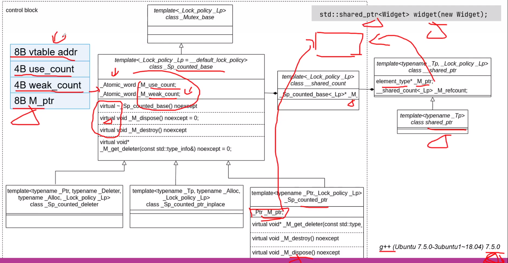
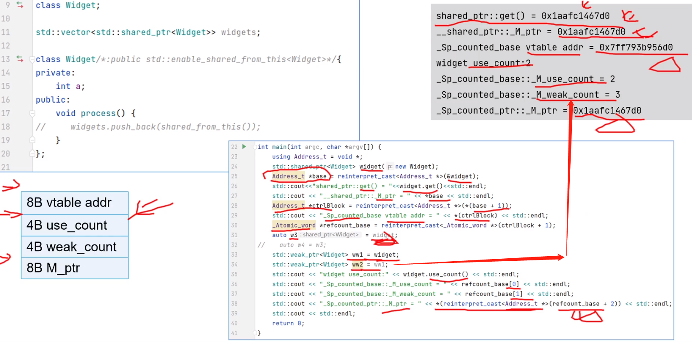

# 目录

- [目录](#目录)
- [C++11](#c11)
  - [1. KeyWord](#1-keyword)
    - [1.1 auto](#11-auto)
    - [1.2 decltype](#12-decltype)
    - [1.3 nullptr](#13-nullptr)
    - [1.4 final](#14-final)
    - [1.5 override](#15-override)
    - [1.7 =default/=delete](#17-defaultdelete)
    - [1.8 initializer\_list](#18-initializer_list)
    - [1.9 lambda](#19-lambda)
    - [1.10 closure](#110-closure)
    - [1.11 assert/static\_assert](#111-assertstatic_assert)
  - [2. 左值右值](#2-左值右值)
    - [2.1 判断左值右值](#21-判断左值右值)
    - [2.2 左值引用](#22-左值引用)
      - [2.2.1非常量左值引用](#221非常量左值引用)
      - [2.2.2常量左值引用(万能引用)](#222常量左值引用万能引用)
    - [2.3 右值引用](#23-右值引用)
      - [2.3.1 移动语义](#231-移动语义)
      - [2.3.2 万能引用](#232-万能引用)
      - [2.3.2.1引用折叠](#2321引用折叠)
      - [2.3.3 完美转发](#233-完美转发)
  - [3.bind/function](#3bindfunction)
    - [3.1bind](#31bind)
  - [4.Smart Pointer](#4smart-pointer)
    - [4.1auto\_ptr](#41auto_ptr)
    - [4.2unique\_ptr](#42unique_ptr)
    - [4.3share\_ptr](#43share_ptr)
      - [内存布局](#内存布局)
      - [4.3.1reset](#431reset)
      - [4.3.2make\_shared](#432make_shared)
      - [4.3.3enable\_shared\_from\_this](#433enable_shared_from_this)
      - [4.3.4shared\_ptr的线程安全性](#434shared_ptr的线程安全性)
      - [4.3.5share\_ptr的错误用法](#435share_ptr的错误用法)
      - [4.3.6refcount.ptr](#436refcountptr)
    - [4.4weak\_ptr](#44weak_ptr)
  - [references](#references)


# C++11

## 1. KeyWord

### 1.1 auto

[auto.cpp](https://github.com/Hsurpass/ElegantTest/blob/main/test_cpp/3c%2B%2B11/01keyword/auto.cpp)

使用场景：

1. 迭代器类型
2. lambda类型
3. std::bind返回值类型(functional)

### 1.2 decltype

[decltype.cpp](https://github.com/Hsurpass/ElegantTest/blob/main/test_cpp/3c%2B%2B11/01keyword/decltype.cpp)

### 1.3 nullptr

[nullptr.cpp](https://github.com/Hsurpass/ElegantTest/blob/main/test_cpp/3c%2B%2B11/01keyword/nullptr.cpp)

解决NULL和0的二义性，NULL通常被定义为(void*)0

### 1.4 final

[final.cpp](https://github.com/Hsurpass/ElegantTest/blob/main/test_cpp/3c%2B%2B11/01keyword/final.cpp)

两个用途: 

​	1.阻止从类继承。

​	2.组织虚函数的覆写。

### 1.5 override

帮助检查是否正确覆写了父类的虚函数。若此种覆写关系不成立，则以报错的形式提示给coder。

### 1.7 =default/=delete

在函数声明后面加上=delete就能禁用该函数。`A()=delete;`

### 1.8 initializer_list

[initializer_list.cpp](https://github.com/Hsurpass/ElegantTest/blob/main/test_cpp/3c%2B%2B11/01keyword/initializer_list.cpp)

可以接受多个参数，但必须是同一类型

```c++
double sum(const initializer_list<double> &il);	// 可以接受多个同一类型的参数，函数内再用for(auto d: il);遍历
```

### 1.9 lambda

[lambda.cpp](https://github.com/Hsurpass/ElegantTest/blob/main/test_cpp/3c%2B%2B11/01keyword/lambda.cpp)

```c++
[captures](params) specifiers exception -> ret { body }
```

1. 捕获列表捕获的是自动存储变量(**局部变量**)

2. 对于**全局变量**和**静态局部变量**，放在捕获列表中编译会报错；直接用就行了(作用域本来就是全局的)，也不必在参数列表传参。

3. 捕获this指针，可以在**lambda内部**使用this类型的成员函数和变量。

### 1.10 closure

[closure.cpp](https://github.com/Hsurpass/ElegantTest/blob/main/test_cpp/3c%2B%2B11/01keyword/closure.cpp)

lambda表达式和其**外部的局部变量**合起来叫做闭包。

好处：

1. ==可以读取外层函数内的局部变量；==
2. ==让这些变量的值始终保存在内存中。==

### 1.11 assert/static_assert

```c++
assert(expression)	//运行期断言，不能在编译器发现错误。
static_assert(expression，提示字符串)	//编译期断言，也叫动态断言。如果expression为false,则打印提示字符串。
```


## 2. 左值右值

[目录](#目录)

### 2.1 判断左值右值

左值：可以取地址(&)的一定是左值。字符串字面量(“abcd”)是左值(存在静态数据区，是一块连续的内存，可以取地址)；++i。

右值：不能取地址的是右值。字面量(10)一般是右值；返回的局部对象；i++；算数/逻辑/比较表达式。

```c++
int func(int val) // val是左值
int func(int&& val)	//val还是左值

A func() { A a; return a; }	//如果开启了RVO(return value optimization)优化，好像a就不会复制给临时对象了. g++ -fno-elide-constructors:关闭rvo优化
```

### 2.2 左值引用

​	扩展了对象的作用域

#### 2.2.1非常量左值引用

绑定的必须是一个左值，int &aa = a;

#### 2.2.2常量左值引用(万能引用)

既能引用左值，又能引用右值

```c++
const T& aa = a;	 	const T& aa = 1;
const auto& aa = a;	 	const auto& aa = 1;
```

缺点：常量性，一旦使用了常量左值引用就不能修改对象中的数据了(除非强制类型转换)。

### 2.3 右值引用

右值引用的特点：

1. 是延长临时对象的生命周期。
2. 减少对象copy，提升程序性能。

c++编译器将**已命名的右值引用视为左值**，而将未命名的右值引用视为右值。

#### 2.3.1 移动语义

将左值转换为右值引用:   ==`std::move(t)`== *≈* ==`static_cast<T&&>(t)`==,  std::move调用时不需要指定模板参数

#### 2.3.2 万能引用

```c++
T& aa = a;	 	T& aa = 1;
auto& aa = a;	auto& aa = 1;
```

```c++
// 如果参数传的是左值，则T推导的是左值引用T&
// 如果参数传的是右值，则T推导的是类型本身
// 如果参数传的是左值引用，则T推导的是左值引用
// 如果参数传的是右值引用，则T推导的是类型本身
template<typename T>
void func(T&& obj) {}
```

#### 2.3.2.1引用折叠

遇左则左

#### 2.3.3 完美转发

保持值的原有属性(左值右值)。std::forward<T> 是一个模板函数，调用时需要指定模板参数。 ==`std::forward<T>(t)`== *≈* ==`static_cast<T &&>(t)`==

```c++
template<typename T>
void func(T&& param){
    f1(std::forward<T>(param));
}
```

lambda表达式中无法使用模板推导，可以通过 auto和decltype 相结合的方式使用完美转发：

```c++
auto func = [](auto&& param){ someFunc(std::forward<decltype(param)>(param) ); }//auto&&既可以接受左值也可以接受右值，decltype可以推导出param是左值引用还是右值引用，
```

## 3.bind/function

`using namespace std::placeholders;`

### 3.1bind

1.   bind绑定顺序就是函数形参的顺序，placeholders::_x 中的序列是**实参的顺序**。

```c++
auto fn_invert = std::bind (myDivide, _2, _1);	// _2/_1 ==> 2/10 
cout << fn_invert(10,2) << endl;	// _1是10，_2是2
```

2. 对于预先绑定好的参数，是**传值**的，对象会引发拷贝。
2. 对于未预先绑定好的参数，使用placeholders::_x做占位符, 是传**引用**的。
2. std::bind(&A::func, std::ref(shared_ptr)); **std::ref传的是引用**。
2. ==对于绑定的指针，引用类型的参数，需要在调用时确保其是可用的。== 这就引出了下面的 [enable_shared_from_this](#4.3.3enable_shared_from_this)。

## 4.Smart Pointer

RAII：资源获取即初始化。==资源==：内存、文件句柄、网络连接、互斥量。

### 4.1auto_ptr

(被废弃的) 复制和复制都会改变所有权。

### 4.2unique_ptr

release：放弃托管，返回资源指针。

reset: 如果传参了，释放旧资源托管新资源；如果没传参，释放旧资源。

```c++
// 由于unique_ptr并不像shared_ptr那样会记录子类指针，所以如果
// 没有虚析构，在析构时，并不会析构子类(memory leak)
std::unique_ptr<A> upa = make_unique<B>(); 
```

1. ==不能拷贝构造和赋值，但是可以使用std::move转移所有权。==

2. 可以用于托管数组(**重载了`std::unique_ptr::operator[]`**)

```c++
unique_ptr<int[]> up(new int[10]{1,2,3,4});
```

3. unique_ptr 在默认情况下和裸指针的大小是一样的。所以**内存上没有任何的额外消耗，性能是最优的。**


### 4.3share_ptr

引用计数为0释放资源。

没有所谓的share_ptr<T[]>，以 array vector string 替代，但是unique_ptr有**unique_ptr<T[]>**。

#### 内存布局





#### 4.3.1reset

有参数：

1. 如果引用计数>1，引用计数减一，托管新对象。
2. 如果引用计数==1，引用计数减一，释放旧资源，托管新资源。

无参数：

1. 引用计数减一==同时放弃托管==，如果减到0了，就释放资源。

reset自己：

```c++
shared_ptr<A> spa(new A());	// usecount==2
shared_ptr<A> spa1 = spa;	// usecount==2

spa.reset(new A(*spa));	//reset自己，用原来的对象构造出一个新对象再次托管
```


#### 4.3.2make_shared

https://developer.aliyun.com/article/321323

##### 优点：

1. 使用make_shared<>**减少一次内存分配**，它会申请一个内存块同时存放托管的资源和引用计数，不用分别分配一次内存。
2. 解决分开分配内存，而shared_ptr没及时获得裸指针，就抛出异常导致的**内存泄漏**问题。如下：

```c++
func(shared_ptr<A>(new A(10, 9)));//资源内存和引用计数内存是分开分配，有可能在shared_ptr还没构造完成就抛出异常了，导致new出的内存泄漏。 
```

解决方法：

1. 不要在函数调用时构造shared_ptr：

```c++
shared_ptr<A> spa = new A(10, 9);
func(spa);
```

2. 使用make_shared：

```c++
func(make_shared<A>(10, 9));	// 申请一个内存块同时存放托管的资源和引用计数,不会发生泄漏的情况。
```

##### 缺点：

1. 如果构造函数不是public的，则编译报错。

2. 要等**弱引用计数(weak_count) == 0** 才能把**内存**全部释放(use_count=0时调用析构，weak_count=0时释放整块内存)。而对于分开分配内存的方式，强引用计数为0就把**托管的资源的内存**释放，弱引用计数为0再把**引用计数的内存**释放。

   ```c++
   shared_ptr<A> spa = make_shared<A>();
   weak_ptr<A> wpa = spa;	// weak_count=1
   weak_ptr<A> wpa1(wpa);	// weak_count=2	要等weak_count == 0, 托管的资源才能释放。
   ```

#### 4.3.3enable_shared_from_this

```c++
class A : public enable_shared_from_this<A> {}
```

##### 1.为什么要使用enable_shared_from_this

1. **解决绑定this指针失效的问题**(std::bind(&A::func, this);) ：使用 `std::bind(&A::func, shared_from_this());`。
2. **重析构的问题**：在类内使用this指针构造shared_ptr对象，引用计数不是共享的，会造成重析构。

##### 2.使用enable_shared_from_this需要注意的地方

- 不能在构造/析构函数中调用shared_from_this，**构造时对象还没初始化完**，**析构时对象已经消失了**。

- 要使用shared_from_this()必须先构造一个shared_ptr对象。

    ```c++
    // enable_shared_from_this中有个weak_ptr成员变量weak_this, shared_from_this()函数就是通过weak_ptr来生成shared_ptr;
    // (weak_ptr中保存着引用计数，这样生成的shared_ptr就能共用引用计数了，不会再出现重析构的问题)
    // 而weak_this则是在shared_ptr的构造函数中被赋值的，
    // 所以要使用shared_from_this()必须先构造一个shared_ptr对象。
    // 这也是为什么不能在构造函数中使用shared_from_this()的原因。
    ```

    ```mermaid
    classDiagram
    class enable_shared_from_this{
    	+weak_this mutable_weak_ptr<_Tp>
    }
    class shared_ptr{
    	+ A* ptr;
    	+ refcount*
    }
    enable_shared_from_this <|-- A
    shared_ptr o-- A
    
    ```

    

- 使用shared_from_this对象的生命周期被意外的延长了。解决办法：使用**weak_ptr**作为函数参数。std::bind(&A::func, std::weak_ptr<A>(shared_from_this())  ) .

std::bind(&A::func, shared_from_this()), std::bind(&A::func, shared(this)): 传的是值，会在std::function中copy一份

std::bind(&A::func, _1),  std::bind(&A::func, std::ref(shared_ptr)):传的是引用。


#### 4.3.4shared_ptr的线程安全性

shared_ptr有两个数据成员，一个是指向托管的资源的指针，一个是指向引用计数的指针，引用计数本身是安全且无锁的(原子的->atomic)。但是shared_ptr对象(前面两个两个加起来)就不是线程安全的了，多个线程可以同时读不能同时写。

#### 4.3.5share_ptr的错误用法

1. 使用**栈上对象**的地址来构造shared_ptr, 造成重析构。
2. 使用**一个指针**构造两个及以上的shared_ptr，造成多个shared_ptr对象托管同一个指针，重析构。
3. **类内**使用**this指针**构造shared_ptr, 重析构。


#### 4.3.6refcount.ptr

##### 为什么refcount也有指向资源的指针？

实际上 shared_ptr.ptr 和 ref_count.ptr 可以是不同的类型（==只要它们之间存在隐式转换==），这是 shared_ptr 的一大功能。分3点来说：

1. 无需虚析构

   **即使没有虚析构函数也能正确释放子类内存**。

```c++
// 赋值之前强制转换成父类，就不会释放子类了，因为refcount.ptr记录的是父类的指针。
shared_ptr<Copy> spd((Copy*)(new Derive));
```

2. shared_ptr<void>

   **可以指向并安全地管理（析构或防止析构）任何对象**。

   **可以把任意shared_ptr对象赋值给shared_ptr<void>，并且不会造成内存泄漏**。

3. 多继承

   多继承情况下，可以把子类的shared_ptr赋值给给任意一个父类的shared_ptr，而不会造成内存泄漏。

以上3点之所以不会发生错误是因为shared_ptr对象析构时delete的是refcount.ptr，**refcount.ptr保存的是实际类型的资源的指针**。 

### 4.4weak_ptr

两个作用：

1. 监视share_ptr，不会增加引用计数，lock()函数提升为shared_ptr,引用计数加1. 

2. 解决 share_ptr **循环引用**造成的内存泄漏问题。


