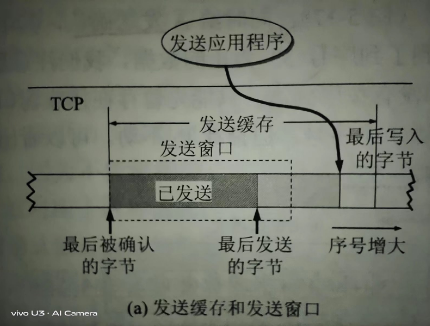
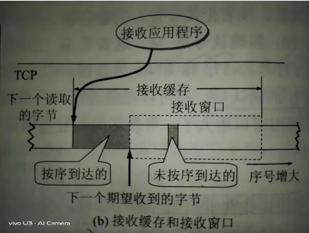

# 目录

[TOC]


# Linux Network Programming

## 计算机网络

### 网络分层模型

#### TCP/IP模型

链路层(或者叫网络接口层)，网络层，传输层，应用层。（网网传应，链网传应）

#### OSI模型

物理层，数据链路层，网络层，传输层，会话层，表示层，应用层。（物数网传会表应）


### 数据的封包与拆包

数据在经过每一层时会在前面==封装==协议头部，最后封装成帧，传输给目的主机，目的主机接收到以太网帧再经过每一层的==拆包==最后得到数据。

以http协议发送数据包为例：


每一层对数据封装后都会有不同的称谓：传输层叫做TCP**段(segment)**，网络层叫IP**数据报(datagram)**，数据链路层叫以太网**帧(frame)**。

### 物理层

### 数据链路层

#### 以太网帧

##### 以太网帧格式


协议类型对应三种：IP，ARP，RARP。

以太网帧中数据长度最小46字节，最大1500字节。最大值1500称为以太网的最大传输单元(==MTU==)。如果数据包超过MTU则要进行分片。**不够46字节，则要补填充位**，例如：ARP和RARP数据包长度不够46字节就要在后面补填充位。

### 网络层

#### ICMP协议

Internet Control Message Protocol，网际控制报文协议。需要使用IP协议，所以在IP协议的上层。

应用：

- PING（Packet InterNet Groper，分组网间探测）测试两个主机之间的连通性

#### IGMP协议

IGMP需要使用IP协议，所以在IP协议的上层。

#### IP协议

Internet Protocol，网际协议。

IP协议是无连接的、不可靠的协议，==它只负责很好的传输服务==。**无连接：不需要先建立连接，每个数据报独立发送，这也说明IP数据报可以不按发送顺序接收。不可靠：传输过程中可能出现丢失、重复、失序(即不按顺序到达终点)。**

任何可靠性要求需要TCP协议。

##### IP数据报格式


总长度：首部+数据。如果进行了分片，总长度指的是==每一个分片==的首部与该分片的数据长度之和。

片便偏移：当以太网帧中的类型是0800时，传输的就是IP数据报(首部+数据)，IP数据报不能超过MTU，如果超过则需要==分片==。分片的长度一定是8字节的整数倍，分片完成后把原首部拷贝到每个分片前面当做分片的首部。

首部检验和：只检查首部是否出现差错，而不检查数据。

##### IP地址

IP地址是一个32位无符号整数，为了方便记忆采用点分十进制来书写IP地址。按8位一组分成4组，每一个8位的数用十进制表示，并把他们用“.”连接在一起。如：192.168.2.1它对应的无符号整数是 0xc0a80201 。

| 11000000 (0xc0) | 10101000 (0xa8) | 00000010 (0x02) | 00000001 (0x01) |
| --------------- | --------------- | --------------- | --------------- |
| 192             | 168             | 2               | 1               |

==IP地址由网络号+主机号组成。==Internet委员会定义了5种IP地址类型以适合不同容量的网络，即A类~E类。其中A、B、C类（如下表格）由InternetNIC在全球范围内统一分配，D、E类为特殊地址。  D类地址称为广播地址，供特殊协议向选定的节点发送信息时用。E类地址保留给将来使用。

| 类别 | 网络号                            | 最大网络数     | IP地址范围                   | 主机号 | 最大主机数 | 私有IP地址范围                 |
| ---- | --------------------------------- | -------------- | ---------------------------- | ------ | ---------- | ------------------------------ |
| A    | 8bit, 第一位固定为 0              | 126（2^7­ - 2) | 0.0.0.0 ~ 127.255.255.255    | 24bit  | 16777214   | 10.0.0.0 ­~ 10.255.255.255     |
| B    | 16bit, 前两位固定为 10            | 16384(2^14)    | 128.0.0.0 ~ ­191.255.255.255 | 16bit  | 65534      | 172.16.0.0 ~­ 172.31.255.255   |
| C    | 24bit，前三位固定为 110           | 2097152(2^21)  | 192.0.0.0­ ~ 223.255.255.255 | 8bit   | 254        | 192.168.0.0 ­~ 192.168.255.255 |
| D    | 前四位固定为 1110，后面为多播地址 |                |                              |        |            |                                |
| E    | 前五位固定为 11110, 后面保留      |                |                              |        |            |                                |

##### 子网掩码

子网掩码只有一个作用：就是将IP地址划分成网络地址和主机地址。

对于A类地址来说，默认的子网掩码是**255.0.0.0**；对于B类地址来说默认的子网掩码是**255.255.0.0**；对于C类地址来说默认的子网掩码是**255.255.255.0**。  

==例如：192.168.1.22的ip地址，它的子网掩码是255.255.255.0，那么它的网络地址就是192.168.1，它的主机地址是22。==


#### ARP协议

Address Resolution Protocol，地址解析协议。**每台主机都维护一个arp缓存表，使用`arp -a`查看。**IP需要使用ARP协议，所以在IP协议的下层。

##### arp协议的功能

获取目的主机的物理地址（MAC地址）。

##### arp协议的作用

在网络通信时，数据包是先被==网卡==接收到的，然后再依次拆包传送到应用层，如果接收数据包的主机的物理地址与目的主机物理地址不一样，则丢弃。==因此在通信前必须获得目的主机的物理地址。==

##### arp协议格式


### 传输层

#### 端口号

光有IP地址只能找到目的主机，端口号用来区分把数据传给哪个进程。

端口号是一个16位的无符号整数，==每台计算机==可以有65535个端口号(0被保留)。

`/etc/services`里面记录了IANA(Internet Assigned Numbers Authority)因特网号码指派管理局“知名端口号”与服务的对应关系。  例如：

| 应用程序 | FTP  | TELNET | SMTP | DNS  | TFTP | HTTP | HTTPS | SNMP |
| -------- | ---- | ------ | ---- | ---- | ---- | ---- | ----- | ---- |
| 端口号   | 21   | 23     | 25   | 53   | 69   | 80   | 443   | 161  |

客户端使用的端口号是随机分配的，又叫范围端口号，范围是49152~65535，连接断开后不复存在。


#### TCP协议

Transmission Control Protocol，传输控制协议。

TCP是面向连接的、可靠的、基于字节流的协议。连接指的是双方通信要进行三次握手的建立连接，UDP不需要。

##### TCP首部


数据偏移：其实就是保存TCP首部有多少字节，单位是32位字(8位是一个字节)，4位表示十进制最大数是15，所以TCP首部最大是60字节(15*4)。

又因为有20字节的首部长度，所以==选项部分最大只能有40字节==。

PSH：接收方接收到PSH=1的报文段，==立即==传送缓冲区内的数据，无需等到缓冲区满。

窗口：==指的是自己的接收窗口，而不是自己的发送窗口。==明确指出了现在允许对方发送的数据量，窗口值是动态变化的。$\color{orange} {本方的接收窗口就是对方的发送窗口。}$

TCP选项：

- MSS：(Maximum Segment Size)最大报文长度，TCP的数据部分(应用层协议+应用数据)，不包含首部。 <a id="MSS"></a>
- 时间戳：占10字节，由4部分构成：类别、长度、发送方时间戳、回显时间戳。<a id="TCP首部时间戳"></a>


时间戳选项有两个作用：

1. 计算往返时间RTT。**==从发送报文到接收到ACK==**。[TCP超时重传](#TCP超时重传)

2. 用于处理TCP序号超过2^32的情况(序列号占4个字节)，又称为防止序号绕回 PAWS(Protect Against Wrapped Sequenece numbers)。在高速网络中，序号在很短时间有可能被重复利用。

   

##### 三次握手

**tcp写端关闭，读端继续读**：==会返回0，可以利用这一特性来关闭本端socket.==

**tcp读端关闭，写端继续写**：==第一次会收到一个RST包，第二次会收到到一个SIGPIPE信号，write返回-1，errno值为EPIPE.==

**tcp写端比读端快**：==写端写满发送缓冲区后将会阻塞。==


###### TCP与UDP的区别

TCP是面向连接的、可靠的、基于字节流的协议。

UDP是无连接的、不可靠的、基于数据报的协议。

###### TCP 为什么是三次握手，而不是两次或四次？

1. 防止“==已失效的连接请求报文段==”(历史连接)又传到了服务端建立了重复的连接。

   比如说，客户端向服务端发送了一个SYN请求，但由于网络原因长时间滞留在某一节点导致客户端没能收到ACK确认报文，然后客户端又向服务端发送了一个SYN请求，这次建立了连接，数据传输完毕连接关闭。

   但过了一段时间第一次发送的SYN报文也到达了服务端，**如果采用两次握手**，服务端只要给客户端发送确认报文，新的连接就建立了。但是客户端并没有数据发送，就导致连接的资源就浪费掉了。**如果采用三次握手**，客户端还要发送的一个确认报文给服务端，像刚才那种情况客户端不会发送确认报文，历史连接就不会建立了。

2. ==确认双方发送的序列号==，至少需要三次。

   客户端和服务端都会向对方发送seq序列号，确认过程至少3次。**两次握手**不能确认服务端的序列号。**四次握手**效率低，在第二次把SYN和ACK都置1就行了，没必要分开发送两次。(==TCP既要保证可靠传输，又要保证传输效率。==)

###### TCP的粘包问题

读取边界错误，导致读到了前一个包的尾和后一个包的头。

解决：

1. **包头保存包体的长度**，先读包头长度，再根据包头保存的包体长度读取包体。
2. 在数据包之间设置特殊符号，如：`\r\n`。redis好像是RESP。
3. 发送定长包

###### 为什么SYN/FIN不包含数据却要消耗一个序列号？

1. TCP规定，即使SYN/FIN报文段不携带数据，也要消耗掉一个序号。

2. ==凡是需要对方确认的报文，都需要消耗序列号。==

###### TCP都有哪些定时器？<a id="TCP都有哪些定时器"></a>

[重传定时器](#TCP超时重传)	发送完报文时设置

[时间等待定时器](#时间等待定时器)	客户端发送完最后一次ACK时设置

[保活定时器](#保活定时器)	服务端每收到一次数据就重新设置重传定时器

[持续定时器](#持续定时器)	收到“零窗口”时设置。

###### 为什么有了MTU还要有MSS？


###### 客户端连接没有打开的服务器进程？

客户端会接收到==RST+ACK==标志。

###### 传输过程中网络异常会发生什么？

网络异常(**拔掉网线属于网络异常的一种**)肯定就不会接收到数据了，但是进程不会挂。

==read并不会返回错误，将会阻塞等待数据。write并不会返回，它会一直往发送缓冲区中写入数据，直到写满。网络恢复正常，通信恢复，不需要重新建立连接，不会丢失数据。==


##### 四次挥手


FIN_WAIT-1：如果客户端长时间没收到ACK，则会处于此状态。

FIN_WAIT-2：客户端收到ACK后处于此状态(==半关闭状态==)，一直等待服务端发送FIN(==此时服务端还可以继续发送数据给客户端==)。

​		半关闭指的是客户端的TCP连接半关闭：TCP是全双工的，客户端的发送端关了，客户端的接收端还能接收数据。

LAST_ACK：服务端发送完数据，然后发送FIN包，进入LAST_ACK状态。

MSL：maximum segment lifetime 最长报文生存时间。

TIME_WAIT: **时间等待定时器**<a id="时间等待定时器"></a>，==**2MSL是客户端发送完最后一个ACK开始计时的**==。如果对方直接发送了`FIN+ACK`则直接进入`TIME_WAIT` 状态，无需经过`FIN_WAIT-2`状态。[TCP都有哪些定时器](#TCP都有哪些定时器)

==如果服务端主动关闭，则服务端就会有一段时间处于`TIME_WAIT`状态，导致端口被占用不能启动服务。==**”Address already in use“**  


###### TCP为什么要进行四次挥手？

1. 服务端在CLOSE_WAIT状态还有没发送完的数据，需要发送完再close FIN。

###### 为什么主动关闭的一方要等待2MSL？

1. **保证客户端的最后一个ACK报文能够到达服务端。**

   客户端发送的ACK报文有可能丢失，服务端接收不到确认报文就会超时重传FIN，客户端再重发ACK并重新计时。

   <u>*如果不等待2MSL，客户端在发送完ACK后马上释放连接*</u>，一旦服务端没有收到ACK，它就会一直处于==last_ack==的状态，导致服务端连接不会释放。

2. **保证“已失效的报文段”全都失效。**

   因为报文最大的生存时间是MSL，客户端在发送完最后一个ACK报文段，再经过2MSL时间，就可以让==**本连接持续的时间内**==所产生的的所有报文在网络中消失。<u>*如果不等待2MSL，客户端在发送完ACK后马上释放连接*</u>，然后这个连接马上又被复用了，并接收到了服务端传输的报文，就有可能导致数据错乱的情况。


##### TCP的有限状态机


粗实线表示客户端的流程，粗虚线表示服务器的流程，细实线表示异常流程。

CLOSING：双方同时调用close发送FIN就会处于此状态，表示双方都在关闭socket连接。


##### TCP半连接队列和全连接队列

半连接队列又称SYN队列，里面存放着还没收到ACK确认的连接(syn_recv)。

全连接队列又称accept队列，里面存放着三次握手成功的连接(established)。

三次握手成功后内核会把连接从半连接队列移除，放入全连接队列中，等待进程调⽤ accept 函数时把连接取出来。

```bash
cat /proc/sys/net/ipv4/tcp_max_syn_backlog	#半连接队列长度
cat /proc/sys/net/core/somaxconn		#全连接队列长度=min(somaxconn, backlog)  backlog最大不能超过它 
```


###### TCP SYN攻击

客户端伪造大量IP发送SYN包，服务端接收发送SYN+ACK，但是客户端不应答，这样就会造成大量处于SYN_RECV状态的半连接，一旦半连接队列满了就不能处理请求了。


##### TCP的保活机制(keepalive)<a id="保活定时器"></a>

[TCP都有哪些定时器](#TCP都有哪些定时器)

作用：==探测对端连接有没有失效。==

TCP设有一个**==保活定时器(keepalive timer)==**， 服务端==每接收到一次数据就会重新设置计时器==，如果超过规定的时间(2小时)没收到数据，就会向客户端发送一个**探测报文段**，之后每隔75分钟发送一次，若连续发送10个没有响应，则认为客户端出故障了，接着就关闭这个连接。

由于TCP设置的保活定时时间太长了，往往不会打开keepalive机制，而是在应用层做心跳机制。

```c
int flag = 1;
int len = sizeof(flag);
setsockopt(listenfd, IPPROTO_TCP, TCP_NODELAY, &flag, len);	// 打开保活机制
```

```c
// Linux 内核可以有对应的参数可以设置保活时间、保活探测的时间间隔、保活探测的次数
net.ipv4.tcp_keepalive_time=7200	// 保活时间7200秒(2小时)
net.ipv4.tcp_keepalive_intvl=75		// 检测间隔75分钟
net.ipv4.tcp_keepalive_probes=9		// 探测次数9次，超过9次认为对方中断了连接
    
```


##### TCP的重传机制

###### TCP超时重传<a id="TCP超时重传"></a>

[TCP都有哪些定时器](#TCP都有哪些定时器)

TCP的发送方在规定的时间内没有收到ACK，就要进行重传，但重传时间是个很复杂的问题。

RTT：数据包的往返时间。[TCP首部时间戳](#TCP首部时间戳)

RTO：Retransmission Timeout 超时重传时间 。


###### TCP快速重传

不以时间为驱动，⽽是以数据驱动重传。

###### 选择确认SACK

如果要使用选择确认SACK，就要在TCP首部选项中加上“SACK”，而且双方必须约定好。在 Linux 下，可以通过`net.ipv4.tcp_sack`参数打开这个功能（Linux2.4 后默认打开）。  

##### TCP的滑动窗口

TCP首部中的窗口指的是本端的接收窗口(告诉对方我能接收多少数据)，对端的发送窗口是根据本端接收窗口来调整的，如果发送窗口中的数据已发送但是没有得到确认，则窗口不能向前滑动(也就是说数据还要继续保留在发送窗口中)。

发送方的发送窗口不能超过接收端的接收窗口。

**可用发送窗口的大小 = 发送窗口的大小 - 已发送但未被确认的大小。**

###### 发送端数据包的状态

- 已发送已确认
- 已发送未确认
- 未发送能接收(接收端有空间接收)
- 未发送不能接收(接收端没有空间接收)


发送端速度比较慢：发送窗口中有未被发送的数据。

发送端速度比较快：发送窗口被填满，等待接收端的确认，不能继续发送数据。

###### 发送缓冲区与发送窗口



发送窗口只是发送缓冲区的一部分。

发送缓冲区中保存的是：

1. 已发送但还没确认的数据。
2. 还没发送的数据。(包括接收端可以接收的数据和接收不了的数据。)


###### 接收缓冲区与接收窗口



接收窗口是接收缓冲区的一部分。

接收缓冲区存放的是：

1. 按序到达的，但未被应用程序读取的数据。
2. 未按序到达的数据。

###### 发送窗口等于接收窗口吗？

发送窗口受接收窗口rwnd和拥塞窗口cwnd的影响，如果两者都考虑，发送窗口的大小应该是rwnd和cwnd中较小的那个，即==`swnd = Min[rwnd, cwnd]`==

1. 当`rwnd < cwnd`时，接收方的接收能力限制发送窗口的最大值。

2. 当`rwnd > cwnd`时，网络的拥塞程度限制发送窗口的最大值。

   

##### TCP的流量控制

==流量控制就是让发送方的发送速率不要太快，要让接收方来得及接收。==

###### 滑动窗口控制发送速率

###### 零窗口死锁<a id="持续定时器"></a>

[TCP都有哪些定时器](#TCP都有哪些定时器)

综述：**非零窗口的通知丢失了，导致双方相互等待。零窗口探测报文打破死锁。**

解释：当接收方的接收速度很慢时，接收窗口有可能变为0，那么发送方收到**“零窗口”**的通知就不会再发送数据，直到等到**“非零窗口”**的通知才会继续发送数据。

如果过了一段时间，接收方的接收缓冲区有空间了，并向发送方发送了“非零窗口”的通知，**<u>但是这个报文段在发送过程中丢失了</u>**，那么就会造成发送方和接收方一直**==相互等待的“死锁”局面==**。

**解决零窗口死锁：**TCP为每一个连接都设置了一个==**持续定时器(persistence timer)**==，只要接收到“零窗口”通知就立即启动定时器，如果当定时器到时还没收到“非零窗口的通知”就发送一个==**零窗口探测报文段(仅携带1字节的数据)**==，对方在确认这个报文时携带上**窗口值**，这样就打破了死锁的局面。

**<u>*如果收到的窗口值还为0，就重新设置计时器。*</u>**


###### 为什么“零窗口”还能接收报文？

TCP规定，即使设置为”零窗口“，也必须接收以下几种报文段：**==零窗口探测报文，确认报文，携带紧急数据的报文。==**


###### 糊涂窗口综合征

综述：**每次接收一个字节效率很低，让接收端等一段时间或等有足够的容量再去接收。**（小窗口问题）

当接收方读取数据的速度很慢，比如每次只接收一个字节，然后把确认报文+窗口值(1字节)又发给了发送端，发送端只能发送一个字节，如果这样进行下去，网络效率会很低。

解决方法：

- 针对接收端：
  1. 接收端等待一段时间再把窗口值通知给发送方。
  2. 等待接收缓冲区有足够的空间能够容纳一个最长的报文段再通知发送方。
  3. 等待接收缓冲区有一半的空闲空间再通知发送方。

- 针对发送端
  1. 发送端不要发送太小的报文段，等到数据累积到足够大的报文段再发送。
  2. 或等到接收方缓冲区的空间的一半再发送。


###### Nagle算法

解决网络传输速率慢的问题。

算法如下：若发送应用进程把**要发送的数据逐个字节地送到TCP的发送缓存，则发送方就把第一个数据字节先发送出去，把后面到达的数据字节都缓存起来**。当发送方收到对第一个数据字符的**确认后**，再**把发送缓存中的所有数据组装成一个报文段发送出去**，同时**继续对随后到达的数据进行缓存**。只有在收到对前一个报文段的确认后才继续发送下一个报文段。当数据到达较快而网络速率较慢时，用这样的方法可明显地减少所用的网络带宽。Nagle 算法还规定，**当到达的数据已达到发送窗口大小的一半或已达到报文段的最大长度时，就立即发送一个报文段**。这样做，就可以有效地提高网络吞吐量。


##### TCP的拥塞控制

-   慢开始( slow-start )
-   拥塞避免( congestion avoidance )
-   快重传( fast retransmit )
-   快恢复( fast recovery )

###### 慢开始和拥塞避免


###### 快重传和快恢复


#### UDP协议

UDP（User Datagram Protocol，用户数据报协议）

##### UDP首部


首部四个字段各占2字节，一共8字节。

**如果发送端速度快，接收端速度慢，就会丢失数据。**

##### UDP广播

广播地址：IP地址中==主机号==全为1。

例如，对于10.1.1.0 （255.255.255.0 ）网段，其广播地址为10.1.1.255 （255 即为2 进制的11111111 ），当发出一个目的地址为10.1.1.255 的分组(封包)时，它将被分发给**==该网段上的所有计算机。==**  

##### 问答

有分片的情况下如下处理：

问：如果MTU是1500，使用UDP发送 2000，那么recvfrom(2000)是收到1500，还是2000?

答： 还是接收2000，数据分片由IP层处理了，放到UDP还是一个完整的包。接收到的包是由路由路径上最少的MTU来分片，注意转到UDP已经在是组装好的(组装出错的包会经crc校验出错而丢弃)，是一个完整的数据包。

分片后的处理：

问：如果500那个片丢了怎么办？udp又没有重传

答：UDP里有个CRC检验，如果包不完整就会丢弃，也不会通知是否接收成功，所以UDP是不可靠的传输协议，而且TCP不存在这个问题，有自己的重传机制。在内网来说，UDP基本不会有丢包，可靠性还是有保障。当然如果是要求有时序性和高可靠性，还是走TCP，不然就要自己提供重传和乱序处理( UDP内网发包处理量可以达7w~10w/s )  。


### 会话层

### 表示层

### 应用层

#### http协议


## 网络IO模型

读写IO大致分为两个操作：

1.   等待：等待socket的可读或可写事件被触发。
2.   拷贝数据：将内核的数据拷贝到用户进程(read)，将用户进程的数据拷贝到内核(write)。

### 同步阻塞IO

```
read(fd, buffer, count)
```

等待事件触发和拷贝完数据，read才会返回。如果没有数据就会之一阻塞等待。

### 同步非阻塞IO

```c++
int flags = fcntl(socket, F_GETFL, 0);
fcntl(socket, F_SETFL, flags | O_NONBLOCK);
```

使用fcntl设置fd属性为O_NONBLOCK，如果没有可读的数据就会立即返回，不会阻塞当前线程，一般使用轮询的方式来不断的检查是否有数据可读，但是拷贝数据的操作还是同步的。

### 异步IO

**在调用read的时候会马上返回， 不等待条件触发，而且等拷贝完数据才通过某种方式(例如：回调)通知用户。**

linux下虽然提供了aio的接口，但对异步的支持并不好，只是把同步封装了一层，像boost.asio。windows IOCP对异步支持比较好。


## Socket编程

### 字节序

大端序：低字节放在高地址。网络 字节序采用大端序。

小端序：低字节放在低地址。

0x11223344 ----->想象成字符串："11223344"
		高尾端:44(低字节放在高地址): 大端
		低尾端:44(低字节放在低地址)：小端

#### 如何判断大小端

```c
// 方法一:
typedef union bl {
 	int data; 	// 0x12345678
  	char byte;  // 0x78 -->低字节放在低地址：小端   0x12-->大端
    // uint8_t byte;
}ble;
ble bigOrLittleEndian;
bigOrLittleEndian.data = 0x12345678;  
printf("little address = %x\n", bigOrLittleEndian.ch);  // 78

// 方法二:
int a = 0x12345678;
printf("little address = %x\n", *(char*)&(a));  // 78 低地址放低字节：小端序
```

### socketAPI

#### IP地址字节序转换

```c
#include <arpa/inet.h>
int inet_pton(int af, const char *src, void *dst);	// p:point:点分十进制	主机序转网络序
const char *inet_ntop(int af, const void *src, char *dst, socklen_t size);
```

#### 端口字节序转换

```c
#include <arpa/inet.h>
uint32_t htonl(uint32_t hostlong);
uint16_t htons(uint16_t hostshort);	// 主机序转网络序
uint32_t ntohl(uint32_t netlong);
uint16_t ntohs(uint16_t netshort);	// 网络序转主机序
```

#### 设置socket选项

```c
#include <sys/types.h>
#include <sys/socket.h>
int setsockopt(int sockfd, int level, int optname,const void *optval, socklen_t optlen);
```

sockfd：文件描述符

level：哪一层次。SOL_SOCKET、IPPROTO_TCP、IPPROTO_IP和IPPROTO_IPV6。SOL是socket option level的意思。

optname：套接字选项。

- SO_REUSEADDR

  在`TIME_WAIT`状态时允许端口复用。

- SO_REUSEPORT

- SO_BROADCAST

optval：optval表示是否启用，为0禁止选项，非0启用选项。

optval：optval的长度。

```c
int flag = 1;
int len = sizeof(flag);
setsockopt(listenfd, SOL_SOCKET, SO_REUSEADDR, &flag, len);
setsockopt(listenfd, SOL_SOCKET, SO_REUSEPORT, &flag, len);
setsockopt(listenfd, SOL_SOCKET, SO_KEEPALIVE, &flag, len);
setsockopt(listenfd, SOL_SOCKET, SO_BROADCAST, &flag, len);
setsockopt(listenfd, IPPROTO_TCP, TCP_NODELAY, &flag, len);
```


socket,bind,accept

#### listen

```c
#include <sys/socket.h>
int listen(int sockfd, int backlog);
```

```bash
cat /proc/sys/net/ipv4/tcp_max_syn_backlog	# tcp_max_syn_backlog指的是半连接队列，linux2.2之后backlog指的是全连接队列
cat /proc/sys/net/core/somaxconn	#全连接队列长度=min(somaxconn, backlog)  backlog最大不能超过它 
```

调用close会发FIN包。

#### 域名转换

##### 通过域名获取ip地址

gethostbyname

##### 通过ip地址获取域名

gethostbyaddr

#### 动态分配端口

getsockname


### TCP多进程服务器

使用多进程并发服务器时要考虑以下几点：

1. 父最大文件描述个数(**父进程中需要close关闭accept返回的新文件描述符**)
2. 系统内创建进程个数(内存大小相关)
3. 进程创建过多是否降低整体服务性能(进程调度)  


### TCP多线程服务器

在使用线程模型开发服务器时需考虑以下问题：

1. 调整进程内最大文件描述符上限
2. 线程如有共享数据，考虑线程同步
3. 服务与客户端线程退出时，退出处理。（退出值，分离态）
4. 系统负载，随着链接客户端增加，导致其它线程不能及时得到CPU


解决惊群效应可以在accept前面加互斥锁或条件变量。

### IO多路复用

#### select

最多监听1024个文件描述符，FD_SETSIZE。

#### poll

select是用数组存放fd，而poll把数组改成链表，所以没有限制了。

#### epoll

发送缓冲区不满:

1. LT模式下默认总是会触发EPOLLOUT事件，因为缓冲区总是可写的。
2. ET模式下由不可写变为可写时，才会触发EPOLLOUT事件。

所以对于poll()和epoll()的LT模式，不应在一开始就监听EPOLLOUT事件，因为这时发送缓冲区为空，总是会触发的(busy loop)。

LT模式监听EPOLLOUT应用场景: 

1. 应用程序向发送缓冲区去写数据，缓冲区写满了，但还没有写完，此时write阻塞并监听EPOLLOUT事件，等到对端把数据取走后(缓冲区不满)，触发EPOLLOUT事件，取消监听并write数据，如果再次写满则再监听。

对于epoll的ET模式,一开始监听EPOLLOUT事件不会触发(不会busy loop，好像客户端连接进来的时候只会触发一次(从不可写到可写)，后面再想触发只会从满到不满。

##### 为什么epoll要使用非阻塞IO？

ET模式下应该使用非阻塞IO，否则一直阻塞在read, 其他连接无法处理。

##### 水平触发

只要缓冲区中有数据，水平触发就会一直返回EPOLLIN事件。边缘触发只会触发一次，只有等有数据再次到达才会再次触发POLLIN事件，所以边沿模式要循环读取数据以防止数据没读完。

##### 边沿触发


##### epoll和select的区别

1. select最多监听1024个文件描述符，而epoll没有限制。
2. 每次调用select都需要把要监听的文件描述符集合拷贝内核，而epoll只需把fd挂到红黑树上。
3. select/poll需要在内核和用户态中遍历每个文件描述符找到就绪的fd，epoll只需要把就绪的fd拷贝到就绪数组中返回给用户态。

## references:

[linux网络基础.pdf](../wangguilin/-6- linux系统编程与网络编程/linux网络基础.pdf)

# HTTP

- cookie和session：
    cookie保存在客户端，session保存在服务端，当访问量增多session会影响服务器的的性能
    cookie不安全

