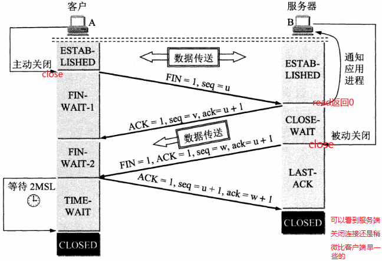

# 目录

[TOC]


# Linux Network Programming

## 计算机网络

### 网络分层模型

#### TCP/IP模型

链路层(或者叫网络接口层)，网络层，传输层，应用层。（网网传应，链网传应）

#### OSI模型

物理层，数据链路层，网络层，传输层，会话层，表示层，应用层。（物数网传会表应）


### 数据的封包与拆包

数据在经过每一层时会在前面==封装==协议头部，最后封装成帧，传输给目的主机，目的主机接收到以太网帧再经过每一层的==拆包==最后得到数据。

以http协议发送数据包为例：


每一层对数据封装后都会有不同的称谓：传输层叫做TCP**段(segment)**，网络层叫IP**数据报(datagram)**，数据链路层叫以太网**帧(frame)**。

### 物理层

### 数据链路层

#### 以太网帧

##### 以太网帧格式


协议类型对应三种：IP，ARP，RARP。

以太网帧中数据长度最小46字节，最大1500字节。最大值1500称为以太网的最大传输单元(==MTU==)。如果数据包超过MTU则要进行分片。**不够46字节，则要补填充位**，例如：ARP和RARP数据包长度不够46字节就要在后面补填充位。

### 网络层

#### ICMP协议

Internet Control Message Protocol，网际控制报文协议。

应用：

- PING（Packet InterNet Groper，分组网间探测）测试两个主机之间的连通性

#### IP协议

Internet Protocol，网际协议。

IP协议是无连接的、不可靠的协议，它只提供很好的传输服务。**无连接：不需要先建立连接，每个数据报独立发送，这也说明IP数据报可以不按发送顺序接收。不可靠：传输过程中可能出现丢失、重复、失序(即不按顺序到达终点)。**

任何可靠性要求需要TCP协议。

##### IP数据报格式


总长度：首部+数据。如果进行了分片，总长度指的是==每一个分片==的首部与该分片的数据长度之和。

片便偏移：当以太网帧中的类型是0800时，传输的就是IP数据报(首部+数据)，IP数据报不能超过MTU，如果超过则需要==分片==。分片的长度一定是8字节的整数倍，分片完成后把原首部拷贝到每个分片前面当做分片的首部。

首部检验和：只检查首部是否出现差错，而不检查数据。

##### IP地址

IP地址是一个32位无符号整数，为了方便记忆采用点分十进制来书写IP地址。按8位一组分成4组，每一个8位的数用十进制表示，并把他们用“.”连接在一起。如：192.168.2.1它对应的无符号整数是 0xc0a80201 。

| 11000000 (0xc0) | 10101000 (0xa8) | 00000010 (0x02) | 00000001 (0x01) |
| --------------- | --------------- | --------------- | --------------- |
| 192             | 168             | 2               | 1               |

==IP地址由网络号+主机号组成。==Internet委员会定义了5种IP地址类型以适合不同容量的网络，即A类~E类。其中A、B、C类（如下表格）由InternetNIC在全球范围内统一分配，D、E类为特殊地址。  D类地址称为广播地址，供特殊协议向选定的节点发送信息时用。E类地址保留给将来使用。

| 类别 | 网络号                            | 最大网络数     | IP地址范围                   | 主机号 | 最大主机数 | 私有IP地址范围                 |
| ---- | --------------------------------- | -------------- | ---------------------------- | ------ | ---------- | ------------------------------ |
| A    | 8bit, 第一位固定为 0              | 126（2^7­ - 2) | 0.0.0.0 ~ 127.255.255.255    | 24bit  | 16777214   | 10.0.0.0 ­~ 10.255.255.255     |
| B    | 16bit, 前两位固定为 10            | 16384(2^14)    | 128.0.0.0 ~ ­191.255.255.255 | 16bit  | 65534      | 172.16.0.0 ~­ 172.31.255.255   |
| C    | 24bit，前三位固定为 110           | 2097152(2^21)  | 192.0.0.0­ ~ 223.255.255.255 | 8bit   | 254        | 192.168.0.0 ­~ 192.168.255.255 |
| D    | 前四位固定为 1110，后面为多播地址 |                |                              |        |            |                                |
| E    | 前五位固定为 11110, 后面保留      |                |                              |        |            |                                |

##### 子网掩码

子网掩码只有一个作用：就是将IP地址划分成网络地址和主机地址。

对于A类地址来说，默认的子网掩码是**255.0.0.0**；对于B类地址来说默认的子网掩码是**255.255.0.0**；对于C类地址来说默认的子网掩码是**255.255.255.0**。  

==例如：192.168.1.22的ip地址，它的子网掩码是255.255.255.0，那么它的网络地址就是192.168.1，它的主机地址是22。==


#### ARP协议

Address Resolution Protocol，地址解析协议。**每台主机都维护一个arp缓存表，使用`arp -a`查看。**

##### arp协议的功能

获取目的主机的物理地址（MAC地址）。

##### arp协议的作用

在网络通信时，数据包是先被==网卡==接收到的，然后再依次拆包传送到应用层，如果接收数据包的主机的物理地址与目的主机物理地址不一样，则丢弃。==因此在通信前必须获得目的主机的物理地址。==

##### arp协议格式


### 传输层

#### 端口号

光有IP地址只能找到目的主机，端口号用来区分把数据传给哪个进程。

端口号是一个16位的无符号整数，==每台计算机==可以有65535个端口号(0被保留)。

`/etc/services`里面记录了IANA(Internet Assigned Numbers Authority)因特网号码指派管理局“知名端口号”与服务的对应关系。  例如：

| 应用程序 | FTP  | TELNET | SMTP | DNS  | TFTP | HTTP | HTTPS | SNMP |
| -------- | ---- | ------ | ---- | ---- | ---- | ---- | ----- | ---- |
| 端口号   | 21   | 23     | 25   | 53   | 69   | 80   | 443   | 161  |

客户端使用的端口号是随机分配的，又叫范围端口号，范围是49152~65535，连接断开后不复存在。


#### TCP协议

Transmission Control Protocol，传输控制协议。

TCP是面向连接的、可靠的、基于字节流的协议。连接指的是双方通信要进行三次握手的建立连接，UDP不需要。

##### TCP首部


数据偏移：其实就是保存TCP首部有多少字节，单位是32位字(8位是一个字节)，4位表示十进制最大数是15，所以TCP首部最大是60字节(15*4)。

又因为有20字节的首部长度，所以==选项部分最大只能有40字节==。

PSH：接收方接收到PSH=1的报文段，==立即==传送缓冲区内的数据，无需等到缓冲区满。

窗口：==指的是自己的接收窗口，而不是自己的发送窗口。==明确指出了现在允许对方发送的数据量，窗口值是动态变化的。$\color{orange} {本方的接收窗口就是对方的发送窗口。}$

##### 三次握手

**tcp写端关闭，读端继续读**：==会返回0，可以利用这一特性来关闭本端socket.==

**tcp读端关闭，写端继续写**：==第一次会收到一个RST包，第二次会收到到一个SIGPIPE信号，write返回-1，errno值为EPIPE.==

**tcp写端比读端快**：==写端写满发送缓冲区后将会阻塞。==


##### 四次挥手



##### TCP的有限状态机


半连接

半关闭

##### TCP超时重传

##### TCP滑动窗口

根据接收窗口调整发送窗口，如果发送窗口中的数据已发送但是没有得到确认，则窗口不能向前滑动(也就是说数据还要继续保留在发送窗口中)。

###### 发送缓冲区与发送窗口


###### 接收缓冲区与接收窗口


##### TCP流量控制

##### TCP拥塞控制

-   慢开始( slow-start )
-   拥塞避免( congestion avoidance )
-   快重传( fast retransmit )
-   快恢复( fast recovery )


##### TCP与UDP的区别

TCP是面向连接的、可靠的、基于字节流的协议。

UDP是无连接的、不可靠的、基于数据报的协议。

##### TCP 为什么是三次握手，而不是两次或四次？


[TCP 为什么是三次握手，而不是两次或四次？](https://www.zhihu.com/question/24853633/answer/115173386)

##### 为什么主动关闭的一方要等待2MSL？


##### TCP粘包

读取边界错误，导致读到了前一个包的尾和后一个包的头。

解决：

1. **包头保存包体的长度**，先读包头长度，再根据包头保存的包体长度读取包体。
2. 在数据包之间设置特殊符号，如：`\r\n`。redis好像是RESP。
3. 发送定长包

##### 客户端连接没有打开的服务器进程？

客户端会接收到==RST+ACK==标志。

##### 传输过程中网络异常会发生什么？

网络异常(**拔掉网线属于网络异常的一种**)肯定就不会接收到数据了，但是进程不会挂。

==read并不会返回错误，将会阻塞等待数据。write并不会返回，它会一直往发送缓冲区中写入数据，直到写满。网络恢复正常，通信恢复，不需要重新建立连接，不会丢失数据。==


#### UDP协议

UDP（User Datagram Protocol，用户数据报协议）

##### UDP首部


首部四个字段各占2字节，一共8字节。


### 会话层

### 表示层

### 应用层

#### http协议


## 网络IO模型

读写IO大致分为两个操作：

1.   等待：等待socket的可读或可写事件被触发。
2.   拷贝数据：将内核的数据拷贝到用户进程(read)，将用户进程的数据拷贝到内核(write)。

### 同步阻塞IO

```
read(fd, buffer, count)
```

等待事件触发和拷贝完数据，read才会返回。如果没有数据就会之一阻塞等待。

### 同步非阻塞IO

```c++
int flags = fcntl(socket, F_GETFL, 0);
fcntl(socket, F_SETFL, flags | O_NONBLOCK);
```

使用fcntl设置fd属性为O_NONBLOCK，如果没有可读的数据就会立即返回，不会阻塞当前线程，一般使用轮询的方式来不断的检查是否有数据可读，但是拷贝数据的操作还是同步的。

### 异步IO

**在调用read的时候会马上返回， 不等待条件触发，而且等拷贝完数据才通过某种方式(例如：回调)通知用户。**

linux下虽然提供了aio的接口，但对异步的支持并不好，只是把同步封装了一层，像boost.asio。windows IOCP对异步支持比较好。


## Socket编程

### 字节序

大端序：低字节放在高地址。网络 字节序采用大端序。

小端序：低字节放在低地址。

0x11223344 ----->想象成字符串："11223344"
		高尾端:44(低字节放在高地址): 大端
		低尾端:44(低字节放在低地址)：小端

#### 如何判断大小端

```c++
  union bl
  {
      int data; 	// 0x12345678
      char byte;    // 0x78 -->低字节放在低地址：小端   0x12-->大端
      // uint8_t byte;
  };
```

### IP地址字节序转换

```c
#include <arpa/inet.h>
int inet_pton(int af, const char *src, void *dst);	// p:point:点分十进制	主机序转网络序
const char *inet_ntop(int af, const void *src, char *dst, socklen_t size);
```

### 端口字节序转换

```c
#include <arpa/inet.h>
uint32_t htonl(uint32_t hostlong);
uint16_t htons(uint16_t hostshort);	// 主机序转网络序
uint32_t ntohl(uint32_t netlong);
uint16_t ntohs(uint16_t netshort);	// 网络序转主机序
```

### socketAPI

socket,bind,listen,accept

```c
#include <sys/socket.h>
int listen(int sockfd, int backlog);
// backlog: 在处理上一请求时，还可以接受多少个进入的请求。 就是接受连接队列的大小
```

查看系统默认backlog：

```bash
cat /proc/sys/net/ipv4/tcp_max_syn_backlog
```

调用close会发FIN包。


### TCP多进程服务器

使用多进程并发服务器时要考虑以下几点：

1. 父最大文件描述个数(**父进程中需要close关闭accept返回的新文件描述符**)
2. 系统内创建进程个数(内存大小相关)
3. 进程创建过多是否降低整体服务性能(进程调度)  


### TCP多线程服务器

在使用线程模型开发服务器时需考虑以下问题：

1. 调整进程内最大文件描述符上限
2. 线程如有共享数据，考虑线程同步
3. 服务与客户端线程退出时，退出处理。（退出值，分离态）
4. 系统负载，随着链接客户端增加，导致其它线程不能及时得到CPU


解决惊群效应可以在accept前面加互斥锁或条件变量。

### IO多路复用

#### select

#### poll

#### epoll


## references:

[linux网络基础.pdf](../wangguilin/-6- linux系统编程与网络编程/linux网络基础.pdf)

# HTTP

- cookie和session：
    cookie保存在客户端，session保存在服务端，当访问量增多session会影响服务器的的性能
    cookie不安全

