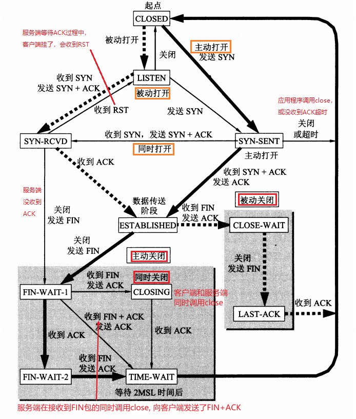

# 目录

[TOC]


# Linux Network Programming

## 计算机网络

### 网络分层模型

#### TCP/IP模型

链路层(或者叫网络接口层)，网络层，传输层，应用层。（网网传应，链网传应）

#### OSI模型

物理层，数据链路层，网络层，传输层，会话层，表示层，应用层。（物数网传会表应）


### 数据的封包与拆包

数据在经过每一层时会在前面==封装==协议头部，最后封装成帧，传输给目的主机，目的主机接收到以太网帧再经过每一层的==拆包==最后得到数据。

以http协议发送数据包为例：


每一层对数据封装后都会有不同的称谓：传输层叫做TCP**段(segment)**，网络层叫IP**数据报(datagram)**，数据链路层叫以太网**帧(frame)**。

### 物理层

### 数据链路层

#### 以太网帧

##### 以太网帧格式


协议类型对应三种：IP，ARP，RARP。

以太网帧中数据长度最小46字节，最大1500字节。最大值1500称为以太网的最大传输单元(==MTU==)。如果数据包超过MTU则要进行分片。**不够46字节，则要补填充位**，例如：ARP和RARP数据包长度不够46字节就要在后面补填充位。

### 网络层

#### ICMP协议

Internet Control Message Protocol，网际控制报文协议。需要使用IP协议，所以在IP协议的上层。

应用：

- PING（Packet InterNet Groper，分组网间探测）测试两个主机之间的连通性

#### IGMP协议

IGMP需要使用IP协议，所以在IP协议的上层。

#### IP协议

Internet Protocol，网际协议。

IP协议是无连接的、不可靠的协议，==它只负责很好的传输服务==。**无连接：不需要先建立连接，每个数据报独立发送，这也说明IP数据报可以不按发送顺序接收。不可靠：传输过程中可能出现丢失、重复、失序(即不按顺序到达终点)。**

任何可靠性要求需要TCP协议。

##### IP数据报格式


总长度：首部+数据。如果进行了分片，总长度指的是==每一个分片==的首部与该分片的数据长度之和。

片便偏移：当以太网帧中的类型是0800时，传输的就是IP数据报(首部+数据)，IP数据报不能超过MTU，如果超过则需要==分片==。分片的长度一定是8字节的整数倍，分片完成后把原首部拷贝到每个分片前面当做分片的首部。

首部检验和：只检查首部是否出现差错，而不检查数据。

##### IP地址

IP地址是一个32位无符号整数，为了方便记忆采用点分十进制来书写IP地址。按8位一组分成4组，每一个8位的数用十进制表示，并把他们用“.”连接在一起。如：192.168.2.1它对应的无符号整数是 0xc0a80201 。

| 11000000 (0xc0) | 10101000 (0xa8) | 00000010 (0x02) | 00000001 (0x01) |
| --------------- | --------------- | --------------- | --------------- |
| 192             | 168             | 2               | 1               |

==IP地址由网络号+主机号组成。==Internet委员会定义了5种IP地址类型以适合不同容量的网络，即A类~E类。其中A、B、C类（如下表格）由InternetNIC在全球范围内统一分配，D、E类为特殊地址。  D类地址称为广播地址，供特殊协议向选定的节点发送信息时用。E类地址保留给将来使用。

| 类别 | 网络号                            | 最大网络数     | IP地址范围                   | 主机号 | 最大主机数 | 私有IP地址范围                 |
| ---- | --------------------------------- | -------------- | ---------------------------- | ------ | ---------- | ------------------------------ |
| A    | 8bit, 第一位固定为 0              | 126（2^7­ - 2) | 0.0.0.0 ~ 127.255.255.255    | 24bit  | 16777214   | 10.0.0.0 ­~ 10.255.255.255     |
| B    | 16bit, 前两位固定为 10            | 16384(2^14)    | 128.0.0.0 ~ ­191.255.255.255 | 16bit  | 65534      | 172.16.0.0 ~­ 172.31.255.255   |
| C    | 24bit，前三位固定为 110           | 2097152(2^21)  | 192.0.0.0­ ~ 223.255.255.255 | 8bit   | 254        | 192.168.0.0 ­~ 192.168.255.255 |
| D    | 前四位固定为 1110，后面为多播地址 |                |                              |        |            |                                |
| E    | 前五位固定为 11110, 后面保留      |                |                              |        |            |                                |

##### 子网掩码

子网掩码只有一个作用：就是将IP地址划分成网络地址和主机地址。

对于A类地址来说，默认的子网掩码是**255.0.0.0**；对于B类地址来说默认的子网掩码是**255.255.0.0**；对于C类地址来说默认的子网掩码是**255.255.255.0**。  

==例如：192.168.1.22的ip地址，它的子网掩码是255.255.255.0，那么它的网络地址就是192.168.1，它的主机地址是22。==


#### ARP协议

Address Resolution Protocol，地址解析协议。**每台主机都维护一个arp缓存表，使用`arp -a`查看。**IP需要使用ARP协议，所以在IP协议的下层。

##### arp协议的功能

获取目的主机的物理地址（MAC地址）。

##### arp协议的作用

在网络通信时，数据包是先被==网卡==接收到的，然后再依次拆包传送到应用层，如果接收数据包的主机的物理地址与目的主机物理地址不一样，则丢弃。==因此在通信前必须获得目的主机的物理地址。==

##### arp协议格式


### 传输层

#### 端口号

光有IP地址只能找到目的主机，端口号用来区分把数据传给哪个进程。

端口号是一个16位的无符号整数，==每台计算机==可以有65535个端口号(0被保留)。

`/etc/services`里面记录了IANA(Internet Assigned Numbers Authority)因特网号码指派管理局“知名端口号”与服务的对应关系。  例如：

| 应用程序 | FTP  | TELNET | SMTP | DNS  | TFTP | HTTP | HTTPS | SNMP |
| -------- | ---- | ------ | ---- | ---- | ---- | ---- | ----- | ---- |
| 端口号   | 21   | 23     | 25   | 53   | 69   | 80   | 443   | 161  |

客户端使用的端口号是随机分配的，又叫范围端口号，范围是49152~65535，连接断开后不复存在。


#### TCP协议

Transmission Control Protocol，传输控制协议。

TCP是面向连接的、可靠的、基于字节流的协议。连接指的是双方通信要进行三次握手的建立连接，UDP不需要。

##### TCP首部


数据偏移：其实就是保存TCP首部有多少字节，单位是32位字(8位是一个字节)，4位表示十进制最大数是15，所以TCP首部最大是60字节(15*4)。

又因为有20字节的首部长度，所以==选项部分最大只能有40字节==。

PSH：接收方接收到PSH=1的报文段，==立即==传送缓冲区内的数据，无需等到缓冲区满。

窗口：==指的是自己的接收窗口，而不是自己的发送窗口。==明确指出了现在允许对方发送的数据量，窗口值是动态变化的。$\color{orange} {本方的接收窗口就是对方的发送窗口。}$

TCP选项：

- MSS：<a id="MSS"></a> (Maximum Segment Size)最大报文长度，TCP的数据部分(应用层协议+应用数据)，不包含首部。默认值是536字节。==收发双方可以有不同的MSS值，不需要协商，只需一方设置好后通知给另一方而已==。 
- 时间戳：占10字节，由4部分构成：类别、长度、发送方时间戳、回显时间戳。<a id="TCP首部时间戳"></a>


时间戳选项有两个作用：

1. 计算往返时间RTT。**==从发送报文到接收到ACK==**。[TCP超时重传](#TCP超时重传)

2. 用于处理TCP序号超过2^32的情况(序列号占4个字节)，又称为防止序号绕回 PAWS(Protect Against Wrapped Sequenece numbers)。在高速网络中，序号在很短时间有可能被重复利用。

   

##### 三次握手


###### TCP与UDP的区别

TCP是面向连接的、可靠的、基于字节流的协议。

UDP是无连接的、不可靠的、基于数据报的协议。

###### TCP 为什么是三次握手，而不是两次或四次？

1. 防止“==已失效的连接请求报文段==”(历史连接)又传到了服务端建立了重复的连接。

   比如说，客户端向服务端发送了一个SYN请求，但由于网络原因长时间滞留在某一节点导致客户端没能收到ACK确认报文，然后客户端又向服务端发送了一个SYN请求，这次建立了连接，数据传输完毕连接关闭。

   但过了一段时间第一次发送的SYN报文也到达了服务端，**如果采用两次握手**，服务端只要给客户端发送确认报文，新的连接就建立了。但是客户端并没有数据发送，就导致连接的资源就浪费掉了。**如果采用三次握手**，客户端还要发送的一个确认报文给服务端，像刚才那种情况客户端不会发送确认报文，历史连接就不会建立了。

2. ==确认双方发送的序列号==，至少需要三次。

   SYN 的全称就叫 Synchronize Sequence Numbers（==同步序列号==）。
   
   客户端和服务端都会向对方发送seq序列号，确认过程至少3次。**两次握手**不能确认服务端的序列号。**四次握手**效率低，在第二次把SYN和ACK都置1就行了，没必要分开发送两次。(==TCP既要保证可靠传输，又要保证传输效率。==)

###### TCP的粘包问题

读取边界错误，导致读到了前一个包的尾和后一个包的头。

解决：

1. **包头保存包体的长度**，先读包头长度，再根据包头保存的包体长度读取包体。
2. 在数据包之间设置特殊符号，如：`\r\n`。redis好像是RESP。
3. 发送定长包

###### 为什么SYN/FIN不包含数据却要消耗一个序列号？

1. TCP规定，即使SYN/FIN报文段不携带数据，也要消耗掉一个序号。

2. ==凡是需要对方确认的报文，都需要消耗序列号。==

###### TCP都有哪些定时器？<a id="TCP都有哪些定时器"></a>

[重传定时器](#TCP超时重传)	发送完报文时设置

[时间等待定时器](#时间等待定时器)	客户端发送完最后一次ACK时设置

[保活定时器](#保活定时器)	服务端每收到一次数据就重新设置重传定时器

[持续定时器](#持续定时器)	收到“零窗口”时设置。

###### 为什么有了MTU还要有MSS？

省去在IP层分片，提高效率。如果一个IP分片丢失，需要重传整个IP报文。某个TCP段丢失只需传输丢失的片段。

- 如果⼀个⼤的 TCP 报⽂是被 MTU 分⽚，那么**只有【第⼀个分⽚】才具有 TCP 头部**，==后⾯的分⽚则没有TCP 头部==，接收⽅ IP 层只有重组了这些分⽚，才会认为是⼀个 TCP 报⽂，那么丢失了其中⼀个分⽚，接收⽅ IP 层就不会把 TCP 报⽂丢给 TCP 层，那么就会等待对⽅超时重传这⼀整个 TCP 报⽂。  
- 如果⼀个⼤的 TCP 报⽂被 MSS 分⽚，那么所有【分⽚都具有 TCP 头部】，因为==每个 MSS 分⽚的是具有==
  ==TCP 头部==的TCP报⽂，那么其中⼀个 MSS 分⽚丢失，就只需要重传这⼀个分⽚就可以。  


###### 客户端连接没有打开的服务器进程？

客户端会接收到==RST+ACK==标志。

###### 传输过程中网络异常会发生什么？

网络异常(**拔掉网线属于网络异常的一种**)肯定就不会接收到数据了，但是进程不会挂。

==read并不会返回错误，将会阻塞等待数据。write并不会返回，它会一直往发送缓冲区中写入数据，直到写满。网络恢复正常，通信恢复，不需要重新建立连接，不会丢失数据。==

###### TCP第一次握手SYN丢包了，会发生什么？<a id="第一次握手SYN丢包了，会发生什么"></a>

客户端发送SYN包超时没收到时，会重发。超时重传次数由内核参数`tcp_syn_retries`指定，超时时间RTO是指数(翻倍)增长的(2,4,8,16)

```bash
cat /proc/sys/net/ipv4/tcp_syn_retries	# SYN报文重传次数：5			1+2=3 -> 3+4=7 -> 7+8=15 -> 15+16=31
echo 2 > /proc/sys/net/ipv4/tcp_syn_retries	#修改重传次数
```

模拟SYN包丢失：

```bash
# 拔掉服务器网线
# 在客户端发起连接请求 date;curl http://serverIP;date
```

###### TCP第二次握手SYN+ACK丢包了，会发生什么？<a id="第二次握手SYN+ACK丢包了，会发生什么"></a>

对于客户端来说收不到ACK，会超时重发；对于服务端来说，收不到客户端的应答也会超时重发，重传次数由内核参数`tcp_synack_retries  `限制，超时时间RTO同SYN一样也是指数增长的。

```bash
 cat /proc/sys/net/ipv4/tcp_synack_retries	# 第二次握手重传次数
 echo 2 > /proc/sys/net/ipv4/tcp_synack_retries #修改重传次数
```

模拟SYN+ACK包丢失：

```bash
# 客户端配置防火墙限制，把来自服务端的包都丢弃	iptables -I INPUT -s serverIP -j DROP
# 在客户端发起连接请求 date;curl http://serverIP;date
```

##### TCP第三次握手ACK丢包了，会发生什么？<a id="第三次握手ACK丢包了，会发生什么"></a>

服务端处于SYN_RECV状态，没收到ACK会超时重传FIN+ACK，超过最大次数`tcp_synack_retries  `会断开连接；客户端处于established状态，发送数据收不到ACK，会超时重传，超过最大重传次数`tcp_retries2  `断开连接。

```bash
cat /proc/sys/net/ipv4/tcp_retries2	#TCP建⽴连接后的数据包传输，最⼤超时重传次数 15
```

那如果客户端不发送数据，那什么时候才会断开处于eatablished状态的连接呢？

- 涉及到TCP保活机制，超过保活时间会断开。[keepalive](#保活定时器)

模拟ACK包丢失：

```bash
# 服务端配置防火墙限制屏蔽来自客户端的ACK包。 iptables -I INPUT -s clientIP -p tcp --tcp-flag ACK ACK -j DROP
# 在客户端发起连接请求 date;curl http://serverIP;date 或者 telnet serverIP port
```


##### 四次挥手


FIN_WAIT-1：如果客户端长时间没收到ACK，则会处于此状态。

FIN_WAIT-2：客户端收到ACK后处于此状态(==半关闭状态==)，此时**客户端的发送通道关闭了**，一直等待服务端发送FIN(==此时服务端还可以继续发送数据给客户端==)。==半关闭==指的是客户端的TCP连接半关闭：TCP是全双工的，**客户端的发送端关了，客户端的接收端还能接收数据。**

LAST_ACK：服务端发送完数据，然后发送FIN包，进入LAST_ACK状态。

MSL：maximum segment lifetime 最长报文生存时间。默认30秒。

```c
#define TCP_TIMEWAIT_LEN (60*HZ) /* how long to wait to destroy TIME-WAIT state, about 60 seconds */
```

TIME_WAIT: **时间等待定时器**<a id="时间等待定时器"></a>，==**2MSL是客户端发送完最后一个ACK开始计时的**==。如果对方直接发送了`FIN+ACK`则直接进入`TIME_WAIT` 状态，无需经过`FIN_WAIT-2`状态。[TCP都有哪些定时器](#TCP都有哪些定时器)

==如果服务端主动关闭，则服务端就会有一段时间处于`TIME_WAIT`状态，导致端口被占用不能启动服务。==**”Address already in use“**  


###### TCP为什么要进行四次挥手？

1. 服务端在CLOSE_WAIT状态==可能还有数据需要处理和发送==没发送完的数据，等数据发送完再close FIN。
2. 如果服务端在收到客户端的FIN包时，没有数据向客户端发送，就会把FIN+ACK一起发送给客户端，就成了三次挥手。

###### 为什么主动关闭的一方要等待2MSL？

1. **保证客户端的最后一个ACK报文能够到达服务端。**

   客户端发送的ACK报文有可能丢失，服务端接收不到确认报文就会超时重传FIN，客户端再重发ACK并重新计时。

   <u>*如果不等待2MSL，客户端在发送完ACK后马上释放连接*</u>，一旦服务端没有收到ACK，它就会一直处于==last_ack==的状态，导致服务端连接不会释放。

2. **保证“已失效的报文段”全都失效。**

   因为报文最大的生存时间是MSL，客户端在发送完最后一个ACK报文段，再经过2MSL时间，就可以让==**本连接持续的时间内**==所产生的的所有报文在网络中消失。<u>*如果不等待2MSL，客户端在发送完ACK后马上释放连接*</u>，然后这个连接马上又被复用了，并接收到了服务端传输的报文，就有可能导致数据错乱的情况。

客户端第四次挥⼿ACK丢失，服务端超时重发的FIN报⽂也丢失，客户端timewait时间超过了2MSL，这个时候会发⽣什么？认为连接已经关闭吗？ 
1. 当客户端 timewait 时间超过了 2MSL，则客户端就直接进⼊关闭状态。
2. 服务端超时重发 FIN 报⽂的次数如果超过 `tcp_orphan_retries` 大小后，服务端也会关闭 TCP 连接  。

###### 孤儿链接<a id="孤儿连接"></a>

调用close方法一方的连接称为孤儿连接。孤儿连接的数量由内核参数==`tcp_max_orphans`==控制。

```bash
# 查看孤儿连接的数量
cat /proc/sys/net/ipv4/tcp_max_orphans
```

###### close和shutdown的区别？

关闭连接的⽅式通常有两种，分别是 RST 报⽂关闭和 FIN 报⽂关闭：

- 如果进程异常退出了，内核就会发送 RST 报⽂来关闭，它可以不⾛四次挥⼿流程，是⼀个暴⼒关闭连接的⽅式。  

- 安全关闭连接的⽅式必须通过四次挥⼿，它由进程调⽤ close 和 shutdown 函数发起 FIN 报⽂。

**close意味着完全断开连接**，既不能发送数据也不能接收数据(先关闭发送[写]：FIN_WAIT2， 后关闭接收[读]：2MSL结束)。`netstat -p`发现连接对应的进程名为空。

**shutdown可以只关闭一个方向的连接。**

```c
//SHUT_RD(0)：关闭连接的读，如果接收缓冲区中有数据则丢弃，并且后续接收的数据发送ACK确认后丢弃。 
//SHUT_WR(1)：关闭连接的写，如果发送缓冲区中有数据则马上发送出去，并把FIN发送给对端。通常这种连接成为半关闭连接。
//SHUT_RDWR(2)：关闭连接的读和写，相当于SHUT_RD和SHUT_WR各操作一次。
int shutdown(int sock, int howto);
```

###### 第一次挥手的FIN包丢了，会发生什么？<a id="第一次挥手的FIN包丢了会发生什么"></a>

主动方发送FIN后一直收不到ACK，会处于FIN_WAIT1状态，并超时重传FIN，重传次数由内核参数==`tcp_orphan_retries`==控制。[调整重传FIN的次数](#调整重传FIN的次数)

```bash
# 查看FIN报文的重发次数，默认值是0，表示特指重发8次
cat /proc/sys/net/ipv4/tcp_orphan_retries
```


##### TCP的有限状态机



粗实线表示客户端的流程，粗虚线表示服务器的流程，细实线表示异常流程。

CLOSING：双方同时调用close发送FIN就会处于此状态，表示双方都在关闭socket连接。


##### TCP半连接队列和全连接队列

半连接队列又称SYN队列，里面存放着还没收到ACK确认的连接(syn_recv)。

全连接队列又称accept队列，里面存放着三次握手成功的连接(established)。

三次握手成功后内核会把连接从半连接队列移除，放入全连接队列中，**等待进程调⽤ accept 函数时把连接取出来**。

不管是半连接队列还是全连接队列，都有最⼤⻓度限制，超过限制时，内核会直接**丢弃**，或**返回 RST 包**。  这个和`tcp_abort_on_overflow`有关。


###### 配置全连接队列和半连接队列<a id="配置全连接队列和半连接队列"></a>

```bash
cat /proc/sys/net/ipv4/tcp_max_syn_backlog	#半连接队列长度=tcp_max_syn_backlog，somaxconn，backlog三个的运算
cat /proc/sys/net/core/somaxconn		#全连接队列长度=min(somaxconn, backlog)  backlog最大不能超过它 
```

###### 查看全连接队列状态

使用`ss`命令查看全连接队列的状态，对于获取的`Recv-Q/Send-Q`又分为**LISTEN状态**和**非LISTEN状态**。

- listen状态

  ```bash
  # -l 显示正在Listener 的socket
  # -n 不解析服务名称
  # -t 只显示tcp
  
  # Recv-Q 当前全连接数目，也就是已完成三次握手并等待服务端accept()的TCP全连接总数。
  # Send-Q 全连接队列的最大长度
  
  [root@server ~]$  ss -lnt | grep 6080
  State  Recv-Q Send-Q  Local Address:Port   Peer Address:Port
  LISTEN     0   100       :::6080                  :::*
  ```

- 非listen状态

  ```bash
  # Recv-Q 已收到但未被应用进程读取的字节数
  # Send-Q 已发送但未收到确认的字节数
  [root@server ~]$  ss -nt | grep 6080
  State  Recv-Q Send-Q  Local Address:Port   Peer Address:Port
  ESTAB     0   433       :::6080                  :::*
  ```

###### 查看半连接队列状态

半连接，也就是处于SYN_RECV状态的TCP连接，这种状态的连接都存在半连接队列，使用如下命令查看：

```bash
netstat -antp | grep SYN_RECV | wc -l	# 查看半连接队列 wc -l是用来统计数目，把它去掉查看状态
```

###### 全连接队列溢出

使用wrk工具对服务端进行压测，模拟全连接队列溢出。

```bash
# -t 6 		表示6个线程
# -c 30000	表示3万个连接
# -d 60s 	表示持续压测60秒
wrk -t 6 -c 30000 -d 60s http://serverIP:port
```

当超过最大全连接队列，服务端会把丢掉的连接个数统计起来，使用`netstat -s`命令查看：

```bash
date; netstat -s | grep overflowed	#统计丢失的TCP连接
```

当全连接队列溢出，服务端采用丢弃(**默认**)还是发送RST包来回应客户端是由`tcp_abort_on_overflow  `这个内核选项来控制的。

```bash
cat /proc/sys/net/ipv4/tcp_abort_on_overflow # 默认值 0
tcp_abort_on_overflow=0：#表示当全连接队列溢出时，丢弃客户端发过来的ACK。此时服务端处于【syn_rcvd】的状态，客户端处于【established】的状态。在该状态下会有一个定时器重传服务端 SYN+ACK 给客户端（不超过tcp_synack_retries 指定的次数，Linux下默认5）。超过后，服务器不在重传，后续也不会有任何动作。如果此时客户端发送数据过来，服务端会返回RST(有限状态机)。(疑问：为什么丢弃了还要重传？)
tcp_abort_on_overflow=1：#表示当全连接队列溢出时，服务端直接返回RST通知client，表示废掉这个握手过程和这个连接，client会报connection reset by peer。
```

###### 半连接队列溢出

半连接队列溢出其实就是**SYN攻击**(DDos攻击)。可以使用`hping3`工具模拟SYN攻击。

```bash
# -S		指定TCP标志位为SYN
# -P 8080	指定目的端口
# --flood
hping3 -S -p serverPort --flood serverIP
```

使用`netstat -s`命令查看半连接队列溢出情况：

```bash
netstat -s | grep "SYNs to LISTEN"	#统计有多少连接由于半连接队列溢出而被丢弃
```

增大半连接队列的大小比较麻烦，需要修改内核参数：**tcp_max_syn_backlog、somaxconn、和listen中的backlog。**

除了增大半连接队列，还可以通过开启`tcp_syncookies`参数**避开使用半连接队列**建立连接。当开启了 syncookies 功能就不会丢弃连接。其原理是这样：服务端根据当前状态算出一个值，并和SYN+ACK包一起发送给客户端，然后客户端把该值和ACK一起应答给服务端，服务端再取出该值进行验证，验证成功建立连接。<a id="tcp_syncookies"></a>

```bash
# 查看tcp_syncookies的默认值
# 0：不开启该功能
# 1：当半连接队列满时，开启该功能
# 2：无条件开启该功能
cat /proc/sys/net/ipv4/tcp_syncookies	# 1 默认打开
echo 1 > /proc/sys/net/ipv4/tcp_syncookies
```


##### TCP快速打开(TFO)<a id="TFO"></a>

TCP Fast Open

作用：减少TCP建立连接的时延。

原理：

1. 客户端第一次与服务端建立连接，**服务端**在第二次握手的时候**产生一个cookie**(已加密)并通过FIN+ACK包一起发给客户端，客户端**==缓存这个cookie==**。
2. 下次客户端再对服务端发起连接请求时，**带上cookie和SYN一同发送**，服务端验证cookie值，验证成功就建立连接，省去了三次握手。==而且在第一次握手就能发送数据，第二次握手就能应答数据。==


通过设置内核参数`tcp_fastopn  `打开fast open功能。==TFO功能需要客户端和服务端同时打开才有效果==。

```bash
# 查看TCP Fast Open功能开启情况
# 0：关闭
# 1：作为客户端使用Fast Open功能
# 2：作为服务端使用Fast Open功能
# 3：无论作为客户端还是服务端，都使用Fast Open功能
cat /proc/sys/net/ipv4/tcp_fastopen	# 1默认
echo 3 > /proc/sys/net/ipv4/tcp_fastopen	
```

##### TCP SYN攻击

客户端伪造大量IP发送SYN包，服务端接收发送SYN+ACK，但是客户端不应答，这样就会造成**大量处于SYN_RECV状态的半连接**，一旦半连接队列满了就不能处理请求了。

###### 防御SYN攻击

1. 增大半连接队列

   要想增大半连接队列，需要增大tcp_max_syn_backlog，somaxconn，和listen中的backlog。[配置全连接队列和半连接队列](#配置全连接队列和半连接队列)

2. 开启tcp_syncookies功能

   echo 1 > /proc/sys/net/ipv4/tcp_syncookies [tcp_syncookies](#tcp_syncookies)

3. 减少SYN+ACK的重传次数

   由于处于SYN_RECV状态的连接超出重传次数后才会断开连接，减小`tcp_synack_retries`的值加快连接断开。[第二次握手SYN+ACK丢包了，会发生什么](#第二次握手SYN+ACK丢包了，会发生什么)

   

##### TCP的保活机制(keepalive)<a id="保活定时器"></a>

[TCP都有哪些定时器](#TCP都有哪些定时器)

作用：==探测对端连接有没有失效。==

TCP设有一个**==保活定时器(keepalive timer)==**， 服务端==每接收到一次数据就会重新设置计时器==，如果超过规定的时间(2小时)没收到数据，就会向客户端发送一个**探测报文段**，之后每隔**75秒**发送一次，若连续发送10个没有响应，则认为客户端出故障了，接着就关闭这个连接。

由于TCP设置的保活定时时间太长了，往往不会打开keepalive机制，而是在应用层做心跳机制。

```c
int flag = 1;
int len = sizeof(flag);
setsockopt(listenfd, IPPROTO_TCP, TCP_NODELAY, &flag, len);	// 打开保活机制
```

```c
// Linux 内核可以有对应的参数可以设置保活时间、保活探测的时间间隔、保活探测的次数
net.ipv4.tcp_keepalive_time=7200	// 保活时间7200秒(2小时)
net.ipv4.tcp_keepalive_intvl=75		// 检测间隔75秒 
net.ipv4.tcp_keepalive_probes=9		// 探测次数9次，超过9次认为对方中断了连接
    
```


##### TCP的重传机制

###### TCP超时重传<a id="TCP超时重传"></a>

[TCP都有哪些定时器](#TCP都有哪些定时器)

TCP的发送方在规定的时间内没有收到ACK，就要进行重传，但重传时间是个很复杂的问题。

RTT：数据包的往返时间。[TCP首部时间戳](#TCP首部时间戳)

RTO：Retransmission Timeout 超时重传时间 。


###### 选择确认SACK

如果要使用选择确认SACK，就要在TCP首部选项中加上“SACK”，而且双方必须约定好。在 Linux 下，可以通过`net.ipv4.tcp_sack`参数打开这个功能（Linux2.4 后默认打开）。  

```bash
 cat /proc/sys/net/ipv4/tcp_sack
```


##### TCP的滑动窗口

TCP首部中的窗口指的是**本端的接收窗口**(告诉对方我能接收多少数据)，**对端的发送窗口是根据本端接收窗口来调整的**，如果发送窗口中的数据已发送但是没有得到确认，则窗口不能向前滑动(也就是说数据还要继续保留在发送窗口中)。

发送方的发送窗口不能超过接收端的接收窗口。

**可用发送窗口的大小 = 发送窗口的大小 - 已发送但未被确认的大小。**

###### 发送端数据包的状态

- 已发送已确认
- 已发送未确认
- 未发送能接收(接收端有空间接收)
- 未发送不能接收(接收端没有空间接收)


发送端速度比较慢：发送窗口中有未被发送的数据。

发送端速度比较快：发送窗口被填满，等待接收端的确认，不能继续发送数据。

###### 发送缓冲区与发送窗口

发送窗口只是发送缓冲区的一部分。

发送缓冲区中保存的是：

1. 已发送但还没确认的数据。
2. 还没发送的数据。(包括接收端可以接收的数据和接收不了的数据。)

###### 接收缓冲区与接收窗口

接收窗口是接收缓冲区的一部分。

接收缓冲区存放的是：

1. 按序到达的，但未被应用程序读取的数据。
2. 未按序到达的数据。


###### 发送窗口等于接收窗口吗？

发送窗口受接收窗口rwnd和拥塞窗口cwnd的影响，如果两者都考虑，发送窗口的大小应该是rwnd和cwnd中较小的那个，即==`swnd = Min[rwnd, cwnd]`==

1. 当`rwnd < cwnd`时，接收方的接收能力限制发送窗口的最大值。
2. 当`rwnd > cwnd`时，网络的拥塞程度限制发送窗口的最大值。


**tcp写端关闭，读端继续读**：==会返回0，可以利用这一特性来关闭本端socket.==

**tcp读端关闭，写端继续写**：==第一次会收到一个RST包，第二次会收到到一个SIGPIPE信号，write返回-1，errno值为EPIPE.==

**tcp写端比读端快**：==写端写满发送缓冲区后将会阻塞。==


##### TCP的流量控制

==流量控制就是让发送方的发送速率不要太快，要让接收方来得及接收。==

###### 滑动窗口控制发送速率

###### 零窗口死锁<a id="持续定时器"></a>

[TCP都有哪些定时器](#TCP都有哪些定时器)

综述：**非零窗口的通知丢失了，导致双方相互等待。零窗口探测报文打破死锁。**

解释：当接收方的接收速度很慢时，接收窗口有可能变为0，那么发送方收到**“零窗口”**的通知就不会再发送数据，直到等到**“非零窗口”**的通知才会继续发送数据。

如果过了一段时间，接收方的接收缓冲区有空间了，并向发送方发送了“非零窗口”的通知，**<u>但是这个报文段在发送过程中丢失了</u>**，那么就会造成发送方和接收方一直**==相互等待的“死锁”局面==**。

**解决零窗口死锁：**TCP为每一个连接都设置了一个==**持续定时器(persistence timer)**==，只要接收到“零窗口”通知就立即启动定时器，如果当定时器到时还没收到“非零窗口的通知”就发送一个==**零窗口探测报文段(仅携带1字节的数据)**==，对方在确认这个报文时携带上**窗口值**，这样就打破了死锁的局面。

**<u>*如果收到的窗口值还为0，就重新设置计时器。*</u>**


###### 为什么“零窗口”还能接收报文？

TCP规定，即使设置为”零窗口“，也必须接收以下几种报文段：**==零窗口探测报文，确认报文，携带紧急数据的报文。==**


###### 糊涂窗口综合征

综述：**每次接收一个字节效率很低，让接收端等一段时间或等有足够的容量再去接收。**（小窗口问题）

当接收方读取数据的速度很慢，比如每次只接收一个字节，然后把确认报文+窗口值(1字节)又发给了发送端，发送端只能发送一个字节，如果这样进行下去，网络效率会很低。

解决方法：

- 针对接收端：==接收方不把小窗口通知给发送方==
  1. 接收端等待一段时间再把窗口值通知给发送方。
  2. 等待接收缓冲区有足够的空间能够容纳一个最长的报文段再通知发送方。
  3. 等待接收缓冲区有一半的空闲空间再通知发送方。

- 针对发送端：==发送方不发送小数据给接收方==
  1. 发送端不要发送太小的报文段，等到数据累积到足够大的报文段再发送。
  2. 或等到接收方缓冲区的空间的一半再发送。


###### Nagle算法

Nagle 算法主要用于在 TCP **减少分组的数量**，当我们发送一个包的时候，如果大小较小（Nagle 算法觉得只要小于 MSS 就算小），且发现还有一些自己发送的包还没被对面 ACK，就会稍微等待一下，到满后，和其他的小的包一起发送。

所以nagle算法在解决网络传输速率慢的问题很有用，累积数据包到一定长度再发送。

==但是需要小数据包交互的场景的程序需要关闭此算法。==

算法如下：若发送应用进程把**要发送的数据逐个字节地送到TCP的发送缓存，则发送方就把第一个数据字节先发送出去，把后面到达的数据字节都缓存起来**。当发送方收到对第一个数据字符的**确认后**，再**把发送缓存中的所有数据组装成一个报文段发送出去**，同时**继续对随后到达的数据进行缓存**。只有在收到对前一个报文段的确认后才继续发送下一个报文段。当数据到达较快而网络速率较慢时，用这样的方法可明显地减少所用的网络带宽。Nagle 算法还规定，**当到达的数据已达到==发送窗口大小的一半==或==已达到报文段的最大长度==(MSS)时，就立即发送一个报文段**。这样做，就可以有效地提高网络吞吐量。

```c
setsockopt(sock_fd, IPPROTO_TCP, TCP_NODELAY, (char *)&value, sizeof(int));	// 关闭nagle算法，默认打开
```

###### 延迟确认

延迟确认策略：

1. 当有响应数据发送时，ACK随着响应数据一起发送给对方。
2. 当没有响应数据发送时，等待一段时间，随着响应数据发送。
3. 当在等待发送ACK期间，又接收到新的报文，立即发送ACK。

TCP 延迟确认可以在 Socket 设置 **TCP_QUICKACK** 选项来关闭这个算法：

```c
setsockopt(sock_fd, IPPROTO_TCP, TCP_QUICKACK, (char *)&value, sizeof(int));	// 关闭延迟确认算法，默认打开
```


##### TCP的拥塞控制

==拥塞控制就是防止过多的数据注入网络中，以免使网络中的路由器或链路过载（处理不过来），导致数据包延迟、丢失。==拥塞控制是一个动态问题。


网络负载：单位时间内输入给网络的数据包(分组)数目。

吞吐量：单位时间内从网络输出的数据包(分组)数目。

网络拥塞：**超时重传**就认为是网络拥塞了。

**具有理想的拥塞控制的网络**，在吞吐量达到饱和之前，网络负载等于吞吐量，所以是一条45°的斜线；当负载达到某一限度时，由于网络资源受限，吞吐量不再增长而保持为水平线，即吞吐量达到了**饱和**。

而**实际网络**，随着负载的增大，吞吐量逐渐的减小，也就是说还没达到饱和时，就已经有一部分分组被丢弃了。

1. 当实际的吞吐量明显小于理想的吞吐量时，就进入了==**轻度拥塞的状态**==。
2. 当负载到达某一数值时，吞吐量反而随负载的增大而减小，这时就进入了==**拥塞状态**==。
3. 当负载继续增大到某一数值时，吞吐量下降到0，网络就无法工作了，这就是所谓的**==死锁==**。

**几种拥塞控制的方法：**

-   慢开始( slow-start )
-   拥塞避免( congestion avoidance )
-   快重传( fast retransmit )
-   快恢复( fast recovery )

###### 慢开始和拥塞避免

拥塞窗口单位：**报文段的个数**。实际窗口的单位应该是字节，这里只是为了先用较小的数字说明原理。

传输轮次：从把拥塞窗口中第一个报文段发送出去开始，到接收到最后一个ACK确认报文为止，称为一个传输轮次。所以拥塞窗口中可以有多个报文段。

慢开始算法规则：发送方每接收到一个ACK==确认==就把拥塞窗口cwnd==加1==，或者说每经过一个==传输轮次==就把cwnd==加倍==。


慢开始算法原理：

1. 一**开始设置cwnd=1**，发送方发送第一个报文M1，接收方收到后确认M1。
2. 发送方收到M1的确认后，把cwnd**从1增大到2**，并发送M2和M3两个报文，接收方收到后确认。
3. 发送方收到M2和M3的确认后，把cwnd**从2增大到4**，并发送M4~M7共4个报文，接收方收到后确认。

因此我们看到，每经过一个==传输轮次==，拥塞窗口就加倍。所以慢启动算法是按==指数规律==增长的。

慢开始门限(ssthresh)的作用：==为了防止拥塞窗口cwnd增长过大引起网络拥塞。==

- 当cwnd < ssthresh时，使用慢开始算法。
- 当cwnd > ssthresh时，停止使用慢开始算法改用拥塞避免算法。
- 当cwnd > ssthresh时，既可以使用慢开始算法，也可以使用拥塞避免算法。

-------------------------------------

拥塞避免算法规则：发送方每接收到一个ACK==确认==就把拥塞窗口cwnd==加1/cwnd==，或者说每经过一个==传输轮次==cwnd就==加1==。


拥塞避免算法原理：

1. 一开始设置拥塞窗口为1，慢开始门限为16，执行慢开始算法。
2. 当cwnd = 16时，改为拥塞避免算法，**每经过一个传输轮次，拥塞窗口+1**。
3. 当cwnd = 24时，发生超时(很可能是网络拥塞)，**慢开始门限值降为拥塞时窗口大小的一半(ssthresh = cwnd / 2)，cwnd重置为1**。
4. **重新执行慢开始算法**，当cwnd = 12时继续执行拥塞避免算法。

因此我们看到，每经过一个==传输轮次==，拥塞窗口就加1。所以慢启动算法是按==线性规律==增长的。

上面两种算法合起来常乘称为“==加法增大乘法减小==”(AIMD)算法。

- ”乘法“指的是慢开始算法cwnd成倍增长，“减小”指的是当发生超时慢开始门限会降为cwnd的一半。

- “加法增大”指的是当超过慢开始门限，改用拥塞避免算法，每经过一个传输轮次cwnd只加1，==使cwnd缓慢增大，以防止过早出现拥塞==。

###### 快重传和快恢复

快重传规则：

1. ==接收方==只要接收到一个==失序的报文段==就==立即==发出==重复确认==，而不要等待自己发送数据时才进行捎带确认。
2. 发送方只要接收到==连续的==$\color{orange} {三个重复的确认}$就应当立即重传对方未收到的报文段，而不必等待设置的重传计时器到期。

**接收方为什么收到无序的报文后就要立即发出重复的确认？**

- <u>为了让发送端及早知道有报文段没有到达对方。</u>


快重传原理

1. 假设M3在传输过程中丢失，但M4收到了，显然接收方不能确认M4，因为M4是失序的报文段，所以接收方**立即发送对M2的确认**。
2. 发送方接着发送M5、M6报文段，接收方收到后也要**再次发出对M2的重复确认**。
3. 发送方连续收到三个重复的对M2的确认，就立即重传M3报文，**不必继续等待M3的重传定时器到期**。

由于发送方能够尽早的重传为被确认的报文段，因此使用快重传算法可以使整个网络的吞吐量提高约20%。

----------------------------

快恢复规则：当发送端==连续==收到==3个重复的确认==时，把慢开始门限==ssthresh减小==为现在拥塞窗口的==一半==，并把==cwnd重置为慢开始门限的值==。

为什么慢开始门限减半后不把cwnd重置为1(不执行慢开始算法)?

- 因为发送方认为网络没有发生拥塞(因为如果网络拥塞了就不会有连续的确认报文到达了)，因此不执行慢开始算法。


`TCP Reno`和`TCP Tahoe`的区别就是：`TCP Reno`在快重传之后采用**快恢复**算法，而`TCP Tahoe`采用**慢开始**算法。

采用快恢复算法时，慢开始算法只是在**TCP连接建立时**和**网络出现超时**时才使用。

快恢复原理：

1. 一开始设置cwnd=1，ssthresh=16执行慢开始算法，超过慢开始门限执行拥塞避免算法。
2. 当发送端**连续**收到**3个重复**的确认报文，执行快重传算法。
3. 并把**ssthresh减半**：`ssthresh = cwnd / 2`(24 / 2 = 12)，**cwnd重置为ssthresh大小**(不置为1)，重新执行拥塞避免算法。


###### 拥塞控制流程图


#### TCP性能优化

https://cloud.tencent.com/developer/article/1922700

##### 三次握手性能优化

###### 调整SYN重传次数

需要调整 `/proc/sys/net/ipv4/tcp_syn_retries`。 [第一次握手SYN丢包了，会发生什么](#第一次握手SYN丢包了，会发生什么)

###### 调整SYN+ACK的重传次数

调整`/proc/sys/net/ipv4/tcp_synack_retries`	[第二次握手SYN+ACK丢包了，会发生什么](#第二次握手SYN+ACK丢包了，会发生什么)

###### 调整半连接队列的大小

调整`tcp_max_syn_backlog`，`somaxconn` 和`backlog`的值。或者开启tcp_syncookies功能，当半连接队列满时不使用半连接队列。[tcp_syncookies](#tcp_syncookies)

###### 调整全连接队列的大小

调整`somaxconn` 和`backlog`的值。

###### 避开三次握手

开启` /proc/sys/net/ipv4/tcp_fastopen`tcp快速打开功能。[TFO](#TFO)

###### 小结

第一个是针对主动端的优化，第

##### 四次挥手性能优化

###### 调整重传FIN的次数<a id="调整重传FIN的次数"></a>

[第一次挥手的FIN包丢了会发生什么](#第一次挥手的FIN包丢了会发生什么)

如果处于FIN_WAIT1状态的连接很多，可以降低==tcp_orphan_retries==的值，当超过上限后会被直接关闭。

```bash
echo 1024 > /proc/sys/net/ipv4/tcp_orphan_retries
```

###### 调整孤儿连接的个数

在遇到恶意攻击，调用了close但是FIN报文无法发出，FIN报文无法发送的原因是：

1. TCP保证报文有序发送，发送缓冲区还有数据，FIN报文不能提前发送。
2. TCP的流量控制，当接收方窗口为0时，不能发送数据。所以攻击者有可能通过下载大文件等具有占用高带宽的操作使得接收窗口变为0，FIN报文则无法发出。

这种情况下可以通过调整孤儿连接的数量即可，孤儿连接的数量由tcp_max_orphan控制：

```bash
# 查看孤儿连接的数量
cat /proc/sys/net/ipv4/tcp_max_orphans
```

当孤儿连接数量超过上限值时，**不再走四次挥手，而是发送RST包直接关闭。**

###### 调整FIN_WAIT2状态的持续时间

主动方在收到ACK报文后，会处于**FIN_WAIT_2**状态，表示主动方发送通道关闭，等待被动方发送FIN报文，关闭被动方的发送通道。

如果连接使用shutdown函数关闭的，连接可以一直处于FIN_WAIT_2状态，因为它可能还可以发送或接收数据。但对于close函数关闭的孤儿连接，由于无法再发送和接收数据，所以这个状态不可以持续太久，这个状态的最大持续时间受内核参数tcp_fin_timeout控制：

```bash
# 查看孤儿连接FIN_WAIT_2的时间，默认值是60s
cat /proc/sys/net/ipv4/tcp_fin_timeout
```

如果超过60秒还没收到FIN，连接就会直接关闭。

###### 调整TIME_WAIT状态个数

TIME_WAIT 状态的连接，在主动⽅看来确实快已经关闭了。然后，被动⽅没有收到 ACK 报⽂前，还是处于LAST_ACK 状态。如果这个 ACK 报⽂没有到达被动⽅，被动⽅就会重发 FIN 报⽂。==重发次数仍然由前⾯介绍过的**tcp_orphan_retries**参数控制。==  

TIME_WAIT的最大个数受内核参数tcp_max_tw_bucktes控制，当TIME_WAIT的数量超过该参数的限制时，连接关闭将不再经历TIME_WAIT而直接关闭。

```bash
# 查看TIME_WAIT的最大个数
cat /proc/sys/net/ipv4/tcp_max_tw_buckets #65535
```

tcp_max_tw_bucktes的值并不是越大越好，因为内存和端口都是有限资源。

###### 复用TIME_WAIT连接

既然tcp_max_tw_bucktes的参数无法无限变大，还有一种方式就是复用TIME_WAIT状态的连接。是否复用TIME_WAIT的是通过内核参数tcp_tw_reuse参数进行控制，该参数==只对客户端（调用connect）有效==：

```bash
# 查看tcp_tw_reuse功能
cat /proc/sys/net/ipv4/tcp_tw_reuse
```

使用这个选项，还需要双方都打开对TCP时间戳的支持：

```bash
# 查看是否打开时间戳功能
cat /proc/sys/net/ipv4/tcp_timestamps
```

时间戳带来的好处如下：

- 重复的数据包会因为时间戳过期被自然丢弃
- 防止序列号绕回，重复的数据包会由于时间戳过期被自然丢弃

==复用TIME_WAIT只使用于连接发起方，并且需要连接在TIME_WAIT状态的时间超过1s才可以复用==

小结：这些都是针对主动端的优化。

##### 数据传输性能优化

###### 扩充滑动窗口以发送更多数据

TCP连接由内核维护，内核会为每个连接建立内存缓冲区。

TCP报文发出去以后，并不会立即从内存中删除，因为重传时还需要使用。

TCP连接在过多时，通过free命令可以看出buff/cache内存是增大的。

[**流量控制**](https://mp.weixin.qq.com/s?__biz=MzU4ODM1NjY5NQ==&mid=2247485764&idx=1&sn=852a495a7bb31d1d4b3726daa1e3b9a2&chksm=fddf447ccaa8cd6ae16f5c4ae5bdfd9769180221e682c828197695511f66d2697773d3b7c4d1&token=352253109&lang=zh_CN&scene=21#wechat_redirect)中我们已经讲述了滑动窗口对数据包发送的影响，TCP头部中窗口字段只占用16位（2字节），因此最大可以发送64KB大小的数据，随着网络的高速发展，64KB的窗口其实是很小的，因此在TCP中采用了**扩充窗口的方式**，具体如下：

在**TCP选项**字段中定义了**窗口扩大因子**，其值大小是2^14^，这样TCP窗口的位数从16位扩大为30位（2^16^ \* 2^14^ = 2^30^），此时窗口最大值可以达到1GB。

是否扩充滑动窗口由内核参数tcp_window_scaling控制：

```bash
# 查看是否启用扩容滑动窗口 默认是打开
cat /proc/sys/net/ipv4/tcp_window_scaling
```

使用扩充滑动窗口功能需要在**双方**的SYN报文中发送这个选项，并且==被动方==**必须在主动方的SYN报文包含这个选项时**==才可以在自己的SYN报文中发送这个选项。==

**如何确定网络的最大传输速度？**<a id="带宽"></a>

网络是有带宽限制的，带宽描述的是网络传输能力，它与内核缓冲区的计量单位是不同的：

- ==带宽==是单位时间内的流量，==表示的是速度==，比如带宽是100MB/s
- **内核缓冲区单位是字节**，网络速度乘以时间才可以得到字节数

**什么是带宽时延积（BDP）？**

带宽时延积决定了飞行报文的大小，**==飞行报文指的是客户端到服务端上的网络数据包==**。

**带宽时延积BDP = RTT \* 带宽**

假设带宽是100MB/s，RTT为10ms，那么BDP就为1MB的字节，如果在网络上的报文大小超过了1MB，就会导致网络过载，容易丢包。

发送缓冲区决定了发送窗口的上限，发送窗口又决定了已发送未确认的飞行报文的上限，因此==发送缓冲区不能超过带宽时延积==。

**发送缓冲区的大小最好是往带宽时延积靠近。**

###### 配置合适的内存指标，缓冲区动态调节

Linux中发送缓冲区和接收缓冲区都可以使用参数动态调节。

发送缓冲区由内核**tcp_wmem**参数控制：

```bash
# 查看发送缓冲区的范围
# 默认（单位字节）是4096 16384 4194304
# 第一个数值动态调节的最小值4KB
# 第二个数值是发送缓冲区的初始默认值86KB
# 第三个数值是动态调节的最大值4MB
cat /proc/sys/net/ipv4/tcp_wmem
```

**发送缓冲区是自动调节**，当发送方的数据被确认后并且无新数据要发送，发送缓冲区的内存就会被释放。

接收缓冲区由内核参数**tcp_moderate_rcvbuf**和**tcp_rmem**参数共同控制：

```bash
# 查看是否启用接收缓冲区自动调节
# 默认值是1，表示开启
cat /proc/sys/net/ipv4/tcp_moderate_rcvbuf

# 查看接收缓冲区的范围
# 默认（单位字节）是4096 131072 6291456
# 第一个数值是动态调节的最小值4KB
# 第二个参数是接收缓冲区的初始默认值128KB
# 第三个参数是动态调节的最大值6MB
cat /proc/sys/net/ipv4/tcp_rmem
```

接收缓冲区可以根据**==系统空闲内存==**来调节接收窗口：

- 如果系统空闲内存多，接收缓冲区会增大，接收窗口相应的也会变大，允许发送方发送更多的数据
- 如果系统内存紧张，接收缓冲区会减少，接收窗口会变小，虽然传输效率会降低，但可以保证更多的TCP连接正常工作

**如何确定内存是否紧张**

内存是否紧张是由内核参数tcp_mem控制：

```bash
# 查看内存范围
# 默认（单位是页，1页=4KB）是10320 13762 20640
# 当TCP内存小于4KB*10320时，不需要进行调节
# 当TCP内存位于第一个和第二个值时，内核开始调节接收缓冲区的大小
# 当TCP内存大于第三个值时，内核不再为TCP分配新内存，新连接无法建立
cat /proc/sys/net/ipv4/tcp_mem
```

**一定不要在你的应用程序的Socket上设置SO_SNDBUF或者SO_RCVBUF，一旦设置会关闭缓冲区的动态调整功能。**


#### UDP协议

UDP（User Datagram Protocol，用户数据报协议）

##### UDP首部


首部四个字段各占2字节，一共8字节。

**如果发送端速度快，接收端速度慢，就会丢失数据。**

##### UDP广播

广播地址：IP地址中==主机号==全为1。

例如，对于10.1.1.0 （255.255.255.0 ）网段，其广播地址为10.1.1.255 （255 即为2 进制的11111111 ），当发出一个目的地址为10.1.1.255 的分组(封包)时，它将被分发给**==该网段上的所有计算机。==**  

##### 问答

有分片的情况下如下处理：

问：如果MTU是1500，使用UDP发送 2000，那么recvfrom(2000)是收到1500，还是2000?

答： 还是接收2000，数据分片由IP层处理了，放到UDP还是一个完整的包。接收到的包是由路由路径上最少的MTU来分片，注意转到UDP已经在是组装好的(组装出错的包会经crc校验出错而丢弃)，是一个完整的数据包。

分片后的处理：

问：如果500那个片丢了怎么办？udp又没有重传

答：UDP里有个CRC检验，如果包不完整就会丢弃，也不会通知是否接收成功，所以UDP是不可靠的传输协议，而且TCP不存在这个问题，有自己的重传机制。在内网来说，UDP基本不会有丢包，可靠性还是有保障。当然如果是要求有时序性和高可靠性，还是走TCP，不然就要自己提供重传和乱序处理( UDP内网发包处理量可以达7w~10w/s )  。


### 会话层

### 表示层

### 应用层

#### Http协议

#### 输入网址到网页显示中间都发生了什么?

1. 输入网址浏览器解析URL生成HTTP请求。
2. 通过网址中的域名查询DNS服务器得到目的IP地址。
3. 经过传输层加入TCP首部，超所MSS进行分段分段。
4. 经过网络层加上IP头部。
5. 经过数据链路层加上以太网帧头部和尾部。
6. 最后经由物理层传输。
7. 服务端收到后，依次拆包并解析HTTP请求，处理后组装HTTP响应并发给客户端。


## 网络IO模型

读写IO大致分为两个操作：

1.   等待：等待socket的可读或可写事件被触发。
2.   拷贝数据：将内核的数据拷贝到用户进程(read)，将用户进程的数据拷贝到内核(write)。

### 同步阻塞IO

```
read(fd, buffer, count)
```

等待事件触发和拷贝完数据，read才会返回。如果没有数据就会之一阻塞等待。

### 同步非阻塞IO

```c++
int flags = fcntl(socket, F_GETFL, 0);
fcntl(socket, F_SETFL, flags | O_NONBLOCK);
```

使用fcntl设置fd属性为O_NONBLOCK，如果没有可读的数据就会立即返回，不会阻塞当前线程，一般使用轮询的方式来不断的检查是否有数据可读，但是拷贝数据的操作还是同步的。

### 异步IO

**在调用read的时候会马上返回， 不等待条件触发，而且等拷贝完数据才通过某种方式(例如：回调)通知用户。**

linux下虽然提供了aio的接口，但对异步的支持并不好，只是把同步封装了一层，像boost.asio。windows IOCP对异步支持比较好。


## Socket编程

### 字节序

大端序：低字节放在高地址。网络 字节序采用大端序。

小端序：低字节放在低地址。

0x11223344 ----->想象成字符串："11223344"
		高尾端:44(低字节放在高地址): 大端
		低尾端:44(低字节放在低地址)：小端

#### 如何判断大小端

```c
// 方法一:
typedef union bl {
 	int data; 	// 0x12345678
  	char byte;  // 0x78 -->低字节放在低地址：小端   0x12-->大端
    // uint8_t byte;
}ble;
ble bigOrLittleEndian;
bigOrLittleEndian.data = 0x12345678;  
printf("little address = %x\n", bigOrLittleEndian.ch);  // 78

// 方法二:
int a = 0x12345678;
printf("little address = %x\n", *(char*)&(a));  // 78 低地址放低字节：小端序
```

### socketAPI

#### IP地址字节序转换

```c
#include <arpa/inet.h>
int inet_pton(int af, const char *src, void *dst);	// p:point:点分十进制	主机序转网络序
const char *inet_ntop(int af, const void *src, char *dst, socklen_t size);
```

#### 端口字节序转换

```c
#include <arpa/inet.h>
uint32_t htonl(uint32_t hostlong);
uint16_t htons(uint16_t hostshort);	// 主机序转网络序
uint32_t ntohl(uint32_t netlong);
uint16_t ntohs(uint16_t netshort);	// 网络序转主机序
```

#### 设置socket选项

```c
#include <sys/types.h>
#include <sys/socket.h>
int setsockopt(int sockfd, int level, int optname,const void *optval, socklen_t optlen);
```

sockfd：文件描述符

level：哪一层次。SOL_SOCKET、IPPROTO_TCP、IPPROTO_IP和IPPROTO_IPV6。SOL是socket option level的意思。

optname：套接字选项。

- SO_REUSEADDR

  1. 如果有socket绑定了0.0.0.0:port；设置该参数后，其他socket可以绑定本机ip:port。
  2. 设置SO_REUSEADDR选项，对于TCP套接字处于TIME_WAIT状态下的socket可以重复绑定使用。
- SO_REUSEPORT
  1. 为了阻止port 劫持Port hijacking，限制所有使用相同ip和port的socket都必须拥有相同的有效用户id(effective user ID)。
  2. linux内核在处理SO_REUSEPORT socket的集合时，进行了简单的==负载均衡==操作。即对于UDP socket，内核尝试**平均的**转发数据报；对于TCP==监听socket==，内核尝试将新的客户连接请求(由accept返回)**平均的**交给共享同一地址和端口的socket(监听socket)。
- SO_BROADCAST

optval：optval表示是否启用，为0禁止选项，非0启用选项。

optval：optval的长度。

```c
int flag = 1;
int len = sizeof(flag);
setsockopt(listenfd, SOL_SOCKET, SO_REUSEADDR, &flag, len);
setsockopt(listenfd, SOL_SOCKET, SO_REUSEPORT, &flag, len);
setsockopt(sockfd, SOL_SOCKET, SO_KEEPALIVE, &flag, len);
setsockopt(sockfd, SOL_SOCKET, SO_BROADCAST, &flag, len);
setsockopt(sockfd, IPPROTO_TCP, TCP_NODELAY, &flag, len);	//关闭nagle算法

// 设置close关闭连接行为
struct linger so_linger;
so_linger.l_onoff=1;
so_linger.l_linger=0;
setsockopt(sockfd, SOL_SOCKET, SO_LINGER, &so_linger, sizeof(so_linger));	//l_onoff 为⾮ 0， 且 l_linger 值为 0， 那么调⽤ close 后，会⽴该发送⼀个 RST 标志给对端，该 TCP 连接将跳过四次挥⼿，也就跳过了 TIME_WAIT 状态，直接关闭。

```


socket,bind,accept

#### listen

```c
#include <sys/socket.h>
int listen(int sockfd, int backlog);
```

```bash
cat /proc/sys/net/ipv4/tcp_max_syn_backlog	# tcp_max_syn_backlog指的是半连接队列，linux2.2之后backlog指的是全连接队列
cat /proc/sys/net/core/somaxconn	#全连接队列长度=min(somaxconn, backlog)  backlog最大不能超过它 
```

调用close会发FIN包。

#### 域名转换

##### 通过域名获取ip地址

gethostbyname

##### 通过ip地址获取域名

gethostbyaddr

#### 动态分配端口

getsockname


### TCP多进程服务器

使用多进程并发服务器时要考虑以下几点：

1. 父最大文件描述个数(**父进程中需要close关闭accept返回的新文件描述符**)
2. 系统内创建进程个数(内存大小相关)
3. 进程创建过多是否降低整体服务性能(进程调度)  


### TCP多线程服务器

在使用线程模型开发服务器时需考虑以下问题：

1. 调整进程内最大文件描述符上限
2. 线程如有共享数据，考虑线程同步
3. 服务与客户端线程退出时，退出处理。（退出值，分离态）
4. 系统负载，随着链接客户端增加，导致其它线程不能及时得到CPU


解决惊群效应可以在accept前面加互斥锁或条件变量。

### IO多路复用

#### select

最多监听1024个文件描述符，FD_SETSIZE。

#### poll

select是用数组存放fd，而poll把数组改成链表，所以没有限制了。

#### epoll

发送缓冲区不满:

1. LT模式下默认总是会触发EPOLLOUT事件，因为缓冲区总是可写的。
2. ET模式下由不可写变为可写时，才会触发EPOLLOUT事件。

所以对于poll()和epoll()的LT模式，不应在一开始就监听EPOLLOUT事件，因为这时发送缓冲区为空，总是会触发的(busy loop)。

LT模式监听EPOLLOUT应用场景: 

1. 应用程序向发送缓冲区去写数据，缓冲区写满了，但还没有写完，此时write阻塞并监听EPOLLOUT事件，等到对端把数据取走后(缓冲区不满)，触发EPOLLOUT事件，取消监听并write数据，如果再次写满则再监听。

对于epoll的ET模式,一开始监听EPOLLOUT事件不会触发(不会busy loop，好像客户端连接进来的时候只会触发一次(从不可写到可写)，后面再想触发只会从满到不满。

##### 为什么epoll要使用非阻塞IO？

ET模式下应该使用非阻塞IO，否则一直阻塞在read, 其他连接无法处理。

##### 水平触发

只要缓冲区中有数据，水平触发就会一直返回EPOLLIN事件。边缘触发只会触发一次，只有等有数据再次到达才会再次触发POLLIN事件，所以边沿模式要循环读取数据以防止数据没读完。

##### 边沿触发


##### epoll和select的区别

1. select最多监听1024个文件描述符，而epoll没有限制。
2. select调用之前需要把要监听的文件描述符集合拷贝给内核，select返回后需要遍历fd集合,以找到可读写的fd，而且下次再调用select还需要把文件描述符集合传进去。而epoll只需把fd添加到红黑树上去监听，把就绪的fd拷贝到就绪数组中返回给用户态。

   

## references:

[linux网络基础.pdf](../wangguilin/-6- linux系统编程与网络编程/linux网络基础.pdf)

# HTTP

- cookie和session：
    cookie保存在客户端，session保存在服务端，当访问量增多session会影响服务器的的性能
    cookie不安全

