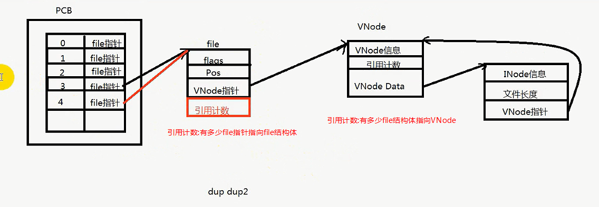
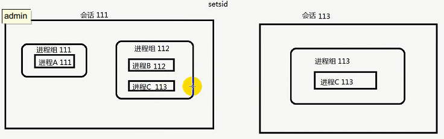

# 目录

[TOC]


# Linux System Programming

大多数系统调用成功返回0,失败返回-1。

## 基本的文件IO

Linux的文件类型：普通文件(-)，目录文件(d)，管道文件(p)，链接文件(l)，字符设备文件(c)，套接字文件(s)

每个进程都有一个进程控制块PCB，以task_struct结构体来保存。task_struct中有个文件描述符表file_struct, 用来保存进程中的所有文件描述符。一个进程默认打开三个文件描述符：标准输入、输出、错误。(0,1,2)


### 文件访问的系统调用

在使用与文件相关的系统调用前，应该包含`fcntl.h和unistd.h`两个头文件。

#### 文件的创建、打开和关闭，读与写

fd=open(),fd=create(),close(fd)

```c++
ssize_t read(int fd, void *buf, size_t count);	// 成功返回读到的字节数，失败返回-1.
//文件是没有'\0'的概念的；字符串才有。如果读的是字符串，末尾是不会加'\0'的。
// read被EINTR中断，文件指针不会移动，所以需要重新读数据。

ssize_t write(int fd, const void* buf, size_t count);// 成功返回实际写入的字节数，失败返-1.
```

#### 文件的读写位置

```c++
off_t lseek(int fd, off_t offest, int whence);//移动文件指针到指定位置
// fd: 文件描述符
//offset：移动的偏移量，单位为字节数
//whence: 文件指针移动偏移量的解释，有三个选项，如下：
//宏名称 		含义
//SEEK_SET: 从文件头开始计算，文件指针移动到offset个字节位置。
//SEEK_CUR: 从文件指针当前位置开始计算，向后移动offset个字节的位置。
//SEEK_END: 文件指针移动到文件结尾
//example:
	file_size = lseek(fd_lseek, 0, SEEK_END);	// 移动文件指针到末尾
	off_t ret = lseek(fd, 0xFFFFFFFFl, SEEK_SET);	// 移动文件指针到这么多字节处
```

#### 修改文件的属性

```c++
int fcntl(int fd, int cmd);
int fcntl(int fd, int cmd, long arg);// fcntl(fd, F_GETFL, 0) fcntl(fd, F_SETFL, 0)
```

#### dup/dup2

==重定向文件描述符fd指向另一个文件结构体file_struct。== dup.c  dup2_stdout_err.c

```c++
int dup(int oldfd); //复制一个文件描述符指向oldfd的file结构体，并返回这个fd。
// 复制oldfd指向的file结构体指针到newfd,使newfd指向oldfd的file结构体并返回newfd,newfd如果已经打开，则先关闭。
// 如果newfd==oldfd，则返回newfd。
// 如果old是非法的，则返回-1，newfd不会被关闭。
int dup2(int oldfd, int newfd); 
```

file_struct中有引用计数，会记录有多少个引用计数指向它，引用计数为0时释放。




如果两次open同一个文件，会得到两个文件描述符，它们分别指向不同的文件结构体，各自有自己的filestatus和读写位置；但两个file_struct指向同一个vnode, vnode又指向同一个inode。 

double_open_same_file.c


## 进程Process

进程：最小的资源分配单位。

每个进程都有一个进程控制块PCB，task_struct。

### 进程的环境变量

env.c

每个进程都有一个环境变量表，它是在进程生成时从父进程拷贝过来的。


### 创建进程

fork: 在父进程返回子进程的pid，在子进程返回0，失败返回-1

**除了pid不一样以外，其他基本都一样，子进程的文件描述符表也是从父进程copy过来的，所以fd指向同一个FILE结构体file_struct，共享同一个偏移量。**

#### 写时复制

fork之后子进程中的数据不会马上复制，只有当修改的时候才会发生拷贝。

### 终止进程以及进程返回值

```c++
void exit(int status);	// 终止当前进程，发送一个SIGCHLD信号通知父进程，并把进程状态返回给父进程。
```

### 回收进程

子进程终止的时候必须由父进程回收PCB，没有回收则子进程处于僵尸状态(==僵尸进程==)。如果一直到父进程退出都没有回收子进程，则由init进程回收。(也就是init进程wait它们)

如果父进程在子进程终止之前退出，那么该子进程由init进程回收。这时子进程被称作==孤儿进程==。

#### wait

```c
#include <sys/wait.h>
pid_t wait(int *status);	// 阻塞等待子进程退出，如果在调用时已经有子进程退出了则立即返回。
// 返回值: 子进程的pid。
// status: 子进程的退出状态。	wait(NULL), childpid = wait(&status)
//	1.使用exit()退出的则得到是exit中的参数值。例：子进程exit(-1), 父进程得到子进程status(-1)。
//	2.使用信号杀死子进程，得到的是信号值。例：kill -9 childpid杀死子进程，父进程得到子进程status(9)
```

#### waitpid<a id="waitpid"></a>

[进程组](#进程组)

```c
#include <sys/wait.h>
pid_t waitpid(pid_t pid, int *status, int options);
// 参数pid:
// pid<-1:等待进程组id是[pid绝对值]中的子进程退出。可以在一个进程中等待另一个进程组中的子进程退出。
// pid=0 :等待当前进程的进程组中的子进程退出。
// pid>0 :等待进程id是pid的子进程退出。
// pid=-1:等待任何子进程退出，相当于wait。wait(&status) == waitpid(-1, &status, 0);
// 参数options:
// WNOHANG: 有子进程退出返回子进程pid,没有子进程退出返回0，发生错误返回-1.
```

#### 父进程退出前有暂停的子进程会怎样？

fork_waitpid3.c

父进程会检查所有==暂停==的子进程，并发送一个==SIGHUP==信号导致子进程退出。所以在子进程暂停时，最好不要让父进程退出。


#### 如何避免僵尸进程
fork_SIGCHLD_IGN.c

1.使用wait或waitpid回收子进程，如果不想父进程阻塞等待，waitpid可以使用WNOHANG参数改成非阻塞的。

2.使用信号处理函数signal: 

`signal(SIGCHLD, SIG_IGN)`：由于子进程终止时会发给父进程SIGCHLD信号，在父进程中忽略此信号，表明对子进程的终止不关心，==由init进程回收。==

还可以使用信号处理函数，在信号处理函数中调用wait, 来回收子进程。fork_SIGCHLD_IGN.c

```c
void hand_SIGCHLD(int sig){
    int status;
    pid_t childpid = wait(&status);
}
signal(SIGCHLD, hand_SIGCHLD);
```


### fork后执行其他程序

换瓤不换壳

exec函数族 通常与fork一起使用，先用fork出子进程，再在子进程执行别的程序。

细节见：wangguilin/linux系统编程.pdf

```c
#include <unistd.h>
int execl(const char* path, const char *arg, ...);
int execlp(const char* file, const char *arg, ...);
int execle(const char* path, const char *arg, ..., char * const envp[]);
int execv(const char* path, char* const argv[]);
int execvp(const char* file, char * const argv[]);
int execve(const char* filename, char* const argv[], char* const envp[]);	// 这个才是真正的system call
int execvpe(const char *file, char *const argv[], char *const envp[]);
```

l：‘l’表示传递的参数是以==列表==形式出现，即分开的，需要一个一个的传递，比如：`execl("/bin/ps", "ps", "ajx", NULL);`， 其中第一个参数代表传递的一个要执行的程序的==绝对路径==，第二个参数必须和第一个参数的==文件名==保持一致，后边的 ajx,NULL都是参数，而且==最后一个参数必须是NULL==。

p：第一个参数可以是==相对路径==或==程序名==，第二个参数必须和第一个参数的==文件名==保持一致，最后一个参数必须是==NULL==，‘p’参数表示不需要传递文件绝对路径，在执行时会从==环境变量==中来搜索执行，比如：`execlp("ps", "ps", "ajx", NULL);`

v：‘v’参数表示函数传递的参数是以==字符串数组==形式的传递而不用一个一个的传递比如：`char *buf[] = {"ps", "ajx", NULL};  execv("/bin/ps", buf);`，第一个参数代表传递的一个要执行的程序的==绝对路径==，其中buf这个==指针数组==包含了需要传递参数并且==最后一个参数是NULL==。

e：‘e’参数表示传递给新进程的环境变量，比如：`char *buf[] = {"PATH=/usr/bin", NULL}; execve("./test", NULL, buf);`那么在==新的进程中环境变量PATH就变成了`/usr/bin`。==

进程中的环境变量说明在Linux中，Shell进程是所有**命令**的父进程。当一个命令执行时，Shell进程会fork子进程然后调用exec函数去执行**命令**。Shell进程堆栈中存放着该用户下的所有环境变量，**使用execl、execv、execlp、execvp函数使程序执行时，Shell进程会将所有环境变量复制给生成的新进程**；而==使用execle、execve时新进程不继承任何Shell进程的环境变量，而由envp[]数组自行设置环境变量==。

**<u>一旦执行了exec函数，除非exec调用失败，否则后面的代码永远不会被执行。</u>**

### 进程组 <a id="进程组"></a>

[waitpid](#waitpid)

`ps -ajx` 查看进程组。`kill -9 -12345`：杀死进程组id是12345中的所有进程。

==进程组是一个或多个进程的集合，==进程组id是一个正整数，==组长进程的pid等于进程组id。==

组长进程可以创建一个进程组，也可以创建组中的进程。

**进程组的生存周期**：从进程组创建开始，到最后一个进程离开进程组(终止或转移到另一进程组)。

进程组标识：PGID(process group ID)。

### 会话




### 守护进程


### 进程间通信

#### 信号

如果定义了信号的处理函数，则默认动作将不会执行。

信号是进程间通信中唯一的异步通信机制。

==信号不支持排队，多个信号同时到达，只会处理一次。==

```c
SIGHUP:
SIGKILL: //无条件杀死任何进程
SIGPIPE: // 向没有读端的管道写数据会导致管道破裂，终止进程
SIGCHLD: // SIGCHLD产生的条件：
	// 子进程退出时会向父进程发送
	// 子进程接收到SIG_STOP信号暂停时
	// 子进程处于暂停状态，被SIG_CONT信号唤醒时
```

kill 信号 pid: 给进程pid发送信号

kill 信号 pid<-1: 给**进程组pid**发送信号


raise()函数给==进程本身==发一个信号

定时器函数alarm()/setitimer()到时后，给自己发送一个**SIGALRM**信号

abort向进程发送一个**SIGABORT**信号，默认动作为异常退出。

#### 管道

1、读端sleep,写端while_write,管道最大65536字节，64K，管道写满了会阻塞;

2、写端sleep,管道没有数据，读端while_read，会阻塞；

3、写端关闭close(fd[1]),读端while_read,读到的字节数为0，ret=0;

4、读端关闭close(fd(0))，写端while_write，管道会破裂产生==SIGPIPE==信号；

无名管道

```c++
#include <unistd.h>
int pipe(int pipefd[2]);//调用一次返回两个文件描述符，fd[0]是读端，fd[1]是写端。
// 利用fork会复制文件描述符表的机制，父子进程间可以通信。
// 要想父进程读，子进程写，就把父进程的fd[1]关闭，子进程的fd[0]关闭。反之亦然。
```

​	pipe,半双工通信, 存在于内存中，只能在父子进程或兄弟进程间通信.

有名管道

​	使用mkfifo创建一个命名的文件，可以在不同的进程间通信。

#### 消息队列

可以认为是一个链表，一个进程往里写，然后终止，另一个进程可以随时读取这些消息，只要系统不关闭，就永久存在。

Linux下的Posix消息队列创建在虚拟文件系统中，正常情况下是不可见的，需要挂载到/dev/mqueue/目录才可以查看

```bash
mkdir /dev/mqueue 
mount -t mqueue none /dev/mqueue
```


#### 信号量(命名信号量)

有名信号量也是需要创建一个文件，然后它内部有计数器，使用资源时计数减1，释放资源时计数器加1，以此来进行进程间的同步。

#### 共享内存 posix mmap

两个或多个进程读写同一块内存

共享内存是最快的IPC

#### socket

#### eventfd


## Thread

- 线程:最小的程序执行单位

### 线程的创建，使用和回收

### 多线程的同步互斥

#### 	atomic

​	(多线程对一个变量进行++操作，使用atomic比使用mutex的效率高), gcc提供的同步函数

#### 	锁:

##### 		互斥锁

###### 			死锁

			1. 
			1. 

1. ​		一把锁，自己锁自己(递归调用)

2. 两把锁，两个线程调用锁的顺序相反， 解决c++11 std::  一起锁，一起释放

    pstack lock_wait查看调用栈是否有死锁现象。

##### 递归锁

##### 检错锁

读写锁 读共享，写独占，写锁优先级高(默认是读优先，需要改属性)， boost::shared_mutex内部实现就是读写锁

##### 自旋锁

##### 文件锁

#### 条件变量

(生产者消费者模型)  和mutex一起使用， 内部有加锁，解锁的操作，所以要使用unique_lock, lockguard没有lock(),unlock()成员函数，但是lockguard的开销最少。

##### 虚假唤醒


#### 信号量(匿名信号量)

二值信号量可以模拟互斥锁 (生产者消费者模型)

### 线程的局部存储 

#### __thread

只能使用POD类型

#### pthread_key_t

非POD类型可以使用

### 线程池 (生产线程，消费线程)

  **条件变量+互斥锁能解决大部分的线程同步问题**


## references:

[linux系统编程.pdf](../wangguilin/-6- linux系统编程与网络编程/linux系统编程.pdf)

[C_C++多线程编程精髓.md](./fanli/C_C++多线程编程精髓.md)


