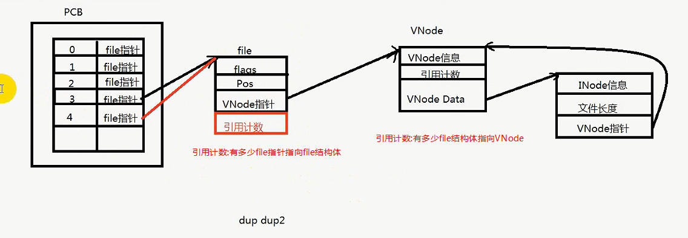
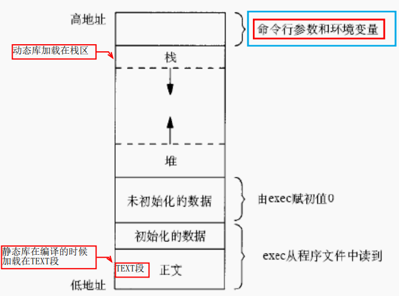
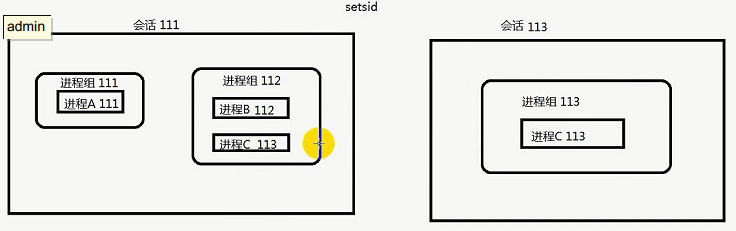
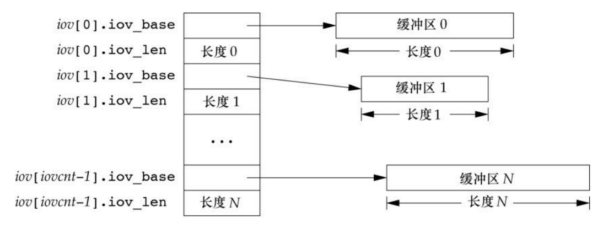

# 目录

[TOC]


# Linux System Programming

大多数系统调用成功返回0,失败返回-1。

## 基本的文件IO

Linux的文件类型：普通文件(-)，目录文件(d)，管道文件(p)，链接文件(l)，字符设备文件(c)，套接字文件(s)

每个进程都有一个进程控制块PCB，以task_struct结构体来保存。task_struct中有个文件描述符表file_struct, 用来保存进程中的所有文件描述符。一个进程默认打开三个文件描述符：标准输入、输出、错误。(0,1,2)


### 文件访问的系统调用

在使用与文件相关的系统调用前，应该包含`fcntl.h和unistd.h`两个头文件。

#### 文件的创建、打开和关闭，读与写

##### open

```c
#include <fcntl.h>
int open(const char *pathname, int flags);
int open(const char *pathname, int flags, mode_t mode);
int creat(const char *pathname, mode_t mode);
```

flags：文件的读写权限。flag之间用可以用或(|)的方式组合。<a id="flags"></a>

- O_CREAT：文件不存在则创建，需要同时指定mode。

- O_RDONLY：只读 

- O_WRONLY：只写

- O_RDWR：读写

- O_APPEND：追加

- O_TRUNC：如果文件已经存在并且是可写的(O_RDWR、O_WRONLY)，则清除文件中的所有内容。

- O_NONBLOCK：非阻塞。<a id="O_NONBLOCK"></a>

- O_CLOEXEC：<a id="O_CLOEXEC"></a> ==O_CLOEXEC的作用是在fork后，在子进程执行exec函数时fd被关闭，并不是在fork后就立即关闭，在子进程是可以使用的。==。close on exec, not on-fork。

  在进程执行exec系统调用时关闭此打开的文件描述符。防止父进程泄露打开的文件给子进程，即便子进程没有相应权限。设置**O_CLOEXEC**一般是在open时设置，这个是原子操作；也可以用fcntl()的F_SETFD命令来设置，但它有并发危险，如多线程中，一个线程将要设置O_CLOEXEC标志时，另一个线程fork()，且先得到执行，导致打开的文件描述符泄露到子进程中。

  当调用exec成功后，文件会自动关闭。在2.6.23以前需要调用**`fcntl(fd,F_SETFD, FD_CLOEXEC)`** 来设置这个属性。在新版本中只需要在open函数中设置O_CLOEXEC这个标志就可以。

  虽然新版本支持在open时设置CLOEXEC，但是在编译的时候还是会提示错误，`error: ‘O_CLOEXEC’ undeclared (first use in this function)`。原来这个新功能要求我们手动去打开，需要设置一个宏(==_GNU_SOURCE==)。可通过以下两种方法来设置这个宏以打开新功能：

  1. 在源代码中加入 **#define _GNU_SOURCE**
  2. 在编译参数中加入 **-D_GNU_SOURCE**

mode_t：用户的访问权限。<a id="mode_t"></a>

0777、0664

##### create

```

```

##### read

```c++
ssize_t read(int fd, void *buf, size_t count);	// 成功返回读到的字节数，失败返回-1.
```

==文件是没有'\0'的概念的；字符串才有。如果读的是字符串，末尾是不会加'\0'的==。

==read被EINTR中断，文件指针不会移动，所以需要重新读数据。==

##### write

```c
ssize_t write(int fd, const void* buf, size_t count);// 成功返回实际写入的字节数，失败返-1.
```


#### 文件的读写位置

```c++
off_t lseek(int fd, off_t offest, int whence);//移动文件指针到指定位置
// fd: 文件描述符
//offset：移动的偏移量，单位为字节数
//whence: 文件指针移动偏移量的解释，有三个选项，如下：
//宏名称 		含义
//SEEK_SET: 从文件头开始计算，文件指针移动到offset个字节位置。
//SEEK_CUR: 从文件指针当前位置开始计算，向后移动offset个字节的位置。
//SEEK_END: 文件指针移动到文件结尾
//example:
	off_t ret = lseek(fd, 0, SEEK_SET);	// 移动到文件头部
	file_size = lseek(fd_lseek, 0, SEEK_END);	// 移动文件指针到末尾
	off_t ret = lseek(fd, 0xFFFFFFFFl, SEEK_SET);	// 移动文件指针到这么多字节处
```

#### 文件掩码

==掩码的作用就是屏蔽位。==如果想把一个数的某个位屏蔽掉，就把掩码对应的位置1，再把**掩码取反和相应的数求与**。

==利用子网掩码求主机号也是这个道理，先把子网掩码取反再和IP地址相与就得到主机地址。==

##### 读取掩码的值

- umask：查看掩码数字值，默认0022。umask -S：查看掩码符号值，u=rwx,g=rx,o=rx。

  比如：使用touch创建一个文件，创建权限是0666，由于**touch进程继承了shell进程的文件掩码**，所以创建出来的文件的权限是：0666 &(~0022) = 0644。

  ```c
  0666 & (~0022) = 0644
  0110 0110 0110
  1111 1101 1101 
  0110 0100 0100 = 644
  -rw-r--r--  1 hchy hchy     0 Mar  1 08:46 a.txt
  ```

  同样的道理，使用gcc编译生成一个可执行文件时，创建权限是0777，而最终的文件权限是：0777&(~0022)=0755。

- 使用umask函数读取：

  ```c
  // 读取掩码，并不是设置掩码!!! 
  // 由于linux没提供直接读取mask的函数，所以使用umask(0)得到返回值，返回代表前一个掩码的值, 也就是调用umask(0)之前掩码的值。
  // 但是调用umask(0)后掩码，被修改了，所以用umask(mask)再设置回来。
  static mode_t read_umask(void) {
  	mode_t mask = umask(0);
  	umask(mask);
  	return mask;
  }
  ```

  

##### 修改文件掩码

- 可以在命令行直接修改，`umask 024`不过这只是针对当前shell进程，关闭终端后便会失效。

- 使用umask函数：

  ```
  #include <sys/stat.h>
  mode_t umask(mode_t mask);	// 这个系统调用总是成功，并且返回掩码的前一个值。
  ```


#### 文件打开个数

##### 查看文件打开个数

```bash
ulimit -n
```

##### 临时修改文件打开个数

```bash
ulimit -n 2048
```

##### 永久修改文件个数

 ```bash
cat /etc/security/limits.conf
* soft nofile 65535
* hard nofile 65535
 ```

*表示所有用户都生效，重启后在任何地方执行`ulimit -n`都会显示65535。

#### 文件属性

linux下一切皆文件。

硬链接：文件名和inode一一对应，有引用计数。

软连接：保存着链接文件的绝对地址或相对地址。

文件属性保存在struct stat结构体中：

```c
struct stat {
	mode_t st_mode; //文件对应的模式，文件，目录等
	ino_t st_ino; //inode节点号
	dev_t st_dev; //设备号码
	dev_t st_rdev; //特殊设备号码
	nlink_t st_nlink; //文件的硬链接数连接数
	uid_t st_uid; //文件所有者的用户ID
	gid_t st_gid; //文件所有者对应的组的组ID
	off_t st_size; //普通文件，对应的文件字节数
	time_t st_atime; //文件最后被访问的时间
	time_t st_mtime; //文件内容最后被修改的时间
	time_t st_ctime; //文件属性inode改变时间
	blksize_t st_blksize; //文件内容对应的块大小
	blkcnt_t st_blocks; //文件内容对应的块数量
};
```

其中st_mode包含的类型如下：<a id="st_mode"></a> [chmod](#chmod)

```bash
S_IFMT 0170000 文件类型的位遮罩
S_IFLNK 0120000 符号连接
S_IFREG 0100000 一般文件
S_IFBLK 0060000 区块装置
S_IFDIR 0040000 目录
S_IFCHR 0020000 字符装置
S_IFIFO 0010000 先进先出
S_ISUID 04000 文件的(set user-id on execution)位
S_ISGID 02000 文件的(set group-id on execution)位
S_ISVTX 01000 文件的sticky位 粘住位
S_IRUSR 00400 文件所有者具可读取权限
S_IWUSR 00200 文件所有者具可写入权限
S_IXUSR 00100 文件所有者具可执行权限
S_IRGRP 00040 用户组具可读取权限
S_IWGRP 00020 用户组具可写入权限
S_IXGRP 00010 用户组具可执行权限
S_IROTH 00004 其他用户具可读取权限
S_IWOTH 00002 其他用户具可写入权限
S_IXOTH 00001 其他用户具可执行权限
```

并提供宏函数检查以上类型：

```c
S_ISLNK (st_mode) 判断是否为符号连接
S_ISREG (st_mode) 是否为一般文件
S_ISDIR (st_mode) 是否为目录
S_ISBLK (st_mode) 是否是块设备
S_ISCHR (st_mode) 是否为字符设备文件
S_ISSOCK (st_mode) 是否为socket
```


##### 获取文件属性

```c
#include <sys/types.h>
#include <sys/stat.h>
int stat(const char *path, struct stat *struct_stat);
int lstat(const char *path,struct stat *struct_stat);
int fstat(int fd, struct stat *struct_stat); //通过文件描述符获取文件对应的属性。fd为文件描述符
//成功返回0，失败返回-1，并设置errno：
//	ELOOP： 遍历路径时遇到太多的符号连接
//	ENAMETOOLONG：文件路径名太长
//	ENOENT：路径名的部分组件不存在，或路径名是空字串
//path: 文件的路径
//fd: 文件描述符
```


##### 修改文件属性


```c
#include <fcntl.h>
int fcntl(int fd, int cmd);
int fcntl(int fd, int cmd, long arg);// fcntl(fd, F_GETFL, 0) fcntl(fd, F_SETFL, 0)
```


##### SUID/SGID位 <a id="SUID/SGID"></a>

**<u>就是为了提升文件权限的。</u>**

SUID作用：使==组用户==和==其他用户==执行文件时，拥有文件所有者的权限。

SGID作用：使==组用户==和==其他用户==执行文件时，拥有文件所属组的权限。

SUID和SGID只有在文件的==可执行位==被设置时才会有效，而可执行位只对普通文件和目录有意义，所以对其他类型的文件设置SUID和SGID没太大意义。

如果一个文件的SUID和SGID被设置，会分别表现在文件的所有者和所属组的==可执行位==上：

```bash
hchy@DESKTOP-EI7DNUT:~$ ll a.txt
-rw-r--r-- 1 hchy hchy 0 Mar  1 08:46 a.txt
hchy@DESKTOP-EI7DNUT:~$ chmod u+s a.txt
hchy@DESKTOP-EI7DNUT:~$ ll a.txt
-rwSr--r-- 1 hchy hchy 0 Mar  1 08:46 a.txt		# S：所有者权限中的可执行位没有被设置，SUID位被设置
hchy@DESKTOP-EI7DNUT:~$ chmod u-s a.txt
hchy@DESKTOP-EI7DNUT:~$ ll a.txt
-rw-r--r-- 1 hchy hchy 0 Mar  1 08:46 a.txt
hchy@DESKTOP-EI7DNUT:~$ chmod u+x a.txt
hchy@DESKTOP-EI7DNUT:~$ ll a.txt
-rwxr--r-- 1 hchy hchy 0 Mar  1 08:46 a.txt* 
hchy@DESKTOP-EI7DNUT:~$ chmod u+s a.txt
hchy@DESKTOP-EI7DNUT:~$ ll a.txt
-rwsr--r-- 1 hchy hchy 0 Mar  1 08:46 a.txt*	# s：所有者权限中的可执行位被设置，SUID位被设置
hchy@DESKTOP-EI7DNUT:~$ chmod g+s a.txt
hchy@DESKTOP-EI7DNUT:~$ ll a.txt
-rwsr-Sr-- 1 hchy hchy 0 Mar  1 08:46 a.txt*	# S：所属组权限中的可执行位没有被设置，SGID位被设置
hchy@DESKTOP-EI7DNUT:~$ chmod g-s a.txt
hchy@DESKTOP-EI7DNUT:~$ ll a.txt
-rwsr--r-- 1 hchy hchy 0 Mar  1 08:46 a.txt*
hchy@DESKTOP-EI7DNUT:~$ chmod g+x a.txt
hchy@DESKTOP-EI7DNUT:~$ ll a.txt
-rwsr-xr-- 1 hchy hchy 0 Mar  1 08:46 a.txt*	
hchy@DESKTOP-EI7DNUT:~$ chmod g+s a.txt
hchy@DESKTOP-EI7DNUT:~$ ll a.txt
-rwsr-sr-- 1 hchy hchy 0 Mar  1 08:46 a.txt*	# S：所属组权限中的可执行位被设置，SGID位被设置
```

###### 判断是否设置了SUID/SGID

[euid](#euid)

```c
static int issetugid() {
	return (geteuid() != getuid() || getegid() != getgid());
}
```


##### 判断文件访问权限

```c
#include <unistd.h>
int access(const char *pathname, int mode);
//mode:
//	F_OK:判断文件是否存在
//	R_OK:判断文件是否可读
//	W_OK:判断文件是否可写
//  X_OK:判断文件是否可执行。
//mode参数可以是它们当中的单个值，或是它们的组合。
access("文件路径", F_OK | R_OK | W_OK | X_OK) == 0;	//成功返回0，只要有一个条件不符合就是失败返回-1。
```


##### 修改文件访问权限<a id="chmod"></a>

使用命令：`chmod u+x a.txt`

使用函数：

```c
#include <sys/stat.h>
int chmod(const char *path, mode_t mode);
int fchmod(int fd, mode_t mode);
```

其中 [mode](#st_mode)可以从S_ISUID ~ S_IXOTH之间任意组合。成功返回0，失败返回-1。

##### 修改文件所属用户/用户组

使用命令：`chown root:root a.txt`

使用函数：

```c
#include <unistd.h>
int chown(const char *path, uid_t owner, gid_t group);
int fchown(int fd, uid_t owner, gid_t group);
int lchown(const char *path, uid_t owner, gid_t group);
/*lchown是改变符号链接本身的所有者，而不是该符号链接所指向的文件。*/
//path:文件路径
//owner:uid
//group:gid
```


#### 删除文件

```c
#include<unistd.h>
int unlink(const char * pathname);
```

1. 如果是符号链接，删除符号链接
2. 如果是硬链接，引用计数减一，减到0则删除数据块和inode。
3. 如果硬链接计数减到0，但是有进程已打开该文件且持有文件描述符，**==则等到进程关闭该文件时再删除==**。

返回值：成功返回0，失败返回-1，错误值存在于errno中。

```bash
EROFS #文件存在于只读文件系统内
EFAULT #参数pathname指针超出可存取内存空间
ENAMETOOLONG #参数pathname太长
ENOMEM #核心内存不足
ELOOP #参数pathname 有过多符号连接问题
EIO I/O #存取错误
```


#### dup/dup2

==重定向文件描述符fd指向另一个文件结构体file_struct。== dup.c  dup2_stdout_err.c

```c++
int dup(int oldfd); //复制一个文件描述符指向oldfd的file结构体，并返回这个fd。
// 复制oldfd指向的file结构体指针到newfd,使newfd指向oldfd的file结构体，返回值为newfd,newfd如果已经打开，则先关闭。
// 如果newfd==oldfd，则返回newfd。
// 如果old是非法的，则返回-1，newfd不会被关闭。
int dup2(int oldfd, int newfd); 
```

file_struct中有引用计数，会记录有多少个引用计数指向它，引用计数为0时释放。




#### 两次open同一个文件

如果两次open同一个文件，会得到两个文件描述符，它们分别指向不同的文件结构体，各自有自己的filestatus和读写位置；但两个file_struct指向同一个vnode, vnode又指向同一个inode。 

double_open_same_file.c


#### 先open再fork

fork之后的文件描述符一样，指向同一个文件结构体。


#### 先fork再open

相当于对同一个文件open两次，所以每个进程有各自文件描述符，并指向各自的文件结构体，但是Vnode只有一个。


## 进程Process


进程：最小的资源分配单位。

每个进程都有一个进程控制块PCB，task_struct。


### 进程控制块PCB


### 进程与线程的区别


### 和进程有关的ID

`id` or `id root` or `id 0`命令可以查看。root的uid和gid都是0。

uid：user id，启动进程的用户ID，**实际用户ID**。

gid：group id，启动进程的用户所属组的ID，**实际用户组ID**。

euid：effective user id，有效用户ID。==当SUID设置时，有效用户ID == 文件所有者的uid==。<a id="euid"></a>[SUID/SGID](#SUID/SGID)

euid：effective user id，有效用户ID。==当SGID设置时，有效用户组ID == 文件所有者gid==。

比如：当以一个“普通用户”启动一个**文件所有者是root**的程序的时候，如果设置了SUID，则进程的有效用户是root。

```bash
hchy@DESKTOP-EI7DNUT:~$ ls -lh
-rwxr-xr-x 1 hchy hchy 17K Mar  1 17:00 a.out
-rw-r--r-- 1 root root   3 Mar  1 16:26 rootfile.txt
hchy@DESKTOP-EI7DNUT:~$ ./a.out
fd:-1
open: Permission denied
write to rootfile.txt [n:-1] byte
finish
##################################
hchy@DESKTOP-EI7DNUT:~$ sudo chown root a.out
hchy@DESKTOP-EI7DNUT:~$ ls -lh
-rwxr-xr-x 1 root hchy 17K Mar  1 17:00 a.out
-rw-r--r-- 1 root root   3 Mar  1 16:26 rootfile.txt
hchy@DESKTOP-EI7DNUT:~$ ./a.out
fd:-1
open: Permission denied
write to rootfile.txt [n:-1] byte
finish
##################################
hchy@DESKTOP-EI7DNUT:~$ sudo chmod u+s a.out
hchy@DESKTOP-EI7DNUT:~$ ls -lh
-rwsr-xr-x 1 root hchy 17K Mar  1 17:00 a.out
-rw-r--r-- 1 root root   3 Mar  1 16:26 rootfile.txt
hchy@DESKTOP-EI7DNUT:~$ ./a.out
fd:3
open: Success
write to rootfile.txt [n:3] byte
finish
```


### 进程的环境变量

env.c

每个进程都有一个环境变量表，它是在进程生成时从父进程拷贝过来的。



libc中定义了一个全局变量==`char** environ`==指向了环境变量表，由于environ没有包含在任何环境变量中，所以需要使用==extern==导入。

```c
extern char** environ;
int i = 0;
while(environ[i]!=NULL) {
	printf("%s\n", environ[i++]);
}
```

#### 获取环境变量

```c
#include <stdlib.h>
char * getenv(const char* name);	// name为环境变量的键值，找到返回value，失败返回NULL
```

#### 设置环境变量

```c
#include <stdlib.h>
int setenv(const char* name, const char* value, int rewrite);
// rewrite为1则覆盖原来值，rewrite为0不覆盖原来的值。
int putenv(char *string);	// putenv("MYTEST=MYTEST"); // 如果原来值存在则覆盖
```

==环境变量key是唯一的==。

#### 删除环境变量

```c
int unsetenv (const char *name);	//成功返回0失败返回-1
int putenv(char *string);	// putenv("MYTEST");   //只写key值，不写value。如果有key对应的值则清空
```


### 创建进程

fork: 在父进程返回子进程的pid，在子进程返回0，失败返回-1

**除了pid不一样以外，其他基本都一样，子进程的文件描述符表也是从父进程copy过来的，所以fd指向同一个FILE结构体file_struct，共享同一个偏移量。**

#### 写时复制

fork之后子进程中的数据不会马上复制，只有当修改的时候才会发生拷贝。


### 终止进程以及进程返回值

```c++
void exit(int status);	// 终止当前进程，发送一个SIGCHLD信号通知父进程，并把进程状态返回给父进程。
```

### 回收进程

子进程终止的时候必须由父进程回收PCB，没有回收则子进程处于僵尸状态(==僵尸进程==)。如果一直到父进程退出都没有回收子进程，则由init进程回收。(也就是init进程wait它们)

如果父进程在子进程终止之前退出，那么该子进程由init进程回收。这时子进程被称作==孤儿进程==。

#### wait

```c
#include <sys/wait.h>
pid_t wait(int *status);	// 阻塞等待子进程退出，如果在调用时已经有子进程退出了则立即返回。
// 返回值: 子进程的pid。
// status: 子进程的退出状态。	wait(NULL), childpid = wait(&status)
//	1.使用exit()退出的则得到是exit中的参数值。例：子进程exit(-1), 父进程得到子进程status(-1)。
//	2.使用信号杀死子进程，得到的是信号值。例：kill -9 childpid杀死子进程，父进程得到子进程status(9)
```

#### waitpid<a id="waitpid"></a>

[进程组](#进程组)

```c
#include <sys/wait.h>
pid_t waitpid(pid_t pid, int *status, int options);
// 参数pid:
// pid<-1:等待进程组id是[pid绝对值]中的子进程退出。可以在一个进程中等待另一个进程组中的子进程退出。
// pid=0 :等待当前进程的进程组中的子进程退出。
// pid>0 :等待进程id是pid的子进程退出。
// pid=-1:等待任何子进程退出，相当于wait。wait(&status) == waitpid(-1, &status, 0);
// 参数options:
// WNOHANG: 有子进程退出返回子进程pid,没有子进程退出返回0，发生错误返回-1.
```

#### 父进程退出前有暂停的子进程会怎样？

fork_waitpid3.c

父进程会检查所有==暂停==的子进程，并发送一个==SIGHUP==信号导致子进程退出。所以在子进程暂停时，最好不要让父进程退出。


#### 如何避免僵尸进程
fork_SIGCHLD_IGN.c

1.使用wait或waitpid回收子进程，如果不想父进程阻塞等待，waitpid可以使用WNOHANG参数改成非阻塞的。

2.使用信号处理函数signal: 

`signal(SIGCHLD, SIG_IGN)`：由于子进程终止时会发给父进程SIGCHLD信号，在父进程中忽略此信号，表明对子进程的终止不关心，==由init进程回收。==

还可以使用信号处理函数，在信号处理函数中调用wait, 来回收子进程。fork_SIGCHLD_IGN.c

```c
void hand_SIGCHLD(int sig){
    int status;
    pid_t childpid = wait(&status);
}
signal(SIGCHLD, hand_SIGCHLD);
```


### fork后执行其他程序

换瓤不换壳

exec函数族 通常与fork一起使用，先用fork出子进程，再在子进程执行别的程序。

细节见：wangguilin/linux系统编程.pdf

```c
#include <unistd.h>
int execl(const char* path, const char *arg, ...);
int execlp(const char* file, const char *arg, ...);
int execle(const char* path, const char *arg, ..., char * const envp[]);
int execv(const char* path, char* const argv[]);
int execvp(const char* file, char * const argv[]);
int execve(const char* filename, char* const argv[], char* const envp[]);	// 这个才是真正的system call
int execvpe(const char *file, char *const argv[], char *const envp[]);
```

l：‘l’表示传递的参数是以==列表==形式出现，即分开的，需要一个一个的传递，比如：`execl("/bin/ps", "ps", "ajx", NULL);`， 其中第一个参数代表传递的一个要执行的程序的==绝对路径==，第二个参数必须和第一个参数的==文件名==保持一致，后边的 ajx,NULL都是参数，而且==最后一个参数必须是NULL==。

p：第一个参数可以是==相对路径==或==程序名==，第二个参数必须和第一个参数的==文件名==保持一致，最后一个参数必须是==NULL==，‘p’参数表示不需要传递文件绝对路径，在执行时会从==环境变量==中来搜索执行，比如：`execlp("ps", "ps", "ajx", NULL);`

v：‘v’参数表示函数传递的参数是以==字符串数组==形式的传递而不用一个一个的传递比如：`char *buf[] = {"ps", "ajx", NULL};  execv("/bin/ps", buf);`，第一个参数代表传递的一个要执行的程序的==绝对路径==，其中buf这个==指针数组==包含了需要传递参数并且==最后一个参数是NULL==。

e：‘e’参数表示传递给新进程的环境变量，比如：`char *buf[] = {"PATH=/usr/bin", NULL}; execve("./test", NULL, buf);`那么在==新的进程中环境变量PATH就变成了`/usr/bin`。==

进程中的环境变量说明在Linux中，Shell进程是所有**命令**的父进程。当一个命令执行时，Shell进程会fork子进程然后调用exec函数去执行**命令**。Shell进程堆栈中存放着该用户下的所有环境变量，**使用execl、execv、execlp、execvp函数使程序执行时，Shell进程会将所有环境变量复制给生成的新进程**；而==使用execle、execve时新进程不继承任何Shell进程的环境变量，而由envp[]数组自行设置环境变量==。

**<u>一旦执行了exec函数，除非exec调用失败，否则后面的代码永远不会被执行。</u>**

### 进程组 <a id="进程组"></a>

[waitpid](#waitpid)

`ps -ajx` 查看进程组。`kill -9 -12345`：杀死进程组id是12345中的所有进程。

==进程组就是进程的集合，==每个进程组有一个组长进程，==组长进程的pid就是进程组id。==进程组也称之为==“作业”。==

组长进程可以创建一个进程组，也可以创建组中的进程。

**进程组的生存周期**：从进程组创建开始，到最后一个进程离开进程组(终止或转移到另一进程组)。**也就是说只要进程组中有一个进程存在，这个进程组就存在，与组长进程是否终止无关。**

进程组标识：PGID(process group ID)。

### 终端

**在linux中终端就是控制台**，是用户和系统进行交互的界面。用户输入指令，系统完成任务操作，并返回控制台。

在linux系统中用户通过终端登录系统后得到一个==shell进程==，这个终端就成为shell进程的==控制终端(Controlling Terminal  )==。

控制终端保存在PCB(task_struct)中，而fork会复制PCB的信息，因此**由shell进程启动(fork)的其他进程的控制终端也是这个终端**。

默认情况下(没有重定向)，**每个进程的标准输入、标准输出、标准错误都是指向控制终端**。进程从标准输入读就是**读取用户的键盘输入**，进程往标准输出和和标准错误输出就是**输出到显示器**。

https://www.cnblogs.com/xiangtingshen/p/10889191.html

#### 终端的启动流程

init-->fork-->exec-->getty-->login-->用户输入帐号-->输入密码-->fork-->shell  

#### 字符终端

**虚拟终端(字符控制终端)一般就是/dev/tty1∼/dev/tty6六个**

alt+ctrl+F1 alt+ctrl+F2 alt+ctrl+F3 alt+ctrl+F4 alt+ctrl+F5 alt+ctrl+F6

 **pts (pseudo terminal slave) 指伪终端。**

#### 网络终端

网络终端或图形终端窗口的数目却是不受限制的，这是通过伪终端（Pseudo TTY）实现的

SSH、Telnet...     网络终端

#### 图形终端

Alt + F7       图形终端


### 会话

==会话就是进程组集合，每个会话有一个组长进程，其进程pid就是会话id。==

用户登录是会话的开始。登录之后，会产生一个与用户终端相连的进程，这个进程称为会话的leader。

1. 一个会话可以包含多个进程组。
2. 每个会话都有一个leader进程，leader进程的退出会向会话中的所有的进程发送SIGHUP信号，默认处理动作就是进程都退出。
3. 一个会话可以有终端也可以没有终端，但是只能有一个终端。
4. ==组长进程不能成为新会话的leader进程，但是新会话的leader进程必定会成为组长进程。==



#### setsid

```c
// 设置会话。
pid_t setsid(void)
```

1. 成功返回会话ID，**也就是当前进程的pid;** 失败返回-1。
2. 调用setsid函数的进程成为新会话的==leader进程==，并成为进程组的==组长进程==。
3. 与其父进程的会话组和进程组==脱离==。
4. 由于会话独占一个终端，所以该进程==与终端脱离==。
5. 需要root权限？

**一般在fork后的子进程设置新会话。**

### 守护进程

后台进程，没有控制终端。像internet服务器inetd，web服务器httpd等这些就是守护进程。==结尾字母d就是daemon的意思。==

linux下可以调用系统调用创建守护进程：

```c
#include <unistd.h>
int daemon(int nochdir, int noclose);
```

也可以手动创建，如下：

#### 创建守护进程

1. 创建子进程，在子进程中调用==setsid==函数创建新会话，==使子进程脱离父进程和终端==。
2. 在子进程中调用==chdir==函数改变当前目录为根目录，**防止占用可卸载的文件系统**，==也可以换成其它路径==。进程活动时，其工
   作目录所在的文件系统不能卸下。一般需要将工作目录改变到根目录。
3. 在子进程中调用==umask==函数重设文件掩码。子进程从父进程那里继承了文件创建掩码，调用**umask()函数设置为0**，**为了不受父进程的影响能够自由的创建读写文件**。 防止继承的文件创建屏蔽字拒绝某些权限, 增加守护进程灵活性。
4. 在子进程中调用==close==关闭文件描述符。继承的打开文件不会用到，浪费系统资源，无法卸载。或者重定向。
5. 执行守护进程核心逻辑。
6. kill -9 守护进程退出。

```c
void init_daemon() {
	int pid;
	int i;
	pid=fork();
	if(pid < 0) {
		perror("fork");
		exit(-1); //创建错误，退出
	} 
	else if(pid>0) //父进程退出
	{
		exit(0);
	} 
	/* 子进程创建新的会话 */
	setsid();
	/* 改变当前工作目录到/目录下.*/
	if (chdir("/") < 0) {
		perror("chdir");
		exit(1);
	} 
	/* 设置umask为0 */
	umask(0);
	/*关闭进程打开的文件句柄*/
	//for(i=0;i<NOFILE;i++) {
	//	close(i);
	//} 
    /*
     * 重定向0，1，2文件描述符到 /dev/null，因为已经失去控制终端，再操作0，1，2没有意义.
    */
    close(0);
    open("/dev/null", O_RDWR);
    dup2(0, 1);
    dup2(0, 2);
    
	return;
}
```


### 进程间通信

#### 信号

如果定义了信号的处理函数，则默认动作将不会执行。

信号是进程间通信中唯一的异步通信机制。

==信号不支持排队，多个信号同时到达，只会处理一次。==

```c
SIGHUP:
SIGKILL: //无条件杀死任何进程
SIGPIPE: // 向没有读端的管道写数据会导致管道破裂，终止进程
SIGCHLD: // SIGCHLD产生的条件：
	// 子进程退出时会向父进程发送
	// 子进程接收到SIG_STOP信号暂停时
	// 子进程处于暂停状态，被SIG_CONT信号唤醒时
```

kill 信号 pid: 给进程pid发送信号

kill 信号 pid<-1: 给**进程组pid**发送信号


raise()函数给==进程本身==发一个信号

定时器函数alarm()/setitimer()到时后，给自己发送一个**SIGALRM**信号

abort向进程发送一个**SIGABORT**信号，默认动作为异常退出。

#### 管道

1、读端sleep,写端while_write,管道最大65536字节，64K，管道写满了会阻塞;

2、写端sleep,管道没有数据，读端while_read，会阻塞；

3、写端关闭close(fd[1]),读端while_read,读到的字节数为0，ret=0;

4、读端关闭close(fd(0))，写端while_write，管道会破裂产生==SIGPIPE==信号；

无名管道

```c++
#include <unistd.h>
int pipe(int pipefd[2]);//调用一次返回两个文件描述符，fd[0]是读端，fd[1]是写端。
// 利用fork会复制文件描述符表的机制，父子进程间可以通信。
// 要想父进程读，子进程写，就把父进程的fd[1]关闭，子进程的fd[0]关闭。反之亦然。
```

​	pipe,半双工通信, 存在于内存中，只能在父子进程或兄弟进程间通信.

有名管道

​	使用mkfifo创建一个命名的文件，可以在不同的进程间通信。

#### 消息队列

可以认为是一个链表，一个进程往里写，然后终止，另一个进程可以随时读取这些消息，只要系统不关闭，就永久存在。

Linux下的Posix消息队列创建在虚拟文件系统中，正常情况下是不可见的，需要挂载到/dev/mqueue/目录才可以查看

```bash
mkdir /dev/mqueue 
mount -t mqueue none /dev/mqueue
```


#### 信号量(命名信号量)

有名信号量也是需要创建一个文件，然后它内部有计数器，使用资源时计数减1，释放资源时计数器加1，以此来进行进程间的同步。

#### 共享内存 posix mmap

两个或多个进程读写同一块内存

共享内存是最快的IPC

#### socket

#### eventfd


## Thread

- 线程:最小的程序执行单位

### 线程的创建，使用和回收

### 多线程的同步互斥

#### 	atomic

​	(多线程对一个变量进行++操作，使用atomic比使用mutex的效率高), gcc提供的同步函数

#### 	锁:

##### 		互斥锁

###### 			死锁

			1. 
			1. 

1. ​		一把锁，自己锁自己(递归调用)

2. 两把锁，两个线程调用锁的顺序相反， 解决c++11 std::  一起锁，一起释放

    pstack lock_wait查看调用栈是否有死锁现象。

##### 递归锁

##### 检错锁

读写锁 读共享，写独占，写锁优先级高(默认是读优先，需要改属性)， boost::shared_mutex内部实现就是读写锁

##### 自旋锁

##### 文件锁

#### 条件变量

(生产者消费者模型)  和mutex一起使用， 内部有加锁，解锁的操作，所以要使用unique_lock, lockguard没有lock(),unlock()成员函数，但是lockguard的开销最少。

##### 虚假唤醒


#### 信号量(匿名信号量)

二值信号量可以模拟互斥锁 (生产者消费者模型)

### 线程的局部存储 

#### __thread

只能使用POD类型

#### pthread_key_t

非POD类型可以使用

### 线程池 (生产线程，消费线程)

  **条件变量+互斥锁能解决大部分的线程同步问题**


## 协程

协程需要不断拷贝和切换上下文，在对性能要求比较高的场景并不适用。

编程沉思录

https://zhuanlan.zhihu.com/p/85639686

https://zhuanlan.zhihu.com/p/84935949


## #unistd.h

### getopt

解析命令行选项。

```c
#include <unistd.h>
int getopt(int argc, char *const argv[], const char *optstring);
extern char *optarg;
extern int optind, opterr, optopt;
```

功能：处理以'-'开头的命令行参数。

optstring:  "a?bc:d::"	**注意：？是单个字符的选项**

1. 单个字符：表示选项，后面不跟参数。
2. 单个字符后接一个冒号：表示选项后==必须==跟一个参数。**参数紧跟在选项后或以空格隔开**。参数指针赋给optarg。
3. 单个字符后接两个冒号：表示选项后可以跟一个参数也可以不跟。==如果跟一个参数，该参数必须紧跟在选项后不能以空格隔开==。参数指针赋给optarg。

返回值：

1. 如果optstring中的选项被找到，则返回这个选项。switch...case
2. 如果所有命令行选项都已经解析，则返回-1。退出while循环条件
3. 如果命令行选项的字符不在optstring中则返回'?'。
4. 如果某个命令行选项缺少参数，它的返回值依赖optstring的第一个字符，如果第一个字符是':'则返回':'。否则返回'?'

optind: 初始值为1，指向argv中下一个待处理值得下标。可以把它重置为1，重新开始扫描。


## #time.h

timespec：<a id="timespec"></a>

```c
struct timespec {
	time_t   tv_sec;        /* seconds */	// time_t == long int
    long     tv_nsec;       /* nanoseconds */
};
```

clockid_t：<a id="clockid_t"></a>

- CLOCK_REALTIME：系统实时时间,随系统实时时间改变而改变。即从UTC1970-1-1 0:0:0到现在的时间。**如果系统时间被用户改成其他,则对应的时间相应改变**。<a id="CLOCK_REALTIME"></a>
- CLOCK_MONOTONIC：从系统启动到现在的时间。**不受系统时间被用户改变的影响。**
- CLOCK_PROCESS_CPUTIME_ID：当前进程在CPU上所消耗的时间。
- CLOCK_THREAD_CPUTIME_ID： 当前线程在CPU上所消耗的时间。

### clock_gettime<a id="clock_gettime"></a>

```c
int clock_gettime(clockid_t clockid, struct timespec *tp);
```

在glibc 2.17版本之前需要连接rt库，`-lrt`。


## #sys/timerfd.h

timerfd是linux内核==2.6.25==版本中加入的接口。

==timerfd、eventfd、signalfd==配合epoll使用，可以构造出一个**零轮询**的程序，但程序没有处理的事件时，程序是被阻塞的。这样的话在某些移动设备上程序更省电。

itimerspec：<a id="itimerspec"></a>

```c++
struct itimerspec {
	struct timespec it_interval;  /* Interval for periodic timer */
	struct timespec it_value;     /* Initial expiration */
};
```

timespec：[timespec](#timespec)

it_value：定时器第一次到期的间隔。如果是绝对定时器，则先用 [clock_gettime](#clock_gettime) 的 [CLOCK_REALTIME](#CLOCK_REALTIME)标志获得绝对时间，再加上时间间隔。如果是相对定时器，直接填入时间间隔即可。

it_interval：定时器后续超时间隔。(写相对时间即可)

- it_interval为0表示定时器只会触发一次。
- it_interval不为0表示定时器会周期性触发N次。


### timerfd_create

```c
aint timerfd_create(int clockid, int flags);	// 创建一个定时器对象，并返回一个与之关联的文件描述符。
```

clockid：[clockid_t](#clockid_t)

flags：在2.6.26及以下版本中，flags必须被指定为0。从2.6.27版本开始，可以使用以下标志进行按位或组合：

- TFD_NONBLOCK：同 [O_NONBLOCK](#O_NONBLOCK)

- TFD_CLOEXEC：同 [O_CLOEXEC ](#O_CLOEXEC )

### timerfd_settime

```c
int timerfd_settime(int fd, int flags, const struct itimerspec *new_value, struct itimerspec *old_value);	// 用于启动和停止定时器
```

flags：根据 timerfd_create 的 ==clockid== 来确定使用**相对时间**还是**绝对时间**。

- 0：表示是==相对时间==。

- TFD_TIMER_ABSTIME：绝对时间。

new_value：超时时间。根据第二个参数设置绝对时间还是相对时间。==为0表示停止定时器。==


## #sys/eventfd.h

### eventfd

```c
int eventfd(unsigned int initval, int flags);
```

initval：

flags：

- EFD_CLOEXEC：同 [O_CLOEXEC](#O_CLOEXEC)
- EFD_NONBLOCK：同 [O_NONBLOCK](#O_NONBLOCK)
- EFD_SEMAPHORE：每次读操作，计数器值自减1。

**"可读可写事件"这是个有趣的问题，我们可以去发散下，对比思考下 socket fd，文件 fd**。

- socket fd：可以写入发送数据，那么触发可写事件，网卡数据来了，可以读，触发可读事件；

- 文件 fd：文件 fd 的可读可写事件就更有意思了，因为文件一直是可写的，所以一直都触发可写事件，文件里的数据也一直是可读的，所以一直触发可读事件。这个也是为什么类似 ext4 这种文件不实现 poll 接口的原因。**因为文件 fd 一直是可读可写的，poll 监听没有任何意义。**

回到最初问题：**eventfd 呢？它的可读可写事件是什么？**

我们之前说过，==eventfd 实现的是计数的功能==。所以 eventfd 计数不为 0 ，那么 fd 是可读的。由于 eventfd 一直可写（可以一直累计计数），所以一直有可写事件。所以，这里有个什么隐藏知识点呢？==eventfd 如果用 epoll 监听事件，那么都是监听读事件，因为监听写事件无意义==。

eventfd：write: 写一个8字节(uint64)的整数,eventfd实现逻辑是累计计数。  read: 读到总计数，并且清0。

总结：

1. eventfd内部有一个 uint64_t 的整型变量，write就是该变量自增，read就是读取该变量的值后并清零。

   - 如果eventfd设置了 ==EFD_SEMAPHORE==， 则read时读到1并且该变量==自减1==。
   - 如果eventfd没有设置==EFD_NONBLOCK==，当计数变量为0时，则会阻塞。

2. 因为变量总是可写的，所以监听写事件没有意义；只需监听读事件即可。


eventfd.c

## #sys/uio.h

```c
struct iovec {
	void  *iov_base;    /* Starting address */	// 指向数据的指针
    size_t iov_len;     /* Number of bytes to transfer */	// 数据长度
};
```



### 为什么引入readv和writev？

将数据读到**不连续的内存**中，或者将**不连续内存**中的数据发送出去，需要多次调用read或write 系统调用。使用readv/writev可只调用一次，且它们都是原子性操作。

### readv

```c
ssize_t readv(int fd, const struct iovec *iov, int iovcnt);	// 分散读：按照iov数组的顺序，先填满一个缓冲区，再填写下一个缓冲区。
```

iov：iovec类型的结构体数组。

iovcnt：数组长度。

返回值：成功返回读到的字节数，失败返回-1。


### writev

```c
ssize_t writev(int fd, const struct iovec *iov, int iovcnt);// 集中写：将iov数组中所有缓冲区的数据写入fd中，先写完一个缓冲区中的内容，再写下一个
```


## references:

[linux系统编程.pdf](../wangguilin/-6- linux系统编程与网络编程/linux系统编程.pdf)

[C_C++多线程编程精髓.md](./fanli/C_C++多线程编程精髓.md)


