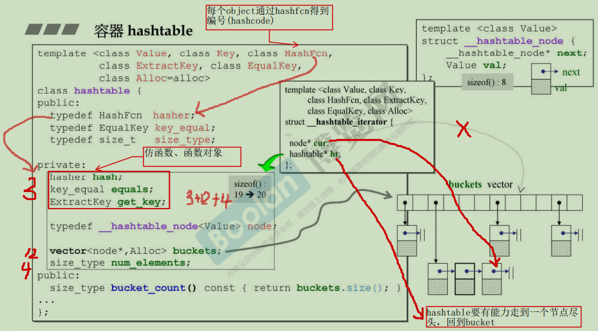

# 目录

- [目录](#目录)
- [STL](#stl)
  - [分配器](#分配器)
  - [容器](#容器)
    - [序列式容器(Sequence Containers)](#序列式容器sequence-containers)
      - [vector](#vector)
        - [constructors](#constructors)
        - [reserve：](#reserve)
        - [resize：](#resize)
        - [assign](#assign)
        - [swap：](#swap)
        - [insert:](#insert)
        - [emplace/emplace\_back:](#emplaceemplace_back)
        - [erase:](#erase)
        - [erase+remove：](#eraseremove)
        - [clear:](#clear)
        - [shrink\_to\_fit:](#shrink_to_fit)
        - [clear+shrink\_to\_fit:](#clearshrink_to_fit)
      - [deque](#deque)
      - [list](#list)
        - [assign](#assign-1)
        - [resize](#resize-1)
        - [insert](#insert-1)
        - [erase](#erase-1)
        - [swap](#swap-1)
        - [clear](#clear-1)
        - [sort](#sort)
        - [remove](#remove)
        - [reverse](#reverse)
        - [unique](#unique)
        - [splice](#splice)
        - [merge](#merge)
    - [容器适配器(Adapter)](#容器适配器adapter)
      - [stack](#stack)
      - [queue](#queue)
      - [priority\_queue:](#priority_queue)
    - [关联式容器(Associative Containers)](#关联式容器associative-containers)
      - [general](#general)
        - [底层数据结构](#底层数据结构)
        - [insert\_unique/insert\_equal](#insert_uniqueinsert_equal)
        - [lower\_bound](#lower_bound)
        - [upper\_bound](#upper_bound)
        - [equal\_range](#equal_range)
        - [insert](#insert-2)
        - [erase](#erase-2)
        - [clear](#clear-2)
        - [count](#count)
        - [find](#find)
      - [set](#set)
      - [map](#map)
        - [insert](#insert-3)
        - [operator\[\]](#operator)
        - [at](#at)
      - [multimap](#multimap)
      - [multiset](#multiset)
    - [无序容器(Unordered Containers)](#无序容器unordered-containers)
      - [general](#general-1)
      - [unordered\_map](#unordered_map)
        - [operator\[\]](#operator-1)
        - [at](#at-1)
      - [unordered\_set](#unordered_set)
      - [unordered\_multimap](#unordered_multimap)
      - [unordered\_multiset](#unordered_multiset)
  - [迭代器](#迭代器)
  - [算法](#算法)
    - [排序](#排序)
      - [std::sort](#stdsort)
      - [std::stable\_sort](#stdstable_sort)
    - [查找](#查找)
      - [std::find](#stdfind)
      - [std::find\_if](#stdfind_if)
      - [std::count](#stdcount)
      - [count\_if](#count_if)
      - [search](#search)
      - [search\_n](#search_n)
    - [删除](#删除)
      - [std::remove/remove\_if](#stdremoveremove_if)
    - [遍历](#遍历)
      - [std::for\_each](#stdfor_each)
- [references:](#references)

# STL

算法与数据的分离：利用<u>**仿函数**</u>规则的<u>**算法**</u>(内部算法、全局算法)通过<u>**迭代器**</u>访问<u>**容器**</u>中的数据。


所有algorithms，其内最终涉及元素本身的操作，无非就是**比大小**。

stl容器存在的效率问题：

1. push要完成一次对象的拷贝
2. 内存不足的时候，自动开辟新空间，对原来的数据做一次深拷贝。

解决：

emplace

移动构造，移动赋值

## 分配器

std::allocator

## 容器

### 序列式容器(Sequence Containers)

#### vector

 底层是数组，超过容量后会成倍增长，随机访问迭代器，在尾部插入/删除元素比较高效，中间插入比较低效(会有元素的搬移)

##### constructors

```c++
explicit vector (size_type n);	// 显示调用，调用n次构造函数。
vector (size_type n, const value_type& val, const allocator_type& alloc = allocator_type());	// 调用n次拷贝构造。
vector (initializer_list<value_type> il, const allocator_type& alloc = allocator_type()); // il有多少个，就调用多少次拷贝构造。
```

##### reserve：

不会调用构造函数, 不过超过容量后还是会发生拷贝, 且内存成倍增长。==reverse扩充的是总容量大小，不是追加空间，可以多次调用。== **多次调用时会分配新的内存（容量会增大），中间过程会发生数据搬移**。

##### resize：

变大会调用构造函数，size变大，==capacity变大==，超过容量后还是会发生拷贝, 且内存成倍增长。

减小会调用析构函数，size变小，==capacity不变==。

##### assign

```c++
v.assign(v1); // 将v1的内容赋值给v, size大小改为和v1一样。
			 // 如果原来v.capacity比v1小，则改为和v1.size一样；如果capaacity比v1大，则保持capacity不变。
```

由于已经知道要拷贝多少元素，所以就提前开辟这么多内存的空间，直接调用拷贝构造就行了；就不用再频繁的扩容了。

##### swap：

==swap调用之后size为0，capacity为0。==(底层是不是只改变了指针指向？从指向这个对象转到指向另一个对象？)(是不是也可以作为清空容器的一种方式？)

##### insert:

在插入位置之前插入新元素，并返回第一个新元素的迭代器。可能造成迭代器失效。

造成迭代器失效有两种情况：

1. insert(itr++, 10)：插入元素后，元素后移，itr实际指向的元素已经不是所期望的内容了。
2. 另一种情况就是当插入元素时导致容器扩容，扩容就会发生元素拷贝，则原来的迭代器就会全都失效了。

**解决**：用返回的迭代器进行下一轮循环。`itr = insert(itr, 10);`

deque，string，array迭代器失效情况同vector。

##### emplace/emplace_back:

```c++
emplace_back(5);  //直接调用构造, 省去了一次拷贝, 传入的参数必须和构造函数的类型相匹配。 
				//当容器超过容量capacity后，vector重新分配内存，还是会发生拷贝。
va.emplace_back(a4);   // 因为传入的是A类型的左值参数，所以会调用copy constructor。	
va.emplace_back(std::move(a4));   // 因为传入的是A类型的右值参数，所以会调用move constructor。
va.emplace_back(A(8));   // 因为传入的是A类型的右值参数，所以会调用move constructor
```

##### erase:

删除指定位置的元素，并返回**下一元素**的迭代器。

删除元素会使元素前移，造成迭代器失效，**使用erase返回的迭代器进行下一轮的循环。**

**v.erase(iter++)**，iter++操作会在删除前使iter指向下一个位置，删除完后面的数据会向前面移动一个位置，所以iter实际指向的已经不是所期望的内容了。

==还要考虑erase的是最后一个元素的情况。erase完最后一个元素返回的itr指向end()，再++就变成野指针了。==

```c++
// 方法一：判断返回值，如果是end,跳出
for (auto itr = v.begin(); itr != v.end(); ++itr) {
	if (itr->print() == 5) {
        itr = v.erase(itr);
        if(itr == v.end()) { break; }
     }
}
// 方法二：++itr写在循环体中
auto itr = v.begin();
while(itr != v.end()) {
	if (itr->print() == 5) { tr = v.erase(itr); }
    else { ++itr; }
}
//综上，还是方法二比较保险。
```

**deque，string，array迭代器失效情况同vector。**

##### erase+remove：

高效删除元素：使用 [std::remove](#std::remove) 把相同的元素覆盖掉(中间过程会调用**移动赋值**或**拷贝赋值**)，再使用erase(remove返回值，end)。

##### clear:

清除vector中的所有元素，**但是capacity不变**。

##### shrink_to_fit:

减小容器容量(capacity)为size大小。

##### clear+shrink_to_fit:

彻底清空容器，先调clear清空元素，size为0；再调shrink_to_fit清除空间，capacity就变为0了。

#### deque

一个管理器和多个缓冲区，支持随机访问，首尾增删比较高效。随机访问迭代器。

#### list

底层是==双向链表==，双向迭代器，不支持随机访问，插入删除元素比较高效。

##### assign

l.assign(l1); // 将v1的内容赋值给v, size大小改为和v1一样。

##### resize

同vector,只不过list没有capacity。

##### insert

**在任何地方插入不会造成迭代器失效**。由于返回值是新插入元素的迭代器，如果接受返值，则会无限循环下去。

##### erase

删除会使迭代器失效，原因是**删除后迭代器变成了野指针**。 其他同vector。只是指向删除点位置的迭代器失效(删除后变成野指针了)，其他迭代器不会失效。

解决方法：`erase(itr++);` `itr = erase(itr);`

**在循环中， 还要考虑删除最后一个元素返回值是end, 再++变成野指针的问题**：

```c++
// 方法一：判断返回值，如果是end,跳出
for (auto itr = v.begin(); itr != v.end(); ++itr) {
	if (itr->print() == 5) {
        itr = v.erase(itr);
        if(itr == v.end()) { break; }
     }
}
// 方法二：++itr写在循环体中
auto itr = v.begin();
while(itr != v.end()) {
	if (itr->print() == 5) { tr = v.erase(itr); }
    else { ++itr; }
}
//综上，还是方法二比较保险。
```

forward_list同list。

##### swap

同vector，只不过list没有capacity。

##### clear

同vector，只不过list没有capacity。

##### sort

自带sort，自定义类型重载operator<。

###### 为什么list不能使用std::sort？

std::sort随机访问迭代器才能使用。

##### remove

std:remove是覆盖值，list.remove是改变指针指向，就直接删除了，不用erase+remove这个操作了。

##### reverse

翻转链表

##### unique

删除==连续相等==的元素中，除第一个以外的其他元素。所以经常的使用方式是：先排序，再去重。

##### splice

```c++
entire list (1)	    void splice (iterator position, list& x);
single element (2)	void splice (iterator position, list& x, iterator i);
element range (3)	void splice (iterator position, list& x, iterator first, iterator last);
```


链表拼接，将一个链表拼接到另一个链表上。拼接完成后另一个链表被清空，如果是从中间截取的一段则保留剩余部分。

中间过程不涉及构造和析构的操作。

不管x是左值还是右值，或者value_type是否支持移动构造，它们都会被转移。（说白了，不就是指针的改变嘛）

##### merge

```c++
list.merge(list1, Comp()); //对于自定义类型需要定义排序准则(仿函数)。
```


### 容器适配器(Adapter)

注意：==适配器没有提供迭代器，也不能同时插入或删除多个元素。==

#### stack

容器适配器，底层结构可以选用vector，deque，list。

#### queue

容器适配器，底层结构可以选用deque，list。不能选用vector，原因是==vector没有pop_back==。

#### priority_queue:

底层可以使vector，deque；**STL中不支持底层使用链式结构**。理论上是可以使用链表等链式结构，但是效率较低因为查找某个节点的父节点或者左右孩子节点时要遍历链表，而使用数组的话可以直接根据公式（n-1/2、2n+1、2n+2）进行索引。算法为[二叉堆](Algorithm.md)。不指定比较函数默认为大顶堆。

```c++
std::priority_queue<A> pa;   // default:大顶堆
std::priority_queue<A, vector<A>, std::less<A>> pa; // 大顶堆
std::priority_queue<A, vector<A>, std::greater<A>> pa;  // 小顶堆
```


首先按优先级的大小入队，如果优先级相等，则按其它的优先级进行入队。可以==支持多级优先级。==

```c++
class Cmp {
public:
	bool operator()(const Node &na, const Node &nb) {
		if (na.priority != nb.priority)    return na.priority > nb.priority;
		else    return strcmp(na.szName, nb.szName) < 0;
	}
};
```


```c++
void make_heap(first_pointer,end_pointer,compare_function);	// 建堆 默认是大根堆  包含节点下沉的过程。
void pushheap(first_pointer,end_pointer,compare_function);	// 插入节点调整堆，包含节点上浮的过程。使用之前先用push_back把元素插到末尾
void pop_heap(first_pointer,end_pointer,compare_function);// 并不是真的把堆顶元素弹出，而是把堆顶元素和最后一个元素交换，然后在[0, last-1]这个范围内从根节点开始重新调整堆，包含节点的下沉操作。	要想真正弹出使用pop_back。
void sort_heap(first_pointer,end_pointer,compare_function);	// 堆排序。内部从 last-1 号节点开始一直到0为止，执行last-1次pop_heap操作，最后数组中的元素就是有序的。
```


### 关联式容器(Associative Containers)


#### general

##### 底层数据结构

1. 关联式容器底层数据结构使用的是==红黑树==(特殊的二叉搜索树)，因此具有根据key自动排序的功能。对于自定义类型需要==重载operator<().==

2. 迭代器++遍历（中序遍历）得到有序的结果。

3. 红黑树查找复杂度O(logn)。

##### insert_unique/insert_equal

`#include <bits/stl_tree.h>` 提供`insert_unique`、`insert_equal`两个函数。key不能重复的(map/set)调用**insert_unique**; 有重复key的(multimap/multiset)调用**insert_equal**。

##### lower_bound

lower_bound(x)：返回第一个大于等于x的位置。换句话说，lower_bound返回的是==不破坏排序得以安插x的第一个位置。==

##### upper_bound

upper_bound(x)：返回第一个大于x的位置。

##### equal_range

equal_range(x)：查找x的 lower_bound 到 upper_bound 的范围。 ==如果lower_bound和upper_bound相等说明容器中没有这个key。==

##### insert

```c++
for (set<A>::iterator itr = sa.begin(); itr != sa.end(); ++itr)
{ // pair<iterator,bool> insert(value_type& val); 如果插入成功，第一个值返回插入新元素的迭代器，第二个值返回true。							// 如果插入失败，第一个值返回已插入元素(val)的迭代器，第二个值返回false。
#if 0 							
    // auto r = sa.emplace(3);
    // auto r = sa.insert(3);
    auto r = sa.insert(4);  //推荐使用
    cout << r.first->geta() << ", " << r.second << endl; 
#endif

#if 0
        cout << "---------------------" << endl;
        int a = 3;
        auto it = sa.lower_bound(a);
        sa.insert(it, a);   // 无论插入成功与否，迭代器不会失效
        // itr = sa.insert(it, a);  // 不要接收返回值了，否则itr总是指向3，就不会无限循环了
#endif

#if 1 // 无论插入成功与否，迭代器不会失效，不过写itr++在循环中会跳着访问元素, 跳出end后产生未定义行为。
        sa.insert(itr++, 3); // 不推荐使用
#endif
```

总结：**insert不会使迭代器失效。**

1.   (不指定位置插入)要么使用`pair<iterator,bool> insert(const value_type& val);`这种方式插入。
2.   (指定位置插入)要么先用lower_bound找到适合的位置，再使用`iterator insert (const_iterator position, const value_type& val);`插入。

##### erase

 erase会造成迭代器失效，只是指向删除点位置的迭代器失效(删除后变成野指针了)，其他迭代器不会失效。

解决方法：

```c++
//以下两种写法均正确 
itr = v.erase(itr); //correct	C++11
v.erase(itr++); // correct ++指向了下一节点
```

**如果插入和删除操作导致了树不平衡，则会进行自平衡操作。**

==在循环中， 还要考虑删除最后一个元素返回值是end, 再++变成野指针的问题：==

```c++
// 方法一：判断返回值，如果是end,跳出
for (auto itr = v.begin(); itr != v.end(); ++itr) {
	if (itr->print() == 5) {
        itr = v.erase(itr);
        if(itr == v.end()) { break; }
     }
}
// 方法二：++itr写在循环体中
 auto itr = v.begin();
while(itr != v.end()) {
	if (itr->print() == 5) { itr = v.erase(itr); }
    else { ++itr; }
}
//综上，还是方法二比较保险。
```

##### clear

`map.clear() == map.erase(map.beging(), mp.end());`

##### count

计算key的个数，对于map/set来说，要么是0要么是1。缺点是不能定位key的位置。

##### find

类自带的find,比std::find效率更高。==自带的find查找规则是`operator<`, std::find查找规则是`operator==`。==

如果没找到返回end。

#### set


set/multiset：key就是value, value就是key。

#### map

##### insert

```c++
//对于自定义类型，下面这三种插入操作最快：
 map<int, A> mai;
 auto itr = mai.emplace(1, 1);       // 只有一次自定义类型的构造
 mai.emplace_hint(itr.first, 2, 2);  // 只有一次自定义类型的构造
 mai.insert(make_pair(2, 2)); 		// 只有一次自定义类型的构造
```

##### operator[]

```c++
map<int, int> m; m[1] = 2;   ==   m.operator[1] = 2;
```

操作operator[key]: 如果红黑树中有key对应的value, 则返回value的引用；如果没有则调用value的默认构造函数并插入value, 所以对于==自定义类型使用operator[]要有默认的构造函数。==  对于insert,如果map中有key时则不能插入，而当使用**operator[]则可以更新key对应的value值。**

直接insert更快，因为operator[]底层还要做一下lower_bound。

##### at

at: 返回key所对应value值的引用，如果没找到则抛出`out_of_range`异常。

####  multimap

#### multiset

### 无序容器(Unordered Containers)

[哈希表](#hashtable)



底层使用哈希表实现，时间复杂度为O(1), 对于==自定义类型需要定义hash函数和重载`operator==`==(比较key是否相同)。

如果两个元素的哈希值相同，并不能断定这两个元素就相同，必须再调用operator==才能判断是同一个值。

因为hash值为数组的索引，所以必须为非负整数。

#### general

```c++
size: 
	// 容器中元素的个数
count:	// 需要调用hash函数和operator==
    size_type count(const key_type& k) const;//返回key在容器中的数量。
	// 对于unordered_map/unordered_set来说非1即0。	**内部有调用operator==()的操作。**
clear:
	// 彻底清空
begin: 
	iterator begin() noexcept;			   // 返回容器中第一个元素的迭代器
	local_iterator begin ( size_type n );	// 返回桶号为n的第一个元素
end: 
	// 同begin.
find:	// 需要调用operator==
	iterator find ( const key_type& k );
	//查找规则与std::find不同，传入的值可以通过hash函数求得哈希值从而获得value位置，不存在返回end。
bucket:
	size_type bucket(const key_type& k) const;//返回k所在的桶号(数组下标)，取值范围为0 ~ bucket_count-1
bucket_size: 
	size_type bucket_size ( size_type n ) const;//返回桶号为n的位置元素的个数。
bucket_count: 
	size_type bucket_count() const noexcept; // 返回桶的数量
load_factor: // 装载因子(装满程度，装了百分之多少)
	float load_factor() const noexcept;	//装载因子 = 容器中元素的个数 / 桶的大小(数组的大小)。
	// load_factor= size() / bucket_count().
	// load_factor影响碰撞的概率(两个元素存储在同一个下标的位置)，当load_factor超过阈值(最大装填因子: max_load_factor)自动增大桶的大小，并进行**rehash**操作。
max_load_factor: 	// 阈值
	float max_load_factor() const noexcept;	 // get
	void max_load_factor ( float z );		 // set
	// 不过请注意，实现可能会对桶的数量施加一个上限(参见max_bucket_count)，这可能会迫使容器忽略max_load_factor。
reserve:	// 提前预留空间避免多次rehash
	void reserve ( size_type n );	// 改变桶数(bucket_count)
	// 如果n大于当前bucket_count乘以max_load_factor，容器的bucket_count会增加(增加到多少不确定，**新的桶数可以等于或大于n。[应该是最接近n的素数]**)，并**强制重新散列。**
	// 如果n小于该值，则函数可能不起作用。
rehash:		// 提前预留空间避免多次rehash
	void rehash( size_type n ); //设置桶数
	// 如果n大于容器中的当前桶数(bucket_count)，则强制重新散列。**新的桶数可以等于或大于n。**(素数)
	// 如果n小于容器中的当前桶数(bucket_count)，则该函数可能对桶数没有影响，也可能不会强制重新散列。
	// rehash可能导致迭代器失效。
	// 通过调用rehash来在哈希表中保留一定数量的桶，我们避免了容器扩展可能导致的多次rehash。
equal_range:
	pair<iterator,iterator> equal_range (const key_type& k);
	//返回容器中key等于k值的元素范围。左闭右开。 如果容器中没有对应的值，则pair中两个迭代器均返回end。
insert:	// 与map类似		插入不会使得任何迭代器失效
	pair<iterator,bool> insert ( const value_type& val );
	// 第一个元素是一个迭代器，指向容器中**新插入的元素或键值相等**的元素； 
	// 第二个元素返回true或false,指示元素是否插入成功。
	iterator insert(const_iterator hint, const value_type& val);
	// value将被存储在容器中合适的位置，无论hint传入的是什么。 
	// 该函数返回一个迭代器，指向容器中**新插入的元素或键值相等**的元素。
erase:	// 需要operator== 	指向删除点位置的迭代器失效，但是其他迭代器不会失效
	iterator erase (const_iterator position);
	//返回下一个元素的位置。注意删除最后一个元素这种情况，返回的迭代器指向end。
	size_type erase (const key_type& k);	 // 返回删除元素的数量
```


#### unordered_map

##### operator[]

```c++
hm[key] = value  ==  (hm.operator[key] = value)	//与map类似，如果没找到则插入一个默认值(需要默认构造)；找到返回value的引用。
```

##### at

```c++
mapped_type& at ( const key_type& k );//与map类似，如果找到则返回value的引用；没找到则抛出out_of_range异常
```


#### unordered_set

#### unordered_multimap

#### unordered_multiset

## 迭代器

适配器(stack,queue,priority_queue)没有迭代器。

随机访问迭代器

双向迭代器

前向迭代器

迭代器失效

## 算法

reference: STL-wangguilin 附录A

### 排序

#### std::sort

序列化容器：array,vector,deque不带成员函数sort。list,forward_list, map,unordered_map带sort.

 对于自定义类型，需要提供operator<()重载。std::sort随机访问迭代器才能使用。 ==重载的函数记得加上const, 否则const对象编不过。==

#### std::stable_sort

稳定排序。相同元素值排序后保持之前的顺序。

### 查找

#### std::find

序列化容器：array,vector,list,deque,forward_list 不带成员函数count。

返回在[first,end)范围内等于val的第一个元素的迭代器，没找到返回end。相当于：

```c++
template<class InputIterator, class T>
  InputIterator find (InputIterator first, InputIterator last, const T& val)
{
  while (first!=last) {
    if (*first==val) return first;
    ++first;
  }
  return last;
}
```

对于自定义类型，需要提供operator==()重载。

而且应该传一个对象` std::find(v.begin(), v.end(), A(5))`,这样临时对象只会构造一次，然后每次比较只会和这个临时对象比较。

如果传的是值`std::find(v.begin(), v.end(), 5)`, 这样每次比较时都会先创建一个临时对象，比较完再析构，效率较低。

#### std::find_if

返回在[first,end)范围内等于pred等于true的第一个元素的迭代器。相当于：

```c++
template<class InputIterator, class UnaryPredicate>
  InputIterator find_if (InputIterator first, InputIterator last, UnaryPredicate pred)
{
  while (first!=last) {
    if (pred(*first)) return first;
    ++first;
  }
  return last;
}
```

#### std::count

序列化容器：array,vector,list,deque,forward_list 不带成员函数count。

计算元素val的个数。对于自定义类型，需要提供operator==()重载。

count函数行为相当于：

```c++
template <class InputIterator, class T>
count (InputIterator first, InputIterator last, const T& val)
{
  int ret = 0;
  while (first!=last) {
    if (*first == val) ++ret;
    ++first;
  }
  return ret;
}
```

#### count_if

计算在[first, last)范围内pred为真的元素个数。

count_if行为相当于：

```c++
template <class InputIterator, class UnaryPredicate>
count_if (InputIterator first, InputIterator last, UnaryPredicate pred)
{
  int ret = 0;
  while (first!=last) {
    if (pred(*first)) ++ret;
    ++first;
  }
  return ret;
}
```


#### search

```c++
template <class ForwardIterator1, class ForwardIterator2>
ForwardIterator1 search (ForwardIterator1 first1, ForwardIterator1 last1, ForwardIterator2 first2, ForwardIterator2 last2);

template <class ForwardIterator1, class ForwardIterator2, class BinaryPredicate>
ForwardIterator1 search (ForwardIterator1 first1, ForwardIterator1 last1, ForwardIterator2 first2, ForwardIterator2 last2,              BinaryPredicate pred);
```

在 [first1, last1) 范围内查找**第一次**出现 [first2, last2) 的位置。对于自定义类型需要重载**operator==()**。

返回值：成功返回第一次出现的位置，失败返回 last1 。

其行为相当于：

```c++
template<class ForwardIterator1, class ForwardIterator2>
ForwardIterator1 search ( ForwardIterator1 first1, ForwardIterator1 last1, ForwardIterator2 first2, ForwardIterator2 last2)
{
  if (first2==last2) return first1;  // specified in C++11
  
  while (first1!=last1)
  {
    ForwardIterator1 it1 = first1;
    ForwardIterator2 it2 = first2;
    while (*it1==*it2) {    // or: while (pred(*it1,*it2)) for version 2
        ++it1; ++it2;		// 注意：first1和first2都是左闭右开区间
        if (it2==last2) return first1;	// 找到了，返回第一次出现的位置。
        if (it1==last1) return last1;	// 没找到，返回last1。
    }
    ++first1;
  }
  return last1;
}
```


#### search_n


### 删除

#### std::remove/remove_if<a id="std::remove"></a>

对于自定义类型，需要提供==`operator==()`==重载。remove函数并不是真正的把元素删除，而是把要删除的元素覆盖掉，所以**中间过程有一个后值覆盖前值的操作**，标准库中使用std::move, **如果没移动构造则调拷贝构造**，效率会变低。

remove也应该传个临时对象进去：`std::find(v.begin(), v.end(), A(5))`, 原因同上。

### 遍历

#### std::for_each

```c++
// [first, end)这个范围内的所有元素调用fn函数, fn可以是函数、仿函数、lambda表达式
template <class InputIterator, class Function>
Function for_each (InputIterator first, InputIterator last, Function fn);
//这个模板函数的行为相当于：
template <class InputIterator, class Function>
Function for_each (InputIterator first, InputIterator last, Function fn) {
    for(;first != last; ++first) {
        f(*first);
    }
    return fn;
}
```


