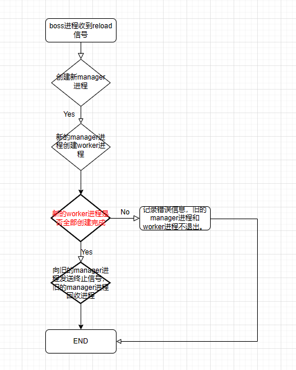

# 后端架构

[nginx+fastcgi](nginx/fastcgi.md)。nginx和fastcgi进程之间和使用unix域套接字进行通信，也可以使用ip+port的形式进程通信。需要修改nginx的配置文件nginx.conf中的fastcgi_pass等参数。 

进程之间不会共享全局变量、信号处理函数，fork之后就是单独的进程了。

## 为什么采用多进程架构？

1. 一个原因是进程之间不会相互影响，一个进程崩溃了，不会影响其他进程。
2. 第二个原因是利用linux操作系统的==写时复制(copy-on-write)==的的特性。由于程序只是需要访问数据，不需要改数据，所以多个进程之间共享静态内存，即使开很多进程也不会占用太多的内存。

## ncserver的两个功能

boss进程创建manager进程，manager进程创建worker进程，worker进程的数量由配置文件指定。**静态数据的加载是在manager进程中进行的**，先加载数据再进行fork，这样就利用了写时复制的特性。

### reload数据无需重启

主要用在日更数据的更新上，当数据更新时，不需要手动重启，只需设置一个定时脚本来发送reload信号。

在boss进程中注册一个SIGUSR1的信号处理函数，当boss进程收到==SIGUSR1==信号时，fork一个新的进程作为manager进程，然后新的manager进程再去创建新的worker进程，==当所有的worker进程都创建完成时==，会向旧的manager进程发送一个终止信号(SIGTERM)，收到终止信号后，开始回收worker进程，直到所有worker进程都被回收，manager进程也就结束了。至此，这个reload流程结束。

### 自动补充worker进程

某个进程崩溃了或者被杀掉了（==都会产生SIGCHLD信号==），manager进程会马上fork出一个worker进程补充上。也就是说manager进程中有一个循环，不断的在检查worker进程的数量。

流程：循环遍历每个worker进程的pid，使用 `waitpid(m_children[i], NULL, WNOHANG);`如果返回值大于0，说明某个进程退出了；则manager进程立刻fork出一个worker进程。

## ncserver的压测

压测工具使用apache benchmark: ab -n 100000 -c 200 。 -n：表示一共发送多少请求，-c：表示并发数。

最大并发可以达到200。

可以通过spawn-fcgi -b backlog修改全连接的队列的容量来修改增加并发，还可以通过修改内核参数：net.core.somaxconn, net.ipv4.tcp_max_syn_backlog.

# 差路剔除算法

1. ==找差异==：路线之间两两比较，先找到相同路段的下标，从而直到差异路段的下标。
2. ==算分==：然后根据路线长度、eta、红绿灯个数、收费金额等(乘以对应的系数)，计算出差异部分的代价值。
3. ==丢弃==：如果两条路代价的比值大于1.68，则丢弃较差的那条。

# 选路算法

主要使用dbscan算法。dbscan算法有两个重要的参数，eps和minpts：eps代表邻域的半径，minpts代表邻域内至少有多少点。

dbscan算法的主要流程就是：

1. 第一步先初始化，把所有点标记为未访问的。
2. 然后第二步，在数据集中任选一点p，找到从点p出发所有与它密度相连的点，形成一个簇。
3. 第三步，重复步骤二，直到数据集中的所有点都被访问或者被标记为噪声点(==噪声点就是不属于任何簇的点，从任一核心点出发都是密度不可达的==)。

而dbscan算法的==重点==在于找到某一点的所有密度可达的点。方法是这样的：

1. 检查某一点p的r-邻域内的点是否不少于minpts：
   1. 如果少于则把点p标记为噪声点。
   2. 如果大于则把点p标记为核心点，并把点p标记为核心点，新建簇，并把r-邻域内的点放到候选集合中。
2. 然后遍历候选集合中的点，检查其r-邻域内点的个数：
   1. 如果少于minpts，则标记为边界点。
   2. 如果大于minpts，则标记为核心点，并把r-邻域内的点添加到候选集合中。
3. 重复步骤二，直到候选集合为空，这样一个簇就形成了。

dbscan算法用在路线聚类中：

我们把eps抽象成==相似度==。初始值是50。最大值100（说明完全相似），最小值0。

把minpts抽象成==与路线相似的个数==，一般把minpts尽量设置的小一点，初始值设为1。

聚类：因为一般界面都是显示3条路，所以要聚成3个簇。

## 怎么让他聚成三个类呢?

minpts不变，不断去调整eps(也就是相似度)。

1. 如果聚成的簇比期望的少，说明半径大了，需要减小半径eps = (min + curr)/2；

2. 如果聚成的簇比期望的多，说明半径小了，需要增大半径eps = (max + curr)/2。

## 相似度是怎么计算的。

在使用dbscan算法之前要先计算相似度！！！ 相似度计算规则是这样的：

路线之间两两比较，计算出两条路线中相同的路段长度，然后除以两条路线长度较小的那条，算出一个百分比。

==`sharedLength / min(route1Length, route2length)`==

## 聚类后组内排序的规则

聚成三个簇之后，在每个簇中进行排序，排序是有一个策略：

每条路线根据路线总长度，eta，红绿灯个数(就是乘以一个系数)，综合计算出一个值，根据这个值去排序。

# 地图匹配算法

地图匹配使用的是隐式马尔可夫+维特比算法。

隐马有三类问题：就是已知观测序列、隐藏序列、模型参数(观测概率、转移概率)，其中两个求第三个。

==维特比算法就是：已知观测概率和模型参数求解隐藏序列的问题。==

一般使用色子问题来模拟这一过程。

维特比算法流程：

1. 先算出起始时刻的状态的概率。
2. 然后根据前一状态的概率、当前状态的观测概率、前一状态转移到当前状态的概率计算出当前状态的概率。P(当前状态概率)=P(前一状态概率) * P（观测概率) * P(前一状态概率转移到当前状态的概率)。
3. 重复步骤2,直到最后时刻。
4. 然后找到最后时刻中，概率最大的状态，然后进行回溯一直到起始状态，这是最大概率的隐藏序列。

我们把隐式马尔可夫的某一时刻用gps点来表示，某一时刻的n个状态就是有多少条路段。每次向前扩散，扩散距离最长不超过100米，一个link代表一个状态。

## 初始代价计算？

<u>根据起始的==gps点==在半径200米范围内抓路，每抓到一个路段作为就起始时刻的一个状态。然后计算初始状态的代价</u>，这就涉及到下面的观测代价的计算。

<u>然后求下一时刻(gps点)中可能的状态。</u>

## 下一时刻的状态如何获得？

<u>从第二个点开始就不再继续抓路了，而是从前一个路段向外==扩散==（找出边）。扩散完成后就要计算当前路段的[观测代价](#观测代价模型)和[转换代价](#转换代价模型)了，从而计算出当前状态的代价。为了计算方便我们把**概率转成成代价**，把概率相乘转换成**代价相加**。</u>

### 扩散距离如何计算？

有一个公式：==上一个gps和当前gps点两点之间的距离 * 3 / 2==。

如果碰到转向，则要适当增大扩散距离(两点间距离 * 2)。==转向如何判断？==gps点有方向值，如果上一个点和当前点的角度差大于60表明正在转向。

<u>扩散距离最大不能超过100米。</u>

### 当前状态的代价如何计算？

当前状态的代价 = 上一状态的代价(最小值) + 观测代价 + 上一状态转换到当前状态的代价。

下面就涉及到如何求解观测代价和转换代价。

## 观测代价模型

首先根据gps点在当前路段上面抓路(==投影==)，会得到一个grabinfo，根据grabinfo中的**距离偏差**(devation)和**角度偏差(**angleDeviation)乘以相关的系数得到==观测代价值==。

==距离偏差==：gps点到路段的距离。

==角度偏差==：gps点的方向与路段的方向差。

### 投影怎么计算？

图吧有个库函数来计算 任意一点到线段上的距离最近的点。由于路段有可能不是直的，所以遍历线段上的所有形状点，前后两个形状点一组构成一个线段。

点到线段的距离就是**deviation**。两个形状点之间可以求出方向，与gps点的方向相减得到**angleDeviation**。

## 转换代价模型

转换代价指的是从上一个点对应的某个路段 到 当前点对应的某个路段的代价。理论上两点之间的距离和两条路段之间的距离是差不多的，方向亦是如此。

1. ==距离差==：上一个gps和当前gps点之间的距离 和 两条路段上两个点(形状点)的距离之差。如果相差太大则增大代价。
2. ==方向差==：上一个gps和当前gps点之间的方向 和 两条路段上两个点(形状点)的方向之差。如果相差太大则增大代价。
3. ==坡度差==：上一个gps和当前gps点之间的坡度 和 两条路段上两个点(形状点)的坡度之差。如果相差太大则增大代价。
4. 从主路进入到辅路则相应的增大代价。（如果设置了主路优先的话。）

### 路段上的坡度怎么计算？

根据的路段上的形状点，不断的累积高度。

## 回溯

最后一步就是回溯了，找到最后gps点所对应所有状态中代价值最小的，然后沿着父状态指针依次往前遍历直到起始状态，这样就找到了gps点所对应的隐藏路线。

# 客户端引擎架构

reactor

拼接各种请求

切路

导航进度

探路

location

