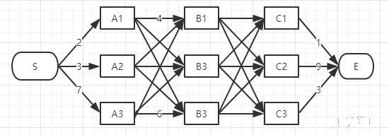

# viterbi算法原理

1. ==初始化==：根据观测序列，计算**初始时刻**中每个状态的概率(初始概率)。
2. ==计算下一时刻的状态概率==：根据上一状态概率、状态转移概率、观测概率求出当前状态的**最大**概率，并==记录==上一状态。**P(当前状态概率)=P(上一状态概率) * P(上一状态转移到当前状态的概率) * P(当前状态观测概率)**。<u>*【上一状态概率可能有多个，取最大的概率】*</u>
3. ==递推==：重复第2步骤，直到递推到最后时刻。
4. ==回溯==：从最后一个时刻中选择**概率最大**的状态，然后找到这个状态的上一状态，直到回到起始状态，这个序列就是最大概率的隐藏序列。(倒序的，翻转得到正序)

# reference

[如何通俗地讲解 viterbi 算法？](https://www.zhihu.com/question/20136144)

[viterbi算法原理](https://wenku.baidu.com/view/9a7af103322b3169a45177232f60ddccdb38e658.html?_wkts_=1678689628087&bdQuery=viterbi%E7%AE%97%E6%B3%95%E5%8E%9F%E7%90%86)

