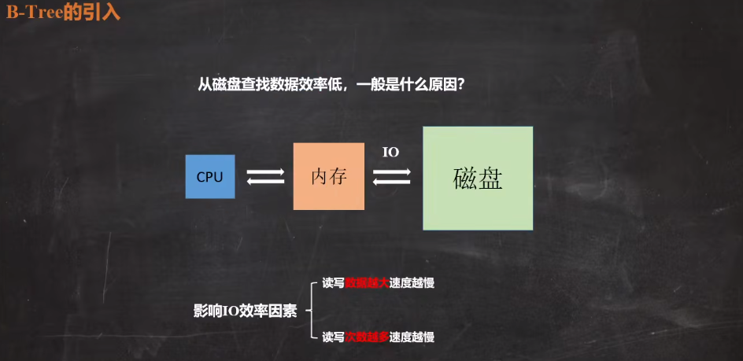

### B树

#### B树的引入

从磁盘查找数据效率低，一般是什么原因？

1.   读写**数据越大**速度越慢。
2.   读写**次数越多**速度越慢。

#### 为什么不能用二叉树作为数据库索引？

如果使用二叉树，插入的数据越多，则树的深度越深，严重影响读取/查找的效率。既然二叉搜索树有效率问题，那么就用多叉搜索树，所以**B树就是一颗有序的多路查询树**。我们在描述一颗B树时需要指定它的阶数(**m**)，阶数(**m**)表示一个节点有几个孩子节点，当m=2时，就是我们常说的二叉搜索树。一般m>=3。

#### B树的性质

一颗m阶的B树有如下性质：

1.   每个节点**最多**有m个子节点，也就是关键字至多有m-1个。
1.   **根节点**==最少==有两个子节点，也就是关键字至少有一个。
1.   **非根、非叶子**节点==至少==有 **ceil(m/2)** 个孩子节点，也就是关键之至少有 **ceil(m/2)-1** 个。
1.   **叶子节点**都在同一层上，也就是根节点到每个叶子节点的路径长度都相同。
1.   每个节点中的关键字都是按照从小到大排序，每个关键字的左子树都小于它，右子树都大于它。

#### B树的查找

#### B树的插入

#### B树的删除

#### B树的遍历

https://blog.csdn.net/reliveIT/article/details/118251784

### B+树

#### B+树的引入

#### B树和B+树的区别？

1.   存储方式：
2.   查询效率：
3.   遍历效率：

https://www.baidu.com/s?ie=utf-8&f=8&rsv_bp=1&rsv_idx=1&tn=baidu&wd=b%E6%A0%91%20b%2B%E6%A0%91%20b-%E6%A0%91&fenlei=256&oq=sqlite%25E6%25BA%2590%25E7%25A0%2581&rsv_pq=d299f1e7000df3f5&rsv_t=93eey%2Bt3rNjDw0Sq3t5d0zo4sVDfodp6cUqnqhtjOIQJaItsLq2hQnSRVZA&rqlang=cn&rsv_enter=1&rsv_dl=tb&rsv_btype=t&inputT=3996484&rsv_sug3=52&rsv_sug1=28&rsv_sug7=100&sug=b%25E6%25A0%2591%25E5%2592%258Cb%252B%25E6%25A0%2591%25E6%259C%2589%25E4%25BB%2580%25E4%25B9%2588%25E5%258C%25BA%25E5%2588%25AB&rsv_n=1&rsv_sug2=0&rsv_sug4=3996484

https://www.bilibili.com/read/cv14452970/

http://www.360doc.com/content/12/0121/07/10087950_1041783142.shtml

https://www.jianshu.com/p/db226e0196b4

https://www.404bugs.com/details/912005690218565632

https://leetcode.cn/circle/discuss/F7bKlM/view/9EqQqw/

# reference

[C++实现B树_b树的创建代码_心之所向041的博客-CSDN博客](https://blog.csdn.net/weixin_44628585/article/details/126461216?ops_request_misc=%7B%22request%5Fid%22%3A%22169192202116777224428377%22%2C%22scm%22%3A%2220140713.130102334.pc%5Fall.%22%7D&request_id=169192202116777224428377&biz_id=0&utm_medium=distribute.pc_search_result.none-task-blog-2~all~first_rank_ecpm_v1~rank_v31_ecpm-4-126461216-null-null.142^v92^chatsearchT0_1&utm_term=R树c%2B%2B实现&spm=1018.2226.3001.4187)