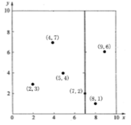
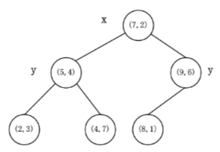

# kd树

kdtree是一颗特殊的二叉查找树。

## kd树的建树步骤

==kd树的构建就是一个不断找划分轴和划分值，分割左、右子树的过程。==

kd树的建树步骤如下：

1. 选择一个合适的**划分轴**：从待构建kd树的数据集中选择一个划分轴(x,y,z...)。划分轴的选择方法：
    -   各维坐标轴**轮流**作为划分轴，比如：对于一个二维的点这次使用x划分，下一次使用y轴划分，再下一次使用x划分。
    -   选择具有最大方差的**维度**的坐标轴作为划分轴，可以保证在构建kd树时，子节点的数据点分布相对均匀。
2. 选择一个合适的**划分值**：在选定的划分轴上选择一个划分值。常用的选择方法是选择当前划分轴上的**中位数**作为划分值，将数据集分为两个子集。
3. 根据划分点将数据集分为**两个子集**：将数据集中小于划分点的数据点保存在当前节点的左子节点，将大于等于划分点的数据点保存在当前节点的右子节点。
4. **递归**构建左子树和右子树：对当前节点的左子节点和右子节点分别进行上述步骤，直到所有数据点都被构建成叶子节点。
5. 重复步骤1-4，直到构建完整棵kd树。

注意：在构建kd树时，还需要考虑处理**相同**坐标点的情况。如果有多个相同坐标的点需要划分时，可以将它们分配到左子节点或右子节点中，或者将它们保存在当前节点中。

### 为什么要选择方差大的坐标轴作为划分轴？

方差越大说明数据越分散，选择方差大的坐标轴作为划分轴可以**减少回溯时访问子树的次数。**

### 为什么要选择中位数作为划分点？

为了确保所建立的树尽量平衡。

## kd树的插入步骤

kd树的插入步骤如下：

1. 找到要插入的位置：从树的根节点开始，根据当前节点的划分轴和划分点，逐层比较要插入的数据点与当前节点的划分点的大小，确定要插入的位置。
    1. 插入新节点：将要插入的数据点作为一个新节点插入到kd树中。如果要插入的位置为空，则直接将该节点插入到该位置；如果要插入的位置已经存在节点，则根据当前节点的划分轴和划分点的大小关系决定将新节点插入到左子节点还是右子节点中。

2. 更新划分轴：插入新节点后，可以根据需求重新选择当前节点的划分轴。常用的选择方法是按照层数奇偶性来切换划分轴，即第一层选择x轴，第二层选择y轴，以此类推。
3. 重复步骤1-2，直到插入所有待插入的数据点。

注意：在插入新节点时，为了确保kd树的平衡性，可以考虑采用平衡插入策略。一种常用的方法是先构建一棵完整的kd树，然后根据需要插入新节点时，**重新构建**整棵kd树。另一种方法是通过**旋转**操作来平衡kd树，使得插入节点后，树的高度保持较小的变化。

## kd树的删除步骤

kd树的删除步骤如下：

1. 找到要删除的节点：从kd树的根节点开始，根据当前节点的划分轴和划分点，逐层比较要删除的数据点与当前节点的划分点的大小，找到要删除的节点。

2. 删除节点：将找到的要删除的节点从kd树中移除。如果要删除的节点是叶子节点，直接删除即可。如果要删除的节点不是叶子节点，则需要进行以下操作:

   a. 找到节点的替代节点：替代节点可以是右子树中最小的节点，或者是左子树中最大的节点。这里以找右子树中最小的节点为例。从要删除的节点的右子节点开始，沿着划分轴向下找到最小的节点。

   b. 用替代节点的值替换要删除的节点的值。

   c. 删除替代节点：将替代节点从kd树中移除。

3. 更新划分轴：在删除节点后，可以根据需求重新选择当前节点的划分轴。常用的选择方法是按照层数奇偶性来切换划分轴，即第一层选择x轴，第二层选择y轴，以此类推。

4. 重复步骤1-3，直到删除所有的需要删除的节点。

注意：在删除节点时，需要注意确保kd树的平衡性。可以考虑采用平衡删除策略，即删除节点后进行一系列的平衡操作，使得删除节点后，树的高度保持较小的变化，从而提高查询效率。

## kd树的搜索步骤

kd树的搜索步骤如下：

1. 从根节点开始，比较待搜索的目标点与当前节点的划分点。
2. 根据划分轴的大小关系，沿着树的某个分支往下搜索。如果目标点的坐标在划分点的左侧，则向左子节点搜索；如果在右侧，则向右子节点搜索。
3. 重复步骤2，直到搜索到满足特定条件的节点。可以根据具体的搜索需求，设定一个搜索范围或者设定一个距离阈值，确定搜索终止的条件。
4. 判断当前节点是否满足搜索条件。如果满足，则将当前节点保存为搜索结果；如果不满足，则继续搜索其他子树。
5. 通过递归或者迭代，对剩余的子树进行搜索，重复步骤2-4，直到搜索完所有的子树。
6. 返回搜索结果。

注意：在搜索kd树时，可以根据具体的需求选择适当的搜索策略，例如最近邻搜索、范围搜索等。不同的搜索策略在步骤3中的条件判断方式会有所不同。另外，为了提高搜索效率，可以考虑使用剪枝技术，即根据目标点与当前节点的划分点之间的距离，判断是否需要搜索当前节点的子树。

## KNN和Ranged-KNN

1.   递归搜索子节点，找到最短距离。
2.   回溯：从叶子节点向上搜索另一未被访问的子树，判断其中是否有距离更近的点。（搜索另一子树的条件：子树的根节点到搜索点的距离(**某一坐标轴**)是否小于目前的最短距离(**半径**)）

# reference

https://zhuanlan.zhihu.com/p/529487972

https://zhuanlan.zhihu.com/p/402555908

https://blog.csdn.net/weixin_43834466/article/details/127621740