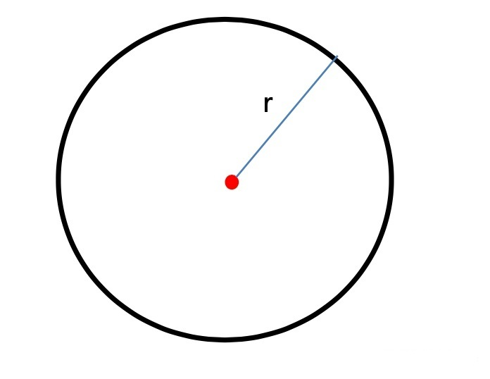
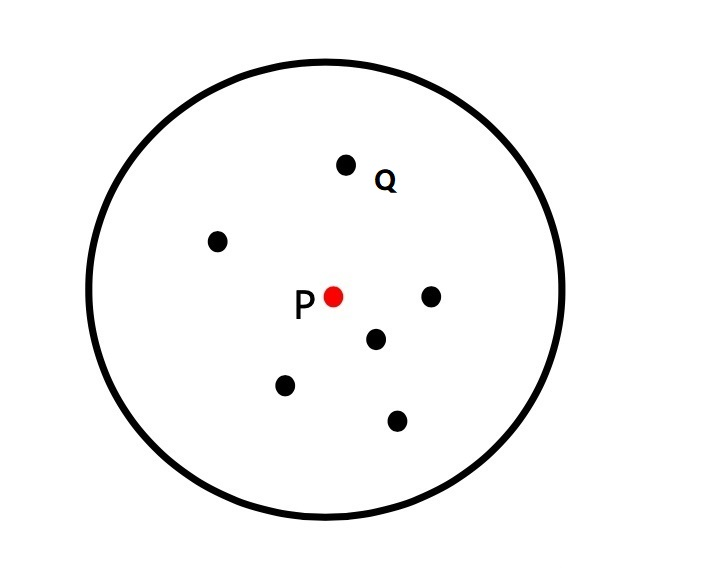
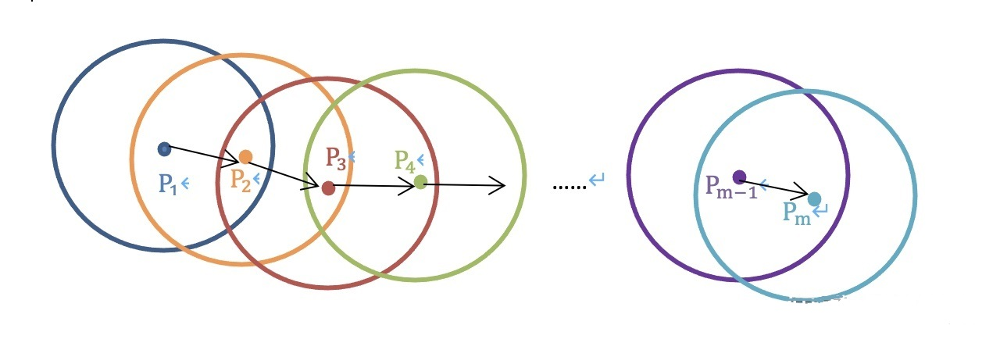
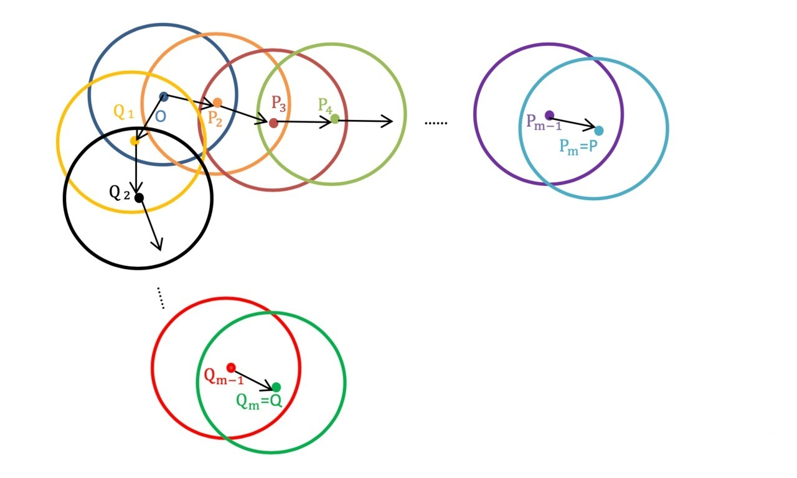
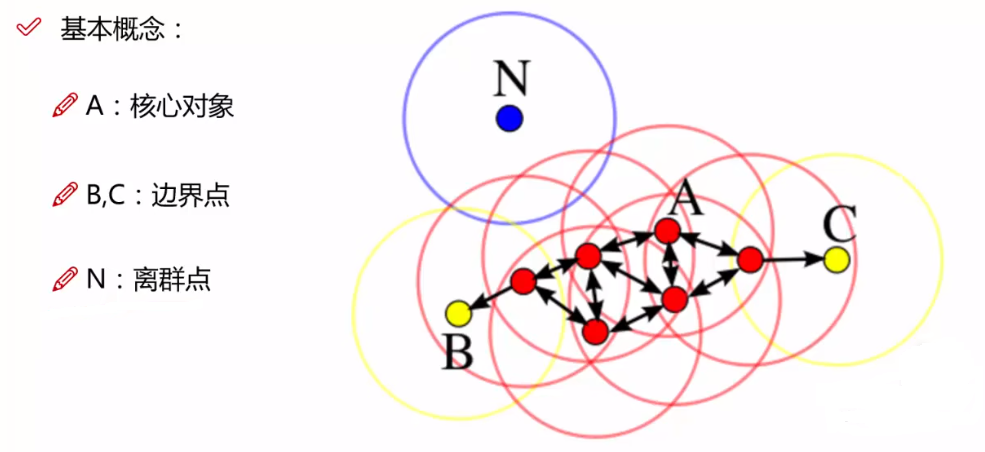
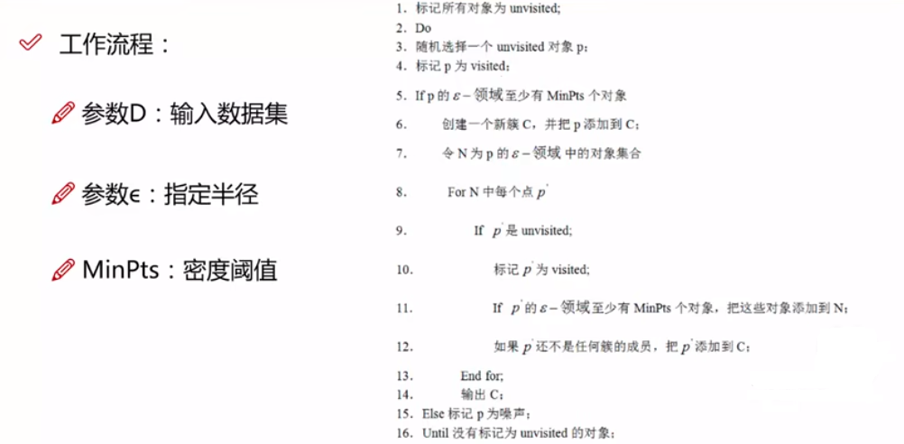

在聚类分析问题中，如果数据集的各类呈球形分布，可以采用kmeans聚类算法，如果各类数据呈非球形分布（如太极图、笑脸图等），采用kmeans算法效果将大打折扣，这种情况可尝试使用DBSCAN聚类算法。

DBSCAN既可以解决球形分布的数据集分类问题，也可以解决非球形分布的数据集分类问题（如太极图、笑脸等）。

# 优缺点

## 优点

1. 不需要指定簇的个数，自动聚类。
2. 可以发现任意形状的簇。
3. 能够识别出噪声点。
4. 只需要两个参数（eps和minPts）。

## 缺点

1. 不能很好的反映高维数据。（可以做降维）
2. 参数难以选择，对结果的影响大。

# 基本概念

## r邻域

半径为r的球。

## 核心点

如果某个点P的r-邻域内至少包含minPoints个点，则称点P为核心点。

## 直接密度可达

如果点Q在==核心点P==的r-邻域内，则称点P到点Q是直接密度可达的。在点P的r-邻域内的所有点都是==直接密度可达==的。

## 密度可达

若存在一系列点P1，P2，P3 ... Pm是核心点，从任意点P~i~到点P~i+1~是==直接密度可达==的（即P2在P1的圈里，P3在P2的圈里，P4在P3的圈里，以此类推，Pm在Pm−1的圈里），则称点P1到点Pm是==密度可达==的。

## 密度相连

从某核心点O出发，点P和点Q都是密度可达的，则称点P和点Q是密度相连的。

## 边界点

若点q的r-邻域内点的个数小于minPoints，但是点q又在某一核心点的r-邻域内，则称点q是边界点。

## 噪声点

不属于任何簇的点，从任一核心点出发都是密度不可达的。

## 簇

从某一点p出发，找到所有密度可达的样本集合，即为最终聚类的一个簇。

一个簇中可以有一个核心点或多个核心点。

1. 如果有一个核心点，则簇中的其他非核心点一定在核心点的r-邻域内。
2. 如果有多个核心点，则簇中任意一个核心点的r-邻域中一定有另一个核心点，否则两个==距离较远==核心点无法密度可达。**这些核心点的r-邻域中的所有样本的集合组成一个簇**。

# dbscan算法原理

DBSCAN 算法是==基于密度==的算法，所以它将密集区域内的点看作核心点（核心样本）。主要有两个参数：==minPoints和epsilon==。epsilon表示数据点的邻域==半径==，如果某个数据点的邻域内至少有minPoints个数据点，则将该数据点看作为==核心点==。

1. 如果将eps(半径)设置得非常小，则有可能没有点成为核心点，并且可能导致所有点都被标记为噪声。
2. 如果将eps(半径)设置为非常大，则将导致所有点都被划分到同一个簇。

如果minPoints设置的太大，那么意味着更少的点会成为核心点，而更多的点将被标记为噪声。

1. 

# dbscan算法步骤

1. ==初始化==：标记所有对象为未访问的，标记所有对象不属于任何一个簇(-1)。
2. ==新建簇==：选择任意一点p，检查其在r-邻域内是否至少包含minPoints个点：
   1. 如果不少于minPoints则创建一个==新簇C==，把点p添加到新簇C中(p为==核心点==)，同时把r-邻域内的所有点加入到==候选集合N==中。
   2. 如果少于minPoints，则==暂时==标记为==噪声点==。
3. ==扩展簇==：遍历候选集合N中没有被处理的点q，检查其r-邻域，
   1. 如果点的个数不少于minPoints(q为核心点)，则把邻域内的所有对象加入到候选集合N中。并把q添加到新簇C中(在此之前如果q还没添加到任何一个簇)。
   2. 如果点的个数少于minPoints，则标记为==边界点==。（虽然它的个数少于minpts，但是它在核心点的r-邻域内）
4. 重复步骤3，直到候选集合N为空，说明当前簇扩展完成。
5. 重复步骤2、3，直到所有点被归入某个簇或被标记为噪声点。

# reference

https://www.naftaliharris.com/blog/visualizing-dbscan-clustering/

[常用聚类算法（一） DBSCAN算法](https://www.bbsmax.com/A/6pdDmYgKzw/)

[聚类算法：KMeans vs DBSCAN](https://zhuanlan.zhihu.com/p/94022640)

[DBSCAN聚类算法原理及实现|与kmeans简单对比](https://zhuanlan.zhihu.com/p/459927289)

[【他山之石】DBSCAN密度聚类算法（理论+图解+python代码）](https://mp.weixin.qq.com/s?__biz=MzAxMDcyOTQxNA==&mid=2649893103&idx=2&sn=d5066b90962c6c26142a46383d14cc6e&chksm=834d6a46b43ae3501b64806dcd192d6c0a1db55f66c568d47fa73821ba931633845f5d075cb3&scene=27)