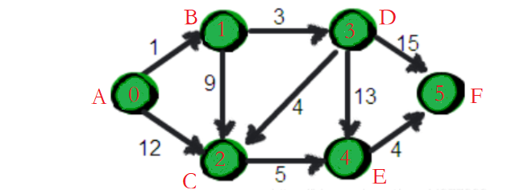

A->B->D->C->E->F

时间复杂度：O(n^2^)

dijkstra主要应用在正权边的图。

# 算法原理

主要就是维护三个数组：**距离数组、标记数组，记录父节点数组**。

1. <u>根据邻接矩阵(或邻接表)初始化起点v到其他顶点的距离</u>（需定义一个==存储距离的数组==或Node类中定义一个距离属性），<u>并标记起点v已访问</u>(需定义一个==标记数组==或Node类中定义一个visited属性),。
2. 从距离表中选取其中距离值最小的结点w（可以使用优先队列或者遍历寻找）作为当前结点，并标记为已访问。
3. 如果当前结点w的距离+当前结点w到未被访问的邻接点的距离**小于**距离表中的值，则更新距离表中的值，同时记录下邻接点的父节点（需定义一个==记录父节点的数组==或Node类中定义一个指向父节点的指针）。
4. 重复步骤2、3直到所有结点都被访问。或者openlist(优先队列)为空。

# reference

https://blog.csdn.net/qq_35644234/article/details/60870719

https://www.cnblogs.com/bigsai/p/11537975.html

https://www.jianshu.com/p/8b3cdca55dc0

https://blog.csdn.net/major_zhang/article/details/72519233

https://mp.weixin.qq.com/s?__biz=MzIxMjE5MTE1Nw==&mid=2653197626&idx=1&sn=fca7472af006a7f8890ee84ad7cf1116&chksm=8c99e7e0bbee6ef6faa1a34160a5e135503425e37552e90dfca2fbc10f223dbf3b875e84e418&scene=21#wechat_redirect

https://zhuanlan.zhihu.com/p/454373256

