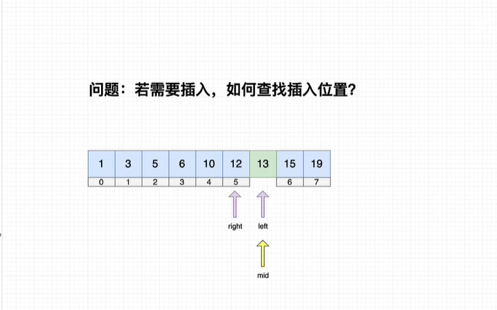

# 目录


- [目录](#目录)
    - [冒泡排序](#冒泡排序)
    - [选择排序](#选择排序)
    - [直接插入排序](#直接插入排序)
    - [希尔排序](#希尔排序)
    - [快速排序](#快速排序)
    - [归并排序](#归并排序)
    - [堆排序](#堆排序)
    - [二分查找](#二分查找)


### 冒泡排序

```c
/*
    最好时间复杂度：O(n), 最坏、平均时间复杂度:O(n2). 稳定性:不稳定。
    逻辑：
        1.相邻元素两两比较。如果大于就交换。
        2.外层循环需要循环n-1次。
        3.内层循环需要循环n-1-i次。(每一趟比较完，要减去末尾元素)
        4.直至不能两两比较。
*/
void bubbleSort(int *arr, int n)
{
    int flag = 1;
    for (int i = 0; i < n - 1; i++)
    {
        flag = 1; //冒泡的改进，若在一趟中没有发生逆序，则该序列已有序
        for (int j = 0; j < n - 1 - i; j++)
        {
            if (arr[j] > arr[j + 1])
            {
                arr[j] ^= arr[j + 1];
                arr[j + 1] ^= arr[j];
                arr[j] ^= arr[j + 1];
                flag = 0;
            }
        }
        if (flag)
        {
            break;
        }
    }
}
```

### 选择排序

```c
/*
    无序区选择一个最小值和无序区中的第一个元素交换，然后无序区长度减1，有序区长度增1。
    最好、最坏、平均时间复杂度都为O(n2). 稳定性:不稳定
    实现逻辑:
        第一趟: 在1~n的范围内查找最小元素，和第一个元素(0)交换
        第二趟: 在2~n的范围内查找最小元素，和第二个元素(1)交换
        第n趟:  在i~n的范围内查找最小元素，和第i-1个元素交换
*/
void selectSort(int *arr, int n)
{
    for (int i = 0; i < n - 1; i++)
    {
        int min = i;                      // 初始值
        for (int j = i + 1; j < n; j++) // 查找最小值
        {
            if (arr[j] < arr[min])
            {
                min = j;
            }
        }

        if (k != i) // 交换最小值
        {
            arr[i] ^= arr[min];
            arr[min] ^= arr[i];
            arr[i] ^= arr[min];
        }
    }
}
```


### 直接插入排序

```c
/*
    最好时间复杂度：O(n), 最坏、平均时间复杂度:O(n2). 稳定性:稳定。
    实现逻辑:
        将第一个元素作为已排序序列，第2~n个元素作为未排序序列。
        从未排序序列中每次取第一个元素和排序序列中的元素从后往前比较，如果比要插入的元素大则往后移，直到找到要插入的位置。
*/
void insertSort(int *arr, int n)
{
    int i, j, t;
    for (i = 1; i < n; i++)
    {
        t = arr[i];                                    // 要插入的元素
        for (j = i; j - 1 >= 0 && arr[j - 1] > t; j--) // 如果前一个元素比要插入元素大，则往后移，空出插入位置
        {
            // if(t < arr[j-1])
            // {
            arr[j] = arr[j - 1];
            // }
            // else {
            //      break;
            // }
        }
        arr[j] = t; // 插入
    }
}
```


### 希尔排序

```c
/*
    最好、最坏、平均时间复杂度:O(logn). O(n1.3).O(n1.5) 稳定性:不稳定。
    希尔排序的基本思想是：先将整个待排序的记录序列分割成为若干子序列分别进行直接插入排序，
                        待整个序列中的记录"基本有序"时，再对全体记录进行依次直接插入排序。
    希尔排序是插入排序的一种优化。
    先分组再进行插入排序，不断减小gap值(除以2)直至gap为1。为1的时候就是直接插入排序了。
*/
void shellSort(int *arr, int n)
{
    int i, j, t;
    int gap = n / 2; // 分组
    while (gap >= 1)
    {
        // 把距离为gap的编为一个组，扫描所有组
        for (i = gap; i < n; i++)
        {
            t = arr[i];
            // 对距离为gap的元素组进行插入排序
            for (j = i; j - gap >= 0 && arr[j - gap] > t; j -= gap)
            {
                arr[j] = arr[j - gap];
            }
            arr[j] = t;
        }
        gap = gap / 2;
    }
}
```


### 快速排序

```c
/*
    最好、平均时间复杂度都为O(nlogn), 最坏为O(n2). 稳定性:不稳定
    最差情况是：每次选基准值都是最小值或者最大值。
    基准值的选取：
        1.一般选择数组中的第一个元素，适用于随机序列，对有序序列效果不太理想。
        2.三数取中：选择数组的第一个、中间一个和最后一个，然后选取数据值居中的那个元素。
    实现逻辑:
        1.先在数组中选中一个基准值。
        2.分组，把小于等于基准值的都放到左边，把大于基准值的都放到右边。
        3.再对每个子组重复进行1,2步操作。
*/

int partitionIndex(int *arr, int low, int high)
{
    int pivot = arr[low], l = low, h = high;
    while (l < h) // 相等的时候把pivot赋值
    {
        // 一定要有l<h这个条件，否则相遇之后还会h--，l++而造成交换元素
        // 一定要有等号，数据交换完后l、h要前进一步，否则不停的交换元素陷入死循环。
        while (/**/ l < h && /**/ arr[h] >= pivot) // 大而移动，小而赋值
        {
            h--;
        }
        arr[l] = arr[h];
        while (/**/ l < h && /**/ arr[l] <= pivot) // 小而移动，大而赋值
        {
            l++;
        }
        arr[h] = arr[l];
    }
    arr[h] = pivot;

    return l;
}

void quickSort(int *arr, int low, int high)
{
    if (low < high)
    {
        int h = partitionIndex(arr, low, high);
        
        quickSort(arr, low, h - 1);
        quickSort(arr, h + 1, high);
    }
}
```


### 归并排序

```c
void merge_twoOrderedPart_in_array(int *arr, int *tmp, int start, int mid, int end)
{
    int i = start;   // 左半区第一个未排序的元素
    int j = mid + 1; // 右半区第一个未排序的元素
    int k = start;   // 临时数组起始下标

    // 合并左右半区数组元素到临时数组
    // 0 <= 0 && 1 <= 1
    while ((i <= mid) && (j <= end)) {
        if (arr[i] < arr[j]) { // 左半区元素更小
            tmp[k++] = arr[i++];
        }
        else { // 右半区元素更小
            tmp[k++] = arr[j++];
        }
    }

    // 合并左半区剩余元素
    while (i <= mid){
        tmp[k++] = arr[i++];
    }
    // 合并右半区剩余元素
    while (j <= end){
        tmp[k++] = arr[j++];
    }

    // 拷贝回原数组
    while (start <= end) {
        arr[start] = tmp[start];
        start++;
    }
}

/*
    最好、最坏、平均时间复杂度都为O(logn). 稳定性:稳定
    归并排序是一个外排序，需要申请额外空间
    实现逻辑:
        1.采用分治的思想，先把一个数组分成一个个只包含一个元素的小数组
        2.再把小数组进行归并。直至左半区和右半区合成一个大数组
*/
void mergeSort(int *arr, int *tmp, int start, int end)
{
    // 如果只有一个元素那么就不需要继续划分
    // 只有一个元素的区域，本来就是有序的，只需要归并即可
    if (start < end) // 0 < 1       // 【递归结束条件】
    {
        // 找中间点
        int mid = (start + end) / 2; // start=0, end=1, mid=0, (0 + 1)/2 = 0
        // 递归划分左半区
        mergeSort(arr, tmp, start, mid); // mergeSort(arr, tmp, 0, 0)
        // 递归划分右半区
        mergeSort(arr, tmp, mid + 1, end); // mergeSort(arr, tmp, 1, 1)
        // 合并已排好序的左右半区
        merge_twoOrderedPart_in_array(arr, tmp, start, mid, end);
    }
}
```


### 堆排序

  最好、最坏、平均时间复杂度都是O(logn). 稳定性:不稳定


### 二分查找

迭代版：

```c
/*
    二分查找: 复杂度O(logn)
    前提是序列必须是有序的。
*/
int binarySearch_iteration(int *arr, int low, int high, int find) {
    int mid = 0;
    // 循环结束条件  当high>low时表示没查找到，
    // 一定要有等号，让high往前移；没等号也会少比一次
    while (low <= high) {
        mid = (low + high) / 2;
        if (arr[mid] == find) {
            return mid;
        }
        else if (find < arr[mid]) {
            high = mid - 1;
        }
        else {
            low = mid + 1;
        }
    }
    // return low;  // 如何找到插入元素的位置？只需要返回low那个位置
    return -1;
}
```

递归版：

```c
int binarySearch_recursive(int *arr, int low, int high, int find) {
    int mid = 0;
    if (low <= high) { // 递归结束条件
        mid = (low + high) / 2;
        if (arr[mid] == find) {
            return mid;
        }
        else if (find < arr[mid]) {
            return binarySearch_recursive(arr, low, mid - 1, find);
        }
        else {
            return binarySearch_recursive(arr, mid + 1, high, find);
        }
    }
    return -1;
}
```

如何查找插入位置？只需把left位置返回回来即可。(==没问题==)



