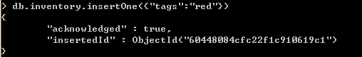
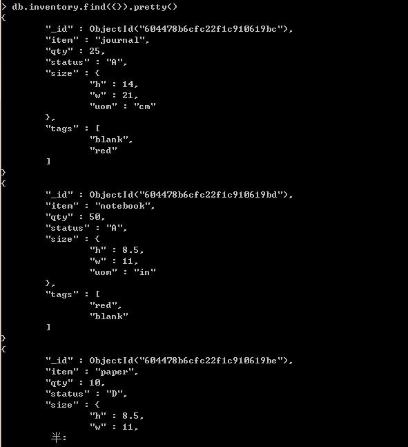

# 数据库

## 创建数据库

```sql
use DATABASE_NAME # 如果数据库不存在，则创建数据库，否则切换到指定数据库。
```


## 删除数据库

```sql
db.dropDatabase()
```


## 显示当前所使用的数据库

```sql
db
```


## 显示所有数据库

```sql
show dbs
```


# 集合 (表)

## 创建集合

语法：

```sql
db.createCollection(name, options)
```

-   name: 要创建的集合名称

-   options: 可选参数, 指定有关内存大小及索引的选项

    https://www.runoob.com/mongodb/mongodb-create-collection.html

```sql
db.createCollection("runoob")     # 先创建集合，类似数据库中的表
```


在 MongoDB 中，可以自动创建集合。当你插入一些文档时，MongoDB 会自动创建集合。

```sql
> db.mycol2.insertOne({"name" : "菜鸟教程"})
> show collections
mycol2
...
```


## 删除集合

```
db.collection_name.drop()
```


## 显示集合

```sql
show collections
or
show tables
```


## 查看集合信息

```sql
db.getCollectionInfos()
```


## 固定集合(capped collections)

MongoDB 固定集合（Capped Collections）是性能出色且有着固定大小的集合，对于大小固定，我们可以想象其就像一个**环形队列**，当集合空间用完后，再插入的元素就会**覆盖最初始的头部的元素**！

#### 创建固定集合

```sql
db.createCollection("capLogCollection", {capped:true,size:10000,max:1000}) 
```

-   size：整个集合空间大小，单位：字节。
-   max：集合文档个数上限，单位：个。

如果空间大小到达上限，则插入下一个文档时，会覆盖第一个文档；如果文档个数到达上限，同样插入下一个文档时，会覆盖第一个文档。

#### 判断是否为固定集合

```sql
db.capLogCollection.isCapped()
```

#### 转换普通集合为固定集合

```sql
db.runCommand({"convertToCapped":"posts",size:10000}) # 将posts集合转换为固定集合
```


# 操作符

## 比较操作

大于：$gt

```sql
db.collection_name.find({"key":{$gt: 20}})
```

小于：$lt

```sql
db.collection_name.find({"key":{$lt: 20}})
```

大于等于：$gte

```sql
db.collection_name.find({"key":{$gte: 20}})
```

小于等于：$lte

```sql
db.collection_name.find({"key":{$lte: 20}})
```

等于：$eq

```sql
db.collection_name.find({"key":{$eq: 20}})
```

不等于：$ne

```sql
db.collection_name.find({"key":{$ne: 20}})
```

比较运算组合：

例：查询一个集合col中age在30到50之间的文档数据

```sql
db.col.find({age:{$gt:30,$lt:50}})
```


## 逻辑操作

AND：

```sql
db.col.find({k1:v1, k2, v2})
```

OR：

```sql
db.col.find({$or:[{k1:v1}, {k2, v2}]})
```

AND 和 or组合：

```sql
db.col.find({"likes": {$gt:50}, $or: [{"by": "菜鸟教程"},{"title": "MongoDB 教程"}]})
== 
where likes >= 150 and (by == "菜鸟教程" or title == "MongoDB 教程")
```


## $type操作符

```sql
db.col.find({"title" : {$type : 2}})
或
db.col.find({"title" : {$type : 'string'}})
```

https://www.runoob.com/mongodb/mongodb-operators-type.html

## 模糊匹配和正则表达式

查询key中包含 ‘p’ 的文档：

```sql
db.collection_name.find({"key":/p/})
```

查询key中以 ‘p’ 开头的文档：

```sql
db.collection_name.find({"key":/^p/})
```

查询key中以 ‘p’ 结尾的文档：

```sql
db.collection_name.find({"key":/p$/})
```


## 截断limit和偏移skip

只输出前3条记录：

```sql
db.collection_name.find().limit(3)
```

从第2条开始只输出两条记录：

```sql
db.collection_name.find().limit(2).skip(1)
```


## 排序

基于某个字段进行排序：

```sql
db.col.find({}, {key1:1, _id:0}).sort({"likes":1}); # 1代表升序 -1代表降序
==
select key1 from col order by likes asc;
```


## 分组


# 文档 (行)

## 插入文档

-   db.collection_name.insertMany() ：向集合中插入多条文档数据.

```sql
db.inventory.insertMany([
   { item: "journal", qty: 25, status: "A", size: { h: 14, w: 21, uom: "cm" }, tags: [ "blank", "red" ] },
   { item: "notebook", qty: 50, status: "A", size: { h: 8.5, w: 11, uom: "in" }, tags: [ "red", "blank" ] },
   { item: "paper", qty: 10, status: "D", size: { h: 8.5, w: 11, uom: "in" }, tags: [ "red", "blank", "plain" ] },
   { item: "planner", qty: 0, status: "D", size: { h: 22.85, w: 30, uom: "cm" }, tags: [ "blank", "red" ] },
   { item: "postcard", qty: 45, status: "A", size: { h: 10, w: 15.25, uom: "cm" }, tags: [ "blue" ] }
]);
```


-   db.collection_name.insertOne()：向集合中插入一条文档数据。



也可以先定义一个变量：

```sql
> document=({title: 'MongoDB 教程',
    description: 'MongoDB 是一个 Nosql 数据库',
    by: '菜鸟教程',
    url: 'http://www.runoob.com',
    tags: ['mongodb', 'database', 'NoSQL'],
    likes: 100
});
```

再插入这条记录：

```sql
db.test.insertOne(document)
```


## 删除文档

-   删除全部文档：

    ```sql
    db.collection_name.deleteMany({})
    ```

-   删除满足条件的多条数据：

    ```sql
    db.collection_name.deleteMany({"name":"xxxx"})
    ```

-   删除满足条件的单条数据：

    ```sql
    db.collection_name.deleteOne({"key":"value"})
    ```

    

## 查找文档

查看全部文档：

```sql
db.collections.find({})
```


```sql
db.collections.find({}).pretty()
```




查找文档中的某个字段：

```sql
db.collection_name.find({}, {_id: 0 , key1:1, key2:1}) # 0表示不显示_id
==
select key1, key2 from collection_name;
```


## 更新文档

更新某一个文档的某个字段值：

```sql
db.updateOne({_id:Object}, {$set:{key: new_val}})
== 
update table_name set key=xxx where id=xxx;
```

更新多个文档的某个字段值：

```sql
db.updateMany({key:val}, {$set:{key:new_val}})
```


## 替换文档

```sql
db.inventory.replaceOne(
   { item: "paper" },
   { item: "paper", instock: [ { warehouse: "A", qty: 60 }, { warehouse: "B", qty: 40 } ] }
)
```


# mongodb之间的引用关系

## 嵌入式关系

```sql
{
   "_id":ObjectId("52ffc33cd85242f436000001"),
   "contact": "987654321",
   "dob": "01-01-1991",
   "name": "Tom Benzamin",
   "address": [
      {
         "building": "22 A, Indiana Apt",
         "pincode": 123456,
         "city": "Los Angeles",
         "state": "California"
      },
      {
         "building": "170 A, Acropolis Apt",
         "pincode": 456789,
         "city": "Chicago",
         "state": "Illinois"
      }]
} 
```

address这个文档以嵌套的形式保存在集合中。

## 文档之间的引用

```sql
{
   "_id":ObjectId("52ffc33cd85242f436000001"),
   "contact": "987654321",
   "dob": "01-01-1991",
   "name": "Tom Benzamin",
   "address_ids": [
      ObjectId("52ffc4a5d85242602e000000"),
      ObjectId("52ffc4a5d85242602e000001")
   ]
}

```

把两个文档分开，只保存ObjectId。

## 数据库之间的引用

```sql
{
   "_id":ObjectId("53402597d852426020000002"),
   "address": {
       "$ref": "address_home",
       "$id": ObjectId("534009e4d852427820000002"),
       "$db": "runoob"
   },
   "contact": "987654321",
   "dob": "01-01-1991",
   "name": "Tom Benzamin"
}
```

-   $ref：集合名
-   $id：引用的id
-   $db：数据库名

```sql
>var user = db.users.findOne({"name":"Tom Benzamin"})
>var dbRef = user.address
>db[dbRef.$ref].findOne({"_id":(dbRef.$id)})
```


# 聚合(aggregation)

```sql
db.collection_name.aggregate([
	{
    	$group:{
			_id:'$xxx',
			document:{$sum:1}	# {$sum:1}：计算分组后文档的条数
    	}
	}
])
```


# 索引

索引是为了提高查询效率，不创建索引会全文扫描文档。

每个索引占据一定的存储空间，在进行插入，更新和删除操作时也需要对索引进行操作。所以，如果你很少对集合进行读取操作，建议不使用索引。

## 创建索引

语法

```sql
db.col.createIndex({key1:1|-1, key2:1|-1, ...}, {options:val}) #1表示按升序创建索引，-1代表按降序创建索引
```

options：https://www.runoob.com/mongodb/mongodb-indexing.html

-   background：建索引的过程会阻塞其他数据库操作，background指定以后台方式创建索引。默认值为false
-   unique：是否建立唯一索引。默认值为false.

例：创建一个包含多个字段的复合索引，创建索引的过程在后台执行：

```sql
db.col.createIndex({open:1, close:1}, {background:true})
```


## 查看索引

```sql
db.col.getIndexes() #查看所有索引
```


## 删除索引

```sql
db.col.dropIndexes() #删除所有索引
db.col.dropIndex("索引名") #删除指定索引
```


# 高可用性(high availability)
## 副本集

避免单点故障，相当于redis的主从结构。写操作都是在主节点完成的，然后同步到从节点。

# 高扩展性(high scalability)
## 分片


# 事务


# 监控


# 备份和恢复


# 存储引擎


# mongodb驱动

https://www.mongodb.com/docs/drivers/


# mongoDB tools

## mongoimport

https://www.mongodb.com/docs/database-tools/mongoimport/#mongodb-binary-bin.mongoimport

导入json文件：

```sql
mongoimport  --host=mongodb1.example.net --port=37017 --username=user --db=db_name --collection=coll_name --file=contacts.json
```


# reference

[practical-mongodb-aggregations](https://www.practical-mongodb-aggregations.com/)

[MongoDB中文手册|官方文档中文版](https://docs.mongoing.com/)

