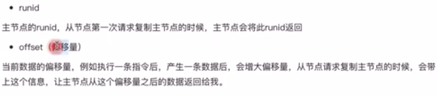
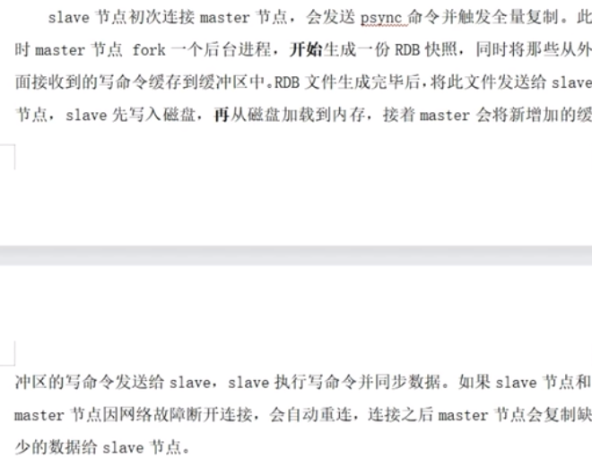
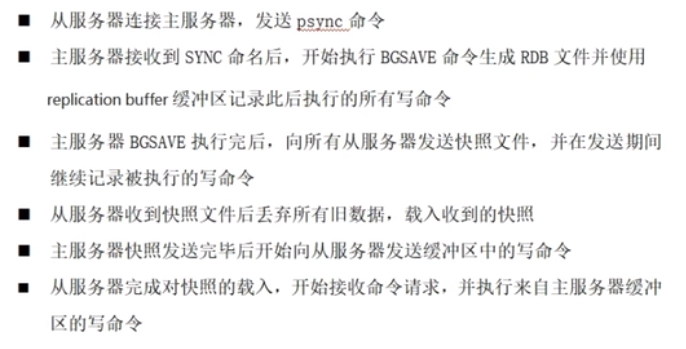
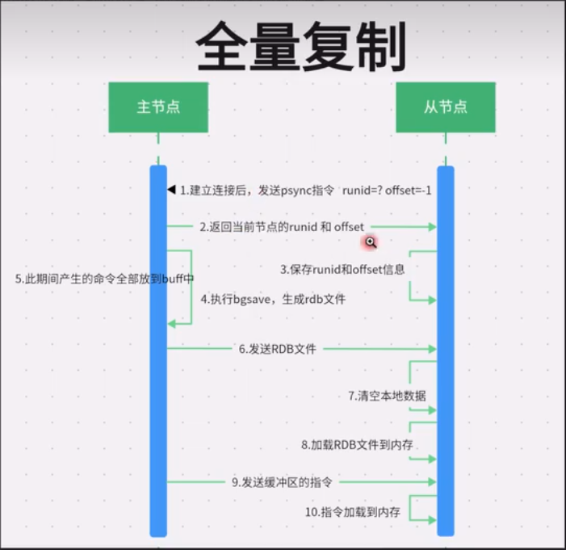
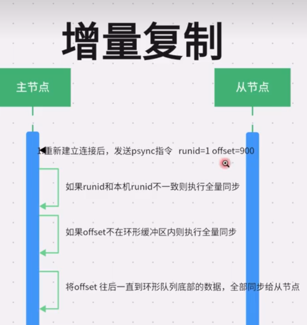

# redis安装

```bash
sudo apt-get install libjemalloc-dev # ubuntu试了还是没编过

sudo make PREFIX=/usr/local/redis install MALLOC=libc
sudo make noopt #编译debug版本
```

这里多了一个关键字 'PREFIX=' 这个关键字的作用是编译的时候用于指定程序存放的路径。比如我们现在就是指定了 redis 必须存放在 '/usr/local/redis' 目录。假设不添加该关键字 linux 会将可执行文件存放在 '/usr/local/bin' 目录，库文件会存放在 '/usr/local/lib' 目录。配置文件会存放在 '/usr/local/etc 目录。其他的资源文件会存放在 'usr/local/share' 目录。这里指定好目录也方便后续的卸载，后续直接 `rm -rf /usr/local/redis` 即可删除 Redis。

## 服务器启动

```bash
服务启动要加上配置文件，否则还是启动的本地回环(127.0.0.1)，并且密码也不会生效
./redis-server ../redis.conf
```

## 客户端连接

指定 IP 和端口连接 redis：./redis-cli -h 127.0.0.1 -p 6379 -a 密码

-h：redis 主机 IP（可以指定任意的 redis 服务器）

-p：端口号（不同的端口表示不同的redis 服务）

-a：密码

--raw：避免中文乱码

登录后认证密码：

```bash
auth <password> # redis6.0之前只有一个参数
auth <username> <passwd> #redis6.0
```

关闭Redis服务

./redis-cli -p 6379 shutdown

# 数据库

## 查看数据库信息

```bash
info
```

## 查看有几个数据库

```bash
config get databases
```

## 切换数据库

```bash
SELECT dbindex #切换数据库，默认为db0。例：切换到db1：**SELECT 1**
```

## 删除所有数据库中的所有key

flushall

## 删除当前数据库中的所有key

flushdb

# CONFIG 配置

```bash
CONFIG GET * #获取所有配置
CONFIG GET key #获取某个字段的值

CONFIG SET key value #设置某个字段的值
```

- CONFIG GET save：指定在多长时间内，有多少次更新操作，就将数据同步到数据文件，可以多个条件配合

  ```bash
  > config get save
  1) "save"
  2) "900 1 300 10 60 10000"
  #  900 秒（15 分钟）内有 1 个更改，300 秒（5 分钟）内有 10 个更改以及 60 秒内有 10000 个更改。
  ```

- CONFIG GET requirepass：redis连接密码，默认关闭。如果配置了，需要通过`AUTH <password>`命令进行登录。

- 

[redis配置参数](https://www.runoob.com/redis/redis-conf.html)


# key 键

### 查找指定的key

语法：KEYS <pattern>

```bash
KEYS *：查找所有key
keys k*: 查找以k开头的key
```

### 检查给定key是否存在

EXISTS <key>

### 返回key对应的类型

TYPE <key>

### 删除key

DEL <key>

### 设置过期时间

- EXPIRE <key> seconds：为key设置过期时间，单位：秒
- EXPIREAT <key> timestamp：和EXPIRE功能一样，为key设置过期时间，只是后面是timestamp(以秒为单位)时间戳
- PEXPIRE <key> milliseconds：为key设置过期时间，单位：毫秒
- PEXPIREAT <key> milliseconds-timestamp：和PEXPIRE功能一样，为key设置过期时间，只是后面是以毫秒为单位时间戳。

### 获得剩余生存时间

- TTL <key>：返回key的剩余生存时间(time to live)，单位：秒
- PTTL <key>：返回key的剩余生存时间(time to live)，单位：毫秒


- MOVE <key> dbindex：将key移动到指定的数据库db中。redis默认有16个数据库，0~15。例：**MOVE key 1**
- PERSIST <key>：移除key的过期时间，将key持久化，也就是保存到文件
- RANDOMKEY：随机返回一个key
- RENAME <key> <newkey>：修改key的名称，如果数据库中有重名的 ‘newkey’，则会覆盖。
- RENAMENX <key> <newkey>：修改key的名称，如果数据库中有重名的 ‘newkey’，则不会修改key。
- 
- DUMP <key>：序列化key


# 数据类型

https://www.tkcnn.com/redis/Data-types.html

## 字符串(string)

- SET <key> <value>：设置key的值
- SETEX <key> <seconds> <value>：设置key所对应的value和过期时间，单位：秒
- PSETEX <key> <milliseconds> <value>：设置key所对应的value和过期时间，单位：毫秒。
- SETNX <key> <value>：只有在key不存在时才会设置key的值。
- SETRANGE <key> <offset> <value>：用value覆盖从偏移量offset开始的值。
- 
- GET <key>：获取key的值
- GETRANGE <key> start end：获取key对应value的子字符串
- GETSET <key> <newvalue>：为key设置新值，返回旧值。
- 
- MSET <key1> <value1> <key2> <value2>：同时设置多个key-value键值对
- MSETNX <key1> <value1> <key2> <value2>：同时设置多个key-value键值对，**只有当所有key值都不存在时，才会set成功**。
- MGET <key1> <key2> ... ：获取所有指定key的值
- 
- STRLEN <key>：获取value值的长度。
- INCR <key>：如果value是数字，则将value加1，**value必须为整数。**
- INCRBY <key> <increment>：给value加上给定的增量（increment），**increment必须为整数**（正数加1，负数减一）。
- INCRBYFLOAT <key> <increment>：给value加上给定的浮点值增量
- 
- DECR <key>：value减1，value必须为整数。
- DECRBY <key> <decrement>：value减decrement，value和decrement必须为整数。
- APPEND <key> <value>：如果key对应的v值的类型是string，则把value追加到原来值的后面

string作为计数器

```sql
> set total_crashes 0
OK
> incr total_crashes
(integer) 1
> incrby total_crashes 10
(integer) 11
```

Redis 命令参考：http://doc.redisfans.com/

https://redis.com.cn/commands.html

http://www.redis.cn/commands.html


## 列表(list)

-   LPUSH <key> <val1 ... valN>：将一个值或多个值插入到链表头部。

-   LPUSHX <key> <val1 ... valN>：将一个值或多个值插入到一个已存在的链表的头部，如果列表不存在则插入失败。

-   RPUSH <key> <val1 ... valN>：将一个值或多个值插入到列表尾部。

-   LPUSHX <key> <val1 ... valN>：将一个值或多个值插入到一个已存在的链表的尾部，如果列表不存在则插入失败。

-   

-   LPOP <key>：移除并返回列表的第一个元素，当key不存在时，返回nil。

-   RPOP <key>：移除并返回列表的最后一个元素，当key不存在时，返回nil。

-   BLPOP <key1 ... keyN> <timeout>：移除并返回列表的第一个元素(有元素立刻返回)，如果列表中没有元素会阻塞列表直到超时或者有可弹出元素。**timeout为0表示一直等待。可以同时阻塞多个列表**

-   BRPOP <key1 ... keyN> <timeout>：移除并返回列表的最后一个元素(有元素立刻返回)，如果列表中没有元素会阻塞列表直到超时或者有可弹出元素。**timeout为0表示一直等待。可以同时阻塞多个列表**。

-   

-   RPOPLPUSH <key1> <key2>：移除key1列表的最后一个元素，插入到另一个列表的头部。

-   BRPOPLPUSH <key1> <key2> <timeout>：移除key1列表的最后一个元素，插入到另一个列表的头部；如果key1中没有元素则阻塞等待直到超时或者有元素可被移出。timeout为0表示一直等待。

-   

-   LLEN <KEY>：返回列表长度。

-   LRANGE <key> <start> <end>：返回列表中指定区间的元素。0表示列表第一个元素，-1表示列表最后一个元素。

    ```sql
    lrange key 0 -1 #返回全部元素
    lrange key 0 3 #返回第一个元素到第4个元素
    lrange key -3 -1 #返回倒数第3个元素到倒数第一个元素。
    ```

-   LINDEX <key> <INDEX>：通过索引获取列表中的值

    ```sql
    lindex key 0 #获取第一个元素
    lindex key -1 #获取最后一个元素
    ```

-   LINSERT <key> <BEFORE|AFTER> <pivot> <value>：在列表<key>的某个元素<pivot>之前或者之后插入元素<value>。

-   LSET <key> <index> <value>：在列表key的索引位置index设置值为value。

-   LREM <key> <count> <value>：移除列表key中与value相等的值。

    -   count > 0：从表头向表尾搜索，移除与value相等的元素，数量为count。
    -   count < 0：从表尾向表头搜索，移除与value相等的元素，数量为count。
    -   count = 0：移除列表中所有与value相等的元素。

-   LTRIM <key> <start> <end>：裁剪列表，保留[start, end]范围内的元素，其他元素全部删除。


## 哈希(hash)

-   HSET <key> <field val>：将对组<field val>设置到hash表<key>中，如果field字段存在则进行覆盖。
-   HSETEX <key> <field val>：只有在字段<field>不存在时才会设置<val>。
-   HGET <key> <field>：获取字段<field>对应的值。
-   
-   HMSET <key> <field1 val1> ... <fieldN valN>：在hash表<key>设置多个对组。
-   HMGET <key> <field1> ... <fieldN>：获取多个指定字段的值。
-   HGETALL <key> ：获取hash表<key>中所有的键值对<field val>。
-   
-   HLEN <key>：获取hash表中字段<field>的数量。
-   HKEYS <key>：获取hash表<key>中所有的字段<field>。
-   HVALS <key>：获取hash表<key>中所有的val。
-   HEXISTS <key> <field>：判断字段<field>是否在hash表<key>中存在。
-   
-   HINCRBY <key> <field> <increment>：对<field>对应的整数值(必须是整数)+increment。
-   HINCRBYFLOAT <key> <field> <increment>：对<field>对应的浮点数值+increment。
-   HDEL <key> <field1> ... <fieldN>：删除一个或多个字段<field>。


## 集合(set)

-   SADD <key> <val1> ... <valN>：向集合<key>中添加一个或者多个value。添加重复元素会失败。
-   
-   SMEMBERS <key>：返回集合<key>中所有的元素。
-   SISMEMBER <key> <value>：判断<value>是否是集合<set>中的元素。
-   SRANDMEMBER <key> <count>：随机返回集合<key>中1个或多个元素，count>0表示返回多个元素。
-   SCARD <key>：获取集合<key>中有几个元素。
-   
-   SREM <key> <val1> ... <valN>：移除集合<key>中指定的一个或多个元素。
-   SPOP <key> <count>：移除并返回集合<key>中一个或多个随机元素。
-   SMOVE <src_key> <dest_key> <val>：将集合<src_key>中的元素<val>移动到集合<dest_key>中。
-   
-   SUNION <key1> <key2> ... <keyN>：并集：返回指定两个或多个集合的并集。
-   SINTER <key1> <key2> ... <keyN>：交集：返回指定两个或多个集合的交集。
-   SDIFF <key1> <key2> ... <keyN>：差集：返回集合<key1>相对于其他集合的差异元素。
-   SUNIONSTORE <dest_key> <key1> ... <keyN>：将并集存储到指定集合<dest_key>中。
-   SINTERSTORE <dest_key> <key1> ... <keyN>：将交集存储到指定集合<dest_key>中。
-   SDIFFSTORE <dest_key> <key1> ... <keyN>：将差集存储到指定集合<dest_key>中。


## 有序集合(sorted set)

-   ZADD <key> <score1 val1> ... <scoreN valN>：向有序集合<key>中添加一个或多个元素，或更新已存在元素的分数值。

-   ZCARD <key>：获取有序集合<key>中元素的个数。

-   ZCOUNT <key> <min> <max>：返回指定分数区间[min, max]内的元素的个数。

-   ZLEXCOUNT <key> <min> <max>：返回指定字典区间[min, max]内的元素的个数。

    -   [ 符号

        [min 表示返回的结果中包含 min 值
        [max 表示返回的结果中包含 max 值

    -   ( 符号
            (min 表示返回的结果中不包含 min 值
            (max 表示返回的结果中不包含 max 值

    -   [MIN, [MAX 可以用-,+ 代替
        
        -   表示得分最小值的成员
        + 表示得分最大值的成员

    ```bash
    127.0.0.1:6379> zadd chars 2 a 2 b 2 c 3 d 3 e
    (integer) 5
    
    127.0.0.1:6379> zadd chars 4 f 4 g 5 h 5 i
    (integer) 4
    
    127.0.0.1:6379> zlexcount chars - + 
    (integer) 9
    
    127.0.0.1:6379> zlexcount chars [b [f
    (integer) 5
    ```

-   

-   ZRANK <key> <val>：返回有序集合<key>中元素<val>的索引值。分数值从低到高排序，排第几名。

-   ZREVRANK <key> <val>：返回有序集合<key>中元素<val>的索引值。分数值从高到低排序，排第几名。

-   

-   ZRANGE <key> <start> <stop> [withscores]：返回有序集合<key>中指定索引区间[start,stop]内的元素。分数值从低到高。

-   ZRANGEBYSCORE <key> <min> <max>  [withscores]：返回有序集合<key>中指定分数区间[min,max]内的元素。分数从低到高。

-   ZRANGEBYLEX <key> <min> <max>：返回有序集合<key>中指定字典区间[min,max]内的元素。

-   

-   ZREVRANGE <key> <start> <stop> [withscores]：返回有序集合<key>中指定索引区间[start,stop]内的元素，分数从高到低。

-   ZREVRANGEBYSCORE <key> <max> <min>  [withscores]：返回有序集合<key>中指定分数[min,max]内的元素。分数从高到低。

-   ZREVRANGEBYLEX <key> <>：

-   

-   ZREM <key> <val1> ... <valN>：删除有序集合<key>中一个或多个成员。

-   ZREMRANGEBYSCORE <key> <min> <max>：删除有序集合<key>中在分数区间[min,max]内的元素。

-   ZREMRANGEBYBANK <key> <start> <stop>：删除有序集合<key>中在排名区间[min,max]内的元素。

-   ZREMRANGEBYLEX <key> <min> <max>：删除有序集合<key>中在字典区间[min,max]内的元素。

-   

-   ZSCORE <key> <val>：返回有序集合<key>中指定元素<val>的分数值。

-   ZINCRBY <key> <score_increment> <val>：对有序集合<key>中的元素<cal>加上分数增量<score_increment>。

-   

-   ZUNIONSTORE <key>

-   ZINTERSTORE <key>

-   


## HyperLog

## stream

轻量级的消息队列，提供了消息持久化和主从复制的功能。

# 发布订阅

可以用pub/sub来实现一个消息队列。

局限性：消息无法持久化，无法记录历史消息。

## 发布

publish channel

## 订阅

subscribe channel

psubscribe channel_pattern:订阅一个或多个通道 。例：psubscribe chan*

## 退订

unsubscribe channel1 ... channelN：退定一个或多个通道。

punsubscribe channel1_pattern ... channelN_pattern：退定所有模式匹配的通道。

## 查看订阅与发布系统状态

语法：PUBSUB <subcommand> [argument [argument ...]]

```bash
PUBSUB CHANNELS
```


# 备份与恢复

# 内存管理

## 过期数据删除策略

- 惰性删除：在查询key时进行过期检查，如果过期则删除。对cpu友好，但是会存在大量未被删除的key，占用内存（如果过期key的访问频率很低，则会一直占用内存）。
- 定期删除：每隔一段时间来删除**过期的key**。默认每隔100ms（执行的频率由hz决定，默认为10）检查一次，并删除部分过期的key。

redis3.2之后访问从库的过期key，只是返回NULL，不会执行删除操作；3.2之前访问从库的过期key，返回value。

定期删除对内存更加友好，惰性删除对 CPU 更加友好。两者各有千秋，所以 Redis 采用的是 **定期删除+惰性删除**。

但是，仅仅通过给 key 设置过期时间还是有问题的。因为还是可能存在定期删除和惰性删除漏掉了很多过期 key 的情况。这样就导致大量过期 key 堆积在内存里，然后就 Out of memory 了。

怎么解决这个问题呢？答案就是：**Redis 内存淘汰机制。**

## Redis 内存淘汰机制

### LRU

### LFU


# 持久化

## rdb

```bash
# 指定在多长时间内，有多少次更新操作，就将数据同步到数据文件，可以多个条件配合
save 900 1
save 300 10 
save 60 10000
（分别表示 900 秒（15 分钟）内有 1 个更改，300 秒（5 分钟）内有 10 个更改以及 60 秒内有 10000 个更改。）
```


## aof


## rdb和aof混合持久化

# 高可用

## 主从

### 配置主从

```bash
cp redis.config redis-6380.config
port 6380
pidfile /var/run/redis_6380.pid
dbfilename dump-6380.rdb
replicaof 127.0.0.1 6379
```

```
# WARNING overcommit_memory is set to 0! Background save may fail under low memory condition. To fix this issue add 'vm.overcommit_memory = 1' to /etc/sysctl.conf and then reboot or run the command 'sysctl vm.overcommit_memory=1' for this to take effect.
13883:M 25 Oct 2023 15:55:57.903 
# WARNING you have Transparent Huge Pages (THP) support enabled in your kernel. This will create latency and memory usage issues with Redis. To fix this issue run the command 'echo never > /sys/kernel/mm/transparent_hugepage/enabled' as root, and add it to your /etc/rc.local in order to retain the setting after a reboot. Redis must be restarted after THP is disabled.
```


https://www.cnblogs.com/emmith/p/16466809.html


### 主从复制的作用

- 数据备份
- 读写分离

### 主从复制的原理



#### 全量复制








#### 增量复制





## 哨兵

### 单节点哨兵

修改配置文件：

```bash
# port xxx
daemonize yes
pidfile /var/run/redis-sentinel-26379.pid
logfile "redis-sentinel-26379.log"
# sentinel announce-ip <ip>
# sentinel announce-port <port>

## 当在Redis实例中开启了requirepass，所有连接Redis实例的客户端都要提供密码
# 当在Redis实例中开启了requirepass，所有连接Redis实例的客户端都要提供密码
#sentinel auth-pass mymaster password

#<master-name>:主节点名称， ip <redis-port>:主节点ip和端口 quorum 2：当有2台哨兵认为主节点挂了，则进行容灾切换，当两台哨兵结点都挂了的时候，主节点挂了从节点不会切换，因为投票人数小于2
sentinel monitor <master-name> <ip> <redis-port> <quorum> 
sentinel monitor mymaster 

# 主节点多少秒无响应，则认为挂了
sentinel down-after-milliseconds mymaster 3000

#主备切换时，最多有多少个slave同时对新的master进行同步，这里设置为默认的1
sentinel parallel-syncs mymaster 1

#故障转移的超时时间，这里设置为三分钟
sentinel failover-timeout mymaster 180000

#sentinel工作目录（默认/tmp）
#dir ./sentinel-work-26379

#守护进程pid存储文件（默认位置 /var/run/redis-sentinel.pid）
pidfile /var/run/redis-sentinel_26379.pid


```


### 哨兵集群

```bash
sed 's/26379/26380/g' sentinel-26379.conf > sentinel-26380.conf 
sed 's/26379/26381/g' sentinel-26379.conf > sentinel-26381.conf
vi sentinel-26380.conf
port 26380
vi sentinel-26381.conf
port 26381

./redis-sentinel ../master_slave/sentinel-26379.conf
./redis-sentinel ../master_slave/sentinel-26380.conf
./redis-sentinel ../master_slave/sentinel-26381.conf
```

https://blog.csdn.net/qq_60271706/article/details/132697203

https://cloud.tencent.com/developer/article/2124382


## 集群

### 部署集群

```bash
mkdir cluster && cd cluster
cp ../redis.conf redis_6390.conf
vi redis_6390.conf

port 6390
bind 0.0.0.0
daemonize yes
pidfile /var/run/redis_6390.pid
logfile "redis6390.log"
dbfilename dump6390.rdb
dir "/home/xxx/cluster"
appendonly yes
appendfilename "appendonly6390.aof"
cluster-enabled yes
cluster-config-file nodes-6390.conf
cluster-node-timeout 15000

sed 's/6390/6391/g' redis_6390.conf > redis_6391.conf 
sed 's/6390/6392/g' redis_6390.conf > redis_6392.conf
sed 's/6390/6393/g' redis_6390.conf > redis_6393.conf
sed 's/6390/6394/g' redis_6390.conf > redis_6394.conf
sed 's/6390/6395/g' redis_6390.conf > redis_6395.conf

# 启动集群
./redis-server ../cluster/redis_6390.conf
./redis-server ../cluster/redis_6391.conf
./redis-server ../cluster/redis_6392.conf
./redis-server ../cluster/redis_6393.conf
./redis-server ../cluster/redis_6394.conf
./redis-server ../cluster/redis_6395.conf

# 启动集群后还要配置slot
## 手动配置
	## 1.meet
	cluster meet 
	## 2.分配槽位
	- 通过命令计算key的槽位：cluster keyslot key
		- 3主：16384/3，每个主机分配的槽位范围0~5461, 5462~10923, 10924~16383
		- 4主：16384/4，每个主机分配的槽位范围4096
	- cluster addslots slot(槽位下标)
	## 3.分配主从
	cluster replicate node-id
## 自动配置
	redis-cli --cluster help
	redis-cli --cluster create --cluster-replicas 1 127.0.0.1:6390 127.0.0.1:6391 127.0.0.1:6392 127.0.0.1:6393 127.0.0.1:6394 127.0.0.1:6395  #3个主节点，每个结点有一个从节点
	# --cluster-replicas <arg>
		# arg(数字)是分配主从结点的比例
		1: 1主1从
		2: 1主2从
#连接集群
redis-cli -c -p 6390

#扩容
sed 's/6390/6396/g' redis_6390.conf > redis_6396.conf
sed 's/6390/6397/g' redis_6390.conf > redis_6397.conf
	redis-cli --cluster add-node new_host:new_port #将要加入集群的新的ip 
				existing_host:existing_port #任意已存在在集群中的ip
                 --cluster-slave #以从节点的身份加入集群
                 --cluster-master-id <arg> #跟随的主节点是谁 <node-id>
	## 集群加入主节点（默认为主节点）
	redis-cli --cluster add-node 127.0.0.1:6396 127.0.0.1:6390
	## 集群加入从节点（以从节点身份加入）
	redis-cli --cluster add-node 127.0.0.1:6397 127.0.0.1:6390 --cluster-slave --cluster-master-id dc20baeda141772bf7bf29a31c8a29fc06578dde
	## 为新加入的主节点分配slot
	redis-cli --cluster reshard 127.0.0.1:6390
	
	How many slots do you want to move (from 1 to 16384)? 1000
	What is the receiving node ID? dc20baeda141772bf7bf29a31c8a29fc06578dde
	Please enter all the source node IDs.
	Type 'all' to use all the nodes as source nodes for the hash slots.
	Type 'done' once you entered all the source nodes IDs.
	Source node #1: all
    
#缩容
	## 移动槽位
	redis-cli --cluster reshard 127.0.0.1:6390 --cluster-from 6396的nodeid --cluster-to 6390的nodeid --cluster-slots <槽位数>
	## 移除节点
	redis-cli --cluster del-node host:port node_id #host:port: 集群地址 node_id: 结点id
	redis-cli --cluster del-node 127.0.0.1:6396 6396的nodeid
	redis-cli --cluster del-node 127.0.0.1:6390 6397的nodeid
```


### 分片算法

#### 基于范围分片

0 ~100 101 ~ 200

#### 基于hash分片

hash(key) % size

redis默认使用的是hash分片

#### 缺点

1. 多个key的操作不被支持。例：sadd：当两个set存储到不同的节点上时，就不能对这两个key进行交、并、差集的操作。

   解决：

   使用 **hash tag** 把key存储到指定的节点上。

   ```c
   例：mset {user}:1:name “xxx” {user}:1:age #对user进行hash,只要{}中的值相同就会得到相同的hash值，也就会落到同一个slot上。
   ```

   

2. 涉及多个key的redis事务不能使用。

#### 优点

水平扩展，利用更多的内存存储更多的数据。

# 分布式锁

线程之间可以加互斥锁避免资源竞争，不同机器之间的进程加分布式锁避免竞争。

https://new.qq.com/rain/a/20230921A07FKU00

## setnx+setex

先设置key，再设置过期时间，两步不是原子的。

## set nx ex

set <key> <val> [nx] [EX seconds | PX milliseconds]

变成原子操作

问题：

1. 任务计算时间 > 过期时间，锁被释放，产生并发问题。

   解决：使用redisson解决，内部有看门狗(定时器)，对key自动续期。

2. 不可重入

   解决：使用redisson，有计数器，可重入。

## redisson

异步复制可能造成锁丢失(主从模式，主节点挂了，key丢失，从节点就可以加锁了[set nx ex])

解决：redlock。

### redlock

# 生产问题

## 缓存穿透

一个key既不在缓存中也不在数据库中，当大量访问该key时，所有请求压力打到数据库，导致宕机。

解决：

1. 在缓存中设置一个空值key，过期时间设置短一点（1~2分钟）。

   ```c++
   result get(string& key) {
   	if(value = redis.find(key)) {
   		return value;
   	}
   	if(value=db.find(key)) {
   		redis.set(key,value, expire_time);
   		return value;
   	}
   	else {
   		redis.set(key, "");
   		return "";
   	}
   }
   ```

2. 使用布隆过滤器判断


## 缓存击穿（缓存失效）

热点key（被大量访问的数据）过期了，导致大量请求访问数据库，导致宕机。

解决：

1. 设置一个比较长的过期时间，或者设置永不过期

2. 每访问一次，就延长一下过期时间。

   ```c++
   result get(string& key) {
   	if(value = redis.find(key)) {
           redis.set_expire(key, expire_time);
   		return value;
   	}
   }
   ```

3. 分布式锁？？

## 缓存雪崩

大面积key过期，导致大量请求访问数据库，导致数据库宕机。

解决：

1. 不设置相同的过期时间，进行随机设置

   ```c++
   result get(string& key) {
   	if(value = redis.find(key)) {
           expire_time = 
           redis.set_expire(key, expire_time);
   		return value;
   	}
   }
   ```

2. 


## 如何保证缓存与数据库的数据一致性

### 强一致性

加锁：保证数据库同步缓存这个动作是原子的。但是在同步过程中缓存是不可用的，这样就不能满足CAP理论中的A(可用性)。

要同时满足C和A就只能用最终一致性。

### 最终一致性

为了报正最终一致性无非就是 先操作缓存还是先操作数据库，是删除缓存还是更新缓存 的问题。

先看以更新缓存的方式能否保证最终一致性：

1. 先更新缓存再更新数据库

   如果缓存更新成功了，数据库更新失败了，此时缓存中存的是新值，数据库中存的是旧值。一旦缓存失效，则会从数据库中读取旧值重建缓存。

   

2. 先更新数据库再更新缓存

再看以删除缓存的方式能否保证最终一致性：

1. 先删除缓存再更新数据库

   这就引出了两次删除缓存

   两次删除缓存还是会导致不一致的情况，所以要在更新完数据库延迟一段时间(几百ms)再去删除缓存，这样就尽可能的保证的数据的一致性：

   

   这就是**延迟双删**。

2. 先更新数据库再删除缓存

   一般数据库写操作的时间比读操作的时间长，所以这种情况几乎不可能。但是有可能出现删除缓存失败的情况，如果删除缓存失败则可以进行删除重试，把删除任务放到任务队列中，但是如果一直删除不成功就会一直占用这个线程，导致业务服务的吞吐量降低。

   

   所以我们进行异步删除，用一个客户端(canal)监控mysql的binlog，如果binlog发生变化监控客户端会向消息队列发送一个删除任务，这样就解放了业务线程。


## 什么情况会导致redis阻塞


# redis事务


# 布隆过滤器

编程沉思录

https://zhuanlan.zhihu.com/p/85042394


# referenece:

教程: https://zhuanlan.zhihu.com/p/469102289

Redis 官网：https://redis.io/

源码地址：https://github.com/redis/redis

Redis 在线测试：http://try.redis.io/


redis-hashes：https://github.com/redis/redis-hashes

redis中文网：http://www.redis.cn/

​						https://www.redis.net.cn/

​						http://redis.p2hp.com/

​						https://www.redis.com.cn/

​						https://www.w3cschool.cn/redis/

​						https://my.oschina.net/u/4880637/blog/5324340

redis book:http://redisbook.com/

https://www.zhihu.com/question/28677076

https://mp.weixin.qq.com/s?__biz=MzkyMjIxMzIxNA==&mid=2247483878&idx=1&sn=41660c3f2567fa1cfb796ca8215f62ac&chksm=c1f68fd7f68106c196e7ccf1c60826434240e54c6a2b4530fc705dda7232d4bee513e7bce4fb&token=1821417861&lang=zh_CN#rd

https://zhuanlan.zhihu.com/p/109134543

https://www.zhihu.com/question/58463057

https://www.kancloud.cn/wepeng/php/1172789

