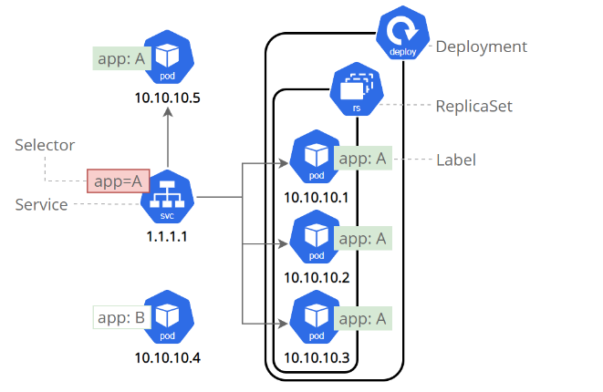
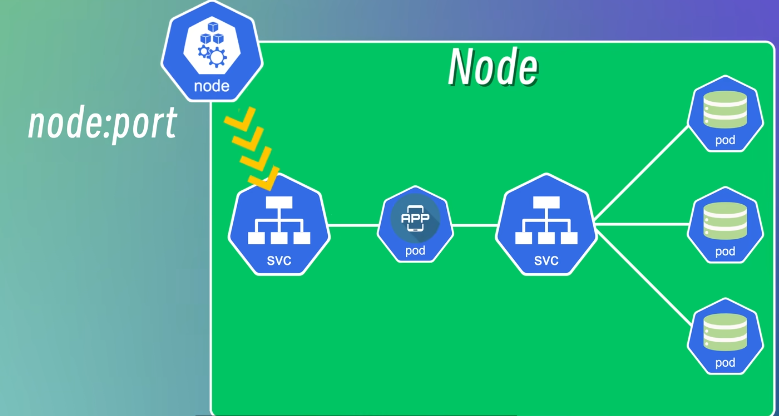

minikube

[minikube start | minikube (k8s.io)](https://minikube.sigs.k8s.io/docs/start/)

[你好，Minikube | Kubernetes](https://kubernetes.io/zh-cn/docs/tutorials/hello-minikube/)


安装kubectl,kubeadm,kubelet

[安装 kubeadm | Kubernetes](https://kubernetes.io/zh-cn/docs/setup/production-environment/tools/kubeadm/install-kubeadm/)

```bash
snap install kubectl --classic
snap install kubeadm --classic
snap install kubelet --classic 	 
```

安装kind

[kind – Quick Start (k8s.io)](https://kind.sigs.k8s.io/docs/user/quick-start/#installing-with-go-install)

```bash
snap install go --classic
go install sigs.k8s.io/kind@v0.22.0 # go install通常会将kind二进制文件放在go env GOPATH下的bin目录中
export PATH=$PATH:$(go env GOPATH)/bin
```


## 部署一个应用 kubectl apply

```bash
kubectl version # 查看 kubectl 是否被配置为与你的集群通信
kubectl create deployment kubernetes-bootcamp --image=gcr.io/google-samples/kubernetes-bootcamp:v1 # 创建一个deployment
kubectl get deployments # 查看有哪些ployment
kubectl delete deployments/kubernetes-bootcamp # 删除一个deployment
```

使用kubectl proxy查看应用

```bash
打开另外一个终端 执行kubectl proxy # kubectl proxy 命令可以创建一个代理，将通信转发到集群范围的私有网络。 
通过 curl http://127.0.0.1:8001 可以看到代理端点托管的所有API # 例：curl http://127.0.0.1:8001/version

export POD_NAME=$(kubectl get pods -o go-template --template '{{range .items}}{{.metadata.name}}{{"\n"}}{{end}}') # 设置POD_NAME环境变量
curl http://localhost:8001/api/v1/namespaces/default/pods/$POD_NAME/ # 或者使用 kubectl get pod 获取pod名

kubectl get pods
kubectl describe pods
curl http://localhost:8001/api/v1/namespaces/default/pods/$POD_NAME:8080/proxy/ # 向容器内服务发送请求
kubectl exec -it $POD_NAME -- curl http://localhost:8080
```

kubectl proxy代理的是api-server还是代理的pod?

- `kubectl proxy`命令代理的是 Kubernetes API Server，而不是代理的 Pod。kubectl proxy命令通过创建一个本地的==HTTP服务器==来提供对API Server的访问，该服务器将API请求转发到API Server，并将响应返回给客户端。这意味着kubectl proxy充当了用户和API Server之间的桥梁，用户可以通过kubectl proxy访问API Server上的资源对象，如Pod、Service等。

### 查看pod内容器日志 kubectl logs

```bash
kubectl logs "$POD_NAME"
```

### 在pod内容器执行命令 kubectl exec 

```bash
kubectl exec "$POD_NAME" -- env
```

### 进入pod内容器 kubectl exec -it

```bash
kubectl exec -it "$POD_NAME" -- bash
# 因为容器内运行的是nodejs程序
cat server.js
curl http://localhost:8080 # 向nodejs程序发请求
```


## 创建service暴露pod内部的应用 kubectl expose

### service

service有以下几种类型：

- ClusterIp（默认）：在集群的内部 IP 上公开 Service。这种类型使得 Service 只能从集群内访问。
- NodePort：使用 NAT 在集群中每个选定 Node 的相同端口上公开 Service 。使用`<NodeIP>:<NodePort>` 从集群外部访问 Service。**是 ClusterIP 的超集**。
- LoadBalancer：在当前云中创建一个外部==负载均衡==器（如果支持的话），并为 Service 分配一个固定的外部IP。**是 NodePort 的超集**。
- ExternalName：

service通过 label 和 selector 来匹配一组pod。






```bash
kubectl expose deployment/kubernetes-bootcamp --type="NodePort" --port 8080 # 8080是容器内应用程序的端口号，执行完这条命令会分配一个新的端口号来映射8080
kubectl expose deployment kubernetes-bootcamp --type="NodePort" --port 8080

kubectl get services
kubectl get svc

kubectl describe services/kubernetes-bootcamp # 
export NODE_PORT="$(kubectl get services/kubernetes-bootcamp -o go-template='{{(index .spec.ports 0).nodePort}}')"
echo "NODE_PORT=$NODE_PORT"
curl http://"$(Node-ip):$NODE_PORT" 
curl http://"$(127.0.0.1):$NODE_PORT" 

# 删除一个service
kubectl delete service -l app=kubernetes-bootcamp
```

### label

创建deployment时，会自动创建一个label

```bash
kubectl describe pods -l app=kubernetes-bootcamp
kubectl get pods -l app=kubernetes-bootcamp # 根据标签查询pod
kubectl get services -l app=kubernetes-bootcamp # 根据标签查询service

# 为pod设置一个新的标签
kubectl label pods "$POD_NAME" version=v1
kubectl get pods -l version=v1
```


### 临时映射端口到外部  kubectl port-forward

```bash
NAME             TYPE        CLUSTER-IP      EXTERNAL-IP   PORT(S)    AGE
frontend         ClusterIP   10.97.28.230    <none>        80/TCP     19s
```

把ClusterIp类型的service端口映射到外部8080：

```bash
kubectl port-forward svc/frontend 8080:80
```


## 扩容和缩容 kubectl scale

扩容

```bash
kuctl get rs # 查看副本个数
kubectl scale deployments/kubernetes-bootcamp --replicas=4
# 或者
kubectl edit deployment kubernetes-bootcamp # 编辑deployment的配置文件中的replicas字段

kubectl get pods -o wide # 显示每个pod的ip
kubectl describe deployments/kubernetes-bootcamp
```

缩容

```bash
kubectl scale deployments/kubernetes-bootcamp --replicas=2 
# 或者
kubectl edit deployment kubernetes-bootcamp # 修改replicas
kubectl get pods -o wide # 显示每个pod的ip
kubectl get pods -o wide -l app=kubernetes-bootcamp
```


## 更新应用程序

```bash
kubectl set image deployments/kubernetes-bootcamp kubernetes-bootcamp=jocatalin/kubernetes-bootcamp:v2
# 或者
kubectl apply -f xxx.yaml

kubectl rollout status deployments/kubernetes-bootcamp # 查看更新状态 如：deployment "kubernetes-bootcamp" successfully rolled out
kubectl describe deployments/kubernetes-bootcamp # 查看镜像是否更新为v2
```


## 回滚 kubectl rollout undo

```bash
kubectl set image deployments/kubernetes-bootcamp kubernetes-bootcamp=gcr.io/google-samples/kubernetes-bootcamp:v10 # v10镜像是没有的， 所以pod的状态是ImagePullBackOff，需要回滚。
kubectl rollout undo deployments/kubernetes-bootcamp # 回滚到上个版本。
```


## 清理本地集群 kubectl delete

```bash
kubectl delete services/kubernetes-bootcamp
kubectl delete deployments/kubernetes-bootcamp
```


# 配置文件

```yaml
```


