# 专栏介绍


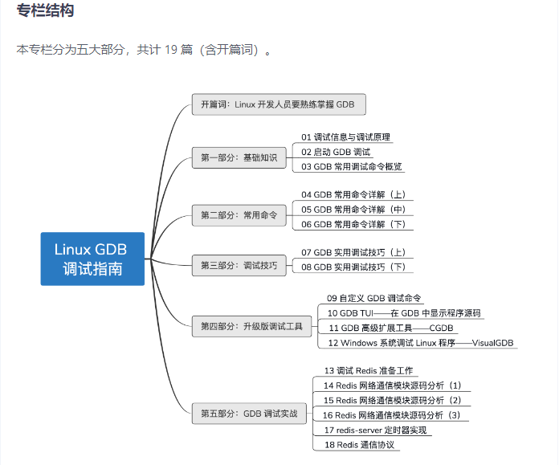


# 开篇词

## 1.Linux C/C++ 开发人员要熟练掌握 GDB 调试

大家好，我是范蠡，目前在某知名互联网旅游公司基础框架业务部技术专家组任开发经理一职。

本系列专栏的主题是 Linux 后台开发的 C/C++ 调试，通俗地说就是 GDB 调试。GDB（GNU Debugger）是类 Unix（如 Linux）操作系统下的一款开源的 C/C++ 程序调试器。最初是在 1988 年由理查德 · 马修 · 斯托曼（Richard Stallman）所撰写，之后以 GNU 通用公共许可证（GNU General Public License，GNU GPL）的许可方式将软件发布，因此 GNU Debugger 是一套自由软件。发布后的 1990 年－1993 年间则由任职于 Cygnus Solutions 公司的约翰 · 吉尔摩（John Gilmore）负责后续的软件维护工作，[点击这里了解其历史详情](https://en.wikipedia.org/wiki/GNU_Debugger)。

### 0.1 为什么要写这个专栏

我从学生时代到进入软件开发这个行业，不知不觉已经十余年了，真是时光荏苒、光阴如梭。这些年，先后在网游公司做过游戏服务器，为上海某交易所做过金融交易系统、在金融证券公司做过股票证券交易系统和即时通讯软件、在音视频直播公司做过直播服务器，各种项目使用的服务器操作系统都是 Linux，开发语言是 C/C++ 。正如从事 Windows C/C++ 开发的一定要熟悉 Visual Studio、从事 Java 开发的要熟悉 Eclipse 或 IntelliJ IDEA、从事 Android 开发的要熟悉 Android Studio、从事 iOS 开发的要熟悉 XCode 一样，从事 Linux C/C++ 开发要熟悉 GDB。

虽然 Linux 系统下读者编写 C/C++ 代码的 IDE 可以自由选择，但是调试生成的 C/C++ 程序一定是直接或者间接使用 **GDB**。可以毫不夸张地说，我所做这些项目的开发和调试包括故障排查都是利用 GDB 完成的，调试是开发流程中一个非常重要的环节，因此**对于从事 Linux C/C++ 的开发人员熟练使用 GDB 调试是一项基本要求**。

当每次有人来面试时，我会问他熟悉哪些开发工具，有些面试者对各种开发工具都不熟悉，我猜想这类应聘者应该是基本“不写代码”或者“不会写代码”的，当然面试结果也可想而知了。“工欲善其事、必先利其器”，作为一名合格的软件开发者，至少得熟悉一种软件开发工具和调试器， 而对于 Linux C/C++ 后台开发，舍 GDB 其谁。

一些初中级开发者可能想通过阅读一些优秀的开源项目来提高自己的编码水平，但是只阅读代码，不容易找到要点，或者误解程序的执行逻辑，最终迷失方向。如果能实际利用调试器去把某个开源项目调试一遍，学习效果才能更好。站在 Linux C/C++ 后台开发的角度来说，**学会了 GDB 调试，就可以对各种 C/C++ 开源项目（如 Redis、Apache、Nginx 等）游刃有余**。简而言之，GDB 调试是学习这些优秀开源项目的一把钥匙。下面举两个基本的例子。

- 例子一，对于 C/C++ 这门存在多态的特性的编程语言，当用一个基类对象类型指向其子类实例，然后调用在子类中被重写（Override）的某个方法，在复杂的代码中我们很难通过肉眼去梳理清楚程序实际的执行脉络，而使用 GDB 调试的 **step** 命令，可以很方便地追踪程序的实际执行流。

- 例子二，使用 GDB 可以快速方便地了解一个程序的整体结构，在分析一个开源软件的整体结构时，可以使用 GDB 先将程序跑起来，然后中断下来，使用 GDB 的 **info thread** 和 **backtrace** 命令分析程序的线程数目和调用上下文。在后面内容中，我们使用 GDB 分析 **redis-server** 网络通信模块的基本结构也是这个思路。

还有一类情况，那就是在实际开发中总会遇到一些非常诡异的程序异常或者问题崩溃的情况。解决这些问题很重要的一个方法就是调试，而对于 Linux C/C++ 服务来说，**熟悉 GDB 各种高级调试技巧非常重要**。举个例子，对于大多数由内存访问冲突导致的程序崩溃，我们都可以使用 GDB 分析产生的 **core 文件**来定位问题原因；另外对于一些出现几率比较低，比如一万次操作可能只会出现一个，我们可以在不修改程序代码的前提下，使用 GDB 条件断点的功能设置触发条件，最终定位和解决问题。

### 0.2 专栏特色

- **本专栏不是人云亦云地介绍 GDB 的各个命令的用法**，而是从 What、How、Why 三个角度来介绍 GDB 调试中的技巧和注意事项；所引用的示例也不是“helloworld”式的 demo，而是以时下最流行的内存数据库 Redis 为示例对象。

- **整个专栏循序渐进**，从基础的调试符号原理，到 GDB 启动调试的方式，再到常用命令详解，接着介绍 GDB 高级调试技巧和一些更强大的 GDB 扩展工具，最后使用 GDB 带领读者分析 Redis 服务器端和客户端的网络通信模块。

- 在这个专栏中读者不仅可以学习到实实在在的**调试技巧和网络编程知识**，也可以学习到如何梳理**开源软件项目结构和源码分析思路**。

### 0.3 专栏介绍

调试是开发过程中一项不可或缺的工作，在 Linux 编程中，通常使用 GDB 来调试 C/C++ 程序，一个合格的 Linux C/C++ 开发人员，必须熟练使用 GDB 调试。互联网上有太多关于 GDB 的教程，基本上是人云亦云，我在 Linux 服务器开发方面从业多年，本专栏将介绍 GDB 调试最常用的知识和技巧，还有一些重点和难点。

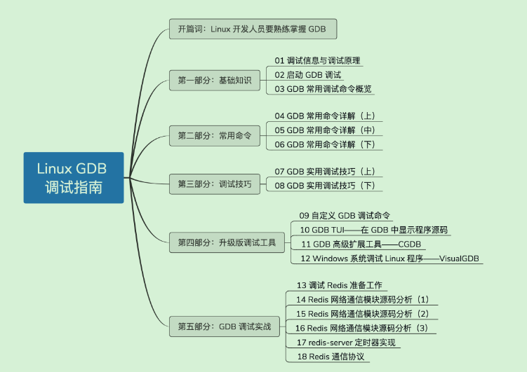

本专栏分为五大部分，共计 19 篇（含开篇词）。

- 第一部分（第01 ~ 03课）主要介绍了 Linux C/C++ 调试的一些基础知识。例如，core 文件的基础知识、GDB 调试启动进程的方法。
- 第二部分（第04 ~ 06课）详细介绍了 GDB 常用调试命令的使用和注意事项，这里不是孤零零地介绍每个命令的使用，而是结合具体的使用实例来说明。

> 如果认真学习完并掌握第一部分和第二部分内容后，然后一边调试一边学习 Linux 下开源的 C/C++ 项目应该就不成问题了。

- 第三部分（第07 ~ 08课）介绍了我在实际工作中开发 Linux 后台 C/C++ 服务时，利用 GDB 调试和排查问题使用的一些高级实用技巧，自成一套体系，如果读者仅对这部分内容感兴趣也可以单独阅读相关内容。
- 第四部分（第09 ~ 12课）介绍了基于 GDB 的一些相关的升级版调试工具，主要内容是 **CGDB** 和 **VisualGDB**。**CGDB** 是基于 GDB 的一款可以在调试过程中以图形化界面显示和跳转源码的开源工具，为很多觉得 GDB 自带的 **list** 显示源码不方便的开发者带来更好的调试体验；而 **VisualGDB** 是 Visual Studio 的一个插件，其基于 SSH 协议和 Samba Server，有了它，读者可以利用 Visual Studio 这一强大的图形化 IDE 远程调试 Linux 机器上的程序，不必再频繁地输入各种 GDB 命令，这也为广大 Windows C/C++ 开发者想学习 Linux C/C++ 开发带来很大的方便。
- 第五部分（第13 ~ 18课）的内容是一个**完整、详尽的 GDB 实例教程**，通过 GDB 调试来带领读者学习时下最流行的内存数据库 Redis 的网络通信模块代码。学完这部分内容不仅可以进一步熟悉 GDB 调试，同时还可以学习到 Redis 和网络编程相关知识。

在选择哪些程序作为 GDB 调试的教学程序时，着实让我纠结了很久。很多 GDB 教程都是人为的“造”一些实例代码，我感觉这样做有点脱离实际生产。实际项目中的代码与这种“造”出来的代码相差很大，同时程序很难调；不过实际项目中的代码，由于企业单位的保密协议要求，也不方便外传。经过慎重考虑，专栏舍弃了我自己编写的几个实例代码，最终选择带领读者调试 Redis 代码。

### 0.4 专栏寄语

本专栏所讨论的知识和内容都**来源于实际开发**，尽量避免人云亦云和闭门造车，专栏中也详细地给出了每一步的操作步骤。因此，希望广大读者能跟随专栏介绍，在自己的环境中实际演练一遍，这样学习的效果会更好。**当你掌握了 GDB 调试的精髓以后，将有能力进一步研究其他一些优秀的开源 Linux C/C++ 项目（如 Apache、Nginx）**。

最后，预祝大家学习愉快！

# 第一部分: 基础知识

## 2.调试信息与调试原理

Linux 下 C++ 程序开发，即使使用 makefile、cmake 等编译工具，其最终都是调用 gcc 这一编译**工具组**的。这里说的**工具组**，是因为编译 C 程序和 C++ 程序使用的编译工具还是有一点差别的，一般编译 C 程序使用 **gcc**，编译 C++ 程序使用 **g++**。（下面为了叙述方便，除非特别说明，否则不做具体区分是 gcc 还是 g++，统一使用 gcc 这一名词代指。）

本课程中我使用的操作系统是 CentOS 7.0，为了演示方便直接使用的 root 账号演示。如果读者的机器上没有安装 gcc 和 gdb，可以使用 **yum** 命令安装一下。

```bash
# 安装 gcc
yum install gcc
# 安装 g++
yum install gcc-c++
# 安装 gdb
yum install gdb
```

一般要调试某个程序，为了能清晰地看到调试的每一行代码、调用的堆栈信息、变量名和函数名等信息，需要调试程序含有**调试符号**信息。使用 **gcc** 编译程序时，如果加上 **-g** 选项即可在编译后的程序中保留调试符号信息。举个例子，以下命令将生成一个带调试信息的程序 hello_server。

```bash
gcc -g -o hello_server hello_server.c
```

那么如何判断 hello_server 是否带有调试信息呢？我们使用 gdb 来调试一下这个程序，gdb 会显示正确读取到该程序的调试信息，在打开的 Linux Shell 终端输入 **gdb hello_server** 查看显示结果即可：

```bash
[root@localhost testclient]# gdb hello_server
GNU gdb (GDB) Red Hat Enterprise Linux 7.6.1-100.el7_4.1
Copyright (C) 2013 Free Software Foundation, Inc.
License GPLv3+: GNU GPL version 3 or later <http://gnu.org/licenses/gpl.html>
This is free software: you are free to change and redistribute it.
There is NO WARRANTY, to the extent permitted by law. Type "show copying"
and "show warranty" for details.
This GDB was configured as "x86_64-redhat-linux-gnu".
For bug reporting instructions, please see:
<http://www.gnu.org/software/gdb/bugs/>...
Reading symbols from /root/testclient/hello_server...done.
(gdb)
```

gdb 加载成功以后，会显示如下信息：

```bash
Reading symbols from /root/testclient/hello_server...done.
```

即读取符号文件完毕，说明该程序含有调试信息。我们不加 **-g** 选项再试试：

```bash
[root@localhost testclient]# gcc -o hello_server2 hello_server.c
[root@localhost testclient]# gdb hello_server2
GNU gdb (GDB) Red Hat Enterprise Linux 7.6.1-100.el7_4.1
Copyright (C) 2013 Free Software Foundation, Inc.
License GPLv3+: GNU GPL version 3 or later <http://gnu.org/licenses/gpl.html>
This is free software: you are free to change and redistribute it.
There is NO WARRANTY, to the extent permitted by law. Type "show copying"
and "show warranty" for details.
This GDB was configured as "x86_64-redhat-linux-gnu".
For bug reporting instructions, please see:
<http://www.gnu.org/software/gdb/bugs/>...
Reading symbols from /root/testclient/hello_server2...(no debugging symbols found)...done.
(gdb)
```

细心的读者应该看出差别了，不加 **-g** 选项用 gdb 调试生成 hello_server 2 程序时，读取调试符号信息时会收到如下提示：

```bash
Reading symbols from /root/testclient/hello_server2...(no debugging symbols found)...done.
```

顺便提一下，除了不加 -g 选项，也可以使用 Linux 的 strip 命令移除掉某个程序中的调试信息，我们这里对 hello_server 使用 strip 命令试试：

```bash
[root@localhost testclient]# strip hello_server
##使用 strip 命令之前
-rwxr-xr-x. 1 root root 12416 Sep 8 09:45 hello_server
##使用 strip 命令之后
-rwxr-xr-x. 1 root root 6312 Sep 8 09:55 hello_server
```

可以发现，对 hello_server 使用 strip 命令之后，这个程序明显变小了（由 12416 个字节减少为 6312 个字节）。我们通常会在程序测试没问题以后，将其发布到生产环境或者正式环境中，因此生成不带调试符号信息的程序，以减小程序体积或提高程序执行效率。

我们再用 gdb 验证一下这个程序的调试信息确实被移除了：

```bash
[root@localhost testclient]# gdb hello_server
GNU gdb (GDB) Red Hat Enterprise Linux 7.6.1-100.el7_4.1
Copyright (C) 2013 Free Software Foundation, Inc.
License GPLv3+: GNU GPL version 3 or later <http://gnu.org/licenses/gpl.html>
This is free software: you are free to change and redistribute it.
There is NO WARRANTY, to the extent permitted by law. Type "show copying"
and "show warranty" for details.
This GDB was configured as "x86_64-redhat-linux-gnu".
For bug reporting instructions, please see:
<http://www.gnu.org/software/gdb/bugs/>...
Reading symbols from /root/testclient/hello_server...(no debugging symbols found)...done.
(gdb)
```

另外补充两点说明：

- 本课程里虽然以 gcc 为例，但 -g 选项实际上同样也适用于使用 makefile 、cmake 等工具编译生成的 Linux 程序。
- 在实际生成调试程序时，一般不仅要加上 -g 选项，也建议关闭编译器的程序优化选项。编译器的程序优化选项一般有五个级别，从 O0 ~ O4 （ 注意第一个 O0 ，是字母 O 加上数字 0 ）， O0 表示不优化，从 O1 ~ O4 优化级别越来越高，O4 最高。这样做的目的是为了调试的时候，符号文件显示的调试变量等能与源代码完全对应起来。举个例子，假设有以下代码：

```c
  int func()
  {
      int a = 1;
      int b = a + 1;
      int c = a + b;
      return a + b + c;
  }

  int main()
  {
      int a = func();
      printf("%d\n", a);
  }
```

此代码中，由于在 main() 函数中调用了 func() 函数，而 func() 函数值可以在编译期间直接算出来，如果开启了优化选项，在实际调试的时候，这个函数中的局部变量 a 、 b 、c ，被直接的值取而代之（即编译器计算得出的值， a 直接使用 1，b 直接使用 2，c 直接使用 3，不会产生通过 a 计算 b，通过 a、b 计算 c 的指令），甚至连函数 func() 也可能被优化掉。如果出现这种情况，调试显示的代码和实际代码可能就会有差异了，这会给排查问题带来困难。当然，上面说的优化现象是否一定会出现，不同版本的编译器可能会有不同的行为。总之一句话，**建议生成调试文件时关闭编译器优化选项**。

### 小结

本节课主要介绍了 gdb 等工具的安装以及调试符号对于调试的重要性，同时也要注意编译器优化选项对调试正确性的影响。

## 3.启动 GDB 调试

使用 GDB 调试程序一般有三种方式：

- gdb filename
- gdb attach pid
- gdb filename corename
  - gdb启动带参数程序:

    gdb ./redis-cli

    set args -h xxx -p xxx -a xxx  (不用加“”)

    show args

    del args

这也对应着本节课的核心内容：

- 直接调试目标程序
- 附加进程
- 调试 core 文件

接下来我们逐一讲解。

### 直接调试目标程序

在开发阶段或者研究别人的项目时，当编译成功生成目标二进制文件后，可以使用 **gdb filename** 直接启动这个程序的调试，其中 **filename** 是需要启动的调试程序文件名，这种方式是直接使用 GDB 启动一个程序进行调试。注意这里说的**启动一个程序进行调试**其实不严谨，因为实际上只是附加（attach）了一个可执行文件，并没有把程序启动起来；接着需要输入**run** 命令，程序才会真正的运行起来。关于 **run** 命令后面的课程中会详细介绍。上一课的 GDB 调试 hello_server 系列就是使用的这种方式。

假设现在有一个程序叫 **fileserver**，使用 **gdb fileserver** 附加该程序，然后使用 **run** 命令启动该程序。如下图所示：

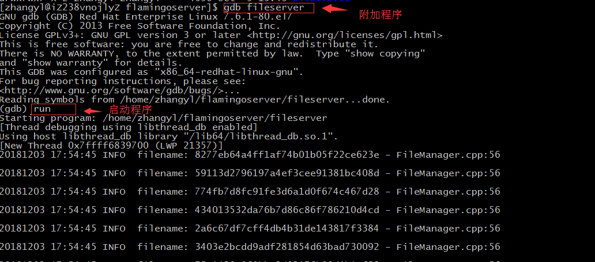

### 附加进程

在某些情况下，一个程序已经启动了，我们想调试这个程序，但是又不想重启这个程序。假设有这样一个场景，我们的聊天测试服务器程序正在运行，运行一段时间之后，发现这个聊天服务器不能接受新的客户端连接了，这时肯定是不能重启程序的，如果重启，当前程序的各种状态信息就丢失了。怎么办呢？可以使用 **gdb attach 进程 ID** 来将 GDB 调试器附加到聊天测试服务器程序上。例如，假设聊天程序叫 chatserver，可以使用 ps 命令获取该进程的 PID，然后使用 gdb attach 就可以调试了，操作如下：

```bash
[zhangyl@iZ238vnojlyZ flamingoserver]$ ps -ef | grep chatserver
zhangyl  21462 21414  0 18:00 pts/2    00:00:00 grep --color=auto chatserver
zhangyl  26621     1  5 Oct10 ?        2-17:54:42 ./chatserver -d
```

实际执行如下图所示：

通过以上代码得到 chatserver 的 PID 为 26621，然后使用 **gdb attach 26621** 把 GDB 附加到 chatserver 进程，操作并输出如下：

```bash
[zhangyl@localhost flamingoserver]$ gdb attach 26621
Attaching to process 26661
Reading symbols from /home/zhangyl/flamingoserver/chatserver...done.
Reading symbols from /usr/lib64/mysql/libmysqlclient.so.18...Reading symbols from /usr/lib64/mysql/libmysqlclient.so.18...(no debugging symbols found)...done.
Reading symbols from /lib64/libpthread.so.0...(no debugging symbols found)...done.
[New LWP 42931]
[New LWP 42930]
[New LWP 42929]
[New LWP 42928]
[New LWP 42927]
[New LWP 42926]
[New LWP 42925]
[New LWP 42924]
[New LWP 42922]
[Thread debugging using libthread_db enabled]
Using host libthread_db library "/lib64/libthread_db.so.1".
Loaded symbols for /lib64/libpthread.so.0
Reading symbols from /lib64/libc.so.6...(no debugging symbols found)...done.
```

为了节约篇幅，上述代码中我删掉了一些无关的信息。当提示 **“Attaching to process 26621”** 时就说明我们已经成功地将 GDB 附加到目标进程了。需要注意的是，程序使用了一些系统库（如 libc.so），由于这是发行版本的 Linux 系统，这些库是没有调试符号的，因而 GDB 会提示找不到这些库的调试符号。因为目的是调试 chatserver，对系统 API 调用的内部实现并不关注，所以这些提示可以不用关注，只要 chatserver 这个文件有调试信息即可。

**当用 gdb attach 上目标进程后，调试器会暂停下来，此时可以使用 continue 命令让程序继续运行，**或者加上相应的断点再继续运行程序（这里提到的 continue 命令不熟悉也没有关系，后续会详细介绍这些命令的使用方法）。

当调试完程序想结束此次调试时，而且不对当前进程 chatserver 有任何影响，也就是说想让这个程序继续运行，可以在 GDB 的命令行界面输入 detach 命令让程序与 GDB 调试器分离，这样 chatserver 就可以继续运行了：

```bash
(gdb) detach
Detaching from program: /home/zhangyl/flamingoserver/chatserver, process 42
```

然后再退出 GDB 就可以了：

```bash
(gdb) quit
[zhangyl@localhost flamingoserver]$
```

### 调试 core 文件

有时候，服务器程序运行一段时间后会突然崩溃，这并不是我们希望看到的，需要解决这个问题。只要程序在崩溃的时候有 core 文件产生，就可以使用这个 core 文件来定位崩溃的原因。当然，Linux 系统默认是不开启程序崩溃产生 core 文件这一机制的，我们可以使用 ulimit -c 命令来查看系统是否开启了这一机制。

> 顺便提一句，ulimit 这个命令不仅仅可以查看 core 文件生成是否开启，还可以查看其他的一些功能，比如系统允许的最大文件描述符的数量等，具体可以使用 ulimit -a 命令来查看，由于这个内容与本课主题无关，这里不再赘述。

```bash
[zhangyl@localhost flamingoserver]$ ulimit -a
core file size          (blocks, -c) 0
data seg size           (kbytes, -d) unlimited
scheduling priority             (-e) 0
file size               (blocks, -f) unlimited
pending signals                 (-i) 15045
max locked memory       (kbytes, -l) 64
max memory size         (kbytes, -m) unlimited
open files                      (-n) 1024
pipe size            (512 bytes, -p) 8
POSIX message queues     (bytes, -q) 819200
real-time priority              (-r) 0
stack size              (kbytes, -s) 8192
cpu time               (seconds, -t) unlimited
max user processes              (-u) 4096
virtual memory          (kbytes, -v) unlimited
file locks                      (-x) unlimited
```

发现 core file size 那一行默认是 0，表示关闭生成 core 文件，可以使用“ulimit 选项名 设置值”来修改。例如，可以将 core 文件生成改成具体某个值（最大允许的字节数），这里我们使用 **ulimit -c unlimited**（**unlimited** 是 **-c** 选项值）直接修改成不限制大小。

```bash
[zhangyl@localhost flamingoserver]$ ulimit -c unlimited
[zhangyl@localhost flamingoserver]$ ulimit -a
core file size          (blocks, -c) unlimited
data seg size           (kbytes, -d) unlimited
scheduling priority             (-e) 0
file size               (blocks, -f) unlimited
pending signals                 (-i) 15045
max locked memory       (kbytes, -l) 64
max memory size         (kbytes, -m) unlimited
open files                      (-n) 1024
pipe size            (512 bytes, -p) 8
POSIX message queues     (bytes, -q) 819200
real-time priority              (-r) 0
stack size              (kbytes, -s) 8192
cpu time               (seconds, -t) unlimited
max user processes              (-u) 4096
virtual memory          (kbytes, -v) unlimited
file locks                      (-x) unlimited
复制
```

> 注意，这个命令容易记错，第一个 ulimit 是 **Linux 命令**， -c 选项后面的 unlimited 是**选项的值**，表示不限制大小，当然也可以改成具体的数值大小。很多初学者在学习这个命令时，总是把 **ulimit 命令**和 **unlimited 取值**搞混淆，如果读者能理解其含义，一般就不会混淆了。

还有一个问题就是，这样修改以后，当我们关闭这个 Linux 会话，设置项的值就会被还原成 0，而服务器程序一般是以后台程序（守护进程）长周期运行，也就是说当前会话虽然被关闭，服务器程序仍然继续在后台运行，这样这个程序在某个时刻崩溃后，是无法产生 core 文件的，这种情形不利于排查问题。因此，我们希望这个选项永久生效，**永久生效的方式是把“ulimit -c unlimited”这一行加到 /etc/profile 文件中去，放到这个文件最后一行即可。**

#### 具体的例子

**生成的 core 文件的默认命名方式是 core.pid，**举个例子，比如某个程序当时运行时其进程 ID 是 16663，那么它崩溃产生的 core 文件的名称就是 core.16663。我们来看一个具体的例子，某次我发现服务器上的 msg_server 崩溃了，产生了一个如下的 core 文件：

```bash
-rw------- 1 root root 10092544 Sep  9 15:14 core.21985
```

就可以通过这个 core.21985 文件来排查崩溃的原因，调试 core 文件的命令是：

```bash
gdb filename corename
```

其中，filename 就是程序名，这里就是 msg_server；corename 是 core.21985，我们输入 gdb msg_server core.21985 来启动调试：

```bash
[root@myaliyun msg_server]# gdb msg_server core.21985
Reading symbols from /root/teamtalkserver/src/msg_server/msg_server...done.
[New LWP 21985]
[Thread debugging using libthread_db enabled]
Using host libthread_db library "/lib64/libthread_db.so.1".
Core was generated by `./msg_server -d'.
Program terminated with signal 11, Segmentation fault.
#0  0x00000000004ceb1f in std::less<CMsgConn*>::operator() (this=0x2283878, __x=@0x7ffca83563a0: 0x2284430, __y=@0x51: <error reading variable>)
    at /usr/include/c++/4.8.2/bits/stl_function.h:235
235           { return __x < __y; }
```

可以看到程序崩溃的地方是在 stl_function.h 的第 235 行，然后通过 **bt** 命令（后续将详细介绍该命令）查看崩溃时的调用堆栈，进一步分析就能找到崩溃的原因。

```bash
(gdb) bt
#0  0x00000000004ceb1f in std::less<CMsgConn*>::operator() (this=0x2283878, __x=@0x7ffca83563a0: 0x2284430, __y=@0x51: <error reading variable>)
    at /usr/include/c++/4.8.2/bits/stl_function.h:235
#1  0x00000000004cdd70 in std::_Rb_tree<CMsgConn*, CMsgConn*, std::_Identity<CMsgConn*>, std::less<CMsgConn*>, std::allocator<CMsgConn*> >::_M_get_insert_unique_pos
    (this=0x2283878, __k=@0x7ffca83563a0: 0x2284430) at /usr/include/c++/4.8.2/bits/stl_tree.h:1324
#2  0x00000000004cd18a in std::_Rb_tree<CMsgConn*, CMsgConn*, std::_Identity<CMsgConn*>, std::less<CMsgConn*>, std::allocator<CMsgConn*> >::_M_insert_unique<CMsgConn* const&> (this=0x2283878, __v=@0x7ffca83563a0: 0x2284430) at /usr/include/c++/4.8.2/bits/stl_tree.h:1377
#3  0x00000000004cc8bd in std::set<CMsgConn*, std::less<CMsgConn*>, std::allocator<CMsgConn*> >::insert (this=0x2283878, __x=@0x7ffca83563a0: 0x2284430)
    at /usr/include/c++/4.8.2/bits/stl_set.h:463
#4  0x00000000004cb011 in CImUser::AddUnValidateMsgConn (this=0x2283820, pMsgConn=0x2284430) at /root/teamtalkserver/src/msg_server/ImUser.h:42
#5  0x00000000004c64ae in CDBServConn::_HandleValidateResponse (this=0x227f6a0, pPdu=0x22860d0) at /root/teamtalkserver/src/msg_server/DBServConn.cpp:319
#6  0x00000000004c5e3d in CDBServConn::HandlePdu (this=0x227f6a0, pPdu=0x22860d0) at /root/teamtalkserver/src/msg_server/DBServConn.cpp:203
#7  0x00000000005022b3 in CImConn::OnRead (this=0x227f6a0) at /root/teamtalkserver/src/base/imconn.cpp:148
#8  0x0000000000501db3 in imconn_callback (callback_data=0x7f4b20 <g_db_server_conn_map>, msg=3 '\003', handle=8, pParam=0x0)
    at /root/teamtalkserver/src/base/imconn.cpp:47
#9  0x0000000000504025 in CBaseSocket::OnRead (this=0x227f820) at /root/teamtalkserver/src/base/BaseSocket.cpp:178
#10 0x0000000000502f8a in CEventDispatch::StartDispatch (this=0x2279990, wait_timeout=100) at /root/teamtalkserver/src/base/EventDispatch.cpp:386
#11 0x00000000004fddbe in netlib_eventloop (wait_timeout=100) at /root/teamtalkserver/src/base/netlib.cpp:160
#12 0x00000000004d18c2 in main (argc=2, argv=0x7ffca8359978) at /root/teamtalkserver/src/msg_server/msg_server.cpp:213
(gdb)
```

堆栈 #4 就不是库代码了，我们可以排查这里的代码，然后找到问题原因。

#### 自定义 core 文件名称

但是细心的读者会发现一个问题：一个正在程序运行时，其 PID 是可以获取到的，但是当程序崩溃后，产生了 core 文件，尤其是多个程序同时崩溃，我们根本没法通过 core 文件名称中的 PID 来区分到底是哪个服务，解决这个问题有两个方法：

- 程序启动时，记录一下自己的 PID

```c
void writePid()
{
      uint32_t curPid = (uint32_t) getpid();
      FILE* f = fopen("xxserver.pid", "w");
      assert(f);
      char szPid[32];
      snprintf(szPid, sizeof(szPid), "%d", curPid);
      fwrite(szPid, strlen(szPid), 1, f);
      fclose(f);
}
```

我们在程序启动时调用上述 **writePID** 函数，将程序当时的 PID 记录到 **xxserver.pid** 文件中去，这样当程序崩溃时，可以从这个文件中得到进程当时运行的 PID，这样就可以与默认的 core 文件名后面的 PID 做匹配了。

- 自定义 core 文件的名称和目录

**`/proc/sys/kernel/core_uses_pid`** 可以控制产生的 core 文件的文件名中是否添加 PID 作为扩展，如果添加则文件内容为 1，否则为 0；

**/proc/sys/kernel/core_pattern** 可以设置格式化的 core 文件保存位置或文件名。修改方式如下：

```bash
echo "/corefile/core-%e-%p-%t" > /proc/sys/kernel/core_pattern
```

各个参数的说明如下：

| 参数名称 | 参数含义（英文）                                          | 参数含义（中文）                               |
| :------: | :-------------------------------------------------------- | :--------------------------------------------- |
|    %p    | insert pid into filename                                  | 添加 pid 到 core 文件名中                      |
|    %u    | insert current uid into filename                          | 添加当前 uid 到 core 文件名中                  |
|    %g    | insert current gid into filename                          | 添加当前 gid 到 core 文件名中                  |
|    %s    | insert signal that caused the coredump into the filename  | 添加导致产生 core 的信号到 core 文件名中       |
|    %t    | insert UNIX time that the coredump occurred into filename | 添加 core 文件生成时间（UNIX）到 core 文件名中 |
|    %h    | insert hostname where the coredump happened into filename | 添加主机名到 core 文件名中                     |
|    %e    | insert coredumping executable name into filename          | 添加程序名到 core 文件名中                     |

假设现在的程序叫 **test**，我们设置该程序崩溃时的 core 文件名如下：

```bash
echo "/root/testcore/core-%e-%p-%t" > /proc/sys/kernel/core_pattern
```

那么最终会在 **/root/testcore/** 目录下生成的 test 的 core 文件名格式如下：

```bash
-rw-------. 1 root root 409600 Jan 14 13:54 core-test-13154-1547445291
```

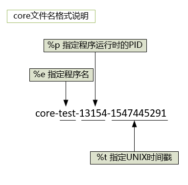

>需要注意的是，**您使用的用户必须对指定 core 文件目录具有写权限，**否则生成时 会因为权限不足而导致无法生成 core 文件。

### 小结

本节课介绍了使用 GDB 调试程序的三种方式，理解并熟练使用这三种方式可以帮助读者在遇到问题时准确地选择调试方法。


## 4.GDB 常用的调试命令概览

先给出一个常用命令的列表，后面会结合具体的例子详细介绍每个命令的用法。

| 命令名称    | 命令缩写 | **命令说明**                                           |
| :---------- | :------- | :----------------------------------------------------- |
| run         | r        | 运行一个程序                                           |
| continue    | c        | 让暂停的程序继续运行                                   |
| next        | n        | 运行到下一行                                           |
| step        | s        | 如果有调用函数，进入调用的函数内部，相当于 step into   |
| until       | u        | 运行到指定行停下来                                     |
| finish      | fi       | 结束当前调用函数，到上一层函数调用处                   |
| return      | return   | 结束当前调用函数并返回指定值，到上一层函数调用处       |
| jump        | j        | 将当前程序执行流跳转到指定行或地址                     |
| print       | p        | 打印变量或寄存器值                                     |
| backtrace   | bt       | 查看当前线程的调用堆栈                                 |
| frame       | f        | 切换到当前调用线程的指定堆栈，具体堆栈通过堆栈序号指定 |
| thread      | thread   | 切换到指定线程                                         |
| break       | b        | 添加断点                                               |
| tbreak      | tb       | 添加临时断点                                           |
| delete      | del      | 删除断点                                               |
| enable      | enable   | 启用某个断点                                           |
| disable     | disable  | 禁用某个断点                                           |
| watch       | watch    | 监视某一个变量或内存地址的值是否发生变化               |
| list        | l        | 显示源码                                               |
| info        | info     | 查看断点 / 线程等信息                                  |
| ptype       | ptype    | 查看变量类型                                           |
| disassemble | dis      | 查看汇编代码                                           |
| set args    |          | 设置程序启动命令行参数                                 |
| show args   |          | 查看设置的命令行参数                                   |

上面只列了一些常见的命令，对于一些不常见的命令（如 file 命令 ）就不列举了，不建议刻意记忆这些命令，因为确实有点多，找几个程序代码实际练习一下很快就能记住，至于要不要采用，大家还是根据自己的学习习惯来。当 GDB 输入命令时，对于一个命令可以缩写成什么样子，只需要遵循如下两个规则即可。

- 一个命令缩写时不能出现多个选择，否则 GDB 就不知道对应哪个命令了。举个例子，输入 th，那么 th 对应的命令有 thread 和 thbreak（上表没有列出），这样 GDB 就不知道使用哪个了，需要更具体的输入，GDB 才能识别。

```
(gdb) th
Ambiguous command "th": thbreak, thread.
```

- GDB 有些命令虽然也对应多个选择，但是有些命令的简写是有规定的，例如，r 就是命令“run”的简写，虽然输入“r”时，你的本意可能是“return”命令。

总之，如果记不清楚，可以直接使用命令全称，每个命令都是很常见的英文单词，通俗易懂不难记忆。

总之，如果记不清楚，可以直接使用命令全称，每个命令都是很常见的英文单词，通俗易懂不难记忆。

后面的课程将逐一介绍上面每个命令的使用方法，注意这里不是照本宣科地列出来，而是介绍一些很有用的调试细节和使用技巧，如果还不熟悉 GDB 调试，建议认真阅读下面的课程。

> 之所以单独列出，一是为了从总体上告诉读者 GDB 调试需要掌握哪些常见的命令，后面的课程会按上面表格中给出的命令逐一来详细讲解；二是给已经熟悉 GDB 部分命令的读者一个导览图，可以跳至不熟悉的命令的相关部分阅读。

### 答疑与交流

为了方便与作者交流与学习，GitChat 编辑团队组织了一个《Linux GDB 调试指南》读者交流群，添加小助手-伽利略微信：「GitChatty6」，回复关键字「218」给小助手-伽利略获取入群资格。


## 5.使用 VS 管理开源项目

本节课将介绍 Redis 项目在 Linux 系统中使用 gdb 去调试，这里的调试环境是 CentOS 7.0，但是通常情况下对于 C/C++ 项目我一般习惯使用 **Visual Studio** 去做项目管理，Visual Studio 提供了强大的 C/C++ 项目开发和管理能力。这里介绍一下如何将这种开源项目整体添加到 Visual Studio 的解决方案中去。

（1）启动 Visual Studio 新建一个空的 Win32 控制台程序（工程建好后，关闭该工程防止接下来的步骤中文件占用导致的无法移动）。

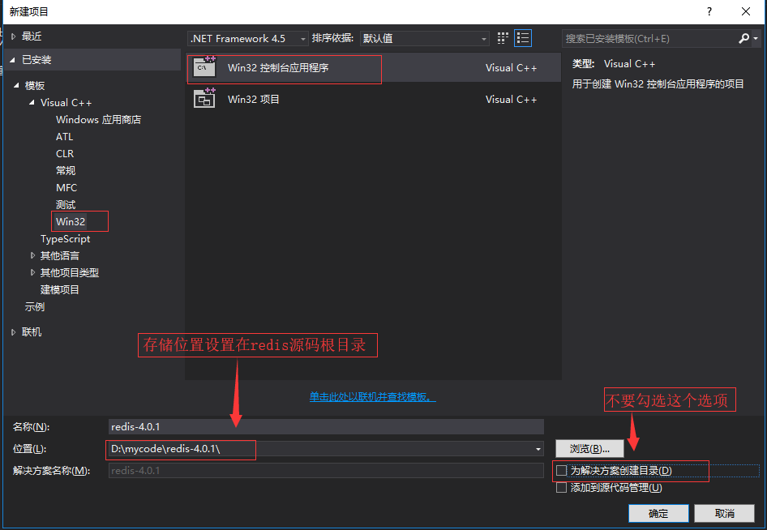

（2）这样会在 redis 源码目录下会根据设置的名称生成一个文件夹（这里是 redis-4.0.1），将该文件夹中所有文件复制到 redis 源码根目录，然后删掉生成的这个文件夹。

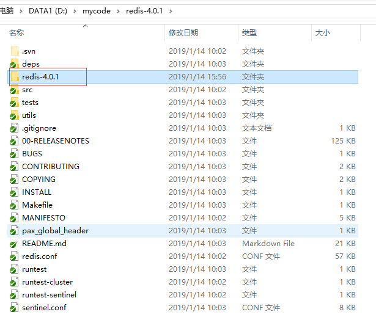

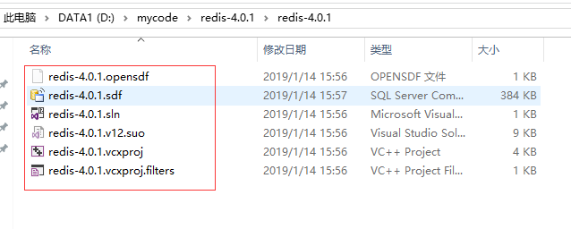

（3）再次用 Visual Studio 打开 redis-4.0.1.sln 文件，然后在**解决方案资源管理器**视图中点击**显示所有文件**按钮并保持该按钮选中（如果找不到**解决方案资源管理器**视图，可以在**“视图”**菜单中打开，快捷键为 Ctrl + Alt + L）。

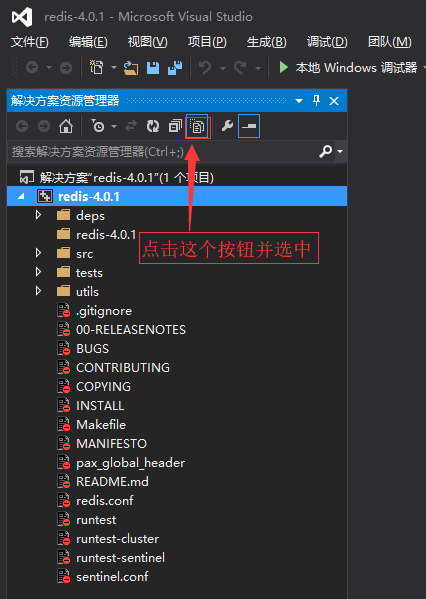

（4）然后选中所有需要添加到解决方案中的文件，右键选择菜单**“包括在项目中”**即可，如果文件比较多，Visual Studio 可能需要一会儿才能完成，为了减少等待时间，读者也可以一批一批的添加。

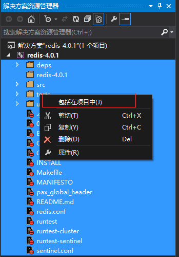

（5）接着选择**“文件”**菜单**“全部保存”**菜单项保存即可（快捷键 **Ctrl + Shift + S** ）。

最终效果如下图所示：

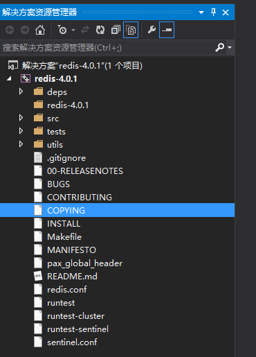

这样我们就能利用 Visual Studio 强大的功能管理和阅读源码了。

> 这里要提醒一下读者：**C/C++ 开源项目中一般会使用各种宏去条件编译一些代码，实际生成的二进制文件中不一定包含这些代码，因此在 Visual Studio 中看到某段代码的行号与实际在 gdb 中调试的代码行号不一定相同，在给某一行代码设置断点时请以 gdb 中 list 命令看到的代码行号为准**。


# 第二部分: 常用命令

## 6.GDB 常用命令详解（上）

本课的核心内容如下：

- run 命令
- continue 命令
- break 命令
- backtrace 与 frame 命令
- info break、enable、disable 和 delete 命令
- list 命令
- print 和 ptype 命令

为了结合实践，这里以调试 Redis 源码为例来介绍每一个命令，先介绍一些常用命令的基础用法，某些命令的高级用法会在后面讲解。

### Redis 源码下载与 debug 版本编译

Redis 的最新源码下载地址可以在 [Redis 官网](https://redis.io/)获得，使用 wget 命令将 Redis 源码文件下载下来：

```bash
[root@localhost gdbtest]# wget http://download.redis.io/releases/redis-4.0.11.tar.gz
--2018-09-08 13:08:41--  http://download.redis.io/releases/redis-4.0.11.tar.gz
Resolving download.redis.io (download.redis.io)... 109.74.203.151
Connecting to download.redis.io (download.redis.io)|109.74.203.151|:80... connected.
HTTP request sent, awaiting response... 200 OK
Length: 1739656 (1.7M) [application/x-gzip]
Saving to: ‘redis-4.0.11.tar.gz’

54% [==================================================================>  ] 940,876     65.6KB/s  eta 9s
```

解压：

```bash
[root@localhost gdbtest]# tar zxvf redis-4.0.11.tar.gz
```

进入生成的 redis-4.0.11 目录使用 **makefile** 命令进行编译。**makefile** 命令是 Linux 程序编译基本的命令，由于本课程的重点是 Linux 调试，如果读者不熟悉 Linux 编译可以通过互联网或相关书籍补充一下相关知识。

**为了方便调试，我们需要生成调试符号并且关闭编译器优化选项，**操作如下：

```bash
[root@localhost gdbtest]# cd redis-4.0.11
[root@localhost redis-4.0.11]# make CFLAGS="-g -O0" -j 4
复制
```

> 注意：由于 redis 是纯 C 项目，使用的编译器是 gcc，因而这里设置编译器的选项时使用的是 CFLAGS 选项；如果项目使用的语言是 C++，那么使用的编译器一般是 g++，相对应的编译器选项是 CXXFLAGS。这点请读者注意区别。
>
> 另外，这里 makefile 使用了 -j 选项，其值是 4，表示开启 4 个进程同时编译，加快编译速度。

编译成功后，会在 src 目录下生成多个可执行程序，其中 redis-server 和 redis-cli 是需要调试的程序。

进入 src 目录，使用 GDB 启动 redis-server 这个程序：

```bash
[root@localhost src]# gdb redis-server
Reading symbols from /root/gdbtest/redis-4.0.11/src/redis-server...done.
```

### run 命令

默认情况下，前面的课程中我们说 **gdb filename** 命令只是附加的一个调试文件，并没有启动这个程序，需要输入 **run** 命令（简写为 r）启动这个程序：

```bash
(gdb) r
Starting program: /root/gdbtest/redis-4.0.11/src/redis-server
[Thread debugging using libthread_db enabled]
Using host libthread_db library "/lib64/libthread_db.so.1".
46455:C 08 Sep 13:43:43.957 # oO0OoO0OoO0Oo Redis is starting oO0OoO0OoO0Oo
46455:C 08 Sep 13:43:43.957 # Redis version=4.0.11, bits=64, commit=00000000, modified=0, pid=46455, just started
46455:C 08 Sep 13:43:43.957 # Warning: no config file specified, using the default config. In order to specify a config file use /root/gdbtest/redis-4.0.11/src/redis-server /path/to/redis.conf
46455:M 08 Sep 13:43:43.957 * Increased maximum number of open files to 10032 (it was originally set to 1024).
[New Thread 0x7ffff07ff700 (LWP 46459)]
[New Thread 0x7fffefffe700 (LWP 46460)]
[New Thread 0x7fffef7fd700 (LWP 46461)]
                _._
           _.-``__ ''-._
      _.-``    `.  `_.  ''-._           Redis 4.0.11 (00000000/0) 64 bit
  .-`` .-```.  ```\/    _.,_ ''-._
 (    '      ,       .-`  | `,    )     Running in standalone mode
 |`-._`-...-` __...-.``-._|'` _.-'|     Port: 6379
 |    `-._   `._    /     _.-'    |     PID: 46455
  `-._    `-._  `-./  _.-'    _.-'
 |`-._`-._    `-.__.-'    _.-'_.-'|
 |    `-._`-._        _.-'_.-'    |     http://redis.io
  `-._    `-._`-.__.-'_.-'    _.-'
 |`-._`-._    `-.__.-'    _.-'_.-'|
 |    `-._`-._        _.-'_.-'    |
  `-._    `-._`-.__.-'_.-'    _.-'
      `-._    `-.__.-'    _.-'
          `-._        _.-'
              `-.__.-'

46455:M 08 Sep 13:43:43.965 # WARNING: The TCP backlog setting of 511 cannot be enforced because /proc/sys/net/core/somaxconn is set to the lower value of 128.
46455:M 08 Sep 13:43:43.965 # Server initialized
46455:M 08 Sep 13:43:43.965 # WARNING overcommit_memory is set to 0! Background save may fail under low memory condition. To fix this issue add 'vm.overcommit_memory = 1' to /etc/sysctl.conf and then reboot or run the command 'sysctl vm.overcommit_memory=1' for this to take effect.
46455:M 08 Sep 13:43:43.965 # WARNING you have Transparent Huge Pages (THP) support enabled in your kernel. This will create latency and memory usage issues with Redis. To fix this issue run the command 'echo never > /sys/kernel/mm/transparent_hugepage/enabled' as root, and add it to your /etc/rc.local in order to retain the setting after a reboot. Redis must be restarted after THP is disabled.
46455:M 08 Sep 13:43:43.965 * Ready to accept connections
```

这就是 redis-server 启动界面，假设程序已经启动，再次输入 run 命令则是重启程序。我们在 GDB 界面按 Ctrl + C 快捷键让 GDB 中断下来，再次输入 r 命令，GDB 会询问我们是否重启程序，输入 yes 确认重启。

```
^C
Program received signal SIGINT, Interrupt.
0x00007ffff73ee923 in epoll_wait () from /lib64/libc.so.6
Missing separate debuginfos, use: debuginfo-install glibc-2.17-196.el7_4.2.x86_64
(gdb) r
The program being debugged has been started already.
Start it from the beginning? (y or n) yes
Starting program: /root/gdbtest/redis-4.0.11/src/redis-server
```

### continue 命令

当 GDB 触发断点或者使用 Ctrl + C 命令中断下来后，想让程序继续运行，只要输入 **continue** 命令即可（简写为 c）。当然，如果 **continue** 命令继续触发断点，GDB 就会再次中断下来。

```bash
^C
Program received signal SIGINT, Interrupt.
0x00007ffff73ee923 in epoll_wait () from /lib64/libc.so.6
(gdb) c
Continuing.
```

### break 命令

**break** 命令（简写为 b）即我们添加断点的命令，可以使用以下方式添加断点：

- break functionname，在函数名为 functionname 的入口处添加一个断点；
- break LineNo，在当前文件行号为 LineNo 处添加一个断点；
- break filename:LineNo，在 filename 文件行号为 LineNo 处添加一个断点。

这三种方式都是我们常用的添加断点的方式。举个例子，对于一般的 Linux 程序来说，main() 函数是程序入口函数，redis-server 也不例外，我们知道了函数的名字，就可以直接在 main() 函数处添加一个断点：

```bash
(gdb) b main
Breakpoint 1 at 0x423450: file server.c, line 3709.
```

添加好了以后，使用 run 命令重启程序，就可以触发这个断点了，GDB 会停在断点处。

```bash
(gdb) r
The program being debugged has been started already.
Start it from the beginning? (y or n) y
Starting program: /root/gdbtest/redis-4.0.11/src/redis-server
[Thread debugging using libthread_db enabled]
Using host libthread_db library "/lib64/libthread_db.so.1".

Breakpoint 1, main (argc=1, argv=0x7fffffffe648) at server.c:3709
3709    int main(int argc, char **argv) {
(gdb)
```

redis-server 默认端口号是 6379 ，我们知道这个端口号肯定是通过操作系统的 socket API bind() 函数创建的，通过文件搜索，找到调用这个函数的文件，其位于 anet.c 441 行。

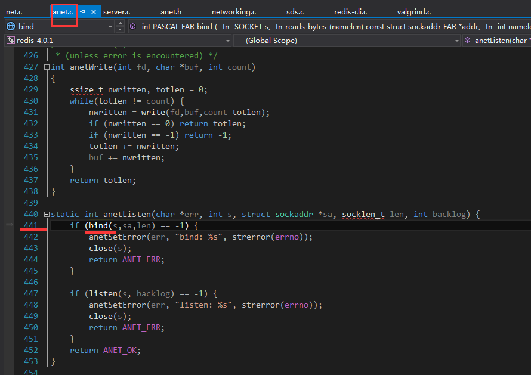

我们使用 **break** 命令在这个地方加一个断点：

```bash
(gdb) b anet.c:441
Breakpoint 3 at 0x426cf0: file anet.c, line 441
```

由于程序绑定端口号是 redis-server 启动时初始化的，为了能触发这个断点，再次使用 run 命令重启下这个程序，GDB 第一次会触发 main() 函数处的断点，输入 continue 命令继续运行，接着触发 anet.c:441 处的断点：

```bash
(gdb) r
The program being debugged has been started already.
Start it from the beginning? (y or n) y
Starting program: /root/gdbtest/redis-4.0.11/src/redis-server
[Thread debugging using libthread_db enabled]
Using host libthread_db library "/lib64/libthread_db.so.1".

Breakpoint 1, main (argc=1, argv=0x7fffffffe648) at server.c:3709
3709    int main(int argc, char **argv) {
(gdb) c
Continuing.
46699:C 08 Sep 15:30:31.403 # oO0OoO0OoO0Oo Redis is starting oO0OoO0OoO0Oo
46699:C 08 Sep 15:30:31.403 # Redis version=4.0.11, bits=64, commit=00000000, modified=0, pid=46699, just started
46699:C 08 Sep 15:30:31.403 # Warning: no config file specified, using the default config. In order to specify a config file use /root/gdbtest/redis-4.0.11/src/redis-server /path/to/redis.conf
46699:M 08 Sep 15:30:31.404 * Increased maximum number of open files to 10032 (it was originally set to 1024).

Breakpoint 3, anetListen (err=0x746bb0 <server+560> "", s=10, sa=0x75edb0, len=28, backlog=511) at anet.c:441
441         if (bind(s,sa,len) == -1) {
(gdb)
```

anet.c:441 处的代码如下：

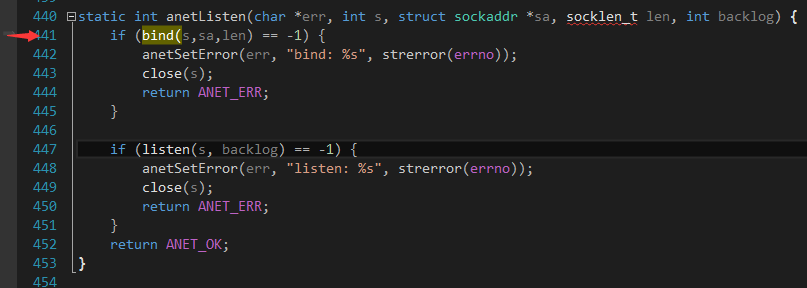

现在断点停在第 441 行，所以当前文件就是 anet.c，可以直接使用“**break 行号**”添加断点。例如，可以在第 444 行、450 行、452 行分别加一个断点，看看这个函数执行完毕后走哪个 return 语句退出，则可以执行：

```bash
440     static int anetListen(char *err, int s, struct sockaddr *sa, socklen_t len, int                               backlog) {
441         if (bind(s,sa,len) == -1) {
442             anetSetError(err, "bind: %s", strerror(errno));
443             close(s);
444             return ANET_ERR;
(gdb) l
445         }
446
447         if (listen(s, backlog) == -1) {
448             anetSetError(err, "listen: %s", strerror(errno));
449             close(s);
450             return ANET_ERR;
451         }
452         return ANET_OK;
453     }
454
(gdb) b 444
Breakpoint 3 at 0x426cf5: file anet.c, line 444.
(gdb) b 450
Breakpoint 4 at 0x426d06: file anet.c, line 450.
(gdb) b 452
Note: breakpoint 4 also set at pc 0x426d06.
Breakpoint 5 at 0x426d06: file anet.c, line 452.
(gdb)
```

添加好这三个断点以后，我们使用 **continue** 命令继续运行程序，发现程序运行到第 452 行中断下来（即触发 Breakpoint 5）：

```bash
(gdb) c
Continuing.

Breakpoint 5, anetListen (err=0x746bb0 <server+560> "", s=10, sa=0x7e34e0, len=16, backlog=511) at anet.c:452
452         return ANET_OK;
```

说明 redis-server 绑定端口号并设置侦听（listen）成功，我们可以再打开一个 SSH 窗口，验证一下，发现 6379 端口确实已经处于侦听状态了：

```bash
[root@localhost src]# lsof -i -Pn | grep redis
redis-ser 46699    root   10u  IPv6 245844      0t0  TCP *:6379 (LISTEN)
```

### backtrace 与 frame 命令

**backtrace** 命令（简写为 bt）用来查看当前调用堆栈。接上，redis-server 现在中断在 anet.c:452 行，可以通过 **backtrace** 命令来查看当前的调用堆栈：

```bash
(gdb) bt
#0  anetListen (err=0x746bb0 <server+560> "", s=10, sa=0x7e34e0, len=16, backlog=511) at anet.c:452
#1  0x0000000000426e35 in _anetTcpServer (err=err@entry=0x746bb0 <server+560> "", port=port@entry=6379, bindaddr=bindaddr@entry=0x0, af=af@entry=10, backlog=511)
    at anet.c:487
#2  0x000000000042793d in anetTcp6Server (err=err@entry=0x746bb0 <server+560> "", port=port@entry=6379, bindaddr=bindaddr@entry=0x0, backlog=511)
    at anet.c:510
#3  0x000000000042b0bf in listenToPort (port=6379, fds=fds@entry=0x746ae4 <server+356>, count=count@entry=0x746b24 <server+420>) at server.c:1728
#4  0x000000000042fa77 in initServer () at server.c:1852
#5  0x0000000000423803 in main (argc=1, argv=0x7fffffffe648) at server.c:3862
(gdb)
```

这里一共有 6 层堆栈，最顶层是 main() 函数，最底层是断点所在的 anetListen() 函数，**堆栈编号分别是 #0 ~ #5 ，**如果想切换到其他堆栈处，可以使用 frame 命令（简写为 f），该命令的使用方法是“**frame 堆栈编号**（编号不加 #）”。在这里依次切换至堆栈顶部，然后再切换回 #0 练习一下：

```bash
(gdb) f 1
#1  0x0000000000426e35 in _anetTcpServer (err=err@entry=0x746bb0 <server+560> "", port=port@entry=6379, bindaddr=bindaddr@entry=0x0, af=af@entry=10, backlog=511)
    at anet.c:487
487             if (anetListen(err,s,p->ai_addr,p->ai_addrlen,backlog) == ANET_ERR) s = ANET_ERR;
(gdb) f 2
#2  0x000000000042793d in anetTcp6Server (err=err@entry=0x746bb0 <server+560> "", port=port@entry=6379, bindaddr=bindaddr@entry=0x0, backlog=511)
    at anet.c:510
510         return _anetTcpServer(err, port, bindaddr, AF_INET6, backlog);
(gdb) f 3
#3  0x000000000042b0bf in listenToPort (port=6379, fds=fds@entry=0x746ae4 <server+356>, count=count@entry=0x746b24 <server+420>) at server.c:1728
1728                fds[*count] = anetTcp6Server(server.neterr,port,NULL,
(gdb) f 4
#4  0x000000000042fa77 in initServer () at server.c:1852
1852            listenToPort(server.port,server.ipfd,&server.ipfd_count) == C_ERR)
(gdb) f 5
#5  0x0000000000423803 in main (argc=1, argv=0x7fffffffe648) at server.c:3862
3862        initServer();
(gdb)
```

通过查看上面的各个堆栈，可以得出这里的调用层级关系，即：

- main() 函数在第 3862 行调用了 initServer() 函数
- initServer() 在第 1852 行调用了 listenToPort() 函数
- listenToPort() 在第 1728 行调用了 anetTcp6Server() 函数
- anetTcp6Server() 在第 510 行调用了 _anetTcpServer() 函数
- _anetTcpServer() 函数在第 487 行调用了 anetListen() 函数
- 当前断点正好位于 anetListen() 函数中

### info break、enable、disable 和 delete 命令

在程序中加了很多断点，而我们想查看加了哪些断点时，可以使用 **info break** 命令（简写为 info b）：

```bash
(gdb) info b
Num     Type           Disp Enb Address            What
1       breakpoint     keep y   0x0000000000423450 in main at server.c:3709
        breakpoint already hit 1 time
2       breakpoint     keep y   0x000000000049c1f0 in _redisContextConnectTcp at net.c:267
3       breakpoint     keep y   0x0000000000426cf0 in anetListen at anet.c:441
        breakpoint already hit 1 time
4       breakpoint     keep y   0x0000000000426d05 in anetListen at anet.c:444
        breakpoint already hit 1 time
5       breakpoint     keep y   0x0000000000426d16 in anetListen at anet.c:450
        breakpoint already hit 1 time
6       breakpoint     keep y   0x0000000000426d16 in anetListen at anet.c:452
        breakpoint already hit 1 time
```

通过上面的内容片段可以知道，目前一共增加了 6 个断点，除了断点 2 以外，其他的断点均被触发一次，其他信息比如每个断点的位置（所在的文件和行号）、内存地址、断点启用和禁用状态信息也一目了然。如果我们想禁用某个断点，使用“**disable 断点编号**”就可以禁用这个断点了，被禁用的断点不会再被触发；同理，被禁用的断点也可以使用“**enable 断点编号**”重新启用。

```bash
(gdb) disable 1
(gdb) info b
Num     Type           Disp Enb Address            What
1       breakpoint     keep n   0x0000000000423450 in main at server.c:3709
        breakpoint already hit 1 time
2       breakpoint     keep y   0x000000000049c1f0 in _redisContextConnectTcp at net.c:267
3       breakpoint     keep y   0x0000000000426cf0 in anetListen at anet.c:441
        breakpoint already hit 1 time
4       breakpoint     keep y   0x0000000000426d05 in anetListen at anet.c:444
        breakpoint already hit 1 time
5       breakpoint     keep y   0x0000000000426d16 in anetListen at anet.c:450
        breakpoint already hit 1 time
6       breakpoint     keep y   0x0000000000426d16 in anetListen at anet.c:452
        breakpoint already hit 1 time
```

使用 **disable 1** 以后，第一个断点的 Enb 一栏的值由 y 变成 n，重启程序也不会再次触发：

```bash
(gdb) r
The program being debugged has been started already.
Start it from the beginning? (y or n) y
Starting program: /root/gdbtest/redis-4.0.11/src/redis-server
[Thread debugging using libthread_db enabled]
Using host libthread_db library "/lib64/libthread_db.so.1".
46795:C 08 Sep 16:15:55.681 # oO0OoO0OoO0Oo Redis is starting oO0OoO0OoO0Oo
46795:C 08 Sep 16:15:55.681 # Redis version=4.0.11, bits=64, commit=00000000, modified=0, pid=46795, just started
46795:C 08 Sep 16:15:55.681 # Warning: no config file specified, using the default config. In order to specify a config file use /root/gdbtest/redis-4.0.11/src/redis-server /path/to/redis.conf
46795:M 08 Sep 16:15:55.682 * Increased maximum number of open files to 10032 (it was originally set to 1024).

Breakpoint 3, anetListen (err=0x746bb0 <server+560> "", s=10, sa=0x75edb0, len=28, backlog=511) at anet.c:441
441         if (bind(s,sa,len) == -1) {
```

如果 **disable** 命令和 **enable** 命令不加断点编号，则分别表示禁用和启用所有断点：

```bash
(gdb) disable
(gdb) info b
Num     Type           Disp Enb Address            What
1       breakpoint     keep n   0x0000000000423450 in main at server.c:3709
2       breakpoint     keep n   0x000000000049c1f0 in _redisContextConnectTcp at net.c:267
3       breakpoint     keep n   0x0000000000426cf0 in anetListen at anet.c:441
        breakpoint already hit 1 time
4       breakpoint     keep n   0x0000000000426d05 in anetListen at anet.c:444
5       breakpoint     keep n   0x0000000000426d16 in anetListen at anet.c:450
6       breakpoint     keep n   0x0000000000426d16 in anetListen at anet.c:452
(gdb) enable
(gdb) info b
Num     Type           Disp Enb Address            What
1       breakpoint     keep y   0x0000000000423450 in main at server.c:3709
2       breakpoint     keep y   0x000000000049c1f0 in _redisContextConnectTcp at net.c:267
3       breakpoint     keep y   0x0000000000426cf0 in anetListen at anet.c:441
        breakpoint already hit 1 time
4       breakpoint     keep y   0x0000000000426d05 in anetListen at anet.c:444
5       breakpoint     keep y   0x0000000000426d16 in anetListen at anet.c:450
6       breakpoint     keep y   0x0000000000426d16 in anetListen at anet.c:452
(gdb)
```

使用“**delete 编号**”可以删除某个断点，如 **delete 2 3** 则表示要删除的断点 2 和断点 3：

```bash
(gdb) delete 2 3
(gdb) info b
Num     Type           Disp Enb Address            What
1       breakpoint     keep y   0x0000000000423450 in main at server.c:3709
4       breakpoint     keep y   0x0000000000426d05 in anetListen at anet.c:444
5       breakpoint     keep y   0x0000000000426d16 in anetListen at anet.c:450
6       breakpoint     keep y   0x0000000000426d16 in anetListen at anet.c:452
复制
```

**同样的道理，如果输入 delete 不加命令号，则表示删除所有断点。**

### list 命令

**list** 命令和后面介绍的 **print** 命令都是 GDB 调试中用到的频率最高的命令，**list** 命令（简写为 l）可以查看当前断点处的代码。使用 **frame** 命令切换到刚才的堆栈 #3 处，然后输入 **list** 命令看下效果：

```bash
(gdb) f 4
#4  0x000000000042fa77 in initServer () at server.c:1852
1852            listenToPort(server.port,server.ipfd,&server.ipfd_count) == C_ERR)
(gdb) l
1847        }
1848        server.db = zmalloc(sizeof(redisDb)*server.dbnum);
1849
1850        /* Open the TCP listening socket for the user commands. */
1851        if (server.port != 0 &&
1852            listenToPort(server.port,server.ipfd,&server.ipfd_count) == C_ERR)
1853            exit(1);
1854
1855        /* Open the listening Unix domain socket. */
1856        if (server.unixsocket != NULL) {
(gdb)
```

断点停在第 1852 行，输入 list 命令以后，会显示第 1852 行前后的 10 行代码，再次输入 list 命令试一下：

```bash
(gdb) l
1857            unlink(server.unixsocket); /* don't care if this fails */
1858            server.sofd = anetUnixServer(server.neterr,server.unixsocket,
1859                server.unixsocketperm, server.tcp_backlog);
1860            if (server.sofd == ANET_ERR) {
1861                serverLog(LL_WARNING, "Opening Unix socket: %s", server.neterr);
1862                exit(1);
1863            }
1864            anetNonBlock(NULL,server.sofd);
1865        }
1866
(gdb) l
1867        /* Abort if there are no listening sockets at all. */
1868        if (server.ipfd_count == 0 && server.sofd < 0) {
1869            serverLog(LL_WARNING, "Configured to not listen anywhere, exiting.");
1870            exit(1);
1871        }
1872
1873        /* Create the Redis databases, and initialize other internal state. */
1874        for (j = 0; j < server.dbnum; j++) {
1875            server.db[j].dict = dictCreate(&dbDictType,NULL);
1876            server.db[j].expires = dictCreate(&keyptrDictType,NULL);
```

代码继续往后显示 10 行，也就是说，第一次输入 **list** 命令会显示断点处前后的代码，继续输入 **list** 指令会以递增行号的形式继续显示剩下的代码行，一直到文件结束为止。当然 list 指令还可以往前和往后显示代码，命令分别是“**list +** （加号）”和“**list -** （减号）”：

```bash
(gdb) list -
1857            unlink(server.unixsocket); /* don't care if this fails */
1858            server.sofd = anetUnixServer(server.neterr,server.unixsocket,
1859                server.unixsocketperm, server.tcp_backlog);
1860            if (server.sofd == ANET_ERR) {
1861                serverLog(LL_WARNING, "Opening Unix socket: %s", server.neterr);
1862                exit(1);
1863            }
1864            anetNonBlock(NULL,server.sofd);
1865        }
1866
(gdb) l -
1847        }
1848        server.db = zmalloc(sizeof(redisDb)*server.dbnum);
1849
1850        /* Open the TCP listening socket for the user commands. */
1851        if (server.port != 0 &&
1852            listenToPort(server.port,server.ipfd,&server.ipfd_count) == C_ERR)
1853            exit(1);
1854
1855        /* Open the listening Unix domain socket. */
1856        if (server.unixsocket != NULL) {
```

**list** 默认显示多少行可以通过修改相关的 GDB 配置，由于我们一般不会修改这个默认显示行数，这里就不再浪费篇幅介绍了。**list** 不仅可以显示当前断点处的代码，也可以显示其他文件某一行的代码，更多的用法可以在 GDB 中输入 **help list** 查看（也可以通过）：

```bash
(gdb) help list
List specified function or line.
With no argument, lists ten more lines after or around previous listing.
"list -" lists the ten lines before a previous ten-line listing.
One argument specifies a line, and ten lines are listed around that line.
Two arguments with comma between specify starting and ending lines to list.
Lines can be specified in these ways:
  LINENUM, to list around that line in current file,
  FILE:LINENUM, to list around that line in that file,
  FUNCTION, to list around beginning of that function,
  FILE:FUNCTION, to distinguish among like-named static functions.
  *ADDRESS, to list around the line containing that address.
With two args if one is empty it stands for ten lines away from the other arg.
```

上面的帮助信息中，介绍了可以使用 **list FILE:LINENUM** 来显示某个文件的某一行处的代码，这里不再演示是因为我觉得实用性不大。使用 GDB 的目的是调试，因此更关心的是断点附近的代码，而不是通过 GDB 阅读代码，GDB 并不是一个好的阅读工具。以我自己为例，调试 Redis 时用 GDB 调试，而阅读代码使用的却是 Visual Studio，如下图所示：

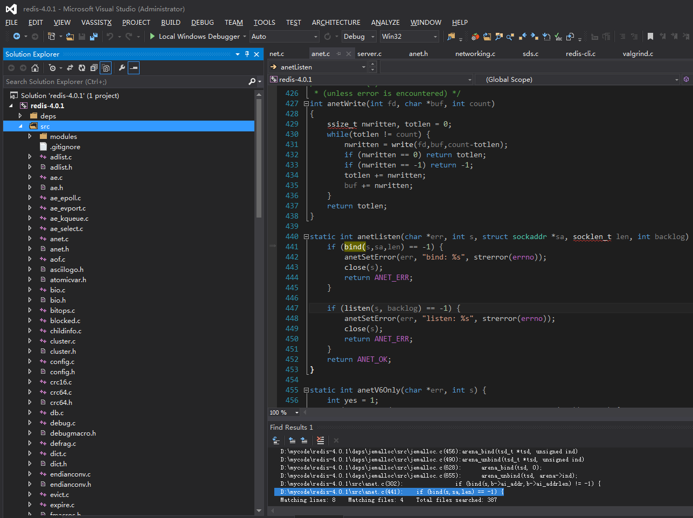

### print 和 ptype 命令

通过 **print** 命令（简写为 p）我们可以在调试过程中方便地查看变量的值，也可以修改当前内存中的变量值。切换当前断点到堆栈 #4 ，然后打印以下三个变量。

```bash
(gdb) bt
#0  anetListen (err=0x746bb0 <server+560> "", s=10, sa=0x7e34e0, len=16, backlog=511) at anet.c:447
#1  0x0000000000426e35 in _anetTcpServer (err=err@entry=0x746bb0 <server+560> "", port=port@entry=6379, bindaddr=bindaddr@entry=0x0, af=af@entry=10, backlog=511)
    at anet.c:487
#2  0x000000000042793d in anetTcp6Server (err=err@entry=0x746bb0 <server+560> "", port=port@entry=6379, bindaddr=bindaddr@entry=0x0, backlog=511)
    at anet.c:510
#3  0x000000000042b0bf in listenToPort (port=6379, fds=fds@entry=0x746ae4 <server+356>, count=count@entry=0x746b24 <server+420>) at server.c:1728
#4  0x000000000042fa77 in initServer () at server.c:1852
#5  0x0000000000423803 in main (argc=1, argv=0x7fffffffe648) at server.c:3862
(gdb) f 4
#4  0x000000000042fa77 in initServer () at server.c:1852
1852            listenToPort(server.port,server.ipfd,&server.ipfd_count) == C_ERR)
(gdb) l
1847        }
1848        server.db = zmalloc(sizeof(redisDb)*server.dbnum);
1849
1850        /* Open the TCP listening socket for the user commands. */
1851        if (server.port != 0 &&
1852            listenToPort(server.port,server.ipfd,&server.ipfd_count) == C_ERR)
1853            exit(1);
1854
1855        /* Open the listening Unix domain socket. */
1856        if (server.unixsocket != NULL) {
(gdb) p server.port
$15 = 6379
(gdb) p server.ipfd
$16 = {0 <repeats 16 times>}
(gdb) p server.ipfd_count
$17 = 0
```

这里使用 **print** 命令分别打印出 server.port 、server.ipfd 、server.ipfd_count 的值，其中 server.ipfd 显示 “{0 \}”，这是 GDB 显示字符串或字符数据特有的方式，当一个字符串变量或者字符数组或者连续的内存值重复若干次，GDB 就会以这种模式来显示以节约空间。

**print** 命令不仅可以显示变量值，也可以显示进行一定运算的表达式计算结果值，甚至可以显示一些函数的执行结果值。

举个例子，我们可以输入 **p &server.port** 来输出 server.port 的地址值，如果在 C++ 对象中，可以通过 p this 来显示当前对象的地址，也可以通过 p *this 来列出当前对象的各个成员变量值，如果有三个变量可以相加（ 假设变量名分别叫 a、b、c ），可以使用 **p a + b + c** 来打印这三个变量的结果值。

假设 func() 是一个可以执行的函数，p func() 命令可以输出该变量的执行结果。举一个最常用的例子，某个时刻，某个系统函数执行失败了，通过系统变量 errno 得到一个错误码，则可以使用 p strerror(errno) 将这个错误码对应的文字信息打印出来，这样就不用费劲地去 man 手册上查找这个错误码对应的错误含义了。

**print 命令不仅可以输出表达式结果，同时也可以修改变量的值，**我们尝试将上文中的端口号从 6379 改成 6400 试试：

```bash
(gdb) p server.port=6400
$24 = 6400
(gdb) p server.port
$25 = 6400
(gdb)
```

当然，一个变量值修改后能否起作用要看这个变量的具体位置和作用，举个例子，对于表达式 int a = b / c ; 如果将 c 修改成 0 ，那么程序就会产生除零异常。再例如，对于如下代码：

```c
int j = 100;
for (int i = 0; i < j; ++i) {
    printf("i = %d\n", i);
}
```

如果在循环的过程中，利用 **print** 命令将 j 的大小由 100 改成 1000 ，那么这个循环将输出 i 的值 1000 次。

总结起来，利用 **print** 命令，我们不仅可以查看程序运行过程中的各个变量的状态值，也可以通过临时修改变量的值来控制程序的行为。

GDB 还有另外一个命令叫 **ptype** ，顾名思义，其含义是“print type”，就是输出一个变量的类型。例如，我们试着输出 Redis 堆栈 #4 的变量 server 和变量 server.port 的类型：

```c
(gdb) ptype server
type = struct redisServer {
    pid_t pid;
    char *configfile;
    char *executable;
    char **exec_argv;
    int hz;
    redisDb *db;
    ...省略部分字段...
(gdb) ptype server.port
type = int
```

可以看到，对于一个复合数据类型的变量，ptype 不仅列出了这个变量的类型（ 这里是一个名叫 redisServer 的结构体），而且详细地列出了每个成员变量的字段名，有了这个功能，我们在调试时就不用刻意去代码文件中查看某个变量的类型定义了。

### 小结

本节课介绍了 **run**、**continue**、**break**、**backtrace**、**frame**、**info break**、**list**、**print** 和 **ptype** 等命令，这些都是 GDB 调试过程中非常常用的命令，尤其是一些复合命令（如 **info**、**break**）是调试多线程程序的核心命令，请读者务必掌握。

## 7.GDB 常用命令详解（中）

本课的核心内容：

- info 和 thread 命令
- next、step、until、finish、return 和 jump 命令

### info 和 thread 命令

在前面使用 **info break** 命令查看当前断点时介绍过，info 命令是一个复合指令，还可以用来查看当前进程的所有线程运行情况。下面以 redis-server 进程为例来演示一下，使用 delete 命令删掉所有断点，然后使用 run 命令重启一下 redis-server，等程序正常启动后，我们按快捷键 Ctrl+C 中断程序，然后使用 info thread 命令来查看当前进程有哪些线程，分别中断在何处：

```c
(gdb) delete
Delete all breakpoints? (y or n) y
(gdb) r
The program being debugged has been started already.
Start it from the beginning? (y or n) y
Starting program: /root/gdbtest/redis-4.0.11/src/redis-server
[Thread debugging using libthread_db enabled]
...省略部分无关内容...
53062:M 10 Sep 17:11:10.810 * Ready to accept connections
^C
Program received signal SIGINT, Interrupt.
0x00007ffff73ee923 in epoll_wait () from /lib64/libc.so.6
(gdb) info thread
  Id   Target Id         Frame
  4    Thread 0x7fffef7fd700 (LWP 53065) "redis-server" 0x00007ffff76c4945 in pthread_cond_wait@@GLIBC_2.3.2 () from /lib64/libpthread.so.0
  3    Thread 0x7fffefffe700 (LWP 53064) "redis-server" 0x00007ffff76c4945 in pthread_cond_wait@@GLIBC_2.3.2 () from /lib64/libpthread.so.0
  2    Thread 0x7ffff07ff700 (LWP 53063) "redis-server" 0x00007ffff76c4945 in pthread_cond_wait@@GLIBC_2.3.2 () from /lib64/libpthread.so.0
* 1    Thread 0x7ffff7fec780 (LWP 53062) "redis-server" 0x00007ffff73ee923 in epoll_wait () from /lib64/libc.so.6
```

通过 **info thread** 的输出可以知道 redis-server 正常启动后，一共产生了 4 个线程，包括一个主线程和三个工作线程，线程编号（Id 那一列）分别是 4、3、2、1。三个工作线程（2、3、4）分别阻塞在 Linux API pthread_cond_wait 处，而主线程（1）阻塞在 epoll_wait 处。

> **注意**：虽然第一栏的名称叫 Id，但第一栏的数值不是线程的 Id，第三栏括号里的内容（如 LWP 53065）中，53065 这样的数值才是当前线程真正的 Id。那 LWP 是什么意思呢？在早期的 Linux 系统的内核里面，其实不存在真正的线程实现，当时所有的线程都是用进程来实现的，**这些模拟线程的进程被称为 Light Weight Process（轻量级进程），**后来 Linux 系统有了真正的线程实现，这个名字仍然被保留了下来。

读者可能会有疑问：怎么知道线程 1 就是主线程？线程 2、线程 3、线程 4 就是工作线程呢？是不是因为线程 1 前面有个星号（*）？错了，线程编号前面这个星号表示的是当前 GDB 作用于哪个线程，而不是主线程的意思。现在有 4 个线程，也就有 4 个调用堆栈，如果此时输入 **backtrace** 命令查看调用堆栈，由于当前 GDB 作用在线程 1，因此 **backtrace** 命令显示的一定是线程 1 的调用堆栈：

由此可见，堆栈 #4 的 main() 函数也证实了上面的说法，即线程编号为 1 的线程是主线程。


如何切换到其他线程呢？可以通过“thread 线程编号”切换到具体的线程上去。例如，想切换到线程 2 上去，只要输入 **thread 2** 即可，然后输入 **bt** 就能查看这个线程的调用堆栈了：

```c
(gdb) info thread
  Id   Target Id         Frame
  4    Thread 0x7fffef7fd700 (LWP 53065) "redis-server" 0x00007ffff76c4945 in pthread_cond_wait@@GLIBC_2.3.2 () from /lib64/libpthread.so.0
  3    Thread 0x7fffefffe700 (LWP 53064) "redis-server" 0x00007ffff76c4945 in pthread_cond_wait@@GLIBC_2.3.2 () from /lib64/libpthread.so.0
  2    Thread 0x7ffff07ff700 (LWP 53063) "redis-server" 0x00007ffff76c4945 in pthread_cond_wait@@GLIBC_2.3.2 () from /lib64/libpthread.so.0
* 1    Thread 0x7ffff7fec780 (LWP 53062) "redis-server" 0x00007ffff73ee923 in epoll_wait () from /lib64/libc.so.6
(gdb) thread 2
[Switching to thread 2 (Thread 0x7ffff07ff700 (LWP 53063))]
#0  0x00007ffff76c4945 in pthread_cond_wait@@GLIBC_2.3.2 () from /lib64/libpthread.so.0
(gdb) bt
#0  0x00007ffff76c4945 in pthread_cond_wait@@GLIBC_2.3.2 () from /lib64/libpthread.so.0
#1  0x000000000047a91c in bioProcessBackgroundJobs (arg=0x0) at bio.c:176
#2  0x00007ffff76c0e25 in start_thread () from /lib64/libpthread.so.0
#3  0x00007ffff73ee34d in clone () from /lib64/libc.so.6
```

因此利用 **info thread** 命令就可以调试多线程程序，当然用 GDB 调试多线程程序还有一个很麻烦的问题，我们将在后面的 GDB 高级调试技巧中介绍。请注意，当把 GDB 当前作用的线程切换到线程 2 上之后，线程 2 前面就被加上了星号：

```c
(gdb) info thread
  Id   Target Id         Frame
  4    Thread 0x7fffef7fd700 (LWP 53065) "redis-server" 0x00007ffff76c4945 in pthread_cond_wait@@GLIBC_2.3.2 () from /lib64/libpthread.so.0
  3    Thread 0x7fffefffe700 (LWP 53064) "redis-server" 0x00007ffff76c4945 in pthread_cond_wait@@GLIBC_2.3.2 () from /lib64/libpthread.so.0
* 2    Thread 0x7ffff07ff700 (LWP 53063) "redis-server" 0x00007ffff76c4945 in pthread_cond_wait@@GLIBC_2.3.2 () from /lib64/libpthread.so.0
  1    Thread 0x7ffff7fec780 (LWP 53062) "redis-server" 0x00007ffff73ee923 in epoll_wait () from /lib64/libc.so.6
```

**info** 命令还可以用来查看当前函数的参数值，组合命令是 **info args**，我们找个函数值多一点的堆栈函数来试一下：

```bash
(gdb) thread 1
[Switching to thread 1 (Thread 0x7ffff7fec780 (LWP 53062))]
#0  0x00007ffff73ee923 in epoll_wait () from /lib64/libc.so.6
(gdb) bt
#0  0x00007ffff73ee923 in epoll_wait () from /lib64/libc.so.6
#1  0x00000000004265df in aeApiPoll (tvp=0x7fffffffe300, eventLoop=0x7ffff08350a0) at ae_epoll.c:112
#2  aeProcessEvents (eventLoop=eventLoop@entry=0x7ffff08350a0, flags=flags@entry=11) at ae.c:411
#3  0x0000000000426aeb in aeMain (eventLoop=0x7ffff08350a0) at ae.c:501
#4  0x00000000004238ef in main (argc=1, argv=0x7fffffffe648) at server.c:3899
(gdb) f 2
#2  aeProcessEvents (eventLoop=eventLoop@entry=0x7ffff08350a0, flags=flags@entry=11) at ae.c:411
411             numevents = aeApiPoll(eventLoop, tvp);
(gdb) info args
eventLoop = 0x7ffff08350a0
flags = 11
(gdb)
```

上述代码片段切回至主线程 1，然后切换到堆栈 #2，堆栈 #2 调用处的函数是 aeProcessEvents() ，一共有两个参数，使用 **info args** 命令可以输出当前两个函数参数的值，参数 eventLoop 是一个指针类型的参数，对于指针类型的参数，GDB 默认会输出该变量的指针地址值，如果想输出该指针指向对象的值，在变量名前面加上 * 解引用即可，这里使用 p *eventLoop 命令：

```bash
(gdb) p *eventLoop
$26 = {maxfd = 11, setsize = 10128, timeEventNextId = 1, lastTime = 1536570672, events = 0x7ffff0871480, fired = 0x7ffff08c2e40, timeEventHead = 0x7ffff0822080,
  stop = 0, apidata = 0x7ffff08704a0, beforesleep = 0x429590 <beforeSleep>, aftersleep = 0x4296d0 <afterSleep>}
```

如果还要查看其成员值，继续使用 **变量名 ->字段名** 即可，在前面学习 print 命令时已经介绍过了，这里不再赘述。

上面介绍的是 **info** 命令最常用的三种方法，更多关于 info 的组合命令在 GDB 中输入 **help info** 就可以查看：

```c
(gdb) help info
Generic command for showing things about the program being debugged.

List of info subcommands:

info address -- Describe where symbol SYM is stored
info all-registers -- List of all registers and their contents
info args -- Argument variables of current stack frame
info auto-load -- Print current status of auto-loaded files
info auto-load-scripts -- Print the list of automatically loaded Python scripts
info auxv -- Display the inferior's auxiliary vector
info bookmarks -- Status of user-settable bookmarks
info breakpoints -- Status of specified breakpoints (all user-settable breakpoints if no argument)
info checkpoints -- IDs of currently known checkpoints
info classes -- All Objective-C classes
info common -- Print out the values contained in a Fortran COMMON block
info copying -- Conditions for redistributing copies of GDB
info dcache -- Print information on the dcache performance
info display -- Expressions to display when program stops
info extensions -- All filename extensions associated with a source language
info files -- Names of targets and files being debugged
info float -- Print the status of the floating point unit
info frame -- All about selected stack frame
info frame-filter -- List all registered Python frame-filters
info functions -- All function names
info handle -- What debugger does when program gets various signals
info inferiors -- IDs of specified inferiors (all inferiors if no argument)
info line -- Core addresses of the code for a source line
info locals -- Local variables of current stack frame
info macro -- Show the definition of MACRO
info macros -- Show the definitions of all macros at LINESPEC
info mem -- Memory region attributes
info os -- Show OS data ARG
info pretty-printer -- GDB command to list all registered pretty-printers
info probes -- Show available static probes
info proc -- Show /proc process information about any running process
info program -- Execution status of the program
info record -- Info record options
info registers -- List of integer registers and their contents
info scope -- List the variables local to a scope
---Type <return> to continue, or q <return> to quit---
info selectors -- All Objective-C selectors
info set -- Show all GDB settings
info sharedlibrary -- Status of loaded shared object libraries
info signals -- What debugger does when program gets various signals
info skip -- Display the status of skips
info source -- Information about the current source file
info sources -- Source files in the program
info stack -- Backtrace of the stack
info static-tracepoint-markers -- List target static tracepoints markers
info symbol -- Describe what symbol is at location ADDR
info target -- Names of targets and files being debugged
info tasks -- Provide information about all known Ada tasks
info terminal -- Print inferior's saved terminal status
info threads -- Display currently known threads
info tracepoints -- Status of specified tracepoints (all tracepoints if no argument)
info tvariables -- Status of trace state variables and their values
info type-printers -- GDB command to list all registered type-printers
info types -- All type names
info variables -- All global and static variable names
info vector -- Print the status of the vector unit
info vtbl -- Show the virtual function table for a C++ object
info warranty -- Various kinds of warranty you do not have
info watchpoints -- Status of specified watchpoints (all watchpoints if no argument)
info win -- List of all displayed windows

Type "help info" followed by info subcommand name for full documentation.
Type "apropos word" to search for commands related to "word".
Command name abbreviations are allowed if unambiguous.
```

### next、step、until、finish、return 和 jump 命令

这几个命令是我们用 GDB 调试程序时最常用的几个控制流命令，因此放在一起介绍。**next** 命令（简写为 n）是让 GDB 调到下一条命令去执行，这里的下一条命令不一定是代码的下一行，而是根据程序逻辑跳转到相应的位置。举个例子：

```c
int a = 0;
if (a == 9)
{
    print("a is equal to 9.\n");
}

int b = 10;
print("b = %d.\n", b);
```

如果当前 GDB 中断在上述代码第 2 行，此时输入 **next** 命令 GDB 将调到第 7 行，因为这里的 if 条件并不满足。

**这里有一个小技巧，在 GDB 命令行界面如果直接按下回车键，默认是将最近一条命令重新执行一遍**，因此，当使用 **next** 命令单步调试时，不必反复输入 **n** 命令，直接回车就可以了。

```c
3704    int main(int argc, char **argv) {
(gdb) n
3736        spt_init(argc, argv);
(gdb) n
3738        setlocale(LC_COLLATE,"");
(gdb) n
3739        zmalloc_set_oom_handler(redisOutOfMemoryHandler);
(gdb) n
3740        srand(time(NULL)^getpid());
(gdb) n
3752        server.exec_argv = zmalloc(sizeof(char*)*(argc+1));
(gdb) n
3740        srand(time(NULL)^getpid());
(gdb) n
3741        gettimeofday(&tv,NULL);
(gdb) n
3752        server.exec_argv = zmalloc(sizeof(char*)*(argc+1));
(gdb)
```

上面的执行过程等价于输入第一个 **n** 后直接回车：

```c
(gdb) n
3736        spt_init(argc, argv);
(gdb)
3738        setlocale(LC_COLLATE,"");
(gdb)
3739        zmalloc_set_oom_handler(redisOutOfMemoryHandler);
(gdb)
3740        srand(time(NULL)^getpid());
(gdb)
3752        server.exec_argv = zmalloc(sizeof(char*)*(argc+1));
(gdb)
```

**next** 命令用调试的术语叫“单步步过”（step over），即遇到函数调用直接跳过，不进入函数体内部。而下面的 **step** 命令（简写为 **s**）就是“单步步入”（step into），顾名思义，就是遇到函数调用，进入函数内部。举个例子，在 redis-server 的 main() 函数中有个叫 spt_init(argc, argv) 的函数调用，当我们停在这一行时，输入 s 将进入这个函数内部。

```c
//为了说明问题本身，除去不相关的干扰，代码有删减
int main(int argc, char **argv) {
    struct timeval tv;
    int j;
    /* We need to initialize our libraries, and the server configuration. */
    spt_init(argc, argv);
    setlocale(LC_COLLATE,"");
    zmalloc_set_oom_handler(redisOutOfMemoryHandler);
    srand(time(NULL)^getpid());
    gettimeofday(&tv,NULL);
    char hashseed[16];
    getRandomHexChars(hashseed,sizeof(hashseed));
    dictSetHashFunctionSeed((uint8_t*)hashseed);
    server.sentinel_mode = checkForSentinelMode(argc,argv);
    initServerConfig();
    moduleInitModulesSystem();
    //省略部分无关代码...
 }
```

演示一下，先使用 **b main** 命令在 main() 处加一个断点，然后使用 r 命令重新跑一下程序，会触发刚才加在 main() 函数处的断点，然后使用 **n** 命令让程序走到 spt_init(argc, argv) 函数调用处，再输入 **s** 命令就可以进入该函数了：

```c
(gdb) b main
Breakpoint 3 at 0x423450: file server.c, line 3704.
(gdb) r
The program being debugged has been started already.
Start it from the beginning? (y or n) y
Starting program: /root/redis-4.0.9/src/redis-server
[Thread debugging using libthread_db enabled]
Using host libthread_db library "/lib64/libthread_db.so.1".

Breakpoint 3, main (argc=1, argv=0x7fffffffe588) at server.c:3704
3704    int main(int argc, char **argv) {
(gdb) n
3736        spt_init(argc, argv);
(gdb) s
spt_init (argc=argc@entry=1, argv=argv@entry=0x7fffffffe588) at setproctitle.c:152
152     void spt_init(int argc, char *argv[]) {
(gdb) l
147
148             return 0;
149     } /* spt_copyargs() */
150
151
152     void spt_init(int argc, char *argv[]) {
153             char **envp = environ;
154             char *base, *end, *nul, *tmp;
155             int i, error;
156
(gdb)
```

说到 **step** 命令，还有一个需要注意的地方，就是当函数的参数也是函数调用时，我们使用 **step** 命令会依次进入各个函数，那么顺序是什么呢？举个例子，看下面这段代码：

```c
1  int func1(int a, int b)
2  {
3     int c = a + b;
4     c += 2;
5     return c;
6  }
7
8  int func2(int p, int q)
9  {
10    int t = q * p;
11       return t * t;
12 }
13
14 int func3(int m, int n)
15 {
16    return m + n;
17 }
18
19 int main()
20 {
21    int c;
22    c = func3(func1(1, 2),  func2(8, 9));
23    printf("c=%d.\n", c);
24    return 0;
25 }
```

上述代码，程序入口是 main() 函数，在第 22 行 func3 使用 func1 和 func2 的返回值作为自己的参数，在第 22 行输入 **step** 命令，会先进入哪个函数呢？这里就需要补充一个知识点了—— **函数调用方式，我们常用的函数调用方式有 _cdecl 和 _stdcall，C++ 非静态成员函数的调用方式是 _thiscall 。在这些调用方式中，函数参数的传递本质上是函数参数的入栈过程，而这三种调用方式参数的入栈顺序都是从右往左的，因此，这段代码中并没有显式标明函数的调用方式，采用默认 _cdecl 方式。**

当我们在第 22 行代码处输入 **step** 先进入的是 func2() ，当从 func2() 返回时再次输入 **step** 命令会接着进入 func1() ，当从 func1 返回时，此时两个参数已经计算出来了，这时候会最终进入 func3() 。理解这一点，在遇到这样的代码时，才能根据需要进入我们想要的函数中去调试。

实际调试时，我们在某个函数中调试一段时间后，不需要再一步步执行到函数返回处，希望直接执行完当前函数并回到上一层调用处，就可以使用 **finish** 命令。与 **finish** 命令类似的还有 **return** 命令，**return** 命令的作用是结束执行当前函数，还可以指定该函数的返回值。

这里需要注意一下二者的区别：**finish** 命令会执行函数到正常退出该函数；而 **return** 命令是立即结束执行当前函数并返回，$\color{red} {也就是说，如果当前函数还有剩余的代码未执行完毕，也不会执行了。}$我们用一个例子来验证一下：

```c
1  #include <stdio.h>
2
3  int func()
4  {
5     int a = 9;
6     printf("a=%d.\n", a);
7
8     int b = 8;
9     printf("b=%d.\n", b);
10    return a + b;
11 }
12
13 int main()
14 {
15    int c = func();
16    printf("c=%d.\n", c);
17
18    return 0;
19 }
```

在 main() 函数处加一个断点，然后运行程序，在第 15 行使用 **step** 命令进入 func() 函数，接着单步到代码第 8 行，直接输入 **return** 命令，这样 func() 函数剩余的代码就不会继续执行了，因此 printf("b=%d.\n", b); 这一行就没有输出。同时由于我们没有在 **return** 命令中指定这个函数的返回值，因而最终在 main() 函数中得到的变量 c 的值是一个脏数据。这也就验证了我们上面说的：**return** 命令在当前位置立即结束当前函数的执行，并返回到上一层调用。

```c
(gdb) b main
Breakpoint 1 at 0x40057d: file test.c, line 15.
(gdb) r
Starting program: /root/testreturn/test

Breakpoint 1, main () at test.c:15
15          int c = func();
Missing separate debuginfos, use: debuginfo-install glibc-2.17-196.el7_4.2.x86_64
(gdb) s
func () at test.c:5
5           int a = 9;
(gdb) n
6           printf("a=%d.\n", a);
(gdb) n
a=9.
8           int b = 8;
(gdb) return
Make func return now? (y or n) y
#0  0x0000000000400587 in main () at test.c:15
15          int c = func();
(gdb) n
16          printf("c=%d.\n", c);
(gdb) n
c=-134250496.
18          return 0;
(gdb)
```

再次用 **return** 命令指定一个值试一下，这样得到变量 c 的值应该就是我们指定的值。

```c
(gdb) r
The program being debugged has been started already.
Start it from the beginning? (y or n) y
Starting program: /root/testreturn/test

Breakpoint 1, main () at test.c:15
15          int c = func();
(gdb) s
func () at test.c:5
5           int a = 9;
(gdb) n
6           printf("a=%d.\n", a);
(gdb) n
a=9.
8           int b = 8;
(gdb) return 9999
Make func return now? (y or n) y
#0  0x0000000000400587 in main () at test.c:15
15          int c = func();
(gdb) n
16          printf("c=%d.\n", c);
(gdb) n
c=9999.
18          return 0;
(gdb) p c
$1 = 9999
(gdb)
```

仔细观察上述代码应该会发现，用 **return** 命令修改了函数的返回值，当使用 **print** 命令打印 c 值的时候，c 值也确实被修改成了 9999。

我们再对比一下使用 **finish** 命令来结束函数执行的结果。

```c
(gdb) r
The program being debugged has been started already.
Start it from the beginning? (y or n) y
Starting program: /root/testreturn/test 

Breakpoint 1, main () at test.c:15
15          int c = func();
(gdb) s
func () at test.c:5
5           int a = 9;
(gdb) n
6           printf("a=%d.\n", a);
(gdb) n
a=9.
8           int b = 8;
(gdb) finish
Run till exit from #0  func () at test.c:8
b=8.
0x0000000000400587 in main () at test.c:15
15          int c = func();
Value returned is $3 = 17
(gdb) n
16          printf("c=%d.\n", c);
(gdb) n
c=17.
18          return 0;
(gdb)
复制
```

结果和我们预期的一样，**finish** 正常结束函数，剩余的代码也会被正常执行。因此 c 的值是 17。

实际调试时，还有一个 **until** 命令（简写为 **u**）可以指定程序运行到某一行停下来，还是以 redis-server 的代码为例：

```c
1812    void initServer(void) {
1813        int j;
1814
1815        signal(SIGHUP, SIG_IGN);
1816        signal(SIGPIPE, SIG_IGN);
1817        setupSignalHandlers();
1818
1819        if (server.syslog_enabled) {
1820            openlog(server.syslog_ident, LOG_PID | LOG_NDELAY | LOG_NOWAIT,
1821                server.syslog_facility);
1822        }
1823
1824        server.pid = getpid();
1825        server.current_client = NULL;
1826        server.clients = listCreate();
1827        server.clients_to_close = listCreate();
1828        server.slaves = listCreate();
1829        server.monitors = listCreate();
1830        server.clients_pending_write = listCreate();
1831        server.slaveseldb = -1; /* Force to emit the first SELECT command. */
1832        server.unblocked_clients = listCreate();
1833        server.ready_keys = listCreate();
1834        server.clients_waiting_acks = listCreate();
1835        server.get_ack_from_slaves = 0;
1836        server.clients_paused = 0;
1837        server.system_memory_size = zmalloc_get_memory_size();
1838
1839        createSharedObjects();
1840        adjustOpenFilesLimit();
1841        server.el = aeCreateEventLoop(server.maxclients+CONFIG_FDSET_INCR);
1842        if (server.el == NULL) {
1843            serverLog(LL_WARNING,
1844                "Failed creating the event loop. Error message: '%s'",
1845                strerror(errno));
1846            exit(1);
1847        }
```

这是 redis-server 代码中 initServer() 函数的一个代码片段，位于文件 server.c 中，当停在第 1813 行，想直接跳到第 1839 行，可以直接输入 **u 1839**，这样就能快速执行完中间的代码。当然，也可以先在第 1839 行加一个断点，然后使用 **continue** 命令运行到这一行，但是使用 **until** 命令会更简便。

```c
(gdb) r
The program being debugged has been started already.
Start it from the beginning? (y or n) y
Starting program: /root/redis-4.0.9/src/redis-server
[Thread debugging using libthread_db enabled]
Using host libthread_db library "/lib64/libthread_db.so.1".

Breakpoint 3, main (argc=1, argv=0x7fffffffe588) at server.c:3704
3704    int main(int argc, char **argv) {
(gdb) c
Continuing.
21574:C 14 Sep 06:42:36.978 # oO0OoO0OoO0Oo Redis is starting oO0OoO0OoO0Oo
21574:C 14 Sep 06:42:36.978 # Redis version=4.0.9, bits=64, commit=00000000, modified=0, pid=21574, just started
21574:C 14 Sep 06:42:36.979 # Warning: no config file specified, using the default config. In order to specify a config file use /root/redis-4.0.9/src/redis-server /path/to/redis.conf

Breakpoint 4, initServer () at server.c:1812
1812    void initServer(void) {
(gdb) n
1815        signal(SIGHUP, SIG_IGN);
(gdb) u 1839
initServer () at server.c:1839
1839        createSharedObjects();
(gdb)
```

**jump** 命令基本用法是：

```
jump <location>
```

**location** 可以是程序的**行号或者函数的地址，**jump 会让程序执行流跳转到指定位置执行，当然其行为也是不可控制的，例如您跳过了某个对象的初始化代码，直接执行操作该对象的代码，那么可能会导致程序崩溃或其他意外行为。**jump** 命令可以简写成 **j**，但是不可以简写成 **jmp**，其使用有一个注意事项，即如果 **jump** 跳转到的位置后续没有断点，那么 GDB 会执行完跳转处的代码会继续执行。举个例子：

```c
1 int somefunc()
2 {
3   //代码A
4   //代码B
5   //代码C
6   //代码D
7   //代码E
8   //代码F
9 }
```

假设我们的断点初始位置在行号 **3** 处（代码 A），这个时候我们使用 **jump 6**，那么程序会跳过代码 B 和 C 的执行，执行完代码 D（ **跳转点**），程序并不会停在代码 **6** 处，而是继续执行后续代码，因此如果我们想查看执行跳转处的代码后的结果，需要在行号 **6**、**7** 或 **8** 处设置断点。

**jump** 命令除了跳过一些代码的执行外，还有一个妙用就是可以执行一些我们想要执行的代码，而这些代码在正常的逻辑下可能并不会执行（当然可能也因此会产生一些意外的结果，这需要读者自行斟酌使用）。举个例子，假设现在有如下代码：

```c
1  #include <stdio.h>
2  int main()
3  {
4    int a = 0;
5    if (a != 0)
6    {
7      printf("if condition\n");
8    }
9    else
10   {
11     printf("else condition\n");
12   }
13
14   return 0;
15 }
```

我们在行号 **4** 、**14** 处设置一个断点，当触发行号 **4** 处的断点后，正常情况下程序执行流会走 else 分支，我们可以使用 **jump 7** 强行让程序执行 if 分支，接着 GDB 会因触发行号 **14** 处的断点而停下来，此时我们接着执行 **jump 11**，程序会将 else 分支中的代码重新执行一遍。整个操作过程如下：

```bash
[root@localhost testcore]# gdb test
Reading symbols from /root/testcore/test...done.
(gdb) b main
Breakpoint 1 at 0x400545: file main.cpp, line 4.
(gdb) b 14
Breakpoint 2 at 0x400568: file main.cpp, line 14.
(gdb) r
Starting program: /root/testcore/test

Breakpoint 1, main () at main.cpp:4
4       int a = 0;
Missing separate debuginfos, use: debuginfo-install glibc-2.17-260.el7.x86_64 libgcc-4.8.5-36.el7.x86_64 libstdc++-4.8.5-36.el7.x86_64
(gdb) jump 7
Continuing at 0x400552.
if condition

Breakpoint 2, main () at main.cpp:14
14       return 0;
(gdb) jump 11
Continuing at 0x40055e.
else condition

Breakpoint 2, main () at main.cpp:14
14       return 0;
(gdb) c
Continuing.
[Inferior 1 (process 13349) exited normally]
(gdb)
```

**redis-server** 在入口函数 **main** 处调用 **initServer()** ，我们使用 “**b initServer**” 、“**b 2025**”、“**b 2027**”在这个函数入口处、2025 行、2027 行增加三个断点，然后使用 **run** 命令重新运行一下程序，触发第一个断点后，继续输入 **c** 命令继续运行，然后触发 2025 行处的断点，接着输入 **jump 2027** ：

```c
(gdb) b 2025
Breakpoint 5 at 0x42c8e7: file server.c, line 2025.
(gdb) b 2027
Breakpoint 6 at 0x42c8f8: file server.c, line 2027.
(gdb) r
The program being debugged has been started already.
Start it from the beginning? (y or n) n
Program not restarted.
(gdb) b initServer
Note: breakpoint 3 also set at pc 0x42c8b0.
Breakpoint 7 at 0x42c8b0: file server.c, line 2013.
(gdb) r
The program being debugged has been started already.
Start it from the beginning? (y or n) y
Starting program: /root/redis-5.0.3/src/redis-server
[Thread debugging using libthread_db enabled]
Using host libthread_db library "/lib64/libthread_db.so.1".

Breakpoint 1, main (argc=1, argv=0x7fffffffe4e8) at server.c:4003
4003    int main(int argc, char **argv) {
(gdb) c
Continuing.
13374:C 14 Jan 2019 15:12:16.571 # oO0OoO0OoO0Oo Redis is starting oO0OoO0OoO0Oo
13374:C 14 Jan 2019 15:12:16.571 # Redis version=5.0.3, bits=64, commit=00000000, modified=0, pid=13374, just started
13374:C 14 Jan 2019 15:12:16.571 # Warning: no config file specified, using the default config. In order to specify a config file use /root/redis-5.0.3/src/redis-server /path/to/redis.conf

Breakpoint 3, initServer () at server.c:2013
2013    void initServer(void) {
(gdb) c
Continuing.

Breakpoint 5, initServer () at server.c:2025
2025        server.hz = server.config_hz;
(gdb) jump 2027
Continuing at 0x42c8f8.

Breakpoint 6, initServer () at server.c:2027
2027        server.current_client = NULL;
(gdb)
```

程序将 **2026** 行的代码跳过了，2026 行处的代码是获取当前进程 id：

```bash
2026 server.pid = getpid();
```

由于这一行被跳过了，所以 **server.pid** 的值应该是一个无效的值，我们可以使用 **print** 命令将这个值打印出来看一下：

```bash
(gdb) p server.pid
$3 = 0
```

结果确实是 **0** 这个我们初始化的无效值。

> 本质上，**jump** 命令的作用类似于在 Visual Studio 中调试时，**拖鼠标将程序从一个执行处拖到另外一个执行处。****

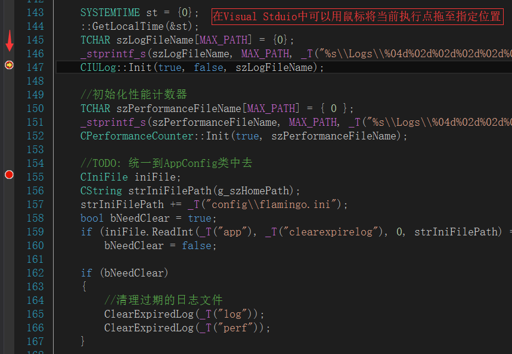

### 小结

本节课介绍了 info thread、next、step、until、finish、 return 和 jump 命令，这些也是 GDB 调试过程中非常常用的命令，请读者务必掌握。

## 8.GDB 常用命令详解（下）

本课的核心内容：

- disassemble 命令
- set args 和 show args 命令
- tbreak 命令
- watch 命令
- display 命令

### disassemble 命令

当进行一些高级调试时，我们可能需要查看某段代码的汇编指令去排查问题，或者是在调试一些没有调试信息的发布版程序时，也只能通过反汇编代码去定位问题，那么 **disassemble** 命令就派上用场了。

```c
initServer () at server.c:1839
1839        createSharedObjects();
(gdb) disassemble
Dump of assembler code for function initServer:
   0x000000000042f450 <+0>:     push   %r12
   0x000000000042f452 <+2>:     mov    $0x1,%esi
   0x000000000042f457 <+7>:     mov    $0x1,%edi
   0x000000000042f45c <+12>:    push   %rbp
   0x000000000042f45d <+13>:    push   %rbx
   0x000000000042f45e <+14>:    callq  0x421eb0 <signal@plt>
   0x000000000042f463 <+19>:    mov    $0x1,%esi
   0x000000000042f468 <+24>:    mov    $0xd,%edi
   0x000000000042f46d <+29>:    callq  0x421eb0 <signal@plt>
   0x000000000042f472 <+34>:    callq  0x42f3a0 <setupSignalHandlers>
   0x000000000042f477 <+39>:    mov    0x316d52(%rip),%r8d        # 0x7461d0 <server+2128>
   0x000000000042f47e <+46>:    test   %r8d,%r8d
   0x000000000042f481 <+49>:    jne    0x42f928 <initServer+1240>
   0x000000000042f487 <+55>:    callq  0x421a50 <getpid@plt>
   0x000000000042f48c <+60>:    movq   $0x0,0x316701(%rip)        # 0x745b98 <server+536>
   0x000000000042f497 <+71>:    mov    %eax,0x3164e3(%rip)        # 0x745980 <server>
   0x000000000042f49d <+77>:    callq  0x423cb0 <listCreate>
   0x000000000042f4a2 <+82>:    mov    %rax,0x3166c7(%rip)        # 0x745b70 <server+496>
   0x000000000042f4a9 <+89>:    callq  0x423cb0 <listCreate>
   0x000000000042f4ae <+94>:    mov    %rax,0x3166c3(%rip)        # 0x745b78 <server+504>
   0x000000000042f4b5 <+101>:   callq  0x423cb0 <listCreate>
   0x000000000042f4ba <+106>:   mov    %rax,0x3166c7(%rip)        # 0x745b88 <server+520>
   0x000000000042f4c1 <+113>:   callq  0x423cb0 <listCreate>
   0x000000000042f4c6 <+118>:   mov    %rax,0x3166c3(%rip)        # 0x745b90 <server+528>
   0x000000000042f4cd <+125>:   callq  0x423cb0 <listCreate>
   0x000000000042f4d2 <+130>:   movl   $0xffffffff,0x316d6c(%rip)        # 0x746248 <server+2248>
   0x000000000042f4dc <+140>:   mov    %rax,0x31669d(%rip)        # 0x745b80 <server+512>
   0x000000000042f4e3 <+147>:   callq  0x423cb0 <listCreate>
   0x000000000042f4e8 <+152>:   mov    %rax,0x316ec9(%rip)        # 0x7463b8 <server+2616>
   0x000000000042f4ef <+159>:   callq  0x423cb0 <listCreate>
   0x000000000042f4f4 <+164>:   mov    %rax,0x316ec5(%rip)        # 0x7463c0 <server+2624>
   0x000000000042f4fb <+171>:   callq  0x423cb0 <listCreate>
   0x000000000042f500 <+176>:   movl   $0x0,0x316e7e(%rip)        # 0x746388 <server+2568>
   0x000000000042f50a <+186>:   mov    %rax,0x316e6f(%rip)        # 0x746380 <server+2560>
   0x000000000042f511 <+193>:   movl   $0x0,0x316685(%rip)        # 0x745ba0 <server+544>
   0x000000000042f51b <+203>:   callq  0x432e90 <zmalloc_get_memory_size>
   0x000000000042f520 <+208>:   mov    %rax,0x316fd9(%rip)        # 0x746500 <server+2944>
=> 0x000000000042f527 <+215>:   callq  0x42a7b0 <createSharedObjects>
```

GDB 默认反汇编为 AT&T 格式的指令，可以通过**show disassembly-flavor ** 查看，如果习惯 intel 汇编格式可以用命令 **set disassembly-flavor intel** 来设置。

```bash
(gdb) set disassembly-flavor intel
(gdb) disassemble
Dump of assembler code for function initServer:
   0x000000000042f450 <+0>:     push   r12
   0x000000000042f452 <+2>:     mov    esi,0x1
   0x000000000042f457 <+7>:     mov    edi,0x1
   0x000000000042f45c <+12>:    push   rbp
   0x000000000042f45d <+13>:    push   rbx
   0x000000000042f45e <+14>:    call   0x421eb0 <signal@plt>
   0x000000000042f463 <+19>:    mov    esi,0x1
   0x000000000042f468 <+24>:    mov    edi,0xd
   0x000000000042f46d <+29>:    call   0x421eb0 <signal@plt>
   0x000000000042f472 <+34>:    call   0x42f3a0 <setupSignalHandlers>
   0x000000000042f477 <+39>:    mov    r8d,DWORD PTR [rip+0x316d52]        # 0x7461d0 <server+2128>
   0x000000000042f47e <+46>:    test   r8d,r8d
   0x000000000042f481 <+49>:    jne    0x42f928 <initServer+1240>
   0x000000000042f487 <+55>:    call   0x421a50 <getpid@plt>
   0x000000000042f48c <+60>:    mov    QWORD PTR [rip+0x316701],0x0        # 0x745b98 <server+536>
   0x000000000042f497 <+71>:    mov    DWORD PTR [rip+0x3164e3],eax        # 0x745980 <server>
   0x000000000042f49d <+77>:    call   0x423cb0 <listCreate>
   0x000000000042f4a2 <+82>:    mov    QWORD PTR [rip+0x3166c7],rax        # 0x745b70 <server+496>
   0x000000000042f4a9 <+89>:    call   0x423cb0 <listCreate>
   0x000000000042f4ae <+94>:    mov    QWORD PTR [rip+0x3166c3],rax        # 0x745b78 <server+504>
   0x000000000042f4b5 <+101>:   call   0x423cb0 <listCreate>
   0x000000000042f4ba <+106>:   mov    QWORD PTR [rip+0x3166c7],rax        # 0x745b88 <server+520>
   0x000000000042f4c1 <+113>:   call   0x423cb0 <listCreate>
   0x000000000042f4c6 <+118>:   mov    QWORD PTR [rip+0x3166c3],rax        # 0x745b90 <server+528>
   0x000000000042f4cd <+125>:   call   0x423cb0 <listCreate>
   0x000000000042f4d2 <+130>:   mov    DWORD PTR [rip+0x316d6c],0xffffffff        # 0x746248 <server+2248>
   0x000000000042f4dc <+140>:   mov    QWORD PTR [rip+0x31669d],rax        # 0x745b80 <server+512>
   0x000000000042f4e3 <+147>:   call   0x423cb0 <listCreate>
   0x000000000042f4e8 <+152>:   mov    QWORD PTR [rip+0x316ec9],rax        # 0x7463b8 <server+2616>
   0x000000000042f4ef <+159>:   call   0x423cb0 <listCreate>
   0x000000000042f4f4 <+164>:   mov    QWORD PTR [rip+0x316ec5],rax        # 0x7463c0 <server+2624>
   0x000000000042f4fb <+171>:   call   0x423cb0 <listCreate>
   0x000000000042f500 <+176>:   mov    DWORD PTR [rip+0x316e7e],0x0        # 0x746388 <server+2568>
   0x000000000042f50a <+186>:   mov    QWORD PTR [rip+0x316e6f],rax        # 0x746380 <server+2560>
   0x000000000042f511 <+193>:   mov    DWORD PTR [rip+0x316685],0x0        # 0x745ba0 <server+544>
   0x000000000042f51b <+203>:   call   0x432e90 <zmalloc_get_memory_size>
   0x000000000042f520 <+208>:   mov    QWORD PTR [rip+0x316fd9],rax        # 0x746500 <server+2944>
=> 0x000000000042f527 <+215>:   call   0x42a7b0 <createSharedObjects>
```

### set args 和 show args 命令

很多程序需要我们传递命令行参数。在 GDB 调试中，很多人会觉得可以使用 **gdb filename args** 这种形式来给 GDB 调试的程序传递命令行参数，这样是不行的。*<u>正确的做法是在用 GDB 附加程序后，在使用 **run** 命令之前，使用“**set args 参数内容**”来设置命令行参数。</u>*

还是以 redis-server 为例，Redis 启动时可以指定一个命令行参数，它的默认配置文件位于 redis-server 这个文件的上一层目录，因此我们可以在 GDB 中这样传递这个参数：**set args ../redis.conf**（即文件 redis.conf 位于当前程序 redis-server 的上一层目录），可以通过 **show args** 查看命令行参数是否设置成功。

```bash
(gdb) set args ../redis.conf
(gdb) show args
Argument list to give program being debugged when it is started is "../redis.conf ".
(gdb)
```

如果单个命令行参数之间含有空格，可以使用引号将参数包裹起来。

```bash
(gdb) set args "999 xx" "hu jj"
(gdb) show args
Argument list to give program being debugged when it is started is ""999 xx" "hu jj"".
(gdb)
```

**如果想清除掉已经设置好的命令行参数，使用 set args 不加任何参数即可。**

```bash
(gdb) set args
(gdb) show args
Argument list to give program being debugged when it is started is "".
(gdb)
```

### tbreak 命令

**tbreak** 命令也是添加一个断点，第一个字母“**t**”的意思是 temporarily（临时的），也就是说这个命令加的断点是临时的，**所谓临时断点，就是一旦该断点触发一次后就会自动删除。**添加断点的方法与上面介绍的 break 命令一模一样，这里不再赘述。

```c
(gdb) tbreak main
Temporary breakpoint 1 at 0x423450: file server.c, line 3704.
(gdb) r
The program being debugged has been started already.
Start it from the beginning? (y or n) y
Starting program: /root/redis-4.0.9/src/redis-server
[Thread debugging using libthread_db enabled]
Using host libthread_db library "/lib64/libthread_db.so.1".

Temporary breakpoint 1, main (argc=1, argv=0x7fffffffe588) at server.c:3704
3704    int main(int argc, char **argv) {
(gdb) r
The program being debugged has been started already.
Start it from the beginning? (y or n) y
Starting program: /root/redis-4.0.9/src/redis-server
[Thread debugging using libthread_db enabled]
Using host libthread_db library "/lib64/libthread_db.so.1".
21652:C 14 Sep 07:05:39.288 # oO0OoO0OoO0Oo Redis is starting oO0OoO0OoO0Oo
21652:C 14 Sep 07:05:39.288 # Redis version=4.0.9, bits=64, commit=00000000, modified=0, pid=21652, just started
21652:C 14 Sep 07:05:39.288 # Warning: no config file specified, using the default config. In order to specify a config file use /root/redis-4.0.9/src/redis-server /path/to/redis.conf
21652:M 14 Sep 07:05:39.289 * Increased maximum number of open files to 10032 (it was originally set to 1024).
[New Thread 0x7ffff07ff700 (LWP 21653)]
[New Thread 0x7fffefffe700 (LWP 21654)]
[New Thread 0x7fffef7fd700 (LWP 21655)]
                _._
           _.-``__ ''-._
      _.-``    `.  `_.  ''-._           Redis 4.0.9 (00000000/0) 64 bit
  .-`` .-```.  ```\/    _.,_ ''-._
 (    '      ,       .-`  | `,    )     Running in standalone mode
 |`-._`-...-` __...-.``-._|'` _.-'|     Port: 6379
 |    `-._   `._    /     _.-'    |     PID: 21652
  `-._    `-._  `-./  _.-'    _.-'
 |`-._`-._    `-.__.-'    _.-'_.-'|
 |    `-._`-._        _.-'_.-'    |           http://redis.io
  `-._    `-._`-.__.-'_.-'    _.-'
 |`-._`-._    `-.__.-'    _.-'_.-'|
 |    `-._`-._        _.-'_.-'    |
```

上述代码，我们使用 **tbreak** 命令在 main() 函数处添加了一个断点，当断点触发后，再次运行程序不再触发断点，因为这个临时断点已经被删除。

### watch 命令

**watch** 命令是一个强大的命令，它可以用来监视一个变量或者一段内存，**当这个变量或者该内存处的值发生变化时，GDB 就会中断下来。** 被监视的某个变量或者某个内存地址会产生一个 *watch point（观察点）*。

我在数年前去北京中关村软件园应聘一个 C++ 开发的职位，当时一个面试官问了这样一个问题：有一个变量其值被意外地改掉了，通过单步调试或者挨个检查使用该变量的代码工作量会非常大，如何快速地定位到该变量在哪里被修改了？其实，面试官想要的答案是“硬件断点”。具体什么是硬件断点，我将在后面高级调试课程中介绍，而 watch 命令就可以通过添加硬件断点来达到监视数据变化的目的。watch 命令的使用方式是“watch 变量名或内存地址”，一般有以下几种形式：

- 形式一：整型变量

```c
int i;
watch i
```

- 形式二：指针类型

```c
char *p;
watch p 与 watch *p
```

> **注意**：watch p 与 watch *p 是有区别的，前者是查看 *(&p)，是 p 变量本身；后者是 p 所指内存的内容。我们需要查看地址，因为目的是要看某内存地址上的数据是怎样变化的。

- 形式三：watch 一个数组或内存区间

```c
char buf[128];
watch buf
```

这里是对 buf 的 128 个数据进行了监视，此时不是采用硬件断点，而是用软中断实现的。用软中断方式去检查内存变量是比较耗费 CPU 资源的，精确地指明地址是硬件中断。

> **注意**：当设置的观察点是一个局部变量时，局部变量无效后，观察点也会失效。在观察点失效时 GDB 可能会提示如下信息：
>
> ```
> Watchpoint 2 deleted because the program has left the block in&nbsp;which its expression is valid.
> ```

### display 命令

**display** 命令监视的变量或者内存地址，每次程序中断下来都会自动输出这些变量或内存的值。例如，假设程序有一些全局变量，**每次断点停下来我都希望 GDB 可以自动输出这些变量的最新值，**那么使用“**display 变量名**”设置即可。

```c
Program received signal SIGINT, Interrupt.
0x00007ffff71e2483 in epoll_wait () from /lib64/libc.so.6
(gdb) display $ebx
1: $ebx = 7988560
(gdb) display /x $ebx
2: /x $ebx = 0x79e550
(gdb) display $eax
3: $eax = -4
(gdb) b main
Breakpoint 8 at 0x4201f0: file server.c, line 4003.
(gdb) r
The program being debugged has been started already.
Start it from the beginning? (y or n) y
Starting program: /root/redis-5.0.3/src/redis-server
[Thread debugging using libthread_db enabled]
Using host libthread_db library "/lib64/libthread_db.so.1".

Breakpoint 8, main (argc=1, argv=0x7fffffffe4e8) at server.c:4003
4003    int main(int argc, char **argv) {
3: $eax = 4325872
2: /x $ebx = 0x0
1: $ebx = 0
(gdb)
```

上述代码中，我使用 **display** 命令分别添加了寄存器 **ebp** 和寄存器 **eax**，**ebp** 寄存器分别使用十进制和十六进制两种形式输出其值，这样每次程序中断下来都会自动把这些值打印出来，可以使用 **info display** 查看当前已经自动添加了哪些值，使用 **delete display** 清除全部需要自动输出的变量，使用 **delete diaplay 编号** 删除某个自动输出的变量。

```bash
(gdb) delete display
Delete all auto-display expressions? (y or n) n
(gdb) delete display 3
(gdb) info display
Auto-display expressions now in effect:
Num Enb Expression
2:   y  $ebp
1:   y  $eax
```

### 小结

到目前为止已把 GDB 常用的命令都介绍完了，不知道读者是否能记得每一个命令的用途和用法？只要理解了，记忆它们其实也不难，这些基础命令，希望读者能熟练掌握。


# 第三部分:调试技巧

## 9.GDB 实用调试技巧（ 上）

本节课的核心内容：

- 将 print 打印结果显示完整
- 让被 GDB 调试的程序接收信号
- 函数明明存在，添加断点时却无效

### 将 print 打印结果显示完整

当使用 print 命令打印一个字符串或者字符数组时，==如果该字符串太长，print 命令默认显示不全的，我们可以通过在 GDB 中输入 **set print element 0** 命令设置一下，==这样再次使用 print 命令就能完整地显示该变量的所有字符串了。

```c++
void ChatSession::OnGetFriendListResponse(const std::shared_ptr<TcpConnection>& conn)
{
    std::string friendlist;
    MakeUpFriendListInfo(friendlist, conn);
    std::ostringstream os;
    os << "{\"code\": 0, \"msg\": \"ok\", \"userinfo\":" << friendlist << "}";
    Send(msg_type_getofriendlist, m_seq, os.str());

    LOG_INFO << "Response to client: userid=" << m_userinfo.userid << ", cmd=msg_type_getofriendlist, data=" << os.str();    
}
```

以上代码中，当第一次打印 friendlist 这个变量值时，只能显示部分字符串。使用 **set print element 0** 设置以后就能完整地显示出来了。

```bash
(gdb) n
563         os << "{\"code\": 0, \"msg\": \"ok\", \"userinfo\":" << friendlist << "}";
(gdb) p friendlist
$1 = "[{\"members\":[{\"address\":\"\",\"birthday\":19900101,\"clienttype\":0,\"customface\":\"\",\"facetype\":2,\"gender\":0,\"mail\":\"\",\"markname\":\"\",\"nickname\":\"bj_man\",\"phonenumber\":\"\",\"signature\":\"\",\"status\":0,\"userid\":4,"...
(gdb) set print element 0
(gdb) p friendlist       
$2 = "[{\"members\":[{\"address\":\"\",\"birthday\":19900101,\"clienttype\":0,\"customface\":\"\",\"facetype\":2,\"gender\":0,\"mail\":\"\",\"markname\":\"\",\"nickname\":\"bj_man\",\"phonenumber\":\"\",\"signature\":\"\",\"status\":0,\"userid\":4,\"username\":\"13811411052\"},{\"address\":\"\",\"birthday\":19900101,\"clienttype\":0...太长了，这里省略...
```

### 让被 GDB 调试的程序接收信号

请看下面的代码：

```c++
void prog_exit(int signo)
{
    std::cout << "program recv signal [" << signo << "] to exit." << std::endl;
}

int main(int argc, char* argv[])
{
    //设置信号处理
    signal(SIGCHLD, SIG_DFL);
    signal(SIGPIPE, SIG_IGN);
    signal(SIGINT, prog_exit);
    signal(SIGTERM, prog_exit);

    int ch;
    bool bdaemon = false;
    while ((ch = getopt(argc, argv, "d")) != -1)
    {
        switch (ch)
        {
        case 'd':
            bdaemon = true;
            break;
        }
    }

    if (bdaemon)
        daemon_run();

    //省略无关代码...
 }
```

在这个程序中，我们接收到 Ctrl + C 信号（对应信号 SIGINT）时会简单打印一行信息，而当用 GDB 调试这个程序时，由于 Ctrl + C 默认会被 GDB 接收到（让调试器中断下来），导致无法模拟程序接收这一信号。解决这个问题有两种方式：

- 在 GDB 中使用 signal 函数手动给程序发送信号，这里就是 signal SIGINT；
- 改变 GDB 信号处理的设置，通过 `handle SIGINT nostop print` 告诉 GDB 在接收到 SIGINT 时不要停止，并把该信号传递给调试目标程序 。

```c
(gdb) handle SIGINT nostop print pass
SIGINT is used by the debugger. 
Are you sure you want to change it? (y or n) y  


Signal Stop Print Pass to program Description  
SIGINT No Yes Yes Interrupt
(gdb)
```

### 函数明明存在，添加断点时却无效

有时候一个函数明明存在，并且我们的程序也存在调试符号，使用 `break functionName` 添加断点时 GDB 却提示：

```
Make breakpoint pending on future shared library load? y/n
```

即使输入 y 命令，添加的断点可能也不会被正确地触发，此时需要改变添加断点的方式，**使用该函数所在的代码文件和行号添加断点就能达到效果。**


## 10.GDB 实用调试技巧（下）

本节课的核心内容：

- 多线程下禁止线程切换
- 条件断点
- 使用 GDB 调试多进程程序

### 多线程下禁止线程切换

假设现在有 5 个线程，除了主线程，工作线程都是下面这样的一个函数：

```c
void* thread_proc(void* arg)
{
    //代码行1
    //代码行2
    //代码行3
    //代码行4
    //代码行5
    //代码行6
    //代码行7
    //代码行8
    //代码行9
    //代码行10
    //代码行11
    //代码行12
    //代码行13
    //代码行14
    //代码行15
}
```

为了能说清楚这个问题，我们把四个工作线程分别叫做 A、B、C、D。

假设 GDB 当前正在处于线程 A 的代码行 3 处，此时输入 next 命令，我们期望的是调试器跳到代码行 4 处；或者使用“u 代码行10”，那么我们期望输入 u 命令后调试器可以跳转到代码行 10 处。

但是在实际情况下，GDB 可能会跳转到代码行 1 或者代码行 2 处，甚至代码行 13、代码行 14 这样的地方也是有可能的，这不是调试器 bug，这是多线程程序的特点，当我们从代码行 4 处让程序 continue 时，线程 A 虽然会继续往下执行，但是如果此时系统的线程调度将 CPU 时间片切换到线程 B、C 或者 D 呢？那么程序最终停下来的时候，处于代码行 1 或者代码行 2 或者其他地方就不奇怪了，而此时打印相关的变量值，可能就不是我们需要的线程 A 的相关值。

为了解决调试多线程程序时出现的这种问题，**GDB 提供了一个在调试时将程序执行流锁定在*<u>当前调试线程</u>*的命令**：`set scheduler-locking on`。当然也可以关闭这一选项，使用 `set scheduler-locking off`。除了 on/off 这两个值选项，还有一个不太常用的值叫 step，这里就不介绍了。

### 条件断点

在实际调试中，我们一般会用到三种断点：**普通断点、条件断点和硬件断点**。

硬件断点又叫数据断点，这样的断点其实就是前面课程中介绍的用 watch 命令添加的部分断点（*为什么是部分而不是全部，前面介绍原因了，watch 添加的断点有部分是通过软中断实现的，不属于硬件断点*）。**硬件断点的触发时机是监视的内存地址或者变量值发生变化。**

普通断点就是除去条件断点和硬件断点以外的断点。

下面重点来介绍一下条件断点，所谓条件断点，就是满足某个条件才会触发的断点，这里先举一个直观的例子：

```c
void do_something_func(int i)
{
   i ++;
   i = 100 * i;
}

int main()
{
   for(int i = 0; i < 10000; ++i)
   {
      do_something_func(i);
   }

   return 0;
}
```

在上述代码中，假如我们希望当变量 i=5000 时，进入 do_something_func() 函数追踪一下这个函数的执行细节。此时可以修改代码增加一个 i=5000 的 if 条件，然后重新编译链接调试，这样显然比较麻烦，尤其是对于一些大型项目，每次重新编译链接都需要花一定的时间，而且调试完了还得把程序修改回来。

有了条件断点就不需要这么麻烦了，添加条件断点的命令是 `break [lineNo] if [condition]`，其中 **lineNo** 是程序触发断点后需要停下的位置，**condition** 是断点触发的条件。这里可以写成 `break 11 if i==5000`，其中，<u>11 就是调用 do_something_fun() 函数所在的行号</u>。当然这里的行号必须是合理行号，如果行号非法或者行号位置不合理也不会触发这个断点。

```c
(gdb) break 11 if i==5000       
Breakpoint 2 at 0x400514: file test1.c, line 10.
(gdb) r
The program being debugged has been started already.
Start it from the beginning? (y or n) y
Starting program: /root/testgdb/test1 

Breakpoint 1, main () at test1.c:9
9          for(int i = 0; i < 10000; ++i)
(gdb) c
Continuing.

Breakpoint 2, main () at test1.c:11
11            do_something_func(i);
(gdb) p i
$1 = 5000
```

把 i 打印出来，GDB 确实是在 i=5000 时停下来了。

添加条件断点还有一个方法就是先添加一个普通断点，然后使用“**condition 断点编号 断点触发条件**”这样的方式来添加。添加一下上述断点：

```c
(gdb) b 11
Breakpoint 1 at 0x400514: file test1.c, line 11.
(gdb) info b
Num     Type           Disp Enb Address            What
1       breakpoint     keep y   0x0000000000400514 in main at test1.c:11
(gdb) condition 1 i==5000
(gdb) r
Starting program: /root/testgdb/test1 
y

Breakpoint 1, main () at test1.c:11
11            do_something_func(i);
Missing separate debuginfos, use: debuginfo-install glibc-2.17-196.el7_4.2.x86_64
(gdb) p i
$1 = 5000
(gdb) 
```

同样的规则，如果断点编号不存在，也无法添加成功，GDB 会提示断点不存在：

```bash
(gdb) condition 2 i==5000
No breakpoint number 2.
```

### 使用 GDB 调试多进程程序

这里说的多进程程序指的是一个进程使用 Linux 系统调用 fork() 函数产生的子进程，没有相互关联的进程就是普通的 GDB 调试，不必刻意讨论。

在实际的应用中，如有这样一类程序，如 Nginx，对于客户端的连接是采用多进程模型，当 Nginx 接受客户端连接后，创建一个新的进程来处理这一路连接上的信息来往，新产生的进程与原进程互为父子关系，那么如何用 GDB 调试这样的父子进程呢？**一般有两种方法**：

- 用 GDB 先调试父进程，等子进程 fork 出来后，使用 gdb attach 到子进程上去，当然这需要重新开启一个 session 窗口用于调试，gdb attach 的用法在前面已经介绍过了；
- GDB 调试器提供了一个选项叫 `follow-fork`，可以使用 `show follow-fork [mode]` 查看当前值，也可以通过 `set follow-fork [mode]` 来设置是当一个进程 fork 出新的子进程时，GDB 是继续调试父进程还是子进程（**取值是 child**），**默认是父进程（ 取值是 parent）**。

```bash
(gdb) show follow-fork mode     
Debugger response to a program call of fork or vfork is "parent".
(gdb) set follow-fork child
(gdb) show follow-fork mode
Debugger response to a program call of fork or vfork is "child".
(gdb) 
复制
```

建议读者自己写个程序，然后调用 fork() 函数去实践一下，若要想阅读和调试 Apache HTTP Server 或者 Nginx 这样的程序，这个技能是必须要掌握的。


# 第四部分:升级版调试工具

## 11. 自定义 GDB 调试命令

在某些场景下，我们需要根据自己的程序情况，制定一些可以在调试时输出程序特定信息的命令，这在 GDB 中很容易做到，只要在 Linux 当前用户家（home）目录下，如 root 用户是 “**/root**” 目录，非 root 用户则对应 “**/home/ 用户名**”目录。

在上述目录中自定义一个名叫 **.gdbinit** 文件，在 Linux 系统中以点号开头的文件名一般都是隐藏文件，因此 **.gdbinit** 也是一个隐藏文件，可以使用 **ls -a** 命令查看（**a** 的含义是 **all** 的意思，即显示所有文件，当然也就包括显示隐藏文件）；如果不存在，使用 **vim** 或者 **touch** 命令创建一个就可以，然后在这个文件中写上你自定义命令的 shell 脚本即可。

以 Apache Web 服务器的源码为例（[Apache Server 的源码下载地址请点击这里](http://httpd.apache.org/)），在源码根目录下有个文件叫 .gdbinit，这个就是 Apache Server 自定义的 GDB 命令：

```c
# gdb macros which may be useful for folks using gdb to debug
# apache.  Delete it if it bothers you.

define dump_table
    set $t = (apr_table_entry_t *)((apr_array_header_t *)$arg0)->elts
    set $n = ((apr_array_header_t *)$arg0)->nelts
    set $i = 0
    while $i < $n
    if $t[$i].val == (void *)0L
       printf "[%u] '%s'=>NULL\n", $i, $t[$i].key
    else
       printf "[%u] '%s'='%s' [%p]\n", $i, $t[$i].key, $t[$i].val, $t[$i].val
    end
    set $i = $i + 1
    end
end

# 省略部分代码

# Set sane defaults for common signals:
handle SIGPIPE noprint pass nostop
handle SIGUSR1 print pass nostop
```

当然在这个文件的最底部，Apache 设置了让 GDB 调试器不要处理 SIGPIPE 和 SIGUSR1 这两个信号，而是将这两个信号直接传递给被调试的程序本身（即 Apache Server）。


## 12.GDB TUI——在 GDB 中显示程序源码

很多 Linux 用户或者其他平台用户习惯了有强大的源码显示窗口的调试器，可能对 GDB 用 list 显示源码的方式非常不习惯，主要是因为 GDB 在调试的时候不能很好地展示源码。

GDB 中可以用 list 命令显示源码，但是 list 命令显示没有代码高亮，也不能一眼定位到正在执行的那行代码在整个代码中的位置。可以毫不夸张地说，这个问题是阻止很多人长期使用 GDB 的最大障碍，如此不便，以至于 GNU 都想办法解决了——使用 GDB 自带的 GDB TUI。

先来看一张效果图，是我在使用 GDB TUI 调试 redis-server 时的截图，这样看代码比使用 list 命令更方便。

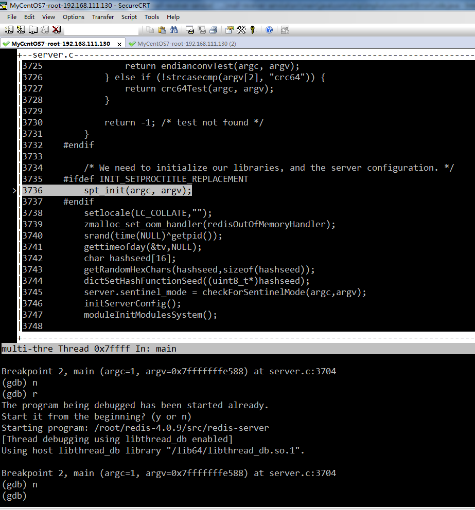

### 开启 GDB TUI 模式

开启 GDB TUI 模式有两个方法。

方法一：使用 gdbtui 命令或者 gdb-tui 命令开启一个调试。

```bash
gdbtui -q 需要调试的程序名
```

方法二：直接使用 GDB 调试代码，在需要的时候使用切换键 **Ctrl + X + A** 调出 GDB TUI 。

### GDB TUI 模式常用窗口

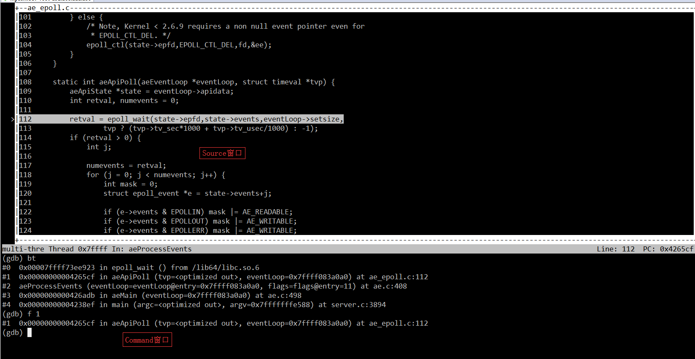

默认情况下，GDB TUI 模式会显示 command 窗口和 source 窗口，如上图所示，还有其他窗口，如下列举的四个常用的窗口：

- （cmd）command 命令窗口，可以输入调试命令
- （src）source 源代码窗口， 显示当前行、断点等信息
- （asm）assembly 汇编代码窗口
- （reg）register 寄存器窗口

可以通过“layout + 窗口类型”命令来选择自己需要的窗口，例如，在 cmd 窗口输入 `ayout asm` 则可以切换到汇编代码窗口。

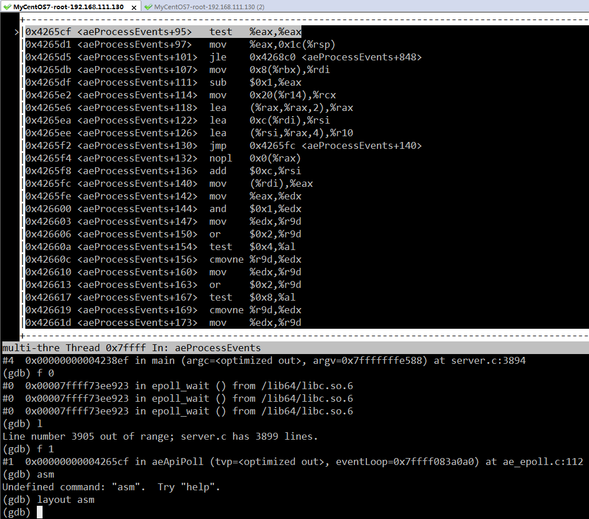

layout 命令还可以用来修改窗口布局，在 cmd 窗口中输入 help layout，常见的有：

```bash
Usage: layout prev | next | <layout_name> 
Layout names are:
   src   : Displays source and command windows.
   asm   : Displays disassembly and command windows.
   split : Displays source, disassembly and command windows.
   regs  : Displays register window. If existing layout
           is source/command or assembly/command, the 
           register window is displayed. If the
           source/assembly/command (split) is displayed, 
           the register window is displayed with 
           the window that has current logical focus.
```

另外，可以通过 winheight 命令修改各个窗口的大小，如下所示：

```bash
(gdb) help winheight
Set the height of a specified window.
Usage: winheight <win_name> [+ | -] <#lines>
Window names are:
src  : the source window
cmd  : the command window
asm  : the disassembly window
regs : the register display

##将代码窗口的高度扩大 5 行代码
winheight src + 5
##将代码窗口的高度减小 4 代码
winheight src - 4
```

当前 GDB TUI 窗口放大或者缩小以后，窗口中的内容不会自己刷新以适应新的窗口尺寸，我们可以通过 space 键强行刷新 GDB TUI 窗口。

### 窗口焦点切换

在默认设置下，方向键和 PageUp/PageDown 都是用来控制 GDB TUI 的 src 窗口的，因此，我们常用上下键显示前一条命令和后一条命令的功能就没有了，不过可以通过 `Ctrl + N/Ctrl + P` 来获取这个功能。

> **注意**：通过**方向键**调整了GDB TUI 的 src 窗口以后，可以用 **update** 命令重新把焦点定位到当前执行的代码上。

我们可以通过 focus 命令来调整焦点位置，默认情况下焦点是在 src 窗口，通过 focus next 命令可以把焦点移到 cmd 窗口，这时候就可以像以前一样，通过方向键来切换上一条命令和下一条命令。同理，也可以使用 focus prev 切回到源码窗口，如果焦点不在 src 窗口，我们就不必使用方向键来浏览源码了。

```bash
(gdb) help focus  
help focus
Set focus to named window or next/prev window.
Usage: focus {<win> | next | prev}
Valid Window names are:
src  : the source window
asm  : the disassembly window
regs : the register display
cmd  : the command window
```

### 小结

GDB TUI 提供了一个可视化的代码阅读功能，比使用 **list** 命令来查看代码要方便不少，有兴趣的读者可以尝试一下。

## 13.GDB 高级扩展工具——CGDB

在使用 GDB 单步调试时，代码每执行一行才显示下一行，很多用惯了图形界面 IDE 调试的读者可能会觉得非常不方便，而 GDB TUI 可能看起来不错，但是存在经常花屏的问题，也让很多读者不胜其烦。那 Linux 下有没有既能在调试时动态显示当前调试处的文件代码，又能不花屏的工具呢？有的，这就是 CGDB。

CGDB 本质上是对 GDB 做了一层“包裹”，所有在 GDB 中可以使用的命令，在 CGDB 中也可以使用。

### CGDB 的安装

CGDB 的官网[请点击这里查看](http://cgdb.github.io/)，执行以下命令将 CGDB 压缩包下载到本地：

```
wget https://cgdb.me/files/cgdb-0.7.0.tar.gz
```

然后执行以下步骤解压、编译、安装：

```bash
tar xvfz cgdb-0.7.0.tar.gz
cd cgdb-0.7.0
./configure 
make
make install
```

CGDB 在编译过程中会依赖一些第三方库，如果这些库系统上不存在就会报错，安装一下就可以了。常见的错误及解决方案如下（这里以 CentOS 系统为例，使用的是 yum 安装方式，其他 Linux 版本都有对应的安装软件命令，请自行查找）。

（1）出现错误：

```bash
configure: error: CGDB requires curses.h or ncurses/curses.h to build.
复制
```

解决方案：

```bash
yum install ncurses-devel
```

（2）出现错误：

```
configure: error: Please install makeinfo before installing
```

解决方案：

```
yum install texinfo
```

（3）出现错误：

```
configure: error: Please install help2man
```

解决方案：

```
yum install help2man
```

（4）出现错误：

```
configure: error: CGDB requires GNU readline 5.1 or greater to link.
If you used --with-readline instead of using the system readline library,
make sure to set the correct readline library on the linker search path
via LD_LIBRARY_PATH or some other facility.
```

解决方案：

```
yum install readline-devel
```

（5）出现错误：

```
configure: error: Please install flex before installing
```

解决方案：

```
yum install flex
```

### CGDB 的使用

安装成功以后，就可以使用 CGDB 了，在命令行输入 cgdb 命令启动 CGDB ，启动后界面如下：

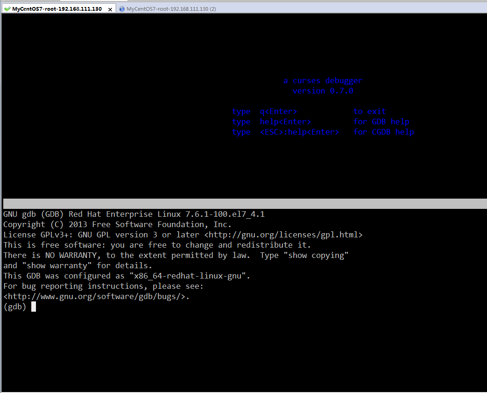

界面分为上下两部分：上部为代码窗口，显示调试过程中的代码；下部就是 GDB 原来的命令窗口。**默认窗口焦点在下部的命令窗口**，如果想将焦点切换到上部的代码窗口，**按键盘上的 Esc 键，之后再次按字母 i 键将使焦点回到命令窗口**。

>注意：这个“焦点窗口”的概念很重要，它决定着你当前可以操作的是上部代码窗口还是命令窗口（ 和GDB TUI 一样）。

我们用 Redis 自带的客户端程序 redis-cli 为例，输入以下命令启动调试：

```
cgdb redis-cli
```

启动后的界面如下：

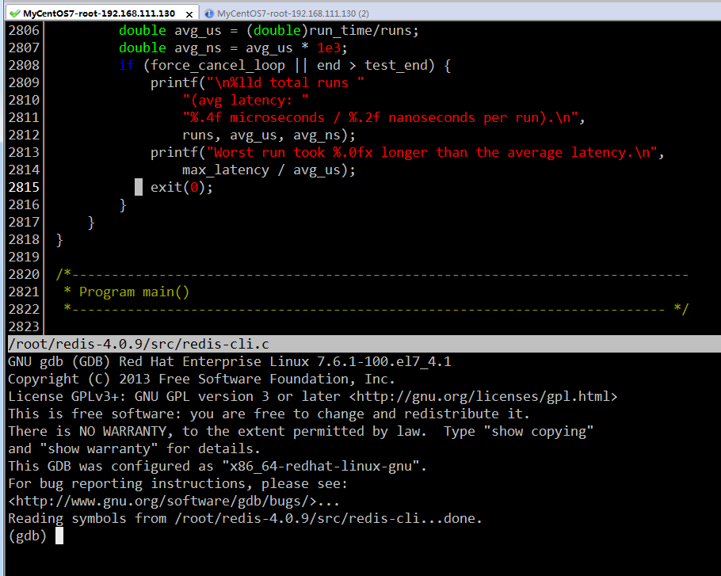

然后加两个断点，如下图所示：

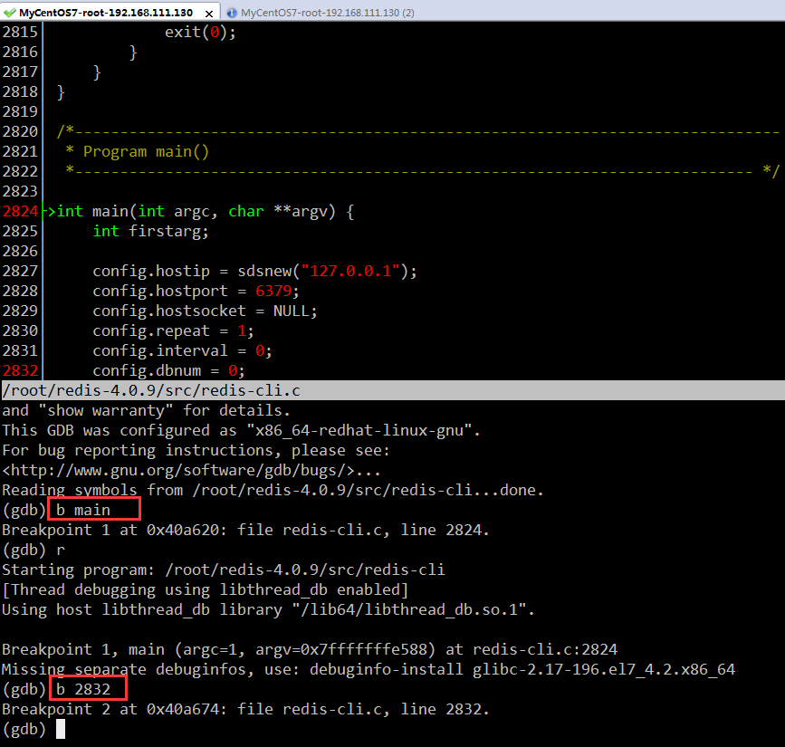

如上图所示，我们在程序的 main ( 上图中第 2824 行 ）和第 2832 行分别加了一个断点，添加断点以后，代码窗口的行号将会以红色显示，另外有一个绿色箭头指向当前执行的行（ 这里由于在 main 函数上加了个断点，绿色箭头指向第一个断点位置 ）。单步调试并步入第 2827 行的 sdsnew() 函数调用中，可以看到代码视图中相应的代码也发生了变化，并且绿色箭头始终指向当前执行的行数：

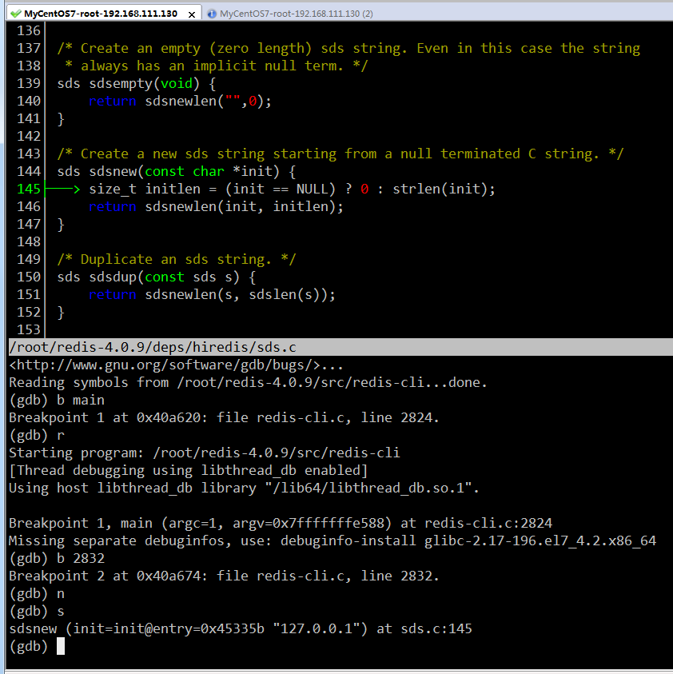

更多 CGDB 的用法可以查阅官网，也可以参考 CGDB 中文手册，[点击这里可查看详情](https://github.com/leeyiw/cgdb-manual-in-chinese/blob/master/SUMMARY.md)。

### CGDB 的不足之处

CGDB 虽然已经比原始的 GDB 和 GDB TUI 模式在代码显示方面改进了许多，但实际使用时，CGDB 中调用 GDB 的 print 命令无法显示字符串类型中的中文字符，要么显示乱码，要么不显示，会给程序调试带来很大的困扰，这点需要注意。

总的来说，CGDB 仍然能满足我们大多数场景下的调试，瑕不掩瑜， CGDB 在 Linux 系统中调试程序还是比 GDB 方便很多。


## 14.Windows 系统调试 Linux 程序——VisualGDB

VisualGDB 是一款 Visual Studio 插件，安装以后可以在 Windows 系统上利用 Visual Studio 强大的调试功能调试 Linux 程序。可能有读者会说，最新版的 Visual Studio 2015 或者 2017 不是自带了调试 Linux 程序的功能吗，为什么还要再装一款插件舍近而求远呢？很遗憾的是，经我测试 Visual Studio 2015 或者 2017 自带的调试程序，发现其功能很鸡肋，调试一些简单的 Linux 小程序还可以，调试复杂的或者多个源文件的 Linux 程序就力不从心了。

VisualGDB 是一款功能强大的商业软件，[点击这里详见官方网站](https://visualgdb.com/)。VisualGDB 本质上是利用 SSH 协议连接到远程 Linux 机器上，然后利用 Visual Studio 产生相应的 GDB 命令通过远程机器上的 gdbserver 传递给 GDB 调试器，其代码阅读功能建立在 samba 文件服务器之上。

利用这个工具远程调试 Linux 程序的方法有如下两种。

### 利用 VisualGDB 调试已经运行的程序

如果一个 Linux 程序已经运行，可以使用 VisualGDB 的远程 attach 功能。为了演示方便，我们将 Linux 机器上的 redis-server 运行起来：

```bash
[root@localhost src]# ./redis-server 
```

安装好 VisualGDB 插件以后，在 Visual Studio 的“Tools”菜单选择“**Linux Source Cache Manager**”菜单项，弹出如下对话框：

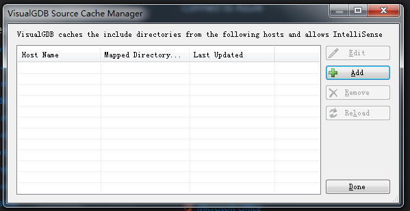

单击 Add 按钮，配置成我们需要调试的 Linux 程序所在的机器地址、用户名和密码。

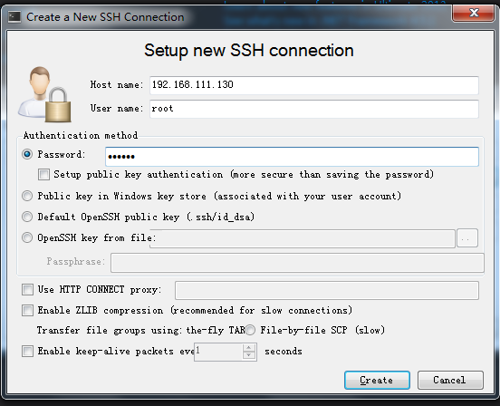

然后，在“Debug”菜单选择“Attach to Process…”菜单项，弹出 Attach To Process 对话框，Transport 类型选 VisualGDB，Qualifier 选择刚才我们配置的 Linux 主机信息。如果连接没有问题，会在下面的进程列表中弹出远程主机的进程列表，选择刚才启动的 redis-server，然后单击 Attach 按钮。

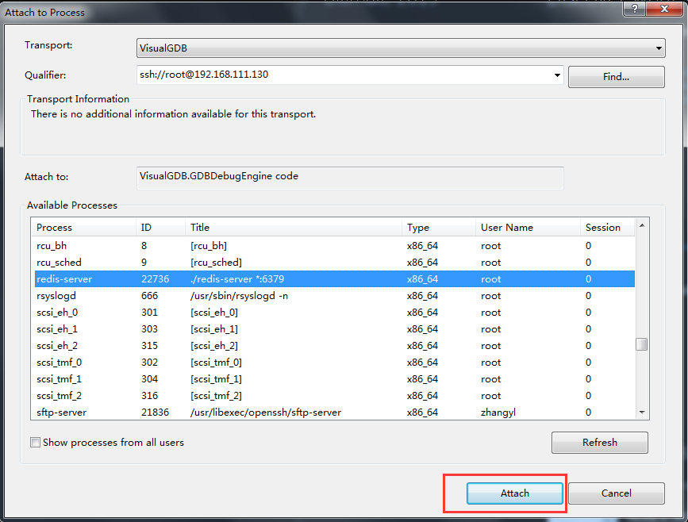

这样我们就可以在 Visual Studio 中调试这个 Linux 进程了。

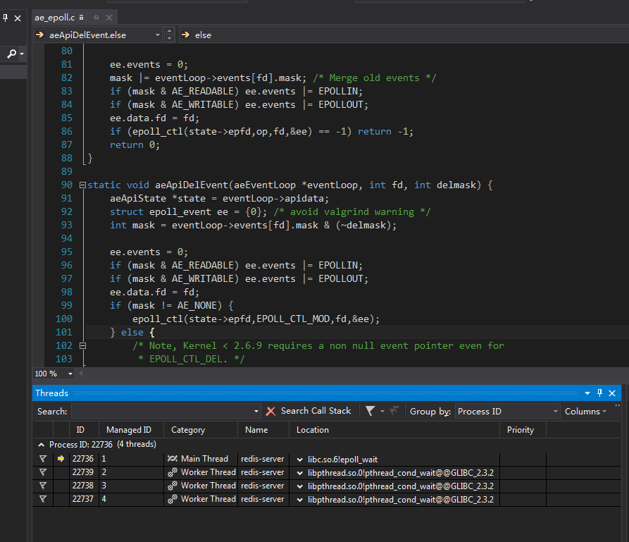

### 利用 VisualGDB 从头调试程序

更多的时候，我们需要从一个程序启动处，即 main() 函数处开始调试程序。在 Visual Studio 的“DEBUG”菜单选择“Quick Debug With GDB”菜单项，在弹出的对话框中配置好 Linux 程序所在的地址和目录：

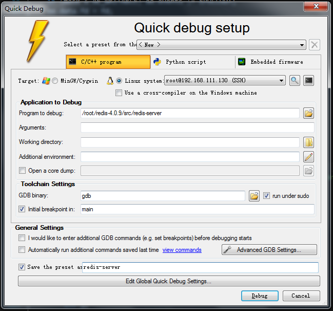

单击 Debug 按钮，就可以启动调试了。

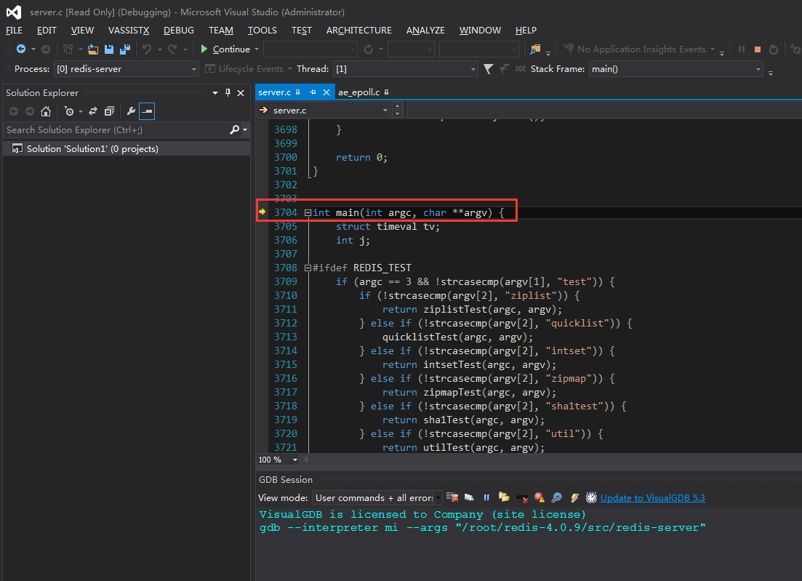

程序会自动停在 main() 函数处，这样我们就能利用强大的 Visual Studio 对 redis-server 进行调试。当然也可以在 VisualGDB 提供的 GDB Session 窗口直接输入 GDB 的原始命令进行调试。

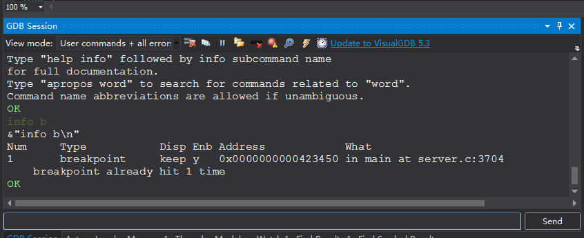

没有工具是完美的，VisualGDB 也存在一些缺点，用这款工具调试 Linux 程序时可能会存在卡顿、延迟等现象。

卡顿和延迟的原因一般是由于调试远程 linux 机器上的程序时，网络不稳定导致的。如果读者调试程序所在的机器是本机虚拟机或局域网内的机器，一般不存在这个问题。

在笔者实际的使用过程中，VisualGDB 也存在一些缺点：

- VisualGDB 是一款商业软件，需要购买。当然互联网或许会有一些共享版本，有兴趣的读者可以找来学习一下。
- 由于 VisualGDB 是忠实地把用户的图形化操作通过网络最终转换为远程 linux 机器上的命令得到结果再图形化显示出来。GDB 本身对于一些代码的暂停处会存在定位不准确的问题，VisualGDB 也仍然存在这个问题。

### 扩展阅读

关于 GDB 的调试知识除了 GDB 自带的 Help 手册，国外还有一本权威的书籍 *Debugging with GDB：The The gnu Source-Level Debugger* 系统地介绍了 GDB 调试的方方面面，有兴趣的可以找来阅读一下，这里也给出书的下载链接，[请点击这里查看](https://pan.baidu.com/s/1J_JFpzrwRa-u684CZEmWKQ)。


GDB 调试对于 Linux C++ 开发以及阅读众多开源 C/C++ 项目是如此的重要，希望读者务必掌握它。掌握它的方法也很简单，找点程序尤其是多线程程序，实际调试一下，看看程序运行中的各种中间状态，很快就能熟悉绝大多数命令了。

关于 GDB 本身的知识，就这么多了。从下一课开始，我们将通过 GDB 正式调试 redis-server 和 redis-cli 的源码来分析其网络通信模块结构和实现思路。


# 第五部分:GDB调试实战

## 15.[实战] 调试 Redis 准备工作

时下的业界，相对于传统的关系型数据库，以 key-value 思想实现的 NoSQL 内存数据库非常流行，而提到内存数据库，很多读者第一反应就是 Redis 。确实，Redis 以其高效的性能和优雅的实现成为众多内存数据库中的翘楚。

前面课程介绍了单个服务器的基本结构，这个课程我们再来一个实战演习，以 Redis 为例来讲解实际项目中的服务器结构是怎样的。当然，本课程介绍的角度与前面课程的思路不一样，前面是先给结论，然后再加以论证，而本课程则是假设预先不清楚 Redis 网络通信层的结构，结合 GDB 调试，以探究的方式逐步搞清楚 Redis 的网络通信模块结构。

### Redis 源码下载与编译

Redis 的最新源码下载地址可以在 [Redis 官网](https://redis.io/)获得。我使用的是 CentOS 7.0 系统，使用 wget 命令将 Redis 源码文件下载下来：

```c
[root@localhost gdbtest]# wget http://download.redis.io/releases/redis-4.0.11.tar.gz
--2018-09-08 13:08:41--  http://download.redis.io/releases/redis-4.0.11.tar.gz
Resolving download.redis.io (download.redis.io)... 109.74.203.151
Connecting to download.redis.io (download.redis.io)|109.74.203.151|:80... connected.
HTTP request sent, awaiting response... 200 OK
Length: 1739656 (1.7M) [application/x-gzip]
Saving to: ‘redis-4.0.11.tar.gz’

54% [==================================================================>                     ] 940,876     65.6KB/s  eta 9s
```

解压：

```bash
[root@localhost gdbtest]# tar zxvf redis-4.0.11.tar.gz 
```

进入生成的 redis-4.0.11 目录使用 makefile 进行编译：

```bash
[root@localhost gdbtest]# cd redis-4.0.11
[root@localhost redis-4.0.11]# make -j 4
```

编译成功后，会在 src 目录下生成多个可执行程序，其中 redis-server 和 redis-cli 是我们即将调试的程序。

进入 src 目录，使用 GDB 启动 redis-server 这个程序：

```bash
[root@localhost src]# gdb redis-server 
Reading symbols from /root/redis-4.0.9/src/redis-server...done.
(gdb) r
Starting program: /root/redis-4.0.9/src/redis-server 
[Thread debugging using libthread_db enabled]
Using host libthread_db library "/lib64/libthread_db.so.1".
31212:C 17 Sep 11:59:50.781 # oO0OoO0OoO0Oo Redis is starting oO0OoO0OoO0Oo
31212:C 17 Sep 11:59:50.781 # Redis version=4.0.9, bits=64, commit=00000000, modified=0, pid=31212, just started
31212:C 17 Sep 11:59:50.781 # Warning: no config file specified, using the default config. In order to specify a config file use /root/redis-4.0.9/src/redis-server /path/to/redis.conf
31212:M 17 Sep 11:59:50.781 * Increased maximum number of open files to 10032 (it was originally set to 1024).
[New Thread 0x7ffff07ff700 (LWP 31216)]
[New Thread 0x7fffefffe700 (LWP 31217)]
[New Thread 0x7fffef7fd700 (LWP 31218)]
                _._                                                  
           _.-``__ ''-._                                             
      _.-``    `.  `_.  ''-._           Redis 4.0.9 (00000000/0) 64 bit
  .-`` .-```.  ```\/    _.,_ ''-._                                   
 (    '      ,       .-`  | `,    )     Running in standalone mode
 |`-._`-...-` __...-.``-._|'` _.-'|     Port: 6379
 |    `-._   `._    /     _.-'    |     PID: 31212
  `-._    `-._  `-./  _.-'    _.-'                                   
 |`-._`-._    `-.__.-'    _.-'_.-'|                                  
 |    `-._`-._        _.-'_.-'    |           http://redis.io        
  `-._    `-._`-.__.-'_.-'    _.-'                                   
 |`-._`-._    `-.__.-'    _.-'_.-'|                                  
 |    `-._`-._        _.-'_.-'    |                                  
  `-._    `-._`-.__.-'_.-'    _.-'                                   
      `-._    `-.__.-'    _.-'                                       
          `-._        _.-'                                           
              `-.__.-'                                               

31212:M 17 Sep 11:59:50.793 # WARNING: The TCP backlog setting of 511 cannot be enforced because /proc/sys/net/core/somaxconn is set to the lower value of 128.
31212:M 17 Sep 11:59:50.793 # Server initialized
31212:M 17 Sep 11:59:50.793 # WARNING overcommit_memory is set to 0! Background save may fail under low memory condition. To fix this issue add 'vm.overcommit_memory = 1' to /etc/sysctl.conf and then reboot or run the command 'sysctl vm.overcommit_memory=1' for this to take effect.
31212:M 17 Sep 11:59:50.794 # WARNING you have Transparent Huge Pages (THP) support enabled in your kernel. This will create latency and memory usage issues with Redis. To fix this issue run the command 'echo never > /sys/kernel/mm/transparent_hugepage/enabled' as root, and add it to your /etc/rc.local in order to retain the setting after a reboot. Redis must be restarted after THP is disabled.
31212:M 17 Sep 11:59:50.794 * DB loaded from disk: 0.000 seconds
31212:M 17 Sep 11:59:50.794 * Ready to accept connections
```

以上是 redis-server 启动成功后的画面。

我们再开一个 session，再次进入 Redis 源码所在的 src 目录，然后使用 GDB 启动 Redis 客户端 redis-cli：

```bash
[root@localhost src]# gdb redis-cli
Reading symbols from /root/redis-4.0.9/src/redis-cli...done.
(gdb) r
Starting program: /root/redis-4.0.9/src/redis-cli 
[Thread debugging using libthread_db enabled]
Using host libthread_db library "/lib64/libthread_db.so.1".
127.0.0.1:6379> 
```

以上是 redis-cli 启动成功后的画面。

### 通信示例

本课程的学习目的是研究 Redis 的网络通信模块，为了说明问题方便，我们使用一个简单的通信实例，即通过 redis-cli 产生一个 key 为“hello”、值为“world”的 key-value 数据，然后得到 redis-server 的响应。

```bash
127.0.0.1:6379> set hello world
OK
127.0.0.1:6379> 
```

读者需要注意的是，我这里说是一个“简单”的实例，其实并不简单。有两个原因：

- 我们是在 **redis-cli** （Redis 客户端）输入的命令，这个命令经 **redis-cli** 处理后封装成网络通信包，通过客户端的网络通信模块发给 **redis-server**，然后 **redis-server** 网络通信模块收到后解析出命令，执行命令后得到结果再封装成相应的网络数据包，返回给 **redis-cli**。这个过程中涉及到两端的网络通信模块是我们研究和学习的重点。
- **redis-server** 基本的数据类型都是可以通过类似的命令产生，因此这个例子是一个典型的研究 **redis** 的典范。

### 小结

这节课介绍了我们利用调试 **Redis** 源码来学习 **GDB** 的一些准备工作和实例代码，有兴趣的读者可以根据本节课中介绍的内容准备一下学习材料，以备后面的进一步学习，从下一课开始我们正式利用 GDB 来调试 **Redis**。


## 16.[实战] Redis 网络通信模块源码分析（1）

我们这里先研究 redis-server 端的网络通信模块。除去 Redis 本身的业务功能以外，Redis 的网络通信模块实现思路和细节非常有代表性。由于网络通信模块的设计也是 Linux C++ 后台开发一个很重要的模块，虽然网络上有很多现成的网络库，但是简单易学且可以作为典范的并不多，而 redis-server 就是这方面值得借鉴学习的材料之一。

### 侦听 socket 初始化工作

通过前面课程的介绍，我们知道网络通信在应用层上的大致流程如下：

- 服务器端创建侦听 socket；
- 将侦听 socket 绑定到需要的 IP 地址和端口上（调用 Socket API bind 函数）；
- 启动侦听（调用 socket API listen 函数）；
- 无限等待客户端连接到来，调用 Socket API accept 函数接受客户端连接，并产生一个与该客户端对应的客户端 socket；
- 处理客户端 socket 上网络数据的收发，必要时关闭该 socket。

根据上面的流程，先来探究前三步的流程。由于 redis-server 默认对客户端的端口号是 6379，可以使用这个信息作为依据。

全局搜索一下 Redis 的代码，寻找调用了 bind() 函数的代码，经过过滤和筛选，我们确定了位于 anet.c 的 anetListen() 函数。

```c
static int anetListen(char *err, int s, struct sockaddr *sa, socklen_t len, int backlog) {
    if (bind(s,sa,len) == -1) {
        anetSetError(err, "bind: %s", strerror(errno));
        close(s);
        return ANET_ERR;
    }

    if (listen(s, backlog) == -1) {
        anetSetError(err, "listen: %s", strerror(errno));
        close(s);
        return ANET_ERR;
    }
    return ANET_OK;
}
```

用 GDB 的 b 命令在这个函数上加个断点，然后重新运行 redis-server：

```bash
(gdb) b anetListen
Breakpoint 1 at 0x426cd0: file anet.c, line 440.
(gdb) r
The program being debugged has been started already.
Start it from the beginning? (y or n) y
Starting program: /root/redis-4.0.9/src/redis-server 
[Thread debugging using libthread_db enabled]
Using host libthread_db library "/lib64/libthread_db.so.1".
31546:C 17 Sep 14:20:43.861 # oO0OoO0OoO0Oo Redis is starting oO0OoO0OoO0Oo
31546:C 17 Sep 14:20:43.861 # Redis version=4.0.9, bits=64, commit=00000000, modified=0, pid=31546, just started
31546:C 17 Sep 14:20:43.861 # Warning: no config file specified, using the default config. In order to specify a config file use /root/redis-4.0.9/src/redis-server /path/to/redis.conf
31546:M 17 Sep 14:20:43.862 * Increased maximum number of open files to 10032 (it was originally set to 1024).

Breakpoint 1, anetListen (err=0x745bb0 <server+560> "", s=10, sa=0x75dfe0, len=28, backlog=511) at anet.c:440
440     static int anetListen(char *err, int s, struct sockaddr *sa, socklen_t len, int backlog) {
```

当 GDB 中断在这个函数时，使用 bt 命令查看一下此时的调用堆栈：

```bash
(gdb) bt
#0  anetListen (err=0x745bb0 <server+560> "", s=10, sa=0x75dfe0, len=28, backlog=511) at anet.c:440
#1  0x0000000000426e25 in _anetTcpServer (err=err@entry=0x745bb0 <server+560> "", port=port@entry=6379, bindaddr=bindaddr@entry=0x0, af=af@entry=10, backlog=511)
    at anet.c:487
#2  0x000000000042792d in anetTcp6Server (err=err@entry=0x745bb0 <server+560> "", port=port@entry=6379, bindaddr=bindaddr@entry=0x0, backlog=<optimized out>)
    at anet.c:510
#3  0x000000000042b01f in listenToPort (port=6379, fds=fds@entry=0x745ae4 <server+356>, count=count@entry=0x745b24 <server+420>) at server.c:1728
#4  0x000000000042f917 in initServer () at server.c:1852
#5  0x0000000000423803 in main (argc=<optimized out>, argv=0x7fffffffe588) at server.c:3857
```

通过这个堆栈，结合堆栈 #2 的 6379 端口号可以确认这就是我们要找的逻辑，并且这个逻辑在主线程（因为从堆栈上看，最顶层堆栈是 main() 函数）中进行。

我们看下堆栈 #1 处的代码：

```c
static int _anetTcpServer(char *err, int port, char *bindaddr, int af, int backlog)
{
    int s = -1, rv;
    char _port[6];  /* strlen("65535") */
    struct addrinfo hints, *servinfo, *p;

    snprintf(_port,6,"%d",port);
    memset(&hints,0,sizeof(hints));
    hints.ai_family = af;
    hints.ai_socktype = SOCK_STREAM;
    hints.ai_flags = AI_PASSIVE;    /* No effect if bindaddr != NULL */

    if ((rv = getaddrinfo(bindaddr,_port,&hints,&servinfo)) != 0) {
        anetSetError(err, "%s", gai_strerror(rv));
        return ANET_ERR;
    }
    for (p = servinfo; p != NULL; p = p->ai_next) {
        if ((s = socket(p->ai_family,p->ai_socktype,p->ai_protocol)) == -1)
            continue;

        if (af == AF_INET6 && anetV6Only(err,s) == ANET_ERR) goto error;
        if (anetSetReuseAddr(err,s) == ANET_ERR) goto error;
        if (anetListen(err,s,p->ai_addr,p->ai_addrlen,backlog) == ANET_ERR) goto error;
        goto end;
    }
    if (p == NULL) {
        anetSetError(err, "unable to bind socket, errno: %d", errno);
        goto error;
    }

error:
    if (s != -1) close(s);
    s = ANET_ERR;
end:
    freeaddrinfo(servinfo);
    return s;
}
```

将堆栈切换至 #1，然后输入 info arg 查看传入给这个函数的参数：

```bash
(gdb) f 1
#1  0x0000000000426e25 in _anetTcpServer (err=err@entry=0x745bb0 <server+560> "", port=port@entry=6379, bindaddr=bindaddr@entry=0x0, af=af@entry=10, backlog=511)
    at anet.c:487
487             if (anetListen(err,s,p->ai_addr,p->ai_addrlen,backlog) == ANET_ERR) s = ANET_ERR;
(gdb) info args
err = 0x745bb0 <server+560> ""
port = 6379
bindaddr = 0x0
af = 10
backlog = 511
```

使用系统 API getaddrinfo 来解析得到当前主机的 IP 地址和端口信息。这里没有选择使用 gethostbyname 这个 API 是因为 **gethostbyname 仅能用于解析 ipv4 相关的主机信息**，而 **getaddrinfo 既可以用于 ipv4 也可以用于 ipv6** ，这个函数的签名如下：

```c
int getaddrinfo(const char *node, const char *service,
                       const struct addrinfo *hints,
                       struct addrinfo **res);
```

这个函数的具体用法可以在 Linux man 手册上查看。通常服务器端在调用 getaddrinfo 之前，将 hints 参数的 ai_flags 设置为 AI_PASSIVE，用于 bind；主机名 nodename 通常会设置为 NULL，返回通配地址 [::]。当然，客户端调用 getaddrinfo 时，hints 参数的 ai_flags 一般不设置 AI_PASSIVE，但是主机名 node 和服务名 service（更愿意称之为端口）则应该不为空。

解析完协议信息后，利用得到的协议信息创建侦听 socket，并开启该 socket 的 reuseAddr 选项。然后调用 anetListen 函数，在该函数中先 bind 后 listen。至此，redis-server 就可以在 6379 端口上接受客户端连接了。

### 接受客户端连接

同样的道理，要研究 redis-server 如何接受客户端连接，只要搜索 socket API accept 函数即可。

经定位，我们最终在 anet.c 文件中找到 anetGenericAccept 函数：

```c
static int anetGenericAccept(char *err, int s, struct sockaddr *sa, socklen_t *len) {
    int fd;
    while(1) {
        fd = accept(s,sa,len);
        if (fd == -1) {
            if (errno == EINTR)
                continue;
            else {
                anetSetError(err, "accept: %s", strerror(errno));
                return ANET_ERR;
            }
        }
        break;
    }
    return fd;
}
```

我们用 b 命令在这个函数处加个断点，然后重新运行 redis-server。**一直到程序全部运行起来，GDB 都没有触发该断点，这时新打开一个 redis-cli，以模拟新客户端连接到 redis-server 上的行为。断点触发了**，此时查看一下调用堆栈。

```c
Breakpoint 2, anetGenericAccept (err=0x745bb0 <server+560> "", s=s@entry=11, sa=sa@entry=0x7fffffffe2b0, len=len@entry=0x7fffffffe2ac) at anet.c:531
531     static int anetGenericAccept(char *err, int s, struct sockaddr *sa, socklen_t *len) {
(gdb) bt
#0  anetGenericAccept (err=0x745bb0 <server+560> "", s=s@entry=11, sa=sa@entry=0x7fffffffe2b0, len=len@entry=0x7fffffffe2ac) at anet.c:531
#1  0x0000000000427a1d in anetTcpAccept (err=<optimized out>, s=s@entry=11, ip=ip@entry=0x7fffffffe370 "\317P\237[", ip_len=ip_len@entry=46, 
    port=port@entry=0x7fffffffe36c) at anet.c:552
#2  0x0000000000437fb1 in acceptTcpHandler (el=<optimized out>, fd=11, privdata=<optimized out>, mask=<optimized out>) at networking.c:689
#3  0x00000000004267f0 in aeProcessEvents (eventLoop=eventLoop@entry=0x7ffff083a0a0, flags=flags@entry=11) at ae.c:440
#4  0x0000000000426adb in aeMain (eventLoop=0x7ffff083a0a0) at ae.c:498
#5  0x00000000004238ef in main (argc=<optimized out>, argv=0x7fffffffe588) at server.c:3894
```

分析这个调用堆栈，梳理一下这个调用流程。在 main 函数的 initServer 函数中创建侦听 socket、绑定地址然后开启侦听，**接着调用 aeMain 函数启动一个循环不断地处理“事件”。**

```c
void aeMain(aeEventLoop *eventLoop) {
    eventLoop->stop = 0;
    while (!eventLoop->stop) {
        if (eventLoop->beforesleep != NULL)
            eventLoop->beforesleep(eventLoop);
        aeProcessEvents(eventLoop, AE_ALL_EVENTS|AE_CALL_AFTER_SLEEP);
    }
}
```

循环的退出条件是 eventLoop→stop 为 1。事件处理的代码如下：

```c++
int aeProcessEvents(aeEventLoop *eventLoop, int flags)
{
    int processed = 0, numevents;

    /* Nothing to do? return ASAP */
    if (!(flags & AE_TIME_EVENTS) && !(flags & AE_FILE_EVENTS)) return 0;

    /* Note that we want call select() even if there are no
     * file events to process as long as we want to process time
     * events, in order to sleep until the next time event is ready
     * to fire. */
    if (eventLoop->maxfd != -1 ||
        ((flags & AE_TIME_EVENTS) && !(flags & AE_DONT_WAIT))) {
        int j;
        aeTimeEvent *shortest = NULL;
        struct timeval tv, *tvp;

        if (flags & AE_TIME_EVENTS && !(flags & AE_DONT_WAIT))
            shortest = aeSearchNearestTimer(eventLoop);
        if (shortest) {
            long now_sec, now_ms;

            aeGetTime(&now_sec, &now_ms);
            tvp = &tv;

            /* How many milliseconds we need to wait for the next
             * time event to fire? */
            long long ms =
                (shortest->when_sec - now_sec)*1000 +
                shortest->when_ms - now_ms;

            if (ms > 0) {
                tvp->tv_sec = ms/1000;
                tvp->tv_usec = (ms % 1000)*1000;
            } else {
                tvp->tv_sec = 0;
                tvp->tv_usec = 0;
            }
        } else {
            /* If we have to check for events but need to return
             * ASAP because of AE_DONT_WAIT we need to set the timeout
             * to zero */
            if (flags & AE_DONT_WAIT) {
                tv.tv_sec = tv.tv_usec = 0;
                tvp = &tv;
            } else {
                /* Otherwise we can block */
                tvp = NULL; /* wait forever */
            }
        }

        /* Call the multiplexing API, will return only on timeout or when
         * some event fires. */
        numevents = aeApiPoll(eventLoop, tvp);

        /* After sleep callback. */
        if (eventLoop->aftersleep != NULL && flags & AE_CALL_AFTER_SLEEP)
            eventLoop->aftersleep(eventLoop);

        for (j = 0; j < numevents; j++) {
            aeFileEvent *fe = &eventLoop->events[eventLoop->fired[j].fd];
            int mask = eventLoop->fired[j].mask;
            int fd = eventLoop->fired[j].fd;
            int rfired = 0;

        /* note the fe->mask & mask & ... code: maybe an already processed
             * event removed an element that fired and we still didn't
             * processed, so we check if the event is still valid. */
            if (fe->mask & mask & AE_READABLE) {
                rfired = 1;
                fe->rfileProc(eventLoop,fd,fe->clientData,mask);
            }
            if (fe->mask & mask & AE_WRITABLE) {
                if (!rfired || fe->wfileProc != fe->rfileProc)
                    fe->wfileProc(eventLoop,fd,fe->clientData,mask);
            }
            processed++;
        }
    }
    /* Check time events */
    if (flags & AE_TIME_EVENTS)
        processed += processTimeEvents(eventLoop);

    return processed; /* return the number of processed file/time events */
}
```

这段代码先通过 flag 参数检查是否有事件需要处理。如果有定时器事件（ **AE_TIME_EVENTS** 标志 ），则寻找最近要到期的定时器。

```c
/* Search the first timer to fire.
 * This operation is useful to know how many time the select can be
 * put in sleep without to delay any event.
 * If there are no timers NULL is returned.
 *
 * Note that's O(N) since time events are unsorted.
 * Possible optimizations (not needed by Redis so far, but...):
 * 1) Insert the event in order, so that the nearest is just the head.
 *    Much better but still insertion or deletion of timers is O(N).
 * 2) Use a skiplist to have this operation as O(1) and insertion as O(log(N)).
 */
static aeTimeEvent *aeSearchNearestTimer(aeEventLoop *eventLoop)
{
    aeTimeEvent *te = eventLoop->timeEventHead;
    aeTimeEvent *nearest = NULL;

    while(te) {
        if (!nearest || te->when_sec < nearest->when_sec ||
                (te->when_sec == nearest->when_sec &&
                 te->when_ms < nearest->when_ms))
            nearest = te;
        te = te->next;
    }
    return nearest;
}
```

这段代码有详细的注释，也非常好理解。注释告诉我们，**由于这里的定时器集合是无序的，所以需要遍历一下这个链表，算法复杂度是 O(n)** 。同时，注释中也“暗示”了我们将来 Redis 在这块的优化方向，**即把这个链表按到期时间从小到大排序，这样链表的头部就是我们要的最近时间点的定时器对象，算法复杂度是 O(1)** 。或者使用 Redis 中的 skiplist ，算法复杂度是 O(log(N)) 。

接着获取当前系统时间（ aeGetTime(&now_sec, &now_ms); ）将最早要到期的定时器时间减去当前系统时间获得一个间隔。**这个时间间隔作为 numevents = aeApiPoll(eventLoop, tvp); 调用的参数**，aeApiPoll() 在 Linux 平台上使用 epoll 技术，Redis 在这个 IO 复用技术上、在不同的操作系统平台上使用不同的系统函数，在 Windows 系统上使用 select，在 Mac 系统上使用 kqueue。这里重点看下 Linux 平台下的实现：

```c++
static int aeApiPoll(aeEventLoop *eventLoop, struct timeval *tvp) {
    aeApiState *state = eventLoop->apidata;
    int retval, numevents = 0;

    retval = epoll_wait(state->epfd,state->events,eventLoop->setsize,
            tvp ? (tvp->tv_sec*1000 + tvp->tv_usec/1000) : -1);
    if (retval > 0) {
        int j;

        numevents = retval;
        for (j = 0; j < numevents; j++) {
            int mask = 0;
            struct epoll_event *e = state->events+j;

            if (e->events & EPOLLIN) mask |= AE_READABLE;
            if (e->events & EPOLLOUT) mask |= AE_WRITABLE;
            if (e->events & EPOLLERR) mask |= AE_WRITABLE;
            if (e->events & EPOLLHUP) mask |= AE_WRITABLE;
            eventLoop->fired[j].fd = e->data.fd;
            eventLoop->fired[j].mask = mask;
        }
    }
    return numevents;
}
```

epoll_wait 这个函数的签名如下：

```c
int epoll_wait(int epfd, struct epoll_event *events, int maxevents, int timeout);
```

最后一个参数 timeout 的设置非常有讲究，如果传入进来的 tvp 是 NULL ，根据上文的分析，说明没有定时器事件，则将等待时间设置为 -1 ，这会让 epoll_wait 无限期地挂起来，直到有事件时才会被唤醒。挂起的好处就是不浪费 CPU 时间片。反之，将 timeout 设置成最近的定时器事件间隔，将 epoll_wait 的等待时间设置为最近的定时器事件来临的时间间隔，可以及时唤醒 epoll_wait ，这样程序流可以尽快处理这个到期的定时器事件（下文会介绍）。

对于 epoll_wait 这种系统调用，所有的 fd（对于网络通信，也叫 socket）信息包括侦听 fd 和普通客户端 fd 都记录在事件循环对象 aeEventLoop 的 **apidata** 字段中，当某个 fd 上有事件触发时，从 apidata 中找到该 fd，并把**事件类型（mask 字段）**一起记录到 aeEventLoop 的 **fired** 字段中去。我们先把这个流程介绍完，再介绍 epoll_wait 函数中使用的 epfd 是在何时何地创建的，侦听 fd、客户端 fd 是如何挂载到 epfd 上去的。

在得到了有事件的 fd 以后，接下来就要处理这些事件了。在主循环 aeProcessEvents 中从 aeEventLoop 对象的 fired 数组中取出上一步记录的 fd，然后根据事件类型（**读事件和写事件**）分别进行处理。

```c
for (j = 0; j < numevents; j++) {
            aeFileEvent *fe = &eventLoop->events[eventLoop->fired[j].fd];
            int mask = eventLoop->fired[j].mask;
            int fd = eventLoop->fired[j].fd;
            int rfired = 0;

        /* note the fe->mask & mask & ... code: maybe an already processed
             * event removed an element that fired and we still didn't
             * processed, so we check if the event is still valid. */
            if (fe->mask & mask & AE_READABLE) {
                rfired = 1;
                fe->rfileProc(eventLoop,fd,fe->clientData,mask);
            }
            if (fe->mask & mask & AE_WRITABLE) {
                if (!rfired || fe->wfileProc != fe->rfileProc)
                    fe->wfileProc(eventLoop,fd,fe->clientData,mask);
            }
            processed++;
        }
```

读事件字段 **rfileProc** 和写事件字段 **wfileProc** 都是**函数指针**，在程序早期设置好，这里直接调用就可以了。

```c
typedef void aeFileProc(struct aeEventLoop *eventLoop, int fd, void *clientData, int mask);

/* File event structure */
typedef struct aeFileEvent {
    int mask; /* one of AE_(READABLE|WRITABLE) */
    aeFileProc *rfileProc;
    aeFileProc *wfileProc;
    void *clientData;
} aeFileEvent;
```

### EPFD 的创建

我们通过搜索关键字 epoll_create 在 `ae_poll.c` 文件中找到 EPFD 的创建函数 `aeApiCreate `。

```c
static int aeApiCreate(aeEventLoop *eventLoop) {
    aeApiState *state = zmalloc(sizeof(aeApiState));

    if (!state) return -1;
    state->events = zmalloc(sizeof(struct epoll_event)*eventLoop->setsize);
    if (!state->events) {
        zfree(state);
        return -1;
    }
    state->epfd = epoll_create(1024); /* 1024 is just a hint for the kernel */
    if (state->epfd == -1) {
        zfree(state->events);
        zfree(state);
        return -1;
    }
    eventLoop->apidata = state;
    return 0;
}
```

使用 GDB 的 b 命令在这个函数上加个断点，然后使用 run 命令重新运行一下 redis-server，触发断点，使用 bt 命令查看此时的调用堆栈。发现 EPFD 也是在上文介绍的 initServer 函数中创建的。

```bash
(gdb) bt
#0  aeCreateEventLoop (setsize=10128) at ae.c:79
#1  0x000000000042f542 in initServer () at server.c:1841
#2  0x0000000000423803 in main (argc=<optimized out>, argv=0x7fffffffe588) at server.c:3857
```

在 **aeCreateEventLoop** 中不仅创建了 EPFD，也创建了整个事件循环需要的 aeEventLoop 对象，并把这个对象记录在 Redis 的一个全局变量的 **el 字段**中。这个**全局变量叫 server**，这是一个结构体类型。其定义如下：

```c
//位于 server.c 文件中
struct redisServer server; /* Server global state */
```

```c
//位于 server.h 文件中
struct redisServer {
    /* General */
    //省略部分字段...
    aeEventLoop *el;
    unsigned int lruclock;      /* Clock for LRU eviction */
    //太长了，省略部分字段...
}
```

由于篇幅有限，本主题未完，下一课继续。

## 17.[实战] Redis 网络通信模块源码分析（2）

接着上一课的内容继续分析。

### 侦听 fd 与客户端 fd 是如何挂载到 epfd 上去的

同样的方式，要把一个 fd 挂载到 EPFD 上去，需要调用系统 API epoll_ctl ，搜索一下这个函数名。在文件 ae_epoll.c 中我们找到 aeApiAddEvent 函数：

```c
static int aeApiAddEvent(aeEventLoop *eventLoop, int fd, int mask) {
    aeApiState *state = eventLoop->apidata;
    struct epoll_event ee = {0}; /* avoid valgrind warning */
    /* If the fd was already monitored for some event, we need a MOD
     * operation. Otherwise we need an ADD operation. */
    int op = eventLoop->events[fd].mask == AE_NONE ?
            EPOLL_CTL_ADD : EPOLL_CTL_MOD;

    ee.events = 0;
    mask |= eventLoop->events[fd].mask; /* Merge old events */
    if (mask & AE_READABLE) ee.events |= EPOLLIN;
    if (mask & AE_WRITABLE) ee.events |= EPOLLOUT;
    ee.data.fd = fd;
    if (epoll_ctl(state->epfd,op,fd,&ee) == -1) return -1;
    return 0;
}
```

当把一个 fd 绑定到 EPFD 上去的时候，先从 eventLoop（ aeEventLoop类型 ）中寻找是否存在已关注的事件类型，**如果已经有了**，说明使用 epoll_ctl 是更改已绑定的 fd 事件类型（ **EPOLL_CTL_MOD** ），否则就是添加 fd 到 EPFD 上。

在 aeApiAddEvent 加个断点，再重启下 redis-server。触发断点后的调用堆栈如下：

```bash
#0  aeCreateFileEvent (eventLoop=0x7ffff083a0a0, fd=15, mask=1, proc=0x437f50 <acceptTcpHandler>, clientData=0x0) at ae.c:145
#1  0x000000000042f83b in initServer () at server.c:1927
#2  0x0000000000423803 in main (argc=1, argv=0x7fffffffe588) at server.c:3857
```

同样在 initServer 函数中，结合上文分析的侦听 fd 的创建过程，去掉无关代码，抽出这个函数的主脉络得到如下伪代码：

```c
void initServer(void) {

    //记录程序进程 ID   
    server.pid = getpid();

    //创建程序的 aeEventLoop 对象和 epfd 对象
    server.el = aeCreateEventLoop(server.maxclients+CONFIG_FDSET_INCR);

    //创建侦听 fd
    listenToPort(server.port,server.ipfd,&server.ipfd_count) == C_ERR)

    //创建 Redis 的定时器，用于执行定时任务 cron
    /* Create the timer callback, this is our way to process many background
     * operations incrementally, like clients timeout, eviction of unaccessed
     * expired keys and so forth. */
    aeCreateTimeEvent(server.el, 1, serverCron, NULL, NULL) == AE_ERR

    //将侦听 fd 绑定到 epfd 上去
    /* Create an event handler for accepting new connections in TCP and Unix
     * domain sockets. */
     aeCreateFileEvent(server.el, server.ipfd[j], AE_READABLE, acceptTcpHandler,NULL) == AE_ERR

    //创建一个管道，用于在需要时去唤醒 epoll_wait 挂起的整个 EventLoop
    /* Register a readable event for the pipe used to awake the event loop
     * when a blocked client in a module needs attention. */
    aeCreateFileEvent(server.el, server.module_blocked_pipe[0], AE_READABLE, moduleBlockedClientPipeReadable,NULL) == AE_ERR)
}
```

> 注意：这里所说的“主脉络”是指我们关心的网络通信的主脉络，不代表这个函数中其他代码就不是主要的。

如何验证这个断点处挂载到 EPFD 上的 fd 就是侦听 fd 呢？很简单，创建侦听 fd 时，用 GDB 记录下这个 fd 的值。例如，当我的电脑某次运行时，侦听 fd 的值是 15 。如下图（ 调试工具用的是 CGDB ）：

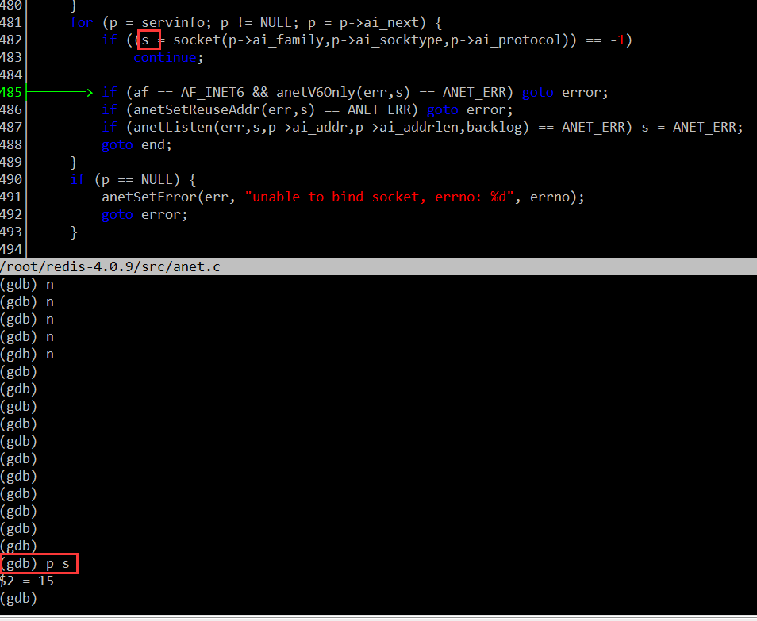

然后在运行程序至绑定 fd 的地方，确认一下绑定到 EPFD 上的 fd 值：

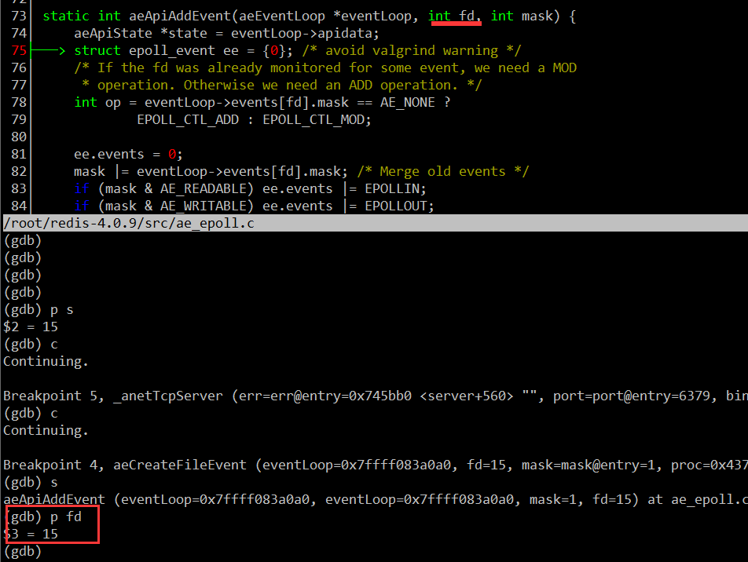

这里的 fd 值也是 15 ，说明绑定的 fd 是侦听 fd 。当然在绑定侦听 fd 时，同时也**指定了只关注可读事件**，并设置事件回调函数为 acceptTcpHandler 。**对于侦听 fd ，一般只要关注可读事件就可以了**，当触发可读事件，说明有新的连接到来。

```c
aeCreateFileEvent(server.el, server.ipfd[j], AE_READABLE, acceptTcpHandler,NULL) == AE_ERR
```

acceptTcpHandler 函数定义如下（ 位于文件 **networking.c** 中 ）：

```c
void acceptTcpHandler(aeEventLoop *el, int fd, void *privdata, int mask) {
    int cport, cfd, max = MAX_ACCEPTS_PER_CALL;
    char cip[NET_IP_STR_LEN];
    UNUSED(el);
    UNUSED(mask);
    UNUSED(privdata);

    while(max--) {
        cfd = anetTcpAccept(server.neterr, fd, cip, sizeof(cip), &cport);
        if (cfd == ANET_ERR) {
            if (errno != EWOULDBLOCK)
                serverLog(LL_WARNING,
                    "Accepting client connection: %s", server.neterr);
            return;
        }
        serverLog(LL_VERBOSE,"Accepted %s:%d", cip, cport);
        acceptCommonHandler(cfd,0,cip);
    }
}
```

anetTcpAccept 函数中调用的就是我们上面说的 anetGenericAccept 函数了。

```c
int anetTcpAccept(char *err, int s, char *ip, size_t ip_len, int *port) {
    int fd;
    struct sockaddr_storage sa;
    socklen_t salen = sizeof(sa);
    if ((fd = anetGenericAccept(err,s,(struct sockaddr*)&sa,&salen)) == -1)
        return ANET_ERR;

    if (sa.ss_family == AF_INET) {
        struct sockaddr_in *s = (struct sockaddr_in *)&sa;
        if (ip) inet_ntop(AF_INET,(void*)&(s->sin_addr),ip,ip_len);
        if (port) *port = ntohs(s->sin_port);
    } else {
        struct sockaddr_in6 *s = (struct sockaddr_in6 *)&sa;
        if (ip) inet_ntop(AF_INET6,(void*)&(s->sin6_addr),ip,ip_len);
        if (port) *port = ntohs(s->sin6_port);
    }
    return fd;
}
```

至此，这段流程总算连起来了，在 acceptTcpHandler 上加个断点，然后重新运行一下 redis-server ，再开个 redis-cli 去连接 redis-server。看看是否能触发该断点，如果能触发该断点，说明我们的分析是正确的。

经验证，确实触发了该断点。

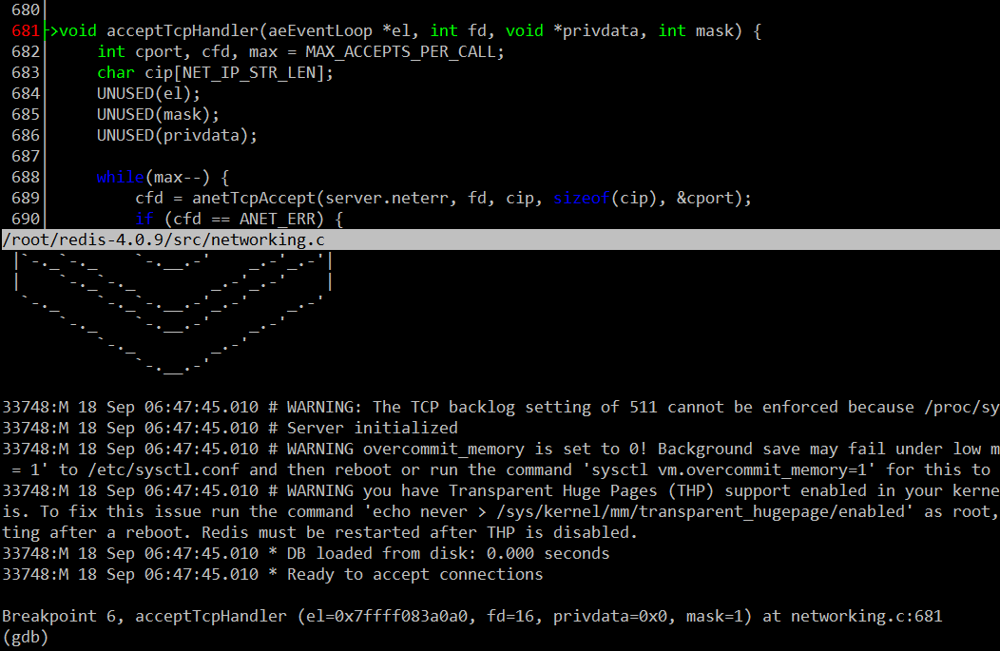

在 acceptTcpHandler 中成功接受新连接后，产生客户端 fd ，然后调用 **acceptCommonHandler** 函数，在该函数中调用 **createClient** 函数，在 createClient 函数中先将客户端 fd 设置成非阻塞的，然后将该 fd 关联到 EPFD 上去，同时记录到整个程序的 aeEventLoop 对象上。

> 注意：这里客户端 fd 绑定到 EPFD 上时也**只关注可读事件**。将无关的代码去掉，然后抽出我们关注的部分，整理后如下（ 位于 networking.c 文件中 ）：

```c
client *createClient(int fd) {
    //将客户端 fd 设置成非阻塞的
    anetNonBlock(NULL,fd);
    //启用 tcp NoDelay 选项
    anetEnableTcpNoDelay(NULL,fd);
    //根据配置，决定是否启动 tcpkeepalive 选项
    if (server.tcpkeepalive)
        anetKeepAlive(NULL,fd,server.tcpkeepalive);
    //将客户端 fd 绑定到 epfd，同时记录到 aeEventLoop 上，关注的事件为 AE_READABLE，回调函数为
    //readQueryFromClient
    aeCreateFileEvent(server.el,fd,AE_READABLE, readQueryFromClient, c) == AE_ERR

    return c;
}
```

### 如何处理 fd 可读事件

客户端 fd 触发可读事件后，回调函数是 readQueryFromClient，该函数实现如下（ 位于 networking.c 文件中）：

```c
void readQueryFromClient(aeEventLoop *el, int fd, void *privdata, int mask) {
    client *c = (client*) privdata;
    int nread, readlen;
    size_t qblen;
    UNUSED(el);
    UNUSED(mask);

    readlen = PROTO_IOBUF_LEN;
    /* If this is a multi bulk request, and we are processing a bulk reply
     * that is large enough, try to maximize the probability that the query
     * buffer contains exactly the SDS string representing the object, even
     * at the risk of requiring more read(2) calls. This way the function
     * processMultiBulkBuffer() can avoid copying buffers to create the
     * Redis Object representing the argument. */
    if (c->reqtype == PROTO_REQ_MULTIBULK && c->multibulklen && c->bulklen != -1
        && c->bulklen >= PROTO_MBULK_BIG_ARG)
    {
        int remaining = (unsigned)(c->bulklen+2)-sdslen(c->querybuf);

        if (remaining < readlen) readlen = remaining;
    }

    qblen = sdslen(c->querybuf);
    if (c->querybuf_peak < qblen) c->querybuf_peak = qblen;
    c->querybuf = sdsMakeRoomFor(c->querybuf, readlen);
    nread = read(fd, c->querybuf+qblen, readlen);
    if (nread == -1) {
        if (errno == EAGAIN) {
            return;
        } else {
            serverLog(LL_VERBOSE, "Reading from client: %s",strerror(errno));
            freeClient(c);
            return;
        }
    } else if (nread == 0) {
        serverLog(LL_VERBOSE, "Client closed connection");
        freeClient(c);
        return;
    } else if (c->flags & CLIENT_MASTER) {
        /* Append the query buffer to the pending (not applied) buffer
         * of the master. We'll use this buffer later in order to have a
         * copy of the string applied by the last command executed. */
        c->pending_querybuf = sdscatlen(c->pending_querybuf,
                                        c->querybuf+qblen,nread);
    }

    sdsIncrLen(c->querybuf,nread);
    c->lastinteraction = server.unixtime;
    if (c->flags & CLIENT_MASTER) c->read_reploff += nread;
    server.stat_net_input_bytes += nread;
    if (sdslen(c->querybuf) > server.client_max_querybuf_len) {
        sds ci = catClientInfoString(sdsempty(),c), bytes = sdsempty();

        bytes = sdscatrepr(bytes,c->querybuf,64);
        serverLog(LL_WARNING,"Closing client that reached max query buffer length: %s (qbuf initial bytes: %s)", ci, bytes);
        sdsfree(ci);
        sdsfree(bytes);
        freeClient(c);
        return;
    }

    /* Time to process the buffer. If the client is a master we need to
     * compute the difference between the applied offset before and after
     * processing the buffer, to understand how much of the replication stream
     * was actually applied to the master state: this quantity, and its
     * corresponding part of the replication stream, will be propagated to
     * the sub-slaves and to the replication backlog. */
    if (!(c->flags & CLIENT_MASTER)) {
        processInputBuffer(c);
    } else {
        size_t prev_offset = c->reploff;
        processInputBuffer(c);
        size_t applied = c->reploff - prev_offset;
        if (applied) {
            replicationFeedSlavesFromMasterStream(server.slaves,
                    c->pending_querybuf, applied);
            sdsrange(c->pending_querybuf,applied,-1);
        }
    }
}
```

给这个函数加个断点，然后重新运行下 redis-server ，再启动一个客户端，然后尝试给服务器发送一个命令“set hello world”。**但是在我们实际调试的时候会发现，只要 redis-cli 一连接成功，GDB 就触发该断点，此时并没有发送我们预想的命令。**单步调试 readQueryFromClient 函数，将收到的数据打印出来，得到如下字符串：

```bash
(gdb) p c->querybuf 
$8 = (sds) 0x7ffff09b8685 "*1\r\n$7\r\nCOMMAND\r\n"
```

c → querybuf 是什么呢？这里 c 的类型是 client 结构体，它是上文中连接接收成功后产生的新客户端 fd 绑定回调函数时产生的、并传递给 readQueryFromClient 函数的参数。可以在 server.h 中找到它的定义：

```c
* With multiplexing we need to take per-client state.
 * Clients are taken in a linked list. */
typedef struct client {
    uint64_t id;            /* Client incremental unique ID. */
    int fd;                 /* Client socket. */
    redisDb *db;            /* Pointer to currently SELECTed DB. */
    robj *name;             /* As set by CLIENT SETNAME. */
    sds querybuf;           /* Buffer we use to accumulate client queries. */
    //省略掉部分字段
} client;
```

client 实际上是存储每个客户端连接信息的对象，其 fd 字段就是当前连接的 fd，**querybuf 字段就是当前连接的接收缓冲区**，也就是说每个新客户端连接都会产生这样一个对象。**从 fd 上收取数据后就存储在这个 querybuf 字段中。**

贴一下完整的 createClient 函数的代码：

```c
client *createClient(int fd) {
    client *c = zmalloc(sizeof(client));

    /* passing -1 as fd it is possible to create a non connected client.
     * This is useful since all the commands needs to be executed
     * in the context of a client. When commands are executed in other
     * contexts (for instance a Lua script) we need a non connected client. */
    if (fd != -1) {
        anetNonBlock(NULL,fd);
        anetEnableTcpNoDelay(NULL,fd);
        if (server.tcpkeepalive)
            anetKeepAlive(NULL,fd,server.tcpkeepalive);
        if (aeCreateFileEvent(server.el,fd,AE_READABLE,
            readQueryFromClient, c) == AE_ERR)
        {
            close(fd);
            zfree(c);
            return NULL;
        }
    }

    selectDb(c,0);
    uint64_t client_id;
    atomicGetIncr(server.next_client_id,client_id,1);
    c->id = client_id;
    c->fd = fd;
    c->name = NULL;
    c->bufpos = 0;
    c->querybuf = sdsempty();
    c->pending_querybuf = sdsempty();
    c->querybuf_peak = 0;
    c->reqtype = 0;
    c->argc = 0;
    c->argv = NULL;
    c->cmd = c->lastcmd = NULL;
    c->multibulklen = 0;
    c->bulklen = -1;
    c->sentlen = 0;
    c->flags = 0;
    c->ctime = c->lastinteraction = server.unixtime;
    c->authenticated = 0;
    c->replstate = REPL_STATE_NONE;
    c->repl_put_online_on_ack = 0;
    c->reploff = 0;
    c->read_reploff = 0;
    c->repl_ack_off = 0;
    c->repl_ack_time = 0;
    c->slave_listening_port = 0;
    c->slave_ip[0] = '\0';
    c->slave_capa = SLAVE_CAPA_NONE;
    c->reply = listCreate();
    c->reply_bytes = 0;
    c->obuf_soft_limit_reached_time = 0;
    listSetFreeMethod(c->reply,freeClientReplyValue);
    listSetDupMethod(c->reply,dupClientReplyValue);
    c->btype = BLOCKED_NONE;
    c->bpop.timeout = 0;
    c->bpop.keys = dictCreate(&objectKeyPointerValueDictType,NULL);
    c->bpop.target = NULL;
    c->bpop.numreplicas = 0;
    c->bpop.reploffset = 0;
    c->woff = 0;
    c->watched_keys = listCreate();
    c->pubsub_channels = dictCreate(&objectKeyPointerValueDictType,NULL);
    c->pubsub_patterns = listCreate();
    c->peerid = NULL;
    listSetFreeMethod(c->pubsub_patterns,decrRefCountVoid);
    listSetMatchMethod(c->pubsub_patterns,listMatchObjects);
    if (fd != -1) listAddNodeTail(server.clients,c);
    initClientMultiState(c);
    return c;
}
```


## 18.[实战] Redis 网络通信模块源码分析（3）

### redis-server 接收到客户端的第一条命令

redis-cli 给 redis-server 发送的第一条数据是 *1\r\n\$7\r\nCOMMAND\r\n 。我们来看下对于这条数据如何处理，单步调试一下 readQueryFromClient 调用 read 函数收取完数据，接着继续处理 c→querybuf 的代码即可。经实际跟踪调试，调用的是 processInputBuffer 函数，位于 networking.c 文件中：

```c++
/* This function is called every time, in the client structure 'c', there is
 * more query buffer to process, because we read more data from the socket
 * or because a client was blocked and later reactivated, so there could be
 * pending query buffer, already representing a full command, to process. */
void processInputBuffer(client *c) {
    server.current_client = c;
    /* Keep processing while there is something in the input buffer */
    while(sdslen(c->querybuf)) {
        /* Return if clients are paused. */
        if (!(c->flags & CLIENT_SLAVE) && clientsArePaused()) break;

        /* Immediately abort if the client is in the middle of something. */
        if (c->flags & CLIENT_BLOCKED) break;

        /* CLIENT_CLOSE_AFTER_REPLY closes the connection once the reply is
         * written to the client. Make sure to not let the reply grow after
         * this flag has been set (i.e. don't process more commands).
         *
         * The same applies for clients we want to terminate ASAP. */
        if (c->flags & (CLIENT_CLOSE_AFTER_REPLY|CLIENT_CLOSE_ASAP)) break;

        /* Determine request type when unknown. */
        if (!c->reqtype) {
            if (c->querybuf[0] == '*') {
                c->reqtype = PROTO_REQ_MULTIBULK;
            } else {
                c->reqtype = PROTO_REQ_INLINE;
            }
        }

        if (c->reqtype == PROTO_REQ_INLINE) {
            if (processInlineBuffer(c) != C_OK) break;
        } else if (c->reqtype == PROTO_REQ_MULTIBULK) {
            if (processMultibulkBuffer(c) != C_OK) break;
        } else {
            serverPanic("Unknown request type");
        }

        /* Multibulk processing could see a <= 0 length. */
        if (c->argc == 0) {
            resetClient(c);
        } else {
            /* Only reset the client when the command was executed. */
            if (processCommand(c) == C_OK) {
                if (c->flags & CLIENT_MASTER && !(c->flags & CLIENT_MULTI)) {
                    /* Update the applied replication offset of our master. */
                    c->reploff = c->read_reploff - sdslen(c->querybuf);
                }

                /* Don't reset the client structure for clients blocked in a
                 * module blocking command, so that the reply callback will
                 * still be able to access the client argv and argc field.
                 * The client will be reset in unblockClientFromModule(). */
                if (!(c->flags & CLIENT_BLOCKED) || c->btype != BLOCKED_MODULE)
                    resetClient(c);
            }
            /* freeMemoryIfNeeded may flush slave output buffers. This may
             * result into a slave, that may be the active client, to be
             * freed. */
            if (server.current_client == NULL) break;
        }
    }
    server.current_client = NULL;
}
```

processInputBuffer 先判断接收到的字符串是不是以星号（ * ）开头，这里是以星号开头，然后设置 client 对象的 reqtype 字段值为 PROTO_REQ_MULTIBULK 类型，接着调用 processMultibulkBuffer 函数继续处理剩余的字符串。处理后的字符串被解析成 redis 命令，记录在 client 对象的 argc 和 argv 两个字段中，**前者记录当前命令的数目，后者存储的是命令对应结构体对象的地址**。这些命令的相关内容不是我们本课程的关注点，不再赘述。

命令解析完成以后，从 processMultibulkBuffer 函数返回，在 processCommand 函数中处理刚才记录在 client 对象 argv 字段中的命令。

```c
//为了与原代码保持一致，代码缩进未调整
if (c->argc == 0) {
            resetClient(c);
        } else {
            /* Only reset the client when the command was executed. */
            if (processCommand(c) == C_OK) {
                //省略部分代码
            }

        }
```

在 processCommand 函数中处理命令，流程大致如下：

（1）先判断是不是 quit 命令，如果是，则往发送缓冲区中添加一条应答命令（ 应答 redis 客户端 ），并给当前 client 对象设置 CLIENT_CLOSE_AFTER_REPLY 标志，这个标志见名知意，即应答完毕后关闭连接。

（2）如果不是 quit 命令，则使用 lookupCommand 函数从全局命令字典表中查找相应的命令，如果出错，则向发送缓冲区中添加出错应答。出错不是指程序逻辑出错，有可能是客户端发送的非法命令。如果找到相应的命令，则执行命令后添加应答。

```c
int processCommand(client *c) {
    /* The QUIT command is handled separately. Normal command procs will
     * go through checking for replication and QUIT will cause trouble
     * when FORCE_REPLICATION is enabled and would be implemented in
     * a regular command proc. */
    if (!strcasecmp(c->argv[0]->ptr,"quit")) {
        addReply(c,shared.ok);
        c->flags |= CLIENT_CLOSE_AFTER_REPLY;
        return C_ERR;
    }

    /* Now lookup the command and check ASAP about trivial error conditions
     * such as wrong arity, bad command name and so forth. */
    c->cmd = c->lastcmd = lookupCommand(c->argv[0]->ptr);
    if (!c->cmd) {
        flagTransaction(c);
        addReplyErrorFormat(c,"unknown command '%s'",
            (char*)c->argv[0]->ptr);
        return C_OK;
    } else if ((c->cmd->arity > 0 && c->cmd->arity != c->argc) ||
               (c->argc < -c->cmd->arity)) {
        flagTransaction(c);
        addReplyErrorFormat(c,"wrong number of arguments for '%s' command",
            c->cmd->name);
        return C_OK;
    }

    //...省略部分代码

}
```

全局字典表是前面介绍的 server 全局变量（类型是 redisServer）的一个字段 commands 。

```
struct redisServer {
    /* General */
    pid_t pid;                  /* Main process pid. */
    //无关字段省略
    dict *commands;             /* Command table */

    //无关字段省略
}
```

至于这个全局字典表在哪里初始化以及相关的数据结构类型，由于与本课程主题无关，这里就不分析了。

下面重点探究如何将应答命令（包括出错的应答）添加到发送缓冲区去。我们以添加一个“ok”命令为例：

```c
void addReply(client *c, robj *obj) {
    if (prepareClientToWrite(c) != C_OK) return;

    /* This is an important place where we can avoid copy-on-write
     * when there is a saving child running, avoiding touching the
     * refcount field of the object if it's not needed.
     *
     * If the encoding is RAW and there is room in the static buffer
     * we'll be able to send the object to the client without
     * messing with its page. */
    if (sdsEncodedObject(obj)) {
        if (_addReplyToBuffer(c,obj->ptr,sdslen(obj->ptr)) != C_OK)
            _addReplyObjectToList(c,obj);
    } else if (obj->encoding == OBJ_ENCODING_INT) {
        /* Optimization: if there is room in the static buffer for 32 bytes
         * (more than the max chars a 64 bit integer can take as string) we
         * avoid decoding the object and go for the lower level approach. */
        if (listLength(c->reply) == 0 && (sizeof(c->buf) - c->bufpos) >= 32) {
            char buf[32];
            int len;

            len = ll2string(buf,sizeof(buf),(long)obj->ptr);
            if (_addReplyToBuffer(c,buf,len) == C_OK)
                return;
            /* else... continue with the normal code path, but should never
             * happen actually since we verified there is room. */
        }
        obj = getDecodedObject(obj);
        if (_addReplyToBuffer(c,obj->ptr,sdslen(obj->ptr)) != C_OK)
            _addReplyObjectToList(c,obj);
        decrRefCount(obj);
    } else {
        serverPanic("Wrong obj->encoding in addReply()");
    }
}
```

addReply 函数中有两个关键的地方，一个是 **prepareClientToWrite** 函数调用，另外一个是 **_addReplyToBuffer** 函数调用。先来看 prepareClientToWrite ，这个函数中有这样一段代码：

```c
if (!clientHasPendingReplies(c) &&
        !(c->flags & CLIENT_PENDING_WRITE) &&
        (c->replstate == REPL_STATE_NONE ||
         (c->replstate == SLAVE_STATE_ONLINE && !c->repl_put_online_on_ack)))
    {
        /* Here instead of installing the write handler, we just flag the
         * client and put it into a list of clients that have something
         * to write to the socket. This way before re-entering the event
         * loop, we can try to directly write to the client sockets avoiding
         * a system call. We'll only really install the write handler if
         * we'll not be able to write the whole reply at once. */
        c->flags |= CLIENT_PENDING_WRITE;
        listAddNodeHead(server.clients_pending_write,c);
    }
```

这段代码先判断发送缓冲区中是否还有未发送的应答命令——通过判断 client 对象的 **bufpos 字段（ int 型 ）**和 **reply 字段（ 这是一个链表 ）的长度**是否大于 0 。

```c
/* Return true if the specified client has pending reply buffers to write to
 * the socket. */
int clientHasPendingReplies(client *c) {
    return c->bufpos || listLength(c->reply);
}
```

如果当前 client 对象不是处于 **CLIENT_PENDING_WRITE** 状态，且在发送缓冲区没有剩余数据，则给该 client 对象设置 CLIENT_PENDING_WRITE 标志，并将当前 client 对象添加到全局 server 对象的名叫 **clients_pending_write 链表**中去。这个链表中存的是所有有数据要发送的 client 对象**，注意和上面说的 reply 链表区分开来。**

关于 CLIENT_PENDING_WRITE 标志，redis 解释是：

```
Client has output to send but a write handler is yet not installed
```

翻译成中文就是：一个有数据需要发送，但是还没有注册可写事件的 client 对象。

下面讨论 _addReplyToBuffer 函数，位于 networking.c 文件中。

```c
int _addReplyToBuffer(client *c, const char *s, size_t len) {
    size_t available = sizeof(c->buf)-c->bufpos;

    if (c->flags & CLIENT_CLOSE_AFTER_REPLY) return C_OK;

    /* If there already are entries in the reply list, we cannot
     * add anything more to the static buffer. */
    if (listLength(c->reply) > 0) return C_ERR;

    /* Check that the buffer has enough space available for this string. */
    if (len > available) return C_ERR;

    memcpy(c->buf+c->bufpos,s,len);
    c->bufpos+=len;
    return C_OK;
}
```

在这个函数中再次确保了 client 对象的 reply 链表长度不能大于 0（ if 判断，如果不满足条件，则退出该函数 ）。**reply 链表存储的是待发送的应答命令**。应答命令被存储在 client 对象的 buf 字段中，其长度被记录在 bufpos 字段中。**buf 字段是一个固定大小的字节数组**：

```c
typedef struct client {
    uint64_t id;            /* Client incremental unique ID. */
    int fd;                 /* Client socket. */
    redisDb *db;            /* Pointer to currently SELECTed DB. */
    robj *name;             /* As set by CLIENT SETNAME. */
    sds querybuf;           /* Buffer we use to accumulate client queries. */
    sds pending_querybuf;   /* If this is a master, this buffer represents the
                               yet not applied replication stream that we
                               are receiving from the master. */
   //省略部分字段...

    /* Response buffer */
    int bufpos;
    char buf[PROTO_REPLY_CHUNK_BYTES];
} client;
```

PROTO_REPLY_CHUNK_BYTES 在 redis 中的定义是 16*1024 ，也就是说应答命令数据包最长是 16k 。

回到我们上面提的命令：*1\r\n\$7\r\nCOMMAND\r\n ，通过 lookupCommand 解析之后得到 command 命令，在 GDB 中显示如下：

```bash
2345        c->cmd = c->lastcmd = lookupCommand(c->argv[0]->ptr);
(gdb) n
2346        if (!c->cmd) {
(gdb) p c->cmd
$23 = (struct redisCommand *) 0x742db0 <redisCommandTable+13040>
(gdb) p *c->cmd
$24 = {name = 0x4fda67 "command", proc = 0x42d920 <commandCommand>, arity = 0, sflags = 0x50dc3e "lt", flags = 1536, getkeys_proc = 0x0, firstkey = 0, lastkey = 0, 
  keystep = 0, microseconds = 1088, calls = 1}
```

### 如何处理可写事件

前面我们介绍了 redis-server 如何处理可读事件，整个流程就是注册可读事件回调函数，在回调函数中调用操作系统 API read 函数收取数据，然后解析数据得到 redis 命令，处理命令接着将应答数据包放到 client 对象的 buf 字段中去。**那么放入 buf 字段的数据何时发给客户端呢？**

还记得我们前面课程提到的 while 事件循环吗？我们再来回顾一下它的代码：

```c++
void aeMain(aeEventLoop *eventLoop) {
    eventLoop->stop = 0;
    while (!eventLoop->stop) {
        if (eventLoop->beforesleep != NULL)
            eventLoop->beforesleep(eventLoop);
        aeProcessEvents(eventLoop, AE_ALL_EVENTS|AE_CALL_AFTER_SLEEP);
    }
}
```

其中，先判断 eventLoop 对象的 **beforesleep 对象**是否设置了，**这是一个回调函数**。在 redis-server 初始化时已经设置好了。

```c
void aeSetBeforeSleepProc(aeEventLoop *eventLoop, aeBeforeSleepProc *beforesleep) {
    eventLoop->beforesleep = beforesleep;
}
```

我们在 aeSetBeforeSleepProc 这个函数上设置一个断点，然后重启一下 redis-server 来验证在何处设置的这个回调。

```bash
Breakpoint 2, aeSetBeforeSleepProc (eventLoop=0x7ffff083a0a0, beforesleep=beforesleep@entry=0x4294f0 <beforeSleep>) at ae.c:507
507         eventLoop->beforesleep = beforesleep;
(gdb) bt
#0  aeSetBeforeSleepProc (eventLoop=0x7ffff083a0a0, beforesleep=beforesleep@entry=0x4294f0 <beforeSleep>) at ae.c:507
#1  0x00000000004238d2 in main (argc=<optimized out>, argv=0x7fffffffe588) at server.c:3892
```

使用 f 1 命令切换到堆栈 #1 ，并输入 l 显示断点附近的代码：

```bash
(gdb) l
3887        /* Warning the user about suspicious maxmemory setting. */
3888        if (server.maxmemory > 0 && server.maxmemory < 1024*1024) {
3889            serverLog(LL_WARNING,"WARNING: You specified a maxmemory value that is less than 1MB (current value is %llu bytes). Are you sure this is what you really want?", server.maxmemory);
3890        }
3891
3892        aeSetBeforeSleepProc(server.el,beforeSleep);
3893        aeSetAfterSleepProc(server.el,afterSleep);
3894        aeMain(server.el);
3895        aeDeleteEventLoop(server.el);
3896        return 0;
```

3892 行将这个回调设置成 beforeSleep 函数，**因此每一轮循环都会调用这个 beforeSleep 函数**。server.el 前面也介绍过即 aeEventLoop 对象，在这个 beforeSleep 函数中有一个 **handleClientsWithPendingWrites** 调用（ 位于文件 server.c 中 ）：

```c
void beforeSleep(struct aeEventLoop *eventLoop) {
    //省略无关代码...

    /* Handle writes with pending output buffers. */
    handleClientsWithPendingWrites();

    //省略无关代码...
}
```

handleClientsWithPendingWrites 函数调用即把记录在每个 client 中的数据发送出去。我们具体看一下发送的逻辑（ 位于 networking.c 文件中 ）：

```c
/* This function is called just before entering the event loop, in the hope
 * we can just write the replies to the client output buffer without any
 * need to use a syscall in order to install the writable event handler,
 * get it called, and so forth. */
int handleClientsWithPendingWrites(void) {
    listIter li;
    listNode *ln;
    int processed = listLength(server.clients_pending_write);

    listRewind(server.clients_pending_write,&li);
    while((ln = listNext(&li))) {
        client *c = listNodeValue(ln);
        c->flags &= ~CLIENT_PENDING_WRITE;
        listDelNode(server.clients_pending_write,ln);

        /* Try to write buffers to the client socket. */
        if (writeToClient(c->fd,c,0) == C_ERR) continue;

        /* If there is nothing left, do nothing. Otherwise install
         * the write handler. */
        if (clientHasPendingReplies(c) &&
            aeCreateFileEvent(server.el, c->fd, AE_WRITABLE,
                sendReplyToClient, c) == AE_ERR)
        {
            freeClientAsync(c);
        }
    }
    return processed;
}
```

上面的代码先从全局 server 对象的 clients_pending_write 字段（ 存储 client 对象的链表 ）挨个取出有数据要发送的 client 对象，然后调用 **writeToClient** 函数尝试将 client 中存储的应答数据发出去。

```c
//位于networking.c文件中
int writeToClient(int fd, client *c, int handler_installed) {
    ssize_t nwritten = 0, totwritten = 0;
    size_t objlen;
    sds o;

    while(clientHasPendingReplies(c)) {
        if (c->bufpos > 0) {
            nwritten = write(fd,c->buf+c->sentlen,c->bufpos-c->sentlen);
            if (nwritten <= 0) break;
            c->sentlen += nwritten;
            totwritten += nwritten;

            /* If the buffer was sent, set bufpos to zero to continue with
             * the remainder of the reply. */
            if ((int)c->sentlen == c->bufpos) {
                c->bufpos = 0;
                c->sentlen = 0;
            }
        } else {
            o = listNodeValue(listFirst(c->reply));
            objlen = sdslen(o);

            if (objlen == 0) {
                listDelNode(c->reply,listFirst(c->reply));
                continue;
            }

            nwritten = write(fd, o + c->sentlen, objlen - c->sentlen);
            if (nwritten <= 0) break;
            c->sentlen += nwritten;
            totwritten += nwritten;

            /* If we fully sent the object on head go to the next one */
            if (c->sentlen == objlen) {
                listDelNode(c->reply,listFirst(c->reply));
                c->sentlen = 0;
                c->reply_bytes -= objlen;
                /* If there are no longer objects in the list, we expect
                 * the count of reply bytes to be exactly zero. */
                if (listLength(c->reply) == 0)
                    serverAssert(c->reply_bytes == 0);
            }
        }
        /* Note that we avoid to send more than NET_MAX_WRITES_PER_EVENT
         * bytes, in a single threaded server it's a good idea to serve
         * other clients as well, even if a very large request comes from
         * super fast link that is always able to accept data (in real world
         * scenario think about 'KEYS *' against the loopback interface).
         *
         * However if we are over the maxmemory limit we ignore that and
         * just deliver as much data as it is possible to deliver. */
        if (totwritten > NET_MAX_WRITES_PER_EVENT &&
            (server.maxmemory == 0 ||
             zmalloc_used_memory() < server.maxmemory)) break;
    }
    server.stat_net_output_bytes += totwritten;
    if (nwritten == -1) {
        if (errno == EAGAIN) {
            nwritten = 0;
        } else {
            serverLog(LL_VERBOSE,
                "Error writing to client: %s", strerror(errno));
            freeClient(c);
            return C_ERR;
        }
    }
    if (totwritten > 0) {
        /* For clients representing masters we don't count sending data
         * as an interaction, since we always send REPLCONF ACK commands
         * that take some time to just fill the socket output buffer.
         * We just rely on data / pings received for timeout detection. */
        if (!(c->flags & CLIENT_MASTER)) c->lastinteraction = server.unixtime;
    }
    if (!clientHasPendingReplies(c)) {
        c->sentlen = 0;
        if (handler_installed) aeDeleteFileEvent(server.el,c->fd,AE_WRITABLE);

        /* Close connection after entire reply has been sent. */
        if (c->flags & CLIENT_CLOSE_AFTER_REPLY) {
            freeClient(c);
            return C_ERR;
        }
    }
    return C_OK;
}
```

writeToClient 函数先把自己处理的 client 对象的 buf 字段的数据发出去，如果出错的话则释放这个 client 。如果数据能够全部发完，发完以后则会移除对应的 fd 上的可写事件（ 如果添加了 ）；如果当前 client 设置了 **CLIENT_CLOSE_AFTER_REPLY** 标志，则发送完数据立即释放这个 client 对象。


当然，可能存在一种情况是，由于网络或者客户端的原因，redis-server 某个客户端的数据发送不出去，或者只有部分可以发出去（ 例如，服务器端给客户端发数据，客户端的应用层一直不从 Tcp 内核缓冲区中取出数据，这样服务器发送一段时间的数据后，客户端内核缓冲区满了，服务器再发数据就会发不出去，由于 fd 是非阻塞的，这个时候服务器调用 send 或者 write 函数会直接返回，返回值是 −1 ，错误码是 EAGAIN ，见上面的代码。）。不管哪种情况，数据这一次发不完。这个时候就需要监听可写事件了，因为在 handleClientsWithPendingWrites 函数中有如下代码：

```c
/* If there is nothing left, do nothing. Otherwise install
 * the write handler. */
if (clientHasPendingReplies(c) && aeCreateFileEvent(server.el, c->fd, AE_WRITABLE,
                                                sendReplyToClient, c) == AE_ERR)
{
    freeClientAsync(c);
}
```

这里注册可写事件 AE_WRITABLE 的回调函数是 **sendReplyToClient** 。也就是说，当下一次某个触发可写事件时，调用的就是 sendReplyToClient 函数。可以猜想，sendReplyToClient 发送数据的逻辑和上面的 writeToClient 函数一模一样，不信请看（ 位于 networking.c 文件中 ）：

```c
/* Write event handler. Just send data to the client. */
void sendReplyToClient(aeEventLoop *el, int fd, void *privdata, int mask) {
    UNUSED(el);
    UNUSED(mask);
    writeToClient(fd,privdata,1);
}
```

至此，redis-server 发送数据的逻辑也理清楚了。这里简单做个总结：

如果有数据要发送给某个 client ，不需要专门注册可写事件等触发可写事件再发送。通常的做法是在应答数据产生的地方直接发送，如果是因为对端 Tcp 窗口太小引起的发送不完，则将剩余的数据存储至某个缓冲区并注册监听可写事件，等下次触发可写事件后再尝试发送，一直到数据全部发送完毕后移除可写事件。

redis-server 数据的发送逻辑与这个稍微有点差别，就是将数据发送的时机放到了 EventLoop 的某个时间点上（ 这里是在 ProcessEvents 之前 ），其他的与上面完全一样。

之所以不注册监听可写事件，等可写事件触发再发送数据，原因是通常情况下，网络通信的两端数据一般都是正常收发的，不会出现某一端由于 Tcp 窗口太小而使另外一端发不出去的情况。如果注册监听可写事件，那么这个事件会频繁触发，而触发时不一定有数据需要发送，这样不仅浪费系统资源，同时也浪费服务器程序宝贵的 CPU 时间片。


## 19.[实战] redis-server 定时器实现

### 定时器逻辑

一个网络通信模块是离不开定时器，前面介绍了在事件处理函数中如何去除最早到期的定时器对象，这里我们接着这个问题继续讨论。在 aeProcessEvents 函数（ 位于文件 ae.c 中 ）的结尾处有这样一段代码：

```c
/* Check time events */
if (flags & AE_TIME_EVENTS)
    processed += processTimeEvents(eventLoop);
```

如果存在定时器事件，则调用 processTimeEvents 函数（ 位于文件 ae.c 中 ）进行处理。

```c
/* Process time events */
static int processTimeEvents(aeEventLoop *eventLoop) {
    int processed = 0;
    aeTimeEvent *te, *prev;
    long long maxId;
    time_t now = time(NULL);

    /* If the system clock is moved to the future, and then set back to the
     * right value, time events may be delayed in a random way. Often this
     * means that scheduled operations will not be performed soon enough.
     *
     * Here we try to detect system clock skews, and force all the time
     * events to be processed ASAP when this happens: the idea is that
     * processing events earlier is less dangerous than delaying them
     * indefinitely, and practice suggests it is. */
    if (now < eventLoop->lastTime) {
        te = eventLoop->timeEventHead;
        while(te) {
            te->when_sec = 0;
            te = te->next;
        }
    }
    eventLoop->lastTime = now;

    prev = NULL;
    te = eventLoop->timeEventHead;
    maxId = eventLoop->timeEventNextId-1;
    while(te) {
        long now_sec, now_ms;
        long long id;

        /* Remove events scheduled for deletion. */
        if (te->id == AE_DELETED_EVENT_ID) {
            aeTimeEvent *next = te->next;
            if (prev == NULL)
                eventLoop->timeEventHead = te->next;
            else
                prev->next = te->next;
            if (te->finalizerProc)
                te->finalizerProc(eventLoop, te->clientData);
            zfree(te);
            te = next;
            continue;
        }

        /* Make sure we don't process time events created by time events in
         * this iteration. Note that this check is currently useless: we always
         * add new timers on the head, however if we change the implementation
         * detail, this check may be useful again: we keep it here for future
         * defense. */
        if (te->id > maxId) {
            te = te->next;
            continue;
        }
        aeGetTime(&now_sec, &now_ms);
        if (now_sec > te->when_sec ||
            (now_sec == te->when_sec && now_ms >= te->when_ms))
        {
            int retval;

            id = te->id;
            retval = te->timeProc(eventLoop, id, te->clientData);
            processed++;
            if (retval != AE_NOMORE) {
                aeAddMillisecondsToNow(retval,&te->when_sec,&te->when_ms);
            } else {
                te->id = AE_DELETED_EVENT_ID;
            }
        }
        prev = te;
        te = te->next;
    }
    return processed;
}
```

这段代码核心逻辑就是通过 eventLoop→timeEventHead 中记录的定时器对象链表遍历每个定时器对象的时间，然后与当前时间比较，如果定时器已经到期，则调用定时器对象设置的回调函数 timeProc 进行处理。

这段代码没有什么特别需要注意的地方，但是代码中作者考虑到了一种特殊场景，就是假设有人将当前的计算机时间调到了未来某个时刻，然后再调回来，这样就会出现 now（ 当前时间 ）小于 eventLoop→lastTime（ 记录在 aeEventLoop 中的上一次时间）。出现这种情况怎么办呢？Redis 的作者遍历该定时器对象链表，将这个链表中的所有定时器对象的时间设置成 0 。这样，这些定时器就会立即得到处理了。这也就是我在代码注释中说的：

```c
force all the time events to be processed ASAP
```

> ASAP 是英文 As Soon As Possible（尽快）的缩写。

那么 redis-server 中到底哪些地方使用了定时器呢？我们可以在 Redis 源码中搜索创建定时器的函数 aeCreateTimeEvent ，在 initServer 函数中有这么一行（ 位于 server.c 文件中 ）：

```c
if (aeCreateTimeEvent(server.el, 1, serverCron, NULL, NULL) == AE_ERR) {
        serverPanic("Can't create event loop timers.");
        exit(1);
 }
```

上述代码我们在前面课程也提到过，原来定时器的用途是用于 redis 的 Cron 任务。这个任务具体做些什么工作，就不是本课程的内容了，有兴趣的话可以阅读 serverCron 函数源码（ 位于 server.c 中 ）。

### aftersleep 钩子

通常情形下，在一个 EventLoop 中除了有定时器、IO Multiplexing 和 IO 事件处理逻辑外，可以根据需求自定义一些函数，这类函数我们称之为“钩子函数”。钩子函数可以位于 Loop 的任何位置，前面我们介绍的 beforesleep 函数就是在事件处理之前自定义的钩子函数（ 位于定时器时间检测逻辑之前 ）。

在 redis-server 中，在 IO Multiplexing 调用与 IO 事件处理逻辑之间也有一个自定义的钩子函数叫 aftersleep 。

```c
int aeProcessEvents(aeEventLoop *eventLoop, int flags)
{
    //无关代码省略...
    numevents = aeApiPoll(eventLoop, tvp);

    /* After sleep callback. */
    if (eventLoop->aftersleep != NULL && flags & AE_CALL_AFTER_SLEEP)
        eventLoop->aftersleep(eventLoop);

    for (j = 0; j < numevents; j++) {
        //无关代码省略...
    }    
}
```

这个函数在 main 函数中设置：

```c
int main(int argc, char **argv) {
    //无关代码省略...
    aeSetBeforeSleepProc(server.el,beforeSleep);
    aeSetAfterSleepProc(server.el,afterSleep);

     return 0;
}
```

由于 afterSleep 函数的具体作用与网络通信无关，这里不再赘述。

### 小结

通过前面的讲解，我们用一张图来概括一下 redis-server 端的网络通信模型。

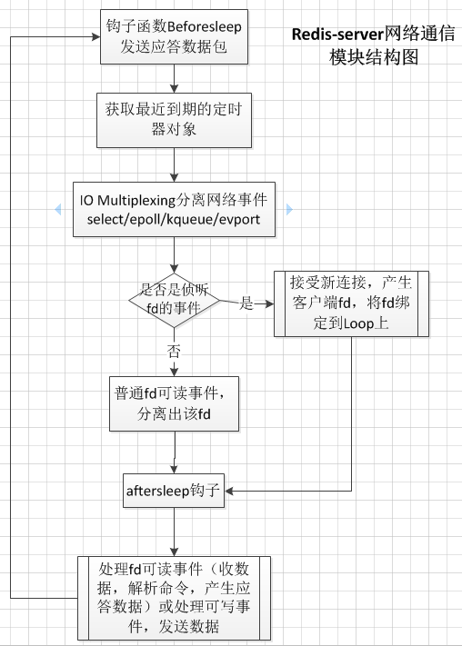

如上图所示，这就是典型的利用 **one loop one thread 思想实现的 reactor 网络通信模型**，也是目前最主流的网络通信架构。而且由于 redis-server 的网络通信中所有的**客户端 fd 和侦听 fd 都集中在一个 EventLoop 中，所以通常也说 Redis 的网络通信模型是单线程的。**


## 20.[实战] Redis 通信协议

### 探究 redis-cli 端的网络通信模型

我们接着探究一下 Redis 源码自带的客户端 redis-cli 的网络通信模块。

使用 GDB 运行 redis-cli 以后，原来打算按 Ctrl + C 快捷键让 GDB 中断查看一下 redis-cli 跑起来有几个线程，但是实验之后发现，这样并不能让 GDB 中断下来，反而会导致 redis-cli 这个进程退出。

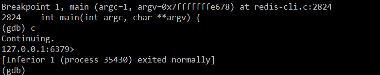

换个思路：直接运行 redis-cli ，然后使用linux“ **pstack [进程id]**”来**查看**下 redis-cli 的**线程数量**。

```bash
[root@localhost ~]# ps -ef | grep redis-cli
root     35454 12877  0 14:51 pts/1    00:00:00 ./redis-cli
root     35468 33548  0 14:51 pts/5    00:00:00 grep --color=auto redis-cli
[root@localhost ~]# pstack 35454
#0  0x00007ff39e13a6e0 in __read_nocancel () from /lib64/libpthread.so.0
#1  0x000000000041e1f1 in linenoiseEdit (stdin_fd=0, stdout_fd=1, buf=0x7ffc2c9aa980 "", buflen=4096, prompt=0x839618 <config+184> "127.0.0.1:6379> ") at linenoise.c:800
#2  0x000000000041e806 in linenoiseRaw (buf=0x7ffc2c9aa980 "", buflen=4096, prompt=0x839618 <config+184> "127.0.0.1:6379> ") at linenoise.c:991
#3  0x000000000041ea1c in linenoise (prompt=0x839618 <config+184> "127.0.0.1:6379> ") at linenoise.c:1059
#4  0x000000000040f92e in repl () at redis-cli.c:1404
#5  0x00000000004135d5 in main (argc=0, argv=0x7ffc2c9abb10) at redis-cli.c:2975
复制
```

通过上面的输出，发现 redis-cli 只有一个主线程，既然只有一个主线程，那么可以断定 redis-cli 中的发给 redis-server 的命令肯定都是同步的，这里同步的意思是发送命令后会一直等待服务器应答或者应答超时。

在 redis-cli 的 main 函数（位于文件 redis-cli.c 中）有这样一段代码：

```c++
/* Start interactive mode when no command is provided */
if (argc == 0 && !config.eval) {
    /* Ignore SIGPIPE in interactive mode to force a reconnect */
    signal(SIGPIPE, SIG_IGN);

    /* Note that in repl mode we don't abort on connection error.
    * A new attempt will be performed for every command send. */
    cliConnect(0);
    repl();
}
```

其中，cliConnect(0) 调用代码（位于 redis-cli.c 文件中）如下：

```c
static int cliConnect(int force) {
    if (context == NULL || force) {
        if (context != NULL) {
            redisFree(context);
        }

        if (config.hostsocket == NULL) {
            context = redisConnect(config.hostip,config.hostport);
        } else {
            context = redisConnectUnix(config.hostsocket);
        }

        if (context->err) {
            fprintf(stderr,"Could not connect to Redis at ");
            if (config.hostsocket == NULL)
                fprintf(stderr,"%s:%d: %s\n",config.hostip,config.hostport,context->errstr);
            else
                fprintf(stderr,"%s: %s\n",config.hostsocket,context->errstr);
            redisFree(context);
            context = NULL;
            return REDIS_ERR;
        }

        /* Set aggressive KEEP_ALIVE socket option in the Redis context socket
         * in order to prevent timeouts caused by the execution of long
         * commands. At the same time this improves the detection of real
         * errors. */
        anetKeepAlive(NULL, context->fd, REDIS_CLI_KEEPALIVE_INTERVAL);

        /* Do AUTH and select the right DB. */
        if (cliAuth() != REDIS_OK)
            return REDIS_ERR;
        if (cliSelect() != REDIS_OK)
            return REDIS_ERR;
    }
    return REDIS_OK;
}
```

这个函数做的工作可以分为三步：

- 第一步，`context = redisConnect(config.hostip,config.hostport);`
- 第二步，`cliAuth()`
- 第三步，`cliSelect()`

先来看第一步 redisConnect 函数，这个函数内部又调用 redisContextConnectTcp 函数，后者又调用 _redisContextConnectTcp 函数。_redisContextConnectTcp 函数是实际连接 redis-server 的地方，先调用 API getaddrinfo 解析传入进来的 IP 地址和端口号（我这里是 127.0.0.1 和 6379），然后创建 socket ，并将 socket 设置成非阻塞模式，接着调用 API connect 函数，由于 socket 是非阻塞模式，connect 函数会立即返回 −1 。

接着调用 redisContextWaitReady 函数，该函数中调用 API poll 检测连接的 socket 是否可写（ POLLOUT ），如果可写则表示连接 redis-server 成功。由于 _redisContextConnectTcp 代码较多，我们去掉一些无关代码，整理出关键逻辑的伪码如下（位于 net.c 文件中）：

```c
static int _redisContextConnectTcp(redisContext *c, const char *addr, int port,
                                   const struct timeval *timeout,
                                   const char *source_addr) {
    //省略部分无关代码...    

    rv = getaddrinfo(c->tcp.host,_port,&hints,&servinfo)) != 0

    s = socket(p->ai_family,p->ai_socktype,p->ai_protocol)) == -1

    redisSetBlocking(c,0) != REDIS_OK

    connect(s,p->ai_addr,p->ai_addrlen)

    redisContextWaitReady(c,timeout_msec) != REDIS_OK

    return rv;  // Need to return REDIS_OK if alright
}
```

redisContextWaitReady 函数的代码（ 位于 net.c 文件中 ）如下：

```c
static int redisContextWaitReady(redisContext *c, long msec) {
    struct pollfd   wfd[1];

    wfd[0].fd     = c->fd;
    wfd[0].events = POLLOUT;

    if (errno == EINPROGRESS) {
        int res;

        if ((res = poll(wfd, 1, msec)) == -1) {
            __redisSetErrorFromErrno(c, REDIS_ERR_IO, "poll(2)");
            redisContextCloseFd(c);
            return REDIS_ERR;
        } else if (res == 0) {
            errno = ETIMEDOUT;
            __redisSetErrorFromErrno(c,REDIS_ERR_IO,NULL);
            redisContextCloseFd(c);
            return REDIS_ERR;
        }

        if (redisCheckSocketError(c) != REDIS_OK)
            return REDIS_ERR;

        return REDIS_OK;
    }

    __redisSetErrorFromErrno(c,REDIS_ERR_IO,NULL);
    redisContextCloseFd(c);
    return REDIS_ERR;
}
```

使用 **b redisContextWaitReady** 增加一个断点，然后使用 **run** 命令重新运行下 **redis-cli**，程序会停在我们设置的断点出，然后使用 **bt** 命令得到当前调用堆栈：

```bash
(gdb) b redisContextWaitReady
Breakpoint 1 at 0x41bd82: file net.c, line 207.
(gdb) r
Starting program: /root/redis-4.0.11/src/redis-cli 
[Thread debugging using libthread_db enabled]
Using host libthread_db library "/lib64/libthread_db.so.1".

Breakpoint 1, redisContextWaitReady (c=0x83c050, msec=-1) at net.c:207
207        wfd[0].fd     = c->fd;
(gdb) bt
#0  redisContextWaitReady (c=0x83c050, msec=-1) at net.c:207
#1  0x000000000041c586 in _redisContextConnectTcp (c=0x83c050, addr=0x83c011 "127.0.0.1", port=6379, timeout=0x0, 
    source_addr=0x0) at net.c:391
#2  0x000000000041c6ac in redisContextConnectTcp (c=0x83c050, addr=0x83c011 "127.0.0.1", port=6379, timeout=0x0) at net.c:420
#3  0x0000000000416b53 in redisConnect (ip=0x83c011 "127.0.0.1", port=6379) at hiredis.c:682
#4  0x000000000040ce36 in cliConnect (force=0) at redis-cli.c:611
#5  0x00000000004135d0 in main (argc=0, argv=0x7fffffffe500) at redis-cli.c:2974
```

连接 redis-server 成功以后，会接着调用上文中提到的 cliAuth 函数和 cliSelect 函数，这两个函数分别根据是否配置了 config.auth 和 config.dbnum 来给 redis-server 发送相关命令。由于我们这里没配置，因此这两个函数实际什么也不做。

```c
583     static int cliSelect(void) {
(gdb) n
585         if (config.dbnum == 0) return REDIS_OK;
(gdb) p config.dbnum
$11 = 0
```

接着调用 repl() 函数，在这个函数中是一个 while 循环，不断从命令行中获取用户输入：

```c
//位于 redis-cli.c 文件中
static void repl(void) {
    //...省略无关代码...
    while((line = linenoise(context ? config.prompt : "not connected> ")) != NULL) {
        if (line[0] != '\0') {
            argv = cliSplitArgs(line,&argc);
            if (history) linenoiseHistoryAdd(line);
            if (historyfile) linenoiseHistorySave(historyfile);

            if (argv == NULL) {
                printf("Invalid argument(s)\n");
                linenoiseFree(line);
                continue;
            } else if (argc > 0) {
                if (strcasecmp(argv[0],"quit") == 0 ||
                    strcasecmp(argv[0],"exit") == 0)
                {
                    exit(0);
                } else if (argv[0][0] == ':') {
                    cliSetPreferences(argv,argc,1);
                    continue;
                } else if (strcasecmp(argv[0],"restart") == 0) {
                    if (config.eval) {
                        config.eval_ldb = 1;
                        config.output = OUTPUT_RAW;
                        return; /* Return to evalMode to restart the session. */
                    } else {
                        printf("Use 'restart' only in Lua debugging mode.");
                    }
                } else if (argc == 3 && !strcasecmp(argv[0],"connect")) {
                    sdsfree(config.hostip);
                    config.hostip = sdsnew(argv[1]);
                    config.hostport = atoi(argv[2]);
                    cliRefreshPrompt();
                    cliConnect(1);
                } else if (argc == 1 && !strcasecmp(argv[0],"clear")) {
                    linenoiseClearScreen();
                } else {
                    long long start_time = mstime(), elapsed;
                    int repeat, skipargs = 0;
                    char *endptr;

                    repeat = strtol(argv[0], &endptr, 10);
                    if (argc > 1 && *endptr == '\0' && repeat) {
                        skipargs = 1;
                    } else {
                        repeat = 1;
                    }

                    issueCommandRepeat(argc-skipargs, argv+skipargs, repeat);

                    /* If our debugging session ended, show the EVAL final
                     * reply. */
                    if (config.eval_ldb_end) {
                        config.eval_ldb_end = 0;
                        cliReadReply(0);
                        printf("\n(Lua debugging session ended%s)\n\n",
                            config.eval_ldb_sync ? "" :
                            " -- dataset changes rolled back");
                    }

                    elapsed = mstime()-start_time;
                    if (elapsed >= 500 &&
                        config.output == OUTPUT_STANDARD)
                    {
                        printf("(%.2fs)\n",(double)elapsed/1000);
                    }
                }
            }
            /* Free the argument vector */
            sdsfreesplitres(argv,argc);
        }
        /* linenoise() returns malloc-ed lines like readline() */
        linenoiseFree(line);
    }
    exit(0);
}
```

得到用户输入的一行命令后，先保存到历史记录中（以便下一次按键盘上的上下箭头键再次输入），然后校验命令的合法性，如果是本地命令（不需要发送给服务器的命令，如 quit 、exit）则直接执行，如果是远端命令则调用 issueCommandRepeat() 函数发送给服务器端：

```c
//位于文件 redis-cli.c 中
static int issueCommandRepeat(int argc, char **argv, long repeat) {
    while (1) {
        config.cluster_reissue_command = 0;
        if (cliSendCommand(argc,argv,repeat) != REDIS_OK) {
            cliConnect(1);

            /* If we still cannot send the command print error.
             * We'll try to reconnect the next time. */
            if (cliSendCommand(argc,argv,repeat) != REDIS_OK) {
                cliPrintContextError();
                return REDIS_ERR;
            }
         }
         /* Issue the command again if we got redirected in cluster mode */
         if (config.cluster_mode && config.cluster_reissue_command) {
            cliConnect(1);
         } else {
             break;
        }
    }
    return REDIS_OK;
}
```

实际发送命令的函数是 cliSendCommand，在 cliSendCommand 函数中又调用 cliReadReply 函数，后者又调用 redisGetReply 函数，在 redisGetReply 函数中又调用 redisBufferWrite 函数，在 redisBufferWrite 函数中最终调用系统 API write 将我们输入的命令发出去：

```c
//位于 hiredis.c 文件中
int redisBufferWrite(redisContext *c, int *done) {
    int nwritten;

    /* Return early when the context has seen an error. */
    if (c->err)
        return REDIS_ERR;

    if (sdslen(c->obuf) > 0) {
        nwritten = write(c->fd,c->obuf,sdslen(c->obuf));
        if (nwritten == -1) {
            if ((errno == EAGAIN && !(c->flags & REDIS_BLOCK)) || (errno == EINTR)) {
                /* Try again later */
            } else {
                __redisSetError(c,REDIS_ERR_IO,NULL);
                return REDIS_ERR;
            }
        } else if (nwritten > 0) {
            if (nwritten == (signed)sdslen(c->obuf)) {
                sdsfree(c->obuf);
                c->obuf = sdsempty();
            } else {
                sdsrange(c->obuf,nwritten,-1);
            }
        }
    }
    if (done != NULL) *done = (sdslen(c->obuf) == 0);
    return REDIS_OK;
}
```

### 分析输入 set hello world 指令后的执行流

使用 **b redisBufferWrite** 增加一个断点，然后使用 **run** 命令将 **redis-cli** 重新运行起来，接着在 **redis-cli** 中输入 **set hello world** （**hello** 是 key， **world** 是 value）这一个简单的指令后，使用 **bt** 命令查看调用堆栈如下：

```bash
(gdb) b redisBufferWrite
Breakpoint 2 at 0x417020: file hiredis.c, line 835.
(gdb) r
Starting program: /root/redis-4.0.11/src/redis-cli 
[Thread debugging using libthread_db enabled]
Using host libthread_db library "/lib64/libthread_db.so.1".

Breakpoint 2, redisBufferWrite (c=0x83c050, done=0x7fffffffe1cc) at hiredis.c:835
835        if (c->err)
(gdb) c
Continuing.
127.0.0.1:6379> set hello world

Breakpoint 2, redisBufferWrite (c=0x83c050, done=0x7fffffffe27c) at hiredis.c:835
835        if (c->err)
(gdb) bt
#0  redisBufferWrite (c=0x83c050, done=0x7fffffffe27c) at hiredis.c:835
#1  0x0000000000417246 in redisGetReply (c=0x83c050, reply=0x7fffffffe2a8) at hiredis.c:882
#2  0x000000000040d9a4 in cliReadReply (output_raw_strings=0) at redis-cli.c:851
#3  0x000000000040e16c in cliSendCommand (argc=3, argv=0x8650c0, repeat=0) at redis-cli.c:1011
#4  0x000000000040f153 in issueCommandRepeat (argc=3, argv=0x8650c0, repeat=1) at redis-cli.c:1288
#5  0x000000000040f869 in repl () at redis-cli.c:1469
#6  0x00000000004135d5 in main (argc=0, argv=0x7fffffffe500) at redis-cli.c:2975
```

当然，待发送的数据需要存储在一个全局静态变量 context 中，这是一个结构体，定义在 hiredis.h 文件中。

```c
/* Context for a connection to Redis */
typedef struct redisContext {
    int err; /* Error flags, 0 when there is no error */
    char errstr[128]; /* String representation of error when applicable */
    int fd;
    int flags;
    char *obuf; /* Write buffer */
    redisReader *reader; /* Protocol reader */

    enum redisConnectionType connection_type;
    struct timeval *timeout;

    struct {
        char *host;
        char *source_addr;
        int port;
    } tcp;

    struct {
        char *path;
    } unix_sock;

} redisContext;
```

**其中字段 obuf 指向的是一个 sds 类型的对象，这个对象用来存储当前需要发送的命令。这也同时解决了命令一次发不完需要暂时缓存下来的问题。**

在 redisGetReply 函数中发完数据后立马调用 **redisBufferRead** 去收取服务器的应答。

```c
int redisGetReply(redisContext *c, void **reply) {
    int wdone = 0;
    void *aux = NULL;

    /* Try to read pending replies */
    if (redisGetReplyFromReader(c,&aux) == REDIS_ERR)
        return REDIS_ERR;

    /* For the blocking context, flush output buffer and read reply */
    if (aux == NULL && c->flags & REDIS_BLOCK) {
        /* Write until done */
        do {
            if (redisBufferWrite(c,&wdone) == REDIS_ERR)
                return REDIS_ERR;
        } while (!wdone);

        /* Read until there is a reply */
        do {
            if (redisBufferRead(c) == REDIS_ERR)
                return REDIS_ERR;
            if (redisGetReplyFromReader(c,&aux) == REDIS_ERR)
                return REDIS_ERR;
        } while (aux == NULL);
    }

    /* Set reply object */
    if (reply != NULL) *reply = aux;
    return REDIS_OK;
}
```

拿到应答后就可以解析并显示在终端了。

总结起来，redis-cli 是一个实实在在的网络同步通信方式，只不过通信的 socket 仍然设置成非阻塞模式，这样有如下三个好处：

（1）使用 connect 连接服务器时，connect 函数不会阻塞，可以立即返回，之后调用 poll 检测 socket 是否可写来判断是否连接成功。

（2）在发数据时，如果因为对端 tcp 窗口太小发不出去，write 函数也会立即返回不会阻塞，此时可以将未发送的数据暂存，下次继续发送。

（3）在收数据时，如果当前没有数据可读，则 read 函数也不会阻塞，程序可以立即返回，继续响应用户的输入。

### Redis 的通信协议格式

redis-server 的通信协议格式是典型的以特定分隔符为界限的代表，这里的分隔符是 `\r\n`。

#### **请求命令格式**

Redis 请求命令的一条数据的协议格式如下：

```
*<参数数量>\r\n
$<参数1的字节数量>\r\n
<参数1的数据>\r\n
$<参数2的字节数量>\r\n
<参数2的数据>\r\n
...
$<参数n的字节数量>\r\n
<参数n的数据>\r\n
```

Redis 命令本身也作为协议的其中一个参数来发送的。举个例子，我们接着通过 redis-cli 给 redis-server 发送 一条 `set hello world` 命令。

```bash
127.0.0.1:6379> set hello world
```

此时服务器端收到的数据格式如下：

```
*3\r\n
$3\r\n
set\r\n
$5\r\n
hello\r\n
$5\r\n
world\r\n
```

- 第一行的 `*3\r\n` 以星号开始，数字 3 是接下来**参数的数量**：“set”、“hello”、“world”一共三个参数；
- 第二行的 `$3\r\n` 中的数字 3 是接下来**第 1 个参数** `set` 命令的**字节数目**；
- 第三行 `set\r\n` 是**参数 1** `set` 命令的**内容**；
- 第四行 `$5\r\n` 是**参数 2** `hello` 的**字节长度**；
- 第五行 `hello\r\n` 是**参数 2** `hello` 的**内容**；
- 第六行 `$5\r\n` 数字 5 是**参数 3** `world` 的**字节数**；
- 第七行 `world\r\n` 是**参数 3** 的**内容**。

每一行都以 `\r\n` 结束，表示参数数量以 `*****` 开头，实际内容的字节数量的行以 `$` 开头，实际内容无特殊符号标记。

#### **应答命令格式**

Redis 的应答命令有很多种情形，如下所示：

- 状态回复（status reply）的第一个字节是 `"+"`
- 错误回复（error reply）的第一个字节是 `"-"`
- 整数回复（integer reply）的第一个字节是 `":"`
- 批量回复（bulk reply）的第一个字节是 `"$"`
- 多条批量回复（multi bulk reply）的第一个字节是 `"*"`

不同的应答类型的第一个字节开始的标识符不一样，我们来逐一介绍一下：

**1. 状态回复**

一个状态回复以 `"+"` 开始、 `"\r\n"` 结尾的单行字符串，格式：

```
+状态信息\r\n
```

例如：

```
+OK
```

显示这个结果的客户端应该显示 `"+"` 号之后的所有内容，对于上面这个例子，客户端就应该显示字符串 `"OK"`。

状态回复用于那些不需要返回数据的命令返回。

**2. 错误回复**

状态回复的第一个字节是 `"+"`，而错误回复的第一个字节是 `"-"`。格式：

```
-错误信息\r\n
```

错误回复只在某些地方出现问题时产生，例如当用户执行一个不存在的命令或者对不正确的数据类型执行命令等等，一个客户端库应该在收到错误回复时产生一个异常。例如我们在前面章节介绍 redis-server 达到最大连接数时返回的错误信息就属于错误回复。

```
-ERR max number of clients reached\r\n
```

在 `"-"` 之后，直到遇到第一个空格或新行为止，这中间的内容表示所返回错误的类型。

ERR 是一个通用错误，还有另外一种叫 WRONGTYPE 的错误类型，这表示一个特定的错误。 一个自实现客户端可以根据错误类型自定义自己的处理逻辑。Redis 定义了非常多的 WRONGTYPE。例如：

```
-WRONGTYPE Operation against a key holding the wrong kind of value\r\n
```

以上错误信息定义与 `redismodule.h 139` 行。

**3. 整数回复**

整数回复就是一个以 `":"` 开头，CRLF 结尾的字符串表示的整数。格式：

```
:整数值\r\n
```

例如，`":0\r\n"` 和 `":1000\r\n"` 都是整数回复。

Redis 有 `INCR key` 和 `LASTSAVE` 返回整数，前者返回键自增后的整数值，后者则返回一个 UNIX 时间戳，返回值的唯一限制是这些数必须能够用 64 位有符号整数表示。

还有一种情况，整数回复用于表示逻辑布尔判断，例如 `EXISTS key` 和 `SISMEMBER key member`（判断 member 元素是否集合 key 的成员。）也使用返回值 1 表示真，返回 0 表示假。

其他一些命令例如 SADD、SREM、SETNX 只在操作真正被执行了的时候，才返回 1，否则返回 0。

Redis 返回整数回复有 SETNX、DEL、EXISTS、INCR、INCRBY、DECR、DECRBY、DBSIZE、LASTSAVE、RENAMENX、MOVE、LLEN、SADD、SREM、SISMEMBER、SCARD 等。

**4. 批量回复（Bulk Reply）**

服务器使用批量回复来返回二进制安全的字符串，字符串的最大长度为 512 MB。

```
client：GET someKey\r\n
server：someValue\r\n
```

服务器发送的内容中：

- 第一字节为 `"$"` 符号
- 接下来跟着的是表示实际回复长度的数字值
- 接下来跟着一个 CRLF
- 再后面跟着的是实际回复数据
- 最末尾是另一个 CRLF

对于 `GET someKey` 命令，服务器实际发生的内容为：

```
"$9\r\nsomeValue\r\n"
```

如果被请求的 redis key 不存在，那么批量回复会将使用 `-1` 这一特殊值作为长度值，即：

```
client：GET nonExistedKey\r\n
server: $-1\r\n
```

这种回复称为空批量回复（NULL Bulk Reply）。

当请求对象不存在时，客户端应该返回空对象，而不是空字符串，即对应 C/C++ 语言中的 NULL、Java 的中 null、Golang 的 nil。

**5. 多条批量回复（Multi Bulk Reply）**

对于 `LRANGE key start stop` 这样的命令需要返回多个值，这一目标可以通过多条批量回复来完成。

多条批量回复是由多个回复组成的数组，数组中的每个元素都可以是任意类型的回复，包括多条批量回复本身。

多条批量回复的第一个字节为 `"*"`，后跟一个整数值表示多条批量回复的数量，接着是各个回复的长度和内容，长度前面以 `$` 开头。

```
client： LRANGE numberList 0 3\r\n
server： *4\r\n
server： $5\r\n
server： First\r\n
server： $6\r\n
server： Second\r\n
server： $5\r\n
server： Third\r\n
server： $6\r\n
server： Fourth\r\n
```

多条批量回复所使用的格式和客户端发送命令时使用的统一请求协议的格式一模一样。 服务器应答命令时所发送的多条批量回复不必是统一的类型，例如以下示例展示了一个多条批量回复，回复中包含 3 个整数值和一个字符串：

```
*4\r\n
:1\r\n
:2\r\n
:3\r\n
$10\r\n
someString\r\n
```

在回复的第一行，服务器发送 `*4\r\n`，表示这个多条批量回复包含 5 条回复，再后面跟着的则是 5 条回复的内容。

当然，多条批量回复也可以是空白的（empty），例如：

```
client： LRANGE nokey 0 1
server： *0\r\n
```

无内容的多条批量回复（null multi bulk reply）也是存在的，例如命令 `BLPOP key [key …] timeout` 阻塞超时后，它悔返回一个无内容的多条批量回复，这个回复的计数值为 `-1`：

```
客户端： BLPOP key 1
服务器： *-1\r\n
```

客户端库应该区别对待空白多条回复和无内容多条回复：当 Redis 返回一个无内容多条回复时，客户端库应该返回一个 null 对象，而不是一个空数组。

**多条批量回复中的空元素**

注意：多条批量回复中的元素可以将自身的长度设置为 `-1`，从而表示该元素不存在，并且也不是一个空白字符串（empty string）。

例如，当

```
SORT key [BY pattern] [LIMIT offset count] [GET pattern [GET pattern …]] [ASC | DESC] [ALPHA] [STORE destination]
```

命令使用 `GET pattern` 选项对一个不存在的键进行操作时，就会发生多条批量回复中带有空白元素的情况。

以下示例展示了一个包含空元素的多重批量回复：

```
服务器： *3
服务器： $7
服务器： element
服务器： $-1
服务器： $4
服务器： item
```

上述回复中的第二个元素为空。

对于这个回复，客户端库应该返回类似于这样的回复：

```
["element", null, "item"]
或
["element", nil, "item"]
```

#### **多命令和流水线**

客户端可以通过流水线在一次发送操作中发送多个命令，客户端可能得到：

- 在发送新命令之前不必阅读前一个命令的回复
- 多个命令的回复会在最后一并返回

#### **特殊的 redis-cli 与内联命令**

某些情况下你需要和 Redis 服务器进行通信，但又找不到 `redis-cli`，而手上只有 telnet、nc 等命令的时候，你可以通过 Redis 特别为这种情形而设的内联命令格式来发送命令。

以下是一个客户端和服务器使用内联命令来进行交互的例子：

```
client： PING
server： +PONG
```

以下另一个返回整数值的内联命令的例子：

```
client： EXISTS someKey
server： :0
```


因为没有了统一请求协议中的 `"*"` 项来声明参数的数量，所以在 `telnet` 会话输入命令的时候，必须使用空格来分割各个参数，服务器在接收到数据之后，会按空格对用户的输入进行解析并获取其中的命令参数。

以下是使用 nc 命令测试的结果：

```bash
[root@myaliyun src]# nc -v 127.0.0.1 6379
Ncat: Version 7.50 ( https://nmap.org/ncat )
Ncat: Connected to 127.0.0.1:6379.
PING
+PONG
EXISTS someKey    
:0
GET HELLO WORLD
-ERR wrong number of arguments for 'get' command
GET HELLO
$-1
SET HELLO WORLD
+OK
GET HELLO
$5
WORLD
```

上述代码中连接成功后 nc 客户端和 redis-server 的应答如下：

```
client: PING
server: PONG
client: EXISTS someKey
server: :0
client: GET HELLO WORLD
server: -ERR wrong number of arguments for 'get' command
client: GET HELLO
server: $-1
client: SET HELLO WORLD
server: +OK
client: GET HELLO
server: $5
server: WORLD
```

这里留给读者一个思考题，上述操作中，client 和 server 每次一行结尾的换行符是什么内容？`\r\n` 还是 `\n`？

Redis 官方的协议规范链接是：

> https://redis.io/topics/protocol

掌握了 Redis 的通信协议，你可以以不同的编程语言来设计不同的 Redis 客户端。

### 小结

至此，我们将 Redis 的服务端和客户端的网络通信模块分析完了，Redis 的通信模型是非常常见的网络通信模型。Redis 也是目前业界使用最多的内存数据库，它不仅开源，而且源码量也不大，其中用到的数据结构（ 字符串、链表、集合等 ）都有自己的高效实现，是学习数据结构知识非常好的材料。想成为一名合格的服务器端开发人员，应该去学习它、用好它。

------

好了，关于 GDB 调试的课程到这里基本就结束了，但是 GDB 更多的调试技巧等着亲爱的读者你去发现。如果对课程内容有任何意见，或者想与我做进一步交流，欢迎通过以下公众号或读者群与我取得联系。学习、研究和分享高性能服务器开发技术，我们是认真的。


