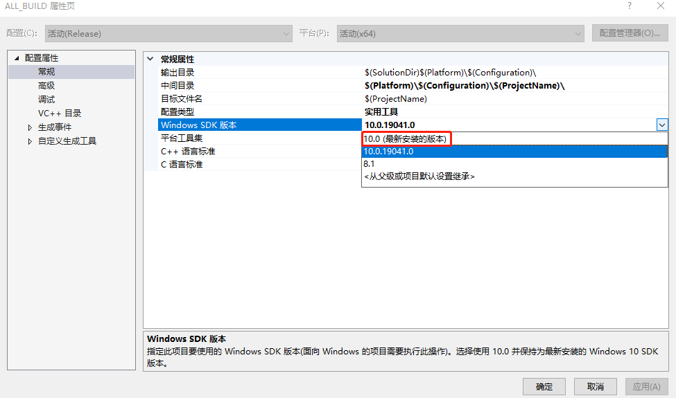

# 安装grpc

## linux 安装 grpc

1. clone grpc 仓库

   ```bash
   git clone git@github.com:grpc/grpc.git
   cd grpc
   ./set_url.sh
   git submodule update --init or git submodule update --init --recursive
   
   
   ```

   [set_url.sh](./set_url.sh)

2. 安装依赖

   - 安装 abseil-cpp：

     ```bash
     cd grpc/third_party/abseil-cpp
     mkdir build && cd build
     cmake ..
     make && make install
     ```

   - 安装protobuf：

     ```bash
     cd grpc/third_party/protobuf
     mkdir build && cd build
     cmake ..
     make -j4
     sudo make install
     ```

     

3. 编译

   ```bash
   cmake -DgRPC_INSTALL=ON -DgRPC_BUILD_TESTS=OFF -DCMAKE_INSTALL_PREFIX=../_install ..	# 默认生成是静态库，如果想要生成动态库：-DBUILD_SHARED_LIBS=ON
   make -j 4
   make install
   ```

4. 设置环境变量

   ```bash
   grpc_root=/mnt/d/WorkSpace/4openSourceCode/grpc/_install
   grpc_bin=${grpc_root}/bin
   grpc_include=${grpc_root}/include
   grpc_lib=${grpc_root}/lib
   
   export CPLUS_INCLUDE_PATH=${grpc_include}:$CPLUS_INCLUDE_PATH
   export LIBRARY_PATH=${grpc_lib}:$LIBRARY_PATH
   export LD_LIBRARY_PATH=${grpc_lib}:$LD_LIBRARY_PATH
   export PATH=${grpc_include}:${grpc_root}:${cgdb_bin}:$PATH
   ```

   

cmake 编译错误：

1. ```cmake
   -- Checking for module 'libsystemd>=233'
   --   No package 'libsystemd' found
   ```

   解决：

   ```bash
   sudo apt install libsystemd libsystemd-dev
   ```

2. ```cmake
   CMake Warning at cmake/protobuf.cmake:51 (message):
     gRPC_PROTOBUF_PROVIDER is "module" but PROTOBUF_ROOT_DIR is wrong
   Call Stack (most recent call first):
     CMakeLists.txt:332 (include)
   ```

   解决：可能之前装的pb版本不对，要依赖thirty_party中的pb。

   
   
3. ```cmake
   CMake Warning at third_party/abseil-cpp/CMakeLists.txt:72 (message):
     A future Abseil release will default ABSL_PROPAGATE_CXX_STD to ON for CMake
     3.8 and up.  We recommend enabling this option to ensure your project still
     builds correctly.
   ```

   解决：cmakeLists.txt中添加

   ```cmake
   set(ABSL_PROPAGATE_CXX_STD ON)
   ```
   
   这个警告可以忽略。

4.   ```bash
     grpc/examples/cpp/helloworld/greeter_async_client.cc:23:10: fatal error: absl/flags/flag.h: No such file or directory
        23 | #include "absl/flags/flag.h"
     ```

     解决：

     ```bash
     cd grpc/third_party/abseil-cpp/
     mkdir build
     cmake -B build
     cmake --build build or cd build && sudo make
     cmake --install build or cd build && sudo make install
     ```

     

5.   

   

   

## windows 安装 grpc

安装git、cmake、go。

1. clone grpc

2. ```bash
   打开cmd
   cd grpc
   md _build_vs2019\Release or md _build_vs2019\Debug
   cd _build_vs2019\Release 	
   cmake ../../ -G "Visual Studio 16 2019" -DCMAKE_INSTALL_PREFIX=../../_install_vs2019/Release
   cmake --build . --config Release
   cmake --install .
   ```

3. compile problem

   1. 

   ```bash
   fatal error C1083: 无法打开包括文件: “stdalign.h”: No such file or directory
   ```
   解决：【项目】->【属性】->选择widnows sdk 版本到最新安装的版本。 还是报错？？？

   

   
   
   2. 


## 跨平台编译

https://github.com/grpc/grpc/blob/master/BUILDING.md#cross-compiling


https://grpc.io/docs/languages/cpp/quickstart/

https://github.com/grpc/grpc/blob/master/BUILDING.md

https://blog.csdn.net/cplcdk/article/details/127241905

https://blog.csdn.net/Aidam_Bo/article/details/114845688?utm_medium=distribute.pc_relevant.none-task-blog-2~default~baidujs_baidulandingword~default-0-114845688-blog-125272337.pc_relevant_default&spm=1001.2101.3001.4242.1&utm_relevant_index=3

https://blog.csdn.net/cucgyfjklx/article/details/122618536

https://blog.csdn.net/manageruser/article/details/126736076

https://www.likecs.com/show-305683643.html


https://zhuanlan.zhihu.com/p/589436751?utm_id=0

https://zhuanlan.zhihu.com/p/520814232

https://codeantenna.com/a/D9tTUSvrUK

http://www.guoxiaolong.cn/blog/?id=12257

https://blog.csdn.net/yuanshenqiang/article/details/119604765

https://www.gresearch.com/blog/article/lessons-learnt-from-writing-asynchronous-streaming-grpc-services-in-c/

https://github.com/G-Research/grpc_async_examples/blob/master/async_streaming_server_queue_to_front.cc

https://github.com/apache/brpc/blob/master/README_cn.md

https://zhuanlan.zhihu.com/p/389328756

https://learn.microsoft.com/zh-cn/aspnet/core/grpc/loadbalancing?view=aspnetcore-7.0


# reference

https://grpc.io/

https://github.com/grpc/grpc

