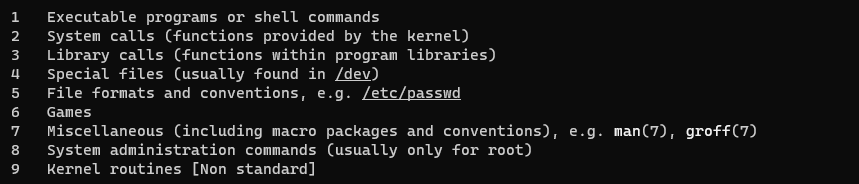

## SCP

- 从远程拷贝多个文件到本地

  ```
  scp USER@HOST:/\{ 1.txt,2.json,3.py,4.sh \}
  ```
  
- 从远程拷贝多个文件，多个文件夹到本地

  ```
  scp -r USER@HOST:/\{ 1.txt,2.json,3.py,4.sh,folder \}
  ```

  

- **references:**

  https://www.binarytides.com/linux-scp-command/

## grep

- **-A<显示行数> 或 --after-context=<显示行数>** : 除了显示符合范本样式的那一列之外，并显示该行之后的内容。
- **-B<显示行数> 或 --before-context=<显示行数>** : 除了显示符合样式的那一行之外，并显示该行之前的内容。

- **-E 或 --extended-regexp** : 将样式为延伸的正则表达式来使用。

- **-n 或 --line-number** : 在显示符合样式的那一行之前，标示出该行的列数编号。


- **-o 或 --only-matching** : 只显示匹配PATTERN 部分。
- **-P, --perl-regexp** : PATTERN is a Perl regular expression


- **匹配关键字之前和之后的N个字符**

```
grep -E -o ".{0,5}test_pattern.{0,5}" test.txt 
cat test.txt | grep -E -o ".{0,5}test_pattern.{0,5}"
grep -P -o ".{0,5}test_pattern.{0,5}" test.txt 
```


- references:

   https://cloud.tencent.com/developer/ask/29626

## cut

- 

- references: 

  http://linux.51yip.com/search/cut


## head

- 

- 查看文件前几行内容

  ```
  head -n 10 xx.txt
  ```

- 

## tail

- 

- 查看文件的最后几行内容

  ```
  tail -n 10 xxx.txt
  ```


## sed

- 

- 查看文件第a行到第b行的内容。

  - 第一种方法：

    ```
    sed -n 'a,bp' xxx.txt
    sed -n '5,10p' xxx.txt	//查看第5行到第10行的内容
    ```

  - 第二种方法

    ```
    cat xxx.txt | tail -n +a | head -n b-a
    cat xxx.txt | tail -n +3000 | head -n 1000 	// 显示从第3000行到3999行
    ```

    ```
    cat xxx.txt | head -n b | tail -n +a
    cat xxx.txt | head -n 4000 | tail -n +3000	// 显示从第3000行到4000行
    ```


  ```
  tail -n 1000 	// 显示最后1000行的内容。
  tail -n +1000	// 从第1000行开始显示，显示之后的内容。
  head -n 1000 	// 显示前面1000行内容。
  ```

- 批量替换文件中指定的字符串

  ```
  sed -i 's/Search_String/Replacement_String/g' Input_File
  
  sudo sed -i 's/archive.ubuntu.com/mirrors.163.com/g' sources.list
  sudo sed -i 's/archive.ubuntu.com/mirrors.aliyun.com/g' sources.list
  ```


**references:** 

https://linux.cn/article-11367-1.html

https://www.linuxprobe.com/sed-find-replace.html

## cp

- 复制某个文件并且重命名

```
cp a.txt /tmp/b.txt
```


## strip

移除可执行程序中的调试信息。


## whatis

- 可以使用 `whatis` 查看某个命令都有哪些功能。

  ```
  whatis sleep
  ```

  


## man




1. **用户命令**

   ```
   man 1 cd
   ```

2. 系统调用

   ```
   man 2 read
   ```

3. 标准库调用

   ```
   man 3 sleep
   ```

4. 特殊文件(设备文件)

   ```
   man 4 tty
   ```

5. 文件格式(配置文件的语法)

   ```
   man 5 passwd
   ```

6. 游戏

7. 杂项

8. 系统管理员命令

   ```
   man 8 fdisk
   ```

9. 和内核有关的文件


references: https://cloud.tencent.com/developer/article/1725969?from=information.detail.linux%20man%201%202%203


