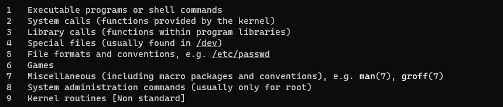

# apt

```bash
apt-get update 	# 获取最新软件**列表** 
apt-get upgrade # 升级最新列表软件 
apt-cache search vim	# 查询软件列表 
apt-get install qt5-default qtcreator qt5-doc #安装软件 
apt-get remove vim 	#卸载软件 
apt --help

apt-cache depends maven # 查看maven都依赖哪些软件
apt-rdepends -r maven
```

## 安装软件包

```bash
apt-get install PackageName // 普通安装
apt-get install PackageName=VersionName // 安装指定包的指定版
apt-get --reinstall install PackageName // 重新安装
apt-get build-dep PackageName // 安装源码包所需要的编译环境
apt-get -f install // 修复依赖关系
apt-get source PackageName // 下载软件包的源码
# 例如安装一些工具：sudo apt-get install g++ gcc gdb make cmake vim
```


## 卸载软件包

```bash
apt-get remove PackageName # 删除软件包, 保留配置文件
apt-get --purge remove PackageName # 删除软件包, 同时删除配置文件
apt-get purge PackageName # 删除软件包, 同时删除配置文件
apt-get autoremove PackageName # 删除软件包, 同时删除为满足依赖而自动安装且不再使用的软件包
apt-get --purge autoremove PackageName # 删除软件包, 删除配置文件,删除不再使用的依赖包
apt-get clean && apt-get autoclean # 清除 已下载的软件包 和 旧软件包
```


## 更新软件包

```bash
apt-get update // 更新安装源（Source）
apt-get upgrade // 更新已安装的软件包
apt-get dist-upgrade //更新已安装的软件包（识别并处理依赖关系的改变）
```


## 查询软件包

```bash
dpkg -l // 列出已安装的所有软件包
apt-cache search PackageName // 搜索软件包
apt-cache show PackageName // 获取软件包的相关信息, 如说明、大小、版本等
apt-cache depends PackageName // 查看该软件包需要哪些依赖
apt-cache rdepends PackageName // 查看该软件包被哪些包依
apt-get check // 检查是否有损坏的依赖
```


# cut


## references: 

  http://linux.51yip.com/search/cut

# cp

## 复制某个文件并且重命名

```bash
cp a.txt /tmp/b.txt
```

# c++filt 

```bash
c++filt _Z5printIiJiEEvRKT_DpRKT0_	# 根据函数符号反推回函数
```


# echo

- -e：如果字符串中有转义字符，则输出转义后的结果。

  ```bash
  ~$ echo -e "abc\nsd"
  abc
  sd
  ~$ echo "abc\nsd"
  abc\nsd
  ```

- -n：不换行输出，字符串输出后不自动换行.

  ```bash
  hchy@DESKTOP-EI7DNUT:~$ echo -n "abc\nsd"
  abc\nsdhchy@DESKTOP-EI7DNUT:~$
  ```

  


# grep

## 参数
- **-A<显示行数> 或 --after-context=<显示行数>** : print NUM lines of leading context  (除了显示符合范本样式的那一列之外，并显示该行之后的内容。)

- **-B<显示行数> 或 --before-context=<显示行数>** :  print NUM lines of trailing context (除了显示符合样式的那一行之外，并显示该行之前的内容。)

- -C：显示匹配行及其**前后**的指定行数。

- **-E 或 --extended-regexp** : PATTERN is an extended regular expression (将样式为延伸的正则表达式来使用。)

    ```bash
    grep -E "^m" test.txt # 找到以m开头的行
    grep -E "^m" test.txt -i # 找到以m开头的行,忽略大小写
    grep -E "[0-9]" test.txt #模糊匹配 带数字的字段
    grep -E "^1[3-9][0-9]{9}" # 匹配电话号码 
    	# ^1代表以1开头
    	# [3-9]: 第二个数字从3到9之间匹配
    	# [0-9]: 第三个数字从0到9之间匹配
    	# {9}: 表示匹配9次，因为电话号码11位，9+3
    ```

    

- -c：只显示匹配行的计数。

- **-i 或 --ignore-case** : ignore case distinctions (忽略字符大小写的差别。)

- -l：只列出包含匹配字符串的文件名。

- **-n 或 --line-number** :print line number with output lines (在显示符合样式的那一行之前，标示出该行的列数编号。)


- **-o 或 --only-matching** :show only the part of a line matching PATTERN (只显示匹配PATTERN 部分。)
- **-P 或 --perl-regexp** : PATTERN is a Perl regular expression
- **-r 或 --recursive**: like --directories=recurse (此参数的效果和指定"-d recurse"参数相同。)
- **-v 或 --invert-match** : select non-matching lines (显示不包含匹配文本的所有行。)
- -w：匹配整个单词。


## 匹配关键字之前和之后的N个字符

```bash
#这种适用于一个大文件中只有一行的情况下查找匹配项
grep -E -o ".{0,5}test_pattern.{0,5}" test.txt 
cat test.txt | grep -E -o ".{0,5}test_pattern.{0,5}"
grep -P -o ".{0,5}test_pattern.{0,5}" test.txt 
```

### example

```bash
#这将匹配"string"的前三个字符和后四个字符
echo "some123_string_and_another" | grep -o -P '.{0,3}string.{0,4}'	#23_string_and
```

```bash
#下面文本包含以下内容
test.txt:

abcd
0123_45_6789
efgh
```

```bash
#这将匹配 test.txt文件中 “45” 的前4个字符和后5个字符
grep -E -o ".{0,4}45.{0,5}" test.txt	#123_45_6789
```


## 匹配关键字之前的n行和之后的n行

```bash
grep -Bn An "test_pattern" test.txt
```

### example
```bash
test.txt:

eretrtrt
sdsdfsddf
abcd
0123_45_6789
efgh
errterer
vdghdbdvsd
vvdhbrfwewec
```

```bash
grep -B1 -A1 "45" test.txt

#结果: 
abcd
0123_45_6789
efgh
```


## references:

   https://cloud.tencent.com/developer/ask/29626

   https://www.runoob.com/linux/linux-comm-grep.html


# head


## 查看文件前几行内容

```bash
head -n 10 xx.txt
```

# lsb_release

LSB是Linux Standard Base的缩写， **lsb_release命令** 用来显示Linux发行版的相关信息。

```bash
sudo apt install lsb-release
lsb_release -a
cat /etc/os-release # 这个命令会输出一个包含操作系统识别信息的文件内容，其中也包含了Ubuntu的版本信息。
cat /etc/issue
```

# lsof

list open files：列出当前系统打开文件的工具。

```bash
lsof -i:8000	#查看8000端口占用的情况
```

# ln

软连接

```bash
ln -s 源文件名 软连接文件名  # 创建软连接
```

硬链接

```bash
ln -s 源文件名 硬连接文件名  # 创建软连接 两个文件结构体指针指向同一个inode
```


# man




1. **用户命令**

   ```bash
   man 1 cd
   ```

2. 系统调用

   ```bash
   man 2 read
   ```

3. 标准库调用

   ```bash
   man 3 sleep
   ```

4. 特殊文件(设备文件)

   ```bash
   man 4 tty
   ```

5. 文件格式(配置文件的语法)

   ```bash
   man 5 passwd
   ```

6. 游戏

7. 杂项

8. 系统管理员命令

   ```bash
   man 8 fdisk
   ```

9. 和内核有关的文件


## references 

 https://cloud.tencent.com/developer/article/1725969?from=information.detail.linux%20man%201%202%203


# mount

1.查看 U 盘是否接入 ：==/dev/sdb==为u盘

```bash
[root@localhost Desktop]# fdisk -l
Device 	  Boot Start End Blocks  Id     System
/dev/sdb1  *    165 2405 7082112  c   W95 FAT32 (LBA)
```

2.建立挂载节点：

```bash
[root@localhost Desktop]# mkdir /mnt/usb
[root@localhost Desktop]# ls /mnt/
hgfs usb
```

3.挂载命令

```bash
[root@localhost Desktop]# mount /dev/sdb1 /mnt/usb/	
```

4.卸载命令

```bash
[root@localhost mnt]# umount /mnt/usb/
```


# nc 
**可以快速构建网络连接。既可以以服务器的方式运行，也可以以客户端的方式运行。默认以客户端的方式运行****

-p: 当nc命令以客户端的方式运行时，强制其使用指定的端口号。

```bash
nc -p 12345 SERVERHOST PORT
```

-l: 以服务器方式运行，监听指定端口

```bash
nc -l 12345
```

# netstat

用于显示网络相关的信息

参数：

-a或--all：显示所有连线中的Socket。

-l或--listening：显示监控中的服务器的Socket。

-n或--numeric：直接使用IP地址，而不通过域名服务器。

-p或--programs：**显示**正在使用Socket的程序PID和程序名称。

-t或--tcp：显示TCP传输协议的连线状况。

-u或--udp：显示UDP传输协议的连线状况。

- -s或--statistics： 显示网络工作信息统计表。

```bash
netstat -al
netstat -anp | grep 8000 #查看8000端口的占用情况
```

https://www.runoob.com/linux/linux-comm-netstat.html


# objdump

```bash
gcc -c test.c -o test.o
objdump -t test.o	#查看二进制码
```


# passwd

修改密码

# chpasswd

批量修改密码

```bash
/bin/echo 'root:123456' | chpasswd
```

例如，要一次性更改用户user1、user2和user3的密码，可以使用以下命令：chpasswd < user_passwords.txt。其中，user_passwords.txt文件的内容格式如下：user1:password1、user2:password2、user3:password3。


# pstack

  ```bash
  sudo pstack pid  #线程栈结构的查看
  ```

# pstree

  ```bash
  pstree -p pid #查看当前线程和子线程的关系
  ```

  ```bash
  pstree -a #显示所有进程的所有详细信息，遇到相同的进程名可以压缩显示
  ```


# scp

- -r： 递归复制整个目录。
- -P port：注意是大写的P, port是指定数据传输用到的端口号


## 从远程拷贝多个文件到本地

  ```bash
  scp -P port USER@HOST:/\{ 1.txt,2.json,3.py,4.sh \}
  ```

## 从远程拷贝多个文件，多个文件夹到本地

  ```bash
  scp -r USER@HOST:/\{ 1.txt,2.json,3.py,4.sh,folder \}
  ```

## 从本地拷贝文件到远程

```bash
scp local_file remote_username@remote_ip:remote_folder 
或者 
scp local_file remote_username@remote_ip:remote_file 
或者 
scp local_file remote_ip:remote_folder 
或者 
scp local_file remote_ip:remote_file 
```

- 第1,2个指定了用户名，命令执行后需要再输入密码，第1个仅指定了远程的目录，文件名字不变，第2个指定了文件名；
- 第3,4个没有指定用户名，命令执行后需要输入用户名和密码，第3个仅指定了远程的目录，文件名字不变，第4个指定了文件名；

## references

  https://www.binarytides.com/linux-scp-command/


# sed 

## 查看文件第a行到第b行的内容。

  - 第一种方法：
	```bash
    sed -n 'a,bp' xxx.txt
    sed -n '5,10p' xxx.txt	#查看第5行到第10行的内容
	```

  - 第二种方法

    ```bash
    cat xxx.txt | tail -n +a | head -n b-a
    cat xxx.txt | tail -n +3000 | head -n 1000 	# 显示从第3000行到3999行
    ```

    ```bash
    cat xxx.txt | head -n b | tail -n +a
    cat xxx.txt | head -n 4000 | tail -n +3000	# 显示从第3000行到4000行
    ```

	```bash
	tail -n 1000 	# 显示最后1000行的内容。
	tail -n +1000	# 从第1000行开始显示，显示之后的内容。
    head -n 1000 	# 显示前面1000行内容。
	```

## 批量替换文件中指定的字符串
  ```bash
  sed -i 's/Search_String/Replacement_String/g' Input_File
  
  sudo sed -i 's/archive.ubuntu.com/mirrors.163.com/g' sources.list
  sudo sed -i 's/http://archive.ubuntu.com/https://mirrors.163.com/g' sources.list
  sudo sed -i 's/archive.ubuntu.com/mirrors.aliyun.com/g' sources.list
  ```


## references:

https://linux.cn/article-11367-1.html
	https://www.linuxprobe.com/sed-find-replace.html


# sudo

## 切换root用户

- sudo -i

- sudo passwd root 

  su/su root ：切换用户，但是没有切换环境变量

  su -：切换用户，且环境变量一并切换。


# strip

移除可执行程序中的调试信息。


# tail 
## 查看文件的最后几行内容

  ```bash
  tail -n 10 xxx.txt
  ```

# tcpdump

- -c: 仅抓取指定数量的数据包。
- -e: 显示以太网帧头部信息。
- -i: 指定要监听的网卡接口。“-i any” 表示抓取所有网卡接口上的数据包。
- -n: 使用IP地址表示主机，而不是主机名；使用数字表示端口号，而不是服务名称。
- -r: 从文件读取数据包信息并显示之。
- -s: 设置抓包时的抓取长度。当数据包的长度超过抓取长度时，tcpdump抓取到的将是被截断的数据包。在4.0以及之前的版本中，默认的抓包长度是68字节。这对于IP、TCP和UDP等协议就已经足够了，但对于像DNS、NFS这样的协议，68字节通常不能容纳一个完整的数据包。不过4.0之后的版本，默认的抓包长度被修改为65535字节，因此不用再担心抓包长度的问题了。
- -t：不打印时间戳。
- -v: 输出一个稍微详细的信息，例如，显示IP数据包中的TTL和TOS信息。
- -w: 将tcpdump的输出已特殊的格式定向到某个文件。
- -x: 以十六进制数显示数据包的内容，但不显示包中以太网帧的头部信息。
- -X: 与-x选项类似，不过还打印每个十六进制字节对应的ASCII字符。
- -XX, 与-X相同，不过还打印以太网帧的头部信息。

```bash
tcpdump -nt -i eth0 host 192.168.1.1 port 12345 -w tmp.pcap #捕获主机12345端口经过网卡eth0的所有数据包，并输出到tmp.pcap文件
tcpdump tcp port 22 #捕获在22端口上tcp协议的包
tcpdump arp 
tcpdump -i eth0 tcp port 22 and host 192.168.56.210  #捕获主机192.168.56.210在网卡eth0上接收和发出的tcp协议的数据包。
tcpdump -i eth0 tcp and port 22 and host 192.168.56.210 
```

过滤表达式

| 选项                       | 示例                                       | 说明            |
| -------------------------- | ------------------------------------------ | --------------- |
| host / src host / dst host | tcpdump -nn host 192.168.1.100             | 主机过滤        |
| port / src port / dst port | tcpdump -nn port 80                        | 端口过滤        |
| ip/ip6/arp/tcp/udp/icmp    | tcpdump -nn tcp                            | 协议过滤        |
| and/or/not                 | tcpdump -nn host 192.168.1.100 and port 80 | 逻辑表达式      |
| tcp[tcpflags]              | tcpdump -nn “tcp[tcpflags] & tcp-syn != 0” | 特定状态的TCP包 |


https://zhuanlan.zhihu.com/p/349692865

# telnet

检查一个端口是否处于打开。

`telnet www.baidu.com 80`


# time

time + 可执行程序：可以统计程序的运行时间

# ulimit

永久修改 ulimit参数，修改`/etc/security/limits.conf`  ~/.bashrc

程序崩溃时，系统默认不会生成core文件

- -a: 查看系统参数。
- -c : ulimit -c unlimited 把core文件的大小设置为无限制。(临时修改)

设置 core 文件存储路径:

```bash
cat /proc/sys/kernel/core_pattern # 查看当前 core 文件的存放路径和命名模式

mkdir -p ~/core # /tmp/core 
sudo sh -c 'echo "kernel.core_pattern=/home/user/core/core-%e-%s-%u-%g-%p-%t" >> /etc/sysctl.conf' # 设置永久生效
sudo sysctl -p # 使更改立即生效
gdb ./segfault /tmp/core_segfault.XXXX 
bt
```

- `%p` - 进程 ID
- `%u` - 用户 ID
- `%g` - 组 ID
- `%s` - 生成 core 文件的信号编号
- `%t` - core 文件生成时的时间戳
- `%h` - 主机名
- `%e` - 程序名


# whatis
## 查看某个命令的功能。

  ```bash
  whatis sleep
  ```

  


