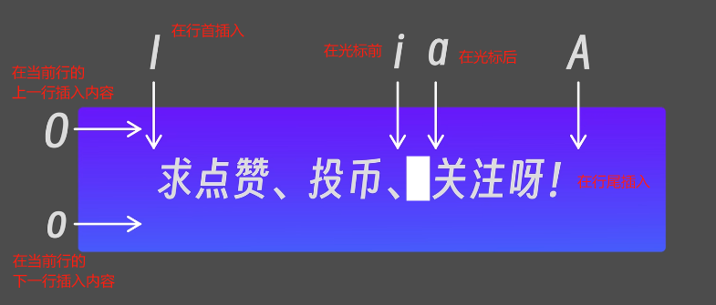
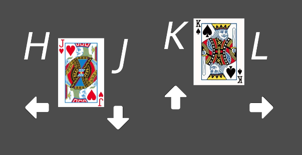

命令模式：

命令模式切换插入模式：

i/I：insert

a/A：append

o/O：open






yy：复制

p：粘贴

2yy：复制两行内容

3pp：把复制的内容粘贴3次

dd：删除

ctrl + f (forwward)：向前翻页

ctrl + b (back)：向后翻页

ctrl + u (up)：向上翻半页

ctrl + d (down)： 向下翻半页

gg：跳转到文件第一行

G：跳转到文件最后一行

100G：跳转到文件第100行 或者 :100

u (undo)：撤销 或 ctrl + r

/xxx：在文件中查找xxx内容，n向下查找，N向上查找 （**默认查找是区分大小写的，如果想不区分大小写，在内容后面加\c，如：/hello\c**  或者 在命令模式下设置不区分大小写，如：**set ic**(ignore case)）

: LINESTART, LINEENDs/old/new/g ：替换内容。

- s：代表替换

- g：代表全局替换（仅限于当前行），不加g只会替换每一行第一个匹配到的内容，加g会替换每一行所有匹配到的内容。

  例：

  ```bash
  s/hello/world # 把光标当前行第一个hello替换为world
  s/hello/world/g # 把光标当前行所有hello替换为world
  1,5s/hello/world # 把第一行到第五行的第一个hello替换为world
  1,5s/hello/world/g # 把第一行到第五行的所有hello替换为world
  1,$s/hello/world # 把第一行到最后一行的第一个hello替换为world
  1,$s/hello/world/g # 把第一行到最后一行的所有hello替换为world
  ```

  


`shift + insert`: 直接在vim中粘贴。

`shift + zz`: 保存退出。同`:wq`


插入模式：

尾行模式：


# .vimrc

```shell
set nu
set shiftwidth=4   #" 设置自动缩进和缩进命令(>>、<<)使用的缩进宽度为4个空格  
set tabstop=4      #" 设置显示时一个制表符占据的空格数为4  
set expandtab      #" 将输入的Tab转换为空格
# set ic
# syntax on
```


