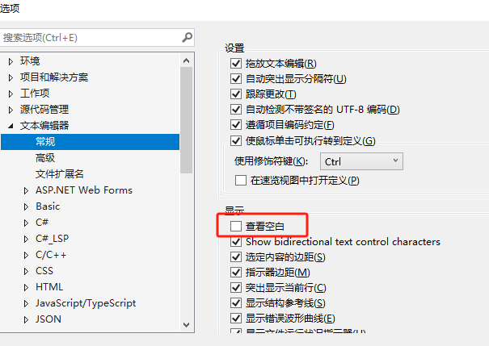

# 显示空格

1. 快捷键：`ctrl+r, ctrl+w`
2. 在界面设置：

[键盘快捷方式 - Visual Studio (Windows) | Microsoft Learn](https://learn.microsoft.com/zh-cn/visualstudio/ide/default-keyboard-shortcuts-in-visual-studio?view=vs-2022&redirectedfrom=MSDN)