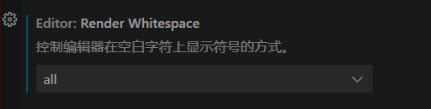

```json
{
    // 使用clangd作为语言服务器是，会与微软的智能感知引擎产生冲突
    // 想使用clangd，就需要禁用微软的只能感知引擎。
    "C_Cpp.intelliSenseEngine": "disabled",
    "[cpp]": {
        // 在cpp文件中，编辑器在保存的时候进行格式化
        "editor.formatOnSave": true,
        // 在cpp文件中，编辑器在打字的时候进行格式化
        "editor.formatOnType": true,
        // 在cpp文件中，编辑器在粘贴的时候进行格式化
        "editor.formatOnPaste": true,
        // 在cpp文件中，编辑器的默认格式化器为 "xaver.clang-format"
        // 这里的"xaver.clang-format"就是我们安装的clang-format
        // vscode插件
        "editor.defaultFormatter": "xaver.clang-format"
    }
    "clangd.fallbackFlags": [
        // 工作区的头文件包含路径的数组
        "-I${workspaceFolder}/include"
    ],
    "clangd.path": "clangd/executable/path",
    "clangd.detectExtensionConflicts": true,
    "clangd.arguments": [
        // 在后台自动分析文件（基于complie_commands)
        "--background-index",
        // 标记compelie_commands.json文件的目录位置
        "--compile-commands-dir=build",
        // 同时开启的任务数量
        "-j=12",
        // clang-tidy功能
        "--clang-tidy",
        "--clang-tidy-checks=performance-*,bugprone-*",
        // 全局补全（会自动补充头文件）
        "--all-scopes-completion",
        // 更详细的补全内容
        "--completion-style=detailed",
        // 补充头文件的形式
        "--header-insertion=iwyu",
        // pch优化的位置
        "--pch-storage=disk"
    ],
    "clangd.serverCompletionRanking": true,
    "clang-format.executable": "path/to/clang-foramt/executable"
}

```


# 开启显示空格

打开设置`ctrl + ,`



```json
// 1、none 默认值。不显示任何空格。
"editor.renderWhitespace": "none"
// 2、boundary 仅在单词之间显示空格。
"editor.renderWhitespace": "boundary"
// 3、selection 仅在选中文本时显示空格。
"editor.renderWhitespace": "selection"
// 4、all 在全文中显示所有空格。
"editor.renderWhitespace": "all"
```


# 打开文件大小限制


```json
workbench.editorLargeFileConfirmation
```


