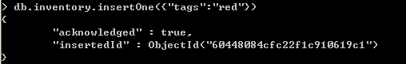
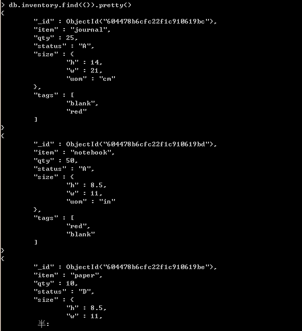

# 数据库

## 创建数据库

```sql
use DATABASE_NAME # 如果数据库不存在，则创建数据库，否则切换到指定数据库。
```


## 删除数据库

```sql
db.dropDatabase()
```


## 显示当前所使用的数据库

```sql
db
```


## 显示所有数据库

```sql
show dbs
```


# 集合 (表)

## 创建集合

语法：

```sql
db.createCollection(name, options)
```

-   name: 要创建的集合名称

-   options: 可选参数, 指定有关内存大小及索引的选项

    https://www.runoob.com/mongodb/mongodb-create-collection.html

```sql
db.createCollection("runoob")     # 先创建集合，类似数据库中的表
```


在 MongoDB 中，可以自动创建集合。当你插入一些文档时，MongoDB 会自动创建集合。

```sql
> db.mycol2.insertOne({"name" : "菜鸟教程"})
> show collections
mycol2
...
```


## 删除集合

```
db.collection_name.drop()
```


## 显示集合

```sql
show collections
or
show tables
```


## 查看集合信息

```sql
db.getCollectionInfos()
```


# 文档 (行)

## 插入文档

-   db.collection_name.insertMany() ：向集合中插入多条文档数据.

```sql
db.inventory.insertMany([
   { item: "journal", qty: 25, status: "A", size: { h: 14, w: 21, uom: "cm" }, tags: [ "blank", "red" ] },
   { item: "notebook", qty: 50, status: "A", size: { h: 8.5, w: 11, uom: "in" }, tags: [ "red", "blank" ] },
   { item: "paper", qty: 10, status: "D", size: { h: 8.5, w: 11, uom: "in" }, tags: [ "red", "blank", "plain" ] },
   { item: "planner", qty: 0, status: "D", size: { h: 22.85, w: 30, uom: "cm" }, tags: [ "blank", "red" ] },
   { item: "postcard", qty: 45, status: "A", size: { h: 10, w: 15.25, uom: "cm" }, tags: [ "blue" ] }
]);
```


-   db.collection_name.insertOne()：向集合中插入一条文档数据。



也可以先定义一个变量：

```sql
> document=({title: 'MongoDB 教程',
    description: 'MongoDB 是一个 Nosql 数据库',
    by: '菜鸟教程',
    url: 'http://www.runoob.com',
    tags: ['mongodb', 'database', 'NoSQL'],
    likes: 100
});
```

再插入这条记录：

```sql
db.test.insertOne(document)
```


## 删除文档

-   删除全部文档：

    ```sql
    db.collection_name.deleteMany({})
    ```

-   删除满足条件的多条数据

    ```sql
    db.collection_name.deleteMany({"name":"xxxx"})
    ```

-   删除满足条件的单条数据

    ```sql
    db.collection_name.deleteOne({"key":"value"})
    ```

    

## 查找文档

db.collections.find({})


`db.collections.find({}).pretty()`




`db.find({}, {_id: 0 | 1, key:1,key:1})`


## 更新文档


