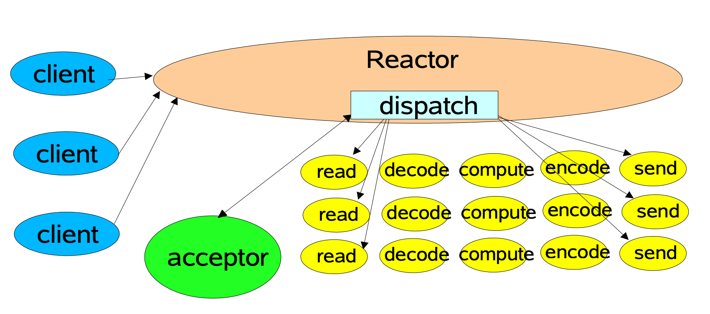
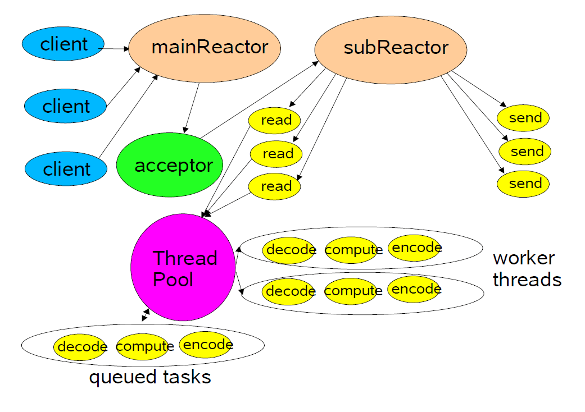

# Muduo是什么？

[muduo](https://github.com/chenshuo/muduo)是[陈硕](http://chenshuo.com/)大神个人开发的C++的TCP网络编程库。muduo基于Reactor模式实现。Reactor模式也是目前大多数Linux端高性能网络编程框架和网络应用所选择的主要[架构](https://so.csdn.net/so/search?q=架构&spm=1001.2101.3001.7020)，例如内存数据库Redis和Java的Netty库等。

陈硕的《Linux多线程服务器端编程》一书对muduo整个架构进行了非常详尽的介绍和分析，可以说是学习muduo源码和设计理念最好的资料了。这本书也非常推荐大家购买阅读，感觉是后台开发的必读书目了。

而本文则主要是从源码角度辅助理解整个muduo的实现，同时也姑且算是对muduo的一个小小的补充。

同时提供了一个[muduo注释版](https://github.com/chenyahui/AnnotatedCode/tree/master/muduo)，以辅助大家参考学习。

# muduo的架构和概念

muduo中类的职责和概念划分的非常清晰，在《Linux多线程服务器端编程》一书的6.3.1章节有详细的介绍。实际上目前很多网络库的接口设计也都受到了muduo的影响，例如360的evpp等。

而 muduo 的整体风格受到 Netty 的影响，整个架构依照 Reactor 模式，基本与如下图所示相符：



所谓 Reactor 模式，是指有一个循环的过程，不断监听对应事件是否触发，事件触发时调用对应的 **callback** 进行处理。

这里的事件在 muduo 中包括 Socket 可读写事件、定时器事件。在其他网络库中如 libevent 也包括了 signal、用户自定义事件等。

负责事件循环的部分在 muduo 被命名为 `EventLoop`，这个命名也基本是个约定语了，其他库如 Netty、libevent 也都有对应的组件。

负责监听事件是否触发的部分，在 muduo 中叫做 `Poller`。muduo 提供了 epoll 和 poll 两种来实现，默认是 epoll 实现。通过环境变量 `MUDUO_USE_POLL` 来决定是否使用 poll:

```c++
Poller* Poller::newDefaultPoller(EventLoop* loop)
{
  // 通过此环境变量来决定使用poll还是epoll
  if (::getenv("MUDUO_USE_POLL"))
  {
    return new PollPoller(loop);
  }
  else
  {
    return new EPollPoller(loop);
  }
}
```

此外，图中的acceptor负责accept新连接，并将新连接分发到subReactor。这个组件在muduo中也叫做`Acceptor`。 关于图中的其他部分，会在 [muduo 的线程模型](#muduo 的线程模型) 一节有详细介绍。

# 一个简单的例子

本文首先从最简单的echo server入手，来介绍muduo的基本使用，同时也方便后面概念的理解。

```c++
void onMessage(const muduo::net::TcpConnectionPtr& conn,
                           muduo::net::Buffer* buf,
                           muduo::Timestamp time)
{
  conn->send(buf);
}

int main()
{
    muduo::net::EventLoop loop;//建立一个事件循环器EventLoop
    muduo::net::InetAddress listenAddr(2007);
    TcpServer server(&loop, listenAddr);//建立对应的业务服务器TcpServer
    server.setMessageCallback(onMessage);//设置TcpServer的Callback
    server.start();//启动server
    loop.loop();//开启事件循环
}
```

echo-server的代码量非常简洁。一个典型的muduo的TcpServer工作流程如下：

1. 建立一个事件循环器 EventLoop
2. 建立对应的业务服务器 TcpServer
3. 设置 TcpServer 的 Callback
4. 启动 server
5. 开启事件循环

 <u>==陈硕认为，TCP网络编程的本质是处理三个半事件==</u>，即：

- 连接的建立
- 连接的断开：包括主动断开和被动断开
- 消息到达，文件描述符可读。
- 消息发送完毕。这个算半个事件。

# 连接的建立

在我们单纯使用linux的API，编写一个简单的Tcp服务器时，建立一个新的连接通常需要四步：

> 步骤 1. socket() // 调用 socket 函数建立监听 socket
> 步骤 2. bind() // 绑定地址和端口
> 步骤 3. listen() // 开始监听端口
> 步骤 4. accept() // 返回新建立连接的 fd

我们接下来分析下，这四个步骤在muduo中都是何时进行的：

首先在TcpServer对象构建时，TcpServer的属性acceptor同时也被建立。在Acceptor的构造函数中分别调用了socket函数和bind函数完成了步骤1和步骤2。即，当`TcpServer server(&loop, listenAddr)`$\color{orange} {执行结束时，监听socket已经建立好，并已绑定到对应地址和端口了。}$

而当执行$\color{orange} {server.start()}$时，主要做了两个工作：

1. 在监听socket上启动listen函数，也就是**步骤3**；
2. 将监听socket的可读事件注册到EventLoop中。

此时，程序已完成对socket的监听，但还不够，因为此时程序的主角 `EventLoop` 尚未启动。
当调用 `loop.loop()` 时，程序开始循环监听该 socket 的可读事件。

当新连接请求建立时，可读事件触发，此时该事件对应的 callback 在 EventLoop::loop() 中被调用。**该事件的 callback 实际上就是 Acceptor::handleRead() 方法。**

在 Acceptor::handleRead() 方法中，做了三件事：

1. 调用了 accept 函数，完成了 **步骤 4**，实现了连接的建立。得到一个已连接 socket 的 fd。
2. 创建 TcpConnection 对象。
3. 将已连接 socket 的可读事件注册到 EventLoop 中。

这里还有一个需要注意的点，创建的 ==TcpConnnection 对象是个 shared_ptr==，该对象会被保存在 TcpServer 的 connections 中。**这样才能保证引用计数大于 0，对象不被释放**。

至此，一个新的连接已完全建立好，该连接的socket可读事件也已注册到 EventLoop 中了。

# 消息的读取

上节讲到，在新连接建立的时候，会将新连接的 socket 的可读事件注册到 EventLoop 中。
假如客户端发送消息，导致已连接 socket 的可读事件触发，该事件对应的 callback 同样也会在 EventLoop::loop() 中被调用。

该事件的 callback 实际上就是 TcpConnection::handleRead 方法。
在 TcpConnection::handleRead 方法中，主要做了两件事：

1. 从 socket 中读取数据，并将其放入 inputbuffer 中
2. 调用 messageCallback，执行业务逻辑。

```c++
  ssize_t n = inputBuffer_.readFd(channel_->fd(), &savedErrno);
  if (n > 0)
  {
    messageCallback_(shared_from_this(), &inputBuffer_, receiveTime);
  }
```

<u>messageCallback 是在建立新连接时，将 `TcpServer::messageCallback` 方法 bind 到了 `TcpConnection::messageCallback` 的方法。</u>

`TcpServer::messageCallback` 就是业务逻辑的主要实现函数。通常情况下，我们可以在里面实现消息的编解码、消息的分发等工作，这里就不再深入探讨了。

在我们上面给出的示例代码中，echo-server 的 messageCallback 非常简单，就是直接将得到的数据，重新 send 回去。在实际的业务处理中，一般都会调用 TcpConnection::send() 方法，给客户端回复消息。

==这里需要注意的是==，在 messageCallback 中，用户会有可能会把任务抛给自定义的 Worker 线程池处理。
但是这个在 Worker 线程池中任务，**切忌直接对 Buffer 的操作**。因为 ==Buffer 并不是线程安全的。==

我们需要记住一个准则:

> **所有对 IO 和 buffer 的读写，都应该在 IO 线程中完成。**

一般情况下，先在交给 Worker 线程池之前，应该先在 IO 线程中把 Buffer 进行切分解包等动作。将解包后的消息交由线程池处理，避免多个线程操作同一个资源。

# 消息的发送

用户通过调用 TcpConnection::send() 向客户端回复消息。由于 muduo 中使用了 OutputBuffer，因此消息的发送过程比较复杂。

首先需要注意的是线程安全问题, 上文说到对于消息的读写必须都在 EventLoop 的同一个线程 (通常称为 IO 线程) 中进行。因此，TcpConnection::send 必须要保证线程安全性，它是这么做的：

```c++
void TcpConnection::send(const StringPiece& message)
{
  if (state_ == kConnected)
  {
    if (loop_->isInLoopThread())
    {
      sendInLoop(message);
    }
    else
    {
      void (TcpConnection::*fp)(const StringPiece& message) = &TcpConnection::sendInLoop;
      loop_->runInLoop(
          std::bind(fp,
                    this,     // FIXME
                    message.as_string()));
                    //std::forward<string>(message)));
    }
  }
}
```

检测 send 的时候，是否在当前 IO 线程，如果是的话，直接进行写相关操作 `sendInLoop`。
如果不在一个线程的话，需要将该任务抛给 IO 线程执行 `runInloop`, 以保证 write 动作是在 IO 线程中执行的。我们后面会讲解 `runInloop` 的具体实现。

在 sendInloop 中，做了下面几件事：

1. 假如 OutputBuffer 为空，则直接向 socket 写数据
2. 如果向 socket 写数据没有写完，则统计剩余的字节个数，并进行下一步。没有写完可能是因为此时 socket 的 TCP 缓冲区已满了。
3. 如果此时 OutputBuffer 中的旧数据的个数和未写完字节个数之和大于 highWaterMark，则将 highWaterMarkCallback 放入待执行队列中
4. **将对应 socket 的可写事件注册到 EventLoop 中**

==注意==：直到发送消息的时候，muduo 才会把 socket 的可写事件注册到了 EventLoop 中。在此之前只注册了可读事件。

连接 socket 的可写事件对应的 callback 是 TcpConnection::handleWrite()
当某个 socket 的可写事件触发时，TcpConnection::handleWrite 会做两个工作：

1. 尽可能将数据从 OutputBuffer 中向 socket 中 write 数据
2. 如果 OutputBuffer 没有剩余的，则 **将该 socket 的可写事件移除**，并调用 writeCompleteCallback

## 为什么要移除可写事件

因为当 OutputBuffer 中没数据时，我们不需要向 socket 中写入数据。但是此时 socket 一直是处于可写状态的， 这将会导致 TcpConnection::handleWrite() 一直被触发。然而这个触发毫无意义，因为并没有什么可以写的。

所以 muduo 的处理方式是，当 OutputBuffer 还有数据时，socket 可写事件是注册状态。当 OutputBuffer 为空时，则将 socket 的可写事件移除。

此外，==highWaterMarkCallback 和 writeCompleteCallback 一般配合使用，起到限流的作用==。在《linux 多线程服务器端编程》一书的 8.9.3 一节中有详细讲解。这里就不再赘述了。


# 连接的断开

我们看下 muduo 对于连接的断开是怎么处理的。连接的断开分为被动断开和主动断开。主动断开和被动断开的处理方式基本一致，因此本文只讲下被动断开的部分。

被动断开即客户端断开了连接，server 端需要感知到这个断开的过程，然后进行的相关的处理。

其中感知远程断开这一步是在 Tcp 连接的可读事件处理函数 `handleRead` 中进行的：当对 socket 进行 ==read== 操作时，==返回值为 0==，则说明此时连接已断开。

接下来会做四件事情：

1. 将该 TCP 连接对应的事件从 EventLoop 移除
2. 调用用户的 ConnectionCallback
3. 将对应的 TcpConnection 对象从 Server 移除。
4. close 对应的 fd。此步骤是在析构函数中自动触发的，**当 TcpConnection 对象被移除后，引用计数为 0，对象析构时会调用 close**。

# runInLoop 的实现

在讲解消息的发送过程时候，我们讲到<u>为了保证对 buffer 和 socket 的写动作是在 IO 线程中进行，使用了一个 `runInLoop` 函数，将该写任务抛给了 IO 线程处理。</u>

我们接下来看下 `runInLoop` 的实现：

```c++
void EventLoop::runInLoop(Functor cb)
{
  if (isInLoopThread())
  {
    // 如果是当前IO线程调用runLoop, 则同步调用cb
    cb();
  }
  else
  {
    // 如果是其他线程调用runLoop, 则异步地将cb添加到队列
    queueInLoop(std::move(cb));
  }
}
```

这里可以看到，做了一层判断。如果调用时是此EventLoop的运行线程，则直接执行此函数。否则调用`queueInLoop`函数。我们看下`queueInLoop`的实现。

```c++
void EventLoop::queueInLoop(Functor cb)
{
  {
    MutexLockGuard lock(mutex_);
    pendingFunctors_.push_back(std::move(cb));  //添加到任务队列
  }

  // 调用queueInLoop的线程不是当前IO线程(eventloop那个线程)需要唤醒
  // 或者调用queueInLoop的线程是当前IO线程，并且此时正在调用pendingfunctor, 需要唤醒。为了防止在执行pendingFunctors_时，Functor函数中又调用了queueInLoop
  // 只有当前IO线程的事件回调中调用queueInLoop才不需要唤醒
  if (!isInLoopThread() || callingPendingFunctors_)
  {
    wakeup();
  }
}
```

这里有两个动作：

1. 加锁，然后将该函数放到该 EventLoop 的 pendingFunctors_ 队列中。
2. 判断是否要唤醒 EventLoop，如果是则调用 wakeup() 唤醒该 EventLoop。

这里有几个问题：

- **为什么要唤醒 EventLoop？**
- wakeup 是怎么实现的?
- pendingFunctors_是如何被消费的?

## 为什么要唤醒 EventLoop

我们首先调用了 `pendingFunctors_.push_back(cb)`, 将该函数放在 pendingFunctors_中。==EventLoop 的每一轮循环<u>**在最后**</u>会调用 doPendingFunctors 依次执行这些函数。==

而 EventLoop 的唤醒是通过 epoll_wait 实现的，如果此时该 EventLoop 中迟迟没有事件触发，那么 epoll_wait 一直就会阻塞。 这样会导致，pendingFunctors_中的任务迟迟不能被执行了。

所以必须要唤醒 EventLoop ，从而让pendingFunctors_中的任务尽快被执行。

## wakeup 是怎么实现的

muduo 这里采用了对 eventfd 的读写来实现对 EventLoop 的唤醒。

在 EventLoop 建立之后，就创建一个 eventfd，并将其可读事件注册到 EventLoop 中。

`wakeup()` 的过程本质上是对这个 eventfd 进行写操作，以触发该 eventfd 的可读事件。这样就起到了唤醒 EventLoop 的作用。

```c++
void EventLoop::wakeup()
{
  uint64_t one = 1;
  ssize_t n = sockets::write(wakeupFd_, &one, sizeof one);
  if (n != sizeof one)
  {
    LOG_ERROR << "EventLoop::wakeup() writes " << n << " bytes instead of 8";
  }
}
```

很多库为了兼容 macOS，往往使用 pipe 来实现这个功能。muduo 采用了 eventfd，性能更好些，但代价是不能支持 macOS 了。不过 muduo 似乎从一开始的定位就不打算支持？

## doPendingFunctors 的实现

本部分讲下 `doPendingFunctors` 的实现，muduo 是如何处理这些待处理的函数的，以及中间用了哪些优化操作。代码如下所示：

```c++
void EventLoop::doPendingFunctors()
{
  std::vector<Functor> functors;
  callingPendingFunctors_ = true;

  {
    MutexLockGuard lock(mutex_);
    functors.swap(pendingFunctors_);
  }

  for (const Functor &functor : functors)
  {
    functor();
  }
  callingPendingFunctors_ = false;
}
```

从代码可以看到，函数非常简单。大概只有十行代码，但是这十行代码中却有两个非常巧妙的地方。

1. **callingPendingFunctors_的作用**

   从代码可以看出，如果 callingPendingFunctors_为 false，则说明此时尚未开始执行 doPendingFunctors 函数。这个有什么作用呢，我们需要结合下 queueInLoop 中，对是否执行 wakeup() 的判断。

   ```c++
   if (!isInLoopThread() || callingPendingFunctors_)
   {
     wakeup();
   }
   ```

   这里还需要结合下 EventLoop 循环的实现，其中 `doPendingFunctors()` 是 **每轮循环的最后一步处理**。
   如果调用 queueInLoop 和 EventLoop **在同一个线程**，且 callingPendingFunctors_ 为 false 时，则说明：**此时尚未执行到 doPendingFunctors()。**
   那么此时即使不用 wakeup，也可以在之后照旧执行 doPendingFunctors() 了。

   ==这么做的好处非常明显，可以减少对 eventfd 的 IO 读写。==

2. **锁范围的减少**
   在此函数中，有一段特别的代码：

   ```c++
   std::vector<Functor> functors;
   {
     MutexLockGuard lock(mutex_);
     functors.swap(pendingFunctors_);
   }
   ```

   这个作用是 pendingFunctors_ 和 functors 的内容进行交换，实际上就是此时 functors 持有了 pendingFunctors_ 的内容，==而 pendingFunctors_被清空了。==
   
   ==这个好处是什么呢？==
   
   如果不这么做，直接遍历 pendingFunctors_, 然后处理对应的函数。这样的话，锁会一直等到所有函数处理完才会被释放。<u>**在此期间，queueInLoop 将不可用。**</u>
   
   *而以上的写法，可以极大减小锁范围，整个锁的持有时间就是 swap 那一下的时间。待处理函数执行的时候，其他线程还是可以继续调用 queueInLoop。*

# muduo 的线程模型

muduo 默认是单线程模型的，即只有一个线程，里面对应一个 EventLoop。这样整体对于线程安全的考虑可能就比较简单了，
但是 muduo 也可以支持以下几种线程模型：

## 主从 reactor 模式

主从 reactor 是 Netty 的默认模型，一个 reactor 对应一个 EventLoop。主 Reactor 只有一个，只负责监听新的连接，accept 后将这个连接分配到子 Reactor 上。子 Reactor 可以有多个。这样可以分摊一个 Eventloop 的压力，性能方面可能会更好。如下图所示：



在 muduo 中也可以支持主从 Reactor，**其中主 Reactor 的 EventLoop 就是 TcpServer 的构造函数中的 `EventLoop*` 参数**。Acceptor 会在此 EventLoop 中运行。

而子 Reactor 可以通过 `TcpServer::setThreadNum(int)` 来设置其个数。**因为一个 Eventloop 只能在一个线程中运行，所以线程的个数就是子 Reactor 的个数。**

如果设置了子 Reactor，新的连接会通过 Round Robin 的方式分配给其中一个 EventLoop 来管理。如果没有设置子 Reactor，则是默认的单线程模型，新的连接会再由主 Reactor 进行管理。

但其实这里似乎有些不合适的地方：多个 TcpServer 之间可以共享同一个主 EventLoop，但是子 Eventloop 线程池却不能共享，这个是每个 TcpServer 独有的。

这里不太清楚是 muduo 的设计问题，还是作者有意为之。<u>不过 Netty 的主 EventLoop 和子 Eventloop 池都是可以共享的。</u>

## 业务线程池

对于一些阻塞型或者耗时型的任务，例如 MySQL 操作等。这些显然是不能放在 IO 线程（即 EventLoop 所在的线程）中运行的，因为会严重影响 EventLoop 的正常运行。具体原理可以查看 [另外一篇博客](http://www.cyhone.com/articles/reunderstanding-of-non-blocking-io/)。

对于这类耗时型的任务，一般做法是可以放在另外单独线程池中运行，这样就不会阻塞 IO 线程的运行了。我们一般把这种处理耗时任务的线程叫做 ==Worker 线程。==

muduo 的网络框架本身没有直接集成 Worker 线程池，但是 muduo 的基础库提供了线程池的相关类 `ThreadPool`。muduo 官方的推荐做法是，在 OnMessage 中，自行进行包的切分，然后将数据和对应的处理函数打包成 Task 的方式提交给**线程池**。

# 总结

个人认为，muduo 源码对于学习网络编程和项目设计非常有帮助, 里面几乎包含了大部分网络编程和框架设计的最佳实践，配合《Linux 多线程服务器端编程》一书，可以学到很多东西。基于这几个方面来说，muduo 绝对是一个值得一探究竟的优质源码。

此外，不但是网络编程方面，如何将复杂的底层细节封装好，暴露出友好的通用业务层接口，如何设计类的职责，对象的生命周期管理等方面，muduo 都给了我们一个很好的示范。

# 参考

- 《Linux 多线程服务器端编程》
- [Scalable IO in Java](http://gee.cs.oswego.edu/dl/cpjslides/nio.pdf)


