面向对象：一个类继承自某个类。

基于对象：一个类包含某个类。

muduo就是使用基于对象的方式

# net库

## muduo网络库模块组成

### moduo类图


根据muduo类图，总体可以划分为以下几个部分。

- Reactor反应器：EventLoop、Poller、Channel
- 连接器：Connector
- 监听器：Acceptor
- 连接：TcpConnection
- 服务器和客户端：TCPServer、TCPClient。
- 定时器：TimerQueue
- 唤醒机制：Eventfd

总体来说muduo网络库是一个Reactor模型，Reactor模式中有一个循环的过程(one loop per thread)，并且提供注册事件、监听事件、分发事件的接口。muduo中主要由EventLoop、Poller、Channel这三个类来实现。

说白了Reactor就是用来注册、监听、分发事件的，而事件总体又可分为可读、可写事件，所以模块又可以这么划分：

监听可读事件：**Eventfd**的接收到通知属于可读，**Timer**定时器到期属于可读，**Accptor**新连接到来属于可读，**关闭连接**属于可读，**连接套接字**有数据可读，**连接关闭**属于可读。

监听可写事件：**Connector**连接成功属于可写。


## 反应器Reactor

### Channel

1. ==发起==事件更新。Channel::update() --> EventLoop::updateChannel() -> Poller::updateChannel()。最终是在Poller中更新事件。
2. ==封装==了fd事件所对应的回调函数。EventLoop::loop() -> Poller::poll() -> Channel::handleEvent()。最终在Channel中处理事件。

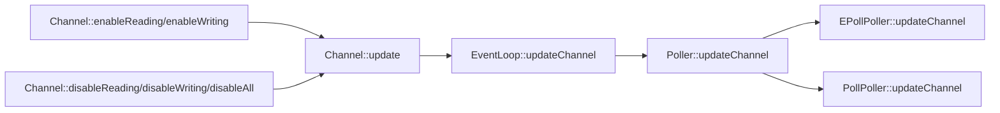


调用Channel::remove之前一定要先调用disableAll。

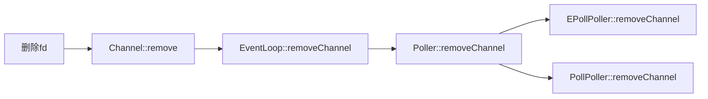


### Poller

1. ==封装了poll、epoll==。是EventLoop的成员函数，使用unique_ptr来管理。

#### muduo为什么使用epoll的LT模式？

1. **与poll兼容**。
2. **LT模式不会漏掉事件**。
   - 对于水平触发模式：只要内核接收缓冲区有**数据**可读，内核发送缓冲区有**空间**可写就会一直触发可读、可写事件。但是对于EPOLLOUT事件不能一开始就关注，因为发送缓冲区总是可写的会一直触发EPOLLOUT事件，造成**busyLoop**。==应该在内核发送缓冲区被写满时才关注==，并将未写入的数据写入**应用层的发送缓冲区(output buffer)**；==直到把output buffer中的数据全部写完才停止关注可写事件。==
   - 对于边沿触发模式：内核接收缓冲区有**数据**可读时只会触发一次，只有等**再次**接收到数据时才会再次触发可读事件；内核发送缓冲区有**空间**可写时只会触发一次，只有等内核发送缓冲区空间再次变化时(**滑动窗口向前移动**)才会再次触发可写事件。
3. **读写时不必等候EAGAIN，可以减少系统调用次数**，降低延迟。也就是说：
   - 对于LT模式：可以不必一次性读/写完，没读完时下次还会触发。
   - 对于ET模式：可能要多次调用read把接收缓冲区中的数据读完(**EAGAIN**)。写时，需要一次性把数据**写完**或者直到发送缓冲区被**写满**(**EAGAIN**)

### EventLoop

1. 提供事件循环EventLoop::loop()。

2. eventloop从poller拿到就绪的channel，然后遍历channel去处理事件。

#### 怎么保证一个线程只拥有一个EventLoop对象的？

1. 使用线程局部存储： `__thread EventLoop *t_loopInThisThread = 0;`

2. 进行判空：

   ```c++
   if (t_loopInThisThread)
   {
   	// 如果当前线程已经创建了EventLoop对象，终止(LOG_FATAL)
       LOG_FATAL << "Another EventLoop " << t_loopInThisThread << " exists in this thread " << threadId_;
   }
   ```

   

### Reactor时序图

更新事件时序图：


获取就绪通道，分发事件 时序图：


## 定时器TimerQueue

TimerQueue封装了 [timerfd_create](../LinuxSystemProgramming.md) 等系统调用。**TimerQueue在构造时，就会把timerfd注册到poller，并监听读事件。**

==一个timerfd可以对应多个定时器任务==。这是怎么做到的呢，一般不都是一个定时器对应一个任务？**准确的说是多个定时器任务可以复用同一个timerfd。**我们在Timer类中存储定时器回调函数、超时时间、超时间隔、定时器序号等参数，然后把不同的Timer存储在TimeList(定时器队列)中。

```c
typedef std::pair<Timestamp, Timer *> Entry;
typedef std::set<Entry> TimerList;  // 按照pair的规则排序，先比较时间戳再比较指针
typedef std::pair<Timer *, int64_t> ActiveTimer;	// ActiveTimer 将Timer和sequence组成一对主要作用来索引迭代的.
typedef std::set<ActiveTimer> ActiveTimerSet; // 按照pair的operator<排序，先比较指针再比较时间戳。
```

### 为什么使用pair来存储时间戳和Timer？

**为了解决定时器超时时间相同的情况**，使用pair将时间戳和Timer地址组成一对，再使用set来存储。

### 为什么使用set来存储pair？

利用set的排序功能，按照时间戳排序，然后把==第一个==Timer的超时时间(也就是最先到期的时间)设置到 ==timerfd_settime== 中，等到timefd可读时，从TimerList中取出==所有超时==的定时器事件进行处理；<u>如果是周期性定时器，则把定时事件重新添加到定时器队列中。</u>

### 添加定时任务


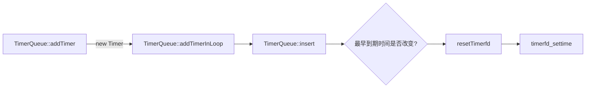


### 处理超时任务


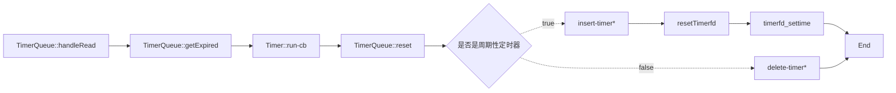

### 删除定时任务

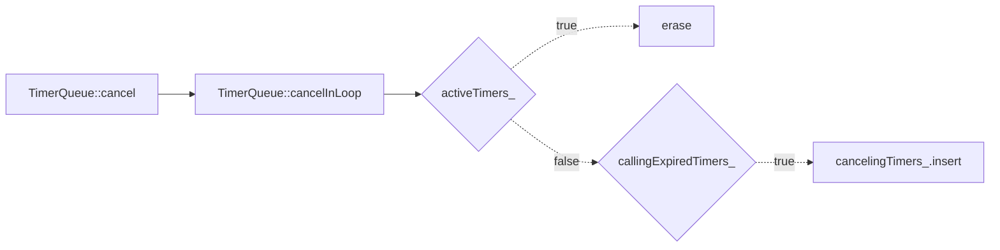


### 时序图


### timerfd_*入选的原因：

1. sleep(3) / alarm(2) / usleep(3)在实现时有可能用了SIGALRM信号， 在多线程程序中处理信号是个相当麻烦的事情， 应当尽量避免， 再说， 如果主程序和程序库都使用SIGALRM， 就糟糕了。
2. nanosleep(2)和clock_nanosleep(2)是线程安全的， 但是在非阻塞网络编程中， 绝对不能用让线程挂起的方式来等待一段时间， 这样一来程序会失去响应。 正确的做法是注册一个时间回调函数。
3. getitimer(2)和timer_create(2)也是用信号来deliver超时，在多线程程序中也会有麻烦。timer_create(2)可以指定信号的接收方是进程还是线程， 算是一个进步， 不过信号处理函数（signal handler） 能做的事情实在很受限。
4. `timerfd_create(2)`把时间变成了一个文件描述符， 该“文件”在定时器超时的那一刻变得可读， 这样就能很方便地融入select(2)/poll(2)框架中， 用统一的方式来处理IO事件和超时事件， 这也正是Reactor模式的长处。
5. 传统的Reactor利用select(2)/poll(2)/epoll(4)的timeout来实现定时功能， 但poll(2)和epoll_wait(2)的定时精度只有毫秒，远低于timerfd_settime(2)的定时精度。


## 唤醒机制Eventfd

eventfd的作用就是为了解决==其他线程==向eventloop添加任务时，不能得到及时执行的问题。

### 两种需要唤醒的情况

1. 当**其他线程**向EventLoop添加任务时，需要唤醒。

2. **当在EventLoop线程执行pendingFunctors_ 时**，Functors函数内部又添加了任务，需要唤醒。

   

### 为什么需要唤醒？

[muduo源码剖析](./muduo源码剖析.md)

上面1、2种情况向EventLoop添加任务的时候，会把任务放到 pendingFunctors_ 中，而 pendingFunctors_ 是在每轮循环的最后才会调用。只有在epoll_wait有事件触发的时候才会唤醒每一轮循环，如果一直没有事件被触发，那么其他线程添加的任务就会一直不被执行**(因为程序一直阻塞在epoll_wait，走不到doPendingFunctors 函数**)。

**既然第二种情况是在当前线程执行的，为什么不在执行functor时就执行新的任务？**

- 想一下：如果新的任务中又添加了新任务呢？pendingFunctors_ 就会一直执行下去了。所以为了避免这一轮循环无限的执行下去，到不了下轮loop，就先把它放到pendingFunctors_中，等到下轮循环再执行。

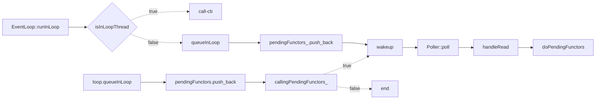


## TCP连接TcpConnection

每个连接都配备了 [应用层缓冲区Buffer](#Buffer)

### 消息的读取

消息的读取是在 **TcpConnection::handleRead** 中进行的，该函数主要做两件事情：

1. 使用 [Buffer::readFd](#Buffer::readFd) 读取数据到 应用层接收缓冲区(input buffer)。
2. 调用应用层回调函数 **messageCallback**，执行业务逻辑。

通常会在**messageCallback**中进行数据的加解密、序列化/反序列化、判断是否为完整的包、向worker线程池分发任务等操作。注意：[不要把 input buffer暴露给其他线程](#Buffer的线程安全性)。

应用程序根据**应用层协议**去判断是否为一个完整的包。如果不是一个完整的包，则不会取走input buffer中的数据，也不会做处理；如果是一个完整的包，则把数据从input buffer中取走，并做处理。


### 消息的发送

用户通过调用 **TcpConnection::send()** 向对端发送息。该函数主要做了下面几件事情：

1. **当output buffer为空时**，直接调用write写入数据。
2. **当有数据没有一次性写完时**，写入output buffer，并监听POLLOUT事件。(没有写完说明内核发送缓冲已经写满了)。
3. **统计output buffer中的数据是否超过了高水位**，超过则调用高水位回调函数highWaterMarkCallback ，通知用户程序停止写入。(highWaterMarkCallback 是用户层来定义的。)

当可写事件触发时，调用**TcpConnection::handleWrite()**函数，该函数主要做了下面几件事情：

1. 调用write把output buffer中的数据写入fd，应该**尽可能多的写入**数据(数据长度=readable)。
2. **如果数据已经被写完(或者低于低水位标)**，则停止监听可写事件，并调用低水位回调函数writeCompleteCallback，通知用户程序继续写入。
3. 如果连接状态是**正在关闭状态**，则关闭写端，此时处于半关闭状态。


#### 消息发送流程图

```mermaid
graph LR
send --> isInLoopThread{isInLoopThread} -.true.-> sendInLoop
isInLoopThread{isInLoopThread} -.false.-> runInLoop --> sendInLoop
sendInLoop --> ouptbuffer中是否还有数据{outputBuffer.readable=0} -.true.-> n=write --> 是否把数据全部写完了
ouptbuffer中是否还有数据{outputBuffer.readable=0} -.false.-> 3
3 --> 添加到outputbufer中[outputbuffer.append]
3 --> enableWriting
3 --> highWaterMarkCallback_

是否把数据全部写完了 -.true.-> writeCompleteCallback_
是否把数据全部写完了-.false.-> 3

```

```mermaid
graph LR
handleWrite --> write --> outputBuffer.readable=0 --> disableWriting
outputBuffer.readable=0 --> writeCompleteCallback_
outputBuffer.readable=0 --> state=kDisconnecting{state=kDisconnecting} --> shutdownInLoop
```


#### 为什么要移除可写事件？

当 output buffer 中的数据都被写完时，说明此时fd一直是可写的，所以**会一直触发POLLOUT事件**；但是output buffer 中数据为0，并没有数据要写入，所以这个事件被触发是没有意义的，还会**导致busy loop**。所以POLLOUT事件的监听、移除时机是：

==当output buffer 有数据时，监听写事件；当output buffer为空时，移除写事件==。


#### 高水位标和低水位标是干什么用的？

一般来说，高水位回调(**highWaterMarkCallback**)和低水位回调(**writeCompleteCallback**)配合使用，来起到**限流**的作用。也就是说，利用高低水位可以控制input buffer 和 output buffer。

以客户端为例：

- 当客户端**处理**数据慢，数据都被读到inputbuffer时，为了防止**客户端的** input buffer被撑爆，当超过上水位标时，就可以在**highWaterMarkCallback**中**停止读取**数据(停止监听读事件)；当低于低水位标时，就可以在**lowWaterMarkCallback** 中**恢复读取**数据(重新监听读事件)。
- 当客户端发送数据快，服务器接收数据慢时，为了防止**客户端的** output buffer被撑爆，当超过上水位标时，就可以在**highWaterMarkCallback**中**停止写入**数据(设置一个标志通知用户程序，让用户程序来==停止调用==TcpConnection::send()?)；当低于低水位标时，就可以在**lowWaterMarkCallback** 中**恢复写入**数据(设置一个标志通知用户程序，让用户程序来==恢复调用==TcpConnection::send()?)。

服务器和客户端同理。

这和粗水管往水桶里灌水，细水管往外取水一个道理，上下两个水龙头要轮流开合。当灌水的速度快，当超过高水位标时，要关闭灌水开关。当水位低于低水位标时，开启灌水开关。

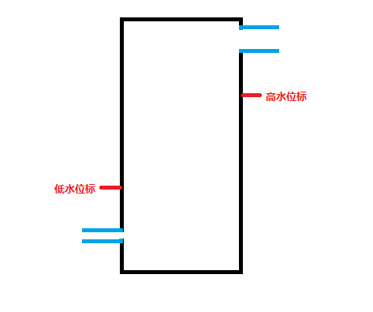


### 当连接断开时还有数据没发送完怎么办？

1. 假设当客户端(主动方)主动关闭连接时，还有数据要发送(此时POLLOUT事件被触发)，**不能直接调用 close** 关闭连接，而是应该先调用 **TcpConnection::send** 把output buffer中的数据发送完？(此时不再监听POLLOUT事件)，然后调用 **TcpConnection::shutdown** 再关闭**本方的写端**，此时处于**半关闭状态**。

2. 当客户端(主动方)写端关闭后，服务器(被动方)read到0时，说明连接关闭了(**此时会触发POLLIN事件**)，然后就走下面的 [连接关闭流程](#连接关闭流程)，最后调用close关闭fd(读/写都关闭了)。

3. 当客户端(主动方)read到0时，说明对端也关闭了，**此时会触发 POLLIN | POLLHUP 事件**，走下面的 [连接关闭流程](#连接关闭流程) ，最后close fd。这样双方连接都正常关闭了。<u>POLLHUP：说明是被挂起了，并没有完全关闭</u>。

服务器作为主动方关闭时有数据没发完，和上面同理。


### 客户端/服务器连接的断开

[连接的断开](./muduo源码剖析.md)

read 返回值为0时，说明连接已经断开，接下来会做下面这几件事情：

1. 将TCP连接对应的事件从EventLoop上移除
2. 调用用户的connectionCallback_ (只是为了打印以下信息或其他操作？)
3. 将TcpConnection从TcpServer中移除
4. 将fd从EventLoop上移除
5. 关闭套接字fd，TcpConnectionPtr引用计数为0时，析构对象时会调用close关闭socket。

#### 连接关闭流程图<a id="连接关闭流程"></a>

```mermaid
graph LR
TcpConnection::handleRead --> read=0 --> TcpConnection::handleClose 
TcpConnection::handleClose --> 1.将TCP连接对应的事件从EventLoop上移除[1.channel_->disableAll]
TcpConnection::handleClose --> 2.调用用户的connectionCallback_[2.connectionCallback_]
TcpConnection::handleClose --> TcpServer::removeConnection --> 3.将TcpConnection从TcpServer中移除[3.connections_.erase]
TcpServer::removeConnection --> TcpConnection::connectDestroyed --> 4.将fd从EventLoop上移除[4.Channel::remove]
TcpConnection::handleClose --> handleClose函数执行完引用计数为0[TcpConnectionPtr.usecount=0] --> 析构Socket --> 关闭套接字[5.close-fd]
```

#### 连接关闭时序图


## 监听器Acceptor

**Acceptor主要功能就是建立连接**。[连接的建立](./muduo源码剖析.md)

1. 其构造函数中完成了<u>创建监听套接字(socket)</u>，<u>绑定端口(bind)</u>，<u>**设置**监听套接字可读事件回调函数</u>这3件事情。 
2. `Acceptor::listen`函数中完成了<u>调用listen()函数</u>，在EventLoop上<u>**注册**监听套接字可读事件</u>这两件事情。
3. 当可读事件被触发，调用`Acceptor::handleRead`，`Acceptor::handleRead`中完成了调用accept得到连接套接字，创建 **TcpConnection** 对象，将连接套接字的可读事件注册到EventLoop上。

由于newConnectionCallback_回调函数中需要创建**TcpConnection**对象，而TCPServer又需要管理此对象，所以回调函数定义在TcpServer中比较合适。其实也可以定义在**TcpConnection**中，然后在通过回调通知TCPServer。

### 服务器连接的建立流程图

```mermaid
graph LR
Acceptor::handleRead --> connfd=Socket::accept --> connfd -.true.-> newConnectionCallback_
newConnectionCallback_ -.true.-> newTcpconnection --> enableReading
newConnectionCallback_ -.false.->close
connfd -.false.-> close
```

### 时序图


## 连接器Connector

Acceptor关注的是可读事件，==Connector关注的是可写事件==。**还有一点需要注意**，可写不一定表示连接建立好了，发生错误会触发可读、可写事件，所以使用`getsockopt`函数获得返回值，判断是否连接成功(0为成功)。

还有就是触发了可写事件(handleWrite)，要么是连接成功了，要么是发生了错误；从poller中移除fd，并将channel置空，停止监听写事件并停止监听fd(因为可写事件会一直触发)。

Connector只管建立连接，不用管首发数据，也就是说当建立连接成功后，就删除了channel。

步骤：

1. 调用socket创建非阻塞连接套接字。
2. 调用connect进行连接。
3. 进行返回值判断(因为是非阻塞fd，所以返回值可能五花八门)：
   - 0、EINPROGRESS、EINTR、EISCONN：表示正在连接。
   - EAGAIN、EADDRINUSE、EADDRNOTAVAIL、ECONNREFUSED、ENETUNREACH：表示可以重连的错误。
   - EACCES、EPERM、EAFNOSUPPORT、EALREADY、EBADF、EFAULT、ENOTSOCK：表示直接关闭的错误。

### Connector的超时重连<a id="Connector的超时重连"></a>

connect返回错误时会进行自动重连，注册一个重连定时器，初始超时时间是0.5s，**随着重连次数的增多超时时间也会变长**，每次重连【超时时间】都会乘2，直到达到最大超时间隔==30s==。


### 客户端建立连接流程图

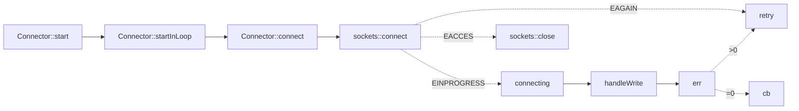


### Connector时序图


## 服务器TcpServer

管理多个TcpConection，有个映射表ConnectionMaps


## 客户端TcpClient

管理一个TcpConection。

### TcpClient的自动重连功能

```c++
bool retry_;   // atomic  重连，是指连接建立之后又意外断开的时候是否重连
void enableRetry() { retry_ = true; }
```

需要开启retry_ 选项，当连接建立之后又意外断开的时候，会调用`connector_->restart()` 进行重连。


## 应用层缓冲区Buffer<a id="Buffer"></a>

### 内核有缓冲区为什么还需要应用层缓冲区？

简单来说，就是为了避免在读取/写入数据的时候应用程序被阻塞住，导致不能执行其他操作。

- 当应用程序发送数据时，由于对方接收的很慢导致**滑动窗口写满**了，write就会阻塞，但是应用程序并不关心阻塞的问题，它只是要把数据发送出去，所以我们就要把没有发送的**应用层数据**暂存到一个缓冲区中，当内核的发送缓冲区又有空间了再把剩余的数据写入，那么就需要设置一个**应用层的发送缓冲区(output buffer)**。

- 当应用程序接收数据时，有可能空间不够**没有一次性读完**，导致数据不完整的情况，对于水平触发模式(LT)就会一直触发可读事件(POLLIN)，导致忙等待(busy loop)，对于这种情况就需要一个**应用层的接收缓冲区(input buffer)**把内核中的数据全部读出来。

### inputBuffer


### outputBuffer


### Buffer设计的要求

1. **既要一次性能够读取足够多的数据**。
2. **又不能占用大量内存**。

### Buffer::readFd<a id="Buffer::readFd"></a>

如果有5K个连接，每个连接就要分配64K+64K的缓冲区(input buffer + output buffer)的话，将占用640M内存，而大多数时候，这些缓冲区的使用率很低。使用 [readv](../LinuxSystemProgramming.md) + **临时栈上空间** 就可以巧妙的解决这个问题。Buffer::readFd()就是这么设计的。

```c
ssize_t readv(int fd, const struct iovec *iov, int iovcnt);	// 分散读：按照iov数组的顺序，先填满一个缓冲区，再填写下一个缓冲区。
```

先在栈上准备一个65536字节extrabuf，iov第一个数组指向inputBuffer 中的[writable](#writable)部分，第二个数组指向extrabuf。如果 [writable](#writable) 读满了，就读到extrabuf中，然后再把extrabuf Append到Buffer中。**这么设计的好处**：

- 一个是使用临时栈上空间，**避免**了开巨大Buffer造成**内存浪费**。
- **减少了反复调用 read 的开销**。(通常调用一次 readv 系统调用就能读完全部的数据)


### Buffer的数据结构

```c++
std::vector<char> buffer_;  // 可变长数组
size_t readerIndex_;        // 读位置 从这个位置开始读
size_t writerIndex_;        // 写位置 从这个位置开始写
```

```bash
/// A buffer class modeled after org.jboss.netty.buffer.ChannelBuffer
///
/// @code
/// +-------------------+------------------+------------------+-------------------+
/// | prependable bytes |  readable bytes  |  writable bytes  |					|
/// |                   |     (CONTENT)    |                  |					|
/// +-------------------+------------------+------------------+-------------------+
/// |                   |                  |                  |					|
/// 0      <=      readerIndex   <=   writerIndex    <=     size			  capacity
/// @endcode
```

**一个**vector**数组**，使用**两个**下标**索引**，分割出**三个区域**：vector存储的是char类型，两个索引一个指向可读部分的起始位置(==readerIndex==)，一个指向可写位置的起始位置(==writerIndex==)，三个区域分别指的是预留部分、可读部分、可写部分。

size：**vector.size**，非capacity。muduo中写入之前需resize(数据大小)，但是vector是会自动扩容的，capacity有可能不和size相同。

可读部分的长度(**readable**) = writerIndex - readerIndex。<a id="readable"></a>

可写部分的长度(**writable**) =  size - writerIndex。<a id="writable"></a>

预留部分的长度(**prependable**) = readerIndex - 0。<a id="prependable"></a>

readerIndex 和 writerIndex 肯定满足以下条件：

```bash
0 <= readerIndex <= writerIndex <= vector.capacity
```

**Buffer初始化**：<a id="Buffer初始化"></a>

预留部分的初始大小([prependable](#prependable))为8字节，可读部分的初始大小([readable](#readable))为0字节，可写部分的初始大小([writable](#writable))为1024字节。那么初始化时，readerIndex和writerIndex指向的位置是相同的。如下图：

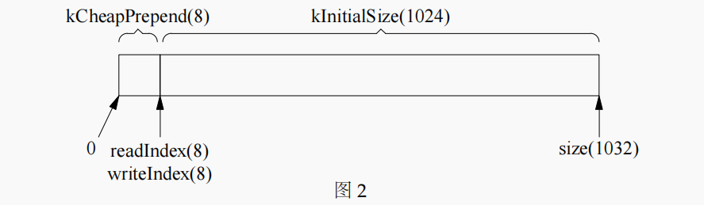

为什么使用vector作为底层容器？

- vector是可变长的，且自动回收内存。

为什么使用索引不使用指针？

- vector扩容时，迭代器会失效。

### 基本的读写操作

1. 读取n字节数据后，readerIndex向后移动n字节，writerIndex保持不变。
2. 写入n字节数据后，writerIndex向后移动n字节，readerIndex保持不变。
3. 当全部数据读取完后，readerIndex 和 writerIndex 复位到 [初始位置](#Buffer初始化) 以备下一次使用。


### 长度不够用了怎么办？

长度不够用了，肯定就要扩充可写部分 [writable](#writable)，在muduo中有两种扩充 [writable](#writable) 的方法：

1. 内部腾挪：如果 prepend **闲置**的空间太多，就把可读部分的数据往前面挤一挤()，然后看看 [writable](#writable) 的空间够不够。
2. 扩充空间：调用vector.resize()在后面扩容。

#### 内部腾挪

有时候经过多次读写，readIndex移到了比较靠后的位置，导致留下了巨大的 [prependable](#prependable) 空间，如下图：

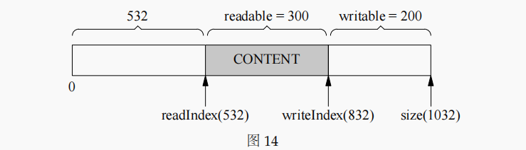

如果此时想写入300字节的数据，就会导致writable的空间不够，但是前面 [prependable](#prependable) 又有很多**闲置**的空间被浪费。针对这种情况，muduo中先比较 [prependable](#prependable) + [writable](#writable) 的长度是否小于 **需要写入的数据长度 + 8(kCheapPrepend)**，如果小于说明目前还有空间进行存储。那么接下来就做如下操作：

1. 把 [readable](#readable) 部分的数据移动到kCheapPrepend位置，同时 readIndex 和 writeIndex 也跟着改变。
2. 然后再把新数据从 writeIndex 位置开始拷贝。如下图：

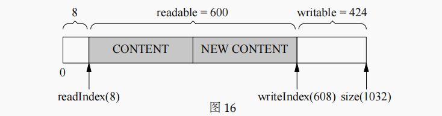

为什么要这么做呢？目的是**减少一次resize的过程**，反正resize后还是要把数据拷贝到**新分配**的内存中的，还不如这原来的内存进行腾挪。


#### 扩充空间

如果 [prependable](#prependable) + [writable](#writable) 的长度大于 **需要写入的数据长度 + 8(kCheapPrepend)** ，说明即使进行内部腾挪空间也不足以容纳所有数据，那么就只能使用resize进行扩容了。可以尝试使用reserve。


### prepend的作用

一般在prepend部分存储消息的长度。例如消息长度为200字节，那么就把200这个整数存储到prepend。

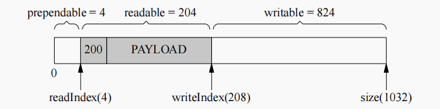

先把 readIndex 往前移4字节，再把200进行写入。


### Buffer的线程安全性<a id="Buffer的线程安全性"></a>

Buffer本身不是线程安全的，因为vector不是线程安全的。

但是Buffer不必是线程安全的。

- **对于 input buffer 来说**，input buffer是在用户的回调函数**onMessage**进行操作的，而onMessage函数始终是在TcpConnection所属的线程中进行执行的。只要不把Buffer暴露给其他线程(也不需要暴露给其他线程，在onMessage中进行解密，反序列化之后再交给其他线程)，**Buffer类不必是线程安全的**。
- **对于output buffer来说**，用户程序并不直接操作它，而是调用**TcpConnection::send()**函数来发送数据。如果send()是在TcpConnection所属的IO线程调用的则直接对 output buffer 进行操作，如果send()是在其他线程调用的则使用**EventLoop::runInLoop()**函数转到IO线程上去操作，总之output buffer总是在IO线程上去操作的，不会有线程安全的问题。当然，跨线程的函数转移调用肯定会涉及到**用户数据的拷贝**。

综上：Buffer类不必是线程安全的，也避免了加锁导致性能降低。


reference:

https://blog.csdn.net/qq_41868108/article/details/105905682

https://blog.csdn.net/yolo_yyh/article/details/118367979

https://www.likecs.com/show-203883515.html?sc=1500

https://blog.csdn.net/weixin_43705457/article/details/104405603


# base 库

## Date.h

  ```
int julianDayNumber_;
  ```

 algorithm and explanation see:

  http://www.faqs.org/faqs/calendars/faq/part2/

  http://blog.csdn.net/Solstice

## TimeZone.h

  ```c++
struct TimeZone::Data
{
  vector<detail::Transition> transitions;
  vector<detail::Localtime> localtimes;
  vector<string> names;
  string abbreviation;
};

std::shared_ptr<Data> data_;
  ```


## Timestamp.h

gettimeofday(2)入选原因（这也是muduo::Timestamp class的主要设计考虑） ：
1． time(2)的精度太低， ftime(3)已被废弃； clock_gettime(2)精度最高， 但是其系统调用的开销比gettimeofday(2)大。
2． 在x86-64平台上， gettimeofday(2)不是系统调用， 而是在用户态实现的， 没有上下文切换和陷入内核的开销32。
3． gettimeofday(2)的分辨率（resolution） 是1微秒， 现在的实现确实能达到这个计时精度， 足以满足日常计时的需要。 muduo::Timestamp用一个int64_t来表示从Unix Epoch到现在的微秒数， 其范围可达上下30万年。

## Atomic.h

C/C++ 中数值操作，如自加 (n++) 自减 (n- -) 及赋值 (n=2) 操作都不是原子操作。


# 日志库

muduo日志库总体可分为 **多线程同步日志** 和 **多线程异步日志**。

## 多线程同步日志

### Logger类

#### Logger类图


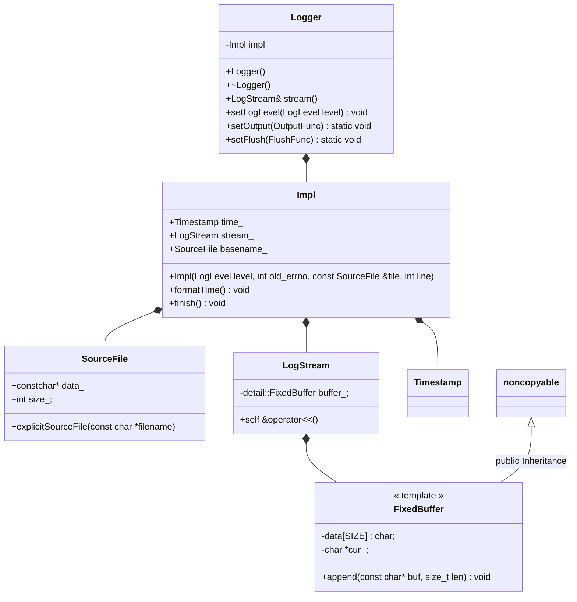


#### Logger类时序图


首先创建一个 **Logger** 对象，然后调用 **Logger::stream()** 方法，返回一个 **LogStream** 的对象，再调用LogStream的重载运算符 **operator<<()** 输出日志。

#### Logger类调用流程


实际上的实现会更加细一点，在Logger类的内部有嵌套**Impl类**来负责实际的实现， Logger类就是负责一些日志的级别，是外层的一个日志类；而Impl类借助LogStream类**重载 << 运算符**来输出日志到一个缓冲区**FixedBuffer**中，然后当Logger对象析构的时候通过 **刷新缓冲区** 再输出到标准输出或文件(==默认是输出到标准输出==)。

以 LOG_INFO 为例，其宏定义如下：

```c++
#define LOG_INFO                                          \
    if (muduo::Logger::logLevel() <= muduo::Logger::INFO) \
    muduo::Logger(__FILE__, __LINE__).stream()
```

使用方法如下：

```c++
LOG_INFO << "Hello";
```

通过宏定义可知，调用时要做下面几件事情：

1. **构造Logger临时对象，返回LogStream对象**。

   Logger类内部有一个Impl类型的属性，Impl类内部有LogStream类型和SourceFile类型的属性，所以在构造时先构造LogStream对象，构造SourceFile对象，再构造Impl对象，最后调用Logger构造函数。构造[SourceFile](#SourceFile)时在其构造函数中处理传入的路径得到文件名；构造 [Impl](#Impl)时在其构造函数中组装日志头部并写入缓冲区。所以说：当Logger对象构造完成时，[日志头部](#日志头部)就已经写入到[缓冲区](#FixedBuffer)了。

2. **日志消息写入LogStream**。

   通过调用 Logger::stream() 函数返回[LogStream](#LogStream)对象，通过operator<<把**日志正文**写入到[缓冲区](#FixedBuffer)中。

3. **Logger临时对象析构，刷新缓冲区，输出日志**。

   当临时对象析构时，调用Logger析构函数，在析构函数中会把 [日志尾部](#日志尾部) 添加到[缓冲区](#FixedBuffer)中组成一条完整的日志，然后调用g_output输出日志。

以下是muduo日志库的默认消息格式:


#### 如何设置日志级别？

1. 程序运行之前调用setLogLevel()。

```c++
muduo::Logger::setLogLevel(muduo::Logger::ERROR);
```

2. 或者根据initLogLevel() 设置muduo环境变量。

```c++
Logger::LogLevel initLogLevel()
{
	if (::getenv("MUDUO_LOG_TRACE"))
    	return Logger::TRACE;
    else if (::getenv("MUDUO_LOG_DEBUG"))
        return Logger::DEBUG;
    else
        return Logger::INFO;
}
```

```bash
export MUDUO_LOG_TRACE=1
```


#### 如何设置输出到指定文件中？

```c++
typedef void (*OutputFunc)(const char *msg, int len);
typedef void (*FlushFunc)();

static void Logger::setOutput(OutputFunc out) { g_output = out; }
static void Logger::setFlush(FlushFunc flush) { g_flush = flush; }
```

通过**setOutput**函数来指定输出到哪里，借助**setFlush**函数进行缓冲区刷新。因为**g_output**也是只能输出到指定 设备/文件 的缓冲区，**g_flush**函数刷新一下才能真正输出到指定位置。

通常使用 **LogFile** 对象来托管一个文件指针，然后把 [LogFile::append](#LogFile::append) 和 [LogFile::flush](#LogFile::flush) 通过 setOutput 和 setFlush设置到 Logger 对象中，这样就实现了一个输出到文件的==多线程同步日志==的功能。例：

```c++
std::unique_ptr<muduo::LogFile> g_logFile;
void outputFunc(const char *msg, int len) { g_logFile->append(msg, len); }
void flushFunc() { g_logFile->flush(); }

int main()
{
    string filename = "文件名";
	g_logFile.reset(new muduo::LogFile(::basename(name), 200 * 1000));
  	muduo::Logger::setOutput(outputFunc);
  	muduo::Logger::setFlush(flushFunc);
    
	std::string line = "1234567890 abcdefghijklmnopqrstuvwxyz ABCDEFGHIJKLMNOPQRSTUVWXYZ ";
	LOG_INFO << line;
}
```

### Impl类<a id="Impl"></a>

Impl类的主要功能是**组装一条完整的日志**。日志头 + 正文 +日志尾 组成一条完整的日志。

1. 在构造函数函数中将**日志头部信息**（日期、时间、线程tid、日志级别<a id="日志头部"></a>）通过LogStream对象写入到缓冲区中。

2. 在 **Impl::finish()** 函数中间**日志尾部信息**（文件名、行号<a id="日志尾部"></a>）通过LogStream对象写入到缓冲区中。文件名通过 [SourceFile](#SourceFile)获得，行号通过`__LINE__`获得。

```bash
日期      时间     微秒     线程  级别  正文     源文件名:       行号
20220306 09:15:44.681220Z  4013 WARN  Hello - Logging_test.cpp:75
```


### SourceFile类<a id="SourceFile"></a>

SourceFile类的主要作用就是**处理** `__FILE__` 返回的**路径**，最终得到**文件名**。

主要算法：利用 **strrchr** 函数找到字符 **‘/’** 最后出现的位置，然后指针加1就得到了文件名。

例如：传进路径 /home/xxx/test.c ，经过处理最终得到文件名 test.c

### LogStream类<a id="LogStream"></a>

LogStream类重载一系列 **operator<<** 运算符，用来将日志消息**格式化为字符串**，并将格式化后的字符串存入 4K(kSmallBuffer) 大小的固定缓冲区中。

```c++
typedef LogStream self;
self& operator<<(bool v);
self& operator<<(short);
self& operator<<(unsigned short);
self& operator<<(int);
self& operator<<(unsigned int);
self& operator<<(long);
self& operator<<(unsigned long);
self& operator<<(long long);
self& operator<<(unsigned long long);
self& operator<<(const void*);
self& operator<<(float v);
self& operator<<(double);
self& operator<<(char v);
self& operator<<(const char* str);
self& operator<<(const unsigned char* str);
self& operator<<(const string& v);
self& operator<<(const StringPiece& v);
self& operator<<(const Buffer& v);
buffer_.append(...);
```

### FixedBuffer类(固定缓冲区)<a id="FixedBuffer"></a>

FixedBuffer类主要由两个数据成员来构成：一个是char类型的数组，一个是指向数组中**可写区域起始位置**的指针，数组的长度由**非类型模板参数SIZE**来指定。固定缓冲区模型如下：

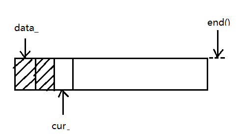

data_：起始位置指针

cur_：当前位置指针

end()：末尾位置指针，data_ + sizeof data_;

缓冲区中数据长度length()：cur_ - data_

剩余空间avail()：end() - cur_

复位reset()：cur_ = data_，不必清空数据，因为下次从头写时数据就被覆盖了。

写入数据append：memcpy(cur_, buf, len); cur += len;

### LogFile类

LogFile类主要提供**滚动日志**的功能。

#### LogFile类图

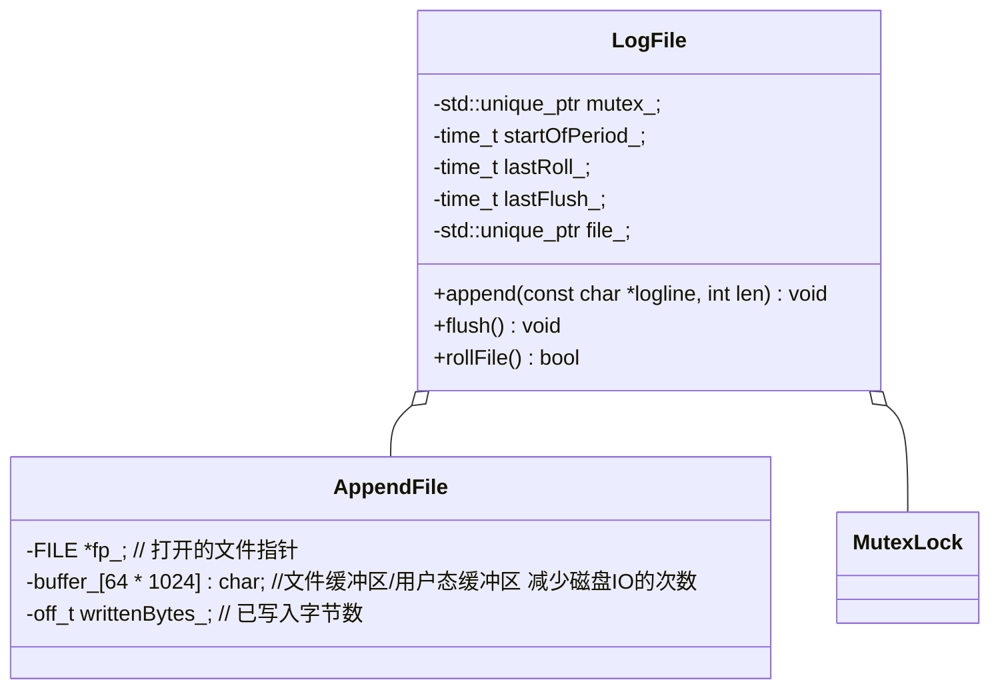

#### 日志滚动

##### 日志滚动条件

- **文件大小**（例如：每写满1G换下一个文件）
- **时间**（每天零点新建一个日志文件，不论前一个文件是否写满）

日志滚动时需要获取新的文件名。

##### 获取新日志文件名

默认文件名格式：

```bash
basename now     hostname pid  ".log"
文件名.年月日-时分秒.主机名.进程PID.log
logfile_test.20130411-115604.popo.7743.log
```

basename：基础名，由用户指定，通常可设为应用程序名。

now：日志滚动时的时间，格式: "%Y%m%d-%H%M%S"。

hostname：主机名，通过gethostname获取。

pid：进程号, 通常由OS提供, 通过getpid获取。

".log" 固定后缀名, 表明这是一个log文件。

#### LogFile::append<a id="LogFile::append"></a>

封装了AppendFile::append。

```c++
void LogFile::append(const char *logline, int len) {
    if (mutex_) {
        MutexLockGuard lock(*mutex_);
        append_unlocked(logline, len);
    }
    else {
        append_unlocked(logline, len);
    }
}
```

#### LogFile::flush<a id="LogFile::flush"></a>

封装了AppendFile::flush。

```c++
void LogFile::flush() {
    if (mutex_) {
        MutexLockGuard lock(*mutex_);
        file_->flush();
    }
    else {
        file_->flush();
    }
}
```


### AppendFile类

AppendFile类主要包含三个属性：**文件指针**(FILE*) 、**文件缓冲区**buffer_ (64K)和记录**已写入字节数**的变量writtenBytes_(供LogFile类使用)。

AppendFile类封装了打开文件(fopen)、关闭文件(fclose)、写入文件(fwrite_unlocked)、刷新文件(fllush)的底层接口。

AppendFile类采用RAII的方式管理文件指针，即构造时打开(fopen)，析构时关闭(fclose)。AppendFile::append通过一个**循环**来确保所有数据都写到文件上。

#### 为什么要设置文件缓冲区？

```c++
::setbuffer(fp_, buffer_, sizeof buffer_);  // 缓冲区超过 sizeof(buffer_) 大小也会自动刷新的
```

减少写IO次数，提高效率。

#### 为什么要使用fwrite_unlocked？

AppendFile类的线程安全性由上一层(LogFile)来保证，所以在append执行写入操作可以不必加锁，同时也提高了效率。

------

多个线程对同一个文件写入 会比 单线程对文件写入效率高吗？不一定。IO总线可能不是并行的。

同步写日志可能会阻塞在文件IO上，如何解决多线程同步写日志的效率问题？使用下面的异步日志。

## 多线程异步日志

#### AsyncLogging类图

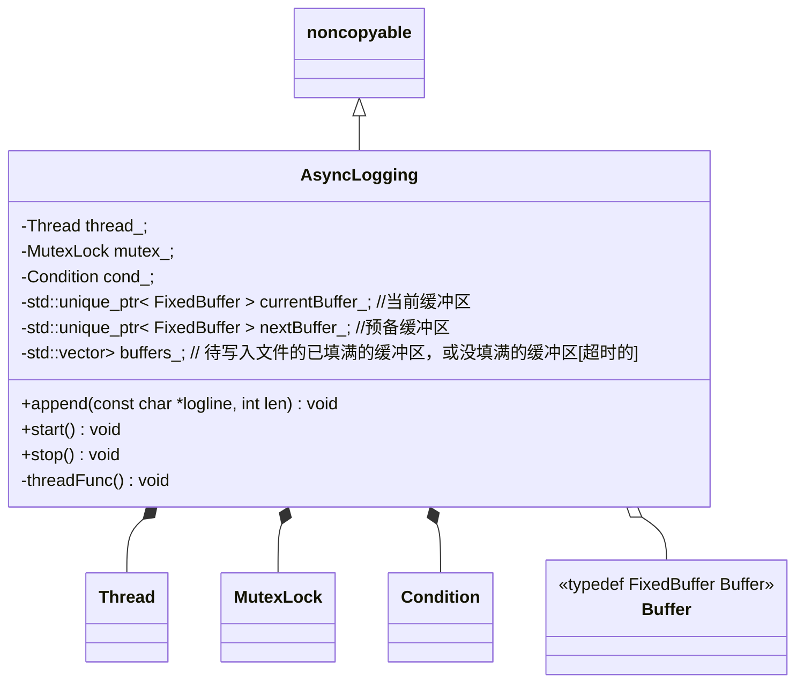


#### 多线程程序日志库要求

1. 线程安全，即多个线程可以并发写日志，两个线程的日志消息不会出现**交织**。怎样避免出现 **“交织**”：
   1. 用一个全局的mutex保护IO。缺点：**造成全部线程抢占一个锁**。
   2. 每个线程单独写一个日志文件。缺点：**有可能让业务线程阻塞在写磁盘操作上**。

#### muduo设计的方法

用一个背景线程(**后台线程/日志线程**)负责<u>收集日志消息</u>，并<u>写入日志文件</u>。其他业务线程只管往这个“日志线程”发送消息，这称为“异步日志”。虽然日志不是实时写入的，但是不影响前端线程并发的写日志(也就是说**前端线程不会被写IO阻塞住**，因为它并没有往文件写)。

这种方法其实是**生产者与消费者**模式的应用：

- 前端：业务线程(生产者) 多个

- 后端：日志线程(消费者) 1个

消息队列不为满时，生产者往消息队列(blockingQueue)中添加日志消息；消息队列不为空时，消费者从消息队列中取日志，写入到文件中。

但是只要消息队列不为空，就会执行写文件，这样一来写文件的操作就太频繁了，为了避免这一情况可以采用**多缓冲机制(multiple buffering**)。

AsyncLogging使用双缓冲机制


currentBuffer_：当前缓冲区

nextBuffer_：预备缓冲区

buffers_：存放 **写满的缓冲区** 或者 **因超时还未写满的缓冲区** 的缓冲区队列。


newBuffer1：空闲缓冲区1

newBuffer2：空闲缓冲区2

buffersToWrite：用于和buffers_ 交换 的缓冲区队列。交换后buffers_就清空了。

总体思想：我们让业务线程不去直接写文件，而是让它们把日志先写到缓冲区中，当**缓冲区被写满**或者**超过刷新时间**时，我们就把当前缓冲区放到缓冲区队列中；然后通知日志线程队列中有数据了，接下来日志线程就从缓冲区队列中依次取出buffer写入文件。

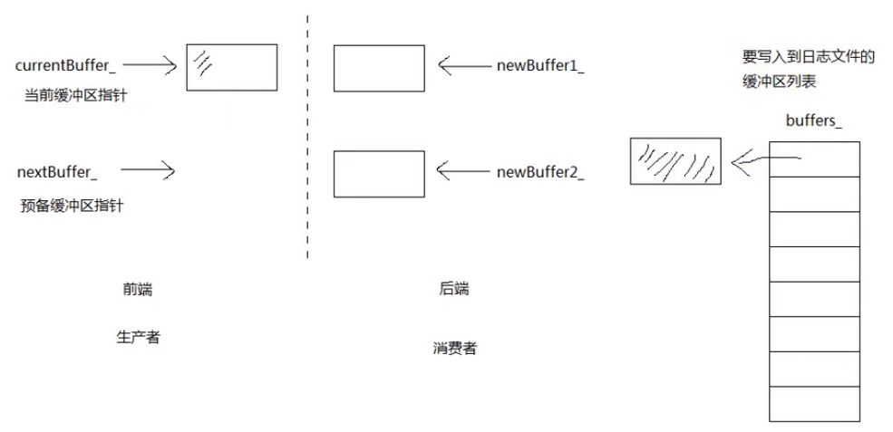

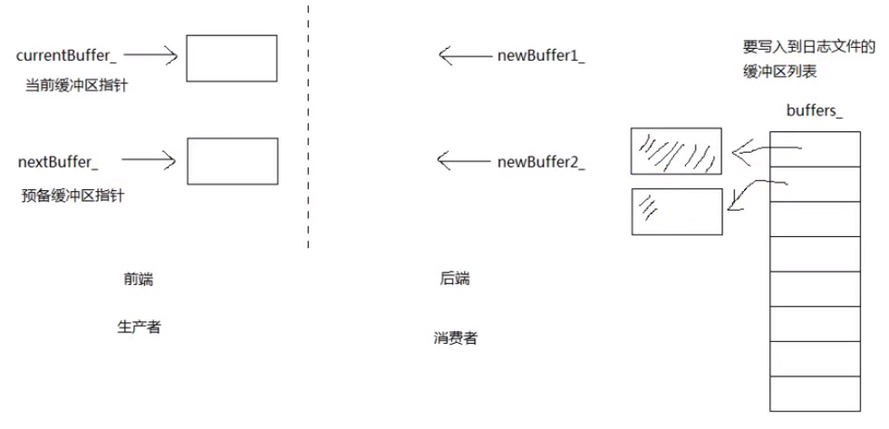

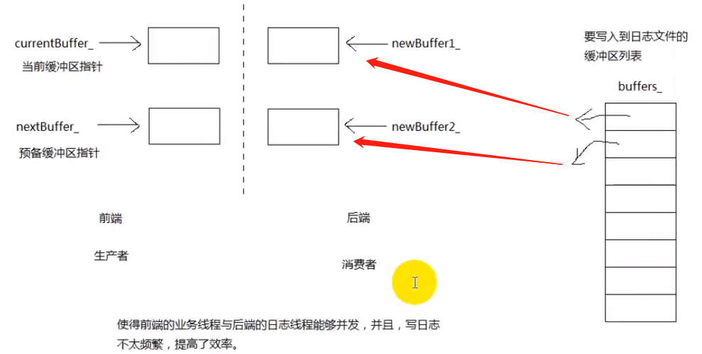


1. 多个业务线程向**当前缓冲区**currentBuffer_ 写日志，当写满时，放入**缓冲区队列** buffers_ 中，并把**预备缓冲区** nextBuffer_设置为当前缓冲区，最后**通知**日志线程。见图1。
2. 日志线程收到通知加锁，把当前缓冲区也放入buffers_ 中(即使它还没写满)，然后把**空闲缓冲区**(newBuffer1)设置为当前缓冲区，把**空闲缓冲区2**(newBuffer2)设置为预备缓冲区，**交换 buffers_ 和 buffersToWrite**。然后遍历buffersToWrite中的缓冲区，把缓冲区中的数据写入文件中，数据写完后，把buffersToWrite中最后两块缓冲区分别设置为newBuffer1和newBuffer2，最后清空buffersToWrite。

业务线程是通过条件变量来通知日志线程的，当业务线程日志量比较大时总会抢到锁，导致**缓冲区不够用**(currentBuffer_ 和 nextBuffer_都写满了)，muduo中处理方法是：`currentBuffer_.reset(new Buffer);`分配新的缓冲区。这样就会导致**消息堆积**的问题，解决方法如下。

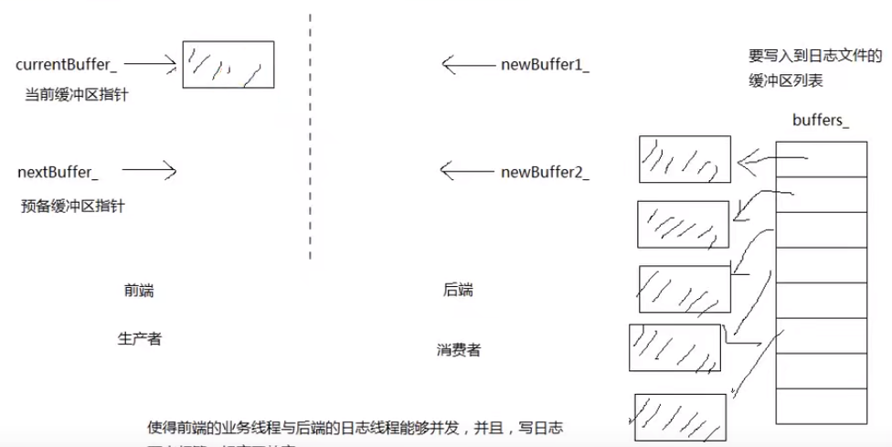

#### 消息堆积

消息堆积是指前端(业务线程)陷入死循环，拼命发送日志消息，超过后端(日志线程)的处理能力，这就是典型的**生产速度超过消费速度**的问题。这种情况会造成数据在内存中堆积，严重时引发性能问题：**可用内存不足**或**程序崩溃**(分配内存失败)。

##### 处理消息堆积的方法

当待写入缓冲区队列 buffersToWrite 中的缓冲区数量超过25块时，只保留前两块，其余的全部丢掉。

##### 25的含义

每块缓冲区4M，25块缓冲区，共100M。假设磁盘的写速度为100M/S。也就是说，在日志线程写文件时，业务线程**1秒产生了100M**的数据，填满了25块缓冲区。

所以实际应用中，只有产生数据的速度不到磁盘写速度的 1/10 才不会收到明显影响。

# Reactor线程模型

## 1.单线程Reactor

**单线程reactor(one loop per thread)----->事件的监听，IO的读写，业务计算都在同一个线程处理。**

没有事件触发的时候，线程等待在select/poll/epoll等函数上，事件到达后进行读IO，解码，计算，编码，写IO等一系列操作。==这种模式适用于IO密集的应用，不太适合CPU密集的应用。==


实际项目应用中，这种模型应该并不常用。

代码目录：muduo/examples/sudoku/server_basic.cc

Server_basic.cc是一个并发服务器，可以同时服务多个客户端连接，但是是单线程的。

其中最关键的是onMessage()函数，主要用来从缓冲区读取数据，并调用processRequest()去处理请求，其中全部的IO和计算任务都在同一个线程中进行。

## 2.单Reactor+线程池

**单线程reactor + threadpool ----> 事件的监听，IO的读写放在reactor线程处理，业务计算放到线程池。**(==能适应密集计算==)

主线程负责监听事件，读写IO，线程池中的线程负责业务计算。这种模式适用于计算任务彼此独立，而且IO压力不大的场景，有乱序返回的可能，==客户端要根据id来匹配响应。==

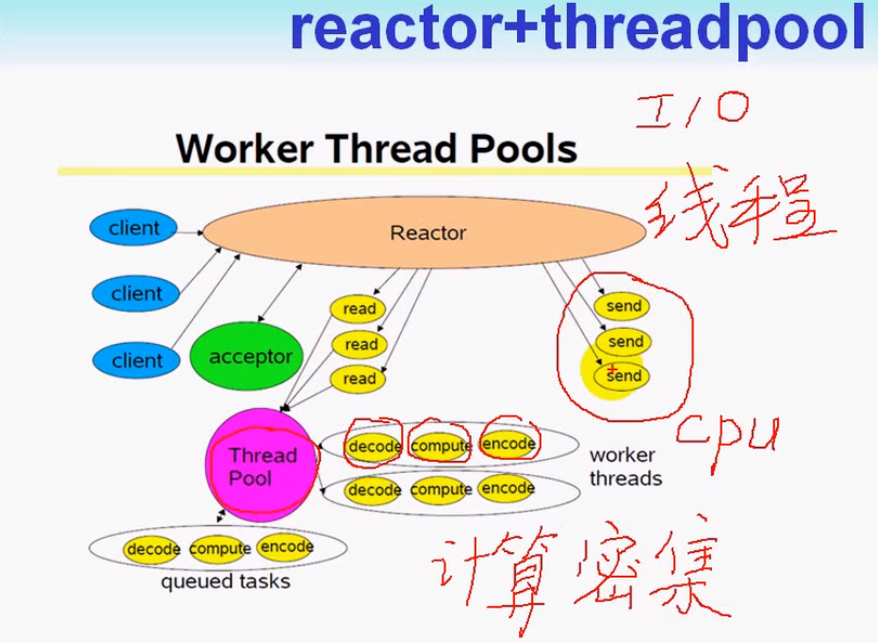


代码目录：muduo/examples/sudoku/server_threadpool.cc

与方案1的区别是多了ThreadPool对象，线程池大小由numThreads_指定，然后processRequest()中计算的部分由ThreadPool去执行。这种方案有乱序返回的可能，所以要根据id来匹配响应。

## 3.多Reactor(主从Reactor)

**主reactor线程(accept线程) + 子reactor线程：主reactor线程负责监听新连接的到来，然后把新连接分发给子reactor线程， 子reactor线程负责监听事件，读写IO以及业务计算。**（==能适应更大的突发IO==）

$\color{red} {muduo采用轮询方式选择sub Reactor}$，$\color{green} {该连接的所有操作都在那个sub Reactor所处的线程中完成。}$优点是能保证请求的顺序性，程序的总体处理能力不会随着连接增加而下降，适应性强，所以是muduo的默认多线程模型。

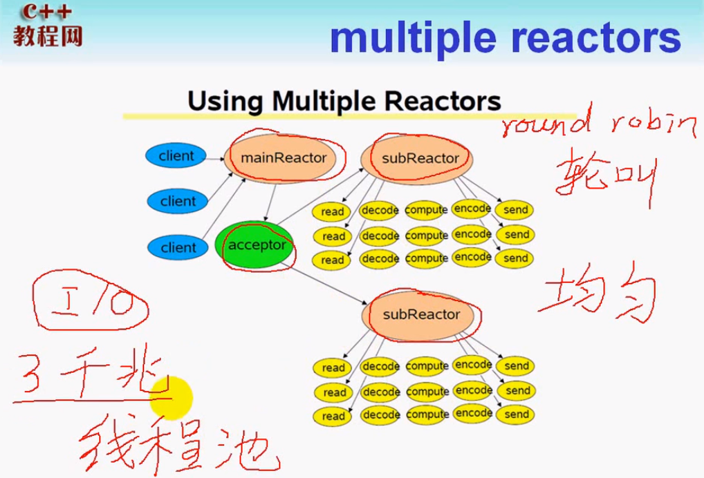


代码目录：muduo/examples/sudoku/server_multiloop.cc

这种模式下只需要设置`server_.setThreadNum(numThreads_)`即可。TcpServer在这种模式下用Acceptor的EventLoop接受新连接，然后用EventLoop pool里的EventLoop去处理新连接IO。

## 4.主从Reactor + 线程池

主reactor线程(accept线程) + 子reactor线程 + threadPool:  **主reactor线程负责监听新连接的到来，然后把新连接分发给子reactor线程， 子reactor线程负责监听事件，读写IO, 业务计算在线程池中处理)**（==适应突发IO和密集计算==）

既有多个Reactor来处理IO，也使用线程池来处理计算，这种模式适合既有突发IO，又有突发计算的应用。**相当于一个IO线程的线程池和一个业务线程池**。

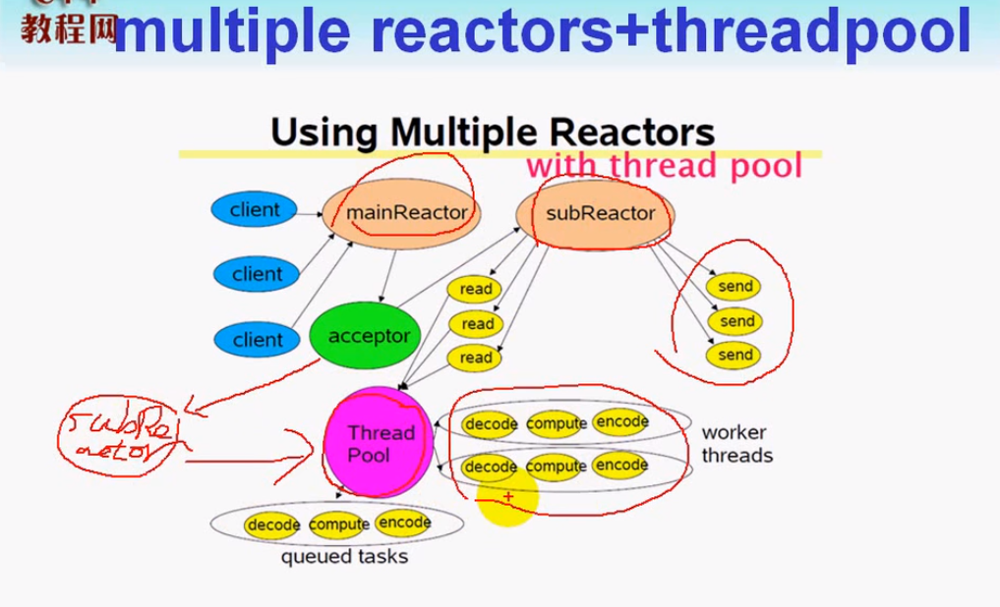


如何确定使用多少个EventLoop呢？

根据ZeroMQ手册的建议，按照每千兆比特每秒的吞吐量配一个event loop的比例来设置event loop的数目（即muduo::TcpServer::setThreadNum()的数量），所以在编写运行于千兆以太网上的网络程序时，用一个event loop就足以应付网络IO。==如果TCP连接有优先级之分，那使用一个event loop不太合适，最好是把高优先级的连接用单独的event loop来处理。==


# Proactor模式(异步IO)

- 理论上proactor 比 reactor 更高效一些。

- 异步IO能够让IO操作与计算**重叠**。充分利用DMA(直接存储访问)特性。

- linux异步IO
  - glibc aio (aio_*)，有bug
  - kernal native aio (io_*)，也不完美。目前仅支持O_DIRECT方式来对磁盘读写，跳过系统缓存。要自己实现缓存，难度不小。
- boost asio 实现的proactor，实际上并不是真正意义上的异步IO，底层是用epoll来实现的，模拟异步IO的。

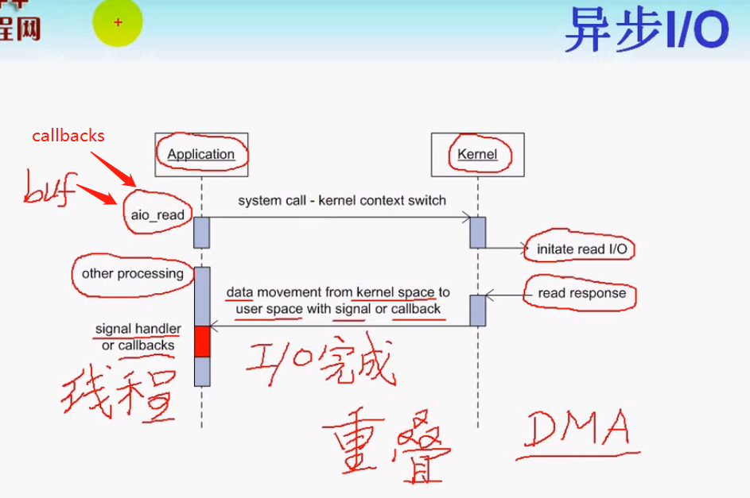


https://zhuanlan.zhihu.com/p/85101271/

https://blog.csdn.net/qq_36533978/article/details/107975165?spm=1001.2014.3001.5501

https://www.cnblogs.com/fortunely/p/16127237.html#%E5%AE%9A%E6%97%B6%E4%BB%BB%E5%8A%A1

https://www.cnblogs.com/ailumiyana/p/10087539.html

https://www.cyhone.com/articles/analysis-of-muduo/


​    


