# net库

## muduo网络库模块组成

### moduo类图

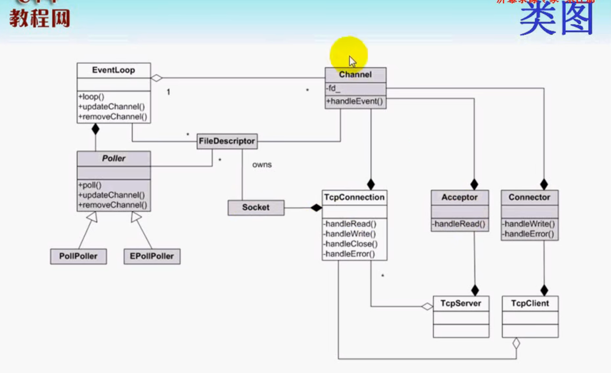

根据muduo类图，总体可以划分为以下几个部分。

- Reactor反应器：EventLoop、Poller、Channel
- 连接器：Connector
- 监听器：Acceptor
- 连接：TcpConnection
- 服务器和客户端：TCPServer、TCPClient。
- 定时器：TimerQueue
- 唤醒机制：Eventfd

总体来说muduo网络库是一个Reactor模型，Reactor模式中有一个循环的过程(one loop per thread)，并且提供注册事件、监听事件、分发事件的接口。muduo中主要由EventLoop、Poller、Channel这三个类来实现。

说白了Reactor就是用来注册、监听、分发事件的，而事件总体又可分为可读、可写事件，所以模块又可以这么划分：

监听可读事件：**Eventfd**的接收到通知属于可读，**Timer**定时器到期属于可读，**Accptor**新连接到来属于可读，**关闭连接**属于可读，**连接套接字**有数据可读，**连接关闭**属于可读。

监听可写事件：**Connector**连接成功属于可写。


## 反应器Reactor

### Channel

1. ==发起==事件更新。Channel::update() --> EventLoop::updateChannel() -> Poller::updateChannel()。最终是在Poller中更新事件。
2. ==封装==了fd事件所对应的回调函数。EventLoop::loop() -> Poller::poll() -> Channel::handleEvent()。最终在Channel中处理事件。

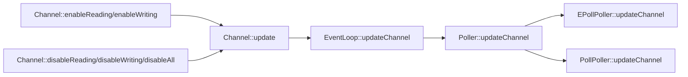

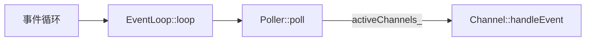

调用Channel::remove之前一定要先调用disableAll。

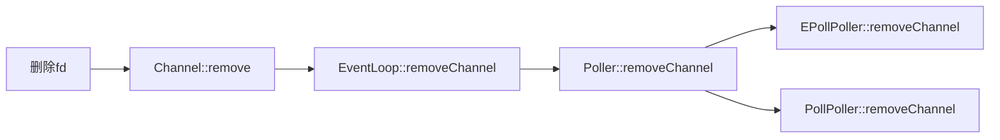


### Poller

1. ==封装了poll、epoll==。是EventLoop的成员函数，使用unique_ptr来管理。

### EventLoop

1. 提供事件循环EventLoop::loop()。

2. eventloop从poller拿到就绪的channel，然后遍历channel去处理事件。

#### 怎么保证一个线程只拥有一个EventLoop对象的？

1. 使用线程局部存储： `__thread EventLoop *t_loopInThisThread = 0;`

2. 进行判空：

   ```c++
   if (t_loopInThisThread)
   {
   	// 如果当前线程已经创建了EventLoop对象，终止(LOG_FATAL)
       LOG_FATAL << "Another EventLoop " << t_loopInThisThread << " exists in this thread " << threadId_;
   }
   ```

   

### 时序图

更新事件时序图：

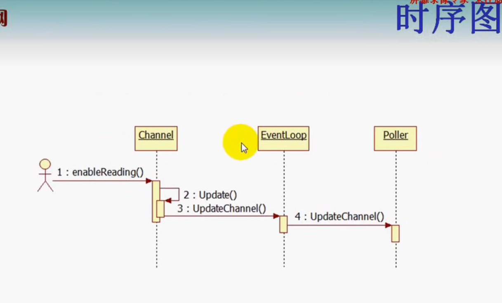


获取就绪通道，分发事件 时序图：

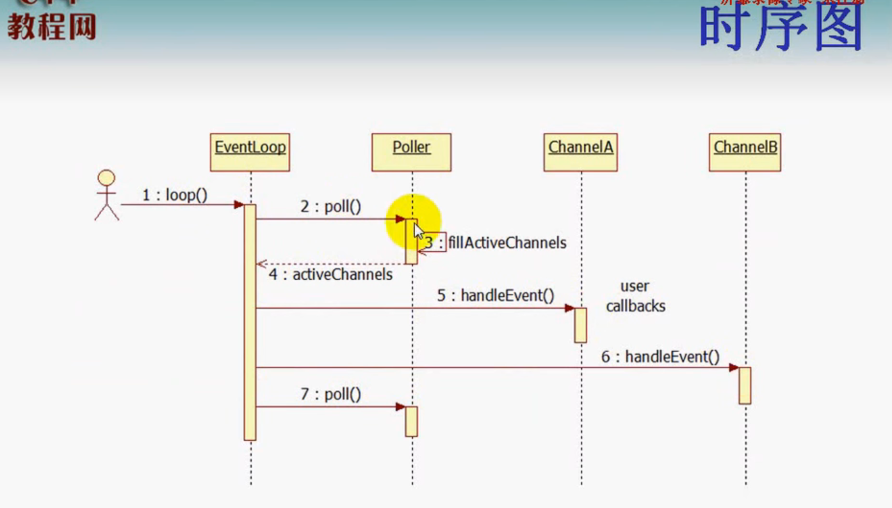


## 定时器TimerQueue

TimerQueue封装了 [timerfd_create](../LinuxSystemProgramming.md) 等系统调用。**TimerQueue在构造时，就会把timerfd注册到poller，并监听读事件。**

==一个timerfd可以对应多个定时器任务==。这是怎么做到的呢，一般不都是一个定时器对应一个任务？**准确的说是多个定时器任务可以复用同一个timerfd。**我们在Timer类中存储定时器回调函数、超时时间、超时间隔、定时器序号等参数，然后把不同的Timer存储在TimeList(定时器队列)中。

```c
typedef std::pair<Timestamp, Timer *> Entry;
typedef std::set<Entry> TimerList;  // 按照pair的规则排序，先比较时间戳再比较指针
typedef std::pair<Timer *, int64_t> ActiveTimer;	// ActiveTimer 将Timer和sequence组成一对主要作用来索引迭代的.
typedef std::set<ActiveTimer> ActiveTimerSet; // 按照pair的operator<排序，先比较指针再比较时间戳。
```

### 为什么使用pair来存储时间戳和Timer？

**为了解决定时器超时时间相同的情况**，使用pair将时间戳和Timer地址组成一对，再使用set来存储。

### 为什么使用set来存储pair？

利用set的排序功能，按照时间戳排序，然后把==第一个==Timer的超时时间(也就是最先到期的时间)设置到 ==timerfd_settime== 中，等到timefd可读时，从TimerList中取出==所有超时==的定时器事件进行处理；<u>如果是周期性定时器，则把定时事件重新添加到定时器队列中。</u>

### 添加定时任务


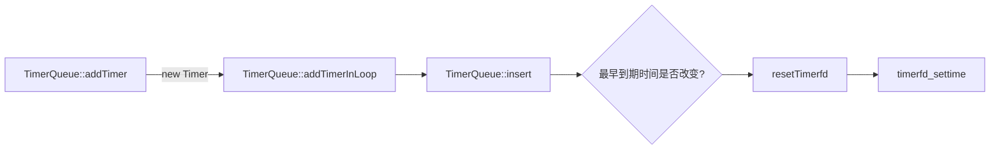


### 处理超时任务


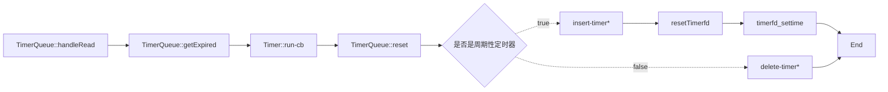

### 删除定时任务

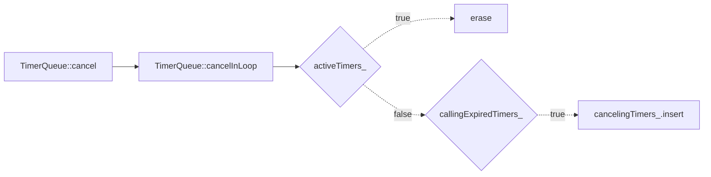


### 时序图

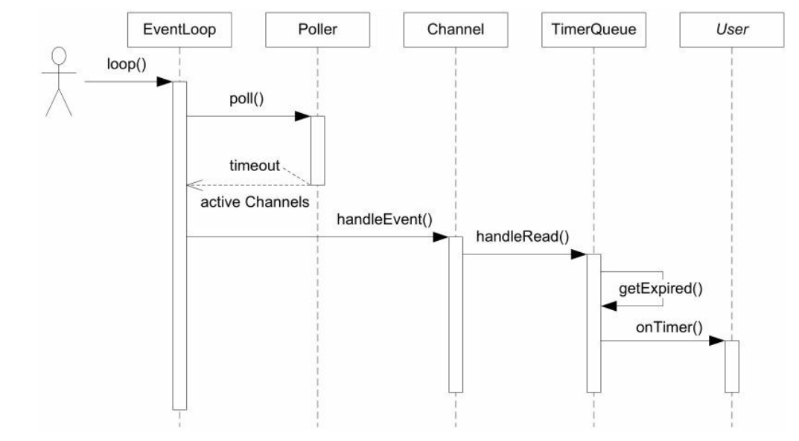


### timerfd_*入选的原因：

1. sleep(3) / alarm(2) / usleep(3)在实现时有可能用了SIGALRM信号， 在多线程程序中处理信号是个相当麻烦的事情， 应当尽量避免， 再说， 如果主程序和程序库都使用SIGALRM， 就糟糕了。
2. nanosleep(2)和clock_nanosleep(2)是线程安全的， 但是在非阻塞网络编程中， 绝对不能用让线程挂起的方式来等待一段时间， 这样一来程序会失去响应。 正确的做法是注册一个时间回调函数。
3. getitimer(2)和timer_create(2)也是用信号来deliver超时，在多线程程序中也会有麻烦。timer_create(2)可以指定信号的接收方是进程还是线程， 算是一个进步， 不过信号处理函数（signal handler） 能做的事情实在很受限。
4. `timerfd_create(2)`把时间变成了一个文件描述符， 该“文件”在定时器超时的那一刻变得可读， 这样就能很方便地融入select(2)/poll(2)框架中， 用统一的方式来处理IO事件和超时事件， 这也正是Reactor模式的长处。
5. 传统的Reactor利用select(2)/poll(2)/epoll(4)的timeout来实现定时功能， 但poll(2)和epoll_wait(2)的定时精度只有毫秒，远低于timerfd_settime(2)的定时精度。


## 唤醒机制

eventfd的作用就是为了解决==其他线程==向eventloop添加任务时，不能得到及时执行的问题。

### 为什么需要唤醒？

[muduo源码剖析](./muduo源码剖析.md)

其他线程向EventLoop添加任务的时候，会把任务放到 pendingFunctors_ 中，而 pendingFunctors_ 是在每轮循环的最后才会调用。只有在epoll_wait有事件触发的时候才会唤醒每一轮循环，如果一直没有事件被触发，那么其他线程添加的任务就会一直不被执行**(因为程序一直阻塞在epoll_wait，走不到doPendingFunctors 函数**)。


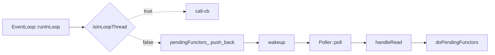


## socket连接TcpConnection


## 监听器Acceptor

**Acceptor主要功能就是建立连接**。

1. 其构造函数中完成了<u>创建监听套接字(socket)</u>，<u>绑定端口(bind)</u>，<u>**设置**监听套接字可读事件回调函数</u>这3件事情。 
2. `Acceptor::listen`函数中完成了<u>调用listen()函数</u>，在EventLoop上<u>**注册**监听套接字可读事件</u>这两件事情。
3. 当可读事件被触发，调用`Acceptor::handleRead`，`Acceptor::handleRead`中完成了调用accept得到连接套接字，创建 **TcpConnection** 对象，将连接套接字的可读事件注册到EventLoop上。

### 流程图

```mermaid
graph LR
Acceptor::handleRead --> connfd=Socket::accept --> connfd -.true.-> newConnectionCallback_
newConnectionCallback_ -.true.-> newTcpconnection --> enableReading
newConnectionCallback_ -.false.->close
connfd -.false.-> close
```


### 时序图

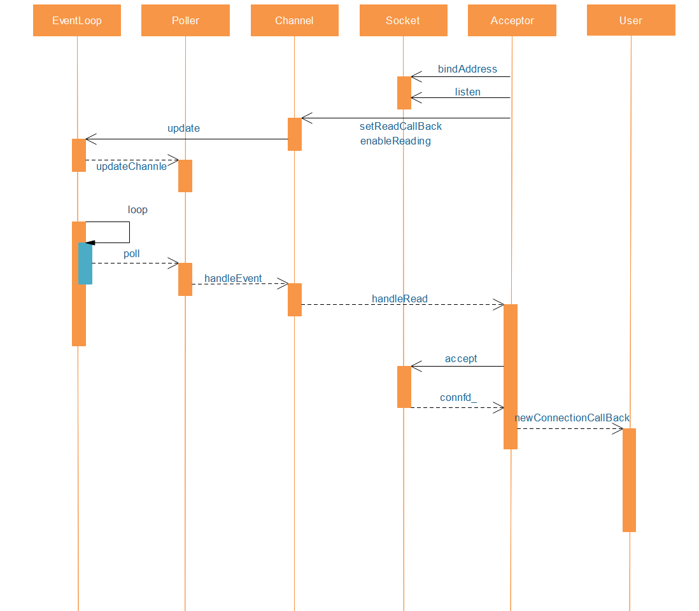


## 连接器Connector

Acceptor关注的是可读事件，==Connector关注的是可写事件==。**还有一点需要注意**，可写不一定表示连接建立好了，发生错误会触发可读、可写事件，所以使用`getsockopt`函数获得返回值，判断是否连接成功(0为成功)。

还有就是触发了可写事件(handleWrite)，要么是连接成功了，要么是发生了错误；从poller中移除fd，并将channel置空，停止监听写事件并停止监听fd(因为可写事件会一直触发)。

Connector只管建立连接，不用管首发数据，也就是说当建立连接成功后，就删除了channel。

步骤：

1. 调用socket创建非阻塞连接套接字。
2. 调用connect进行连接。
3. 进行返回值判断(因为是非阻塞fd，所以返回值可能五花八门)：
   - 0、EINPROGRESS、EINTR、EISCONN：表示正在连接。
   - EAGAIN、EADDRINUSE、EADDRNOTAVAIL、ECONNREFUSED、ENETUNREACH：表示可以重连的错误。
   - EACCES、EPERM、EAFNOSUPPORT、EALREADY、EBADF、EFAULT、ENOTSOCK：表示直接关闭的错误。

### Connector的超时重连<a id="Connector的超时重连"></a>

connect返回错误会进行重连，注册一个重连定时器，初始超时时间是0.5s，**随着重连次数的增多超时时间也会变长**，每次重连【超时时间】都会乘2，直到达到最大超时间隔==30s==。


### 建立连接流程图

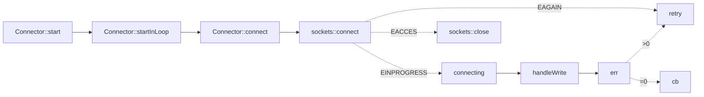


### Connector时序图

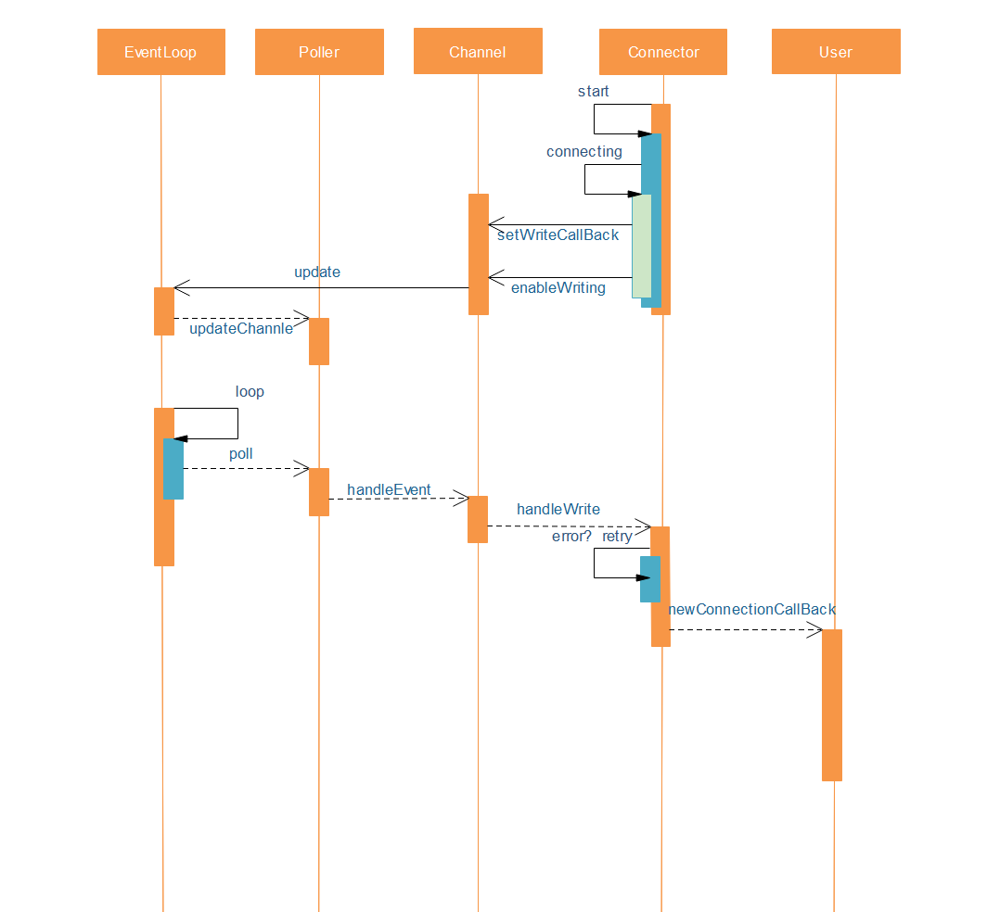


## 服务器TcpServer

管理多个TcpConection，有个映射表ConnectionMaps


## 客户端TcpClient

管理一个TcpConection。


缓冲区Buffer

日志库

同步日志

异步日志


reference:

https://blog.csdn.net/qq_41868108/article/details/105905682

https://blog.csdn.net/yolo_yyh/article/details/118367979

https://www.likecs.com/show-203883515.html?sc=1500

https://blog.csdn.net/weixin_43705457/article/details/104405603


# base 库

## Date.h

  ```
int julianDayNumber_;
  ```

 algorithm and explanation see:

  http://www.faqs.org/faqs/calendars/faq/part2/

  http://blog.csdn.net/Solstice

## TimeZone.h

  ```c++
struct TimeZone::Data
{
  vector<detail::Transition> transitions;
  vector<detail::Localtime> localtimes;
  vector<string> names;
  string abbreviation;
};

std::shared_ptr<Data> data_;
  ```


## Timestamp.h

gettimeofday(2)入选原因（这也是muduo::Timestamp class的主要设计考虑） ：
1． time(2)的精度太低， ftime(3)已被废弃； clock_gettime(2)精度最高， 但是其系统调用的开销比gettimeofday(2)大。
2． 在x86-64平台上， gettimeofday(2)不是系统调用， 而是在用户态实现的， 没有上下文切换和陷入内核的开销32。
3． gettimeofday(2)的分辨率（resolution） 是1微秒， 现在的实现确实能达到这个计时精度， 足以满足日常计时的需要。 muduo::Timestamp用一个int64_t来表示从Unix Epoch到现在的微秒数， 其范围可达上下30万年。

### static_assert

### boost::less_than_comparable

只要实现operator<() const 就可自动实现<=,>,>=

less_than_comparable.cpp

### boost::equality_comparable

只要实现operator==() const ,就能自动实现operator !=()const

less_than_comparable.cpp

### gmtime_r


## Atomic.h

C/C++ 中数值操作，如自加 (n++) 自减 (n- -) 及赋值 (n=2) 操作都不是原子操作。

### gcc提供的常用原子性操作

```c++
// 原子自增操作，将value更新到*ptr，并返回操作之前*ptr的值
type __sync_fetch_and_add(type* ptr, type value)
    
// 原子比较和交换(设置)操作
// 比较*ptr与oldval的值，如果两者相等，则将newval更新到*ptr并返回操作之前*ptr的值
type __sync_val_compare_and_swap(type* ptr, type oldval, type newval)
// 比较*ptr与oldval的值，如果两者相等，则将newval更新到*ptr并返回true
bool __sync_bool_compare_and_swap(type* ptr, type oldval, type newval)
    
// 原子赋值操作，将*ptr设置为value,对*ptr加锁, 并返回*ptr操作之前的值.
type __sync_lock_test_and_set(type* ptr, type value) 

// 使用这些原子性操作，编译的时候需要加-march=cpu-type
// cpu-type就是cpu体系结构:(如:native, i386, pentium等) 
```

references: [Gcc内置原子操作__sync_系列函数简述及例程](https://zhuanlan.zhihu.com/p/32303037)

### volatile

[volatile](../../../3github/ElegantTest/test_cpp/keyword/volatile/volatile.md)


## Exception.h

### backtrace

栈回溯，保存各个栈帧的地址

### backtrace_symbols

根据地址，转成相应的函数符号。

backtrace_symbols 内部会调用malloc, 返回的指针需要由调用者释放。

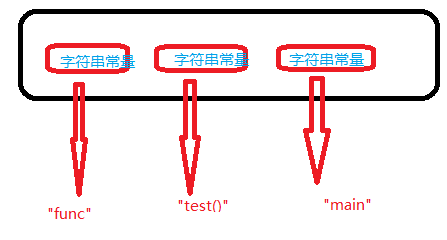

### abi::__cxa_demangle

把函数符号转换成函数名

## Logging.h

### Logger类

Logger类时序图:

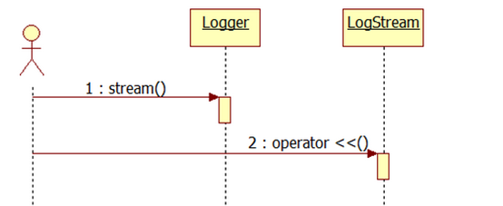

首先创建一个Logger对象，然后调用stream()方法，返回一个LogStream的对象，再调用LogStream的重载运算符operator <<()输出日志，这是比较宏观的。
		实际上的实现会更加细一点，在Logger类的内部有嵌套Impl类来负责实际的实现， Logger类就是负责一些日志的级别，是外层的一个日志类；而Impl类是借助LogStream类来输出日志的，LogStream对象重载<<运算符来输出日志。
		事实上，日志类是先输出到缓冲区**FixedBuffer**，然后再输出到标准输出或文件， 通过g_output函数来指定输出到哪里，借助g_flush函数刷新。因为g_output也是只能输出到指定设备/文件 的缓冲区，g_flush函数刷新一下才能真正到指定位置。

下面是类的调用流程:


以下是muduo日志库的默认消息格式:

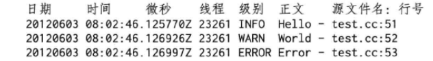


### Impl类

类内私有类

### SourceFile类

类内共有类


# Reactor线程模型

## 1.单线程Reactor

**单线程reactor(one loop per thread)----->事件的监听，IO的读写，业务计算都在同一个线程处理。**

没有事件触发的时候，线程等待在select/poll/epoll等函数上，事件到达后进行读IO，解码，计算，编码，写IO等一系列操作。==这种模式适用于IO密集的应用，不太适合CPU密集的应用。==

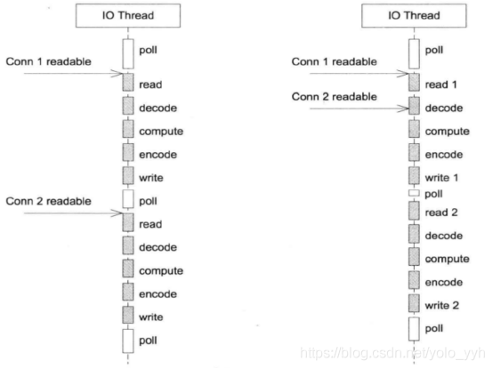

实际项目应用中，这种模型应该并不常用。

代码目录：muduo/examples/sudoku/server_basic.cc

Server_basic.cc是一个并发服务器，可以同时服务多个客户端连接，但是是单线程的。

其中最关键的是onMessage()函数，主要用来从缓冲区读取数据，并调用processRequest()去处理请求，其中全部的IO和计算任务都在同一个线程中进行。

## 2.单Reactor+线程池

**单线程reactor + threadpool ----> 事件的监听，IO的读写放在reactor线程处理，业务计算放到线程池。**

主线程负责监听事件，读写IO，线程池中的线程负责业务计算。这种模式适用于计算任务彼此独立，而且IO压力不大的场景，有乱序返回的可能，==客户端要根据id来匹配响应。==

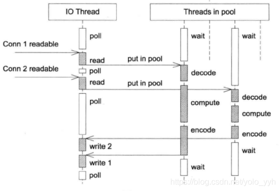

代码目录：muduo/examples/sudoku/server_threadpool.cc

与方案1的区别是多了ThreadPool对象，线程池大小由numThreads_指定，然后processRequest()中计算的部分由ThreadPool去执行。这种方案有乱序返回的可能，所以要根据id来匹配响应。

## 3.多Reactor(主从Reactor)

**主reactor线程(accept线程) + 子reactor线程：主reactor线程负责监听新连接的到来，然后把新连接分发给子reactor线程， 子reactor线程负责监听事件，读写IO以及业务计算。**

$\color{red} {muduo采用轮询方式选择sub Reactor}$），$\color{green} {该连接的所有操作都在那个sub Reactor所处的线程中完成。}$优点是能保证请求的顺序性，程序的总体处理能力不会随着连接增加而下降，适应性强，所以是muduo的默认多线程模型。

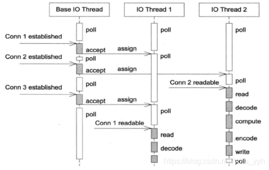

代码目录：muduo/examples/sudoku/server_multiloop.cc

这种模式下只需要设置`server_.setThreadNum(numThreads_)`即可。TcpServer在这种模式下用Acceptor的EventLoop接受新连接，然后用EventLoop pool里的EventLoop去处理新连接IO。

## 4.主从Reactor + 线程池

主reactor线程(accept线程) + 子reactor线程 + threadPool:  **主reactor线程负责监听新连接的到来，然后把新连接分发给子reactor线程， 子reactor线程负责监听事件，读写IO, 业务计算在线程池中处理)**

既有多个Reactor来处理IO，也使用线程池来处理计算，这种模式适合既有突发IO，又有突发计算的应用。

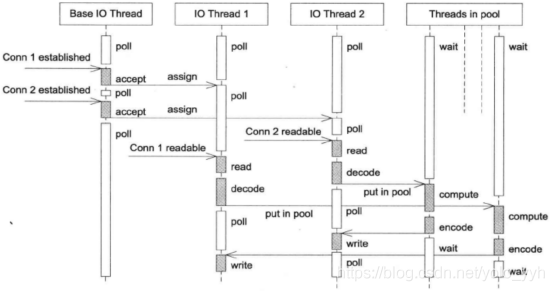

如何确定使用多少个EventLoop呢？

根据ZeroMQ手册的建议，按照每千兆比特每秒的吞吐量配一个event loop的比例来设置event loop的数目（即muduo::TcpServer::setThreadNum()的数量），所以在编写运行于千兆以太网上的网络程序时，用一个event loop就足以应付网络IO。==如果TCP连接有优先级之分，那使用一个event loop不太合适，最好是把高优先级的连接用单独的event loop来处理。==


https://zhuanlan.zhihu.com/p/85101271/

https://blog.csdn.net/qq_36533978/article/details/107975165?spm=1001.2014.3001.5501

https://www.cnblogs.com/fortunely/p/16127237.html#%E5%AE%9A%E6%97%B6%E4%BB%BB%E5%8A%A1

https://www.cnblogs.com/ailumiyana/p/10087539.html

https://www.cyhone.com/articles/analysis-of-muduo/


### 经典的服务器设计模式Reactor模式

大多数人学习Linux网络编程的起点可能都是从《UNP》开始的，书中描述的服务端程序架构基本上是一个大的while循环，程序阻塞在accept或poll函数上，等待被监控的socket描述符上出现预期的事件。事件到达后，accept或poll函数的阻塞解除，程序向下执行，根据socket描述符上出现的事件，执行read、write或错误处理。 
整体架构如下图所示： 

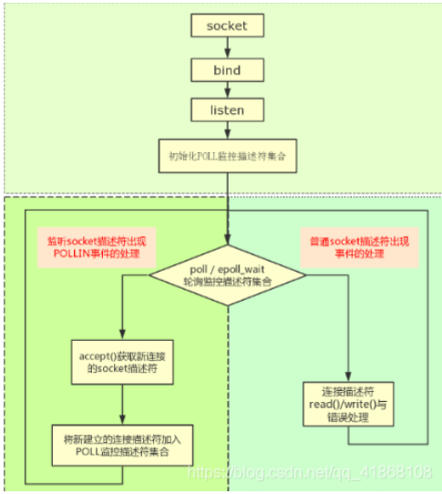

而muduo的整体风格受到netty的影响，整个架构依照Reactor模式，基本与如下图所示相符：

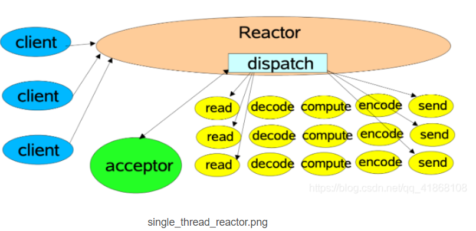


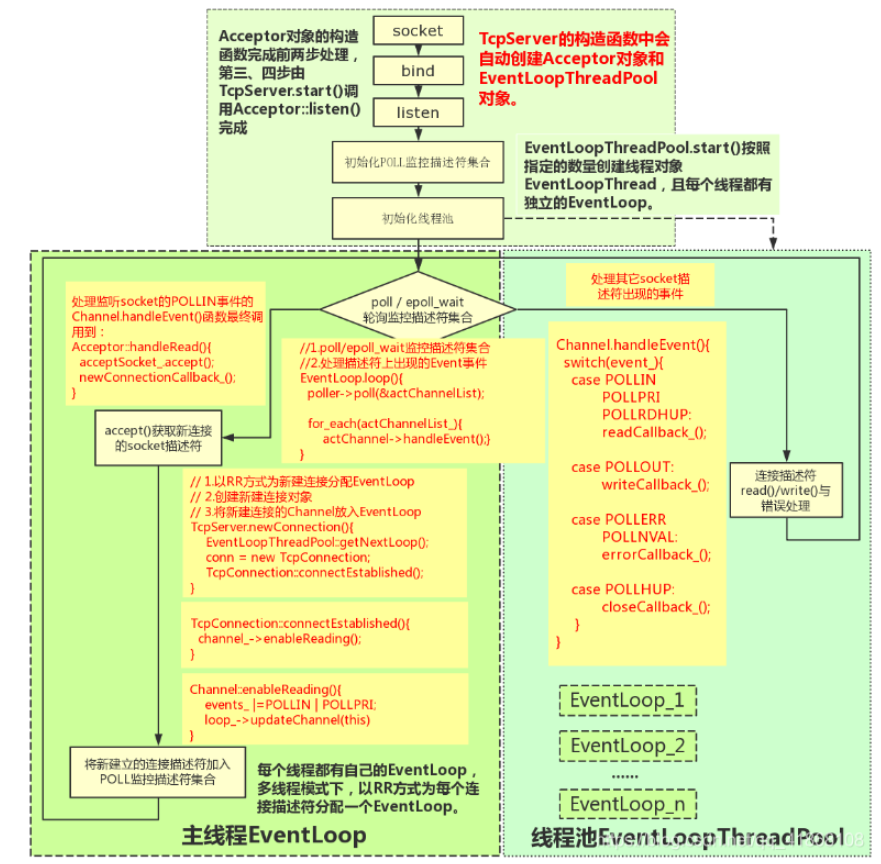


我们接下来分析下，这四个步骤在muduo中都是何时进行的：

首先在TcpServer对象构建时，TcpServer的属性acceptor同时也被建立。
在Acceptor的构造函数中分别调用了socket函数和bind函数完成了步骤1和步骤2。
即，当TcpServer server(&loop, listenAddr);$\color{red} {执行结束时，监听socket已经建立好，并已绑定到对应地址和端口了。}$
而当执行$\color{red} {server.start()}$时，主要做了两个工作：
    **1.在监听socket上启动listen函数，也就是步骤3；**
    **2.将监听socket的可读事件注册到EventLoop中。**
示意图如下:
    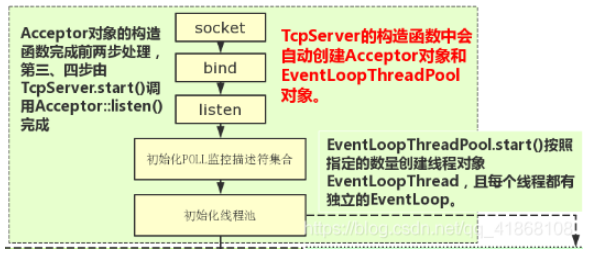


此时，程序已完成对地址的监听，但还不够，因为此时程序的主角EventLoop尚未启动。

当调用$\color{red} {loop.loop()}$时，程序开始监听该socket的可读事件。

当新连接请求建立时，可读事件触发，此时该事件对应的callback在EventLoop::loop()中被调用。

该事件的callback实际上就是$\color{red} {Acceptor::handleRead()}$方法。

在Acceptor::handleRead()方法中，做了三件事：
```
    1.调用了accept函数，完成了步骤4，实现了连接的建立。得到一个已连接socket的fd
    2.创建TcpConnection对象
    3.将已连接socket的可读事件注册到EventLoop中。
```

这里还有一个需要注意的点，创建的TcpConnnection对象是个shared_ptr，该对象会被保存在TcpServer的connections中。$\color{red} {这样才能保证引用计数大于0，对象不被释放。}$

至此，一个新的连接已完全建立好，其可读事件也已注册到EventLoop中了。

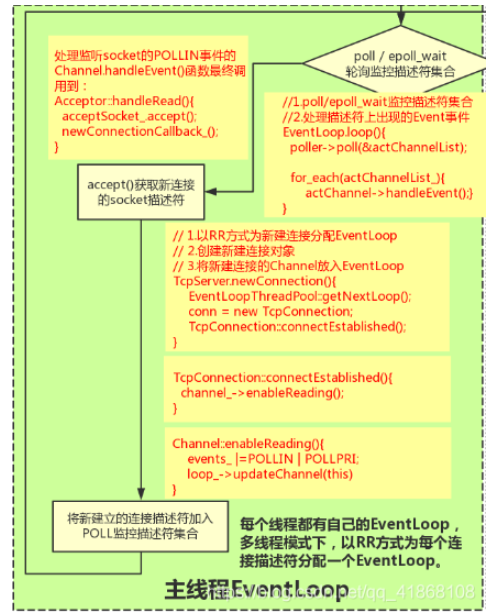


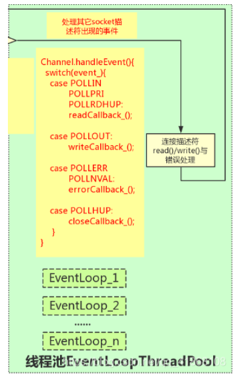
