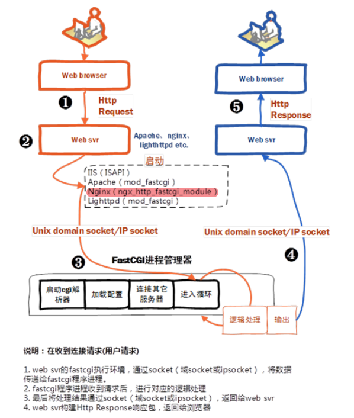

# webServer+fastcgi原理



1. ==web服务器启动时初始化fastcgi环境==。例如IIS：ISAPI、apache：mod_fastcgi、nginx：**ngx_http_fastcgi_module**、lighttpd：mod_fastcgi
2. ==Fastcgi进程管理器启动fastcgi进程。==可以启动多个cgi进程等待web服务器的连接。进程管理在启动时可以配置webserver和fastcgi进程是通过ip+port的形式进行连接还是通过Unix域套接字的形式进行连接。
3. ==客户端请求web服务器==，web服务器将请求通过socket转发给cgi进程。
4. ==fastcgi进程通过socket把处理结果返回给web服务器==，web服务器组装好响应包返回给客户端。
5. fastcgi进程不用退出，接着等待下一个进程。


spwan-fcgi功能：就是创建监听套接字，绑定端口，进行监听，创建子进程->建立新会话(脱离父进程和终端)->子进程中进行重定向(标准输入重定向到监听套接字，标准输出和标准错误重定向到/dev/null)->关闭其他fd，最后使用exec函数执行fastcgi程序。

ncserver：

# 编译spawn-fcgi-c

autogen.sh configure 这些文件由CRLF改成LF。

```bash
  ./autogen.sh
  ./configure
  make
  make install
```

或者使用cmake编译：

```
mkdir build && cd build && cmake .. 
make
make install
```


使用spawn启动fastcgi进程：

```bash
spawn-fcgi -F 1 -s /home/hchy/test.sock -f /mnt/d/WorkSpace/4openSourceCode/fcgilib/fcgi-2.4.1-SNAP-0910052249/examples/echo
set args -F 1 -s /home/hchy/test.sock -f /mnt/d/WorkSpace/4openSourceCode/fcgilib/fcgi-2.4.1-SNAP-0910052249/examples/echo
```


# 编译fcgilib

https://github.com/Seaworth/resources/blob/master/fastCGI%E5%AE%89%E8%A3%85%E5%8C%85/README.md

1. configure，config.sub，config.guess configure.in Makefile.am Makefile.in这些文件由CRLF改成LF。

2. ./configure

3. make

   出现以下错误：

   ```bash
   cd . && aclocal-1.9
   /bin/bash: aclocal-1.9: command not found
   make: *** [Makefile:320: aclocal.m4] Error 127
   ```

   解决方法：

   当前aclocal版本比makefile中的版本高，运行autoreconf -ivf重新生成configure 文件：

   ```bash
   autoreconf -ivf
   
   #其中 -i install missing
   #    -v  verbose
   #    -f  force, 认为所有文件都过时而重新生成脚本.
   ```
   
   执行autoreconf -ivf出现如下错误：
   
   ```bash
   Makefile.am: error: required file './NEWS' not found
   Makefile.am: error: required file './README' not found
   Makefile.am: error: required file './AUTHORS' not found
   Makefile.am: error: required file './ChangeLog' not found
   ```
   
   则运行
   
	```bash
	touch NEWS ChangeLog AUTHORS README
	```
	
	再次执行autoreconf -ivf
	
4. ./configure 

5. make

  出现以下错误：

  ```bash
  /usr/bin/ld: echo-cpp.o: undefined reference to symbol 'FCGX_InitRequest'
  /usr/bin/ld: /mnt/d/WorkSpace/4openSourceCode/fcgilib/fcgi-2.4.1-SNAP-0910052249/libfcgi/.libs/libfcgi.so.0: error adding symbols: DSO missing from command line
  collect2: error: ld returned 1 exit status
  ```

  解决：

  将fcgi-2.4.1/examples/Makefile.am文件中的：

  ```bash
echo_cpp_LDADD   = $(LIBDIR)/libfcgi++.la
  ```

  修改为：

  ```bash
echo_cpp_LDADD   = $(LIBDIR)/libfcgi++.la $(LIBDIR)/libfcgi.la
  ```

-------------------------

其他错误：

```bash
1. checking for C compiler warning flags... -Wall
   checking that generated files are newer than configure... done
   configure: creating ./config.status
   .in'ig.status: error: cannot find input file: `Makefile
https://stackoverflow.com/questions/62662905/inig-status-error-cannot-find-input-file-makefile/68999840

 dos2unix configure.ac
```


# 配置nginx+fastcgi

```nginx
 server {
                listen 80;
                server_name localhost;

                location / {
                        include fastcgi_params;
                        fastcgi_pass 127.0.0.1:9090;
                }
                # location / {
                #       include proxy_params;
                #       proxy_pass http://127.0.0.1:9090;
                # }
}
```


# 配置nginx+uwsgi

```nginx
 server {
    listen 80;
    server_name localhost;

    location / {
        include uwsgi_params;
        uwsgi_pass 127.0.0.1:9090;
    }
    # location / {
    #       include proxy_params;
    #       proxy_pass http://127.0.0.1:9090;
    # }
}
```

