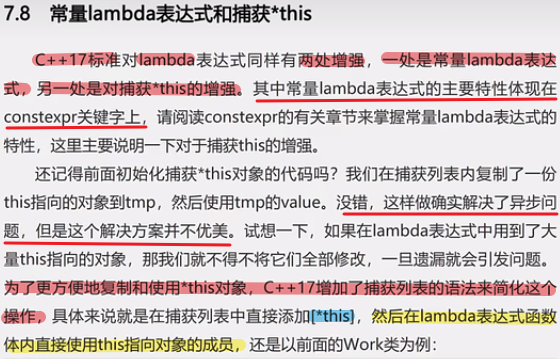
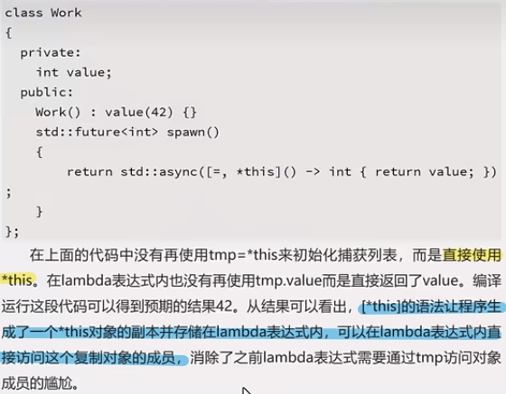

# auto
## auto推导规则

## auto使用场景

1. 迭代器类型
2. lambda类型
3. std::bind返回值类型(functional)

## auto返回类型推导

### 3.4返回类型推导

### 3.5 lambda表达式中使用auto类型推导

### 3.6非类型模板形参占位符

### 3.7 总结

# typeid

# decltype

### 4.2 使用decltype说明符

## 推导规则

### 4.3 推导规则

### 4.4 cv限定符的推导

### 4.5 decltype(auto)

### 4.6 decltype(auto)作为非类型模板形参占位符

### 4.7 总结

# 第5章 函数返回类型后置

## 5.1使用函数返回类型后置声明函数

## 5.2 推导函数模板返回类型

## 5.3 总结

# 第6章 右值引用

## 6.1 左值和右值

## 6.2 左值引用

## 6.3 右值引用

## 6.4 右值的性能优化空间

## 6.5 移动语义

## 6.6 值类别

## 6.7 将左值转换为右值

## 6.8 万能引用和引用折叠

## 6.9 完美转发

## 6.10 针对局部变量和右值引用的隐式移动操作

## 6.11 总结

# 第7章 lambda表达式

## 7.1 lambda表达式语法

## 7.2 捕获列表

### 7.2.1 作用域

### 7.2.2 捕获值和捕获引用

### 7.2.3 特殊的捕获方法

## 7.3 lambda表达式的实现原理

## 7.4 无状态的lambda表达式

## 7.5 在STL中使用lambda表达式

## 7.6 广义捕获

## 7.7 泛型lambda表达式

## 7.8 常量lambda表达式和捕获*this

# reference

https://www.dedao.cn/ebook/detail?id=L5BbmPyQPrjybo2eO1GvAmNJnlYxV0RVRd08XDBK9qZpgkRELd75z4Ma6oDRrqjY
