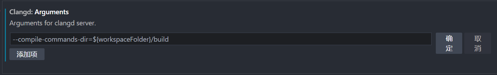

```bash
sudo apt search clangd
sudo apt install clangd-15
sudo update-alternatives --install /usr/bin/clangd clangd /usr/bin/clangd-15 100
```


wsl vscode下载的cland会放在下面目录：

```bash
\\wsl.localhost\Ubuntu-22.04\home\hchy\.vscode-server\data\User\globalStorage\llvm-vs-code-extensions.vscode-clangd\install\17.0.3\clangd_17.0.3\bin\clangd
\\wsl.localhost\Ubuntu-22.04\mnt\wslg\distro\home\hchy\.vscode-server\data\User\globalStorage\llvm-vs-code-extensions.vscode-clangd\install\17.0.3\clangd_17.0.3\bin\clangd
```

索引文件放在：

```bash
\\wsl.localhost\Ubuntu-22.04\home\hchy\.cache\clangd\index
\\wsl.localhost\Ubuntu-22.04\mnt\wslg\distro\home\hchy\.cache\clangd\index
```

配置文件放在：

```
\\wsl.localhost\Ubuntu-22.04\home\hchy\.config\clangd
\\wsl.localhost\Ubuntu-22.04\mnt\wslg\distro\home\hchy\.config\clangd
```


配置vscode intellisense

1.   disable C/C++intellisense

2.   add clangd args

     

     ```bash
     --compile-commands-dir=${workspaceFolder}/build # 指定compile_commands.json所在目录
     --completion-style=detailed # 代码补全的时候完全显示函数的参数类型
     --header-insertion=never # 避免clangd自动引入一些函数依赖的头文件
     ```

     

# reference

https://clangd.llvm.org/installation.html