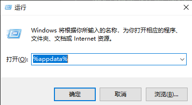

### pip

#### 安装pip

pip 官网：https://pypi.org/project/pip/

你可以通过以下命令来判断是否已安装：

```
pip --version     # Python2.x 版本命令
pip3 --version    # Python3.x 版本命令
pip -V            # 查看pip版本
```

1. 如果你还未安装，则可以使用以下方法来安装：

   ```bash
   $ curl https://bootstrap.pypa.io/get-pip.py -o get-pip.py   # 下载安装脚本
   $ sudo python get-pip.py    # 运行安装脚本
   ```

> **注意：**用哪个版本的 Python 运行安装脚本，pip 就被关联到哪个版本，如果是 Python3 则执行以下命令：
>
> ```
> $ sudo python3 get-pip.py    # 运行安装脚本。
> ```
>
> 一般情况 pip 对应的是 Python 2.7，pip3 对应的是 Python 3.x。


2. **部分 Linux 发行版可直接用包管理器安装 pip**，如 Debian 和 Ubuntu：

   ```bash
   sudo apt-get install python-pip
   sudo apt-get install python3-pip
   
   sudo apt-get auto-remove python3-pip [--purge]
   ```

   

#### 升级 pip

```bash
pip install -U pip
sudo easy_install --upgrade pip
pip install --upgrade pip
python2 -m pip install --upgrade pip

python3 -m pip install --upgrade pip	#*
```

#### 搜索包

```bash
pip search SomePackage
```

#### 安装包

```bash
pip install SomePackage              # 最新版本安装包（默认从国外的网站下载安装） 全局包一般安装在/usr/lib/python3/dist-packages/
pip install SomePackage==1.0.4       # 指定版本
pip install 'SomePackage>=1.0.4'     # 最小版本
pip install pqi --target /xxx #安装到指定位置
```

比如我要安装 Django。用以下的一条命令就可以，方便快捷。

```
pip install Django==1.7
```

#### 升级包

```
pip install --upgrade(-U) SomePackage
```

升级指定的包，通过使用==, >=, <=, >, < 来指定一个版本号。

#### 查看可升级的包

```
pip list -o
```

#### 显示安装包信息

```bash
pip show <package>        #显示包详情
pip show -f $(pip freeze | awk -F== '{print $1}') #显示所有包详情
pip show $(pip freeze | awk -F== '{print $1}') | grep 'Name\|Location' | awk -F: '{print $2}'

grep 'Name\|Location' #匹配多个字符串
or 
grep -E 'Name|Location' #匹配多个字符串

awk -F: '{print $1,$2}' #以:为分割
```

**查看指定包的详细信息**

```
pip show -f SomePackage
```

#### 卸载包

```
pip uninstall SomePackage

pip uninstall pip
python -m pip uninstall pip
```

#### 查看已安装的包

```bash
pip list                #查看所有已安装的包
pip freeze              #查看所有已安装的包以freeze的格式输出（attrs==19.3.0 Automat==0.8.0等）  
```


#### 查看源及换源

##### 永久更换镜像源

**pip.conf的位置**：

- 在Linux或macOS系统中，pip.conf通常位于`~/.pip/pip.conf`、`~/.config/pip/pip.conf`或`/etc/pip.conf`。
- 在Windows系统中，pip.conf通常位于`%APPDATA%\pip\pip.ini`或`%HOME%\pip\pip.ini`。

###### 方法一

- windows

  1. win+r 输入%appdata%

  

  2. 定位到`C:\Users\admin\AppData\Roaming`目录下，新建pip文件夹(如果没有), 在文件夹下新建一个pip.ini文件。

  3. 在新建的 pip.ini 文件中输入以下内容，然后保存。

     ```
     [global]
     timeout = 6000
     index-url = https://mirrors.aliyun.com/pypi/simple/
     trusted-host = mirrors.aliyun.com
     ```
	
- linux

  1. 需要修改~/ .pip/pip.conf (没有就创建一个)

  2. 在pip.conf配置文件中，添加配置内容：

     ```python
     [global]
     timeout = 6000
     index-url = https://mirrors.aliyun.com/pypi/simple/
     extra-index-url = https://some-other-index.com/simple
     [install]
     trusted-host = mirrors.aliyun.com
     ```

​				`index-url`是pip查找Python包的基本索引源。

​				`--extra-index-url`是pip用于查找Python包的额外索引源。

​			注意，你可以添加多个`extra-index-url`，只需要在每个URL前添加`extra-index-url =`即可。例如：

```bash
[global]  
index-url = https://pypi.org/simple  
extra-index-url =   
    https://some-other-index1.com/simple  
    https://some-other-index2.com/simple
```


###### 方法二

```bash
#查看源
python -m pip config list
#设置源
python -m pip config set global.index-url 'https://mirrors.aliyun.com/pypi/simple/'
#设置信任镜像
python -m pip config set install.trusted-host 'mirrors.aliyun.com'
```


###### 方法三

- 安装pqi模块

  ```bash
  #1、安装
  pip3 install pqi
  #2、查看当前的源
  pqi show
  #3、查看当前的可用源
  pqi ls
  #4、切换源
  pqi use username(如aliyun)
  
  # 添加源
  pqi add name https://some-other-index1.com/simple 
  
  ```
  
  

##### 临时换源

```bash
pip install package -i 国内源
    #清华源：https://pypi.tuna.tsinghua.edu.cn/simple
    #阿里源：http://mirrors.aliyun.com/pypi/simple/
    #豆瓣源：https://pypi.douban.com/simple/
pip install -i https://pypi.douban.com/simple/ numpy
pip install -i https://pypi.douban.com/simple/ --trusted-host pypi.douban.com  #此参数“--trusted-host”表示信任，如果上一个提示不受信任，就使用这个
```


# reference:

pqi仓库

https://github.com/yhangf/PyQuickInstall

linux下：Python2和python3共存

https://cloud.tencent.com/developer/article/2054162

windows下Python2和python3共存

https://cloud.tencent.com/developer/article/1994189

强制卸载安装pip

```
python3 -m pip install --upgrade pip --force-reinstall --no-warn-script-location
```

