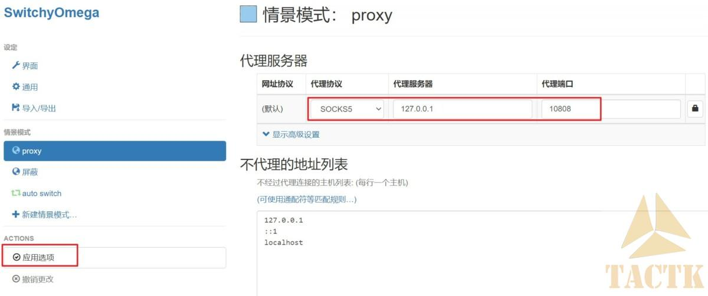
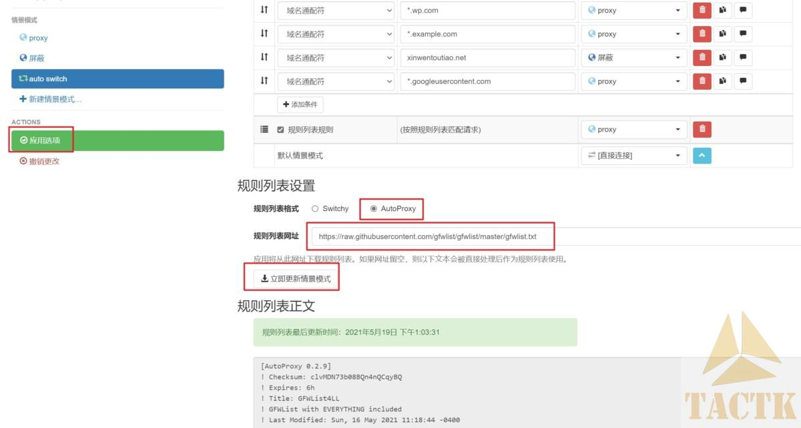

# V2ray解决浏览器安装Chrome扩展插件问题

Edge浏览器可以安装自身官方市场的插件，也可以安装Chrome市场的插件，但默认Chrome市场一般打不开。。。可以通过**V2Ray**程序+Edge市场的**SwitchyOmega**插件解决.

**V2rayN是一个基于 V2Ray内核的Windows客户端**(另外还有其他的客户端可选，不过V2rayN应该是更新维护的最好的)，也比较简单，下载软件-设置订阅地址或添加代理地址（网上有很多免费的，也有收费的），就O了. 自己百度下就有很多教程，这里我就不细说了.安装后，简单配置一下SwitchyOmega即可.

**对了，设置中有内核选择，V2fly_core和Xray_core，xray要更好一些.**

还有，最新的客户端不使用gfwlist列表了，内置了geo路由的模式.不过其**带“路由”功能,在路由设置中也可以进行Proxy与直连(direct)的设置,功能更加强大、灵活。可以定义Porxy名单模式/直连名单模式/全局模式、自定义域名/IP名单等等。**

Proxy选项，填写socks5、127.0.0.1、端口默认10808，填完点击“应用选项”；

auto switch选项：更新一个GFW列表(其实没这个列表也可以，因为v2ray内置了geo路由) 复制网址 https://raw.githubusercontent.com/gfwlist/gfwlist/master/gfwlist.txt 点击更新，应用选项即可.

这样就可以在浏览网站时根据规则列表自动切换Proxy了.如果有一些网址没有自动切换，可以自行在顶部“切换规则”添加.

比如，edge打开chrome市场插件可能会因图片无法显示而导致Image decode failed失败无法安装，把*.googleusercontent.com加入proxy规则即可.

而且也可以建一个“屏蔽”规则，把恶意网址添加为屏蔽规则使之无法打开.

**安卓**可以使用**V2RayNG**、**SagerNet**等。

另外**V2RayN+Proxifier软件**可以[解决Steam、育碧游戏(需连接UBI Connect)、Directory Opus等”国际”软件无法登陆或更新失败问题**(点击)**](https://www.tacgeek.com/p/internet-v2ray-proxifier-3896.html)。

 

references:

[V2ray解决浏览器安装Chrome扩展插件问题](https://www.tacgeek.com/explorer-proxy-5011.html)