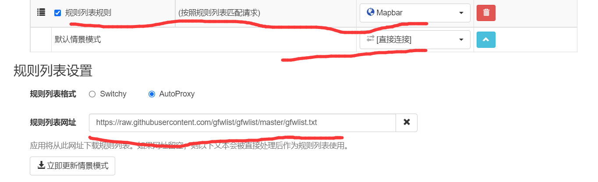
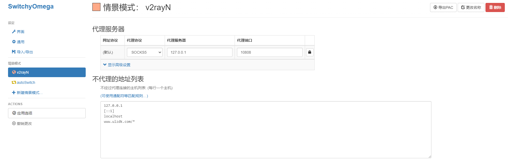
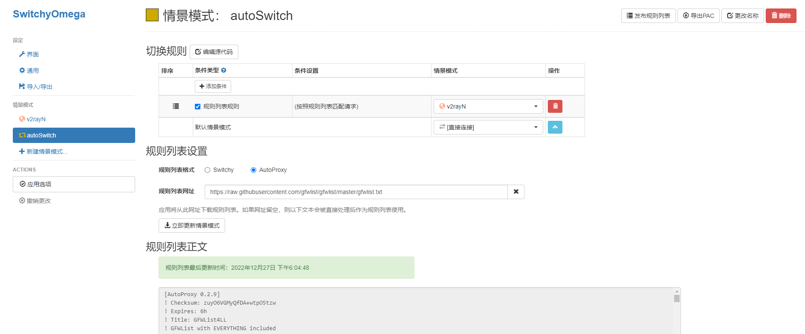

1. Chrome 商店搜索SwtichyOmega，选择Proxy SwtichyOmega下载并安装扩展。

2. 进入SwithyOmega进行设置:

   对proxy的代理协议，代理服务器，代理端口进行设置。一般对于Shawdowsocks用户，设置为：代理协议SOCKS5，代理服务器localhost，代理端口1080；

   对auto switch进行设置，点击添加规则列表，规则列表设置改为AutoProxy，情景模式选择proxy，规则列表网址设置为

```
https://raw.githubusercontent.com/gfwlist/gfwlist/master/gfwlist.txt
```

1. 点击左侧应用选项进行保存。

2. 在浏览器插件位置把Proxy SwitchyOmega设置成anto switch。

3. 访问[Google](https://www.google.com/)试验一下~

   









references:

[V2ray解决浏览器安装Chrome扩展插件问题.md](./V2ray解决浏览器安装Chrome扩展插件问题.md)

[一款神器的代理设置工具SwitchyOmega.md](./一款神器的代理设置工具SwitchyOmega.md)

https://baiyunju.cc/tag/v2ray