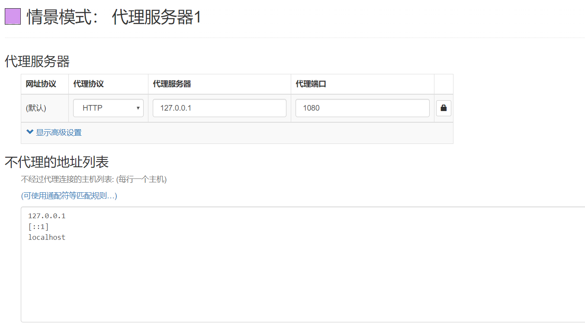
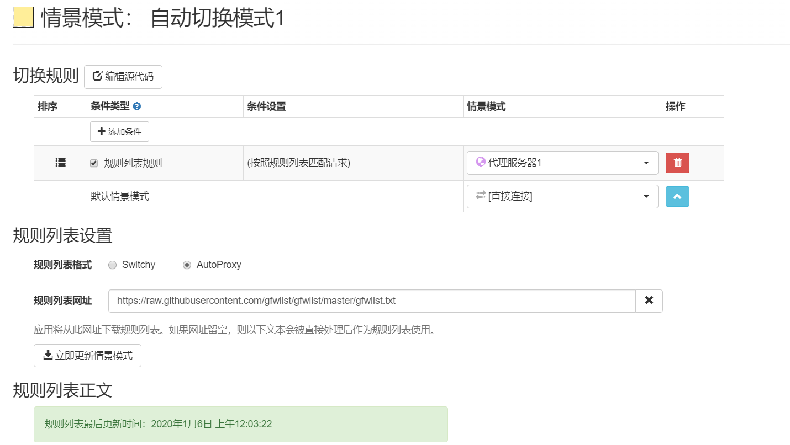

# 一款神器的代理设置工具SwitchyOmega

**经常使用代理的大佬们肯定知道这款插件，如果你有访问国外网站的需求可以了解下SwitchyOmega这款插件，用了之后你会无法自拔！** 

SwitchyOmega优势：

- 1、支持 chrome、chromium、firefox 浏览器，支持 http、https、socks4、socks5 四种代理
- 2、情景模式，可以使用 HTTP/Socks 代理访问网站；可以根据多种条件和规则自动切换；可以根据在线或本地的 PAC 脚本规则使用代理
- 3、过滤规则，可以在线导入 AutoProxy 和 Switchy 格式的规则，也可以自己添加域名通配符网址正则等切换规则
- 4、快速切换，可以在浏览器菜单中对情景模式进行快速切换，可以快速对当前网址添加过滤规则
- 5、备份恢复，导入或导出一份包括情景模式和其他所有选项的备份文件
- 6、多端同步，可以将设置和情景模式同步到所有使用 SwitchyOmega 扩展的 Chrome 或 Firefox 浏览器的桌面设备
- 7、代码开源，SwitchyOmega 为 SwitchySharp 的升级版，免费并且开源，[代码托管](https://cloud.tencent.com/product/coding-cr?from=10680)于 GitHub

**说明：SwitchyOmega 不提供代理**[**服务器**](https://cloud.tencent.com/product/cvm?from=10680)**、**[**VPN**](https://cloud.tencent.com/product/vpn?from=10680)**等网络服务。**

## 下载并安装插件

1、在线安装：直接在chrome或firefox应用商店搜索：`SwitchyOmega`

2、离线安装：前往 [官方镜像站](https://proxy-switchyomega.com/download/) 或者 [Github](https://github.com/FelisCatus/SwitchyOmega/releases) 地址下载

## 开始使用

1、若你使用了一些科学上网工具，记住本地端口，直接使用浏览器设置最简单的方式即可。 打开插件，点击左侧新建情景模式，设置情景模式名称，再选择-`代理服务器`，代理你本地的科学上网工具，比如1080，设置完一定要点击`应用选项`生效

2、若你想国外网站走代理，国内网站就不走代理，那么就新建的时候就选择`自动切换模式`，然后再列表中添加GFW列表。 GFW规则列表：`https://raw.githubusercontent.com/gfwlist/gfwlist/master/gfwlist.txt`

3、若你还要高级一些设置可以自行研究虚情景模式，对于新手前2种方式已经能够满足条件！

references:

[一款神器的代理设置工具SwitchyOmega](https://cloud.tencent.com/developer/article/2179561?from=15425)