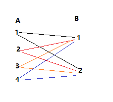

# 安装sqlite

```bash
sudo apt-get install tcl tcl-dev

mkdir _build
cd _build
../configure --prefix=${PWD}/../_install/

make 			#  Builds the "sqlite3" command-line tool
make sqlite3.c	#  Build the "amalgamation" source file
make devtest    #  Run some tests (requires Tcl)
make install
```


# 配置

注意：确保 sqlite> 提示符与点命令之间没有空格，否则将无法正常工作。

- .show：查看 SQLite 命令提示符的默认设置
- .headers ON | OFF：开启/关闭头部显示
- .mode <MODE>：设置输出模式
  - column：左对齐的列
  - line：每行一个值
  - list：由 “.”分隔的值
- .log
- .timer ON|OFF：开启或关闭CPU定时器
- 

格式化输出

```sqlite
sqlite>.header on
sqlite>.mode column
sqlite>.timer on
```

输出：

```sqlite
ID          NAME        AGE         ADDRESS     SALARY
----------  ----------  ----------  ----------  ----------
1           Paul        32          California  20000.0
2           Allen       25          Texas       15000.0
3           Teddy       23          Norway      20000.0
4           Mark        25          Rich-Mond   65000.0
5           David       27          Texas       85000.0
6           Kim         22          South-Hall  45000.0
7           James       24          Houston     10000.0
CPU Time: user 0.000000 sys 0.000000
```


[sqlite配置](https://www.runoob.com/sqlite/sqlite-commands.html)


# 数据类型

## 基本类型

NULL：空值

SQLite 的 **NULL** 是用来表示一个缺失值的项。表中的一个 NULL 值是在字段中显示为空白的一个值。

带有 NULL 值的字段是一个不带有值的字段。**NULL 值与零值或包含空格的字段是不同的**，理解这点是非常重要的。

```sqlite
SELECT * FROM COMPANY WHERE SALARY IS NOT NULL;
```

INT：4字节有符号整型 

INTEGER：有符号整型，根据值的大小存储在**1~8**字节中。

REAL：8字节的浮点值

TEXT：文本字符串 ，UTF-8

BLOB：一个blob数据，完全根据输入存储。

NONE： 不做任何的转换，直接以该数据所属的数据类型进行存储。

## 亲和类型

### INTEGER

### REAL

### TEXT

### BLOB

### NUMERIC

# 数据库

## 查看当前使用的数据库

```sqlite
.databases
```

## 创建数据库

方法1：

```bash
sqlite3 test.db
```

方法2：

```sqlite
sqlite>.open test.db -- 打开数据库，没有则创建
```

## 删除数据库


## 导出数据库

```bash
sqlite3 test.db .dump > testdb.sql
```

## 导入数据库

```bash
sqlite3 testdb.db < testdb.sql
```

## 切换数据库

```sqlite
>sqlite .open otherr.db  --直接使用.open切换
```


# 数据库对象

CREATE 数据库对象：创建一个数据库对象

DROP 数据库对象：删除一个数据库对象

ALTER 数据库对象：修改一个数据库对象

## 表

### 查看创建表的命令 .schema

```sqlite
.schema table
or 
select sql from sqlite_master where type='table' and tbl_name='COMPANY';
```

### 查看都有哪些表 .tables

```sqlite
.tables
or
select tbl_name from sqlite_master where type='table';
```

### 创建一个表 CREATE TABLE

```sqlite
sqlite> CREATE TABLE COMPANY(
   ID INT PRIMARY KEY     NOT NULL,
   NAME           TEXT    NOT NULL,
   AGE            INT     NOT NULL,
   ADDRESS        CHAR(50),
   SALARY         REAL
);
```

### 删除一个表 DROP TABLE

```sqlite
DROP TABLE COMPANY
```

### 重命名表 ALTER TABLE ... RENAME TO

```sqlite
alter table company_log rename to new_company_log; -- 重名名表名
```


### 修改表结构 ALTER TABLE ... ADD

```sqlite
alter table new_company_log add column sex char(1); -- 修改表结构，新增一列
```


### 新增数据 INSERT INTO

```sqlite
insert into table_name (column1, column2, ... columnN) (value1, value2, ... valueN) --语法1
insert into table_name values(v1, v2, ... vN) --语法2
```

### 删除数据 DELETE FROM

删除一行。

```sqlite
delete from company where id = '1';
```

删除表中的所有数据，但这张表还是存在的。

```sqlite
delete from company
```


### 修改数据 UPDATE ... SET

```sqlite
update company set address='Texas' where id = 6;
```


### 查找数据 SELECT ... FROM

格式化输出：（所有的 .命令只在sqlite的命令提示符中可用。）

```sqlite
sqlite> .header on
sqlite> .mode column 
sqlite> .width 10,20,30 --显示列宽度, 第一列宽度为10，第二列宽度为20，第三列宽度为30
```

全表查询：查询company表中所有记录中的全部字段。

```sqlite
select * from company;
```

部分查询：查询company表中所有记录中的部分字段。

```sqlite
select id, name, salary from company; 
```

条件查询：

```sqlite
select * from company where salary > 50000; --查询salary>50000的所有记录
```

子查询：

```sqlite
select * from company where salary > (select AVG(salary) from company); --查找大于平均工资的记录
select ROUND(AVG(salary)) as avg_slary from company; -- ROUND函数的作用是四舍五入
```


### where子句

##### 比较运算符

- 相等：== or =
- 不相等：!= or <>
- 大于：>
- 小于：<
- 大于等于：>=
- 小于等于：<=
- 不大于：!>
- 不小于：!<

##### 逻辑运算符

###### AND 和 OR

```sqlite
select * from company where age>=25 and salary >= 65000; --查找年龄>=25 并且 工资>=65000的所有记录的所有字段。
```

```sqlite
select * from company where age>=25 or salary >= 65000; --查找年龄>=25 或者 工资>=65000的所有记录的所有字段。
```

###### IS 和 IS NOT

```sqlite
select * from company where salary is 65000;  --查找工资等于65000的记录
select * from company where salary is not 65000; --查找工资等于65000的记录

select * from company where age is NULL; --查找年龄为NULL的记录
select * from company where age is not NULL; --查找age不为NULL的记录
```

###### IN 和 NOT IN

```sqlite
select * from company where age in (25,27); --查找年龄是25或者是27的记录
select * from company where age not in (25,27); --查找年龄不是25也不是27的记录
```

###### LIKE 和 GLOB

模糊匹配

有两个通配符和like一起使用：

- 百分号（%）：*百分号（%）代表零个、一个或多个数字或字符*。
- 下划线（ _ ）：下划线（_）代表一个单一的数字或字符。

```sqlite
select * from company where name like "Ki%"; --查找名字中以Ki开始的记录
```

有两个通配符和glob一起使用：

- 星号（ * ）：星号（*）代表零个、一个或多个数字或字符。
- 问号（?）：问号（?）代表一个单一的数字或字符。

这些符号可以被组合使用。

glob与like不同的是，glob是大小写敏感的。

```sqlite
select * from company where name glob "Ki*"; --查找名字中以Ki开始的记录
```


###### BETWEEN

```sqlite
select * from company where age between 25 and 27;    --查找年龄在25到27之间的所有记录
```

###### EXISTS

exists用来判断一个查询是否有结果，返回值只有1和0两种。

```sqlite
select * from company where exists (
    select age from company where salary > 90000); -- 子查询语句结果为真，外查询返回全部结果
select * from company where not exists (
    select age from company where salary > 90000); -- 子查询语句结果为真，not exists(子查询)为假，则外查询不会返回结果
select * from company where age > (select age from company where salary > 65000) --子查询结果为salary>65000的年龄的记录，外查询返回所有年龄大于子查询字段值的记录。

select exists(select *from company where age=40); --age=40的记录不存在，输出0
select exists(select *from company where age=25); --age=25的记录不存在，输出1
```

###### UNIQUE


##### 位运算符

https://www.runoob.com/sqlite/sqlite-operators.html

### limit 和 offset子句

limit作用：限制返回记录的条数。例如：只返回前三条。

offset作用：从第一条记录开始作偏移，然后输出记录。例如：只返回中间3~5条的记录。

```sqlite
select * from company limit 4;    --从第一条记录开始只输出4条记录
select * from company limit 3 offset 2; --从第3条记录(偏移2条)开始输出3条记录
select * from company limit 2, 3; --从第3条记录(偏移2条)开始输出3条记录； 第一个数字是偏移量(offset)，第二个数字是限制输出条数。
```

### order by子句 排序

基于某一个字段或多个字段进行升序或者降序。

- ASC：升序(默认值)
- DESC：降序

```sqlite
select * from company order by salary;    --基于salary字段的值进行升序排序
select * from company order by salary DESC; --基于salary字段的值进行降序排序
select * from company order by age;    --基于age字段的值进行升序排序
select * from company order by age, salary desc; --基于age字段的值进行升序排序, 然后基于salary进行降序排序
```

### group by子句 分组

基于某一个字段对**相同的数据**进行分组。

在select语句中，group by子句应该放在**where子句之后**，**order by子句之前**。

```sqlite
select * from company group by name;    --根据名字进行分组
select NAME, SUM(SALARY) from company group by address; --根据地址进行分组, 然后对同组的salary进行求和
select NAME, SUM(SALARY) from company group by address order by SUM(salary); --根据地址进行分组, 然后对同组的salary进行求和， 然后按照SUM(salary)排序
select NAME, SUM(SALARY) AS sum_salary from company group by address order by sum_salary DESC, name; --根据地址进行分组, 然后对同组的salary进行求和， 然后按照SUM(salary)降序,name升序排序。
```

### having子句 筛选

为分组结果(group by)指定过滤条件。

在select语句中，having子句必须放在group by子句之后，order by子句之前。

```sqlite
SELECT column1, column2
FROM table1, table2
WHERE [ conditions ]
GROUP BY column1, column2
HAVING [ conditions ]
ORDER BY column1, column2
```

```sqlite
select * from company group by name having count(name) < 2; --先根据name进行分组，计算每组的数量，然后输出数量小于2的记录。
select * from company group by address having count(address) >= 2;--先根据address进行分组，计算每组的数量，然后输出数量大于2的记录。
```


### 关键字

#### DISTINCT 去重

去除重复的记录：

```sqlite
select distinct address from company;
select distinct salary from company;
```

#### UNION 并集

将两个select语句的查询结果合并到一个结果集中。和OR有些类似，只不过OR是来合并两个查询条件的，UNION是来合并两个查询结果的。

union：不包含重复的记录。

union all：包含重复的记录。

```sqlite
select * from company where age>=25 
union
select * from company where salary>30000; -- 将年龄>=25的结果 或者salary>30000的结果合并到一个结果集中。

-- 等同于：
select * from company where age>=25 or salary>30000;
```

#### INTERSECT 交集

对两个select语句的结果求交集

```sqlite
select * from company where age>=25 
intersect
select * from company where salary>30000;--查找年龄>=25 并且salary>30000的结果

--等同于：
select *from company where age>=25 and salary>30000;
```

#### EXPECT 差集

差集是一种集合运算，用于求两个集合的差。给定两个集合A和B，差集运算A-B返回所有**属于A但不属于B**的元素构成的集合；差集运算B-A返回所有**属于B但不属于A**的元素构成的集合。

以下是一个差集的例子：

假设有两个集合A和B：A = {1, 2, 3, 4, 5}。B = {4, 5, 6, 7, 8}

则A-B的结果将是：A-B = {1, 2, 3}。因为这些元素仅属于A，而不属于B。

B-A的结果将是：B-A=(6,7,8)。因为这些元素仅属于B，而不属于A。

```sqlite
select * from company where age>=25 
except
select * from company where salary>30000; --查找属于age>=25结果集，但不属于salary>30000结果集的记录。

select * from company where salary>30000
except
select * from company where age>=25; --查找属于salary>30000结果集，但不属于age>=25结果集的记录。
```

### 约束

#### 非空约束 NOT NULL

确保某列不能有NULL值。默认情况下是可以为NULL值的。

```sqlite
CREATE TABLE COMPANY(
   ID INT PRIMARY KEY     NOT NULL,
   NAME           TEXT    NOT NULL,
   AGE            INT     NOT NULL,
   ADDRESS        CHAR(50),
   SALARY         REAL
);-- ID NAME AGE 三个字段不接受默认值
```

#### 默认值约束 DEFAULT

当INSERT INTO 语句没提供默认值时，提供一个默认值。

```sqlite
CREATE TABLE COMPANY(
   ID INT PRIMARY KEY     NOT NULL,
   NAME           TEXT    NOT NULL,
   AGE            INT     NOT NULL,
   ADDRESS        CHAR(50),
   SALARY         REAL    DEFAULT 50000.00
);
-- 为salary字段提供一个默认值
```


#### 唯一约束 UNIQUE

确保某一列中不能有相同的值。一个表中可以有多个UNIQUE列。

```sqlite
CREATE TABLE COMPANY(
   ID INT PRIMARY KEY     NOT NULL,
   NAME           TEXT    NOT NULL,
   AGE            INT     NOT NULL UNIQUE,
   ADDRESS        CHAR(50),
   SALARY         REAL    DEFAULT 50000.00
);
-- 保证不能有相同年龄的记录
```

#### 主键约束 PRIMARY KEY

主键必须包含唯一值， 主键列不能有NULL值。一个表中只能有一个主键，它可以由一个或多个字段组成。当多个字段作为主键，它们被称为**复合键**。

```sqlite
CREATE TABLE COMPANY(
   ID INT PRIMARY KEY     NOT NULL,
   NAME           TEXT    NOT NULL,
   AGE            INT     NOT NULL,
   ADDRESS        CHAR(50),
   SALARY         REAL
);
-- ID字段设置为非空约束
```

#### 自增约束 AUTOCREMENT

**自动递增列的目的是为了确保每行都有一个唯一的序号，而不是根据删除的行来递减。**也就是说自增列可能出现序号不连续的情况。

- 主键约束不一定是自增的（没指定AUTOINCREMENT），但自增的一定是主键约束。
- 自增列必须是 **INTEGER** 类型或其兼容类型（**NUMERIC** 或 **REAL**）。
- 只能将主键列（PRIMARY KEY）指定为自增列。
- 不能将包含NULL值的列指定为自增列。
- 如果删除了表中的所有记录，则下一次插入新记录时，自增列的值将从**最小可能的整数**开始递增。

```sqlite
-- autoincrement 自增约束
drop table company;
CREATE TABLE COMPANY(
   ID INTEGER PRIMARY KEY     AUTOINCREMENT NOT NULL,
   NAME           TEXT    NOT NULL,
   AGE            INT     NOT NULL,
   ADDRESS        CHAR(50),
   SALARY         REAL
);
select * from sqlite_master where type='table';
select * from sqlite_sequence;

INSERT INto COMPANY (ID,NAME,AGE,ADDRESS,SALARY) values (1, 'Paul', 32, 'California', 20000.00);
insert into company values(2, 'Allen', 25, 'Texas', 15000.00 );
insert into company (NAME,AGE,ADDRESS,SALARY) values('Teddy', 23, 'Norway', 20000.00 );

select * from sqlite_master where type='table';
select * from sqlite_sequence;
delete from company; --删除了company表中的所有数据，但是sqlite_sequence表中的自增序号还没清零。

-- 可以通过删除sqlite_sequence表中的seq字段将计数清零。
delete from sqlite_sequence where name='company';    --不管用？？ 内部表不能修改
-- 或者使用update命令将seq字段置0
update sqlite_sequence set seq=0 where name='company';    -- 不管用？？ 内部表不能修改

DElete from sqlite_sequence;    --删了,让数据库重新创建
```


#### 检查约束 CHECK

确保某一列中的值满足某一条件，如果不能满足该条件，则不能插入该条数据。

```sqlite
CREATE TABLE COMPANY3(
   ID INT PRIMARY KEY     NOT NULL,
   NAME           TEXT    NOT NULL,
   AGE            INT     NOT NULL,
   ADDRESS        CHAR(50),
   SALARY         REAL    CHECK(SALARY > 0)
);
-- salary字段的值不能为0。
```

#### 删除约束

约束不能删除。


### 表关联

表关联用来查询多个表中的数据，关联的表必须有相同的字段。

#### 内连接

只返回两个表中都有的数据

#### 外连接

##### 左外连接

返回左表中所有数据 和 右表中匹配的数据，右表中没有的数据填NULL。

```sqlite
--左外连接 返回左表中全部的数据和右表中匹配的数据， 右表中没有匹配的数据填NULL
select id, name, age, salary, dept from company left outer join department on company.ID == department.EMP_ID;
select * from company left outer join department on company.ID == department.EMP_ID;
```

##### 右外连接

返回右表中所有数据 和 左表中匹配的数据，左表中没有的数据填NULL。

```sqlite
--右外连接 返回右表中全部的数据和左表中匹配的数据， 左表中没有匹配的数据填NULL
select id, name, age, salary, dept from company right outer join department on company.ID == department.EMP_ID;
select * from company right outer join department on company.ID == department.EMP_ID;
```

右外连接还可以使用where子句来表示。

```sql
select * from company,department where company.ID == department.EMP_ID;
```


#### 交叉连接

把第一个表的每一行和第二个表的每一行进行匹配。

```sqlite
-- 交叉连接
SELECT EMP_ID, NAME, DEPT FROM COMPANY CROSS JOIN DEPARTMENT; --把第一个表的每一行和第二个表的每一行进行匹配。
```



## 索引

索引的主要作用是提高查询效率。

### 创建索引 CREATE INDEX ... on

#### 普通索引

```sqlite
create index salary_index on company (salary); --在salary这一列上创建索引
```

#### 唯一索引

唯一索引不允许任何重复的值插入到表中。

```sqlite
create unique index unique_name_index on company (name); --在name这一列上创建唯一索引，列中有相同的值不能创建唯一索引
```


### 查看索引

```sqlite
sqlite> .indices 或 .indexes
or
select * from sqlite_master where type='index'
```


### 删除索引 DROP INDEX index_name

```sqlite
drop index salary_index; --删除索引。
```

### INDEXED BY子句

指定使用哪个索引来进行查询

```sqlite
select * from company indexed by salary_index where salary > 50000; --指定使用salary_index索引来进行查询。
```


### 主键索引和唯一索引的区别

主键索引是一种特殊的唯一索引。**==如果指定了主键，数据库会默认创建一个主键索引。== **

1. 主键索引要求主键中的每一个值都是唯一的，唯一索引要求列中的值是唯一的。
2. 主键不能是NULL，所以主键索引的列中不能有NULL值；唯一索引允许有一个NULL值。
3. 一个表只能有一个主键索引；可以有多个唯一索引。

### 唯一索引与唯一约束

**添加了unique约束，数据库会自动创建unique索引**。

1. 唯一索引指的是不能有**索引值**(0,1,2,3,...)相同的行。
2. 唯一约束指的是**某一列**不能有相同的值。可以有一行为NULL值。

### 什么情况下要避免使用索引？

1. 在频繁插入、更新、或删除数据的表上。
2. 有大量NULL值的列。

## 视图

视图是一个虚拟的表，里面并没有数据，保存的只是一个 sql  语句。

视图是只读的，所以无法在视图上执行DELETE、insert、update操作。但是可以在视图上创建一个触发器。

### 创建视图 CREATE VIEW

语法

```sqlite
CREATE [TEMP | TEMPORARY] VIEW view_name AS
SELECT column1, column2.....
FROM table_name
WHERE [condition];
```

```sqlite
create view company_view as select id, name, age from company; --创建一个视图。
select * from company_view; --查看一个视图。
update company set age=44 where id=7; -- 原表数据变化，视图也会跟着变化，因为视图保存的只是一条sql语句。
```


### 查询视图

查询视图和查询表的方式类似：

```sqlite
select * from company_view; --查看一个视图。
```


### 修改视图 ALTER VIEW

sqlite不支持修改视图？

### 删除视图 DROP VIEW

```sqlite
drop view company_view; --删除视图
```


## 触发器

当一个表发生insert、update、delete操作时，触发另一个操作。

### 创建触发器 CREATE TRIGGER

基本语法：

```sqlite
CREATE TRIGGER trigger_name [BEFORE|AFTER] event_name 
ON table_name
BEGIN
 -- 触发器逻辑....
END; 
-- event_name可以是 insert、delete、update操作。
```

```sqlite
--创建一个触发器，当company表执行插入操作时，触发表company_log的插入操作
create trigger company_log after insert on company
begin
    insert into company_log VALUES (new.ID, datetime('now'));
end;
```


在表的一个列或多个列上创建触发器的语法：

```sqlite
CREATE TRIGGER trigger_name [BEFORE|AFTER] event_name OF column_name 
ON table_name
BEGIN
 -- 触发器逻辑....
END;
```

```sqlite

```


### 查看触发器

- 查看所有触发器

```sqlite
select * from sqlite_master where type='trigger';    --查看所有触发器
```

- 查看某个表上的触发器

```sqlite
select * from sqlite_master where type='trigger' and tbl_name='company'; --查看某个表上的触发器
```

### 删除触发器

```sqlite
drop trigger trigger_name;
```


## 事务

### 事务的属性

- 原子性(Atomicity)：确保工作单位内的所有操作都成功完成，否则，事务会在出现故障时终止，之前的操作也会回滚到以前的状态。
- 一致性(Consistency)：确保数据库在成功提交的事务上正确地改变状态。
- 隔离性(Isolation)：使事务操作相互独立和透明。
- 持久性(Durability)：确保已提交事务的结果或效果在系统发生故障的情况下仍然存在。

### 事务控制

- begin 或 begin transaction：开始事务处理。
- commit 或 end transaction：保存更改。
- rollback：回滚所做的更改。

事务控制命令只与 DML 命令 INSERT、UPDATE 和 DELETE 一起使用。**他们不能在创建表或删除表时使用，因为这些操作在数据库中是自动提交的**。

```sqlite
begin;
delete from company where id=7;
rollback;

begin;
delete from company where id=7;
commit;
```


## PRAGMA

https://www.runoob.com/sqlite/sqlite-pragma.html


# 导出数据库文档

https://gitee.com/dotnetchina/SmartSQL

# reference

[sqlite官网 英文](https://www.sqlite.org/index.html)

[sqlite中文](http://www.sqlite.net.cn/)

[sqlite 在线IDE](https://sqliteonline.com/)

[SQlite源码分析](https://huili.github.io/index.html)