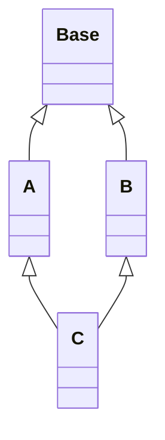
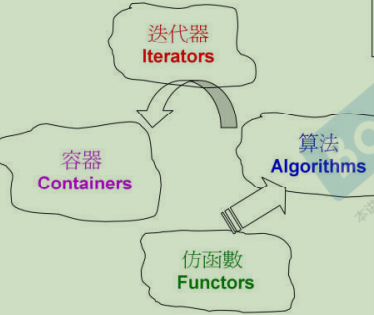
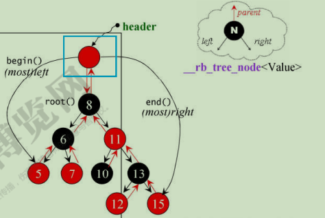
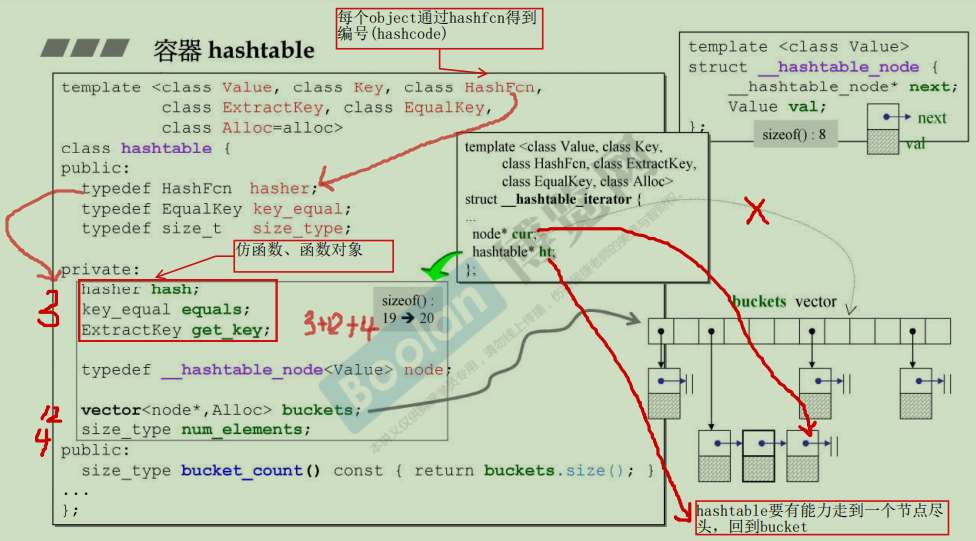

[Workspace](d:/Workspace)

[Algorithm.md](./Algorithm.md)	[C.md](./C.md)	[C++.md](./C++.md)	[C++11.md](./C++11.md)	[STL](./STL.md)	[Design Patterns.md](./Design Patterns.md) 

[Linux System Programming.md](./Linux System Programming.md)	[Linux Network Programming.md](Linux Network Programming.md) 

[SWTX.md](SWTX.md)

https://draw.io

# 目录 <a id="目录"></a>

[TOC]


# C [](#目录)

## 补码运算

整数的原码、反码、补码都是其二进制的本身。 0的补码是0。

### 负数求补码

1.第一种方法：原码求反码，反码加1

```bash
# -5的原码：5的原码+最高位置1：			1000 0101
# -5的反码：原码的最高位不变+其余位置1：	 1111 1010
# -5的补码：反码+1：				   1111	1011			
```

2.负数的绝对值的原码，取反，加1

```bash
# 5的原码：	0000 0101
# 取反：	 1111 1010
# 加1：	  1111 1011
```

3.模 -（负数）

```bash
# 8为二进制的模是256(2^8)， 256-5 = 251 -->1111 1011
```


### 负数的补码求原码

补码求原：==取反加1 + 最高位置1==  （补码的补码就是原码  负负得正）

```bash
# -5补码：1111 1011 ->(取反) 0000 0100 ->(加1) 0000 0101 ->(因为是负数最高位补1) 1000 0101
```


## 编译过程 [](#目录)

预处理->编译->汇编->链接

```bash
g++ -E hello.cpp -o hello.i
g++ -S hello.cpp -o hello.s
g++ -c hello.cpp -o hello.o
g++ hello.o -o hello
```

编译静态库，

```bash
gcc -c xx.c -o xx.o	#将.c文件编译成.o
ar rc libxx.a xx.o 	#将.o打包成.a
```

编译动态库：

```bash
gcc -c xx.c -o xx.o  # 将.c文件编译成.o
gcc -shared -fPIC -o libxx.so xx.o # 将.o打包成.so
```

[gcc_g++.md](../ElegantTest/linux/gcc_g++.md)

## 指针

悬挂指针：当指针所指向的对象被释放，但是该指针没有任何改变，以至于其仍然指向已经被回收的内存地址，这种情况下该指针被称为悬挂指针；

野指针：未初始化的指针被称为野指针。可能指向任意地址。

## stdarg.h

### 可变参函数

variable_parameter_function.c

### 可变参宏

```c++
// 宏定义的参数允许用"...", 表示是可变参数，在宏替换的时候用__VA_ARGS__表示"..."位置的所有参数
#define test1(...) printf(__VA_ARGS__)
#define test2(fmt, ...) printf(fmt, __VA_ARGS__)

// 很多编译器扩展了可变参数的宏替换，这样的写法更容易记忆，
// 宏定义的参数后面可以带三个小数点，表示这里是可变参数，
// 宏替换的时候，直接写这个参数就表示这个位置是所有的可变参数了。
// 注：某些编译器需要用 ##args 表示 args... 位置所有的参数的宏替换。
#define test3(fmt...) printf(fmt)
#define test4(fmt, args...) printf(fmt, args)
```

variable_parameter_macro.c

##__VA_ARGS__：宏前面加上##的作用在于，当可变参数的个数为 0 时，这里的##起到把前面多余的","去掉的作用,否则会编译出错,

C语言指针危险在哪？

​	指针可以自增，自减。++p, --p


## references:

[零基础入门C语言-王桂林.pdf](../wangguilin/-1- C 语言--从放弃到入门/零基础入门C语言-王桂林.pdf)

[-2- 你懂C语言，我不信--C提高篇](../wangguilin/-2- 你懂C语言，我不信--C提高篇)


# C++ [](#目录)

函数重载

​	函数同名不同参，不同参包括参数的类型，个数，顺序， ==const==

虚函数覆写

同名同参同返回。

## 关键字

### new/delete 和 malloc/free 区别：

1. new/delete是关键字，malloc/free是函数
2. new/delete会调用构造和析构函数。
3. 内存分配失败，new会抛异常bad_alloc

### 定位new

```c++
type* p = new (place_address) type
type* p = new (place_address) type (initializers)
type* p = new (place_address) type [size]
type* p = new (place_address) type [size] { braced initializer list }
```

-   `place_address` 是个指针

-   `initializers` 提供一个（可能为空的）以逗号分隔的初始值列表

```c++
char buf[1024]; 	// 也可以使用new[]/malloc在堆上分配buf，不过要记得delete[]/free。
int* p = new (buffer)int[10];//在buffer位置创建10个int元素的数组。
double* p1 = new (buffer)double[10];//覆盖了p的数组
int* p2 = new(buffer + 10*sizeof(double)) int[10];// 在p1后面又创建了10个int元素的数组。
```

​    

### static

1.修饰全局变量：作用域和生命周期都是全局的，不能跨文件使用。

1.修饰局部变量：作用域在函数内, 生命周期是全局的。

2.修饰普通函数：不能跨文件使用，只能在当前文件使用，限制了函数的作用域。

3.修饰类成员变量：类内定义，类外初始化，全部对象共享一个static成员变量。静态成员变量是命名空间属于类的全局变量，存储在data区的rw段。

4.修饰类成员函数：静态成员函数只能访问static成员变量(没有this指针)， 不能访问非static成员变量(没有this指针)。


### const

1.修饰变量：该变量不可改变。

2.修饰指针：`const int *p` : p所指向的值不可变；  `int* const p`:  p这个地址不可变。

3.修饰引用：常量引用，常用作函数形参，避免了拷贝且不能对其修改。

4.const修饰成员函数：只能用const对象访问, 不可在成员函数内改变成员变量。嵌套调用的函数也只能是const的。

5.const修饰类对象：const对象只能调用const成员函数，不能调用非const成员函数。

​									非const对象两者都能调用，如果有const构成函数重载，则优先调用非const成员函数。

6.const可以作为函数重载的条件。

### 宏定义#define与const的区别

| 宏定义 #define             | const 常量   |
| -------------------------- | ------------ |
| 宏定义，==相当于字符替换== | 常量声明     |
| 预处理器处理               | 编译器处理   |
| 存储在代码段               | 存储在数据段 |
| 可通过 `#undef` 取消       | 不可取消     |

### inline

优点：相当于把函数体直接写在调用内联函数的地方。省去了进入/退出函数体的操作（压栈、出栈）。

缺点：代码膨胀，而且加了inline只是对编译的建议，是否该函数是内联的由编译器决定。

### volatile

使用volatile声明的变量，每次访问都必须从内存取值(没有用volatile声明的变量由于编译器的优化，可能直接从寄存器取值)

const可以是volatile的(如只读的状态寄存器)

指针可以是volatile的。

[volatile.md](<../ElegantTest/test_cpp/keyword/volatile/volatile.md>)

### explicit

禁止“单参构造函数”(拷贝构造、转化构造) 的隐式转换。

### extern 

1.extern修饰的是变量的声明，说明此变量将在==文件以外==或者==文件后面部分==定义。变量的声明不分配内存，定义的时候才分配。

2.extern “C”{}

c++编译器默认是对函数进行命名倾轧(name mangling)的(就是编译完后函数名字都变了)，要想有的函数不进行倾轧使用extern “C” {}。

```c++
#ifdef __cplusplus
extern "C" {
#endif

void *func(void *, int, size_t);

#ifdef __cplusplus
}
#endif
```

### reference &

引用一经声明不可变更。初始化时为谁的引用就是谁的引用，不可中间在更改引用的对象。

### typeid

返回包含操作数数据类型信息的 type_info 对象的一个引用，信息中包括数据类型的名称，要使用 typeid，程序中需要包含头文件<typeinfo>。==type_info 的拷贝和赋值均是私有的，故不可拷贝和赋值。==

==如果想通过基类的指针获得派生类的数据类型，==基类必须带有虚函数

## 强制类型转换

reinterpret_cast:强制转换。

const_cast: 去除 const、volatile 等特性。

static_cast：基础数据的转换，不执行运行时类型检查。

dynamic_cast：下转。如果父类的指针确实指向子类则返回子类的指针，否则返回NULL；如果父类的引用确实指向子类则返回子类的引用否则抛出`std::bad_cast`异常。==使用dynamic_cast必须要有虚函数==。


## 内存

### 内存四区

堆区、栈区、数据区、代码段

### 内存对齐

设定结构体、联合以及类成员变量以 n 字节方式对齐。#pragma pack(n)。

内存对齐规则：

​	1.pack(n)中n的值和结构体中变量的最大值比较，两者取小为外对齐大小Y。

​	2.结构体中每个变量和Y比较，两者取小作为内对齐大小X。

​	3.假设内存地址从0开始，找地址能被X整除(地址/X=整数)的地方, 开始存放数据。

​	4.最后外对齐，用地址/Y=最小整数倍的地方。如果前面内存有没用到的进行补空操作。

references: wangguilin/零基础入门C语言-13.8.2内存对齐。

```c++
#pragma pack(push)  // 保存对齐状态
#pragma pack(4)     // 设定为 4 字节对齐

struct test
{
    char m1;
    double m4;
    int m3;
};
// sizeof(test) == 16
// 不设置4字节对齐 sizeof(test) == 24
#pragma pack(pop)   // 恢复对齐状态
```

 

### 内存泄漏

1.malloc/free, new/delete new[]/delete[]没有配对使用。

2.循环引用。

3.没使用虚析构。

4.僵尸进程。

5.抛异常，栈解旋


### 内存碎片

#### 内存池

提前申请一块大的内存，然后使用定位new去初始化。

#### 结构体末尾加空数组

结构体/类 末尾+空数组 常被用做动态缓冲区。注意：==空数组一定要放在末尾==			struct_plus_empty_arr.cpp

```c++
struct A {
	int a;
	char b[];
};
A* pa = (A*)malloc(sizeof(A) + len);
free pa;
```

为什么使用空数组而不使用指针？

​	如果使用指针不使用数组，则需要分别分配结构体的内存和指针的内存，释放也是要两次释放；如果使用数组可以一次性把内存全部分配出来，释放的时候一次性释放。减少了内存碎片。

​	而且空数组不占空间，指针占4字节。

```c++
//使用非类型模板参数，空数组不一定要放到末尾。
template<int N>
class A{
public:
    char buf[N];
    int a;
};
A<6> a;  or  A<6>* pa = new A<6>(); delete pa;
```


## 友元friend

1.能访问私有成员，破坏了封装性。

2.友元关系不能被继承

3.友元关系不可传递：B是A的友元，C是B的友元，C不是A的友元。

4.且是单向的：B是A的友元，A不是B的友元。

友元函数、友元类：

-   声明为谁的友元，==就可以通过谁的对象，==访问谁的私有成员。

-   友元的声明位置可以是类中的任意位置，不受public/private/protected的影响。

-   全局函数做友元，只需在类中做声明即可；成员函数做友元在做声明的同时还需加上类作用域,如：A::。

子类使用父类的友元函数：

​	由于友元函数不能继承，但是子类又想使用父类的友元函数，==可以通过强制类型转换，将子类的指针或引用强转为父类的指针或引用（赋值兼容），==然后再去调用父类中的友元函数。


## 面向对象

### 类
#### 初始化参数列表

1.类内成员变量的初始化顺序与初始化列表的顺序无关，与其自身定义的顺序有关。

2.效率更高，少了一次调用默认构造和赋值。

3.==引用类型成员==要用初始化列表，因为引用必须在定义时初始化。 

4.==const成员==必须要用初始化列表，因为const也是在定义时初始化，且const变量不可更改。	

#### 6大构造/赋值
默认构造、拷贝构造、拷贝赋值、移动构造、移动赋值、析构。

#### 移动构造/赋值

```c++
A(A&& another){
	this->p = another.p;
	another.p = NULL;	// 一定要置空，避免重析构
}
A& operator=(A&& another){
	if (this != &another) {// 避免自己给自己赋值，造成内存泄漏
		delete this->p;	
		this->p = another.p;	 
		another.p = NULL;		//一定要置空，避免重析构
	}
	return *this;
}
```

#### 转换构造/转换赋值

convert_constructor.cpp

```c++
A(const B& b){ m_a = b.m_b; }	// 转换构造
A& operator=(const B& b){ m_a = b.m_b; return *this; }	//转换赋值
B b(10); A a = b;	// 隐式调用转换构造
B b1(100); a = b1;	// 隐式调用转换赋值
const A& a1 = b1;	// 隐式调用转换构造
```

#### this指针

指向当前对象的指针。

this指针被隐式的声明为：`T* const this`,这就意味着this不可修改；

而const成员函数：`const T* const this `,表明this和this指向的成员变量都不可修改。

==用空指针调用空函数体的成员函数不会崩(因为this指针没调用任何成员变量)。==

#### 指向类成员变量/成员函数的指针

pointer_to_memfunc.cpp

```c++
int A::*pa = &A::m_a;
void (A::*paf)() = &A::dis;	
```

==指向类成员的指针，本质存放的不是地址，存放的是偏移量==

#### 指向类静态成员变量/函数的指针

指向静态成员的指针定义方法和普通指针相同，无需和类名关联，调用时也无需和类对象关联。

```c++
int *pb = &A::m_b;
void (*pbf)() = &A::dis_static; 
```

#### 空类

大小是1.

==为什么是1？==  因为类实例化的过程中会得到一个内存地址，为了区别同一个类类型的不同对象，编译器会隐式的增加一个字节。


#### 如何构造一个类，使其只能在栈上或堆上分配内存

1.只能在堆上分配内存：使析构函数private(==原因是编译器为类对象在栈上分配空间时，会检查析构函数是否可访问，若不能访问则不能创建对象。==),然后定义一个public的成员函数用于调用析构函数。不过缺点是这个类就无法继承，可以使用protected权限。

2.只能再栈上分配内存：重载new和delete,并使他们私有化。

### 封装
就是把属性和方法都写到类中，并且用public/protected/private赋予访问权限。

### 继承
#### 成员访问权限
子类public/protected/private继承父类中的私有成员都是不可访问的。
#### 赋值兼容：

1.子类对象可以赋值给父类对象。(A a = b;--> ==调用拷贝构造==。 A a; B b; a = b; --> ==调用拷贝赋值==。)

2.子类对象可以赋值给父类对象的引用。(以父类寻址: A* pa = pb;  以A寻址(*所以看不到子类成员*))

3.子类对象的地址可以赋值给父类对象的指针。(以父类寻址: A* pa = pb;  以A寻址(*所以看不到子类成员*))


#### 同名隐藏：
如果子类父类中有同名的==变量、函数名==(无关乎返值和参数)，则子类调用时默认使用的时子类的；要想使用父类的以==父类名+作用域运算符==的方式来调用。

只要子类中有同名的，则父类中所有同名的函数都被隐藏(不管是不是虚函数)。如果一定要用父类的可以使用：1.using 父类::函数名 2.父类名+作用域运算符。


#### 多重继承
构造顺序：先父类，再成员变量，最后子类。

#### 多继承


菱形继承

multiple_inherit_diamond.cpp

virtual_table_multi_inherit_diamond.cpp

父类构造顺序：从左到右


#### 虚拟继承



```c++
/* 构造、析构顺序：
Base(int a_ = 10)
A(int a_ = 10)
B(int a_ = 20)
C(int a_ = 30)
~C()
~B()
~A()
~Base()
*/
// 菱形问题 父类构造顺序：从左到右且虚基类只构造一次
// 实现了在多继承中只保留了一份数据成员。A,B共享虚基类中的数据，且虚基类中初始化只能由C初始化(A，B中构造Base是无效的)。
```

虚继承，使得不同路径继承来的同名成员在内存中只有一份拷贝。

multiple_inherit_virtual_base.cpp

virtual_table_multi_inherit_virtual_base.cpp

同名隐藏，赋值兼容同样适用

虚继承用于解决多继承条件下的菱形继承问题（浪费存储空间、存在二义性）。

Base和A，B，C可以有同名的变量和同名的普通成员函数。

虚拟继承，A,B不能同时覆写虚函数，只能覆写其中一个，否则会ambigous.

既然继承了虚基类就不要有同名的变量出现了，以免造成程序混乱。

### 多态

静态多态：函数重载，在编译器就能确定。

动态多态：由虚函数和继承实现，在运行期执行动态绑定。

动态多态的好处：

1.隐藏实现细节

2.接口重用，提高代码的扩展性。

动态绑定的原理？

​	当类中有虚函数时，编译器会创建一张虚函数表，表中存放着虚函数的指针，类对象中会增加一个指向虚函数表的指针；当子类对父类的虚函数覆写时，也会相应的把虚表中的函数指针给替换掉。当进行函数调用时就会形成动态绑定。

实现动态多态的三要素：

​	1.有父子类继承

​	2.子类覆写父类虚函数

​	3.父类指针或引用指向子类的对象。

虚函数表是针对类的还是针对对象的？

​	是针对类的，一个类只有一个虚函数表，类的所有对象共享同一个虚表，只是每个类存放vptr的地址不同。

虚函数

// c++ primer 15.3 虚函数与默认实参。 对于虚函数如果某次函数调用使用了默认实参，则该实参值由本次调用的静态类型决定。

// 也就是说，如果我们通过基类的==引用或指针==调用函数，则使用基类中定义的默认实参。如果是对象调用函数(不构成多态)，则使本类中的实参。

-   普通函数（非类成员函数）不能是虚函数

-   静态函数（static）不能是虚函数

-   构造函数不能是虚函数（因为在调用构造函数时，虚表指针并没有在对象的内存空间中，必须要构造函数调用完成后才会形成虚表指针）

    为什么类的静态成员函数不能为虚函数？

    ​	虚函数是能被覆盖的，静态成员函数在类中只有一份，本身就是相矛盾的，而且也编译不过。

    当基类中的构造或者析构函数中调用虚函数会发生什么呢？答案是调用的都是本类中的虚函数。

    一个对象构造的顺序是先基类再派生类，当在基类的构造函数中调用虚函数时虚函数表还没有创建好；

    析构顺序时先子类再父类，当在基类的析构函数中调用虚函数时，子类的析构已经调用过了，虚函数表已经不可靠了。

    ​	

虚析构

只要父类中定义了虚析构，即使子类中没覆写析构函数，虚函数表中也会覆盖掉父类的析构函数。

为什么析构函数要定义成虚函数？

​	如果不定义成虚函数，在对象销毁时只会调用基类的构造函数，造成只会释放对象中基类部分的数据，而子类的数据没有释放；定义成虚析构会先调用子类的析构再调用父类的析构。


为什么子类对象赋值给父类对象不能构成多态？

```c++
B b;
A a = b; // 调用拷贝构造
A a1;
a1 = b;	 // 调用拷贝赋值
// 由于赋值时只会处理成员变量，类对象的vptr(指向虚函数表的指针)不会改变，父类有自己的虚函数表，所以不会构成多态。
```

使用虚函数的缺点

​	会增加内存开销


## 模板

### 泛化

泛化其实就是**泛型化（通用化）**的意思，其实就是定义类模板/函数模板时候的代码格式。

```c++
template<typename T>
class Compare {
public:
	Compare(T x, T y){
		_x = x;
		_y = y;
	}
};
```


### 特化

特化其实就是对于特殊的类型（类型模板参数）进行**特殊的对待**，给它开小灶，给它只适合它自己用的专用代码。**特化**又分为**全特化**和**偏特化！**

1.写特化版本之前，必须要写出泛化版本。(==没有泛化版本写不出特化版本。==)

2.编译器会==优先==选择特化版本。优先级顺序：**全特化类>偏特化类>泛化模板类。**

3.当类模板/函数模板全特化之后，就是一个具体的类/函数了。

**模板特化解决的问题：当泛化的模板不能跑通所有类型的实例时，就需要实现特定类型的版本。**

#### 全特化

将类模板/函数模板的模板参数列表中的==所有模板参数用具体的类型替换。==注意：全特化时，模板参数列表为空，也就是这个标识：**template<>**。

##### 类模板全特化

**1.类模板全特化**：(模板参数全部用实际类型替换掉)

class_full_specilization.cpp

```c++
template<>	// 全特化的类
class Compare<const char*>{
public:
	Compare(const char* x, const char* y){}
    const char *max();
};
const char* Compare<const char *>::max() {}	//类外实现成员函数需要加Compare<const char *>::
```

**2.类模板成员函数全特化**：类模板不仅可以整体全特化，而且可以针对某个成员函数全特化。

class_memfunc_full_specialization.cpp

```c++
template <typename T>
class Compare {
public:
    T max(){ return _x > _y ? _x : _y; }
};

template<>	// 成员函数全特化 不特化类只特化某个成员函数
const char* Compare<const char *>::max(){
    if (strcmp(_x, _y) > 0) return _x; else return _y;
}
```


##### 函数模板全特化

function_full_specialization.cpp  全特化的函数和普通函数了还是有区别的。具体看[C++模板特化与偏特化](https://cloud.tencent.com/developer/article/1347877)

```c++
template<typename T> // 函数泛化 // Max不能和系统的max重名
T Max(T _x, T _y) { return _x > _y ? _x : _y; }

template<>	// 函数全特化
// const char* Max<const char*>(const char* _x, const char* _y)
const char* Max(const char* x, const char* y){ return (strcmp(x, y) > 0) ?  x : y; }
```

#### 偏特化

模板偏特化主要分为两种，一种是指对==部分模板参数==进行特化，另一种是对==模板参数特性==进行特化，包括将模板参数特化为**指针、引用或是另外一个模板类。**

##### 类模板偏特化

class_partial_specialization.cpp

```c++
// 类模板泛化
template <typename T, class U>
class Compare {}
// 对部分模板参数进行偏特化
template <class U>	
class Compare<int, U> {}	// 一定要加类名后面的<int, U>,否则redeclared.
// 将模板参数偏特化为指针
template <typename T, class U> 
class Compare<T*, U*> {}
// 将模板参数偏特化为另一个模板类
template <typename T, class U>
class Compare<std::vector<T>, std::vector<U>> {}
```

##### 函数模板偏特化

function_partial_specialization.cpp

```c++
template <typename T, class U>	// 函数模板泛化
void compare(T num1, U num2) {}
template <class U> // 对部分模板参数进行偏特化
void compare(int num1, U num2) {}
template <typename T, class U>	// 将模板参数偏特化为指针
void compare(T *num1, U *num2){}
template <typename T, class U>	// 将模板参数偏特化为另一个模板类
void compare(std::vector<T> &vecLeft, std::vector<U> &vecRight){}
```


### 嵌套从属类型需要加typename

template_nested_type.cpp

### 可变参数模板

当我们既不知道参数的数目又不知道参数的类型的时候，就可以使用可变参数模板。

默认参数都是传值的，如果参数是类，效率很低，所以改成传引用 `ARGS&... args` or `ARGS&&... args`

```c++
template<typename T, typename... U>	// U:参数类型包
void print(const T& firstArg, const U&&... args){} //args:参数包

sizeof...(U) //类型参数的个数
sizeof...(args) //函数参数的个数
func(std::forward<ARGS>(args)...) //既扩展了类型包U, 也扩展了参数包args, 形如:std::forward<Ti>(ti),Ti表示类型包中第i个参数的类型，ti表示参数包中第i个元素。
//参数包args中的每个元素依次调用std::forward(), 则展开后就是：func(std:forward<int>(a), std::forward<double>(b), std::forward<string>(c))。std::forward保证参数原类型不变。    
func_(args...) //这么调用表式传递的是参数包，则func_函数声明应为：
    template<typename T> func_(const T&... args) 或者 func_(const T&&... args)
```


C++Primer 第5版 16.4

variadic_template.cpp

https://www.modb.pro/db/463275

### 非类型模板参数

非类型模板参数是有限制的。他们只能是: 整数(包括枚举)，对象/函数/成员的指针，对象或函数的左值引用，nullptr。

==浮点数,类对象, 字符串常量是不允许作为非类型模板参数的==

```c++
template<typename T, int N> func(T (&arr)[N])
```

nonType_template_param.cpp


## references:

[C++基础与提高-王桂林-4rd.pdf](../wangguilin/-3- 这可能是你见过的最NB的C++课程/C++基础与提高-王桂林-4rd.pdf)

[C++基础与提高-王桂林-3rd.pdf](../wangguilin/-3- 这可能是你见过的最NB的C++课程/C++基础与提高-王桂林-3rd.pdf)

[1RecommendedBooks](../../1RecommendedBooks)

[EffectiveC++第3版中文版.pdf](../../1RecommendedBooks/Effective C++/EffectiveC++第3版中文版.pdf)

[C++ Primer（第5版）_带书签_高清完整版.pdf](../../1RecommendedBooks/C++Primer 第5版/C++ Primer（第5版）_带书签_高清完整版.pdf)

[Microsoft C/C++ 文档 | Microsoft Learn](https://learn.microsoft.com/zh-cn/cpp/?view=msvc-170)


# STL

算法与数据的分离：利用<u>**仿函数**</u>规则的<u>**算法**</u>(内部算法、全局算法)通过<u>**迭代器**</u>访问**<u>容器</u>**中的数据。



所有algorithms，其内最终涉及元素本身的操作，无非就是==比大小。==

stl容器存在的效率问题：

​	1.push要完成一次对象的拷贝

​	2.内存不足的时候，自动开辟新空间，对原来的数据做一次深拷贝。

解决：

emplace

移动构造，移动赋值

## 分配器

std::allocator

## 容器
### 序列式容器(Sequence Containers)

#### vector

 底层是数组，超过容量后会成倍增长，随机访问迭代器，在尾部插入/删除元素比较高效，中间插入比较低效(会有元素的搬移)

##### reserve：

不会调用构造函数, 不过超过容量后还是会发生拷贝, 且内存成倍增长。==reverse扩充的是总容量大小，不是追加空间，可以多次调用。==

##### resize：

变大会调用构造函数，size变大，==capacity变大==，超过容量后还是会发生拷贝, 且内存成倍增长。

减小会调用析构函数，size变小，==capacity不变==。

##### assign

```c++
v.assign(v1); // 将v1的内容赋值给v, size大小改为和v1一样。
			 // 如果原来v.capacity比v1小，则改为和v1.size一样；如果capaacity比v1大，则保持capacity不变。
```

由于已经知道要拷贝多少元素，所以就提前开辟这么多内存的空间，直接调用拷贝构造就行了；就不用再频繁的扩容了。

##### swap： 

==swap调用之后size为0，capacity为0。==(底层是不是只改变了指针指向？从指向这个对象转到指向另一个对象？)(是不是也可以作为清空容器的一种方式？)

##### insert:

在插入位置之前插入新元素，并返回第一个新元素的迭代器。可能造成迭代器失效。

造成迭代器失效有两种情况：

​	1.insert(itr++, 10)：插入元素后，元素后移，itr实际指向的元素已经不是所期望的内容了。

​	2.另一种情况就是当插入元素时导致容器扩容，扩容就会发生元素拷贝，则原来的迭代器就会全都失效了。

解决：用返回的迭代器进行下一轮循环。`itr = insert(itr, 10);`

##### emplace/emplace_back:  

```c++
emplace_back(5);  //直接调用构造, 省去了一次拷贝, 传入的参数必须和构造函数的类型相匹配。 
				//当容器超过容量capacity后，vector重新分配内存，还是会发生拷贝。
va.emplace_back(a4);   // 因为传入的是A类型的左值参数，所以会调用copy constructor。	
va.emplace_back(std::move(a4));   // 因为传入的是A类型的右值参数，所以会调用move constructor。
va.emplace_back(A(8));   // 因为传入的是A类型的右值参数，所以会调用move constructor
```

##### erase:

删除指定位置的元素，并返回**下一元素**的迭代器。

删除元素会使元素前移，造成迭代器失效，**使用erase返回的迭代器进行下一轮的循环。**

v.erase(iter++)，iter++操作会在删除前使iter指向下一个位置，删除完后面的数据会向前面移动一个位置，所以iter实际指向的已经不是所期望的内容了。

==还要考虑erase的是最后一个元素的情况。erase完最后一个元素返回的itr指向end()，再++就变成野指针了。==

```c++
// 方法一：判断返回值，如果是end,跳出
for (auto itr = v.begin(); itr != v.end(); ++itr) {
	if (itr->print() == 5) {
        itr = v.erase(itr);
        if(itr == v.end()) { break; }
     }
}
// 方法二：++itr写在循环体中
 auto itr = v.begin();
while(itr != v.end()) {
	if (itr->print() == 5) { tr = v.erase(itr); }
    else { ++itr; }
}
//综上，还是方法二比较保险。
```


##### erase+remove：

高效删除元素： 验证remove会不会调拷贝构造

##### clear:

清除vector中的所有元素，但是capacity不变。

##### shrink_to_fit: 

减小容器容量(capacity)为size大小。

##### clear+shrink_to_fit: 

彻底清空容器，先调clear清空元素，size为0；再调shrink_to_fit清除空间，capacity就变为0了。

#### deque

一个管理器和多个缓冲区，支持随机访问，首尾增删比较高效。随机访问迭代器。

#### list
底层是==双向链表==，双向迭代器，不支持随机访问，插入删除元素比较高效。

##### assign

l.assign(l1); // 将v1的内容赋值给v, size大小改为和v1一样。

##### resize

同vector,只不过list没有capacity。

##### insert

在任何地方插入不会造成迭代器失效。由于返回值是新插入元素的迭代器，如果接受返值，则会无限循环下去。

##### erase

删除会使迭代器失效，原因是删除后迭代器变成了野指针。 其他同vector。

解决方法：`erase(itr++);` `itr = erase(itr);`

在循环中， 还要考虑删除最后一个元素返回值是end, 再++变成野指针的问题：

```c++
// 方法一：判断返回值，如果是end,跳出
for (auto itr = v.begin(); itr != v.end(); ++itr) {
	if (itr->print() == 5) {
        itr = v.erase(itr);
        if(itr == v.end()) { break; }
     }
}
// 方法二：++itr写在循环体中
 auto itr = v.begin();
while(itr != v.end()) {
	if (itr->print() == 5) { tr = v.erase(itr); }
    else { ++itr; }
}
//综上，还是方法二比较保险。
```


##### swap

同vector,只不过list没有capacity。

##### clear

同vector,只不过list没有capacity。

##### sort

自带sort, 自定义类型重载operator<。

为什么list不能使用std::sort？std::sort随机访问迭代器才能使用。

##### remove

std:remove是覆盖值，list.remove是改变指针指向, 就直接删除了，不用erase+remove这个操作了。

##### reverse

翻转链表

##### unique

删除==连续相等==的元素中，除第一个以外的其他元素。所以经常的使用方式是：先排序，再去重。

##### splice

链表拼接，将一个链表拼接到另一个链表上。拼接完成后另一个链表被清空，如果是从中间截取的一段则保留剩余部分。

中间过程不涉及构造和析构的操作。

不管x是左值还是右值，或者value_type是否支持移动构造，它们都会被转移。（说白了，不就是指针的改变嘛）

##### merge

```c++
list.merge(list1, Comp()); //对于自定义类型需要定义排序准则(仿函数)。
```


### 容器适配器(Adapter)

注意：==适配器没有提供迭代器，也不能同时插入或删除多个元素。==

#### stack

容器适配器，底层结构可以选用vector,deque, list 

#### queue
容器适配器，底层结构可以选用deque, list. ==vector没有pop_back==

#### priority_queue: 

底层可以使vector, 算法为二叉堆。

首先按优先级的大小入队，如果优先级相等，则按其它的优先级进行入队。可以==支持多级优先级。==

```c++
class Cmp {
public:
	bool operator()(const Node &na, const Node &nb){
		if (na.priority != nb.priority)		return na.priority > nb.priority;
		else	return strcmp(na.szName, nb.szName) < 0;
	}
};
```


### 关联式容器(Associative Containers)<a id="AssociativeContainers"></a>



#### general

##### 底层数据结构

1.关联式容器底层数据结构使用的是==红黑树==(特殊的二叉搜索树)，因此具有根据key自动排序的功能。对于自定义类型需要==重载operator<().==

2.迭代器++遍历（中序遍历）得到有序的结果。

3.红黑树查找复杂度O(logn)。

##### insert_unique/insert_equal

`#include <bits/stl_tree.h>` 提供`insert_unique`、`insert_equal`两个函数。key不能重复的(map/set)调用insert_unique; 有重复key的(multimap/multiset)调用insert_equal。

##### lower_bound

lower_bound(x): 返回第一个大于等于x的位置。换句话说，lower_bound返回的是==不破坏排序得以安插x的第一个位置。==

##### upper_bound

upper_bound(x)：返回第一个大于x的位置。

##### equal_range

equal_range(x)：查找x的lower_bound到upper_bound的范围。 ==如果lower_bound和upper_bound相等说明容器中没有这个key。==

##### insert

```c++
for (set<A>::iterator itr = sa.begin(); itr != sa.end(); ++itr)
{ // pair<iterator,bool> insert(value_type& val); 如果插入成功，第一个值返回插入新元素的迭代器，第二个值返回true。							// 如果插入失败，第一个值返回已插入元素(val)的迭代器，第二个值返回false。
#if 0 							
	// auto r = sa.emplace(3);
    // auto r = sa.insert(3);
    auto r = sa.insert(4);  //推荐使用
    cout << r.first->geta() << ", " << r.second << endl; 
#endif

#if 0
        cout << "---------------------" << endl;
        int a = 3;
        auto it = sa.lower_bound(a);
        sa.insert(it, a);   // 无论插入成功与否，迭代器不会失效
        // itr = sa.insert(it, a);  // 不要接收返回值了，否则itr总是指向3，就不会无限循环了
#endif

#if 1 // 无论插入成功与否，迭代器不会失效，不过写itr++在循环中会跳着访问元素, 跳出end后产生未定义行为。
        sa.insert(itr++, 3); // 不推荐使用
#endif
```

总结：**insert不会使迭代器失效。**

1.   (不指定位置插入)要么使用`pair<iterator,bool> insert(const value_type& val);`这种方式插入。
2.   (指定位置插入)要么先用lower_bound找到适合的位置，再使用`iterator insert (const_iterator position, const value_type& val);`插入。

##### erase

```c++
// erase不会造成迭代器失效，以下两种写法均正确 
itr = v.erase(itr); //correct
 v.erase(itr++); // correct ++指向了下一节点
```

如果插入和删除操作导致了树不平衡，则会进行自平衡操作。

==在循环中， 还要考虑删除最后一个元素返回值是end, 再++变成野指针的问题：==

```c++
// 方法一：判断返回值，如果是end,跳出
for (auto itr = v.begin(); itr != v.end(); ++itr) {
	if (itr->print() == 5) {
        itr = v.erase(itr);
        if(itr == v.end()) { break; }
     }
}
// 方法二：++itr写在循环体中
 auto itr = v.begin();
while(itr != v.end()) {
	if (itr->print() == 5) { tr = v.erase(itr); }
    else { ++itr; }
}
//综上，还是方法二比较保险。
```


##### clear

`map.clear() == map.erase(map.beging(), mp.end());`

##### count

计算key的个数，对于map/set来说，要么是0要么是1。缺点是不能定位key的位置。

##### find

类自带的find,比std::find效率更高。==自带的find查找规则是`operator<`, std::find查找规则是`operator==`。==

如果没找到返回end。

#### set


set/multiset: key就是value, value就是key.

#### map

##### insert

```c++
//对于自定义类型，下面这三种插入操作最快：
 map<int, A> mai;
 auto itr = mai.emplace(1, 1);       // 只有一次自定义类型的构造
 mai.emplace_hint(itr.first, 2, 2);  // 只有一次自定义类型的构造
 mai.insert(make_pair(2, 2)); 		// 只有一次自定义类型的构造
```

##### operator[]

```c++
map<int, int> m; m[1] = 2;   ==   m.operator[1] = 2;
```

操作operator[key]: 如果红黑树中有key对应的value, 则返回value的引用；如果没有则调用value的默认构造函数并插入value, 所以对于==自定义类型使用operator[]要有默认的构造函数。==  对于insert,如果map中有key时则不能插入，而当使用**operator[]则可以更新key对应的value值。**

直接insert更快，因为operator[]底层还要做一下lower_bound。

##### at

at: 返回key所对应value值的引用，如果没找到则抛出`out_of_range`异常。

####  multimap

#### multiset
### 无序容器(Unordered Containers) <a id="unorderedContainers"></a>

[哈希表](#hashtable)



底层使用哈希表实现，时间复杂度为O(1), 对于==自定义类型需要定义hash函数和重载`operator==`==(比较key是否相同)。

如果两个元素的哈希值相同，并不能断定这两个元素就相同，必须再调用operator==才能判断是同一个值。

#### general

```c++
size: 
	// 容器中元素的个数
count:	// 需要调用operator==
    size_type count(const key_type& k) const;//返回key在容器中的数量。
	// 对于unordered_map/unordered_set来说非1即0。	**内部有调用operator==()的操作。**
clear:
	// 彻底清空
begin: 
	iterator begin() noexcept;			   // 返回容器中第一个元素的迭代器
	local_iterator begin ( size_type n );	// 返回桶号为n的第一个元素
end: 
	// 同begin.
find:	// 需要调用operator==
	iterator find ( const key_type& k );
	//查找规则与std::find不同，传入的值可以通过hash函数求得哈希值从而获得value位置，不存在返回end。
bucket:
	size_type bucket(const key_type& k) const;//返回k所在的桶号(数组下标)，取值范围为0 ~ bucket_count-1
bucket_size: 
	size_type bucket_size ( size_type n ) const;//返回桶号为n的位置元素的个数。
bucket_count: 
	size_type bucket_count() const noexcept; // 返回桶的数量
load_factor: // 装载因子(装满程度，装了百分之多少)
	float load_factor() const noexcept;	//装载因子 = 容器中元素的个数 / 桶的大小(数组的大小)。
	// load_factor= size() / bucket_count().
	// load_factor影响碰撞的概率(两个元素存储在同一个下标的位置)，当load_factor超过阈值(最大装填因子: max_load_factor)自动增大桶的大小，并进行**rehash**操作。
max_load_factor: 	// 阈值
	float max_load_factor() const noexcept;	 // get
	void max_load_factor ( float z );		 // set
	// 不过请注意，实现可能会对桶的数量施加一个上限(参见max_bucket_count)，这可能会迫使容器忽略max_load_factor。
reserve:	// 提前预留空间避免多次rehash
	void reserve ( size_type n );	// 改变桶数(bucket_count)
	// 如果n大于当前bucket_count乘以max_load_factor，容器的bucket_count会增加(增加到多少不确定，**新的桶数可以等于或大于n。[应该是最接近n的素数]**)，并**强制重新散列。**
	// 如果n小于该值，则函数可能不起作用。
rehash:		// 提前预留空间避免多次rehash
	void rehash( size_type n ); //设置桶数
	// 如果n大于容器中的当前桶数(bucket_count)，则强制重新散列。**新的桶数可以等于或大于n。**(素数)
	// 如果n小于容器中的当前桶数(bucket_count)，则该函数可能对桶数没有影响，也可能不会强制重新散列。
	// rehash可能导致迭代器失效。
	// 通过调用rehash来在哈希表中保留一定数量的桶，我们避免了容器扩展可能导致的多次rehash。
equal_range:
	pair<iterator,iterator> equal_range (const key_type& k);
	//返回容器中key等于k值的元素范围。左闭右开。 如果容器中没有对应的值，则pair中两个迭代器均返回end。
insert:	// 与map类似
	pair<iterator,bool> insert ( const value_type& val );
	// 第一个元素是一个迭代器，指向容器中**新插入的元素或键值相等**的元素； 
	// 第二个元素返回true或false,指示元素是否插入成功。
	iterator insert(const_iterator hint, const value_type& val);
	// value将被存储在容器中合适的位置，无论hint传入的是什么。 
	// 该函数返回一个迭代器，指向容器中**新插入的元素或键值相等**的元素。
erase:	// 需要operator==
	iterator erase (const_iterator position);
	//返回下一个元素的位置。注意删除最后一个元素这种情况，返回的迭代器指向end。
	size_type erase (const key_type& k);	 // 返回删除元素的数量
```


#### unordered_map

##### operator[]

```c++
hm[key] = value  ==  (hm.operator[key] = value)	//与map类似，如果没找到则插入一个默认值(需要默认构造)；找到返回value的引用。
```

##### at

```c++
mapped_type& at ( const key_type& k );//与map类似，如果找到则返回value的引用；没找到则抛出out_of_range异常
```


#### unordered_set
#### unordered_multimap
#### unordered_multiset

## 迭代器

适配器(stack,queue,priority_queue)没有迭代器。

随机访问迭代器

双向迭代器

前向迭代器

迭代器失效

## 算法

reference: STL-wangguilin 附录A

### 排序

#### std::sort

序列化容器：array,vector,deque不带成员函数sort。list,forward_list, map,unordered_map带sort.

 对于自定义类型，需要提供operator<()重载。std::sort随机访问迭代器才能使用。 ==重载的函数记得加上const, 否则const对象编不过。==

#### std::stable_sort

稳定排序。相同元素值排序后保持之前的顺序。

### 查找
#### std::find

序列化容器：array,vector,list,deque,forward_list 不带成员函数count。

返回在[first,end)范围内等于val的第一个元素的迭代器，没找到返回end。相当于：

```c++
template<class InputIterator, class T>
  InputIterator find (InputIterator first, InputIterator last, const T& val)
{
  while (first!=last) {
    if (*first==val) return first;
    ++first;
  }
  return last;
}
```

对于自定义类型，需要提供operator==()重载。

而且应该传一个对象` std::find(v.begin(), v.end(), A(5))`,这样临时对象只会构造一次，然后每次比较只会和这个临时对象比较。

如果传的是值`std::find(v.begin(), v.end(), 5)`, 这样每次比较时都会先创建一个临时对象，比较完再析构，效率较低。

#### std::find_if

返回在[first,end)范围内等于pred等于true的第一个元素的迭代器。相当于：

```c++
template<class InputIterator, class UnaryPredicate>
  InputIterator find_if (InputIterator first, InputIterator last, UnaryPredicate pred)
{
  while (first!=last) {
    if (pred(*first)) return first;
    ++first;
  }
  return last;
}
```

#### std::count

序列化容器：array,vector,list,deque,forward_list 不带成员函数count。

计算元素val的个数。对于自定义类型，需要提供operator==()重载。

count函数行为相当于：

```c++
template <class InputIterator, class T>
count (InputIterator first, InputIterator last, const T& val)
{
  int ret = 0;
  while (first!=last) {
    if (*first == val) ++ret;
    ++first;
  }
  return ret;
}
```

#### count_if

计算在[first, last)范围内pred为真的元素个数。

count_if行为相当于：

```c++
template <class InputIterator, class UnaryPredicate>
count_if (InputIterator first, InputIterator last, UnaryPredicate pred)
{
  int ret = 0;
  while (first!=last) {
    if (pred(*first)) ++ret;
    ++first;
  }
  return ret;
}
```


#### search/search_n


### 删除
#### std::remove/remove_if

对于自定义类型，需要提供operator==()重载。remove函数并不是真正的把元素删除，而是把要删除的元素覆盖掉，所以中间过程有一个后值覆盖前值的操作，标准库中使用std::move, 如果没移动构造则调拷贝构造，效率会变低。

remove也应该传个临时对象进去：`std::find(v.begin(), v.end(), A(5))`, 原因同上。

### 遍历
#### std::for_each

```c++
// [first, end)这个范围内的所有元素调用fn函数, fn可以是函数、仿函数、lambda表达式
template <class InputIterator, class Function>
Function for_each (InputIterator first, InputIterator last, Function fn);
//这个模板函数的行为相当于：
template <class InputIterator, class Function>
Function for_each (InputIterator first, InputIterator last, Function fn) {
    for(;first != last; ++first) {
        f(*first);
    }
    return fn;
}
```


## references:

[-4- 用好STL才是王道](../wangguilin/-4- 用好STL才是王道/)

[STL-王桂林-3nd.pdf](../wangguilin/-4- 用好STL才是王道/STL-王桂林-3nd.pdf)

[C++-STL使用例子大全.pdf](../wangguilin/-4- 用好STL才是王道/C++-STL使用例子大全.pdf)

[侯捷 - STL和泛型编程.pdf](../houjie/侯捷 - STL和泛型编程/侯捷 - STL和泛型编程.pdf)


# C++11
## &ensp;1. KeyWord

### &ensp;&ensp;1.1 auto

auto.cpp

使用场景：

1. 迭代器类型
2. lambda类型
3. std::bind返回值类型(functional)

### &ensp;&ensp;1.2 decltype

decltype.cpp

### &ensp;&ensp;1.3 nullptr

nullptr.cpp

解决NULL和0的二义性，NULL通常被定义为(void*)0

### &ensp;&ensp;1.4 final

两个用途: final.cpp

​	1.阻止从类继承。

​	2.组织虚函数的覆写。

### &ensp;&ensp;1.5 override

帮助检查是否正确覆写了父类的虚函数。若此种覆写关系不成立，则以报错的形式提示给coder。

### &ensp;&ensp;1.7 =default/=delete

在函数声明后面加上=delete就能禁用该函数。`A()=delete;`

### &ensp;&ensp;1.8 initializer_list

可以接受多个参数，但必须是同一类型

```c++
double sum(const initializer_list<double> &il);	// 可以接受多个同一类型的参数，函数内再用for(auto d: il);遍历
```

### &ensp;&ensp;1.9 lambda

```c++
[captures](params) specifiers exception -> ret { body }
```

1.捕获列表捕获的是自动存储变量(局部变量)

2.对于全局变量和静态局部变量，放在捕获列表中编译会报错；直接用就行了(作用域本来就是全局的), 也不必在参数列表传参。

3.捕获this指针，可以在lambda内部使用this类型的成员函数和变量。

### &ensp;&ensp;1.10 closure

lambda表达式和其外部的局部变量合起来叫做闭包。

==好处：1.可以读取外层函数内的局部变量；2.让这些变量的值始终保存在内存中。==

### &ensp;&ensp;1.11 assert/static_assert

assert(expression)	//运行期断言，不能在编译器发现错误。

static_assert(expression，提示字符串)	//编译期断言，也叫动态断言。如果expression为false,则打印提示字符串。


## &ensp;2. 左值右值

### &ensp;&ensp;2.1 判断左值右值

左值：可以取地址(&)的一定是左值。字符串字面量(“abcd”)是左值(存在静态数据区，是一块连续的内存，可以取地址)；++i

右值：不能取地址的是右值。字面量(10)一般是右值； 返回的局部对象；i++; 算数/逻辑/比较表达式。

```c++
int func(int val) // val是左值
int func(int&& val)	//val还是左值

A func() { A a; return a; }	//如果开启了RVO(return value optimization)优化，好像a就不会复制给临时对象了. g++ -fno-elide-constructors:关闭rvo优化
```

### &ensp;&ensp;2.2 左值引用

​	扩展了对象的作用域

#### &ensp;&ensp;&ensp;2.2.1非常量左值引用

绑定的必须是一个左值，int &aa = a;

#### &ensp;&ensp;&ensp;2.2.2常量左值引用(万能引用)

既能引用左值，又能引用右值

```c++
const T& aa = a;	 	const T& aa = 1;
const auto& aa = a;	 	const auto& aa = 1;
```

缺点：常量性，一旦使用了常量左值引用就不能修改对象中的数据了(除非强制类型转换)。

### &ensp;&ensp;2.3 右值引用

​	右值引用的特点:

​			1.是延长临时对象的生命周期

​			2.减少对象copy,提升程序性能。

​	c++编译器 编译器将已命名的右值引用视为左值，而将未命名的右值引用视为右值。

#### &ensp;&ensp;&ensp;2.3.1 移动语义

​	将左值转换为右值引用:   ==`std::move(t)`== *≈* ==`static_cast<T&&>(t)`==,  std::move调用时不需要指定模板参数

#### &ensp;&ensp;&ensp;2.3.2 万能引用

```c++
T& aa = a;	 	T& aa = 1;
auto& aa = a;	auto& aa = 1;
```

```c++
// 如果参数传的是左值，则T推导的是左值
// 如果参数传的是右值，则T推导的是类型本身
// 如果参数传的是左值引用，则T推导的是左值引用
// 如果参数传的是右值引用，则T推导的是类型本身
template<typename T>
void func(T&& obj)
{}
```


#### &ensp;&ensp;&ensp;&ensp;2.3.2.1引用折叠

​	遇左则左

#### &ensp;&ensp;&ensp;2.3.3 完美转发

​	保持值的原有属性(左值右值)：std::forward<T>调用时需要指定模板参数

​	 ==`std::forward<T>(t)`== *≈* ==`static_cast<T &&>(t)`==


## &ensp;3.bind/function

`using namespace std::placeholders;`

### &ensp;&ensp;3.1bind

1.   bind绑定顺序就是函数形参的顺序，placeholders::_x中的序列是实参的顺序。

```c++
auto fn_invert = std::bind (myDivide, _2, _1);	// _2/_1 ==> 2/10 
cout << fn_invert(10,2) << endl;	// _1是10，_2是2
```

2. 对于预先绑定好的参数，是传值的，对象会引发拷贝。
2. 对于未预先绑定好的参数，使用placeholders::_x做占位符, 是传引用的。
2. std::bind(&A::func, std::ref(shared_ptr))：  std::ref传的是引用。
2. ==对于绑定的指针，引用类型的参数，需要在调用时确保其是可用的。== 这就引出了下面的`enable_shared_from_this`


## &ensp;4.Smart Pointer

RAII:资源获取即初始化。==资源==：内存、文件句柄、网络连接、互斥量。

### &ensp;&ensp;4.1auto_ptr
(被废弃的) 复制和复制都会改变所有权
### &ensp;&ensp;4.2unique_ptr

​	release：放弃托管，返回资源指针。

​	reset: 如果传参了，释放旧资源托管新资源；如果没传参，释放旧资源。

```c++
// 由于unique_ptr并不像shared_ptr那样会记录子类指针，所以如果
// 没有虚析构，在析构时，并不会析构子类(memory leak)
std::unique_ptr<A> upa = make_unique<B>(); 
```

1.==不能拷贝构造和赋值，但是可以使用std::move转移所有权。==

2.可以用于托管数组(**重载了`std::unique_ptr::operator[]`**)

```c++
unique_ptr<int[]> up(new int[10]{1,2,3,4});
```

 3.unique_ptr 在默认情况下和裸指针的大小是一样的。所以**内存上没有任何的额外消耗，性能是最优的。**


### &ensp;&ensp;4.3share_ptr
引用计数为0释放资源。

没有所谓的share_ptr<T[]>,以array vector string替代，但是unique_ptr有unique_ptr<T[]>

#### &ensp;&ensp;&ensp;4.3.1reset

​	有参数：如果引用计数>1，引用计数减一，托管新对象。

​				   如果引用计数==1，引用计数减一，释放旧资源，托管新资源。

​	无参数：引用计数减一==同时放弃托管==，如果减到0了，就释放资源。

​	reset自己

```c++
shared_ptr<A> spa(new A());	// usecount==2
shared_ptr<A> spa1 = spa;	// usecount==2

spa.reset(new A(*spa));	//reset自己，用原来的对象构造出一个新对象再次托管
```


#### &ensp;&ensp;&ensp;4.3.2make_shared

https://developer.aliyun.com/article/321323

​	优点： 1.使用make_shared<>减少一次内存分配，它会申请一个内存块同时存放托管的资源和引用计数，不用分别分配一次内存。

​				2.解决分开分配内存，而shared_ptr没及时获得裸指针，就抛出异常导致的内存泄漏问题。

​	缺点:	1.如果构造函数不是public的，则编译报错。

​				2.要等弱引用计数 == 0才能把资源全部释放。而对于分开分配内存的方式，强引用计数为0就把托管的资源释放，弱引用计数为0再把引用计数的内存释放。(?? 源码中没看到，等待验证。)


#### &ensp;&ensp;&ensp;4.3.3enable_shared_from_this

```c++
class A : public enable_shared_from_this<A> {}
```

1.为什么要使用enable_shared_from_this

​	1).解决绑定this指针失效的问题(std::bind(&A::func, this))：使用std::bind(&A::func, shared_from_this()).

​	2).重析构的问题：在类内使用this指针构造shared_ptr对象，引用计数不是共享的，会造成重析构。

2.使用enable_shared_from_this需要注意的地方

- 不能在构造/析构函数中调用shared_from_this, 构造时对象还没初始化完，析构时对象已经消失了。

- 要使用shared_from_this()必须先构造一个shared_ptr对象。

    ```c++
    // enable_shared_from_this中有个weak_ptr成员变量weak_this, shared_from_this()函数就是通过weak_ptr来生成shared_ptr;
    // (weak_ptr中保存着引用计数，这样生成的shared_ptr就能共用引用计数了，不会再出现重析构的问题)
    // 而weak_this则是在shared_ptr的构造函数中被赋值的，
    // 所以要使用shared_from_this()必须先构造一个shared_ptr对象。
    // 这也是为什么不能在构造函数中使用shared_from_this()的原因。
    ```

- 使用shared_from_this对象的生命周期被意外的延长了。解决办法：使用weak_ptr作为函数参数。std::bind(&A::func, std::weak_ptr<A>(shared_from_this())  ) .

std::bind(&A::func, shared_from_this()), std::bind(&A::func, shared(this)): 传的是值，会在std::function中copy一份

std::bind(&A::func, _1),  std::bind(&A::func, std::ref(shared_ptr)):传的是引用。


#### &ensp;&ensp;&ensp;4.3.4shared_ptr的线程安全性

​	shared_ptr有两个数据成员，一个是指向托管的资源的指针，一个是指向引用计数的指针，引用计数本身是安全且无锁的(原子的->atomic)。但是shared_ptr对象(前面两个两个加起来)就不是线程安全的了，多个线程可以同时读不能同时写。


#### &ensp;&ensp;&ensp;4.3.5share_ptr的错误用法

​	1.使用栈上的地址来构造shared_ptr, 造成重析构。

​	2.使用一个指针构造两个及以上的shared_ptr, 造成多个shared_ptr对象托管同一个指针，重析构。

​	3.类内使用this指针构造shared_ptr, 重析构。


#### &ensp;&ensp;&ensp;4.3.6refcount.ptr

​	为什么refcount也有指向资源的指针？

​	实际上 shared_ptr.ptr 和 ref_count.ptr 可以是不同的类型（==只要它们之间存在隐式转换==），这是 shared_ptr 的一大功能。分3点来说：

​	1.无需虚析构

​		即使没有虚析构函数也能正确释放子类内存。

```c++
// 赋值之前强制转换成父类，就不会释放子类了，因为refcount.ptr记录的是父类的指针。
shared_ptr<Copy> spd((Copy*)(new Derive));
```

​	2.shared_ptr<void>

​		可以指向并安全地管理（析构或防止析构）任何对象。

​		可以把任意shared_ptr对象赋值给shared_ptr<void>，并且不会造成内存泄漏。

​	 3. 多继承

​		多继承情况下，可以把子类的shared_ptr赋值给给任意一个父类的shared_ptr，而不会造成内存泄漏。

以上3点之所以不会发生错误是因为shared_ptr对象析构时delete的是refcount.ptr, refcount.ptr保存的是实际类型的资源的指针。 


### &ensp;&ensp;4.4weak_ptr

两个作用：

- 监视share_ptr, 不会增加引用计数，lock()函数提升为shared_ptr,引用计数加1. 
- 解决share_ptr循环引用造成的内存泄漏问题。


## references

[Modern C++(C++11_14)-王桂林-3nd.pdf](../wangguilin/-12- C++11C++14C++17 视频精讲/Modern C++(C++11_14)-王桂林-3nd.pdf)

[现代c++语言核心特性解析.md](./pdf/c++11/md/现代c++语言核心特性解析.md)


# Algorithm

## 数据结构
### 数组
### 链表
### 栈
### 队列
### 树 
#### 二叉树
#### 二叉搜索树
左子树都比根节点小，右子树都比根节点大。
#### 平衡搜索二叉树
(解决二插搜索树退化成链表的问题)
  1. 左子树都比根节点小，右子树都比根节点大。
  2. 左右子树高度差不超过1

#### AVL-tree:
  平衡因子：导致不平衡的最小子树的根节点

  ```
        5       5               5       5
       /         \             /         \
      3           8           3           8
     /             \           \         /
    1              10           4       7
  1.左旋：以某个节点的右子树为根节点的右子树插入节点导致不平衡     
  2.右旋: 以某个节点的左子树为根节点的左子树插入节点导致不平衡
  3.左右旋: 以某个节点的左子树为根节点的右子树插入节点导致不平衡
  4.右左旋: 以某个节点的右子树为根节点的左子树插入节点导致不平衡
  ```

#### rbtree

rb-tree特性:

1.   每个节点或者是红色，或者是黑色。
2.   根节点是黑色。
3.   叶子结点是黑色。
4.   如果一个节点是红色，那么他的左右孩子为黑色。
5.   从一个节点到该节点的子孙节点的所有路径上包含==相同数目的黑色节点。==


### 二叉堆


### 哈希表  <a id="hashtable"></a>   [](#目录)

[无序容器](#unorderedContainers)

不同的key通过hash函数得到一个hashcode(哈希值/散列值), 通过哈希值放到哈希表中存储。

将关键字key通过hash函数转化成数组的下标。

时间复杂度为O(1)，最差为O(n)。使用空间换时间。

#### 哈希函数的设计

##### 直接定址法

取关键字key的某个线性函数为散列地址：Hash(key) = A * key + B.

优点：简单、均匀。缺点：需要事先知道关键字的分布情况。使用场景：适合查找比较小且连续的情况

##### 除留余数法

Hash(key)  = key % p(p为质数且p<=bucket_count).

##### 平方取中法

假设关键字为1234，对它平方就是1522756，抽取中间的3位227作为哈希地址； 再比如关键字为4321，对它平方就是18671041，抽取中间的3位671(或710)作为哈希地址。
		使用场景：不知道关键字的分布，而位数又不是特别大的情况。

##### 折叠法

折叠法是将关键字从左到右分割成位数相等的几部分(最后一部分位数可以短些)，然后将这几部分叠加求和，并根据哈希表表长，取后几位作为散列地址。

##### 随机函数法

选择一个随机函数，把关键字传入随机函数，计算得到的值作为哈希地址。即Hash(key) = random(key), random为随机函数。

使用场景: 关键字长度不等时采用。

##### 数学分析法

什么鬼玩意

#### 哈希冲突

不同的关键字通过hash函数计算得到相同的哈希值, 称为哈希冲突。

##### 开放定址法(闭散列)

**对于开放定址法，加载因子特别重要，应该控制在0.7~0.8以下。**超过0.8探查效率直线上升，所以一些使用开放定址法的hash库, 如java的系统库设置加载因子为0.75，超过则扩容hash表。

因此开放定址法的空间利用率比较低。(空间换时间，要啥自行车)

###### 线性探查

==从发生冲突的位置开始依次向后探测，直到找到空位置。==`Hash(key)=(hash(key)+i) % bucket_count.(i=0,1,2....)`

但是随着元素的增多，可能会出现元素连续的现象，那么线性探查就会一直探测到元素尾才能插入，这种现象叫做“数据堆积“。

优点：实现简单。缺点：”数据堆积“，探查次数增多。

###### 平方探查(二次探查)

我们在探测时可以不一个挨一个的探测，可以**跳跃着探测**，就避免了一次“数据堆积”。

`Hash(key)=(hash(key) + i^2) % bucket_count.` 或者 `Hash(key)=(hash(key) - i^2) % bucket_count.`(i=0,1,2,3......)

甚至可以扩展的更复杂一些：

`Hash(key)=(hash(key) + i + i^2) % bucket_count`。

虽然平方探测解决了线性探测的问题，但是也有一个小问题，当不同的key得到的散列值是相同的时候，它们的探测路径都是一样。所以对于许多落在同一位置的key来说，越后插入的元素，探测次数越多。这种现象称为==“二次堆积”==。

之所以出现探测路径相同的现象是因为计算过程中始终依赖“i”这个变量，它并不会因为key的不同而变化。所以我们可以再用一个hash函数乘以“i”：`Hash(key)=(hash(key) + hash_1(key)*i) % bucket_count` 来找到合适的位置。==(双散列)==

###### 随机探测

`Hash(key)=(hash(key) + random) % bucket_count.`

##### 链地址法

数组+链表 -> 数组+红黑树。

==链表采用头插法，原因是新加入的元素很有可能被再次访问到，所以放到最前面就不用遍历链表了。==

最差情况：一个桶内插入多个节点。

最好情况：每个桶只放一个节点，当再插入节点时，hash表扩容(即加载因子为1)。

##### rehash法

装载因子 = 元素个数 / bucket_count。 当装载因子超过阈值时，hash表扩容，容量选下一个==素数==(除了1和它本身不能被其他整数整除)。

##### 公共溢出区

把hash冲突的元素放到溢出表。

## 算法

### sort

#### bubble sort


### search

#### linear search

#### binary search

### graph theory


## references:

[数据结构与算法(CC++实现)视频教程](../wangguilin/-3.5- 数据结构与算法(CC++实现)视频教程)

[数据结构与算法-王桂林-2nd .pdf](../wangguilin/-3.5- 数据结构与算法(CC++实现)视频教程/数据结构与算法-王桂林-2nd .pdf)

https://blog.csdn.net/m0_51233386/article/details/126000760


# Design Patterns

## 单例 singleton pattern
### 饿汉式
### 懒汉式
### pthread_once muduo

## 观察者 observer pattern
## 工厂模式 factor pattern
## 装饰模式 decorator pattern

## references:

[设计模式_王桂林_3rd .pdf](../wangguilin/-4.5- 设计模式/设计模式_王桂林_3rd .pdf)


# Linux Basic

[Linux 系统编程-基础篇12_05.pdf](../wangguilin/-5- linux基础课程/Linux 系统编程-基础篇12_05.pdf)

[linux](../ElegantTest/linux)

[command.md](../ElegantTest/linux/command.md)

[gcc_g++.md](../ElegantTest/linux/gcc_g++.md)

[ubuntu换源.md](../ElegantTest/linux/ubuntu换源.md)

# Linux System Programming


## references:

[-6- linux系统编程与网络编程](../wangguilin/-6- linux系统编程与网络编程)

[linux系统编程.pdf](../wangguilin/-6- linux系统编程与网络编程/linux系统编程.pdf)

[C_C++多线程编程精髓.md](./fanli/C_C++多线程编程精髓.md)


# Linux Network Programming


## references:

[linux网络基础.pdf](../wangguilin/-6- linux系统编程与网络编程/linux网络基础.pdf)

# HTTP

- cookie和session：
  cookie保存在客户端，session保存在服务端，当访问量增多session会影响服务器的的性能
  cookie不安全


# Boost

## asio

## reference

[md](../ElegantTest/test_boost/md)

[boost.md](../ElegantTest/test_boost/md/boost.md)

[linux下编译boost.md](../ElegantTest/test_boost/md/linux下编译boost.md)

[windows下编译boost.md](../ElegantTest/test_boost/md/windows下编译boost.md)


# Script Language

## Python

[md](../ElegantTest/test_python/md)

[notes.md](../ElegantTest/test_python/md/notes.md)

[pip.md](../ElegantTest/test_python/md/pip.md)

[编码.md](../ElegantTest/test_python/md/编码.md)


## Shell

[shell编程.pdf](../wangguilin/-5- linux基础课程/shell编程.pdf)

## JavaScript && Typescript

## Lua

# GDB

[gdbpdf](./pdf/gdb)

[test_gdb](../ElegantTest/test_gdb)

[Linux GDB调试指南.md](./fanli/Linux GDB调试指南.md)

[gdb.md](../ElegantTest/test_gdb/gdb.md)

## CGDB

[cgdb.md](../ElegantTest/test_gdb/cgdb.md)

[cgdb-manual-in-chinese](../../4openSourceCode/cgdb-manual-in-chinese)

# Cmake 

[cmake.md](../ElegantTest/test_cmake/md/cmake.md)

[Cmake入门到精通笔记(全).pdf](./pdf/cmake/Cmake入门到精通笔记(全).pdf)

[从零开始详细介绍CMake.pdf](./pdf/cmake/从零开始详细介绍CMake.pdf)

# Makefile

[LinuxMakefile.pdf](../wangguilin/-5- linux基础课程/LinuxMakefile.pdf)

# Git

[git.md](../ElegantTest/git/git.md)

[cherry_pick.md](../ElegantTest/git/cherry_pick.md)

# Muduo

[study.md](../../4openSourceCode/muduo/md/study.md)

[muduo-manual-20120626.pdf](./pdf/muduo-manual/muduo-manual-20120626.pdf)

[《Linux多线程服务端编程：使用muduo C++网络库》.(陈硕).[PDF]@ckook.pdf](../../1RecommendedBooks/Linux多线程服务端编程/《Linux多线程服务端编程：使用muduo C++网络库》.(陈硕).[PDF]@ckook.pdf)

# Redis

[redis.md](../ElegantTest/redis/redis.md)

# Mongodb


# Nginx


# Nodejs


# Protobuf

[test_protobuf](../ElegantTest/test_protobuf)

[protobuf.md](../ElegantTest/test_protobuf/protobuf.md)


# RPC

## grpc

## thrift

## brpc

## srpc

# Libevent

# Zeromq

# Qt

# Others

## &emsp;build environment

​	[buildEnvironment.md](./1buildEnvironment/buildEnvironment.md)

## &emsp;markdown

​	[markdown](./markdown)

​	[MarkDown.md](./markdown/MarkDown.md)

​	[mermaid的[流程图][类图][时序图]的使用范例.md](./markdown/mermaid的[流程图][类图][时序图]的使用范例.md)

​	[typora.md](./markdown/typora.md)

## &emsp;microsoft

​	[microsoft](./microsoft)

​	[win_command.md](./microsoft/win_command.md)

​	[windows快捷键.md](./microsoft/windows快捷键.md)

​	[wsl.md](./microsoft/wsl.md)

​	[下载vscode历史版本.md](./microsoft/下载vscode历史版本.md)

​	[vscode_shortcutKey.md](./microsoft/vscode_shortcutKey.md)

## &emsp;science surfing internet

​	[science surfing internet](./science surfing internet)

​	[science_surfing_internet.md](./science surfing internet/science_surfing_internet.md)

